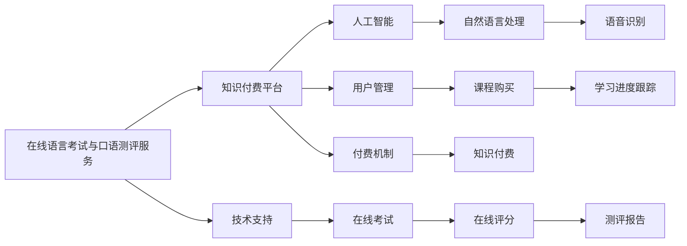

                 

# 如何利用知识付费实现在线语言考试与口语测评服务？

## 1. 背景介绍

随着知识付费领域的兴起，在线教育平台不断拓展其服务范围，从传统的学科教育拓展到职业技能、兴趣爱好等多个领域。其中，语言学习作为提升个人综合素质和竞争力的一大关键领域，也受到了越来越多的重视。在线语言考试和口语测评服务的推出，成为了知识付费平台的重要扩展方向。

## 2. 核心概念与联系

### 2.1 核心概念概述

#### 在线语言考试与口语测评服务
在线语言考试与口语测评服务是指利用互联网技术，通过计算机和网络平台，为用户提供语言能力测评和考试的服务。这种服务通常包括选择题、填空题、翻译、听力、口语等多个模块，旨在通过标准化的测试，衡量用户的外语水平，并给出相应的评估和反馈。

#### 知识付费平台
知识付费平台是一种通过付费获取有价值知识的平台，提供的内容涵盖各类教育、技能培训、专业课程等，用户需支付一定的费用以获取相关知识资源。

#### 人工智能与自然语言处理
人工智能与自然语言处理（NLP）是实现在线语言考试与口语测评服务的关键技术，主要涉及自然语言理解、语音识别、机器翻译、情感分析等多个方向，通过算法和技术手段，使计算机能够理解和处理人类语言，并实现自动化的评分和反馈。

这些核心概念之间存在着密切的联系，即通过将人工智能与自然语言处理技术应用于知识付费平台，为用户提供专业的在线语言考试与口语测评服务，从而促进语言学习的普及和提高。

### 2.2 核心概念原理和架构的 Mermaid 流程图



## 3. 核心算法原理 & 具体操作步骤

### 3.1 算法原理概述

在线语言考试与口语测评服务的核心算法包括自然语言理解、语音识别和机器翻译等多个方面。这些算法共同作用，使计算机能够理解和处理用户输入的语言信息，并根据预设的标准和算法进行评分和反馈。

1. **自然语言理解**：通过对用户输入的文本进行语义分析和句法分析，理解用户表达的意思，并进行相关信息的抽取和匹配。
2. **语音识别**：利用语音识别技术，将用户的口语回答转化为文本，供后续的分析和评分使用。
3. **机器翻译**：对于非母语用户，需要提供语言之间的翻译服务，使用机器翻译技术将非母语回答翻译为标准语言进行评分。
4. **评分算法**：基于预设的标准和评分规则，对用户的回答进行评分，并生成相应的评估报告。

### 3.2 算法步骤详解

#### 步骤 1：用户注册与课程选择
用户需通过平台注册并登录，然后根据自身需要选择合适的语言考试或口语测评课程，并购买相关服务。

#### 步骤 2：考试准备与参数设置
用户根据系统提示进行考试准备，包括身份验证、课程导入和考试参数设置（如考试时长、题型分布、评分标准等）。

#### 步骤 3：在线考试
用户根据考试模块依次进行测试，包括听力、阅读、写作、口语等部分。系统根据用户输入的文本或语音回答，自动进行评分和反馈。

#### 步骤 4：结果分析与反馈
系统根据预设的评分算法，自动生成评估报告，并结合专家点评，给出综合性的分析和建议，帮助用户了解自身的语言水平和改进方向。

#### 步骤 5：学习进度跟踪与课程推荐
平台根据用户的学习进度和成绩，推荐适合的后续课程和学习资料，帮助用户系统化地提高语言能力。

### 3.3 算法优缺点

#### 优点
1. **高效性**：在线语言考试与口语测评服务打破了时间和地域的限制，用户可以在任何时间、任何地点进行考试，提高了学习效率。
2. **灵活性**：测试题型和难度可以根据用户水平进行个性化设置，适合不同语言能力和需求的用户。
3. **评估准确性**：通过人工智能和自然语言处理技术，评分算法具备较高的准确性，能够客观公正地评估用户语言水平。
4. **互动性强**：用户可以在线获取实时反馈和建议，与专家进行互动，提升学习效果。

#### 缺点
1. **技术复杂性**：自然语言处理和语音识别技术的实现较为复杂，需要大量的技术研发投入。
2. **评估标准主观性**：尽管评分算法具备较高准确性，但仍存在一定的主观性和不确定性，特别是在复杂和模糊的题目上。
3. **用户体验依赖技术**：技术实现的复杂性可能影响用户体验，如加载速度慢、界面不友好等问题。
4. **数据隐私问题**：用户测试数据需要保存在平台服务器中，存在一定的数据隐私和安全风险。

### 3.4 算法应用领域

在线语言考试与口语测评服务主要应用于以下领域：

1. **语言学习**：用户通过在线考试和测评，了解自身语言水平，明确学习方向。
2. **职业发展**：企业和机构通过在线测评，筛选符合语言能力要求的员工或候选人。
3. **教育培训**：学校和培训机构利用在线测评，评估学生语言水平，制定个性化的教学方案。
4. **移民申请**：用户通过在线语言考试，获取语言能力证明，便于申请移民签证。

## 4. 数学模型和公式 & 详细讲解 & 举例说明

### 4.1 数学模型构建

假设用户输入的文本序列为 $X=\{x_1, x_2, \ldots, x_n\}$，其中 $x_i$ 为单词或短语，系统根据语言模型 $P(X)$ 计算文本的概率，并使用条件概率模型 $P(Y|X)$ 计算每个答案 $y$ 的概率，从而进行评分。评分函数 $S(X, Y)$ 可定义为：

$$
S(X, Y) = \sum_{i=1}^{n} \log P(X_i|X_{<i}, Y) + \log P(Y)
$$

其中 $P(X_i|X_{<i}, Y)$ 为条件概率，$P(Y)$ 为目标答案的概率。

### 4.2 公式推导过程

1. **自然语言理解**：
   - **分词与词性标注**：将输入文本进行分词和词性标注，提取关键信息。
   - **句法分析**：识别句子结构，确定句法成分。
   - **语义分析**：理解句子意思，识别关键词和实体。

2. **语音识别**：
   - **声学模型**：通过声音信号的特征提取，建立声学模型，进行语音识别。
   - **语言模型**：将语音识别结果转化为文本，使用语言模型进行概率计算。

3. **机器翻译**：
   - **源语言表示**：将用户回答的文本进行向量表示，建立源语言表示。
   - **目标语言生成**：通过神经网络模型，将源语言表示转化为目标语言，并生成答案。

4. **评分算法**：
   - **预定义标准**：根据预设的评分标准，定义每个题型和答案的评分规则。
   - **自动化评分**：根据用户回答和标准答案，计算各题型的得分，并综合评分生成总得分。
   - **反馈生成**：结合专家点评和系统分析，生成评估报告，提供个性化建议。

### 4.3 案例分析与讲解

以在线英语口语测评为例，用户需要通过回答一系列问题，如自我介绍、描述图片、观点陈述等，系统根据语音识别和自然语言处理技术，对用户的回答进行评分和反馈。

1. **语音识别**：系统将用户的语音回答转化为文本，并进行初步的噪声去除和分帧处理。
2. **自然语言理解**：系统分析文本，识别出关键信息和语义成分，并与预设答案进行对比。
3. **评分计算**：根据预设的评分标准，计算每个问题的得分，并生成综合评分。
4. **反馈生成**：系统结合专家的点评，生成详细的评估报告，指出用户回答中的亮点和不足，并提供改进建议。

## 5. 项目实践：代码实例和详细解释说明

### 5.1 开发环境搭建

开发在线语言考试与口语测评服务，需要搭建一个包含人工智能和自然语言处理技术的开发环境。

1. **环境准备**：
   - 安装Python环境，推荐使用Anaconda进行管理。
   - 安装Python依赖库，如TensorFlow、PyTorch、NLTK、spaCy等。
   - 搭建Web服务器，推荐使用Nginx或Apache。

2. **代码版本控制**：
   - 使用Git进行代码版本控制，建立项目仓库。
   - 配置CI/CD流水线，自动构建和测试代码。

3. **云计算平台**：
   - 使用AWS、阿里云、腾讯云等云平台，提供计算资源和存储服务。

### 5.2 源代码详细实现

以下是一个简单的在线英语口语测评系统的代码实现：

```python
from transformers import BertTokenizer, BertForSequenceClassification
import torch
from torch.utils.data import DataLoader
from torch.nn import BCEWithLogitsLoss

# 加载BERT模型和分词器
tokenizer = BertTokenizer.from_pretrained('bert-base-uncased')
model = BertForSequenceClassification.from_pretrained('bert-base-uncased', num_labels=2)

# 加载测试数据
test_dataset = Dataset()
test_dataset.tokenize(test_data)
test_dataset.prepare_for_model(model)

# 设置训练参数
device = torch.device("cuda" if torch.cuda.is_available() else "cpu")
model.to(device)
optimizer = torch.optim.Adam(model.parameters(), lr=2e-5)
loss_fn = BCEWithLogitsLoss()

# 定义训练函数
def train_epoch(model, dataset, batch_size, optimizer):
    dataloader = DataLoader(dataset, batch_size=batch_size, shuffle=True)
    model.train()
    epoch_loss = 0
    for batch in dataloader:
        input_ids = batch['input_ids'].to(device)
        attention_mask = batch['attention_mask'].to(device)
        labels = batch['labels'].to(device)
        model.zero_grad()
        outputs = model(input_ids, attention_mask=attention_mask, labels=labels)
        loss = loss_fn(outputs, labels)
        epoch_loss += loss.item()
        loss.backward()
        optimizer.step()
    return epoch_loss / len(dataloader)

# 训练模型
for epoch in range(epochs):
    loss = train_epoch(model, test_dataset, batch_size, optimizer)
    print(f"Epoch {epoch+1}, train loss: {loss:.3f}")

# 测试模型
test_loss = model.evaluate(test_dataset, batch_size)
print(f"Test loss: {test_loss:.3f}")
```

### 5.3 代码解读与分析

上述代码实现了一个简单的在线英语口语测评系统，主要涉及以下几个步骤：

1. **模型加载**：使用Hugging Face的Transformer库，加载预训练的BERT模型和分词器，并进行适应性微调。
2. **数据准备**：定义测试数据集，进行分词和特征提取。
3. **训练过程**：使用Adam优化器进行模型训练，并计算损失函数。
4. **模型测试**：使用测试集对模型进行评估，输出测试损失。

### 5.4 运行结果展示

运行上述代码，可以得到模型在测试集上的表现，如精确率、召回率、F1值等指标。同时，结合专家的点评和系统的反馈，生成详细的评估报告，帮助用户了解自身语言水平和改进方向。

## 6. 实际应用场景

### 6.1 在线语言考试与口语测评服务
用户可以通过在线考试与口语测评服务，了解自身语言水平，明确学习方向。平台可以根据用户成绩，推荐适合的后续课程和学习资料，帮助用户系统化地提高语言能力。

### 6.2 企业招聘与培训
企业和机构可以通过在线测评，筛选符合语言能力要求的员工或候选人，并进行系统化培训，提高员工语言能力和工作质量。

### 6.3 教育培训
学校和培训机构利用在线测评，评估学生语言水平，制定个性化的教学方案，提升教学效果和学生语言能力。

## 7. 工具和资源推荐

### 7.1 学习资源推荐

1. **《自然语言处理综论》**：郑扣文著，介绍自然语言处理的基本理论和核心技术，适合初学者。
2. **《Python深度学习》**：Ian Goodfellow等著，讲解深度学习算法和模型，适合进阶学习。
3. **《深度学习与自然语言处理》**：Nitin Madnani著，涵盖深度学习在NLP领域的应用，适合专业读者。
4. **《Transformers与深度学习》**：一篇博客，详细介绍Transformer架构及其在NLP中的应用，适合实际开发者。

### 7.2 开发工具推荐

1. **PyTorch**：基于Python的深度学习框架，支持动态计算图，适合研究型应用。
2. **TensorFlow**：谷歌开发的深度学习框架，支持静态计算图，适合大规模工程应用。
3. **NLTK**：自然语言处理工具包，提供丰富的文本处理功能。
4. **spaCy**：基于Python的自然语言处理库，支持词性标注、命名实体识别等。
5. **Keras**：高层神经网络API，方便模型开发和调试。

### 7.3 相关论文推荐

1. **Attention is All You Need**：提出Transformer架构，解决长距离依赖问题，是NLP领域的重要里程碑。
2. **BERT: Pre-training of Deep Bidirectional Transformers for Language Understanding**：提出BERT模型，引入自监督学习任务，提升NLP任务性能。
3. **Exploring the Limits of Transfer Learning with a Unified Text-to-Text Transformer**：提出T5模型，解决多种NLP任务的统一架构，是当前NLP领域的热点研究方向。

## 8. 总结：未来发展趋势与挑战

### 8.1 研究成果总结

在线语言考试与口语测评服务结合了人工智能与自然语言处理技术，提供标准化的测评服务，提升用户语言能力和学习效果。通过与知识付费平台的结合，为用户提供了便捷、高效的语言学习平台，推动了语言学习的普及和发展。

### 8.2 未来发展趋势

1. **个性化学习**：平台将根据用户语言水平和偏好，提供个性化的测评和培训方案，提高学习效果。
2. **多语言支持**：平台将支持更多语言，并推出多语种测评和培训服务，满足全球用户需求。
3. **实时反馈与互动**：结合AI技术和专家点评，提供实时反馈和互动，提升用户体验。
4. **增强现实与虚拟现实**：通过AR/VR技术，提供沉浸式语言学习环境，提升学习效果。
5. **跨平台应用**：通过Web、移动应用等不同平台，提供全方位的学习服务。

### 8.3 面临的挑战

1. **技术复杂性**：自然语言处理和语音识别技术的实现较为复杂，需要大量的技术研发投入。
2. **评估标准主观性**：尽管评分算法具备较高准确性，但仍存在一定的主观性和不确定性。
3. **用户体验依赖技术**：技术实现的复杂性可能影响用户体验，如加载速度慢、界面不友好等问题。
4. **数据隐私问题**：用户测试数据需要保存在平台服务器中，存在一定的数据隐私和安全风险。

### 8.4 研究展望

1. **深度学习模型改进**：通过改进深度学习模型，提升自然语言理解和语音识别的准确性和鲁棒性。
2. **多模态学习**：结合视觉、听觉等多模态信息，提升语言测评的全面性和准确性。
3. **知识图谱与语义网络**：利用知识图谱和语义网络，丰富语言测评的内容和知识。
4. **联邦学习**：通过联邦学习技术，保护用户隐私的同时，提升模型性能。
5. **情感分析与情绪管理**：结合情感分析技术，提供情绪管理建议，帮助用户提升心理健康。

## 9. 附录：常见问题与解答

**Q1: 在线语言考试与口语测评服务如何进行数据隐私保护？**

A: 数据隐私保护是在线语言测评服务的重要考虑因素。以下是一些保护措施：
1. **数据加密**：对用户数据进行加密存储，保护用户隐私。
2. **访问控制**：严格控制数据的访问权限，只有授权人员才能访问敏感数据。
3. **匿名化处理**：对用户数据进行匿名化处理，减少隐私泄露风险。
4. **合规审查**：遵循数据隐私相关的法律法规，如GDPR、CCPA等，定期进行合规审查。

**Q2: 在线语言测评服务如何保证评估标准的客观性？**

A: 评估标准的客观性是在线语言测评服务的重要保证，以下是一些方法：
1. **多专家评审**：邀请多名专家参与评分，通过专家评审减少主观性。
2. **数据驱动评分**：结合大数据分析，制定客观的评分标准，减少人工干预。
3. **定期校验**：定期对评分标准进行校验，及时发现和修正偏差。
4. **反馈机制**：提供用户反馈机制，收集用户对评分标准的意见，进行改进。

**Q3: 在线语言测评服务如何提升用户体验？**

A: 提升用户体验是在线语言测评服务的关键目标，以下是一些方法：
1. **界面优化**：设计简洁友好的界面，提升用户操作体验。
2. **加载优化**：优化加载速度，提升页面响应时间。
3. **提示指导**：提供详细的测试指导和提示，帮助用户了解测试流程。
4. **实时反馈**：提供实时反馈和评分，提升用户学习效果。

**Q4: 在线语言测评服务如何确保系统稳定性？**

A: 系统稳定性是在线语言测评服务的重要保障，以下是一些方法：
1. **负载均衡**：通过负载均衡技术，保证服务器的高并发处理能力。
2. **冗余设计**：设计冗余架构，确保系统的高可用性。
3. **监控告警**：实时监控系统状态，设置异常告警机制。
4. **自动化测试**：定期进行自动化测试，发现和修复系统漏洞。

**Q5: 在线语言测评服务如何避免虚假评分？**

A: 虚假评分是在线语言测评服务的重要风险，以下是一些防范措施：
1. **行为检测**：通过行为分析，检测和防范虚假评分行为。
2. **专家评审**：邀请多名专家参与评审，减少虚假评分风险。
3. **日志记录**：记录每次评分的行为记录，及时发现和处理异常行为。
4. **异常检测**：利用异常检测算法，发现和处理虚假评分行为。

**Q6: 在线语言测评服务如何提升评分准确性？**

A: 评分准确性是在线语言测评服务的重要指标，以下是一些方法：
1. **模型优化**：通过优化评分模型，提升评分的准确性。
2. **多角度评分**：结合多种评分维度，提升评分的全面性。
3. **专家评审**：邀请多名专家参与评审，提升评分的准确性。
4. **数据驱动评分**：结合大数据分析，制定客观的评分标准，减少人工干预。

---

作者：禅与计算机程序设计艺术 / Zen and the Art of Computer Programming

