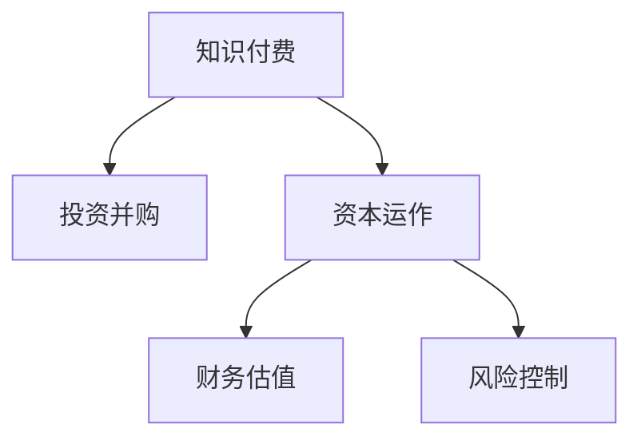

                 

# 如何利用知识付费实现投资并购与资本运作？

## 1. 背景介绍

### 1.1 问题由来
近年来，知识付费模式在全球范围内迅速兴起，成为知识传播和分享的重要渠道。知识付费不仅能够快速满足用户个性化、多元化的知识需求，还能有效整合和利用碎片化信息，提高知识利用效率。特别是在资本密集型领域如投资并购与资本运作，知识付费成为一种重要的资源获取方式。

### 1.2 问题核心关键点
知识付费在投资并购与资本运作中的应用，不仅涉及知识的获取与筛选，更关乎资本的投入与产出、并购策略的制定与实施。成功的投资并购需要依托深入市场调研、透彻的业务分析、精准的财务估值以及有效的风险控制。而知识付费恰好能提供全方位的信息支持和专业知识，降低决策风险，提升决策质量。

## 2. 核心概念与联系

### 2.1 核心概念概述

为更好地理解知识付费在投资并购与资本运作中的应用，本节将介绍几个密切相关的核心概念：

- 知识付费：指用户为获取知识、技能和信息而支付费用的模式，常见的形式包括在线课程、专栏文章、音频视频等。
- 投资并购：指企业或个人通过资本运作，获取其他企业的所有权或控制权的行为，常见的形式包括股票购买、资产收购、股权投资等。
- 资本运作：指利用资本在不同主体、不同项目之间进行优化配置和价值创造的活动，包括融资、投资、并购等。
- 财务估值：指通过量化分析企业的财务数据，评估其内在价值的流程。
- 风险控制：指采取措施以降低或消除可能发生的损失，确保资本运作的安全性。

这些核心概念之间的逻辑关系可以通过以下Mermaid流程图来展示：



这个流程图展示的知识付费与其他核心概念的关系：

1. 知识付费为投资并购和资本运作提供信息支持。
2. 资本运作离不开深入的财务估值和风险控制，而知识付费能提供专业的财务估值和风险控制知识。
3. 知识付费是实现资本运作的桥梁，通过知识付费获取必要信息，进而支持投资并购等活动。

## 3. 核心算法原理 & 具体操作步骤

### 3.1 算法原理概述

知识付费在投资并购与资本运作中的应用，本质上是一种信息获取与价值评估的过程。其核心思想是：利用知识付费平台获取高价值的市场信息、行业洞察和专家意见，对企业或项目进行综合评估，最终作出投资并购决策。

形式化地，假设投资并购目标企业为 $E$，资本运作方案为 $M$。知识付费平台提供的信息和知识为 $I$，则投资并购的优化目标是最小化成本，即找到最优的 $M$，使得：

$$
\min_{M} C(M) = C(\text{购买成本}(E)) + C(\text{并购成本}(M)) + C(\text{运营成本}(M))
$$

其中，$C$ 表示成本函数，涉及企业购买、并购和运营的成本。而目标函数中的每一项成本都可以通过知识付费平台获取到的信息进行优化。

### 3.2 算法步骤详解

知识付费在投资并购与资本运作中的应用，一般包括以下几个关键步骤：

**Step 1: 准备并购目标和资本运作方案**
- 确定投资并购目标企业 $E$，包括企业的行业背景、财务状况、核心竞争力等。
- 准备不同规模和形式的资本运作方案 $M$，如股票收购、资产转让、管理层收购等。

**Step 2: 收集知识付费信息**
- 选择知识付费平台，如Coursera、Udemy、Khan Academy等，获取与目标企业相关的市场信息、行业报告、专家分析等内容。
- 选择与并购相关的专业课程、讲座、研究报告等，进行深度学习。

**Step 3: 进行财务估值**
- 利用收集到的信息，使用财务估值模型（如DCF、FCFF等），对目标企业进行内在价值评估。
- 结合行业基准、市场趋势等因素，对估值结果进行调整。

**Step 4: 风险控制与决策分析**
- 识别并购过程中可能面临的风险（如整合风险、法律风险、市场风险等）。
- 利用风险管理工具（如蒙特卡罗模拟、敏感性分析等）进行风险评估。
- 综合考虑财务估值和风险控制的结果，制定投资并购策略。

**Step 5: 实施并购与资本运作**
- 根据制定好的投资并购策略，进行具体的并购操作，如谈判、签署协议等。
- 实施资本运作方案 $M$，进行后续的整合、运营等工作。

### 3.3 算法优缺点

知识付费在投资并购与资本运作中的应用，具有以下优点：
1. 知识获取高效。通过知识付费平台，可以快速获取高质量的市场信息、行业洞察和专家意见，缩短信息获取时间。
2. 专业支持全面。知识付费提供全面的财务估值、风险控制等专业知识，为投资并购决策提供科学依据。
3. 降低决策风险。借助专家意见和行业洞察，可以有效识别和规避潜在的投资并购风险。
4. 操作灵活多样。知识付费支持多种形式的内容获取，如在线课程、专栏文章、视频讲座等，灵活选择，方便适用。

同时，该方法也存在一定的局限性：
1. 信息质量参差不齐。知识付费平台上的信息质量参差不齐，部分内容可能缺乏深度和可靠性。
2. 获取成本较高。高价值的市场信息和专家意见通常需要付费获取，成本较高。
3. 依赖平台选择。选择合适的知识付费平台，获取可靠的信息，需要花费大量时间和精力。
4. 内容更新不及时。知识付费平台的内容更新往往滞后于市场动态，影响决策的及时性。

尽管存在这些局限性，但就目前而言，知识付费已成为投资并购与资本运作的重要信息来源。未来相关研究的重点在于如何优化知识付费平台的选择和使用，降低信息获取成本，提高内容质量和时效性。

### 3.4 算法应用领域

知识付费在投资并购与资本运作中的应用，已经得到了广泛的应用，覆盖了包括但不限于以下几个领域：

- 上市公司的财务分析与估值：通过知识付费平台获取行业分析、财务报告等，进行上市公司的内在价值评估。
- 企业的并购尽职调查：利用知识付费平台上的法律、财务、市场分析等，进行全面的尽职调查。
- 投资组合管理：借助知识付费平台获取的行业洞察和专家意见，进行投资组合的优化和调整。
- 风险投资决策：通过知识付费平台获取的行业趋势、市场动态等，进行风险投资项目的筛选和评估。
- 资产配置与融资：利用知识付费平台上的金融工具、投资策略等，进行资产配置和融资安排。

除了上述这些经典应用外，知识付费还被创新性地应用到更多场景中，如初创企业的商业计划书撰写、创业公司的战略规划等，为投资并购与资本运作提供了新的思路。

## 4. 数学模型和公式 & 详细讲解 & 举例说明

### 4.1 数学模型构建

本节将使用数学语言对知识付费在投资并购与资本运作中的应用进行更加严格的刻画。

假设知识付费平台提供的信息和知识为 $I$，其中包含市场信息 $I_{\text{market}}$、行业洞察 $I_{\text{industry}}$、专家意见 $I_{\text{expert}}$ 等。投资并购目标企业为 $E$，其内在价值为 $V$，资本运作方案为 $M$。财务估值模型为 $F$，风险控制模型为 $R$。则投资并购的优化目标是最小化成本，即找到最优的 $M$，使得：

$$
\min_{M} C(M) = C(\text{购买成本}(E)) + C(\text{并购成本}(M)) + C(\text{运营成本}(M))
$$

其中，$C$ 表示成本函数，涉及企业购买、并购和运营的成本。

### 4.2 公式推导过程

以下我们以上市公司的财务分析与估值为例，推导DCF模型及其参数的计算公式。

假设上市公司 $E$ 的财务数据为 $F$，包括收入 $R_i$、成本 $C_i$、折旧 $D_i$、税前利润 $P_i$、税率 $t$ 等。则公司未来自由现金流（FCFF）的预测公式为：

$$
FCFF_i = R_i - C_i - D_i + (P_i - t \cdot P_i) + (C_i + D_i)
$$

将其代入DCF模型，得：

$$
V = \sum_{i=1}^{n} \frac{FCFF_i}{(1+r)^i}
$$

其中，$n$ 表示预测期数，$r$ 为折现率。

在得到DCF模型后，将其与目标企业 $E$ 的实际财务数据 $F$ 结合，进行参数调整，最终得到目标企业 $E$ 的内在价值 $V$。

### 4.3 案例分析与讲解

假设某投资公司欲并购一家科技公司，通过知识付费平台获取了该公司的财务报告、行业报告、专家分析等。根据这些信息，使用DCF模型进行内在价值评估，得：

$$
V = \frac{10}{1.1} + \frac{12}{1.1^2} + \frac{15}{1.1^3} + \ldots
$$

进一步结合公司实际情况，调整折现率和预测期数，最终得到并购的合理价格区间。在实施并购时，还需结合风险控制模型，评估并购风险，制定应对策略。

## 5. 项目实践：代码实例和详细解释说明

### 5.1 开发环境搭建

在进行知识付费在投资并购与资本运作中的应用实践前，我们需要准备好开发环境。以下是使用Python进行投资并购决策的开发环境配置流程：

1. 安装Anaconda：从官网下载并安装Anaconda，用于创建独立的Python环境。

2. 创建并激活虚拟环境：
```bash
conda create -n investment-env python=3.8 
conda activate investment-env
```

3. 安装必要的Python库：
```bash
conda install pandas numpy matplotlib scikit-learn seaborn
```

4. 安装特定于知识付费和财务估值的软件包：
```bash
pip install googlefinance yfinance fmpy
```

5. 安装图形化工具包：
```bash
pip install plotly
```

完成上述步骤后，即可在`investment-env`环境中开始知识付费在投资并购与资本运作中的应用实践。

### 5.2 源代码详细实现

下面以DCF模型在投资并购中的应用为例，给出使用Python进行财务估值和风险控制的代码实现。

```python
import numpy as np
import matplotlib.pyplot as plt
from fmpy import get_price, DiscountedCashFlow
import plotly.graph_objects as go

# 假设公司A的财务数据
income = [100, 120, 140, 160, 180]
cost = [70, 80, 90, 100, 110]
depreciation = [20, 15, 10, 5, 0]
profits_before_tax = [20, 30, 40, 50, 60]
tax_rate = 0.25
periods = 5

# 计算自由现金流
fcff = [income[i] - cost[i] - depreciation[i] + (profits_before_tax[i] - tax_rate * profits_before_tax[i]) + cost[i] + depreciation[i]
       for i in range(len(income))]

# 构建DCF模型
discount_rate = 0.1
value = DiscountedCashFlow(np.array(fcff), periods, discount_rate)
print("公司A的内在价值为：", value.calculate())

# 绘制自由现金流折线图
fig = go.Figure(data=[go.Scatter(x=range(len(fcff)), y=fcff, name='FCFF')])
fig.update_layout(title='公司A自由现金流折线图', xaxis_title='时间', yaxis_title='自由现金流')
fig.show()

# 绘制DCF模型折线图
fig = go.Figure(data=[go.Scatter(x=range(periods), y=value.calculate())])
fig.update_layout(title='公司A的DCF模型折线图', xaxis_title='时间', yaxis_title='DCF值')
fig.show()
```

以上代码展示了如何使用Python和FMPY库进行DCF模型的构建和展示。在实践中，可以根据需要进一步优化和扩展代码，如添加风险控制模型的引入和展示，以及更复杂的多元财务指标的计算等。

### 5.3 代码解读与分析

让我们再详细解读一下关键代码的实现细节：

**投资并购决策框架**：
- 使用FMPY库获取公司财务数据。
- 计算自由现金流（FCFF）。
- 构建DCF模型，计算公司的内在价值。
- 使用Plotly绘制自由现金流折线图和DCF模型折线图，展示数据和模型。

**数据处理与分析**：
- 使用NumPy进行数据处理和计算。
- 使用Matplotlib绘制静态折线图。
- 使用Plotly绘制动态折线图，增强展示效果。

**代码注释**：
- 关键变量和函数进行详细注释，使代码更易于理解。
- 使用print函数输出计算结果。
- 使用update_layout函数优化图表布局，提高展示效果。

可以看到，Python和相关库为财务估值和投资并购决策提供了强大的工具支持。开发者可以根据具体需求，对代码进行扩展和优化，实现更复杂、灵活的财务分析与估值。

## 6. 实际应用场景

### 6.1 投资公司并购决策

知识付费在投资公司并购决策中的应用，主要体现在以下几个方面：

**市场调研**：
通过知识付费平台获取目标公司所在的行业报告、市场分析、竞争对手情况等，了解市场环境和竞争态势。

**财务估值**：
利用财务估值模型（如DCF、FCFF、FCFE等），结合目标公司的财务数据，进行内在价值的评估。

**尽职调查**：
通过知识付费平台获取目标公司的法律文件、审计报告、环保合规等，进行全面的尽职调查，识别潜在风险。

**投资决策**：
结合财务估值和尽职调查的结果，综合考虑风险控制和战略规划，制定投资并购方案。

**实施与管理**：
实施并购操作，后续进行整合、运营等工作，跟踪投资效果，调整投资策略。

### 6.2 风险投资基金投资决策

知识付费在风险投资基金投资决策中的应用，主要体现在以下几个方面：

**项目筛选**：
通过知识付费平台获取创业公司的行业报告、创业团队背景、技术创新等，进行项目的初步筛选。

**投资评估**：
利用财务估值模型（如DCF、NPV等），结合项目的财务数据，进行项目的内在价值评估。

**风险评估**：
通过知识付费平台获取项目的技术细节、市场预测、法律风险等，进行风险评估，制定风险控制策略。

**投资决策**：
综合考虑项目的财务评估和风险评估，制定投资方案，并进行投资决策。

**投资后管理**：
投资后，通过知识付费平台获取行业动态、市场趋势等，进行持续跟踪和监控，及时调整投资策略。

### 6.3 未来应用展望

随着知识付费模式的不断发展和完善，其在投资并购与资本运作中的应用也将更加广泛和深入。未来可能的发展方向包括：

- 自动化投资决策：利用机器学习和自然语言处理技术，自动分析和筛选投资项目，辅助决策。
- 实时动态监控：通过知识付费平台获取实时的市场信息和行业动态，进行动态监控和调整，提升投资决策的及时性和准确性。
- 多模态数据整合：将知识付费平台的多模态数据（如文本、图像、视频等）进行整合，进行更全面的投资分析。
- 跨领域应用推广：将知识付费技术应用于更多的垂直领域，如医疗、教育、能源等，为不同领域的投资并购提供支持。

## 7. 工具和资源推荐

### 7.1 学习资源推荐

为了帮助开发者系统掌握知识付费在投资并购与资本运作中的应用，这里推荐一些优质的学习资源：

1. Coursera《投资分析与并购》课程：斯坦福大学开设的高级投资分析课程，涵盖财务估值、投资并购等核心内容，适合进阶学习。
2. Udemy《资本运作与投资并购》课程：多门实用课程，覆盖投资并购的各个环节，适合入门学习。
3. FMPY官方文档：FMPY库的官方文档，提供了详尽的使用指南和案例示例，是进行财务估值的重要参考资料。
4. Google Finance：提供全球范围内的公司财务数据和市场信息，支持自定义查询和导出。
5. Kaggle金融数据集：大量公开的金融数据集，涵盖股票、债券、基金等各类资产，是进行金融分析的好资料。

通过对这些资源的学习实践，相信你一定能够快速掌握知识付费在投资并购与资本运作中的应用精髓，并用于解决实际的投资决策问题。

### 7.2 开发工具推荐

高效的开发离不开优秀的工具支持。以下是几款用于知识付费在投资并购与资本运作中的应用开发的常用工具：

1. Python：强大的编程语言，支持高效的数值计算和数据分析。
2. Jupyter Notebook：交互式编程环境，支持代码、文本、图像等多种形式的展示，便于协作和分享。
3. R语言：统计分析工具，适合进行复杂的数据建模和统计分析。
4. Excel：简单易用的电子表格软件，适合进行基本的财务分析和决策支持。
5. Tableau：数据可视化工具，支持多种数据源的导入和展示，便于数据分析和决策支持。

合理利用这些工具，可以显著提升知识付费在投资并购与资本运作中的应用开发效率，加快创新迭代的步伐。

### 7.3 相关论文推荐

知识付费在投资并购与资本运作中的应用，源于学界的持续研究。以下是几篇奠基性的相关论文，推荐阅读：

1. "Investment Valuation: Tools and Techniques for Determining the Value of Any Asset"（《投资估值：评估任何资产的工具和技术》）：一本经典的投资估值工具书，详细介绍了各种投资估值模型和方法。
2. "The Valuation of the Firm: Fundamentals and Applications of the Discounted Cash Flow and Comparable Firm Valuation Techniques"（《公司估值：现金流折现法和可比公司估值技术的基础与应用》）：一篇关于公司估值方法的综述性论文，介绍了DCF、FCFF、FCFE等模型的原理和应用。
3. "A Survey of Investment Decisions: A Behavioral Finance Perspective"（《投资决策综述：行为金融学的视角》）：一篇行为金融学的综述性论文，讨论了投资决策中的心理因素和行为偏差。
4. "The Effect of Market Sentiment on Stock Returns"（《市场情绪对股票收益的影响》）：一篇金融市场情绪的实证研究论文，探讨了情绪波动对股票价格的影响。
5. "Machine Learning in Finance: Applications and Challenges"（《金融领域的机器学习应用与挑战》）：一篇关于金融领域机器学习的综述性论文，讨论了机器学习在投资决策、风险控制等的应用和挑战。

这些论文代表了大规模语言模型微调技术的发展脉络。通过学习这些前沿成果，可以帮助研究者把握学科前进方向，激发更多的创新灵感。

## 8. 总结：未来发展趋势与挑战

### 8.1 总结

本文对知识付费在投资并购与资本运作中的应用进行了全面系统的介绍。首先阐述了知识付费模式在投资并购与资本运作中的研究背景和意义，明确了知识付费在信息获取、财务估值、风险控制等方面的独特价值。其次，从原理到实践，详细讲解了知识付费在投资并购与资本运作中的应用流程，给出了投资并购决策的完整代码实例。同时，本文还广泛探讨了知识付费在多个投资并购场景中的应用前景，展示了知识付费范式的广泛适用性。此外，本文精选了知识付费的相关学习资源，力求为读者提供全方位的技术指引。

通过本文的系统梳理，可以看到，知识付费在投资并购与资本运作中的应用，已经成为投资决策的重要信息支持手段。知识付费提供的高质量信息、专业知识和实时动态分析，极大地提升了投资决策的科学性和准确性。未来，伴随知识付费模式的不断发展和完善，其在投资并购与资本运作中的应用将更加深入，推动金融领域的智能化和自动化进程。

### 8.2 未来发展趋势

展望未来，知识付费在投资并购与资本运作中的应用将呈现以下几个发展趋势：

1. 自动化投资决策：通过机器学习和大数据分析技术，自动筛选和分析投资项目，辅助决策，提升决策效率。
2. 实时动态监控：利用知识付费平台提供的实时市场信息和行业动态，进行动态监控和调整，提升投资决策的及时性和准确性。
3. 跨领域应用推广：将知识付费技术应用于更多的垂直领域，如医疗、教育、能源等，为不同领域的投资并购提供支持。
4. 多模态数据整合：将知识付费平台的多模态数据（如文本、图像、视频等）进行整合，进行更全面的投资分析。
5. 个性化推荐系统：利用知识付费平台的用户行为数据，进行个性化推荐，提升用户体验和投资效果。

以上趋势凸显了知识付费在投资并购与资本运作中的巨大潜力。这些方向的探索发展，必将进一步提升投资决策的智能化和自动化水平，为金融领域的数字化转型注入新的动力。

### 8.3 面临的挑战

尽管知识付费在投资并购与资本运作中的应用已经取得了初步成果，但在迈向更加智能化、普适化应用的过程中，仍面临诸多挑战：

1. 信息质量瓶颈。知识付费平台上的信息质量参差不齐，部分内容可能缺乏深度和可靠性，影响决策的科学性。
2. 数据获取成本高。高价值的市场信息和专家意见通常需要付费获取，成本较高，增加了投资决策的复杂性。
3. 技术实现难度大。投资并购决策涉及复杂的财务估值、风险控制等，需要丰富的技术和工具支持，开发难度较大。
4. 市场适应性不足。知识付费平台的内容和应用模式可能与特定市场的投资环境不匹配，需要进一步本地化适配。

尽管存在这些挑战，但通过不断优化知识付费平台的选择和使用，提高内容质量和时效性，降低信息获取成本，相信知识付费在投资并购与资本运作中的应用将进一步深化和普及。

### 8.4 研究展望

面对知识付费在投资并购与资本运作中所面临的挑战，未来的研究需要在以下几个方面寻求新的突破：

1. 数据源的多样化与优化。整合多种数据源，提升数据质量和可靠性，减少对单一数据源的依赖。
2. 技术算法的创新与应用。开发更加高效、智能的投资决策算法，支持多模态数据融合、动态监控等功能。
3. 用户行为分析与优化。通过分析用户行为数据，进行个性化推荐，提升用户体验和投资效果。
4. 跨领域模型的构建与应用。构建跨领域的知识付费模型，支持多领域的投资并购决策。
5. 投资决策的支持与监管。引入专家意见和政策法规，辅助投资决策，同时建立监管机制，确保投资决策的合规性和安全性。

这些研究方向的探索，必将引领知识付费在投资并购与资本运作中的应用迈向更高的台阶，为构建智能化的投资决策系统铺平道路。面向未来，知识付费需要与其他人工智能技术进行更深入的融合，如自然语言处理、机器学习等，多路径协同发力，共同推动金融领域的智能化和自动化进程。只有勇于创新、敢于突破，才能不断拓展知识付费的应用边界，让智能技术更好地造福金融市场。

## 9. 附录：常见问题与解答

**Q1：知识付费平台的选择与评估标准有哪些？**

A: 知识付费平台的选择与评估需要考虑以下几个方面：
1. 内容质量：选择内容质量高、信息丰富的平台，如Coursera、Udemy、Khan Academy等。
2. 时效性：选择更新频繁、数据实时的平台，如Google Finance、Yahoo Finance等。
3. 服务与支持：选择提供优质客服和售后支持的平台，如Udemy、Coursera等。
4. 社区与互动：选择有活跃社区和用户互动的平台，如Kaggle、Mindset等。
5. 用户评价与口碑：参考其他用户的评价和反馈，选择口碑良好的平台。

选择合适的知识付费平台，可以大幅提升知识获取的效率和质量，为投资并购决策提供坚实的支持。

**Q2：如何有效地筛选知识付费内容？**

A: 有效的知识付费内容筛选需要考虑以下几个方面：
1. 内容相关性：选择与投资并购相关的课程、文章、报告等，确保内容与决策需求匹配。
2. 专家信誉：选择知名专家和权威机构发布的内容，提高内容的可靠性和可信度。
3. 内容深度与广度：选择深度分析、广度覆盖的内容，确保获取全面的市场信息和行业洞察。
4. 用户评价与反馈：参考其他用户的评价和反馈，选择口碑良好的内容。
5. 内容时效性：选择更新频繁、时效性强的内容，确保获取最新的市场信息和行业动态。

通过有效的筛选，可以显著提高知识付费在投资并购与资本运作中的应用效果，提升决策的科学性和准确性。

**Q3：如何结合知识付费平台进行投资决策？**

A: 结合知识付费平台进行投资决策需要以下步骤：
1. 确定投资目标：明确投资目标和预期回报，选择合适的知识付费平台。
2. 收集相关信息：通过知识付费平台收集目标公司的财务数据、市场信息、行业报告等。
3. 进行财务估值：利用知识付费平台上的财务估值模型（如DCF、FCFF等），进行内在价值评估。
4. 风险控制分析：通过知识付费平台获取目标公司的法律文件、审计报告、环保合规等，进行全面的风险评估。
5. 制定投资策略：综合考虑财务估值和风险控制的结果，制定投资策略，并进行投资决策。
6. 实施与管理：实施投资操作，后续进行整合、运营等工作，跟踪投资效果，调整投资策略。

结合知识付费平台进行投资决策，可以充分利用平台提供的高质量信息、专业知识和实时动态分析，提升决策的科学性和准确性。

---

作者：禅与计算机程序设计艺术 / Zen and the Art of Computer Programming

