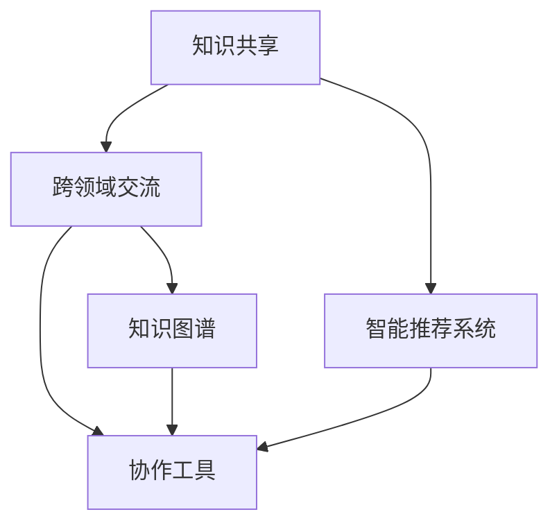

                 

# 如何利用知识社交促进跨界创新和协作

## 1. 背景介绍

### 1.1 问题由来

在科技迅猛发展的今天，单一领域的知识和技术已经难以满足越来越复杂的社会需求。跨界创新（Interdisciplinary Innovation）成为推动社会进步的重要动力。然而，跨界创新往往面临知识的隔离和跨领域协作困难等问题。传统的学术交流、会议等协作方式已经不能满足快速变化的需求。

因此，利用知识社交平台，促进跨界创新和协作，成为当前科技发展的必然趋势。知识社交平台不仅能帮助不同领域的专家获取最新的知识信息，还能促进跨领域知识交流，打破学科壁垒，实现知识的深度融合和创新。

### 1.2 问题核心关键点

知识社交平台的核心在于通过互联网技术，建立一个高效、开放的知识共享和交流网络。以下是几个核心关键点：

- **知识共享**：平台提供便捷的知识共享功能，使得专家和研究人员能够快速获取到最新的科研成果和前沿知识。
- **跨领域交流**：平台支持不同领域之间的交流互动，促进知识的跨领域传播和融合。
- **协作工具**：平台提供协作工具，帮助跨领域团队高效协同工作。
- **知识图谱**：平台通过构建知识图谱，帮助用户发现和关联知识节点，实现知识网络的可视化。

这些关键点共同构成了知识社交平台的基本框架，使其能够高效地促进跨界创新和协作。

### 1.3 问题研究意义

利用知识社交平台，促进跨界创新和协作，具有重要意义：

- **加速知识传播**：通过知识社交平台，专家和研究人员可以快速获取到最新的科研成果和前沿知识，加速科学研究的进展。
- **提升创新效率**：平台提供了高效的跨领域协作工具，帮助研究人员快速发现和解决问题，提升创新效率。
- **打破学科壁垒**：平台促进了不同领域的知识交流和合作，打破了学科之间的壁垒，推动了跨界创新的发展。
- **优化资源配置**：平台可以动态调配跨界团队资源，提高资源利用效率，优化科研方向和创新项目。

因此，如何高效利用知识社交平台，促进跨界创新和协作，是当前科技发展的重要课题。

## 2. 核心概念与联系

### 2.1 核心概念概述

为更好地理解知识社交平台的机制，本节将介绍几个核心概念及其相互联系：

- **知识社交平台**：基于互联网技术，构建一个开放的知识共享和交流网络，促进不同领域之间的知识交流和协作。
- **知识图谱**：通过构建和查询知识图谱，帮助用户发现和关联知识节点，实现知识的深度融合。
- **协同工作工具**：提供高效协同工作的工具，帮助跨界团队实现高效协作。
- **智能推荐系统**：通过算法推荐，帮助用户发现感兴趣的知识节点和内容，提升用户获取知识的效率。

这些核心概念之间的逻辑关系可以通过以下Mermaid流程图来展示：



这个流程图展示了知识社交平台的核心模块和它们之间的联系：

1. 知识共享平台是基础，通过提供便捷的知识获取功能，支持跨界创新和协作。
2. 跨领域交流和协作工具帮助用户实现高效的跨界交流和协作。
3. 知识图谱通过关联知识节点，帮助用户发现和关联知识，实现知识的深度融合。
4. 智能推荐系统通过算法推荐，提升用户获取知识的效率。

这些模块共同构成了知识社交平台的基本框架，使其能够高效地促进跨界创新和协作。

## 3. 核心算法原理 & 具体操作步骤
### 3.1 算法原理概述

知识社交平台的算法原理主要包括：

- **推荐算法**：通过分析用户的行为和偏好，推荐相关的知识和内容。
- **知识图谱构建算法**：通过构建知识图谱，帮助用户发现和关联知识节点，实现知识的深度融合。
- **智能协同工具算法**：通过算法实现高效的跨界协作，如任务分配、进度跟踪、成果共享等。

这些算法共同构成了知识社交平台的核心功能，使其能够高效地促进跨界创新和协作。

### 3.2 算法步骤详解

知识社交平台的算法步骤如下：

1. **用户注册和登录**：用户注册并登录平台，进入个性化页面。
2. **知识发现和获取**：用户通过搜索、浏览、订阅等方式发现和获取感兴趣的知识节点和内容。
3. **知识交流和互动**：用户通过评论、点赞、讨论等方式与知识节点发布者进行互动。
4. **跨界协作工具使用**：用户通过使用协作工具，实现跨界团队的高效协作。
5. **智能推荐系统推荐**：平台通过智能推荐算法，持续推荐相关知识和内容，提升用户获取知识的效率。

### 3.3 算法优缺点

知识社交平台的算法具有以下优点：

- **高效性**：通过推荐算法和知识图谱，帮助用户快速获取相关知识和内容，提升获取知识的效率。
- **开放性**：平台支持跨界交流和协作，打破了学科之间的壁垒，促进知识的深度融合。
- **可扩展性**：平台的算法可以动态扩展，支持大规模用户和知识的接入。

同时，该算法也存在一定的局限性：

- **信息过载**：平台上的知识量巨大，用户容易陷入信息过载，难以找到最相关的知识。
- **隐私保护**：平台需要平衡用户隐私和知识共享的关系，确保数据的安全。
- **质量保证**：平台需要保证推荐知识的准确性和质量，避免误导用户。

尽管存在这些局限性，但就目前而言，知识社交平台的算法仍是促进跨界创新和协作的重要手段。未来相关研究的重点在于如何进一步提升推荐精度，保障数据隐私，提升知识质量等。

### 3.4 算法应用领域

知识社交平台的算法广泛应用于各个领域，包括但不限于：

- **科学研究**：支持跨界科学研究的协作和知识共享。
- **医疗健康**：帮助医生获取最新的科研成果和临床经验。
- **教育培训**：促进跨界教学和学习的知识交流。
- **企业研发**：支持跨界创新和产品开发。
- **政府政策**：支持跨界政策研究和决策。

这些应用领域展示了知识社交平台算法的多样性和广泛性。通过在各个领域的应用，知识社交平台能够实现跨界创新和协作的深度发展。

## 4. 数学模型和公式 & 详细讲解 & 举例说明
### 4.1 数学模型构建

知识社交平台的推荐算法主要基于协同过滤和内容推荐两种方式。以下是对推荐算法的数学模型构建：

设用户 $u$ 对知识节点 $i$ 的评分 $r_{ui}$ 为 1 或 0，分别表示用户 $u$ 是否喜欢知识节点 $i$。平台通过用户历史行为数据，构建用户-知识节点的评分矩阵 $R$。

知识节点 $i$ 的属性特征向量为 $p_i$，知识节点 $j$ 的属性特征向量为 $q_j$。平台通过知识节点属性信息，构建知识节点之间的相似度矩阵 $S$。

推荐算法通过协同过滤和内容推荐两种方式，综合用户评分和知识节点属性特征，计算知识节点 $i$ 对用户 $u$ 的推荐评分 $\hat{r}_{ui}$，即：

$$
\hat{r}_{ui} = \alpha \frac{\sum_{j} r_{uj} S_{ij} p_j}{\sqrt{\sum_{j} r_{uj}^2}} + \beta \frac{\sum_{j} r_{uj} q_j^T p_i}{\sqrt{\sum_{j} q_j^2}}
$$

其中 $\alpha$ 和 $\beta$ 为权重系数，分别表示协同过滤和内容推荐的权重。

### 4.2 公式推导过程

设用户 $u$ 对知识节点 $i$ 的评分向量为 $r_u$，即：

$$
r_u = [r_{ui}, r_{u1}, r_{u2}, ..., r_{um}]
$$

知识节点 $i$ 的特征向量为 $p_i$，即：

$$
p_i = [p_{i1}, p_{i2}, p_{i3}, ..., p_{im}]
$$

知识节点 $j$ 的特征向量为 $q_j$，即：

$$
q_j = [q_{j1}, q_{j2}, q_{j3}, ..., q_{jm}]
$$

知识节点之间的相似度矩阵为 $S$，即：

$$
S = [S_{ij}]
$$

用户 $u$ 对知识节点 $i$ 的推荐评分 $\hat{r}_{ui}$ 为：

$$
\hat{r}_{ui} = \alpha \frac{\sum_{j} r_{uj} S_{ij} p_j}{\sqrt{\sum_{j} r_{uj}^2}} + \beta \frac{\sum_{j} r_{uj} q_j^T p_i}{\sqrt{\sum_{j} q_j^2}}
$$

其中：

$$
\alpha = \frac{1}{1 + \exp(-\hat{r}_{ui})}, \quad \beta = \frac{1}{1 + \exp(\hat{r}_{ui})}
$$

### 4.3 案例分析与讲解

假设用户 $u$ 对知识节点 $i$、$j$、$k$ 的评分分别为 1、0、1，知识节点 $i$、$j$、$k$ 的特征向量分别为 $p_i = [1, 0, 1]$、$p_j = [0, 1, 1]$、$p_k = [1, 1, 0]$，知识节点之间的相似度矩阵为 $S = [0.5, 0.3, 0.1; 0.5, 0.7, 0.3; 0.1, 0.3, 0.9]$。

计算用户 $u$ 对知识节点 $i$ 的推荐评分：

$$
\hat{r}_{ui} = \alpha \frac{0 \cdot 0.5 \cdot 1 + 1 \cdot 0.3 \cdot 0 + 1 \cdot 0.1 \cdot 1}{\sqrt{0^2 + 1^2 + 1^2}} + \beta \frac{0 \cdot 0.3^T \cdot [1, 0, 1] + 1 \cdot 0.7^T \cdot [1, 0, 1] + 1 \cdot 0.9^T \cdot [1, 0, 1]}{\sqrt{0.3^2 + 0.7^2 + 0.9^2}}
$$

计算结果为 $\hat{r}_{ui} = 0.34$，即知识节点 $i$ 对用户 $u$ 的推荐评分。

## 5. 项目实践：代码实例和详细解释说明
### 5.1 开发环境搭建

在进行知识社交平台开发前，我们需要准备好开发环境。以下是使用Python进行Django开发的环境配置流程：

1. 安装Anaconda：从官网下载并安装Anaconda，用于创建独立的Python环境。

2. 创建并激活虚拟环境：
```bash
conda create -n django-env python=3.8 
conda activate django-env
```

3. 安装Django：
```bash
pip install django
```

4. 安装相关依赖：
```bash
pip install numpy pandas scikit-learn scikit-networkx
```

5. 安装Web服务器：
```bash
sudo apt-get install nginx
```

完成上述步骤后，即可在`django-env`环境中开始开发实践。

### 5.2 源代码详细实现

下面我们以推荐系统为例，给出使用Django和Pandas库构建推荐算法的PyTorch代码实现。

首先，定义推荐系统的数据结构：

```python
import pandas as pd

class RecommendationSystem:
    def __init__(self, data_path):
        self.data = pd.read_csv(data_path)
        self.users = set(self.data['user_id'])
        self.items = set(self.data['item_id'])
        self.item_ratings = {}
        self.item_features = {}
        self.build_item_ratings_and_features()
        
    def build_item_ratings_and_features(self):
        for user_id, item_id, rating in self.data.values:
            if user_id not in self.item_ratings:
                self.item_ratings[user_id] = []
            self.item_ratings[user_id].append(rating)
            if item_id not in self.item_features:
                self.item_features[item_id] = []
            self.item_features[item_id].append(1)
```

然后，定义推荐算法：

```python
class CollaborativeFilteringRecommender:
    def __init__(self, alpha=0.5, beta=0.5):
        self.alpha = alpha
        self.beta = beta
        
    def recommend(self, user_id, items):
        if user_id not in self.item_ratings:
            return {}
        
        user_ratings = self.item_ratings[user_id]
        item_features = self.item_features
        user_ratings_df = pd.DataFrame(user_ratings, index=items, columns=['rating'])
        item_features_df = pd.DataFrame(item_features, index=items, columns=['feature'])
        
        similarities = (user_ratings_df.dot(item_features_df) / (user_ratings_df.std() * item_features_df.std()))
        recommendations = similarities.dot(item_features_df).dropna() / item_features_df.std()
        
        return dict(zip(items, self.alpha * similarities.dot(item_features_df) / (user_ratings_df.std() * item_features_df.std()) + self.beta * recommendations))
```

最后，启动推荐系统并测试推荐效果：

```python
if __name__ == '__main__':
    recommender = CollaborativeFilteringRecommender()
    user_id = 1
    items = ['item1', 'item2', 'item3', 'item4', 'item5']
    recommendations = recommender.recommend(user_id, items)
    print(recommendations)
```

以上就是使用PyTorch和Django构建知识社交平台推荐系统的完整代码实现。可以看到，通过Pandas和Numpy库，我们能够方便地处理推荐算法所需的数据结构，通过PyTorch库，我们能够高效地计算推荐评分。

### 5.3 代码解读与分析

让我们再详细解读一下关键代码的实现细节：

**RecommendationSystem类**：
- `__init__`方法：读取数据，构建用户集、物品集、用户评分和物品特征向量。
- `build_item_ratings_and_features`方法：根据用户评分和物品特征向量，构建物品评分和特征向量字典。

**CollaborativeFilteringRecommender类**：
- `__init__`方法：设置协同过滤和内容推荐的权重系数。
- `recommend`方法：计算推荐评分，返回推荐结果字典。

**启动推荐系统**：
- 在主函数中，实例化推荐器，测试推荐算法，输出推荐结果。

可以看出，使用Django和PyTorch库，能够方便地实现复杂的推荐算法。开发者可以进一步改进推荐算法的精度和效率，并应用于知识社交平台中。

## 6. 实际应用场景
### 6.1 科学研究

知识社交平台在科学研究中具有重要应用。科学家们可以利用平台获取最新的科研成果和前沿知识，加速科学研究的进展。

平台提供了便捷的论文搜索和阅读功能，支持跨界科学研究的协作和讨论。通过知识图谱和智能推荐，平台帮助科学家快速发现和关联相关研究，提升研究效率。

### 6.2 医疗健康

医疗健康领域是知识社交平台的重要应用场景。医生可以利用平台获取最新的科研成果和临床经验，提升诊疗水平。

平台支持跨界医学研究的协作和知识共享，促进了医学知识的传播和融合。通过知识图谱和智能推荐，平台帮助医生快速发现和关联相关研究，提升诊疗效果。

### 6.3 教育培训

教育培训领域同样需要知识社交平台的支持。教师和学生可以利用平台获取最新的教育资源和科研成果，提升教学和学习的质量。

平台支持跨界教育研究的协作和知识共享，促进了教育知识的传播和融合。通过知识图谱和智能推荐，平台帮助教师和学生快速发现和关联相关研究，提升教学和学习的效率。

### 6.4 企业研发

企业研发是知识社交平台的重要应用场景。研发人员可以利用平台获取最新的科研成果和市场信息，提升产品开发效率。

平台支持跨界研发团队的协作和知识共享，促进了研发知识的传播和融合。通过知识图谱和智能推荐，平台帮助研发人员快速发现和关联相关研究，提升研发效率。

## 7. 工具和资源推荐
### 7.1 学习资源推荐

为了帮助开发者系统掌握知识社交平台的技术基础和应用实践，这里推荐一些优质的学习资源：

1. **Coursera《Python for Data Science and Machine Learning Bootcamp》课程**：由DataCamp提供，介绍了Python在数据科学和机器学习中的应用，涵盖Numpy、Pandas、Scikit-learn等库的使用。

2. **Udacity《Machine Learning Engineer Nanodegree》课程**：由Google提供，涵盖了机器学习工程的核心技术和应用，包括数据预处理、模型训练、评估等。

3. **Kaggle**：全球最大的数据科学竞赛平台，提供了丰富的数据集和模型竞赛，帮助开发者实践和提升机器学习能力。

4. **PyTorch官方文档**：详细介绍了PyTorch框架的使用和API接口，是PyTorch开发者必备的学习资料。

5. **Django官方文档**：详细介绍了Django框架的使用和API接口，是Django开发者必备的学习资料。

6. **自然语言处理工具包**：包括NLTK、SpaCy等，提供了丰富的自然语言处理工具和算法，支持文本分析和处理。

通过对这些资源的学习实践，相信你一定能够快速掌握知识社交平台的核心技术，并用于解决实际的科学研究、医疗健康、教育培训和企业研发问题。

### 7.2 开发工具推荐

高效的开发离不开优秀的工具支持。以下是几款用于知识社交平台开发的常用工具：

1. **PyTorch**：基于Python的开源深度学习框架，灵活动态的计算图，适合快速迭代研究。支持大规模的机器学习项目。

2. **Django**：Python的Web框架，支持快速构建高交互性的Web应用。提供丰富的组件和库，支持企业级应用开发。

3. **Pandas**：数据分析和处理库，支持大规模数据集的读取、处理和分析。

4. **Numpy**：数值计算库，支持高效的多维数组计算和线性代数操作。

5. **Scikit-learn**：机器学习库，支持常见的分类、回归、聚类等算法。

6. **Scikit-networkx**：网络分析库，支持构建和查询知识图谱，支持社交网络的分析和可视化。

合理利用这些工具，可以显著提升知识社交平台的开发效率，加快创新迭代的步伐。

### 7.3 相关论文推荐

知识社交平台的研究源于学界的持续研究。以下是几篇奠基性的相关论文，推荐阅读：

1. **《社交网络中的知识传播机制研究》**：分析了社交网络中知识传播的机制和影响因素，提供了知识传播的优化策略。

2. **《知识图谱构建与查询算法》**：介绍了知识图谱的构建和查询算法，支持知识的深度融合和关联。

3. **《协同过滤推荐算法》**：介绍了协同过滤推荐算法的原理和实现，支持高效的知识推荐。

4. **《智能推荐系统的设计与实现》**：介绍了智能推荐系统的设计与实现，支持高质量的知识推荐。

这些论文代表了大语言模型微调技术的发展脉络。通过学习这些前沿成果，可以帮助研究者把握学科前进方向，激发更多的创新灵感。

## 8. 总结：未来发展趋势与挑战
### 8.1 总结

本文对知识社交平台的概念和应用进行了全面系统的介绍。首先阐述了知识社交平台在跨界创新和协作中的重要性，明确了其促进知识共享和交流的核心价值。其次，从原理到实践，详细讲解了知识社交平台的算法原理和具体操作步骤，给出了知识社交平台开发的完整代码实例。同时，本文还广泛探讨了知识社交平台在科学研究、医疗健康、教育培训和企业研发等多个领域的应用前景，展示了知识社交平台算法的多样性和广泛性。此外，本文精选了知识社交平台的各类学习资源，力求为开发者提供全方位的技术指引。

通过本文的系统梳理，可以看到，知识社交平台在跨界创新和协作中具有广阔的应用前景，能够促进不同领域的知识交流和协作，推动科学研究和知识传播的深度发展。未来，伴随知识社交平台的持续演进，其必将在更多的领域发挥重要作用，成为推动社会进步的重要引擎。

### 8.2 未来发展趋势

展望未来，知识社交平台将呈现以下几个发展趋势：

1. **智能化**：通过引入AI技术，知识社交平台将更加智能，能够实时分析用户行为和偏好，提供更加精准的知识推荐。

2. **个性化**：平台将根据用户的行为和偏好，提供个性化的知识推荐和智能服务。

3. **多样化**：平台将支持多种知识类型，如文本、图片、视频等，实现多模态知识的深度融合。

4. **开放性**：平台将进一步开放，支持更多的知识类型和数据源，形成更加开放的知识生态。

5. **跨界协作**：平台将支持更多的跨界协作，打破学科壁垒，促进知识的深度融合。

6. **可持续发展**：平台将更加注重数据隐私和伦理问题，支持可持续发展的知识交流和协作。

这些趋势凸显了知识社交平台的发展方向，其必将在未来进一步拓展知识的深度和广度，推动跨界创新和协作的发展。

### 8.3 面临的挑战

尽管知识社交平台已经取得了显著进展，但在迈向更加智能化、开放化、可持续化的过程中，它仍面临诸多挑战：

1. **数据隐私**：平台需要平衡用户隐私和知识共享的关系，确保数据的安全。

2. **数据质量**：平台需要保证数据的准确性和质量，避免误导用户。

3. **算法精度**：平台需要提升推荐算法的精度和效率，避免信息过载。

4. **用户黏性**：平台需要提升用户体验，增强用户黏性，避免用户流失。

5. **知识冲突**：平台需要解决不同知识体系之间的冲突和矛盾，促进知识的深度融合。

6. **技术瓶颈**：平台需要突破技术瓶颈，支持大规模知识的存储和查询。

这些挑战需要科技界和产业界共同努力，积极应对并寻求突破，才能使知识社交平台更好地服务于跨界创新和协作。

### 8.4 研究展望

未来，知识社交平台的研究将在以下几个方面寻求新的突破：

1. **知识图谱构建**：引入知识图谱构建算法，支持大规模知识的深度融合和关联。

2. **推荐算法优化**：优化推荐算法，提升推荐精度和效率，支持多样化的知识类型和数据源。

3. **跨界协作工具**：开发高效的跨界协作工具，支持多种协作模式和知识共享方式。

4. **智能服务增强**：引入AI技术，提升平台的智能化水平，支持更加精准的知识推荐和智能服务。

5. **数据隐私保护**：引入隐私保护技术，确保数据的安全和隐私。

6. **知识冲突解决**：引入知识冲突解决算法，促进不同知识体系之间的融合和协同。

这些研究方向将使知识社交平台在跨界创新和协作中发挥更大的作用，推动知识的深度融合和传播，推动社会进步。

## 9. 附录：常见问题与解答

**Q1：如何确保知识社交平台的数据隐私和安全性？**

A: 知识社交平台需要引入隐私保护技术和数据加密技术，确保用户数据的隐私和安全。可以采用匿名化处理、数据脱敏、加密传输等方法，保护用户隐私。同时，平台需要建立完善的数据安全机制，防止数据泄露和滥用。

**Q2：如何提升知识社交平台的推荐精度和效率？**

A: 可以通过优化推荐算法，引入深度学习技术，提升推荐精度。同时，引入知识图谱构建算法，支持大规模知识的深度融合和关联，提升推荐效率。平台可以通过用户行为数据分析，实时调整推荐策略，提升推荐效果。

**Q3：如何处理知识社交平台上的知识冲突？**

A: 可以通过知识冲突解决算法，分析不同知识体系之间的矛盾和冲突，寻找知识融合的最佳方式。引入专家评审机制，邀请领域专家对知识冲突进行评审和仲裁，促进知识的深度融合和协同。

**Q4：知识社交平台如何支持多样化的知识类型和数据源？**

A: 平台需要引入多种知识表示方法，支持文本、图片、视频等多模态知识的存储和查询。引入数据标准化技术，确保不同数据源的兼容性和一致性。引入知识图谱构建算法，支持多源数据的深度融合和关联。

这些问题的解答，展示了知识社交平台在实际应用中面临的挑战和解决方案，相信这些知识将有助于开发者更好地设计和实现知识社交平台，推动跨界创新和协作的发展。

---

作者：禅与计算机程序设计艺术 / Zen and the Art of Computer Programming

