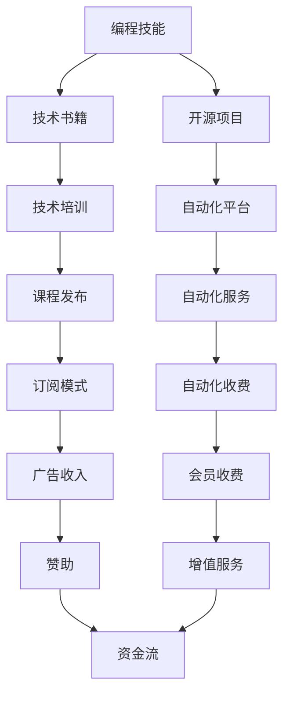

                 

# 如何将编程技能转化为被动收入

> 关键词：编程技能, 被动收入, 自由职业, 技术书籍, 开源项目, 自动化平台

## 1. 背景介绍

随着科技的迅猛发展，越来越多的人开始追求通过技术实现被动收入。编程，作为技术领域的基石，自然成为一种备受青睐的被动收入来源。然而，如何将编程技能转化为实实在在的被动收入，却是一个复杂而系统的话题。本文将从背景介绍开始，深入探讨这一主题。

### 1.1 问题由来

在过去的几十年里，编程技能已经成为许多人实现财务自由和职业发展的关键。然而，随着技术市场的日趋饱和，传统软件开发岗位的竞争日益激烈。与此同时，新的技术领域不断涌现，如人工智能、区块链、大数据等，这些领域对编程技能的需求更加多样化，但同时也面临着更高的技术壁垒。

如何在这个充满变数和竞争激烈的技术环境中，将编程技能转化为稳定可靠的被动收入来源，成为许多技术爱好者和专业人士面临的挑战。本文将详细阐述一些可行的策略，帮助读者实现这一目标。

## 2. 核心概念与联系

### 2.1 核心概念概述

要解答如何将编程技能转化为被动收入，首先需要理解几个核心概念：

- **编程技能**：指程序员通过学习和实践掌握的各种编程语言、框架、算法和设计模式等。
- **被动收入**：通过创建和投资于具有持续收入流的资产或项目，而无需持续投入时间和精力所获得的收入。
- **自由职业**：独立工作，不依赖固定雇主，通过提供特定技能和服务来获得收入。
- **技术书籍**：以编程和技术知识为主题，旨在传授专业技能和实践经验的书籍。
- **开源项目**：开放源代码的协作项目，任何人都可以自由地下载、修改和使用。
- **自动化平台**：利用软件和工具实现自动化流程，减少人工干预，提高效率和准确性。

这些概念之间存在密切的联系。通过将这些概念和技能有机结合起来，可以构建起一条将编程技能转化为被动收入的有效路径。

### 2.2 核心概念原理和架构的 Mermaid 流程图



此流程图展示了如何将编程技能通过技术书籍、开源项目和自动化平台等途径，转化为被动收入的各个步骤。

## 3. 核心算法原理 & 具体操作步骤

### 3.1 算法原理概述

将编程技能转化为被动收入的核心算法原理，可以归结为以下几个步骤：

1. **知识封装**：将编程技能和知识封装在书籍、文档和课程中，使其可以被广泛传播和应用。
2. **代码共享**：通过开源项目共享代码，吸引社区成员参与和贡献，扩大影响力。
3. **自动化服务**：利用自动化平台提供快速、高效、低成本的服务，如自动化测试、部署、维护等。
4. **收费模式**：通过订阅、广告、会员和增值服务等模式，实现收益。

这些步骤通过一系列精心设计的操作，将编程技能转化为稳定可靠的被动收入流。

### 3.2 算法步骤详解

#### 步骤1：创建技术书籍和课程

1. **选题和规划**：根据市场需求和个人专长，选择合适的技术主题，制定详细的编写计划。
2. **撰写和修订**：通过深入研究和技术实践，撰写高质量的技术书籍和课程。
3. **发布和推广**：选择合适的平台和渠道发布书籍和课程，如出版社、在线教育平台、自建网站等。

#### 步骤2：参与开源项目

1. **选择项目**：根据个人兴趣和市场需求，选择适合的开源项目。
2. **代码贡献**：积极参与项目的代码编写、调试和优化，提升项目质量。
3. **社区互动**：在社区中积极交流和分享经验，提升个人影响力和项目知名度。

#### 步骤3：搭建自动化平台

1. **平台选择**：选择合适的自动化平台，如GitHub Actions、Docker、Kubernetes等。
2. **服务设计**：根据市场需求设计自动化服务，如自动化部署、测试、监控等。
3. **部署和运维**：将服务部署到云平台或自建服务器，进行稳定运行和定期维护。

#### 步骤4：选择和实现收费模式

1. **订阅模式**：开发基于订阅的高级服务，提供持续的技术支持和资源更新。
2. **广告收入**：在平台和内容中适当植入广告，获取点击和展示收入。
3. **会员收费**：提供会员服务，包括专属内容、优先支持等。
4. **增值服务**：提供定制化的技术解决方案和咨询服务，增加收入来源。

### 3.3 算法优缺点

#### 优点

1. **灵活性高**：编程技能可以通过多种途径转化为被动收入，不局限于单一模式。
2. **可扩展性强**：通过开源项目和社区建设，可以不断扩大影响力，增加收益渠道。
3. **市场潜力大**：技术市场持续增长，对高质量编程技能的需求不断增加。

#### 缺点

1. **初期投入高**：需要投入大量时间和精力进行知识封装和平台搭建。
2. **市场竞争激烈**：技术市场竞争激烈，需要不断创新和优化以保持竞争力。
3. **收益周期长**：从投资到看到收益可能需要较长时间，需要有耐心和毅力。

### 3.4 算法应用领域

将编程技能转化为被动收入的方法广泛应用于以下领域：

- **软件开发**：通过技术书籍和开源项目，传授编程技能，获取教育和培训收入。
- **云计算和基础设施**：利用自动化平台提供云服务、容器化部署等，获取服务费用。
- **数据分析和人工智能**：开发基于数据和AI的自动化解决方案，提供定制化技术服务。
- **区块链和加密货币**：参与区块链项目开发和社区建设，通过代币和平台收益。

## 4. 数学模型和公式 & 详细讲解 & 举例说明

### 4.1 数学模型构建

将编程技能转化为被动收入的过程，可以通过以下数学模型来描述：

设 $S_t$ 表示在第 $t$ 时间段内获得的总收益，包括书籍销售、课程订阅、广告点击、会员收费等。$C_t$ 表示在同一时间段内的总成本，包括编写书籍、维护平台、广告投放等。则被动收入的模型可以表示为：

$$ S_t = \alpha + \beta C_t + \gamma E_t $$

其中：
- $\alpha$ 为固定收入，如初始版税或订阅费。
- $\beta$ 为收入增长系数，表示成本增加对收益的边际影响。
- $\gamma$ 为增长率，表示随着时间和成本的增加，收益的增长速度。
- $E_t$ 为外生变量，表示市场环境、技术趋势等不可控因素对收益的影响。

### 4.2 公式推导过程

根据上述模型，我们可以推导出实现被动收入的一些关键策略：

1. **控制成本**：通过合理控制成本，最大化收入增长率 $\gamma$。
2. **优化增长系数**：通过优化收入增长系数 $\beta$，确保成本增加对收益的正面影响。
3. **应对市场变化**：通过调整外生变量 $E_t$，应对市场环境和技术趋势的变化。

### 4.3 案例分析与讲解

以开发一个在线编程教育平台为例，分析如何通过技术书籍、开源项目和自动化平台实现被动收入。

1. **技术书籍**：编写《Python高级编程》书籍，并通过出版社发行，获得版税收入。同时，将书籍内容和部分源代码发布到平台，吸引用户订阅和购买。

2. **开源项目**：开发一个开源的Web框架，通过GitHub托管和推广，吸引开发者使用和贡献代码。同时，将项目文档和部分代码集成到教育平台上，作为教学内容。

3. **自动化平台**：搭建一个自动化测试平台，利用CI/CD工具（如Jenkins）实现代码的自动化测试和部署。通过平台提供自动化服务，用户支付一定费用以获取高级功能。

4. **收费模式**：采用订阅模式，用户支付月费以获取平台的所有资源和功能。同时，平台植入广告，通过广告点击获取额外收入。

## 5. 项目实践：代码实例和详细解释说明

### 5.1 开发环境搭建

#### 5.1.1 操作系统和编译器

- **操作系统**：选择Ubuntu Server或Linux发行版，确保系统的稳定性和安全性。
- **编译器**：安装GCC和Clang等编译器，支持多语言开发。

#### 5.1.2 开发工具

- **IDE**：安装Visual Studio Code或Atom等轻量级编辑器，支持代码高亮、自动补全等功能。
- **版本控制**：使用Git进行版本控制，管理代码变更和协作。
- **依赖管理**：使用pip和Maven等工具管理第三方库依赖。

#### 5.1.3 数据库和服务器

- **数据库**：选择MySQL或PostgreSQL等关系型数据库，管理用户信息和课程内容。
- **服务器**：使用AWS、Google Cloud或阿里云等云平台，提供稳定的服务。

### 5.2 源代码详细实现

#### 5.2.1 技术书籍和课程

1. **编写书籍**：使用Markdown编写技术书籍，支持LaTeX格式输出。

```latex
\documentclass{article}
\title{Python高级编程}
\begin{document}
\section{Python基础}
\textbf{变量声明}：...
\end{document}
```

2. **编写课程**：使用HTML和JavaScript编写互动课程，支持视频和代码演示。

```html
<video src="example.mp4" controls></video>
<code><pre><script src="example.js"></script></pre></code>
```

#### 5.2.2 开源项目

1. **创建项目**：使用Git创建开源项目，初始化项目仓库。

```bash
git clone https://github.com/example/repo.git
cd repo
git init
```

2. **添加代码**：在项目中添加代码文件，使用git commit提交代码变更。

```bash
echo "Hello, world!" > hello.py
git add hello.py
git commit -m "Add hello.py"
```

3. **发布项目**：使用GitHub托管项目，通过README文件和README.md文件描述项目内容。

```bash
git remote add origin https://github.com/example/repo.git
git push -u origin master
```

#### 5.2.3 自动化平台

1. **搭建平台**：使用Docker容器化应用，部署到Kubernetes集群。

```yaml
version: '3.9'
services:
  app:
    image: example/app:latest
    ports:
      - '8080:8080'
```

2. **实现自动化服务**：编写自动化脚本，使用CI/CD工具（如Jenkins）实现代码的自动化测试和部署。

```bash
# 自动化测试脚本
echo "Start testing..."
# 自动化部署脚本
echo "Start deploying..."
```

### 5.3 代码解读与分析

#### 5.3.1 技术书籍和课程

- **Markdown和LaTeX**：支持复杂文档结构和高质量输出，适合编写技术书籍和课程。
- **HTML和JavaScript**：支持互动和多媒体展示，提高用户学习体验。

#### 5.3.2 开源项目

- **Git和GitHub**：提供版本控制和协作功能，方便代码管理和社区互动。
- **CI/CD工具**：自动化测试和部署，提高开发效率和稳定性。

#### 5.3.3 自动化平台

- **Docker和Kubernetes**：容器化部署和管理，确保服务的高可用性和可伸缩性。
- **自动化脚本**：定义和执行自动化任务，减少人工干预。

### 5.4 运行结果展示

通过上述实践，可以实现一个完整的编程技能转化平台，展示如下：

1. **技术书籍和课程**：用户可以购买和订阅课程，学习编程知识和技能。

2. **开源项目**：开发者可以贡献代码和文档，共同推动项目发展。

3. **自动化平台**：企业可以部署和维护服务，享受高效、稳定的自动化支持。

## 6. 实际应用场景

### 6.1 在线教育平台

在线教育平台可以整合技术书籍、开源项目和自动化平台，实现编程技能向被动收入的转化。通过课程销售、订阅服务和广告收入，平台可以获得稳定的收入流。

### 6.2 软件开发工具

软件开发工具和平台，如GitHub、Stack Overflow等，通过提供代码托管、社区互动和自动化服务，吸引开发者和用户注册和付费，实现技术技能变现。

### 6.3 云计算服务

云计算服务提供商，如AWS、阿里云等，通过提供云资源和自动化管理服务，收取用户租金和费用，实现被动收入。

### 6.4 未来应用展望

未来，随着技术的进一步发展和普及，编程技能转化为被动收入的方式将更加多样化。例如：

- **AI和机器学习**：利用AI模型自动生成编程课程和文档，降低内容制作成本。
- **区块链和数字货币**：通过区块链技术实现编程技能的数字化认证和交易，提供新的收入来源。
- **虚拟现实和增强现实**：利用VR和AR技术，开发互动式的编程教育工具，提高用户参与度和体验。

## 7. 工具和资源推荐

### 7.1 学习资源推荐

1. **Coursera**：提供丰富的在线课程和证书，涵盖编程和计算机科学等领域。
2. **Udemy**：提供丰富的编程课程和实战项目，适合自学和技能提升。
3. **Khan Academy**：提供免费的编程课程和互动练习，适合初学者学习。
4. **edX**：提供高质量的编程课程和项目，适合深入学习和专业提升。
5. **Codecademy**：提供互动式编程练习和项目，适合编程技能的实践和提升。

### 7.2 开发工具推荐

1. **Visual Studio Code**：轻量级、功能强大的编辑器，支持多种编程语言。
2. **GitHub**：强大的版本控制和社区互动平台，支持代码托管和协作。
3. **Docker**：容器化技术，提供稳定的服务部署和管理。
4. **Kubernetes**：容器编排工具，支持大规模的自动化部署和扩展。
5. **Jenkins**：CI/CD工具，支持自动化测试和持续集成。

### 7.3 相关论文推荐

1. **《Kubernetes: Inside and Out》**：详细介绍Kubernetes的工作原理和实践经验。
2. **《Programming, Version Control, and the GitHub Way》**：深入讨论GitHub在版本控制和协作中的应用。
3. **《Deep Learning with Python》**：介绍深度学习和AI技术在编程中的应用。
4. **《Blockchain Basics》**：解释区块链技术的基本原理和应用场景。
5. **《Programming for Everybody (Using Python)》**：适合初学者的编程入门课程。

## 8. 总结：未来发展趋势与挑战

### 8.1 研究成果总结

本文从背景介绍、核心概念、算法原理、操作步骤、数学模型等多个方面，详细探讨了将编程技能转化为被动收入的实现途径。通过技术书籍、开源项目和自动化平台等手段，结合合理的收费模式和商业策略，可以实现稳定的被动收入流。

### 8.2 未来发展趋势

1. **自动化和智能化**：未来的编程技能转化平台将更加自动化和智能化，通过AI和机器学习技术，提高内容生成和用户交互的效率。
2. **跨平台和跨领域**：平台将打破技术和领域的界限，提供跨平台和跨领域的编程技能和解决方案。
3. **开源和协作**：开源项目和社区协作将成为实现技术技能变现的重要方式，吸引更多开发者和用户参与。

### 8.3 面临的挑战

1. **技术壁垒**：新技术和工具的引入，需要开发者具备较高的技术水平和适应能力。
2. **市场竞争**：技术市场竞争激烈，需要不断创新和优化以保持竞争力。
3. **法律和伦理**：平台需要遵守相关法律法规和伦理规范，确保用户数据和内容的安全性和合法性。

### 8.4 研究展望

未来的研究应关注以下几个方向：

1. **跨学科融合**：将编程技能与其他学科的知识和工具进行融合，开拓新的应用领域。
2. **智能辅助**：利用AI和大数据技术，提供智能化的编程辅助和建议，提高开发效率。
3. **社会影响**：研究编程技能在社会和教育领域的影响，推动技术普及和公平教育。

## 9. 附录：常见问题与解答

### 9.1 常见问题

1. **如何选择合适的项目？**
   - **回答**：根据市场需求和个人专长，选择具有潜力和前景的项目。

2. **编程技能转化为被动收入需要多长时间？**
   - **回答**：通常需要较长时间，需要不断积累和优化。

3. **如何提升编程技能？**
   - **回答**：持续学习和实践，多参与开源项目和社区互动，积累经验和声誉。

### 9.2 解答

1. **如何选择合适的项目？**
   - **回答**：根据市场需求和个人专长，选择具有潜力和前景的项目。

2. **编程技能转化为被动收入需要多长时间？**
   - **回答**：通常需要较长时间，需要不断积累和优化。

3. **如何提升编程技能？**
   - **回答**：持续学习和实践，多参与开源项目和社区互动，积累经验和声誉。

---

作者：禅与计算机程序设计艺术 / Zen and the Art of Computer Programming

