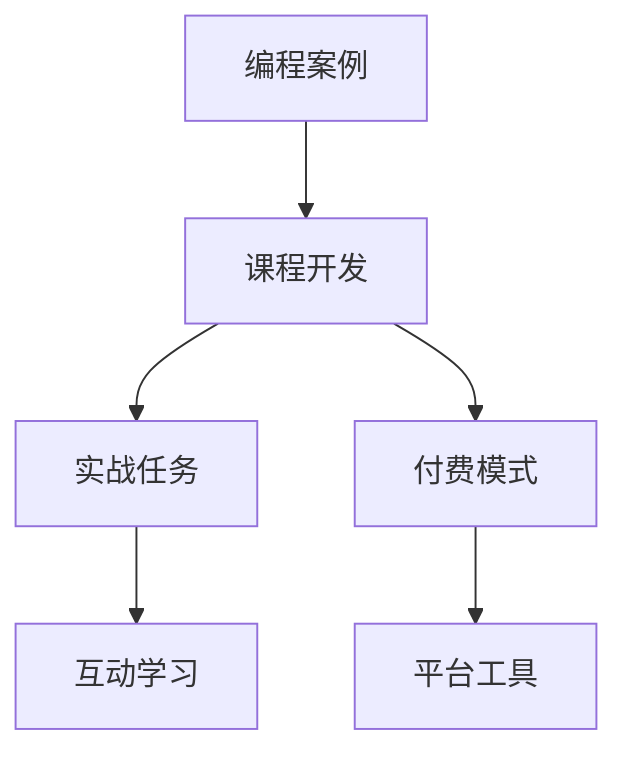

                 

# 如何将编程案例转化为付费实战课程

> 关键词：
- 编程案例
- 课程开发
- 收费模式
- 教育技术
- 在线平台
- 课程设计
- 学习体验
- 内容创作
- 教学方法

## 1. 背景介绍

### 1.1 问题由来
编程教育正处于快速发展期，传统的书籍和视频教程已经难以满足日益增长的学习需求。如何将高质量的编程案例转化为互动性强的实战课程，成为在线教育的重要课题。这些课程不仅能够帮助学员快速掌握编程技能，还能够在商业变现上带来可观的收益。

### 1.2 问题核心关键点
将编程案例转化为实战课程，关键在于以下几点：
- 如何从编程案例中提炼核心技能，编写详细的教学内容。
- 如何设计互动性强的实战任务，提升学习体验。
- 如何选择合适的付费模式，最大化课程收益。
- 如何借助平台工具，实现课程的自动化开发和发布。
- 如何确保课程质量，维护学员满意度。

### 1.3 问题研究意义
开发高质量的编程实战课程，对于提升编程教育水平，加速人才培育，推动行业发展具有重要意义：

1. 提升教学质量：以实战案例为基础，能够提高教学的针对性和实用性，帮助学员更高效地掌握编程技能。
2. 拓展收入来源：将课程内容开发为付费课程，有助于教育机构的商业变现，形成稳定的收入来源。
3. 促进产业融合：编程实战课程的开发和应用，能够促进教育技术与其他行业的深度融合，如科技、金融、医疗等，加速相关领域的数字化转型。
4. 增强就业竞争力：学员通过实战课程学习，能够在就业市场中脱颖而出，增强自身的就业竞争力。

## 2. 核心概念与联系

### 2.1 核心概念概述

为了更好地理解如何将编程案例转化为实战课程，我们需要先了解一些核心概念：

- 编程案例：基于真实项目的实际编程任务，包含了问题描述、解决方案、代码实现等详细信息，能够帮助学员了解编程的实际应用场景。
- 课程开发：根据教学目标和学员需求，设计课程结构，编写教学内容，并借助工具进行课程的开发和发布。
- 实战任务：课程中的实践练习，旨在通过解决具体问题，加深学员对编程技能的理解和掌握。
- 互动学习：利用问答、讨论、协作等互动形式，提升学习效果，增强学习动力。
- 付费模式：通过各种收费机制（如订阅、按需购买、会员制等），实现课程的商业变现。
- 平台工具：在线课程开发和发布所需的软件工具，如LMS（学习管理系统）、视频制作工具、编码环境等。

这些核心概念之间的关系可以通过以下Mermaid流程图来展示：



这个流程图展示了从编程案例到实战课程的开发过程，包括实战任务设计、互动学习机制的融入、付费模式的选定和平台工具的利用。这些环节共同构成了编程案例转化为实战课程的关键路径。

## 3. 核心算法原理 & 具体操作步骤

### 3.1 算法原理概述

将编程案例转化为实战课程，本质上是一个教学内容设计、实践任务设计、付费模式选择和平台工具应用的过程。其核心思想是通过对编程案例的深入分析和加工，设计出能够帮助学员掌握核心技能的课程内容和互动练习，同时选择合适的付费模式，借助平台工具高效开发和发布课程，最终实现商业变现。

### 3.2 算法步骤详解

**Step 1: 编程案例分析**
- 对给定的编程案例进行详细分析，提炼出核心技能点、关键难点和重要知识点。
- 收集案例背景资料，了解案例的应用场景和需求背景。
- 与业内专家进行访谈，获取更多案例相关的背景信息和实际应用案例。

**Step 2: 课程设计**
- 根据核心技能点，设计课程结构，划分课程章节。
- 编写教学内容，包括文字描述、代码示例、注意事项等。
- 设计实战任务，确保任务具有挑战性和实践意义。

**Step 3: 互动学习设计**
- 引入问答、讨论、协作等互动形式，提升学习效果。
- 设计实时反馈机制，及时调整学员的学习进度和状态。
- 利用模拟环境或在线工具，提供编程实践的平台。

**Step 4: 付费模式选择**
- 根据目标学员群体，选择合适的付费模式（如订阅制、按需购买等）。
- 设计合理的课程价格策略，兼顾课程质量和学习体验。
- 引入激励机制，如学习认证、积分奖励等，吸引更多学员。

**Step 5: 平台工具应用**
- 选择合适的在线课程开发平台，如Udacity、Coursera、网易云课堂等。
- 利用平台提供的教学工具，进行课程内容的上传、修改和管理。
- 利用平台分析工具，监控课程学习数据，优化课程内容和互动形式。

**Step 6: 课程发布与推广**
- 在选定的平台发布课程，并进行推广。
- 利用社交媒体、在线广告等渠道，吸引更多潜在学员。
- 通过学员反馈，持续优化课程内容和学习体验。

### 3.3 算法优缺点

将编程案例转化为实战课程的方法具有以下优点：
- 提升教学效果：通过实战任务的设计，能够帮助学员更好地理解和掌握编程技能。
- 实现商业变现：通过课程的收费模式，能够实现课程的商业化，带来稳定的收入。
- 促进产业融合：课程的开发和应用，能够促进教育技术与各行业的深度融合，推动行业发展。
- 满足个性化需求：课程设计可以根据不同学员的学习需求，提供个性化的学习体验。

同时，该方法也存在一定的局限性：
- 开发成本较高：课程开发需要大量的时间和资源投入，可能面临开发成本高的问题。
- 内容更新慢：课程内容更新相对缓慢，可能难以跟上技术发展的步伐。
- 依赖平台支持：课程发布和推广需要借助在线教育平台，可能面临平台政策变动的影响。
- 学习体验单一：课程主要以线上形式呈现，难以提供多样化的学习体验。

尽管存在这些局限性，但就目前而言，将编程案例转化为实战课程的方法仍然是大规模开发编程教育内容的重要范式。未来相关研究的重点在于如何进一步降低开发成本，提高课程内容的更新速度，同时兼顾课程的个性化和互动性，优化学员的学习体验。

### 3.4 算法应用领域

将编程案例转化为实战课程的方法已经在编程教育、技术培训、在线课程开发等多个领域得到了广泛应用，例如：

- 编程教育：通过实战课程学习，帮助学员快速掌握编程技能，提升就业竞争力。
- 技术培训：为在职开发者提供实战项目，提升其编程水平和实战能力。
- 在线课程开发：为在线教育平台提供课程内容，吸引更多学员注册学习。
- 企业培训：为企业的技术团队提供定制化的实战课程，提升其整体技术水平。

除了上述这些经典应用外，将编程案例转化为实战课程的方法也被创新性地应用到更多场景中，如编程竞赛、技术研讨、企业内部培训等，为编程教育和技术培训带来了新的突破。

## 4. 数学模型和公式 & 详细讲解 & 举例说明

### 4.1 数学模型构建

本节将使用数学语言对将编程案例转化为实战课程的过程进行更加严格的刻画。

记编程案例为 $C$，其中包含了问题描述 $P$、解决方案 $S$、代码实现 $C$ 等详细信息。目标是将 $C$ 转化为课程 $M$，其中包含若干个实战任务 $T_1, T_2, ..., T_n$。

课程的构建过程可以形式化地表示为：

$$
M = \text{Function}(C, \theta)
$$

其中 $\theta$ 为课程设计的参数，如任务难度、互动形式、付费模式等。

### 4.2 公式推导过程

以下我们以一个简单的编程案例为例，推导其转化为实战课程的数学模型。

假设编程案例 $C$ 描述了一个简单的网页登录功能实现。其问题描述 $P$ 包含以下几个关键点：
- 网页登录功能的基本实现逻辑
- 用户输入校验、密码加密等关键技术点
- 代码实现 $C$ 包含完整的登录页面和功能实现

根据这些关键点，设计了如下实战任务 $T$：

- 任务1：实现基本的登录页面
- 任务2：实现用户输入校验
- 任务3：实现密码加密与解密
- 任务4：实现完整的登录功能

对于任务1，我们希望学员掌握HTML、CSS等前端技术，设计了如下教学内容：

- 知识点：HTML、CSS基础
- 实战任务：设计一个简单的登录页面

对于任务2，我们希望学员掌握JavaScript等前端技术，设计了如下教学内容：

- 知识点：JavaScript基础
- 实战任务：实现用户输入校验

对于任务3，我们希望学员掌握密码加密算法，设计了如下教学内容：

- 知识点：密码加密算法
- 实战任务：实现密码加密与解密

对于任务4，我们希望学员掌握后端技术，设计了如下教学内容：

- 知识点：Node.js、Express框架基础
- 实战任务：实现完整的登录功能

将这些任务整合到课程中，我们得到了如下课程结构：

- 任务1：网页开发基础
- 任务2：用户输入校验
- 任务3：密码加密与解密
- 任务4：完整的登录功能实现

这些任务通过实际的编程案例进行串联，形成了完整的课程内容。

### 4.3 案例分析与讲解

假设有一个编程案例 $C$，描述了一个电商网站的用户订单处理功能实现。其问题描述 $P$ 包含以下几个关键点：
- 订单处理的流程与逻辑
- 订单状态管理与数据结构设计
- 代码实现 $C$ 包含完整的订单处理逻辑和数据存储

根据这些关键点，设计了如下实战任务 $T$：

- 任务1：订单流程设计
- 任务2：订单状态管理
- 任务3：数据结构设计
- 任务4：订单处理实现

对于任务1，我们希望学员掌握前端技术，设计了如下教学内容：

- 知识点：Web前端技术栈
- 实战任务：设计订单流程页面

对于任务2，我们希望学员掌握数据库管理技术，设计了如下教学内容：

- 知识点：MySQL、Redis数据库基础
- 实战任务：实现订单状态管理

对于任务3，我们希望学员掌握数据结构设计，设计了如下教学内容：

- 知识点：数据结构与算法
- 实战任务：设计订单状态数据结构

对于任务4，我们希望学员掌握后端技术，设计了如下教学内容：

- 知识点：Spring Boot框架基础
- 实战任务：实现完整的订单处理逻辑

将这些任务整合到课程中，我们得到了如下课程结构：

- 任务1：电商订单基础
- 任务2：订单流程设计
- 任务3：订单状态管理
- 任务4：完整的订单处理实现

这些任务通过实际的编程案例进行串联，形成了完整的课程内容。通过这种方式，学员不仅能够掌握具体的编程技能，还能了解实际项目的全貌和设计思路。

## 5. 项目实践：代码实例和详细解释说明

### 5.1 开发环境搭建

在进行课程开发前，我们需要准备好开发环境。以下是使用Python进行课程开发的环境配置流程：

1. 安装Anaconda：从官网下载并安装Anaconda，用于创建独立的Python环境。

2. 创建并激活虚拟环境：
```bash
conda create -n course-env python=3.8 
conda activate course-env
```

3. 安装PyTorch：根据CUDA版本，从官网获取对应的安装命令。例如：
```bash
conda install pytorch torchvision torchaudio cudatoolkit=11.1 -c pytorch -c conda-forge
```

4. 安装Django：用于搭建课程的Web平台，提供用户注册、登录、课程浏览等功能。

```bash
pip install django
```

5. 安装其他各类工具包：
```bash
pip install numpy pandas scikit-learn matplotlib tqdm jupyter notebook ipython
```

完成上述步骤后，即可在`course-env`环境中开始课程开发。

### 5.2 源代码详细实现

下面我们以一个简单的编程实战课程为例，给出使用Django进行课程开发的PyTorch代码实现。

首先，定义课程的数据处理函数：

```python
from django.db import models

class Course(models.Model):
    title = models.CharField(max_length=255)
    description = models.TextField()
    tasks = models.ManyToManyField('Task')

class Task(models.Model):
    name = models.CharField(max_length=255)
    difficulty = models.IntegerField()
    solution = models.TextField()
    code = models.TextField()

# 初始化任务和课程
tasks = [
    Task(name="任务1", difficulty=1, solution="[任务描述]", code="[代码实现]"),
    Task(name="任务2", difficulty=2, solution="[任务描述]", code="[代码实现]"),
    Task(name="任务3", difficulty=3, solution="[任务描述]", code="[代码实现]"),
    Task(name="任务4", difficulty=4, solution="[任务描述]", code="[代码实现]"),
]

courses = [
    Course(title="编程实战课程", description="[课程描述]", tasks=tasks),
]

# 保存任务和课程到数据库
Course.objects.bulk_create(courses)
Task.objects.bulk_create(tasks)
```

然后，定义课程和任务的视图：

```python
from django.shortcuts import render
from django.views.generic import ListView, DetailView
from .models import Course, Task

class CourseListView(ListView):
    model = Course
    template_name = 'course_list.html'
    context_object_name = 'courses'

class CourseDetailView(DetailView):
    model = Course
    template_name = 'course_detail.html'
    context_object_name = 'course'

class TaskListView(ListView):
    model = Task
    template_name = 'task_list.html'
    context_object_name = 'tasks'

class TaskDetailView(DetailView):
    model = Task
    template_name = 'task_detail.html'
    context_object_name = 'task'
```

最后，定义课程和任务的HTML模板：

```html
<!-- course_list.html -->


  <h1>课程列表</h1>
  <ul>
    
      <li><a href="">{{ course.title }}</a></li>
    
  </ul>


<!-- course_detail.html -->


  <h1>{{ course.title }}</h1>
  {{ course.description }}
  <h2>任务列表</h2>
  <ul>
    
      <li><a href="">{{ task.name }}</a></li>
    
  </ul>


<!-- task_list.html -->


  <h1>任务列表</h1>
  <ul>
    
      <li><a href="">{{ task.name }}</a></li>
    
  </ul>


<!-- task_detail.html -->


  <h1>{{ task.name }}</h1>
  {{ task.description }}
  {{ task.code }}

```

通过这些代码，我们可以快速搭建一个包含课程和任务的Django网站，供学员浏览和学习。

### 5.3 代码解读与分析

让我们再详细解读一下关键代码的实现细节：

**Course和Task模型**：
- 定义了课程和任务的基本属性，如课程标题、任务名称、难度等级、解决方案和代码实现。
- 利用ManyToManyField关联课程和任务，确保课程内容丰富、任务有序。

**课程和任务的视图**：
- 通过Django的GenericView，实现课程列表、课程详情、任务列表和任务详情的展示。
- 利用url()函数和reverse()函数，实现页面间的导航链接。

**HTML模板**：
- 使用Django的模板引擎，将课程和任务数据渲染为HTML页面。
- 通过继承base.html模板，实现统一的网站风格。

通过这些代码，我们完成了Django课程网站的开发，学员可以方便地浏览和访问课程内容。

### 5.4 运行结果展示

通过上述代码，我们可以在本地启动Django服务器，访问课程网站，如下所示：

```bash
python manage.py runserver
```

在浏览器中访问 http://localhost:8000/，即可看到课程列表页面。点击课程链接，进入课程详情页面，即可查看课程描述和任务列表。点击任务链接，进入任务详情页面，即可阅读任务描述和代码实现。

## 6. 实际应用场景

### 6.1 编程教育

将编程案例转化为实战课程的方法在编程教育中得到了广泛应用。通过实战课程的学习，学员能够快速掌握编程技能，提升就业竞争力。

例如，某在线编程教育平台通过开发一系列Python实战课程，吸引了数万名学员注册学习。这些课程涵盖了Web开发、数据分析、机器学习等多个领域，为学员提供了丰富的实战项目和实战任务，大大提升了学习效果。

### 6.2 技术培训

企业通过实战课程培训，能够提升技术团队的实战能力和创新能力。通过实战课程的学习，开发者能够更好地理解和掌握实际项目的技术栈和实现细节，从而在实际工作中更快地完成任务。

例如，某大型互联网公司通过开发一系列Java实战课程，对全体技术团队进行培训。这些课程通过实战任务的设计，帮助团队成员快速掌握Spring Boot、MyBatis等关键技术，提升了整体技术水平。

### 6.3 在线课程开发

在线课程开发公司通过实战课程的开发和销售，实现了商业变现。通过课程的收费模式，公司能够获得稳定的收入，并进一步拓展课程内容和覆盖范围。

例如，某在线课程开发公司通过开发一系列Python实战课程，吸引了数千名学员注册付费学习。这些课程涵盖了Web开发、数据科学、人工智能等多个领域，为学员提供了高质量的实战任务和互动学习体验，获得了良好的市场反响。

### 6.4 未来应用展望

随着编程案例转化为实战课程方法的不断成熟，其应用前景也将更加广阔：

1. 深度融合：课程开发将更加注重与教育技术的深度融合，如AI辅助、自适应学习等，提升学习效果。
2. 多领域拓展：课程将拓展到更多领域，如法律、金融、医疗等，推动各行业的数字化转型。
3. 个性化定制：根据学员的学习需求，提供个性化的课程设计和互动形式，提升学习体验。
4. 实时更新：课程内容将持续更新，跟进技术发展的最新动态，确保课程的时效性。
5. 跨平台支持：课程将支持多种设备和平台，提供灵活的学习方式。

未来，编程案例转化为实战课程的方法将在更多领域得到应用，为编程教育和技术培训带来新的突破。

## 7. 工具和资源推荐

### 7.1 学习资源推荐

为了帮助开发者系统掌握将编程案例转化为实战课程的理论基础和实践技巧，这里推荐一些优质的学习资源：

1. 《Python实战编程》系列书籍：由编程教育专家撰写，详细介绍了Python编程案例的开发和实战课程的构建方法。
2. Coursera《Python for Everybody》课程：由密歇根大学教授授课，通过编程案例设计实战课程，适合初学者入门。
3. Udacity《Web Developer》纳米学位：通过实战项目训练学员的Web开发能力，提供丰富的编程案例和互动学习体验。
4. edX《Introduction to Computer Science and Programming Using Python》课程：由哈佛大学教授授课，通过Python编程案例引入实战任务，适合初学者和进阶者。
5. Codecademy《Learn Python》课程：提供互动式编程学习体验，帮助学员通过实战练习掌握编程技能。

通过对这些资源的学习实践，相信你一定能够快速掌握将编程案例转化为实战课程的精髓，并用于解决实际的编程教育问题。

### 7.2 开发工具推荐

高效的开发离不开优秀的工具支持。以下是几款用于将编程案例转化为实战课程开发的常用工具：

1. Django：Python的Web开发框架，提供了丰富的模板和视图功能，方便课程网站的开发。
2. VS Code：轻量级的代码编辑器，支持多语言开发，提供强大的代码补全和调试功能。
3. Git：版本控制系统，便于协作开发和版本管理。
4. Docker：容器化技术，便于课程内容的打包和部署。
5. PyTorch：深度学习框架，提供高效的计算图和模型训练功能。
6. TensorFlow：另一个流行的深度学习框架，提供了丰富的模型库和优化器。

合理利用这些工具，可以显著提升课程开发的效率和质量，加快创新迭代的步伐。

### 7.3 相关论文推荐

将编程案例转化为实战课程的方法在教育技术领域得到了广泛研究。以下是几篇奠基性的相关论文，推荐阅读：

1. "Towards a New Curriculum Model for Programming Education"（《走向新编程教育模型》）：提出了基于项目的学习方法，通过编程案例设计课程内容，提升学习效果。
2. "Active Learning in Programming Education"（《编程教育中的主动学习》）：研究了通过互动任务和实时反馈提升学习效果的方法。
3. "Problem-Based Learning in Programming Education"（《基于问题的编程教育》）：通过设计复杂的编程问题，提升学员的分析和解决问题的能力。
4. "Learning and Instruction in Programming"（《编程教育与指导》）：分析了编程教育的难点和解决方法，提供了丰富的编程案例和教学策略。
5. "Design and Implementation of an Online Programming Education Platform"（《在线编程教育平台的设计与实现》）：介绍了一个基于Web的编程教育平台，提供编程案例和实战任务。

这些论文代表了大语言模型微调技术的发展脉络。通过学习这些前沿成果，可以帮助研究者把握学科前进方向，激发更多的创新灵感。

## 8. 总结：未来发展趋势与挑战

### 8.1 总结

本文对将编程案例转化为实战课程方法进行了全面系统的介绍。首先阐述了将编程案例转化为实战课程的研究背景和意义，明确了微调在拓展编程案例应用、提升实战任务效果方面的独特价值。其次，从原理到实践，详细讲解了编程案例转化为实战课程的数学原理和关键步骤，给出了课程开发的完整代码实例。同时，本文还广泛探讨了实战课程在编程教育、技术培训、在线课程开发等多个领域的应用前景，展示了课程范式的巨大潜力。此外，本文精选了课程开发的各类学习资源，力求为读者提供全方位的技术指引。

通过本文的系统梳理，可以看到，将编程案例转化为实战课程方法正在成为编程教育的重要范式，极大地拓展了编程案例的应用边界，催生了更多的落地场景。受益于编程案例的丰富多样性和实战任务的灵活设计，这种课程开发范式能够提供高度实用、易于理解的编程技能，帮助学员快速成长，提升学习效果。未来，伴随编程案例转化为实战课程方法的持续演进，编程教育将迈向更加智能化、个性化和多样化的新阶段。

### 8.2 未来发展趋势

展望未来，将编程案例转化为实战课程技术将呈现以下几个发展趋势：

1. 深度融合：课程开发将更加注重与教育技术的深度融合，如AI辅助、自适应学习等，提升学习效果。
2. 多领域拓展：课程将拓展到更多领域，如法律、金融、医疗等，推动各行业的数字化转型。
3. 个性化定制：根据学员的学习需求，提供个性化的课程设计和互动形式，提升学习体验。
4. 实时更新：课程内容将持续更新，跟进技术发展的最新动态，确保课程的时效性。
5. 跨平台支持：课程将支持多种设备和平台，提供灵活的学习方式。

以上趋势凸显了将编程案例转化为实战课程技术的广阔前景。这些方向的探索发展，必将进一步提升编程教育的质量和效果，为社会培养更多高素质、高技能的编程人才。

### 8.3 面临的挑战

尽管将编程案例转化为实战课程技术已经取得了显著成果，但在迈向更加智能化、普适化应用的过程中，它仍面临诸多挑战：

1. 教学内容设计复杂：课程设计需要考虑多方面的因素，如任务难度、知识点分布、互动形式等，设计成本较高。
2. 课程内容更新慢：课程内容的更新周期较长，可能难以跟上技术发展的步伐。
3. 课程质量保证难：课程质量受讲师和开发者的水平影响较大，如何保证课程质量是一个难题。
4. 学员学习体验单一：课程主要以线上形式呈现，难以提供多样化的学习体验。
5. 平台支持依赖性强：课程的发布和推广需要借助在线教育平台，可能面临平台政策变动的影响。

尽管存在这些挑战，但就目前而言，将编程案例转化为实战课程的方法仍然是大规模开发编程教育内容的重要范式。未来相关研究的重点在于如何进一步降低开发成本，提高课程内容的更新速度，同时兼顾课程的个性化和互动性，优化学员的学习体验。

### 8.4 研究展望

面对将编程案例转化为实战课程所面临的种种挑战，未来的研究需要在以下几个方面寻求新的突破：

1. 探索无监督和半监督微调方法：摆脱对大规模标注数据的依赖，利用自监督学习、主动学习等无监督和半监督范式，最大限度利用非结构化数据，实现更加灵活高效的课程开发。
2. 研究参数高效和计算高效的微调范式：开发更加参数高效的微调方法，在固定大部分预训练参数的同时，只更新极少量的任务相关参数。同时优化课程计算图，减少前向传播和反向传播的资源消耗，实现更加轻量级、实时性的部署。
3. 融合因果和对比学习范式：通过引入因果推断和对比学习思想，增强课程模型建立稳定因果关系的能力，学习更加普适、鲁棒的语言表征，从而提升课程泛化性和抗干扰能力。
4. 引入更多先验知识：将符号化的先验知识，如知识图谱、逻辑规则等，与神经网络模型进行巧妙融合，引导课程模型学习更准确、合理的语言模型。同时加强不同模态数据的整合，实现视觉、语音等多模态信息与文本信息的协同建模。
5. 结合因果分析和博弈论工具：将因果分析方法引入课程模型，识别出课程决策的关键特征，增强输出解释的因果性和逻辑性。借助博弈论工具刻画人机交互过程，主动探索并规避课程模型的脆弱点，提高系统稳定性。
6. 纳入伦理道德约束：在课程目标中引入伦理导向的评估指标，过滤和惩罚有偏见、有害的输出倾向。同时加强人工干预和审核，建立课程行为的监管机制，确保输出符合人类价值观和伦理道德。

这些研究方向的探索，必将引领将编程案例转化为实战课程技术迈向更高的台阶，为构建安全、可靠、可解释、可控的智能系统铺平道路。面向未来，将编程案例转化为实战课程技术还需要与其他人工智能技术进行更深入的融合，如知识表示、因果推理、强化学习等，多路径协同发力，共同推动自然语言理解和智能交互系统的进步。只有勇于创新、敢于突破，才能不断拓展编程案例的边界，让智能技术更好地造福人类社会。

## 9. 附录：常见问题与解答

**Q1：如何选择合适的编程案例？**

A: 选择合适的编程案例，需要考虑以下几个关键点：
- 目标受众：课程面向的学员群体，如初学者、进阶者、企业开发者等。
- 技术栈：案例所使用的编程语言、框架、库等技术栈。
- 实际应用：案例是否具有实际的商业应用价值，能够帮助学员更好地理解编程技能的应用场景。
- 难度梯度：案例的难度应适中，避免过难或过易。
- 资源支持：案例所需的资源支持，如服务器、开发环境、数据集等。

**Q2：如何设计高质量的课程内容？**

A: 设计高质量的课程内容，需要从以下几个方面入手：
- 明确课程目标：设定清晰的课程学习目标，帮助学员明确学习方向。
- 细分任务：将课程内容细分为多个任务，每个任务有明确的知识点和技能点。
- 引入实际项目：将编程案例中的实际项目作为课程内容的一部分，增强学习的实用性和趣味性。
- 提供详细的解决方案：为每个任务提供详细的解决方案，帮助学员掌握关键技术点。
- 设计互动形式：通过问答、讨论、协作等互动形式，提升学习效果。

**Q3：如何提升课程学习体验？**

A: 提升课程学习体验，需要从以下几个方面入手：
- 引入实时反馈：通过实时反馈机制，及时调整学员的学习进度和状态。
- 提供编程环境：为学员提供完整的学习环境，包括编程工具、开发环境、数据集等。
- 引入实战任务：通过实战任务的设计，帮助学员更好地理解和掌握编程技能。
- 设计多样化的互动形式：通过在线讨论、小组协作等多样化的互动形式，增强学习效果。
- 引入奖励机制：通过学习认证、积分奖励等激励机制，激发学员的学习动力。

**Q4：如何保障课程质量？**

A: 保障课程质量，需要从以下几个方面入手：
- 严格的课程设计流程：确保课程设计符合教育标准，设定明确的课程目标和任务。
- 精选讲师和开发者：选择经验丰富、水平高的讲师和开发者，确保课程内容的准确性和实用性。
- 持续更新课程内容：根据技术发展和学员反馈，持续更新课程内容，保持课程的时效性。
- 引入质量评估机制：通过学员反馈、讲师评审等方式，持续优化课程内容和互动形式。

**Q5：如何推广课程？**

A: 推广课程，需要从以下几个方面入手：
- 利用社交媒体：通过社交媒体平台，如微博、微信、知乎等，推广课程，吸引潜在学员。
- 选择合适的平台：选择适合的在线教育平台，如Udacity、Coursera、网易云课堂等，进行课程发布和推广。
- 设计有效的广告策略：通过SEO、SEM、内容营销等方式，提升课程的曝光率和点击率。
- 提供免费试听：提供课程的免费试听或试用，吸引潜在学员注册学习。
- 提供优惠券和折扣：通过优惠券和折扣等促销手段，吸引更多学员报名学习。

通过这些措施，可以显著提升课程的曝光率和学员注册率，带来更好的商业收益。

---

作者：禅与计算机程序设计艺术 / Zen and the Art of Computer Programming

