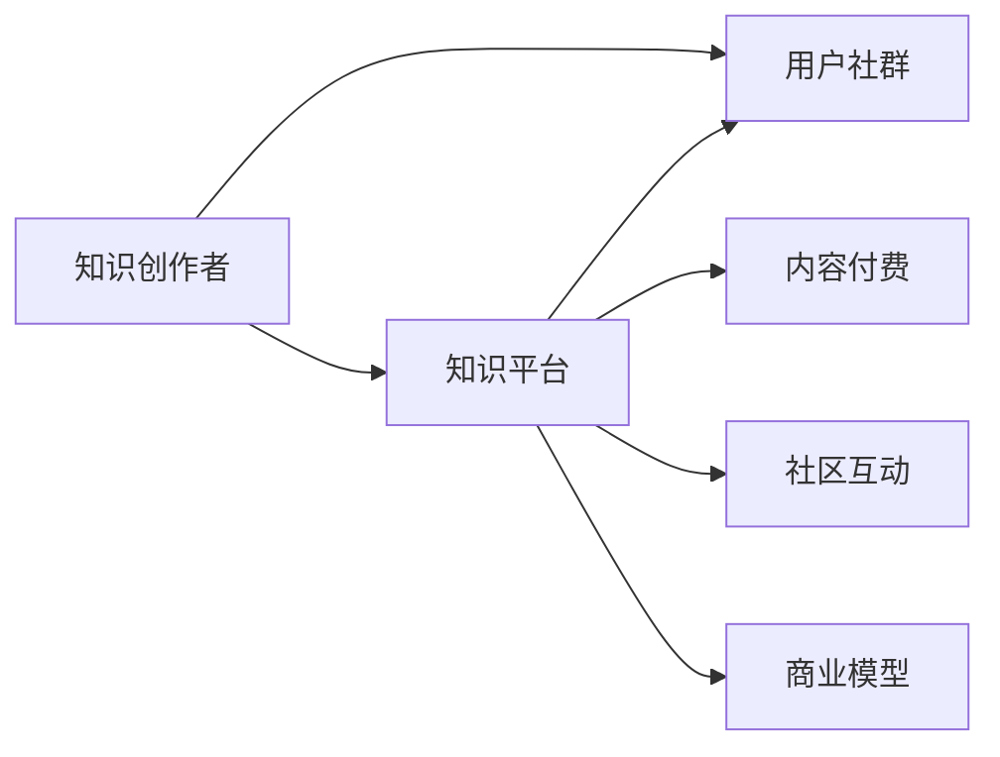

                 

# 如何打造个人知识付费生态圈

## 1. 背景介绍

在信息爆炸的时代，知识付费成为一种新的趋势，个人知识付费生态圈也成为互联网创业者、内容创作者、技术专家等领域的普遍需求。借助互联网平台，个人可以高效传播知识，同时获得收益。个人知识付费生态圈不仅能够提升个人影响力，还能实现与用户的互动，构建可持续的商业模型。本文将详细探讨如何打造个人知识付费生态圈，从核心概念到具体步骤，从算法原理到实际应用，全面解析这一领域的实现路径。

## 2. 核心概念与联系

### 2.1 核心概念概述

- **知识付费**：指通过在线平台购买、租赁、订阅等形式，获取知识内容的商业模型。知识付费生态圈通过提供有价值的知识内容，满足用户对知识的需求，同时实现盈利。

- **知识平台**：如微信公众号、知识星球、知乎live等平台，提供知识分享与交流的平台。

- **知识创作者**：包括技术专家、教育者、作者等，通过平台发布原创内容，进行知识传播与变现。

- **用户社群**：指活跃在知识平台的用户群体，以获取知识为目标，进行社区互动、知识讨论。

- **内容付费**：指平台或创作者通过付费订阅、单次购买、付费问答等形式获取收益的方式。

- **社区互动**：指用户与创作者之间的互动行为，如点赞、评论、提问、付费等。

- **商业模型**：包括广告、会员订阅、付费问答、付费课程、内容付费等多种形式，实现可持续收入的商业模式。

这些概念通过互联网平台和知识创作者与用户的互动，形成一个完整的知识付费生态圈。本文将详细解析这些概念的内在联系和实现路径。

### 2.2 核心概念原理和架构的 Mermaid 流程图



## 3. 核心算法原理 & 具体操作步骤

### 3.1 算法原理概述

个人知识付费生态圈的构建，核心在于知识内容的生产和消费。创作者通过平台发布内容，用户通过付费获取知识。本文重点讨论内容付费与社区互动两大核心算法原理。

- **内容付费**：指平台或创作者通过付费订阅、单次购买、付费问答等形式获取收益。关键在于设置合理的价格和内容形式，吸引用户付费。

- **社区互动**：指用户与创作者之间的互动行为，如点赞、评论、提问、付费等。关键在于提供良好的互动体验，促进用户参与。

### 3.2 算法步骤详解

#### 3.2.1 内容付费算法步骤

1. **内容选择**：创作者选择与自身专业相关的知识内容，通过平台进行发布。

2. **内容定价**：根据内容的价值、难度、互动性等因素，设置合理的价格。

3. **内容发布**：创作者发布内容，平台进行审核和展示。

4. **用户订阅**：用户选择订阅内容，进行付费。

5. **内容更新**：创作者根据用户反馈，不断更新和完善内容。

#### 3.2.2 社区互动算法步骤

1. **内容互动**：用户在平台对内容进行点赞、评论等互动。

2. **问题提问**：用户向创作者提出问题，创作者进行回答。

3. **付费问答**：用户付费提问，创作者进行详细解答。

4. **内容推荐**：平台根据用户互动记录，推荐相关内容。

5. **用户参与度统计**：平台统计用户互动数据，进行社区优化。

### 3.3 算法优缺点

#### 3.3.1 内容付费算法的优点

- **高价值内容**：通过创作者选择和审核，确保内容的高质量和专业性。
- **多样化内容**：覆盖各领域的知识，满足不同用户的需求。
- **盈利模式稳定**：订阅和付费问答等形式，实现可持续的盈利模式。

#### 3.3.2 内容付费算法的缺点

- **价格门槛**：价格过高可能会降低用户的购买意愿。
- **创作者依赖**：依赖高质量的创作者，创作者不足可能影响平台内容丰富度。

#### 3.3.3 社区互动算法的优点

- **提升用户参与度**：通过互动机制，提高用户对平台的粘性。
- **知识交流**：用户与创作者之间的互动，促进知识的传播与交流。
- **社区优化**：根据用户互动数据，优化内容推荐和互动体验。

#### 3.3.4 社区互动算法的缺点

- **互动质量**：互动质量可能受用户素质影响，部分用户可能存在负面互动行为。
- **维护成本**：需要不断优化社区环境，防止恶意行为和垃圾信息。

### 3.4 算法应用领域

个人知识付费生态圈的应用领域广泛，包括但不限于以下几方面：

- **技术分享**：如编程、开发技术、人工智能等领域的知识分享与交流。
- **教育培训**：如课程教学、在线教育、学习资源等。
- **健康生活**：如健康管理、饮食营养、心理疏导等领域的知识传播。
- **文化娱乐**：如电影、音乐、文学等领域的知识讨论和分享。
- **专业咨询**：如法律、金融、医疗等专业领域的知识咨询与解答。

## 4. 数学模型和公式 & 详细讲解 & 举例说明

### 4.1 数学模型构建

以内容付费模型为例，我们建立一个简单的数学模型：

设内容库中有 $N$ 个内容，用户有 $U$ 个。每个内容的定价为 $p_i$，用户订阅了 $C_i$ 个内容，则总收益 $R$ 为：

$$
R = \sum_{i=1}^N p_i C_i
$$

用户订阅内容的期望收益 $E_i$ 为：

$$
E_i = p_i \frac{C_i}{U}
$$

### 4.2 公式推导过程

推导内容付费模型公式的关键在于考虑用户订阅内容的期望收益和内容定价。根据期望收益公式，用户订阅内容的期望收益等于内容定价乘以订阅次数除以用户总数。总收益等于所有内容的定价乘以订阅次数的和。

### 4.3 案例分析与讲解

假设内容库中有 10 个内容，用户有 1000 个，内容定价范围在 0.1 到 1 元之间。通过模拟用户订阅行为，计算不同定价策略下的总收益。例如，定价为 0.5 元，用户期望订阅 5 个内容，则期望收益为 2.5 元，总收益为 $10 \times 5 \times 0.5 = 25$ 元。

## 5. 项目实践：代码实例和详细解释说明

### 5.1 开发环境搭建

开发环境包括服务器、数据库、API 接口等，以下是一个简化的环境搭建流程：

1. **服务器环境**：使用AWS或阿里云等云服务搭建服务器环境。

2. **数据库选择**：选择MySQL或MongoDB等关系型或非关系型数据库，存储用户和内容信息。

3. **API接口**：使用Flask或Django等框架搭建API接口，实现用户注册、登录、订阅等功能。

### 5.2 源代码详细实现

以下是一个简单的用户注册、订阅功能的实现代码：

```python
# 用户注册接口
@app.route('/user/register', methods=['POST'])
def register():
    username = request.json['username']
    password = request.json['password']
    # 注册逻辑
    # ...

# 用户订阅接口
@app.route('/user/subscribe', methods=['POST'])
def subscribe():
    user_id = request.json['user_id']
    content_id = request.json['content_id']
    # 订阅逻辑
    # ...

# 内容发布接口
@app.route('/content/publish', methods=['POST'])
def publish():
    content_title = request.json['content_title']
    content_content = request.json['content_content']
    # 发布逻辑
    # ...
```

### 5.3 代码解读与分析

这段代码主要实现了一个用户注册、订阅和内容发布的流程，具体细节如下：

- **用户注册**：用户通过POST请求，提供用户名和密码，调用`/register`接口，注册为平台用户。
- **用户订阅**：用户通过POST请求，提供用户ID和内容ID，调用`/subscribe`接口，订阅指定内容。
- **内容发布**：创作者通过POST请求，提供内容标题和内容，调用`/publish`接口，发布新内容。

## 6. 实际应用场景

### 6.1 技术分享平台

如GitHub、Stack Overflow等技术分享平台，通过提供高质量的技术文章、代码片段、开源项目等，吸引技术开发者和爱好者进行知识交流和互动。平台通过内容付费、广告等多种形式实现盈利。

### 6.2 在线教育

如Coursera、Udemy等在线教育平台，提供各类课程教学和资源共享，通过课程订阅、单次购买等形式实现盈利。平台通过社区互动、课程更新等手段提升用户体验。

### 6.3 健康管理

如健康管理平台，如Keep、Fitbit等，提供健康饮食、运动管理、心理疏导等知识分享，通过内容付费、会员订阅等形式实现盈利。平台通过社区互动、数据报告等提升用户粘性。

### 6.4 文化娱乐

如电影评论、音乐欣赏等平台，如豆瓣、网易云音乐等，通过提供专业评论、歌曲推荐等知识内容，吸引用户付费和互动，实现盈利。平台通过社区互动、内容更新等提升用户体验。

## 7. 工具和资源推荐

### 7.1 学习资源推荐

1. **Coursera平台**：提供各类在线课程和专业认证，涵盖技术、商业、人文等多个领域。
2. **Udemy平台**：提供数千门课程和技能培训，覆盖编程、设计、营销等方向。
3. **edX平台**：由哈佛大学和麻省理工学院等顶尖高校联合创办，提供高质量的在线课程。
4. **慕课网**：国内知名的在线教育平台，提供各类软件开发、数据分析、项目管理等课程。
5. **网易云课堂**：提供音乐、编程、设计、教育等课程，拥有丰富的教学资源和课程内容。

### 7.2 开发工具推荐

1. **Flask框架**：轻量级的Web框架，易于上手，适合快速搭建API接口。
2. **Django框架**：功能强大的Web框架，支持各种业务逻辑，适合复杂的Web应用开发。
3. **MySQL数据库**：广泛使用关系型数据库，支持高并发、高可靠性。
4. **MongoDB数据库**：灵活的非关系型数据库，适合存储大量非结构化数据。
5. **AWS云服务**：提供稳定的云服务环境，支持弹性计算和数据存储。

### 7.3 相关论文推荐

1. **《知识付费的经济学分析》**：分析知识付费的经济价值和模型设计。
2. **《社区互动与用户粘性的影响因素分析》**：研究社区互动对用户粘性的影响和提升策略。
3. **《内容付费平台的盈利模式研究》**：探讨不同付费模式对平台盈利的影响和优化方案。
4. **《在线教育平台的用户行为分析》**：分析在线教育平台用户行为特征和互动模型。

## 8. 总结：未来发展趋势与挑战

### 8.1 研究成果总结

个人知识付费生态圈已取得显著成效，通过技术赋能，实现知识传播和变现。平台通过内容付费、社区互动、广告等多种方式盈利，创作者通过分享知识和经验，获得稳定的收入。

### 8.2 未来发展趋势

未来，个人知识付费生态圈将呈现以下趋势：

- **技术赋能**：随着AI和大数据技术的发展，平台能够提供更加个性化、智能化的推荐和内容推送。
- **跨平台融合**：各平台之间数据互通，实现知识内容的无缝切换和共享。
- **社交功能增强**：社区功能更加完善，用户之间的互动更加紧密，形成真正的知识社区。
- **知识付费市场细分化**：各类知识付费平台逐渐细分，针对特定领域的知识需求，提供精准内容。
- **新兴盈利模式**：如知识付费+直播、知识付费+电商等新型盈利模式逐渐兴起。

### 8.3 面临的挑战

尽管个人知识付费生态圈发展迅速，但仍面临诸多挑战：

- **内容质量**：创作者数量庞大，但高质量内容的产出仍不足，内容同质化问题较为严重。
- **用户互动**：社区环境维护难度大，用户互动质量参差不齐，负面互动行为频繁。
- **平台监管**：平台需要不断优化监管机制，防止版权侵权、恶意互动等不良行为。
- **盈利模式单一**：现有盈利模式较为单一，需要探索更多创新路径，提升平台盈利能力。

### 8.4 研究展望

未来，个人知识付费生态圈将进一步发展，解决上述挑战：

- **高质量内容产出**：通过平台激励机制，吸引更多高质量创作者，提升内容质量。
- **互动质量优化**：通过社区管理机制和算法优化，提升用户互动质量，减少负面行为。
- **平台监管增强**：建立健全监管机制，提升平台运营效率，保障用户权益。
- **多元盈利模式**：探索更多盈利模式，如知识付费+直播、知识付费+电商等，实现多元化盈利。

## 9. 附录：常见问题与解答

### 9.1 常见问题

**Q1：如何提高内容质量？**

A: 平台可以建立内容审核机制，通过人工审核或自动算法筛选，确保内容质量。同时，平台可以提供激励机制，吸引高质量创作者进行内容创作。

**Q2：如何提升用户互动质量？**

A: 平台可以通过社区规则和激励机制，提升用户互动质量。同时，通过算法优化，推荐高质量内容和创作者，减少负面互动行为。

**Q3：如何优化平台盈利模式？**

A: 平台可以探索更多盈利模式，如知识付费+直播、知识付费+电商等，实现多元化盈利。同时，通过数据驱动的精准推荐，提升用户付费意愿。

**Q4：如何处理版权问题？**

A: 平台需要建立健全的版权机制，确保内容的版权归属明确，同时提供法律支持，解决版权纠纷。

**Q5：如何提升用户粘性？**

A: 平台可以通过社区互动、数据报告、个性化推荐等方式，提升用户粘性。同时，提供多样化的内容形式，满足用户不同需求。

---

作者：禅与计算机程序设计艺术 / Zen and the Art of Computer Programming

