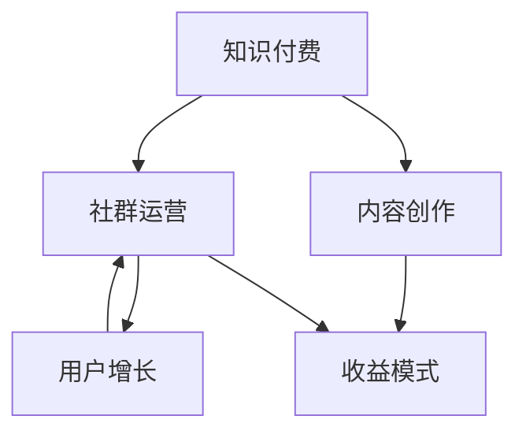

                 

# 如何打造个人知识付费社群

> 关键词：知识付费,社群运营,内容创作,用户增长,收益模式,技术实施

## 1. 背景介绍

### 1.1 问题由来
在知识经济的时代，个人知识付费社群正在成为知识传播和变现的重要渠道。相比于传统的博客、视频平台，个人知识付费社群拥有更为紧密的用户互动和内容沉淀。这种模式不仅能满足用户对高质内容的需求，还能提供个性化的知识服务，实现更高效的付费转化。

### 1.2 问题核心关键点
打造个人知识付费社群的关键在于内容质量、用户体验、社群运营和收益模式的合理设计。本文将详细介绍如何从内容创作、社群运营和收益模式三个维度出发，打造一个成功的个人知识付费社群。

### 1.3 问题研究意义
通过深入分析个人知识付费社群的构建要素，本文旨在提供一份全面的指南，帮助更多有志于知识传播的创作者，提升社群运营能力，实现稳定的知识变现。个人知识付费社群的成功运营，不仅能带来经济收益，还能推动知识共享和传播，构建更加健康和谐的知识生态。

## 2. 核心概念与联系

### 2.1 核心概念概述

为更好地理解如何打造个人知识付费社群，本节将介绍几个关键概念：

- 知识付费：指用户为获取高质量内容或服务支付费用的行为，包括在线课程、咨询、订阅文章等。
- 社群运营：指通过组织管理、内容互动等方式，构建有粘性、有价值的社群，促进知识分享和用户互动。
- 内容创作：指制作高质量、有价值的知识内容，涵盖文字、视频、音频等多种形式。
- 用户增长：指通过市场推广、用户激励等手段，扩大社群规模，提升用户活跃度。
- 收益模式：指社群运营的盈利方式，包括会员付费、课程销售、广告分成、增值服务等多种渠道。

这些概念之间的逻辑关系可以通过以下Mermaid流程图来展示：



这个流程图展示了这个系统的核心概念及其之间的关系：

1. 知识付费是社群运营和内容创作的目标，是收益模式的基础。
2. 社群运营和内容创作相辅相成，高质量内容能吸引更多用户，良好的社群运营则能促进内容传播。
3. 用户增长依赖于社群运营和内容创作，更多用户带来更大的收益。
4. 收益模式支持社群运营和内容创作，实现持续运营和扩展。

## 3. 核心算法原理 & 具体操作步骤
### 3.1 算法原理概述

打造个人知识付费社群的过程，本质上是一个持续的内容输出和社群维护的动态过程。其核心思想是：通过高质量的内容吸引和留存用户，通过精细的社群运营提高用户粘性和活跃度，通过多元化的收益模式实现经济循环。

形式化地，假设社群中的内容创作者为 $C_{\theta}$，用户为 $U$，收益模型为 $R$。社群的运营目标是最大化收益 $R$，即找到最优的参数 $\theta$ 使得：

$$
\theta^* = \mathop{\arg\max}_{\theta} R(C_{\theta},U)
$$

其中 $R$ 为收益模型，通常包括会员订阅收入、课程销售收入、广告分成收入等。

### 3.2 算法步骤详解

打造个人知识付费社群的一般包括以下几个关键步骤：

**Step 1: 确定内容定位和特色**
- 明确社群的目标受众和主题领域。
- 分析用户需求，设计符合用户兴趣和需求的内容主题。
- 确定内容形式，如文字、视频、音频、直播等。

**Step 2: 招募和培养内容创作者**
- 吸引有潜力的内容创作者加入社群，并提供系统的培训和指导。
- 制定内容质量标准，设立激励机制，鼓励创作者持续输出高质量内容。
- 定期对内容创作者进行评估和反馈，帮助其不断提升内容质量。

**Step 3: 设计和维护社群互动机制**
- 建立完善的社群规则，营造健康互动的环境。
- 设置用户行为激励措施，如积分、等级、徽章等，提升用户参与度。
- 定期组织线上线下活动，增强用户粘性和社群凝聚力。

**Step 4: 选择和优化收益模式**
- 选择合适的收益模式，如会员订阅、课程销售、广告分成等。
- 根据社群特点，灵活调整收益模式，平衡社群运营和创作者收益。
- 通过数据监测和用户反馈，不断优化收益模式，提升收益效果。

**Step 5: 持续迭代优化**
- 定期对社群运营进行评估和复盘，总结经验和教训。
- 根据用户需求和技术进步，持续优化内容和运营策略。
- 利用数据分析和用户行为研究，指导社群的下一步发展。

以上是打造个人知识付费社群的一般流程。在实际应用中，还需要针对具体社群的特点，对各个环节进行优化设计，如改进内容激励机制、引入新型的社群运营工具、探索多元化的收益渠道等，以进一步提升社群效果。

### 3.3 算法优缺点

打造个人知识付费社群的方法具有以下优点：
1. 高效变现。通过精准的内容定位和用户需求分析，社群能快速吸引并锁定目标用户，实现高效付费转化。
2. 提升用户粘性。通过社群互动和内容共鸣，增强用户粘性，提升用户活跃度和留存率。
3. 激发创作者活力。通过收益分成和激励机制，提升内容创作者的动力，促进高质量内容的持续输出。
4. 社区良性发展。通过完善的社群规则和活动，营造健康和谐的社区环境，实现社区良性循环。

同时，该方法也存在一定的局限性：
1. 依赖优质内容。社群的吸引力很大程度上取决于内容的质量，需要持续投入人力和资源进行内容创作。
2. 运营成本高。社群维护需要投入大量人力和物力，初期运营成本较高。
3. 风险不易控制。社群运营存在一定的市场风险和用户流失风险，需要具备较强的风险控制能力。
4. 收益模式单一。单一的收益模式可能难以适应社群多样化的需求，需要灵活调整。

尽管存在这些局限性，但就目前而言，打造个人知识付费社群的范式仍是目前知识变现的主流方式。未来相关研究的重点在于如何进一步降低运营成本，丰富收益模式，同时兼顾用户粘性和创作者利益。

### 3.4 算法应用领域

个人知识付费社群的构建方法，广泛应用于在线教育、技术分享、企业培训等多个领域，具体示例如下：

- 在线教育平台：如Coursera、Udemy等，通过内容创作者和社群运营，提供高质量在线课程。
- 技术分享社区：如Stack Overflow、GitHub等，吸引开发者分享技术经验和项目，促进知识交流。
- 企业内训系统：如Slack内部学习系统，通过企业内部专家分享知识，提升团队技能和知识储备。

此外，个人知识付费社群还可应用于更多场景中，如文化传承、心理辅导、健身指导等，为各行业带来知识分享和价值变现的新路径。

## 4. 数学模型和公式 & 详细讲解 & 举例说明

### 4.1 数学模型构建

为了更好地理解如何打造个人知识付费社群，我们假设社群中的内容创作者为 $C_{\theta}$，用户为 $U$，收益模型为 $R$。社群的运营目标是最大化收益 $R$，即找到最优的参数 $\theta$ 使得：

$$
\theta^* = \mathop{\arg\max}_{\theta} R(C_{\theta},U)
$$

其中 $R$ 为收益模型，通常包括会员订阅收入、课程销售收入、广告分成收入等。

### 4.2 公式推导过程

为了简化问题，我们假设社群中的收益主要来源于会员订阅收入 $R_{sub}$ 和课程销售收入 $R_{course}$，公式如下：

$$
R(C_{\theta},U) = R_{sub}(C_{\theta},U) + R_{course}(C_{\theta},U)
$$

其中，$R_{sub}$ 表示会员订阅收入，$R_{course}$ 表示课程销售收入。$C_{\theta}$ 表示内容创作者，$U$ 表示社群用户。

会员订阅收入 $R_{sub}$ 的计算公式如下：

$$
R_{sub}(C_{\theta},U) = \sum_{i} (p_i \cdot n_i)
$$

其中 $p_i$ 表示第 $i$ 类会员的订阅价格，$n_i$ 表示订阅该类会员的用户数。

课程销售收入 $R_{course}$ 的计算公式如下：

$$
R_{course}(C_{\theta},U) = \sum_{j} (c_j \cdot s_j)
$$

其中 $c_j$ 表示第 $j$ 门课程的价格，$s_j$ 表示购买该课程的用户数。

结合以上公式，我们可以得到社群收益的计算公式：

$$
R(C_{\theta},U) = \sum_{i} (p_i \cdot n_i) + \sum_{j} (c_j \cdot s_j)
$$

为了最大化收益 $R$，我们需要优化 $C_{\theta}$ 和 $U$，即寻找最优的创作者和用户组合，使得 $R$ 最大化。

### 4.3 案例分析与讲解

以下我们以技术分享社群为例，给出如何使用数学模型来分析和优化社群收益。

假设一个技术分享社群，内容创作者为 5 名工程师，每人每月创作 1 篇技术文章，用户数为 1000 人，分成高级会员和普通会员两类，高级会员订阅价格为 50 元/月，普通会员订阅价格为 20 元/月。社群每门技术课程售价为 100 元。

1. 计算基本收益：
- 高级会员收入：$1000 \cdot 500 \cdot 50 = 250000$ 元/月
- 普通会员收入：$1000 \cdot 500 \cdot 20 = 100000$ 元/月
- 课程销售收入：假设一个月销售 2 门课程，$2 \cdot 100 = 200$ 元/月

2. 计算总收益：
- 总收益：$250000 + 100000 + 200 = 350000$ 元/月

为了进一步提升收益，可以考虑引入更多的创作者和优质内容，提高用户参与度和课程购买率。同时，可以通过优化定价策略，设置阶梯会员价格和分级课程价格，以吸引更多用户订阅和购买。

## 5. 项目实践：代码实例和详细解释说明
### 5.1 开发环境搭建

在进行社群运营实践前，我们需要准备好开发环境。以下是使用Python进行Django开发的环境配置流程：

1. 安装Anaconda：从官网下载并安装Anaconda，用于创建独立的Python环境。

2. 创建并激活虚拟环境：
```bash
conda create -n django-env python=3.8 
conda activate django-env
```

3. 安装Django：
```bash
pip install django
```

4. 安装各类工具包：
```bash
pip install numpy pandas scikit-learn matplotlib tqdm jupyter notebook ipython
```

完成上述步骤后，即可在`django-env`环境中开始社群运营实践。

### 5.2 源代码详细实现

下面我们以一个简单的技术分享社群为例，给出使用Django进行社群运营的代码实现。

首先，定义社群和用户模型：

```python
from django.db import models
from django.contrib.auth.models import AbstractUser

class User(AbstractUser):
    pass

class Community(models.Model):
    name = models.CharField(max_length=100)
    description = models.TextField()
    members = models.ManyToManyField(User)
```

然后，定义内容模型和订阅模型：

```python
class Content(models.Model):
    title = models.CharField(max_length=200)
    author = models.ForeignKey(User, on_delete=models.CASCADE)
    content = models.TextField()
    category = models.CharField(max_length=100)
    views = models.IntegerField(default=0)
    likes = models.IntegerField(default=0)

class Membership(models.Model):
    user = models.ForeignKey(User, on_delete=models.CASCADE)
    community = models.ForeignKey(Community, on_delete=models.CASCADE)
    subscription_type = models.CharField(max_length=100)
    subscription_date = models.DateField()
```

接着，定义收益模型：

```python
class Revenue(models.Model):
    community = models.ForeignKey(Community, on_delete=models.CASCADE)
    revenue_type = models.CharField(max_length=100)
    amount = models.DecimalField(max_digits=10, decimal_places=2)
    date = models.DateField()
```

最后，定义社群运营相关的视图和模板：

```python
from django.shortcuts import render
from django.views.generic import ListView

def community_list(request):
    communities = Community.objects.all()
    return render(request, 'community_list.html', {'communities': communities})

def content_list(request, community_id):
    community = Community.objects.get(id=community_id)
    contents = Content.objects.filter(community=community).order_by('-views')
    return render(request, 'content_list.html', {'community': community, 'contents': contents})

def membership_list(request, community_id):
    community = Community.objects.get(id=community_id)
    memberships = Membership.objects.filter(community=community)
    return render(request, 'membership_list.html', {'community': community, 'memberships': memberships})

def revenue_list(request, community_id):
    community = Community.objects.get(id=community_id)
    revenues = Revenue.objects.filter(community=community)
    return render(request, 'revenue_list.html', {'community': community, 'revenues': revenues})
```

在上述代码中，我们使用了Django框架来搭建社群运营系统。通过定义用户、社群、内容、订阅和收益等模型，实现了社群的创建、内容发布、用户订阅和收益统计等功能。同时，通过视图和模板的灵活组合，支持了对社群运营数据的前端展示。

### 5.3 代码解读与分析

让我们再详细解读一下关键代码的实现细节：

**社群和用户模型**：
- 用户模型继承了Django内置的`AbstractUser`，以支持用户身份认证和权限管理。
- 社群模型包含了社群的名称、描述和成员信息，实现了社群的创建和管理。

**内容模型和订阅模型**：
- 内容模型包含了文章标题、作者、内容、分类、浏览量和点赞数等信息，实现了内容的发布和管理。
- 订阅模型包含了用户、社群和订阅类型等信息，实现了用户对社群的订阅管理。

**收益模型**：
- 收益模型包含了社群、收益类型、金额和日期等信息，实现了收益的统计和管理。

**视图和模板**：
- `community_list`视图用于展示所有社群。
- `content_list`视图用于展示指定社群的内容列表。
- `membership_list`视图用于展示指定社群的用户订阅列表。
- `revenue_list`视图用于展示指定社群的收益列表。

以上代码实现了社群运营的基础功能，如社群创建、内容发布、用户订阅和收益统计等。开发者可以根据实际需求，进一步扩展系统的功能和界面，如内容评论、用户评论、管理员管理等。

## 6. 实际应用场景
### 6.1 智能客服系统

智能客服系统是个人知识付费社群的重要应用场景之一。通过创建智能客服社群，企业可以实时回答用户问题，提升客户满意度，降低人力成本。

在技术实现上，可以建立一个以自然语言处理为基础的智能客服系统，吸引技术爱好者和社区成员参与开发和维护。用户可以通过社群平台提交问题，智能客服系统根据问题自动匹配答案，如果无法匹配，则由人工客服进行干预。同时，可以通过社群互动和讨论，不断优化智能客服系统，提升其问答精度和用户体验。

### 6.2 金融舆情监测

金融舆情监测是另一个典型的应用场景。通过创建金融领域的社群，汇集投资者和分析师，分享市场动态和投资策略，实时监测舆情变化，有助于投资者做出更明智的投资决策。

在社群运营上，可以通过举办金融知识讲座、分享投资案例等活动，吸引更多用户参与。同时，利用社群成员的专业知识和经验，实时监测市场舆情，发布投资提示，提升投资收益。

### 6.3 在线教育平台

在线教育平台是个人知识付费社群的主要应用方向之一。通过建立以课程和教师为主导的社群，提供优质的教育资源和互动平台，吸引学生和教师参与，实现知识共享和教育价值变现。

在技术实现上，可以创建一个包含课程发布、学生学习、教师互动等功能的一站式教育平台，提供丰富的课程和教学资源，支持学生自主学习和教师互动交流。同时，通过社群运营，吸引更多优质内容创作者，提升课程质量，促进学生和教师的良性互动。

### 6.4 未来应用展望

随着个人知识付费社群的不断发展和完善，未来的应用场景将更加丰富和多样化。

- 在智慧城市治理中，可以创建城市公共服务社群，提供便捷的智能服务，如智能家居、公共安全等，提升城市治理效率。
- 在智慧农业领域，可以创建农业技术分享社群，吸引农民和农业专家参与，提供农业技术支持和农业资源共享，推动农业现代化。
- 在医疗健康领域，可以创建医疗知识分享社群，提供健康咨询、疾病预防、医疗知识普及等服务，提升公众健康水平。

总之，个人知识付费社群将成为连接知识创作者和用户的桥梁，推动知识共享和价值变现，为各行各业带来新的发展机遇。

## 7. 工具和资源推荐
### 7.1 学习资源推荐

为了帮助开发者系统掌握个人知识付费社群的理论基础和实践技巧，这里推荐一些优质的学习资源：

1. Django官方文档：详细介绍了Django框架的使用方法和最佳实践，是学习Django开发的基础。

2. Django社区：活跃的开发者社区，提供大量的教程、代码示例和问题解答，帮助开发者快速上手。

3. Django实战：本书详细介绍了使用Django开发实际应用的案例，涵盖数据管理、用户认证、内容发布等模块。

4. Django基础教程：适合初学者的入门教程，详细讲解了Django的基本概念和应用场景。

5. Django开发实战：通过多个实战项目，帮助开发者系统掌握Django的开发技巧。

通过学习这些资源，相信你一定能够快速掌握Django开发的基础知识和实战技能，进而构建个人知识付费社群。

### 7.2 开发工具推荐

高效的开发离不开优秀的工具支持。以下是几款用于Django开发常用的工具：

1. PyCharm：一款强大的IDE工具，支持Django框架的开发和调试，提供代码自动补全、版本控制等功能。

2. VSCode：开源的代码编辑器，支持Python开发，提供丰富的插件和扩展，提升开发效率。

3. Docker：容器化开发工具，支持Django应用在不同环境下的部署和测试，确保应用的一致性和稳定性。

4. Git：版本控制系统，支持Django应用的版本管理和团队协作，方便开发者跟踪代码变更和代码审查。

5. Heroku：云平台，支持Django应用的快速部署和扩展，提供自动化的运维和管理功能。

合理利用这些工具，可以显著提升Django应用的开发效率，加快项目迭代和迭代。

### 7.3 相关论文推荐

个人知识付费社群的发展，得益于Django框架和Web开发技术的进步。以下是几篇奠基性的相关论文，推荐阅读：

1. "The Django Book"：详细介绍了Django框架的使用方法和最佳实践，是学习Django开发的基础。

2. "Django REST Framework"：介绍了Django REST框架的使用方法和开发技巧，适用于构建API和RESTful服务。

3. "Django CMS"：介绍了Django内容管理系统（CMS）的使用方法和应用场景，适用于构建企业级应用。

4. "Web Development with Django"：通过实战项目，详细讲解了使用Django开发Web应用的技巧和方法。

5. "The Django for Humans Book"：适合初学者入门，详细讲解了Django的基本概念和应用场景。

这些论文代表了Django框架的发展历程，帮助开发者深入理解Django技术栈，快速构建高质量的应用。

## 8. 总结：未来发展趋势与挑战
### 8.1 总结

本文对如何打造个人知识付费社群的方法进行了全面系统的介绍。首先阐述了社群运营和内容创作的核心概念和关键要素，明确了社群运营的商业目标和操作流程。其次，从算法原理和具体操作步骤两个维度，详细讲解了如何通过数学模型和Django框架实现社群运营和收益管理。同时，本文还广泛探讨了社群运营在智能客服、金融舆情、在线教育等多个领域的应用前景，展示了社群运营的广阔前景。最后，本文精选了社群运营的相关学习资源和开发工具，力求为开发者提供全方位的技术指引。

通过本文的系统梳理，可以看到，个人知识付费社群正在成为知识变现的重要手段，借助社群运营和内容创作，知识创作者能够更好地实现经济收益，同时提升用户粘性和社群影响力。未来，随着社群运营和内容创作的不断创新，社群将带来更多的商业价值和社会影响，构建更加健康和谐的知识生态。

### 8.2 未来发展趋势

展望未来，个人知识付费社群的发展将呈现以下几个趋势：

1. 社区平台多样化。随着社交网络的不断扩展，社区平台将从单一的文本互动转向视频、直播等多种形式，提升用户互动体验。
2. 内容创作工具化。通过引入内容创作平台和工具，帮助创作者快速制作高质量内容，提升内容创作效率。
3. 社群运营自动化。利用AI和大数据技术，实现社群运营的自动化和智能化，提升运营效率和效果。
4. 收益模式多元化。除了传统的订阅和课程销售，未来将探索更多元化的收益模式，如知识付费、咨询服务等，丰富社群的盈利方式。
5. 用户激励智能化。通过智能推荐和个性化推荐，提升用户参与度和内容消费体验。
6. 社区治理民主化。利用社区治理工具，让用户参与社群管理，提升社群的透明度和信任度。

这些趋势将推动个人知识付费社群向更加智能化、多元化、社区化方向发展，为知识传播和价值变现带来新的机遇。

### 8.3 面临的挑战

尽管个人知识付费社群在知识传播和价值变现方面具有巨大的潜力，但在构建和运营过程中，仍面临诸多挑战：

1. 内容质量难以保障。内容创作的持续性和质量不稳定，是社群运营的重大挑战。如何吸引和激励优质创作者，保持内容创作的高质量和高频度，是社群运营的关键。
2. 运营成本高。社群运营需要投入大量人力和物力，初期运营成本较高。如何降低运营成本，实现可持续运营，是社群运营的难点。
3. 用户流失风险。社群用户的粘性和活跃度不稳定，容易受到竞争对手和市场波动的影响。如何提高用户留存率，增强社群的吸引力，是社群运营的挑战。
4. 内容版权问题。社群内容可能涉及版权问题，如何保护创作者版权，同时避免侵权风险，是社群运营的重要课题。
5. 收益模式单一。当前的收益模式可能难以适应社群多样化的需求，需要探索更多的盈利方式。

尽管存在这些挑战，但只要能够有效应对，个人知识付费社群将在知识传播和价值变现方面发挥越来越大的作用。

### 8.4 研究展望

面对个人知识付费社群的挑战，未来的研究需要在以下几个方面寻求新的突破：

1. 引入智能内容推荐。利用推荐系统算法，提升内容的匹配度和用户满意度，促进内容的消费和传播。
2. 优化社群运营算法。引入多模态数据和用户行为分析，优化社群运营策略，提升运营效果。
3. 探索多种收益模式。引入社区电商、广告分成等多元化的收益模式，实现多渠道盈利。
4. 增强内容创作的激励机制。引入多样化的激励措施，如内容打赏、版权收益等，提升内容创作的动力。
5. 建立社区治理机制。引入社区治理工具，提升社群的透明度和信任度，增强用户粘性。

这些研究方向将推动个人知识付费社群的不断发展和完善，为知识创作者和用户带来更多的价值和收益。

## 9. 附录：常见问题与解答

**Q1：社群运营是否需要人力支持？**

A: 社群运营需要一定的人力支持，特别是初期阶段。需要专门的人员负责社群管理、内容审核、用户互动等任务。但随着技术的进步和工具的完善，社群运营的效率将不断提升，人员成本也会逐渐降低。

**Q2：如何吸引优质内容创作者？**

A: 吸引优质内容创作者需要综合多方面的策略。可以从以下角度入手：
1. 提供激励措施：通过付费分成、版权收益等方式，激励创作者持续输出高质量内容。
2. 提供展示平台：为创作者提供展示自己的机会，提升其知名度和影响力。
3. 提供培训资源：提供技术培训、内容创作指导等支持，帮助创作者提升创作水平。
4. 提供社区支持：建立友好的社群环境，鼓励创作者交流互动，提升创作热情。

**Q3：如何提高用户留存率？**

A: 提高用户留存率需要从多个维度入手：
1. 提供优质内容：通过持续输出高质量内容，满足用户需求，提升用户满意度。
2. 提供互动体验：通过社群活动、用户讨论等方式，增强用户粘性和互动体验。
3. 提供个性化服务：利用用户行为数据，提供个性化的内容推荐和互动建议，提升用户满意度。
4. 提供用户激励：通过积分、徽章、等级等激励措施，提升用户参与度和留存率。

**Q4：如何处理内容版权问题？**

A: 处理内容版权问题需要遵循以下原则：
1. 尊重创作者版权：明确版权归属，保障创作者合法权益。
2. 引入版权协议：与创作者签订版权协议，明确版权归属和使用范围。
3. 提供版权保护：利用版权保护技术，如版权声明、数字水印等，保护创作者版权。
4. 建立版权审核机制：建立版权审核机制，定期审核内容版权，防止侵权风险。

**Q5：如何选择收益模式？**

A: 选择收益模式需要综合考虑社群的特点和用户需求。可以从以下角度入手：
1. 分析用户需求：通过用户调研和数据分析，了解用户的付费意愿和使用习惯，选择适合的收益模式。
2. 分析社群特点：根据社群的内容类型和运营方式，选择合适的收益模式。
3. 选择多种收益模式：通过多种收益模式的组合，提升社群的经济收益和用户粘性。
4. 定期评估收益效果：定期评估收益模式的效果，根据反馈进行调整和优化。

通过这些问答，希望能够帮助读者更好地理解个人知识付费社群的构建和运营，提升社群的运营效果和收益潜力。

---

作者：禅与计算机程序设计艺术 / Zen and the Art of Computer Programming

