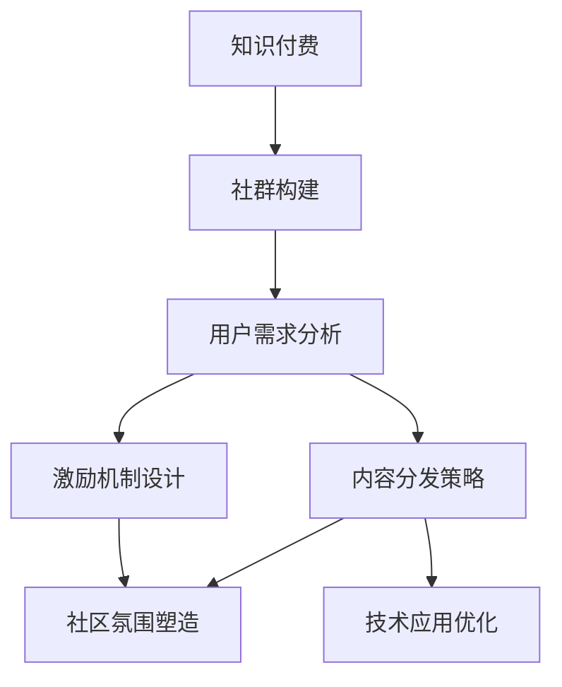

                 

# 如何打造个人知识付费社群

> 关键词：知识付费, 社群构建, 用户行为分析, 内容分发策略, 激励机制, 社区运营, 技术应用

## 1. 背景介绍

### 1.1 问题由来

随着互联网和移动互联网的普及，人们获取知识的方式发生了巨大变化。传统的书籍、课堂、研讨会等形式已经难以满足日益增长的知识需求。知识付费作为新兴的学习模式，逐渐成为互联网时代的趋势。特别是在疫情影响下，线上教育更加普及，知识付费市场迎来了爆发式增长。

然而，知识付费市场也面临着诸多挑战，如内容同质化严重、用户体验差、付费转化率低等问题。如何在激烈的市场竞争中脱颖而出，构建一个可持续发展的个人知识付费社群，成为众多内容创作者和平台运营商共同追求的目标。

### 1.2 问题核心关键点

打造个人知识付费社群的核心在于如何吸引用户，提升用户体验，增加付费转化率，并实现社群的自我发展和良性循环。具体来说，需要关注以下核心点：

- **用户需求分析**：精准把握用户需求，提供真正有价值的内容。
- **社群运营策略**：设计合理的社群运营流程，建立良好的用户互动机制。
- **内容分发策略**：通过算法推荐、社区热门等方式，提升内容曝光率。
- **激励机制设计**：设计激励机制，激发用户创造和分享，形成正反馈循环。
- **社区氛围塑造**：营造积极的社区氛围，增强用户粘性。
- **技术应用优化**：利用大数据、机器学习等技术提升用户体验和内容精准度。

## 2. 核心概念与联系

### 2.1 核心概念概述

为更好地理解如何打造个人知识付费社群，本节将介绍几个关键概念及其相互联系：

- **知识付费**：指通过付费方式获取知识和信息的服务模式，包括在线课程、电子书、音频、视频等形式。
- **社群**：基于共同兴趣、需求或目标而形成的群体，成员之间可以进行互动交流、分享信息。
- **用户需求分析**：通过调研、数据分析等手段，了解用户的知识需求和学习习惯。
- **内容分发策略**：设计有效的算法和机制，将优质内容推荐给目标用户。
- **激励机制**：通过奖励机制，激发用户参与内容创作和分享的积极性。
- **社区氛围塑造**：营造积极的社区环境，增强用户归属感和参与感。
- **技术应用**：利用大数据、人工智能等技术手段，提升社群运营效率和用户体验。

这些概念通过以下Mermaid流程图进行联系展示：



这个流程图展示了知识付费与社群构建之间的联系，以及各个核心概念之间的相互作用：

1. 基于用户需求分析，设计内容分发策略，并通过技术手段优化，提升用户体验。
2. 通过激励机制设计和社区氛围塑造，激发用户积极参与，形成正反馈循环。
3. 技术应用可以提升运营效率，支持上述各项工作的实施。

## 3. 核心算法原理 & 具体操作步骤

### 3.1 算法原理概述

打造个人知识付费社群的核心算法主要涉及用户行为分析、内容推荐、激励机制设计等方面。以下是这些算法的基本原理：

- **用户行为分析**：利用机器学习算法对用户行为数据进行建模，预测用户需求和学习路径，从而提供个性化推荐。
- **内容推荐算法**：根据用户兴趣、历史行为、社交关系等因素，推荐相关内容，提升内容曝光率和用户满意度。
- **激励机制设计**：通过积分、勋章、排行榜等方式，激励用户参与内容创作和分享，增加社区活跃度。

### 3.2 算法步骤详解

以下是打造个人知识付费社群的具体操作步骤：

#### Step 1: 用户需求分析

1. **调研问卷**：设计调研问卷，收集用户基本信息、学习兴趣、需求等数据。
2. **数据分析**：利用机器学习算法对用户数据进行建模，识别用户兴趣、需求热点等。
3. **行为预测**：根据历史数据，预测用户行为和未来需求，形成用户画像。

#### Step 2: 内容分发策略

1. **内容标签化**：对内容进行标签化处理，形成内容分类体系。
2. **推荐算法设计**：设计基于协同过滤、内容相似性、用户画像等内容的推荐算法。
3. **实时调整**：根据用户反馈和行为数据，实时调整推荐策略，提升内容匹配度。

#### Step 3: 激励机制设计

1. **积分系统设计**：设计积分系统，对用户行为进行积分记录和奖励。
2. **勋章和排行榜**：设置勋章和排行榜，奖励活跃用户和优秀内容创作者。
3. **动态调整**：根据用户行为和反馈，动态调整激励机制，保持激励效果。

#### Step 4: 社区氛围塑造

1. **用户互动机制**：设计讨论区、问答区、小组讨论等互动机制，促进用户交流。
2. **内容评价机制**：建立内容评价机制，用户可以对内容进行打分和评论，形成正向反馈。
3. **社区规则制定**：制定社区规则，鼓励健康积极的互动行为，避免负面内容。

#### Step 5: 技术应用优化

1. **大数据分析**：利用大数据分析技术，实时监控社群运营数据，优化运营策略。
2. **机器学习优化**：通过机器学习模型，提升内容推荐和用户行为预测的精准度。
3. **实时互动技术**：利用WebSocket、实时推送等技术，提升用户互动效率。

### 3.3 算法优缺点

基于上述算法，打造个人知识付费社群具有以下优点：

- **精准推荐**：通过用户行为分析和内容分发算法，提升内容匹配度，提升用户满意度。
- **激励机制有效**：通过积分、勋章等激励手段，激发用户积极参与，形成正反馈循环。
- **技术支持**：利用大数据和机器学习技术，提升运营效率和用户体验。

同时，这些算法也存在一些局限性：

- **用户隐私问题**：大量用户行为数据的收集和分析可能涉及隐私问题。
- **内容同质化**：过度依赖推荐算法可能导致内容同质化。
- **激励机制复杂**：激励机制的设计和调整复杂，需不断优化。
- **社区规则执行难度**：社区规则的制定和执行可能存在难度，需要社区管理人员积极参与。

## 4. 数学模型和公式 & 详细讲解 & 举例说明

### 4.1 数学模型构建

本节将使用数学语言对打造个人知识付费社群的过程进行更加严格的刻画。

假设用户集为 $U$，内容集为 $C$，行为数据集为 $D$。用户对内容的评分矩阵为 $R \in \mathbb{R}^{U\times C}$，其中 $R_{ui}$ 表示用户 $u$ 对内容 $i$ 的评分。用户行为数据为 $\mathcal{X}=\{(x_1, x_2, ..., x_n)\}$，其中 $x_i$ 为第 $i$ 个用户的行为数据，如学习时长、浏览时间等。

定义用户画像模型为 $f: \mathcal{X} \rightarrow \mathbb{R}^{U\times C}$，映射行为数据到用户对内容的评分矩阵。则用户需求分析的目标是：

$$
\min_{f} \| R - f(\mathcal{X})\|^2
$$

其中 $\| \cdot \|$ 表示矩阵的L2范数。

### 4.2 公式推导过程

以下是用户行为分析和内容推荐算法的具体公式推导：

#### 用户画像模型

假设用户行为数据 $\mathcal{X}$ 可以表示为 $x_i=\{x_{i1}, x_{i2}, ..., x_{in}\}$，其中 $x_{ij}$ 表示用户 $i$ 在第 $j$ 个行为维度上的值。用户画像模型 $f$ 可以表示为：

$$
f(\mathcal{X}) = W_1 \mathcal{X} + W_2 \mathcal{X}^2 + b
$$

其中 $W_1, W_2$ 为权重矩阵，$b$ 为偏置项。用户画像模型通过学习行为数据，预测用户对内容的评分。

#### 内容推荐算法

基于协同过滤推荐算法，设用户画像矩阵为 $P \in \mathbb{R}^{U\times C}$，其中 $P_{ui}$ 表示用户 $u$ 对内容 $i$ 的预测评分。内容推荐的目标是：

$$
\min_{P} \| R - P \odot f(\mathcal{X})\|_F^2
$$

其中 $\odot$ 表示元素乘法，$\| \cdot \|_F$ 表示矩阵的Frobenius范数。

通过矩阵分解，设 $P = \tilde{P} \tilde{P}^T$，其中 $\tilde{P} \in \mathbb{R}^{K \times U}$，$K$ 为降维后的维度。则优化问题变为：

$$
\min_{\tilde{P}} \| R - \tilde{P} \tilde{P}^T f(\mathcal{X})\|_F^2
$$

通过求解上述优化问题，可以得到内容推荐矩阵 $\tilde{P}$，从而得到用户对内容的推荐评分。

### 4.3 案例分析与讲解

假设某知识付费平台有 $N$ 个用户和 $M$ 个内容。通过用户行为分析，得到了用户画像模型 $f$，其中每个用户的画像矩阵为 $P_u \in \mathbb{R}^{U \times C}$。平台通过内容推荐算法，计算每个用户对每个内容的推荐评分，形成推荐矩阵 $R' \in \mathbb{R}^{N \times M}$。根据推荐矩阵，平台为用户推荐最相关的 $k$ 个内容，并显示在用户的主页上。

## 5. 项目实践：代码实例和详细解释说明

### 5.1 开发环境搭建

在进行知识付费社群开发前，我们需要准备好开发环境。以下是使用Python进行项目开发的环境配置流程：

1. 安装Anaconda：从官网下载并安装Anaconda，用于创建独立的Python环境。

2. 创建并激活虚拟环境：
```bash
conda create -n pytorch-env python=3.8 
conda activate pytorch-env
```

3. 安装必要的Python库：
```bash
pip install pandas numpy scikit-learn matplotlib jupyter notebook
```

4. 安装TensorFlow：
```bash
pip install tensorflow==2.4
```

5. 安装PyTorch：
```bash
pip install torch torchvision torchaudio
```

6. 安装Flask：
```bash
pip install flask
```

7. 安装Flask-RESTful：
```bash
pip install flask-restful
```

完成上述步骤后，即可在`pytorch-env`环境中开始项目实践。

### 5.2 源代码详细实现

下面我们以知识付费平台的内容推荐系统为例，给出使用Flask框架的代码实现。

首先，定义推荐系统的用户画像模型和内容推荐算法：

```python
from sklearn.decomposition import TruncatedSVD
from sklearn.metrics.pairwise import cosine_similarity

class UserEmbedding:
    def __init__(self, n_features, n_components):
        self.n_features = n_features
        self.n_components = n_components
        self.user_matrix = None

    def fit(self, X):
        self.user_matrix = TruncatedSVD(n_components=self.n_components).fit_transform(X)

    def predict(self, X):
        return cosine_similarity(self.user_matrix, X)

# 内容推荐算法
class ContentRecommender:
    def __init__(self, user_matrix, content_matrix):
        self.user_matrix = user_matrix
        self.content_matrix = content_matrix

    def recommend(self, user_id, num_recommendations):
        similarities = self.user_matrix[user_id].T @ self.content_matrix
        sorted_indices = similarities.argsort()[::-1][:num_recommendations]
        return self.content_matrix.T[sorted_indices]
```

然后，定义Flask应用：

```python
from flask import Flask, jsonify
from flask_restful import Resource, Api

app = Flask(__name__)
api = Api(app)

@app.route('/recommend', methods=['POST'])
def recommend():
    data = request.get_json()
    user_id = data['user_id']
    num_recommendations = data['num_recommendations']
    recommendations = ContentRecommender(user_matrix, content_matrix).recommend(user_id, num_recommendations)
    return jsonify({'content_ids': [str(id) for id in recommendations]})

if __name__ == '__main__':
    app.run(debug=True)
```

最后，启动Flask应用：

```bash
python app.py
```

以上就是使用Flask实现知识付费平台内容推荐系统的完整代码实现。可以看到，Flask框架的简洁高效，使得代码实现变得简洁明了。

### 5.3 代码解读与分析

让我们再详细解读一下关键代码的实现细节：

**UserEmbedding类**：
- `__init__`方法：初始化用户画像矩阵的特征数和维度。
- `fit`方法：使用TruncatedSVD算法拟合用户行为数据，生成用户画像矩阵。
- `predict`方法：通过余弦相似度计算用户对内容的推荐评分。

**ContentRecommender类**：
- `__init__`方法：初始化用户矩阵和内容矩阵。
- `recommend`方法：通过余弦相似度计算用户对内容的推荐评分，返回推荐内容。

**Flask应用**：
- `/recommend`路由：接收POST请求，调用ContentRecommender类的方法进行内容推荐，返回推荐内容ID。
- `app.run`方法：启动Flask应用，监听请求。

通过上述代码，我们可以看到，Flask框架结合机器学习算法，可以方便地构建和部署知识付费平台的内容推荐系统。开发者可以根据具体需求，进一步优化算法和界面设计，提供更好的用户体验。

## 6. 实际应用场景

### 6.1 知识付费平台

在知识付费平台中，内容推荐系统是用户获取优质内容的核心组件。通过分析用户行为数据，推荐系统可以为用户推荐最相关、最有价值的内容，提升用户满意度，增加付费转化率。

在技术实现上，可以通过用户行为分析，设计推荐算法，并结合激励机制，优化推荐效果。例如，针对热门课程，可以提供折扣、优惠券等激励措施，进一步提升推荐效果。

### 6.2 企业内部培训

企业内部培训通常需要大量的课程资源，如何为员工推荐合适的培训内容，是一个重要的问题。通过知识付费平台的内容推荐系统，企业可以快速定位员工的学习需求，提供个性化培训推荐，提升培训效果。

在技术上，可以结合企业内部数据，设计用户画像模型，并利用推荐算法，为用户推荐相关课程。同时，还可以通过社交网络、知识分享等机制，增强员工之间的互动和学习效果。

### 6.3 在线教育平台

在线教育平台需要为学生推荐适合他们的课程和学习资源。通过内容推荐系统，平台可以为学生提供个性化的学习建议，提升学习效果和平台粘性。

在技术实现上，可以通过学生行为数据分析，设计推荐算法，并结合激励机制，如学习积分、奖励、排名等，提升学生参与度。同时，还可以通过社区互动、学习小组等机制，增强学生的学习体验。

### 6.4 未来应用展望

随着知识付费市场的进一步发展，未来知识付费平台将呈现以下趋势：

- **多模态学习**：除了文本数据，平台将更多地利用图像、视频、音频等多模态数据，提升内容推荐的丰富性和准确性。
- **智能推荐**：通过深度学习、强化学习等技术，提升推荐算法的智能化水平，提升推荐效果。
- **用户个性化**：结合用户画像和行为数据，实现更精准的个性化推荐，提升用户满意度。
- **社交互动**：结合社区互动机制，增强用户之间的交流和学习效果，提升平台的粘性。
- **实时推荐**：通过实时数据分析和推荐算法，提供动态、实时的内容推荐，提升用户体验。

## 7. 工具和资源推荐

### 7.1 学习资源推荐

为了帮助开发者系统掌握知识付费社群的构建方法，这里推荐一些优质的学习资源：

1. 《数据科学实战》系列书籍：由斯坦福大学多位教授合著，深入浅出地介绍了数据科学和机器学习的基础知识，适合初学者入门。
2. 《深度学习》系列书籍：由深度学习领域的知名专家撰写，涵盖深度学习的基础原理和实战应用，是深度学习学习的经典教材。
3. 《Python网络爬虫开发实战》书籍：由知名技术博主撰写，详细介绍了网络爬虫和数据采集的技巧，适合需要爬取公开数据进行研究的开发者。
4. Coursera和edX等在线课程平台：提供了丰富的数据科学和机器学习课程，适合自学的开发者。
5. Kaggle数据竞赛：通过参与数据竞赛，锻炼数据处理和机器学习实战能力，积累项目经验。

通过对这些资源的学习实践，相信你一定能够快速掌握知识付费社群的构建方法，并用于解决实际问题。

### 7.2 开发工具推荐

高效的开发离不开优秀的工具支持。以下是几款用于知识付费社群开发的常用工具：

1. Python：开源编程语言，拥有丰富的库和框架，适合数据处理和机器学习开发。
2. TensorFlow和PyTorch：深度学习框架，提供了强大的计算图和优化器，适合搭建复杂的推荐模型。
3. Flask和Django：Web框架，适合快速搭建Web应用和API接口，适合知识付费平台的用户交互和推荐算法部署。
4. Redis和MySQL：分布式缓存和关系型数据库，适合存储和处理用户行为数据和推荐结果。
5. Elasticsearch和Solr：全文搜索引擎，适合处理大规模文本数据，支持高效的推荐算法。

合理利用这些工具，可以显著提升知识付费社群的开发效率，加快创新迭代的步伐。

### 7.3 相关论文推荐

知识付费社群的构建和推荐系统的发展源于学界的持续研究。以下是几篇奠基性的相关论文，推荐阅读：

1. Matrix Factorization Techniques for Recommender Systems：提出了基于矩阵分解的推荐算法，是协同过滤算法的经典之作。
2. Deep Personalized Playlists：介绍了一种基于深度学习的个性化推荐算法，通过学习和预测用户行为，提升了推荐效果。
3. RankNet：提出了一种基于排序学习的推荐算法，通过优化用户和内容的排序，提升了推荐效果。
4. Attention is All You Need：提出了一种基于自注意力机制的推荐算法，提升了推荐的准确性和实时性。
5. Ranking Learning via Multi-View Embeddings：提出了一种多视角嵌入的推荐算法，通过融合不同数据源，提升了推荐效果。

这些论文代表了大规模知识付费平台推荐技术的发展脉络。通过学习这些前沿成果，可以帮助研究者把握学科前进方向，激发更多的创新灵感。

## 8. 总结：未来发展趋势与挑战

### 8.1 总结

本文对打造个人知识付费社群的方法进行了全面系统的介绍。首先阐述了知识付费和社群构建的背景，明确了社群构建在用户需求分析、内容分发、激励机制设计等方面的核心关键点。其次，从原理到实践，详细讲解了社群运营的数学模型和算法步骤，给出了完整的代码实例。同时，本文还广泛探讨了知识付费社群在各个行业领域的应用前景，展示了社群构建的巨大潜力。

通过本文的系统梳理，可以看到，知识付费社群的构建不仅需要算法和技术的支持，还需要从用户需求、社区运营等多个维度进行综合考虑。未来，伴随数据技术的发展，知识付费市场必将迎来更多的创新应用和商业模式。

### 8.2 未来发展趋势

展望未来，知识付费社群将呈现以下几个发展趋势：

- **数据驱动**：通过大数据和机器学习技术，提升用户画像和内容推荐的精准度，增强社群的个性化服务能力。
- **社区互动**：通过社区互动机制，增强用户之间的交流和学习效果，提升社群的粘性和活跃度。
- **实时推荐**：通过实时数据分析和推荐算法，提供动态、实时的内容推荐，提升用户体验。
- **多模态学习**：结合图像、视频、音频等多模态数据，提升内容推荐的丰富性和准确性。
- **智能推荐**：通过深度学习、强化学习等技术，提升推荐算法的智能化水平，提升推荐效果。

这些趋势凸显了知识付费社群构建的前景。这些方向的探索发展，必将进一步提升社群的运营效率和用户体验，为知识付费市场的繁荣带来更多动力。

### 8.3 面临的挑战

尽管知识付费社群的构建技术已经取得了不少进展，但在迈向更加智能化、普适化应用的过程中，它仍面临着诸多挑战：

- **数据隐私问题**：大量用户行为数据的收集和分析可能涉及隐私问题，需要遵守数据保护法规，保障用户隐私。
- **内容质量问题**：内容同质化严重，如何保证内容的多样性和高质量，仍然是一个难题。
- **用户参与度问题**：如何通过激励机制和社区互动，提升用户的参与度和粘性，仍然需要不断优化。
- **算法复杂性问题**：推荐算法的实现和调优复杂，需要结合业务需求进行灵活调整。
- **平台成本问题**：数据存储、算法计算等技术实现需要较高的成本，如何降低平台运营成本，仍然是一个挑战。

### 8.4 研究展望

面对知识付费社群构建所面临的种种挑战，未来的研究需要在以下几个方面寻求新的突破：

- **隐私保护技术**：开发隐私保护算法和机制，确保用户数据的安全性。
- **内容质量提升**：结合外部数据源和专家知识，提升内容的丰富性和质量。
- **用户行为分析**：通过更深层次的用户行为分析，提升用户画像的精准度，优化推荐算法。
- **社区互动机制**：设计更加多样化的社区互动机制，增强用户之间的交流和学习效果。
- **实时推荐系统**：开发实时推荐系统，提升推荐算法的效率和效果。

这些研究方向的探索，必将引领知识付费社群构建技术迈向更高的台阶，为知识付费市场的繁荣提供坚实的基础。相信通过学界和产业界的共同努力，知识付费社群必将迎来更广阔的应用前景。

## 9. 附录：常见问题与解答

**Q1：如何构建知识付费社群的用户画像？**

A: 用户画像的构建需要综合考虑用户的行为数据、兴趣偏好、学习路径等。可以通过数据采集、用户调研、行为分析等手段，生成用户画像。在技术上，可以利用机器学习算法，对用户数据进行建模，预测用户行为和需求。例如，可以使用协同过滤、内容相似性、用户画像等算法，生成用户画像矩阵，提升推荐算法的精准度。

**Q2：如何设计知识付费社群的激励机制？**

A: 激励机制的设计需要结合平台的特点和用户需求，设计合理的积分系统、勋章、排行榜等。例如，可以设计积分系统，对用户的学习行为进行积分记录和奖励，如学习时长、完成课程等，给予积分奖励。同时，可以通过勋章和排行榜，激励用户积极参与，形成正反馈循环。在技术上，可以利用大数据和机器学习技术，实时分析用户行为和积分数据，动态调整激励机制，保持激励效果。

**Q3：如何提升知识付费社群的用户满意度？**

A: 提升用户满意度需要从多个维度进行优化，如内容质量、推荐算法、社区互动等。例如，可以通过用户行为分析，设计个性化推荐算法，提升推荐效果。同时，可以通过社区互动机制，增强用户之间的交流和学习效果。在技术上，可以利用大数据和机器学习技术，提升用户画像和内容推荐的精准度，增强用户满意度。

**Q4：如何应对知识付费平台的内容同质化问题？**

A: 内容同质化问题是知识付费平台面临的常见问题，需要通过内容多样化和创新来解决。例如，可以通过引入专家讲座、案例分享、项目实战等多种形式的内容，丰富内容库的多样性。同时，可以通过内容推荐算法，提升长尾内容的曝光率，增加用户的学习选择。在技术上，可以利用大数据和机器学习技术，提升内容推荐的丰富性和准确性。

**Q5：如何优化知识付费平台的推荐算法？**

A: 推荐算法的优化需要结合业务需求和数据特点进行灵活调整。例如，可以通过改进协同过滤算法、引入深度学习模型、优化推荐策略等，提升推荐效果。在技术上，可以利用大数据和机器学习技术，提升推荐算法的智能化水平，优化推荐效果。

通过这些问题的解答，可以看到，知识付费社群的构建不仅需要技术支持，还需要从用户需求、社区运营等多个维度进行综合考虑。只有在数据、算法、工程、业务等多个维度协同发力，才能真正实现知识付费社群的可持续发展和良性循环。

---

作者：禅与计算机程序设计艺术 / Zen and the Art of Computer Programming

