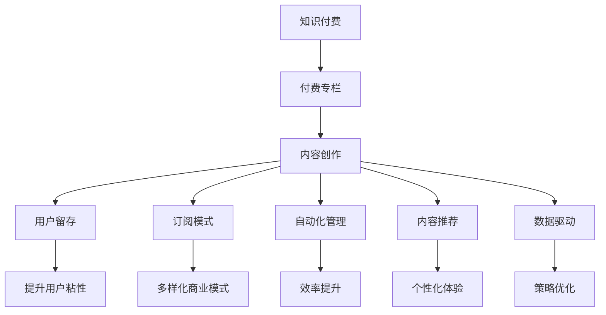

                 

# 如何打造知识付费的付费专栏

> 关键词：知识付费, 付费专栏, 内容创作, 用户留存, 订阅模式, 自动化管理, 内容推荐, 数据驱动

## 1. 背景介绍

### 1.1 问题由来

随着互联网技术的飞速发展，知识付费已成为教育领域的一个重要分支，为知识传播提供了新的途径。传统的教育模式往往依赖学校、教师和教材，而知识付费则打破了这些限制，让知识的获取更加自由和灵活。付费专栏作为知识付费的主要形式之一，通过提供高质量、结构化的内容，吸引了大量用户的关注和订阅。

然而，随着知识付费市场竞争的加剧，用户获取信息的渠道更加多样，付费专栏面临着用户流失、内容同质化等挑战。如何提升用户留存率，优化内容生态，实现商业模式的多样化，是知识付费领域亟待解决的问题。

### 1.2 问题核心关键点

当前付费专栏的核心挑战包括：

- **用户留存率**：如何通过高质量内容和多样化互动，保持用户的长期关注和订阅。
- **内容同质化**：如何在海量信息中脱颖而出，创造独特有价值的内容。
- **商业模式多样化**：如何实现知识付费的可持续化和多样化发展，适应不同用户需求。

本文将从用户留存、内容创作、订阅模式、自动化管理、内容推荐、数据驱动等多个方面，系统介绍如何打造高质量的付费专栏。

## 2. 核心概念与联系

### 2.1 核心概念概述

为更好地理解如何打造知识付费的付费专栏，本节将介绍几个密切相关的核心概念：

- **知识付费**：指通过付费形式获取高质量教育内容、技能培训、技术分享等知识的行为。
- **付费专栏**：指在线平台上提供的一系列主题相关的高质量内容，通过订阅模式向用户收取费用。
- **内容创作**：指制作、整理、筛选、组织高质量内容的过程，是付费专栏的核心。
- **用户留存**：指通过多种方式，增加用户对专栏的粘性和忠诚度。
- **订阅模式**：指用户定期支付费用，获取专栏内容的方式，如按月订阅、按年订阅等。
- **自动化管理**：指利用技术手段，自动处理订阅、更新、推荐等日常运营事务。
- **内容推荐**：指通过算法推荐系统，个性化推送高质量内容，提升用户体验。
- **数据驱动**：指利用数据分析技术，优化内容创作、用户留存、商业模式等各方面的策略。

这些核心概念之间的逻辑关系可以通过以下Mermaid流程图来展示：



这个流程图展示了点出知识付费、付费专栏的核心概念以及它们之间的关系：

1. 知识付费是付费专栏的基础，付费专栏则是知识付费的主要形式之一。
2. 内容创作是付费专栏的核心，高质量的内容吸引用户订阅。
3. 用户留存和订阅模式直接影响付费专栏的商业模式和盈利能力。
4. 自动化管理和内容推荐提升用户体验和运营效率。
5. 数据驱动优化内容创作、用户留存、商业模式等方面的策略。

这些概念共同构成了付费专栏的完整框架，有助于理解其在知识付费领域的地位和作用。

## 3. 核心算法原理 & 具体操作步骤
### 3.1 算法原理概述

打造知识付费的付费专栏，本质上是一个内容创作、用户互动、商业模式优化的综合过程。其核心思想是通过高质量内容吸引用户，通过订阅模式实现收入，同时利用技术手段提升运营效率，优化用户体验。

### 3.2 算法步骤详解

#### 3.2.1 内容创作

内容创作是付费专栏的核心环节，高质量的内容能够吸引和留存用户。以下是内容创作的主要步骤：

1. **选题策划**：根据目标用户群体和市场需求，确定专栏主题和内容方向。

2. **素材搜集**：通过文献阅读、专家访谈、实地调研等方式，搜集相关领域的知识和信息。

3. **内容制作**：将搜集到的素材进行整理、筛选、加工，形成结构化、有价值的内容。可以使用Markdown、PPT、视频等形式呈现。

4. **内容发布**：将制作好的内容发布到平台上，定期更新，保持内容新鲜度。

#### 3.2.2 用户留存

用户留存是付费专栏运营的关键，通过以下策略可以提升用户粘性和忠诚度：

1. **互动交流**：提供在线评论、讨论、问答等互动功能，增加用户参与感。

2. **会员体系**：通过会员制度，提供专属内容、优先阅读、离线下载等功能，提升会员价值。

3. **定期推送**：定期推送高质量内容、最新资讯、专家访谈等，吸引用户回访。

4. **内容更新**：保持内容的定期更新，确保用户获得最新的知识和信息。

5. **个性化推荐**：利用算法推荐系统，根据用户兴趣和行为，推荐相关内容。

#### 3.2.3 订阅模式

订阅模式是付费专栏的盈利方式，不同的订阅模式适用于不同的用户群体和需求。以下是主要的订阅模式：

1. **按月订阅**：用户每月支付费用，获取专栏当月内容。适合节奏快、需求持续的用户群体。

2. **按年订阅**：用户每年支付费用，获取全年内容。适合有长期需求、财务稳定性的用户群体。

3. **单次购买**：用户一次性支付费用，获取专栏所有内容。适合偶尔需要获取特定内容的用户群体。

#### 3.2.4 自动化管理

自动化管理通过技术手段，提升运营效率，优化用户体验。以下是自动化管理的主要步骤：

1. **内容发布**：自动检测内容更新，自动推送到用户终端。

2. **用户管理**：自动处理订阅、续费、退订等事务，减少人工操作。

3. **推荐系统**：利用算法推荐，自动推送高质量内容，提升用户满意度。

4. **数据分析**：通过数据分析工具，实时监测用户行为、内容效果、商业数据等，优化运营策略。

#### 3.2.5 内容推荐

内容推荐通过算法推荐系统，提升用户体验和内容消费量。以下是内容推荐的主要步骤：

1. **用户画像**：通过用户历史行为、偏好、互动数据，生成用户画像。

2. **内容分类**：对内容进行分类、标签化，形成内容库。

3. **算法设计**：选择适合的推荐算法，如协同过滤、基于内容的推荐、深度学习等。

4. **模型训练**：利用用户行为数据和内容特征，训练推荐模型。

5. **效果评估**：通过A/B测试等方法，评估推荐效果，不断优化模型。

#### 3.2.6 数据驱动

数据驱动通过数据分析技术，优化内容创作、用户留存、商业模式等方面的策略。以下是数据驱动的主要步骤：

1. **数据收集**：收集用户行为数据、内容数据、商业数据等。

2. **数据分析**：利用数据分析工具，挖掘数据背后的规律和趋势。

3. **策略优化**：根据数据分析结果，优化内容创作、用户留存、商业模式等策略。

### 3.3 算法优缺点

打造知识付费的付费专栏，通过高质量内容吸引用户，通过订阅模式实现收入，同时利用技术手段提升运营效率，优化用户体验。其优点和缺点如下：

**优点**：

- 高质量内容吸引用户，提高用户粘性和忠诚度。
- 订阅模式实现持续收入，保证平台财务稳定性。
- 自动化管理提升运营效率，降低人工成本。
- 内容推荐提升用户体验，增加内容消费量。
- 数据驱动优化运营策略，提高商业效果。

**缺点**：

- 内容创作成本高，需要专业团队支持。
- 用户订阅意愿受市场环境影响较大。
- 技术实现复杂，需要高水平的技术团队。
- 数据隐私和安全问题需重点关注。
- 算法推荐可能存在偏差，需要持续优化。

尽管存在这些局限性，但就目前而言，基于付费专栏的知识付费模式仍然是最主流、最有效的商业模式之一。未来相关研究的重点在于如何进一步降低内容创作成本，提高内容质量，同时兼顾数据隐私和安全等因素。

### 3.4 算法应用领域

知识付费的付费专栏在教育、技术、健康、金融等多个领域得到了广泛的应用，以下是几个典型场景：

- **教育领域**：提供学科知识、技能培训、家庭教育等高质量内容，满足不同阶段的教育需求。

- **技术领域**：提供编程、算法、大数据等技术分享，助力技术人才成长。

- **健康领域**：提供健康知识、营养膳食、心理辅导等内容，提升用户健康水平。

- **金融领域**：提供财经资讯、投资策略、财务管理等内容，满足投资者的信息需求。

- **艺术领域**：提供艺术鉴赏、创作技巧、历史评论等内容，满足艺术爱好者的需求。

除了这些典型场景外，付费专栏还在旅游、法律、设计等众多领域找到了应用，为不同行业的知识传播提供了新的平台和途径。随着付费专栏的不断发展和创新，相信知识付费技术将在更广泛的领域发挥重要作用，为知识经济的发展注入新的动力。

## 4. 数学模型和公式 & 详细讲解  
### 4.1 数学模型构建

为更好地理解知识付费的付费专栏的运营机制，本节将从数学角度对相关模型进行构建。

设付费专栏平台的用户数量为 $U$，专栏内容数量为 $C$，用户内容交互次数为 $I$。设订阅模式为 $S = \{s_1, s_2, ..., s_n\}$，其中 $s_i$ 表示第 $i$ 种订阅模式，用户订阅数量为 $S_i$。

用户对内容的评价为 $E \in [0,1]$，用户对订阅的支付意愿为 $P \in [0,1]$，内容质量为 $Q \in [0,1]$。设用户留存率为 $R \in [0,1]$，内容推荐效果为 $F \in [0,1]$。

则平台的收入为：

$$
Income = \sum_{i=1}^n \sum_{j=1}^U P_i \cdot R_j
$$

其中 $P_i$ 为订阅模式 $s_i$ 的单价，$R_j$ 为用户 $j$ 的留存率。

内容推荐系统的目标函数为：

$$
F = \max_{A} \sum_{i=1}^C \sum_{j=1}^U E_{ij} \cdot Q_j
$$

其中 $A$ 为推荐算法，$E_{ij}$ 为用户 $j$ 对内容 $i$ 的评价，$Q_j$ 为用户 $j$ 的内容质量。

用户对内容评价的数学模型为：

$$
E_{ij} = \alpha \cdot E_{i_{-1}j} + \beta \cdot X_{ij}
$$

其中 $\alpha$ 为内容评价的衰减系数，$X_{ij}$ 为内容 $i$ 对用户 $j$ 的评价因素，如时间、热门程度、互动等。

内容推荐系统的优化目标为：

$$
\min_{A} \sum_{i=1}^C \sum_{j=1}^U (E_{ij} - F_{ij})^2
$$

其中 $F_{ij}$ 为内容推荐系统的推荐评分。

### 4.2 公式推导过程

**用户行为模型**

用户对内容 $i$ 的评价 $E_{ij}$ 可以通过以下公式推导：

$$
E_{ij} = \alpha \cdot E_{i_{-1}j} + \beta \cdot X_{ij}
$$

其中 $\alpha$ 为内容评价的衰减系数，$X_{ij}$ 为内容 $i$ 对用户 $j$ 的评价因素，如时间、热门程度、互动等。

通过递归公式，可以得到用户对内容 $i$ 的长期评价：

$$
E_{ij} = \alpha \cdot E_{i_{-1}j} + \beta \cdot X_{ij} = \alpha^n \cdot E_{i_0j} + \sum_{k=0}^{n-1} \alpha^k \cdot \beta \cdot X_{ik} = \alpha^n \cdot E_{i_0j} + \beta \cdot \sum_{k=0}^{n-1} \alpha^k \cdot X_{ik}
$$

其中 $E_{i_0j}$ 为内容 $i$ 的初始评价，$n$ 为用户评价的周期数。

**内容推荐模型**

内容推荐系统的目标函数为：

$$
F = \max_{A} \sum_{i=1}^C \sum_{j=1}^U E_{ij} \cdot Q_j
$$

其中 $A$ 为推荐算法，$E_{ij}$ 为用户 $j$ 对内容 $i$ 的评价，$Q_j$ 为用户 $j$ 的内容质量。

通过优化目标函数，可以找到最优的推荐算法 $A$。假设推荐算法为线性模型：

$$
F_{ij} = \theta_0 + \theta_1 \cdot X_{ij} + \theta_2 \cdot Y_{ij}
$$

其中 $\theta_0, \theta_1, \theta_2$ 为模型参数，$X_{ij}$ 为内容 $i$ 对用户 $j$ 的评价因素，如时间、热门程度、互动等，$Y_{ij}$ 为用户 $j$ 的内容质量。

通过最小二乘法，可以得到模型参数：

$$
\theta = (\sum_{i=1}^C \sum_{j=1}^U X_{ij}X_{ij} \cdot Y_{ij} \cdot Q_j)^{-1} \cdot \sum_{i=1}^C \sum_{j=1}^U X_{ij}E_{ij} \cdot Q_j
$$

其中 $X_{ij} = [1, X_{ij}, Y_{ij}]$。

### 4.3 案例分析与讲解

**案例1：Kaggle上的付费课程**

Kaggle上提供大量高质量的付费课程，用户可以通过订阅方式获取所有课程内容。平台通过内容评价、用户互动等方式，提升内容推荐效果，增加用户订阅率。

**案例2：Udemy上的技术课程**

Udemy上的技术课程通过按月订阅模式，提供高质量的技术分享和实战项目。平台通过数据分析、用户画像等方式，优化内容推荐，提升用户满意度和留存率。

**案例3：网易云课堂上的在线课程**

网易云课堂提供多种付费课程，包括学科知识、技能培训等。平台通过个性化推荐、会员体系等方式，提升用户粘性和满意度。

这些案例展示了付费专栏在不同领域的应用，通过高质量内容吸引用户，通过订阅模式实现收入，同时利用技术手段提升运营效率，优化用户体验。

## 5. 项目实践：代码实例和详细解释说明
### 5.1 开发环境搭建

在进行知识付费的付费专栏开发前，我们需要准备好开发环境。以下是使用Python进行Flask开发的环境配置流程：

1. 安装Anaconda：从官网下载并安装Anaconda，用于创建独立的Python环境。

2. 创建并激活虚拟环境：
```bash
conda create -n myenv python=3.8 
conda activate myenv
```

3. 安装Flask：根据官方文档进行安装，可以执行以下命令：
```bash
pip install flask
```

4. 安装Flask-RESTful：用于构建RESTful API，可以执行以下命令：
```bash
pip install flask-restful
```

5. 安装Flask-Cors：用于处理跨域请求，可以执行以下命令：
```bash
pip install flask-cors
```

6. 安装SQLAlchemy：用于数据库交互，可以执行以下命令：
```bash
pip install sqlalchemy
```

完成上述步骤后，即可在`myenv`环境中开始付费专栏的开发。

### 5.2 源代码详细实现

下面我们以知识付费的付费专栏为例，给出使用Flask和SQLAlchemy进行内容管理和订阅管理的PyTorch代码实现。

首先，定义数据库模型：

```python
from sqlalchemy import create_engine, Column, Integer, String
from sqlalchemy.ext.declarative import declarative_base

Base = declarative_base()

class User(Base):
    __tablename__ = 'users'
    id = Column(Integer, primary_key=True)
    name = Column(String)
    email = Column(String)
    password = Column(String)

class Content(Base):
    __tablename__ = 'contents'
    id = Column(Integer, primary_key=True)
    title = Column(String)
    content = Column(String)
    author = Column(String)
    subscription = Column(String)

class Subscription(Base):
    __tablename__ = 'subscriptions'
    id = Column(Integer, primary_key=True)
    user_id = Column(Integer, ForeignKey('users.id'))
    content_id = Column(Integer, ForeignKey('contents.id'))
    start_date = Column(String)
    end_date = Column(String)
```

然后，定义Flask应用：

```python
from flask import Flask, request, jsonify
from flask_restful import Resource, Api
from sqlalchemy import create_engine, Column, Integer, String
from sqlalchemy.orm import sessionmaker

app = Flask(__name__)
app.config['SQLALCHEMY_DATABASE_URI'] = 'sqlite:///payment.db'
db = create_engine(app.config['SQLALCHEMY_DATABASE_URI'])
Session = sessionmaker(bind=db)

api = Api(app)

class Users(Resource):
    def get(self):
        session = Session()
        users = session.query(User).all()
        return jsonify([{'id': user.id, 'name': user.name, 'email': user.email} for user in users])

class Contents(Resource):
    def get(self):
        session = Session()
        contents = session.query(Content).all()
        return jsonify([{'id': content.id, 'title': content.title, 'author': content.author} for content in contents])

class Subscriptions(Resource):
    def get(self):
        session = Session()
        subscriptions = session.query(Subscription).all()
        return jsonify([{'user_id': subscription.user_id, 'content_id': subscription.content_id, 'start_date': subscription.start_date, 'end_date': subscription.end_date} for subscription in subscriptions])

api.add_resource(Users, '/users')
api.add_resource(Contents, '/contents')
api.add_resource(Subscriptions, '/subscriptions')
```

最后，运行应用：

```python
if __name__ == '__main__':
    app.run(debug=True)
```

以上就是一个完整的知识付费的付费专栏的Flask开发代码实现。可以看到，通过Flask和SQLAlchemy，我们可以方便地实现用户管理和内容管理的核心功能。

### 5.3 代码解读与分析

让我们再详细解读一下关键代码的实现细节：

**数据库模型**

- `User`类：表示用户，包含用户ID、姓名、邮箱和密码等属性。
- `Content`类：表示内容，包含内容ID、标题、内容、作者和订阅信息等属性。
- `Subscription`类：表示订阅，包含订阅ID、用户ID、内容ID、开始日期和结束日期等属性。

**Flask应用**

- 通过Flask框架构建RESTful API，提供用户、内容和订阅的查询接口。
- 使用SQLAlchemy进行数据库交互，查询所有用户、内容和订阅记录，返回JSON格式的数据。

**运行应用**

- 启动Flask应用，在本地监听端口5000。

通过上述代码实现，我们可以看到，通过Flask和SQLAlchemy，可以方便地实现知识付费的付费专栏的开发，包括用户管理、内容管理和订阅管理等功能。

当然，工业级的系统实现还需考虑更多因素，如用户界面、权限控制、支付系统、推荐算法等。但核心的API开发流程基本与此类似。

## 6. 实际应用场景
### 6.1 智能客服系统

基于知识付费的付费专栏，可以构建智能客服系统，提供7x24小时不间断服务。用户可以通过订阅专栏，获取各种常见问题及其解答，提升用户满意度。

在技术实现上，可以收集常见问题及其解答，将其构建成知识库。用户在客服界面输入问题，系统自动从知识库中匹配答案，并自动更新。对于新问题，可以通过人工审核和知识库扩展，逐步完善答案库。如此构建的智能客服系统，能大幅提升客服响应速度和质量，节省人力成本。

### 6.2 在线教育平台

基于知识付费的付费专栏，可以构建在线教育平台，提供各类高质量课程。用户可以通过订阅专栏，获取个性化学习计划和专业指导，提升学习效果。

在技术实现上，可以构建内容管理系统，允许教师上传和发布课程内容。用户可以通过订阅专栏，获取相应的课程和学习资源。平台通过推荐算法，为用户推荐感兴趣的内容，提升学习体验。同时，可以通过数据驱动的方式，优化课程内容和推荐策略，提升平台的用户粘性和满意度。

### 6.3 企业培训系统

基于知识付费的付费专栏，可以构建企业培训系统，提供专业培训和技能提升课程。员工可以通过订阅专栏，获取最新的行业动态、技术分享和管理知识，提升工作能力和专业素养。

在技术实现上，可以构建企业内训管理系统，允许HR上传和发布培训课程。员工可以通过订阅专栏，获取相应的培训和学习资源。平台通过推荐算法，为员工推荐适合的课程和学习路径，提升培训效果。同时，可以通过数据分析和用户反馈，优化培训内容和推荐策略，提升员工满意度和培训效果。

### 6.4 未来应用展望

随着知识付费的不断发展，付费专栏将在更多领域得到应用，为教育、技术、健康、金融等多个领域提供新的解决方案。

在智慧医疗领域，基于付费专栏的医疗问答、病历分析、药物研发等应用将提升医疗服务的智能化水平，辅助医生诊疗，加速新药开发进程。

在智能教育领域，付费专栏可应用于作业批改、学情分析、知识推荐等方面，因材施教，促进教育公平，提高教学质量。

在智慧城市治理中，付费专栏可应用于城市事件监测、舆情分析、应急指挥等环节，提高城市管理的自动化和智能化水平，构建更安全、高效的未来城市。

此外，在企业生产、社会治理、文娱传媒等众多领域，基于知识付费的付费专栏将不断涌现，为经济社会发展注入新的动力。相信随着付费专栏的不断发展和创新，知识付费技术将在更广泛的领域发挥重要作用，为知识经济的发展注入新的动力。

## 7. 工具和资源推荐
### 7.1 学习资源推荐

为了帮助开发者系统掌握知识付费的付费专栏的理论基础和实践技巧，这里推荐一些优质的学习资源：

1. 《Flask Web Development》系列博文：由Flask官方撰写，深入浅出地介绍了Flask框架的使用方法和最佳实践。

2. 《Python Web Development with Flask》书籍：详细讲解了使用Flask构建Web应用的全流程，包括前端、后端和数据库交互等。

3. 《SQLAlchemy for Python Developers》书籍：由SQLAlchemy官方撰写，全面介绍了SQLAlchemy的使用方法和最佳实践。

4. 《Udacity Online Classes》课程：斯坦福大学开设的Web开发和数据科学课程，提供系统性的学习和实践机会。

5. 《Flask-RESTful Web Development》书籍：由Flask-RESTful官方撰写，详细讲解了使用Flask-RESTful构建RESTful API的方法和技巧。

通过这些资源的学习实践，相信你一定能够快速掌握知识付费的付费专栏的开发方法，并用于解决实际的付费专栏问题。

### 7.2 开发工具推荐

高效的开发离不开优秀的工具支持。以下是几款用于知识付费的付费专栏开发的常用工具：

1. Flask：基于Python的开源Web框架，灵活便捷，适合快速迭代研究。

2. SQLAlchemy：Python的ORM框架，支持多数据库，适合开发复杂的数据模型。

3. PyTorch：基于Python的深度学习框架，支持动态计算图，适合快速实验和研究。

4. TensorFlow：由Google主导开发的开源深度学习框架，生产部署方便，适合大规模工程应用。

5. Django：Python的高性能Web框架，支持ORM、RESTful API等功能，适合构建大型Web应用。

6. Keras：基于TensorFlow和Theano的高级深度学习框架，适合快速构建和实验深度学习模型。

合理利用这些工具，可以显著提升知识付费的付费专栏的开发效率，加快创新迭代的步伐。

### 7.3 相关论文推荐

知识付费的付费专栏在教育、技术、健康、金融等多个领域得到了广泛的应用，以下是几篇奠基性的相关论文，推荐阅读：

1. "User-Centric Personalization of Learning Platforms"：由谷歌研究团队撰写，介绍了如何通过用户画像和个性化推荐，提升在线教育平台的用户体验。

2. "Contextual Recommendations for Online Learning Platforms"：由微软研究团队撰写，介绍了如何通过上下文信息，优化在线教育平台的推荐系统。

3. "Integrating Personalized Learning with Workflow Management"：由IBM研究团队撰写，介绍了如何通过工作流管理，提升在线教育平台的学习效果。

4. "Smart Career Coaching via Machine Learning"：由阿里巴巴研究团队撰写，介绍了如何通过智能职业指导，提升用户的职业发展效果。

5. "A Framework for Personalized Learning"：由斯坦福大学研究团队撰写，介绍了如何通过数据驱动，优化在线教育平台的个性化学习。

这些论文代表了大语言模型微调技术的发展脉络。通过学习这些前沿成果，可以帮助研究者把握学科前进方向，激发更多的创新灵感。

## 8. 总结：未来发展趋势与挑战
### 8.1 总结

本文对知识付费的付费专栏的开发方法进行了全面系统的介绍。首先阐述了知识付费的付费专栏的背景和意义，明确了付费专栏在知识付费领域的地位和作用。其次，从内容创作、用户留存、订阅模式、自动化管理、内容推荐、数据驱动等多个方面，详细讲解了如何打造高质量的付费专栏。最后，通过实际案例和代码实现，展示了付费专栏在多个领域的应用，以及未来的发展方向和挑战。

通过本文的系统梳理，可以看到，知识付费的付费专栏通过高质量内容吸引用户，通过订阅模式实现收入，同时利用技术手段提升运营效率，优化用户体验。在实际应用中，付费专栏已经证明其市场潜力和商业价值，未来仍需不断创新和优化，才能更好地适应市场需求，实现可持续化的发展。

### 8.2 未来发展趋势

展望未来，知识付费的付费专栏将呈现以下几个发展趋势：

1. **内容多样化**：付费专栏将涵盖更多领域和主题，如艺术、体育、文化等，满足用户多元化的知识需求。

2. **互动丰富化**：付费专栏将引入更多互动元素，如实时问答、直播授课、虚拟助教等，提升用户体验。

3. **个性化推荐**：通过深度学习和协同过滤等技术，付费专栏将提供更精准的内容推荐，提升用户满意度。

4. **多渠道融合**：付费专栏将与社交媒体、论坛、视频平台等渠道进行融合，形成多元化的传播和互动体系。

5. **AI技术加持**：付费专栏将引入更多AI技术，如自然语言处理、计算机视觉、语音识别等，提升内容的智能化和自动化水平。

6. **智能客服系统**：基于知识付费的付费专栏，可以构建智能客服系统，提供7x24小时不间断服务，提升用户满意度。

7. **数据驱动优化**：通过大数据分析和用户行为建模，付费专栏将不断优化内容创作、用户留存、商业模式等方面的策略，提升商业效果。

以上趋势凸显了知识付费的付费专栏的广阔前景。这些方向的探索发展，必将进一步提升知识付费的付费专栏的质量和用户粘性，为知识经济的繁荣注入新的动力。

### 8.3 面临的挑战

尽管知识付费的付费专栏已经取得了瞩目成就，但在迈向更加智能化、普适化应用的过程中，它仍面临着诸多挑战：

1. **内容创作成本高**：高质量内容的创作和维护需要大量时间和资源，需要专业团队支持。

2. **市场竞争激烈**：知识付费市场竞争激烈，如何保持内容更新频率和质量，提升用户体验，是平台的重要挑战。

3. **技术实现复杂**：付费专栏的技术实现涉及多种技术和工具，如数据库、Web框架、算法推荐等，技术门槛较高。

4. **数据隐私和安全**：用户数据隐私和安全问题需重点关注，需采取多种措施保障用户数据的安全性和隐私性。

5. **用户订阅意愿**：用户订阅意愿受市场环境、用户需求变化等因素影响较大，需持续优化订阅模式，提升用户粘性。

6. **商业模式单一**：目前付费专栏的商业模式相对单一，如何实现模式多样化，提升平台的可持续性，是亟待解决的问题。

7. **算法推荐偏差**：推荐算法可能存在偏差，需持续优化算法，提升推荐效果。

尽管存在这些挑战，但就目前而言，基于付费专栏的知识付费模式仍然是最主流、最有效的商业模式之一。未来相关研究的重点在于如何进一步降低内容创作成本，提高内容质量，同时兼顾数据隐私和安全等因素。

### 8.4 研究展望

面向未来，知识付费的付费专栏的研究方向包括：

1. **内容多样化**：探索更多领域和主题的付费专栏，满足用户多元化的知识需求。

2. **互动丰富化**：引入更多互动元素，提升用户体验，如实时问答、直播授课等。

3. **个性化推荐**：优化推荐算法，提升推荐效果，提升用户满意度。

4. **多渠道融合**：将付费专栏与社交媒体、论坛、视频平台等渠道进行融合，形成多元化的传播和互动体系。

5. **AI技术加持**：引入更多AI技术，提升内容的智能化和自动化水平。

6. **智能客服系统**：基于知识付费的付费专栏，构建智能客服系统，提供7x24小时不间断服务。

7. **数据驱动优化**：利用大数据分析和用户行为建模，优化内容创作、用户留存、商业模式等方面的策略。

这些研究方向将进一步推动知识付费的付费专栏的发展，为知识经济的繁荣注入新的动力。

## 9. 附录：常见问题与解答

**Q1：如何提升付费专栏的内容质量？**

A: 提升付费专栏的内容质量，可以通过以下几个方法：

1. **内容团队**：建立专业的内容团队，负责选题策划、内容制作和审核发布等环节。

2. **专家合作**：与行业专家、学者等合作，提升内容的权威性和专业性。

3. **用户反馈**：通过用户评论、评分等方式，了解用户需求和反馈，优化内容创作。

4. **数据驱动**：利用大数据分析和用户行为建模，预测用户需求，优化内容创作方向。

5. **持续更新**：定期更新内容，保持内容新鲜度和时效性。

**Q2：如何提升付费专栏的用户留存率？**

A: 提升付费专栏的用户留存率，可以通过以下几个方法：

1. **互动交流**：提供在线评论、讨论、问答等互动功能，增加用户参与感。

2. **会员体系**：通过会员制度，提供专属内容、优先阅读、离线下载等功能，提升会员价值。

3. **定期推送**：定期推送高质量内容、最新资讯、专家访谈等，吸引用户回访。

4. **内容更新**：保持内容的定期更新，确保用户获得最新的知识和信息。

5. **个性化推荐**：利用算法推荐系统，根据用户兴趣和行为，推荐相关内容。

6. **用户画像**：通过用户历史行为、偏好、互动数据，生成用户画像，个性化推荐。

**Q3：如何优化付费专栏的订阅模式？**

A: 优化付费专栏的订阅模式，可以通过以下几个方法：

1. **多样化订阅**：提供多种订阅模式，如按月订阅、按年订阅、单次购买等，满足不同用户需求。

2. **订阅奖励**：提供订阅奖励，如积分、优惠券等，激励用户订阅。

3. **灵活定价**：根据用户订阅时长和内容数量，灵活定价，提升用户体验和粘性。

4. **试用期**：提供试用期，让用户免费体验内容，增加订阅意愿。

5. **内容试听**：提供内容试听功能，让用户免费试听部分内容，增加订阅概率。

6. **价格优惠**：提供季节性、节假日等价格优惠，吸引用户订阅。

**Q4：如何构建智能客服系统？**

A: 构建智能客服系统，可以通过以下几个方法：

1. **知识库构建**：收集常见问题及其解答，构建知识库。

2. **自然语言处理**：使用NLP技术，自动理解用户问题，匹配知识库内容。

3. **用户反馈**：通过用户反馈，不断完善知识库和回答内容。

4. **人工审核**：对新问题和新回答进行人工审核，提升回答质量。

5. **知识扩展**：定期更新知识库，增加新问题和解答。

6. **实时更新**：通过API接口，实时更新知识库和回答内容。

通过上述方法，可以构建一个高效、可靠的智能客服系统，提升客服响应速度和质量，节省人力成本。

**Q5：如何构建在线教育平台？**

A: 构建在线教育平台，可以通过以下几个方法：

1. **课程开发**：开发高质量的课程内容，覆盖学科知识、技能培训等各个领域。

2. **教师管理**：引入专业教师，提供课程录制、授课等服务。

3. **平台搭建**：搭建在线教育平台，提供课程发布、学习管理、互动交流等功能。

4. **推荐系统**：利用推荐算法，为用户推荐感兴趣的内容和课程。

5. **数据驱动**：通过数据分析，优化课程内容和推荐策略，提升学习效果和用户体验。

6. **社交互动**：提供论坛、讨论等功能，增加用户互动和参与。

通过上述方法，可以构建一个高质量的在线教育平台，提升用户学习效果和满意度。

**Q6：如何优化内容推荐系统？**

A: 优化内容推荐系统，可以通过以下几个方法：

1. **用户画像**：通过用户历史行为、偏好、互动数据，生成用户画像。

2. **内容分类**：对内容进行分类、标签化，形成内容库。

3. **算法设计**：选择适合的推荐算法，如协同过滤、基于内容的推荐、深度学习等。

4. **模型训练**：利用用户行为数据和内容特征，训练推荐模型。

5. **效果评估**：通过A/B测试等方法，评估推荐效果，不断优化模型。

6. **实时更新**：根据用户行为和内容更新，实时更新推荐算法和模型。

通过上述方法，可以构建一个高效、精准的内容推荐系统，提升用户满意度和内容消费量。

通过上述Q&A，可以看到，知识付费的付费专栏在多个领域都有广泛的应用，通过高质量内容吸引用户，通过订阅模式实现收入，同时利用技术手段提升运营效率，优化用户体验。尽管面临诸多挑战，但通过不断创新和优化，知识付费的付费专栏必将在知识经济中发挥重要作用，为知识传播和经济发展注入新的动力。

