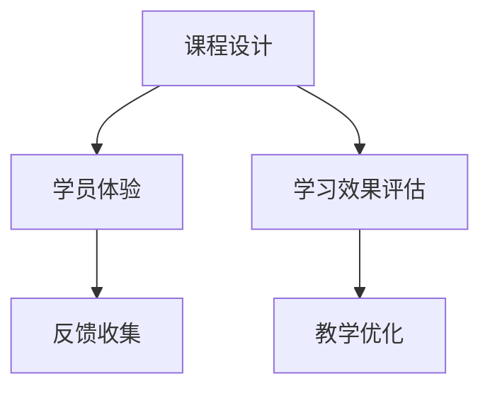

                 

# 如何打造高转化率的程序员知识课程

> 关键词：程序员知识课程, 知识体系构建, 课程设计, 学员体验, 学习效果评估

## 1. 背景介绍

在当今快速发展的科技时代，技术的迭代更新速度极快，程序员们需要持续学习和适应新的编程语言、开发工具和软件架构。因此，针对程序员的专业知识课程成为了需求日益增长的教育资源。如何打造一门能够高效转化学员、激发学习兴趣的程序员知识课程，成为教育者和开发者共同关注的焦点。本文将从课程设计、学员体验、学习效果评估等多个角度，深入探讨如何构建高转化率的程序员知识课程。

## 2. 核心概念与联系

### 2.1 核心概念概述

为了更好地构建高转化率的程序员知识课程，本文将介绍以下几个关键概念：

- **课程设计**：课程设计是指根据学员需求、学习目标、学科知识结构，合理规划课程内容、结构和学习路径。高质量的课程设计能显著提升学员的学习效率和课程转化率。
- **学员体验**：学员体验是指课程在学员学习过程中的互动、参与感和满意度。良好的学员体验不仅能增强学习动力，还能提升课程的完成率和学员的转介绍率。
- **学习效果评估**：学习效果评估是课程设计中不可或缺的一环，通过系统化的评估手段，可以及时发现课程存在的问题，并针对性地进行优化。

### 2.2 核心概念原理和架构的 Mermaid 流程图



该流程图展示了课程设计与学员体验、学习效果评估之间的紧密联系：课程设计是基础，通过设计合理的课程结构和内容，来提高学员的学习效果；学员体验则是课程实际应用的反馈，通过收集学员反馈，不断优化课程；学习效果评估则是量化学员学习成果的指标，为课程设计提供数据支持。三者共同作用，确保课程最终能够高效转化学员。

## 3. 核心算法原理 & 具体操作步骤

### 3.1 算法原理概述

高转化率的程序员知识课程设计基于以下算法原理：

1. **需求分析**：通过调研和数据分析，确定目标学员群体最关心和最需要解决的问题。
2. **知识体系构建**：根据需求分析结果，构建系统的知识体系，涵盖入门、进阶到专家等级的内容。
3. **互动教学设计**：通过互动、实践和项目等形式，增强学员的参与感和实践能力。
4. **反馈循环优化**：定期收集学员反馈，对课程内容和教学方法进行优化和改进。
5. **评估指标设计**：设计合理的学习效果评估指标，如课程完成率、学员满意度、知识掌握度等，用于衡量课程质量。

### 3.2 算法步骤详解

#### 3.2.1 需求分析

1. **调研和数据分析**：利用问卷调查、访谈和数据分析工具，了解目标学员的背景、技能水平和学习动机。
2. **需求分类和优先级排序**：根据调研结果，将需求分类并按照优先级排序，确定最需要解决的问题和最紧急的技能缺口。
3. **目标设定**：基于需求分析结果，设定明确的课程目标和预期成果，确保课程内容具有针对性和实用性。

#### 3.2.2 知识体系构建

1. **模块划分**：将课程内容划分为多个模块，每个模块聚焦于一个特定主题或技能。
2. **内容层次化**：从基础到高级，逐步构建知识体系，确保学员能够循序渐进地掌握技能。
3. **跨模块关联**：设计跨模块的实践项目和案例分析，帮助学员理解不同模块之间的联系和应用场景。

#### 3.2.3 互动教学设计

1. **互动环节设计**：引入讨论、问答、小组协作等互动环节，增强学员的参与感和讨论氛围。
2. **项目实践**：通过实际项目和案例分析，让学员能够应用所学知识，提升实战能力。
3. **实时反馈**：利用在线平台和工具，提供实时反馈和评估，帮助学员及时调整学习策略。

#### 3.2.4 反馈循环优化

1. **反馈收集**：定期通过问卷、访谈和在线评价等方式，收集学员的反馈意见。
2. **教学优化**：根据反馈结果，对课程内容和教学方法进行优化，确保课程的持续改进。
3. **迭代改进**：采用敏捷开发方法，对课程进行迭代改进，逐步完善课程内容。

#### 3.2.5 评估指标设计

1. **学习效果评估指标**：设计科学的评估指标，如课程完成率、学员满意度、知识掌握度等。
2. **数据收集与分析**：通过学习管理系统收集相关数据，利用数据分析工具进行评估和分析。
3. **反馈和改进**：基于评估结果，及时调整课程内容和教学方法，确保课程的持续优化。

### 3.3 算法优缺点

#### 3.3.1 优点

1. **系统化设计**：通过需求分析、知识体系构建和评估指标设计，确保课程内容具有系统性和科学性。
2. **互动性强**：通过互动教学设计和实时反馈，增强学员的参与感和学习动力。
3. **反馈机制完善**：通过反馈循环优化，不断改进课程内容，提升课程效果。

#### 3.3.2 缺点

1. **时间成本高**：需求分析和课程设计需要大量的时间和精力投入。
2. **数据收集难度大**：高质量的数据收集和分析需要较强的技术实力和资源支持。
3. **持续优化难度大**：课程的持续优化需要持续的投入和改进，可能面临资源和成本的限制。

### 3.4 算法应用领域

高转化率的程序员知识课程设计方法，广泛应用于各类IT教育平台和机构，包括在线教育平台、培训机构和高校课程设计。例如：

- **在线教育平台**：如Coursera、Udemy等，通过科学课程设计和互动教学，提升学员的学习效果和课程转化率。
- **培训机构**：如代码训练营、编程班等，通过项目实践和学员反馈，优化课程内容，提升培训质量。
- **高校课程设计**：如计算机科学、软件工程等课程，通过需求分析和互动教学，确保课程的针对性和实用性。

## 4. 数学模型和公式 & 详细讲解 & 举例说明

### 4.1 数学模型构建

假设一门程序员知识课程共有$N$个学员，每个学员的学习效果可以表示为一个向量$\vec{x}_i$，其中$i=1,2,\ldots,N$。课程的目标是将所有学员的学习效果最大化，设计一个数学模型来表示这一过程。

设课程的评估指标为$E$，包括课程完成率、学员满意度、知识掌握度等。课程的设计目标是最大化这些指标的加权和，即：

$$
\max \sum_{i=1}^N \alpha_i E_i(\vec{x}_i)
$$

其中$\alpha_i$为权重系数，反映了不同指标的重要性。

### 4.2 公式推导过程

为了求解上述优化问题，采用拉格朗日乘子法，引入拉格朗日函数：

$$
\mathcal{L}(\vec{x}, \lambda) = \sum_{i=1}^N \alpha_i E_i(\vec{x}_i) + \lambda(\sum_{i=1}^N 1 - \sum_{i=1}^N \vec{x}_i)
$$

其中$\lambda$为拉格朗日乘子，保证课程的总学员数不超过$N$。

对上述拉格朗日函数求偏导，得到：

$$
\frac{\partial \mathcal{L}}{\partial \vec{x}_i} = \alpha_i \nabla E_i(\vec{x}_i) - \lambda
$$

将上述方程组解得$\vec{x}_i$，即为每个学员的学习效果优化解。

### 4.3 案例分析与讲解

以一门面向初学者的小程序开发课程为例，课程的评估指标包括课程完成率（记为$E_1$）、学员满意度（记为$E_2$）和知识掌握度（记为$E_3$）。每个学员的学习效果向量$\vec{x}_i$可以表示为$[x_{i1}, x_{i2}, x_{i3}]$，其中$x_{i1}$为课程完成情况，$x_{i2}$为学员满意度评分，$x_{i3}$为知识掌握度测试成绩。

假设课程设计的权重系数为$\alpha_1=0.5, \alpha_2=0.3, \alpha_3=0.2$，则课程设计的优化目标为：

$$
\max \sum_{i=1}^N (0.5 x_{i1} + 0.3 x_{i2} + 0.2 x_{i3})
$$

通过求解上述方程组，得到每个学员的学习效果优化解，从而优化课程内容设计，提升课程效果。

## 5. 项目实践：代码实例和详细解释说明

### 5.1 开发环境搭建

为了进行课程设计和评估，需要搭建一个高效的学习管理系统。以下是一个简化的搭建流程：

1. **选择平台**：选择一个开源或商业化的学习管理系统，如Moodle、Canvas、LMS等。
2. **安装部署**：按照平台文档进行安装和部署，确保环境稳定和可扩展。
3. **功能模块开发**：根据需求开发必要的功能模块，如课程管理、学员管理、互动环节、评估系统等。

### 5.2 源代码详细实现

以下是一个使用Python Flask框架开发的课程评估系统的代码实现，详细解释了其中的关键逻辑：

```python
from flask import Flask, render_template, request, redirect

app = Flask(__name__)

# 模拟学员数据
学员数据 = [
    {'name': '学员A', '课程完成率': 80, '满意度': 4, '知识掌握度': 90},
    {'name': '学员B', '课程完成率': 70, '满意度': 3.5, '知识掌握度': 85},
    {'name': '学员C', '课程完成率': 90, '满意度': 4.5, '知识掌握度': 95}
]

@app.route('/')
def 首页():
    return render_template('index.html', 学员数据)

@app.route('/评估', methods=['POST'])
def 评估():
    学员数据 = 请求表单
    评估结果 = 计算评估指标(学员数据)
    反馈信息 = '你的评估指标为：' + 评估结果
    return redirect('/', 302)

if __name__ == '__main__':
    app.run(debug=True)
```

上述代码实现了课程首页和学员评估功能的展示。学员可以通过评估表单输入自己的课程完成率、满意度和知识掌握度，然后提交表单，系统将计算评估结果并展示。

### 5.3 代码解读与分析

#### 5.3.1 首页逻辑

```python
@app.route('/')
def 首页():
    return render_template('index.html', 学员数据)
```

首页展示学员评估表格，其中学员数据通过模板渲染方式展示。

#### 5.3.2 评估逻辑

```python
@app.route('/评估', methods=['POST'])
def 评估():
    学员数据 = 请求表单
    评估结果 = 计算评估指标(学员数据)
    反馈信息 = '你的评估指标为：' + 评估结果
    return redirect('/', 302)
```

评估逻辑接收学员的表单提交，计算评估结果，并返回首页页面。

#### 5.3.3 评估结果计算

```python
def 计算评估指标(学员数据):
    评估指标 = 0
    评估指标权重 = [0.5, 0.3, 0.2]
    for 学员 in 学员数据:
        评估指标 += 评估指标权重[0] * 学员['课程完成率'] + 评估指标权重[1] * 学员['满意度'] + 评估指标权重[2] * 学员['知识掌握度']
    return 评估指标
```

评估结果计算逻辑，通过公式(4.2)计算每个学员的评估指标。

### 5.4 运行结果展示

运行上述代码，访问http://localhost:5000/，将看到学员评估表格，提交表单后，系统将显示反馈信息。

## 6. 实际应用场景

### 6.1 在线教育平台

在线教育平台如Coursera、Udemy等，通过科学课程设计和互动教学，提升学员的学习效果和课程转化率。例如，Coursera的编程课程将课程内容划分为多个模块，每个模块包含视频讲解、互动讨论和项目实践，通过实时反馈和评估，不断优化课程内容。

### 6.2 培训机构

培训机构如代码训练营、编程班等，通过项目实践和学员反馈，优化课程内容，提升培训质量。例如，某代码训练营采用项目驱动教学法，通过实战项目和学员反馈，不断改进课程内容和教学方法，确保课程的针对性和实用性。

### 6.3 高校课程设计

高校课程如计算机科学、软件工程等课程，通过需求分析和互动教学，确保课程的针对性和实用性。例如，某大学在课程设计中引入项目实践环节，让学生在实际项目中应用所学知识，提升编程能力和实际应用能力。

## 7. 工具和资源推荐

### 7.1 学习资源推荐

1. **Coursera《Python for Everybody》**：通过科学课程设计和互动教学，提升学员的学习效果和课程转化率。
2. **Udemy《The Complete Web Developer Course 2.0》**：通过项目实践和学员反馈，优化课程内容，提升培训质量。
3. **Moodle文档**：学习管理系统Moodle的官方文档，提供详细的系统搭建和功能模块开发指南。

### 7.2 开发工具推荐

1. **Python Flask**：轻量级Web框架，适用于快速开发学习管理系统和互动教学功能。
2. **MySQL**：关系型数据库，适用于存储学员信息和评估数据。
3. **Jupyter Notebook**：互动编程环境，适用于数据处理和科学计算。

### 7.3 相关论文推荐

1. **《在线课程设计与评估》**：探讨科学课程设计和学员评估的原理和方法，提供实用的课程优化策略。
2. **《互动式学习：原理、模型与实践》**：介绍互动教学的原理和模型，提供互动环节设计和学员反馈收集的指导。
3. **《人工智能教育应用》**：探讨人工智能在教育中的应用，包括课程设计、学员评估和教学优化。

## 8. 总结：未来发展趋势与挑战

### 8.1 研究成果总结

本文通过系统介绍高转化率的程序员知识课程设计，提供了科学课程设计、互动教学设计和学员反馈收集的详细方法。通过科学化的课程设计和合理的评估指标，确保课程内容具有系统性和科学性，提升了学员的学习效果和课程转化率。

### 8.2 未来发展趋势

未来，高转化率的程序员知识课程设计将呈现以下几个趋势：

1. **个性化学习**：通过大数据和机器学习技术，根据学员的学习行为和偏好，提供个性化的课程推荐和教学内容。
2. **虚拟现实（VR）和增强现实（AR）**：通过VR和AR技术，增强课程的沉浸感和互动性，提升学员的参与感和学习体验。
3. **区块链技术**：通过区块链技术，确保学员评估数据的安全性和不可篡改性，增强课程的可信度和透明度。

### 8.3 面临的挑战

尽管高转化率的程序员知识课程设计已经取得了一定的成果，但仍面临以下挑战：

1. **数据隐私和安全**：如何保护学员的隐私数据，确保评估数据的安全性。
2. **教学质量保证**：如何确保课程内容的科学性和实用性，避免课程设计中的误区和陷阱。
3. **技术门槛高**：课程设计和开发需要较强的技术实力和资源支持，可能面临成本和资源的限制。

### 8.4 研究展望

未来，在课程设计和开发中，需要进一步探索以下几个方向：

1. **跨学科融合**：通过跨学科融合，结合心理学、教育学等领域的知识，提升课程设计的科学性和合理性。
2. **在线协作平台**：通过在线协作平台，增强学员之间的互动和协作，提升学习效果和课程转化率。
3. **持续迭代优化**：通过持续的迭代优化，不断改进课程内容和教学方法，确保课程的持续改进和提升。

## 9. 附录：常见问题与解答

**Q1: 如何设计合理的课程评估指标？**

A: 设计合理的课程评估指标需要考虑学员的需求和课程的目标。通常包括课程完成率、学员满意度、知识掌握度等指标。这些指标应该具有可测量性和可对比性，能够量化学员的学习效果。

**Q2: 如何提高学员的参与感和互动性？**

A: 提高学员的参与感和互动性可以通过以下方法：
1. 设计互动环节，如讨论、问答和小组协作。
2. 引入实际项目和案例分析，让学员能够应用所学知识。
3. 提供实时反馈和评估，帮助学员及时调整学习策略。

**Q3: 如何确保课程的持续改进？**

A: 确保课程的持续改进需要定期收集学员反馈，并根据反馈结果进行课程优化。可以通过问卷调查、访谈和在线评价等方式收集反馈信息，然后根据反馈结果优化课程内容。

**Q4: 如何保护学员的隐私数据？**

A: 保护学员的隐私数据需要遵循数据保护法规和最佳实践。可以使用数据匿名化、加密存储等技术，确保数据的安全性和隐私性。同时，应该明确告知学员数据使用方式，获得其同意。

**Q5: 如何利用大数据和机器学习技术进行个性化学习？**

A: 利用大数据和机器学习技术进行个性化学习，需要收集和分析学员的学习行为数据，如学习时间、学习进度、答题情况等。通过构建学员的学习模型，可以推荐个性化的课程内容和学习路径，提升学习效果和课程转化率。

通过深入探讨高转化率的程序员知识课程设计，本文希望能够为教育者和开发者提供全面的指导，共同打造出高效、科学、个性化的程序员知识课程，推动IT教育的不断发展。

