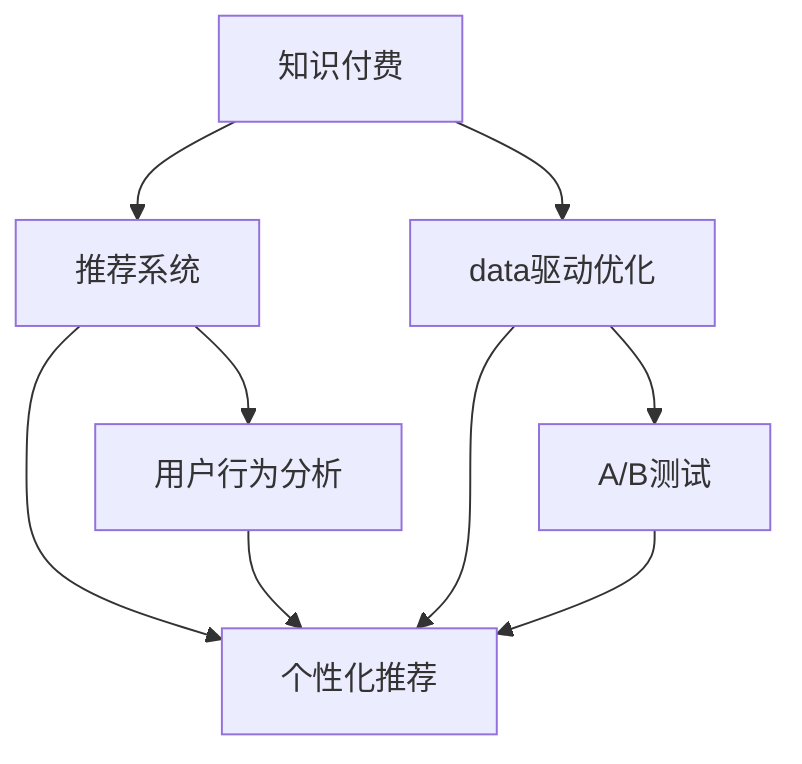

                 

# 如何提高知识付费产品的用户活跃度

> 关键词：知识付费, 用户活跃度, 推荐系统, 个性化推荐, 用户留存, 用户行为分析, 数据驱动优化

## 1. 背景介绍

### 1.1 问题由来

在知识付费领域，用户活跃度是衡量平台成功与否的关键指标之一。用户活跃度低下会导致平台收入减少、内容生产者积极性下降，进而形成恶性循环。因此，如何提高知识付费产品的用户活跃度，是知识付费平台必须面对的重大挑战。

### 1.2 问题核心关键点

从技术角度来看，提高知识付费产品用户活跃度的关键在于构建一个高效、精准的推荐系统，并基于用户的个性化需求进行内容推荐。本文将重点围绕以下核心关键点进行探讨：

- **推荐系统**：通过算法模型和数据驱动的方法，为用户推荐个性化内容，从而提高用户的粘性和活跃度。
- **用户行为分析**：通过分析用户的点击、观看、购买等行为，识别用户兴趣和需求，优化推荐策略。
- **数据驱动优化**：利用A/B测试、多臂老虎机等数据驱动方法，持续优化推荐模型和产品功能，提升用户体验。
- **个性化推荐**：根据用户的历史行为和偏好，提供量身定制的推荐，提升用户满意度。

### 1.3 问题研究意义

提高知识付费产品的用户活跃度，对于平台的商业化、内容生产者的收入增长以及用户的知识获取具有重要意义：

- **提升平台收入**：用户活跃度高意味着更高的用户粘性和续费率，从而提高平台的整体收入。
- **优化内容生态**：高活跃度的用户更倾向于消费优质内容，这将激励内容生产者创作更多有价值的内容。
- **满足用户需求**：精准的个性化推荐系统能更好地满足用户的个性化需求，提升用户满意度和忠诚度。

## 2. 核心概念与联系

### 2.1 核心概念概述

为更好地理解如何提高知识付费产品的用户活跃度，本节将介绍几个密切相关的核心概念：

- **知识付费**：用户为获取知识和信息而支付费用的商业模式。核心在于知识的价值和信息的稀缺性。
- **推荐系统**：通过算法模型为用户推荐个性化内容，提升用户满意度。主要包括协同过滤、基于内容的推荐、混合推荐等。
- **个性化推荐**：基于用户的历史行为和偏好，提供量身定制的推荐，提升用户体验。
- **用户行为分析**：通过分析用户的行为数据，了解用户兴趣和需求，优化推荐策略。
- **数据驱动优化**：利用数据驱动的方法，持续优化产品功能和推荐模型，提升用户活跃度。

这些核心概念之间的逻辑关系可以通过以下Mermaid流程图来展示：



这个流程图展示了这个框架的核心概念及其之间的关系：

1. 知识付费平台通过推荐系统为用户推荐个性化内容。
2. 个性化推荐系统基于用户行为分析，进一步优化推荐效果。
3. 数据驱动优化贯穿始终，利用A/B测试等多臂老虎机方法持续提升推荐模型。

## 3. 核心算法原理 & 具体操作步骤
### 3.1 算法原理概述

提高知识付费产品用户活跃度的核心算法原理主要基于协同过滤、基于内容的推荐、混合推荐以及深度学习推荐等技术，其中深度学习推荐在当前技术栈中占据主流。

- **协同过滤**：通过分析用户行为，找出兴趣相似的用户，从而为用户推荐相似用户喜欢过的内容。
- **基于内容的推荐**：通过分析内容特征，为用户推荐与其兴趣相似的内容。
- **混合推荐**：结合协同过滤和基于内容的推荐，取长补短，提升推荐效果。
- **深度学习推荐**：利用深度学习模型，捕捉用户和内容的隐式特征，提高推荐精度。

### 3.2 算法步骤详解

基于深度学习推荐，提高知识付费产品用户活跃度的具体操作步骤如下：

1. **数据准备**：收集用户行为数据，包括点击、观看、购买、评分等，同时收集内容的标签、分类等属性信息。
2. **模型选择**：选择合适的深度学习推荐模型，如协同过滤模型、基于内容的推荐模型、混合推荐模型等。
3. **特征工程**：对用户和内容进行特征提取和向量化，提取用户行为和内容特征。
4. **模型训练**：利用训练数据对推荐模型进行训练，优化模型参数。
5. **推荐服务部署**：将训练好的模型部署到推荐服务中，实时响应用户的推荐请求。
6. **效果评估与优化**：通过A/B测试等方法评估推荐效果，不断优化模型和推荐策略。

### 3.3 算法优缺点

提高知识付费产品用户活跃度的深度学习推荐算法具有以下优点：

- **精准度**：深度学习模型能够捕捉用户和内容的隐式特征，推荐效果更精准。
- **可扩展性**：深度学习模型具有良好的可扩展性，能够处理大规模数据。
- **自适应性**：深度学习模型能够自动学习特征，适应用户需求的变化。

同时，该算法也存在以下局限性：

- **计算资源需求高**：深度学习模型通常需要较大的计算资源，增加了系统成本。
- **过拟合风险**：深度学习模型容易过拟合，特别是在数据量不足的情况下。
- **模型复杂度**：深度学习模型结构复杂，调试和优化难度较大。

### 3.4 算法应用领域

基于深度学习推荐算法的知识付费产品用户活跃度提升技术，已经在诸多领域得到了广泛应用，例如：

- **在线教育平台**：通过为用户推荐个性化课程和教材，提升学习效率和满意度。
- **智能新闻推荐**：为用户推荐相关新闻和文章，提升新闻阅读体验。
- **音乐推荐系统**：为用户推荐个性化音乐和歌单，提升音乐消费体验。
- **视频平台**：为用户推荐个性化视频和频道，提升视频观看体验。

此外，在更多垂直领域，如法律、金融、健康等，基于深度学习推荐技术的知识付费应用也在不断涌现，为行业带来新的活力。

## 4. 数学模型和公式 & 详细讲解 & 举例说明
### 4.1 数学模型构建

为了构建深度学习推荐模型，我们需要先定义模型的输入、输出和损失函数。

- **输入**：用户ID $u$、物品ID $i$、时间戳 $t$。
- **输出**：用户对物品的评分 $y$。
- **损失函数**：均方误差损失函数 $L$。

模型的目标是最大化预测评分与实际评分之间的均方误差最小化，即：

$$
L = \frac{1}{N}\sum_{i=1}^N \sum_{j=1}^N (y_{u,i} - \hat{y}_{u,i})^2
$$

其中，$N$ 为样本数，$y_{u,i}$ 为实际评分，$\hat{y}_{u,i}$ 为模型预测评分。

### 4.2 公式推导过程

基于矩阵分解，我们构建一个二阶矩阵 $W$，其维度为 $n \times m$，其中 $n$ 为用户数，$m$ 为物品数。

设 $W_{ui}$ 为用户 $u$ 对物品 $i$ 的评分，则有：

$$
W_{ui} = w_{ui}w_i^T
$$

其中，$w_{ui}$ 为 $m$ 维用户向量，$w_i$ 为 $n$ 维物品向量。

将上式代入均方误差损失函数，得：

$$
L = \frac{1}{N}\sum_{i=1}^N \sum_{j=1}^N (y_{u,i} - w_{ui}w_i^Ty_{i,j})^2
$$

进一步简化，得：

$$
L = \frac{1}{2N}\sum_{i=1}^N \sum_{j=1}^N (y_{u,i} - w_{ui}w_i^Ty_{i,j})^2
$$

为了求解 $w_{ui}$ 和 $w_i$，我们引入梯度下降法进行优化，得：

$$
w_{ui} \leftarrow w_{ui} - \eta \nabla_{w_{ui}}L, \quad w_i \leftarrow w_i - \eta \nabla_{w_i}L
$$

其中，$\eta$ 为学习率，$\nabla_{w_{ui}}L$ 和 $\nabla_{w_i}L$ 分别为 $w_{ui}$ 和 $w_i$ 的梯度。

### 4.3 案例分析与讲解

我们以Netflix推荐系统为例，展示深度学习推荐算法的应用。Netflix通过矩阵分解技术，将用户对电影和电视剧的评分信息转换为向量形式，从而构建用户-物品评分矩阵。

假设用户 $u$ 对物品 $i$ 的评分矩阵为 $W_{ui}$，用户向量为 $w_{ui}$，物品向量为 $w_i$，则Netflix推荐系统可以表示为：

$$
\hat{y}_{u,i} = w_{ui}w_i^T
$$

Netflix通过大量的用户行为数据和物品特征数据，训练出 $w_{ui}$ 和 $w_i$，从而为用户推荐个性化的电影和电视剧。Netflix的推荐系统通过不断地优化 $w_{ui}$ 和 $w_i$，提升推荐效果，取得了显著的用户活跃度和收入提升。

## 5. 项目实践：代码实例和详细解释说明
### 5.1 开发环境搭建

在进行深度学习推荐系统开发前，我们需要准备好开发环境。以下是使用Python进行TensorFlow开发的环境配置流程：

1. 安装Anaconda：从官网下载并安装Anaconda，用于创建独立的Python环境。

2. 创建并激活虚拟环境：
```bash
conda create -n tf-env python=3.8 
conda activate tf-env
```

3. 安装TensorFlow：根据CUDA版本，从官网获取对应的安装命令。例如：
```bash
conda install tensorflow -c pytorch -c conda-forge
```

4. 安装其他必要的工具包：
```bash
pip install numpy pandas sklearn tqdm jupyter notebook ipython
```

完成上述步骤后，即可在`tf-env`环境中开始推荐系统开发。

### 5.2 源代码详细实现

我们以TensorFlow的协同过滤推荐系统为例，展示深度学习推荐系统的代码实现。

首先，定义协同过滤推荐系统的训练数据：

```python
import tensorflow as tf
import numpy as np

# 构建训练数据
train_data = tf.data.Dataset.from_tensor_slices((np.random.randn(1000, 100), np.random.randn(1000, 10)))
train_data = train_data.shuffle(1000).batch(32)
```

然后，定义协同过滤模型的超参数和模型结构：

```python
# 定义模型超参数
n_users = 1000
n_items = 100
n_factors = 50

# 定义模型结构
model = tf.keras.layers.Dense(n_factors, activation='relu')
user_input = tf.keras.layers.Input(shape=(n_factors,), name='user')
item_input = tf.keras.layers.Input(shape=(n_factors,), name='item')
user_latent = model(user_input)
item_latent = model(item_input)
dot_product = tf.keras.layers.Dot(axes=1)([user_latent, item_latent])
rating = tf.keras.layers.Dense(1, activation='sigmoid')(dot_product)

model = tf.keras.Model(inputs=[user_input, item_input], outputs=rating)
```

接下来，定义模型的损失函数和优化器：

```python
# 定义损失函数和优化器
loss_fn = tf.keras.losses.BinaryCrossentropy(from_logits=True)
optimizer = tf.keras.optimizers.Adam()
```

最后，进行模型的训练和预测：

```python
# 定义训练过程
def train_step(data):
    with tf.GradientTape() as tape:
        predictions = model(user_input=data[:, :n_factors], item_input=data[:, n_factors:])
        loss_value = loss_fn(y_true=data[:, -1], y_pred=predictions)
    gradients = tape.gradient(loss_value, model.trainable_variables)
    optimizer.apply_gradients(zip(gradients, model.trainable_variables))

# 训练模型
for epoch in range(10):
    for batch in train_data:
        train_step(batch)
    # 在测试集上评估模型效果
    test_data = tf.data.Dataset.from_tensor_slices((np.random.randn(100, 100), np.random.randn(100, 10)))
    test_data = test_data.shuffle(100).batch(32)
    test_predictions = model(user_input=test_data[:, :n_factors], item_input=test_data[:, n_factors:])
    test_loss = loss_fn(y_true=test_data[:, -1], y_pred=test_predictions)
    print('Epoch {}, Test Loss: {}'.format(epoch+1, test_loss.numpy()))
```

以上就是使用TensorFlow构建协同过滤推荐系统的完整代码实现。可以看到，使用TensorFlow可以方便地定义模型结构、损失函数和优化器，并利用数据驱动的方法进行模型训练和评估。

### 5.3 代码解读与分析

让我们再详细解读一下关键代码的实现细节：

**训练数据定义**：
- 通过`tf.data.Dataset.from_tensor_slices`方法，从NumPy数组中构建训练数据集。
- 使用`shuffle`方法打乱数据顺序，使用`batch`方法将数据集分为多个批次。

**模型结构定义**：
- 使用`tf.keras.layers.Dense`定义模型层，激活函数为ReLU。
- 定义用户向量和物品向量，将两个向量相乘得到用户对物品的评分预测值。
- 使用`tf.keras.layers.Dense`定义输出层，激活函数为Sigmoid，用于预测用户评分。

**损失函数和优化器定义**：
- 使用`tf.keras.losses.BinaryCrossentropy`定义损失函数，适用于二分类问题。
- 使用`tf.keras.optimizers.Adam`定义优化器，具有较好的收敛速度和性能。

**训练过程实现**：
- 在每个epoch内，使用`tf.GradientTape`记录梯度。
- 将用户和物品的输入向量带入模型，得到预测评分。
- 计算损失值，反向传播梯度。
- 使用`optimizer.apply_gradients`更新模型参数。
- 在测试集上评估模型效果，输出测试损失。

可以看到，TensorFlow提供了强大的模型构建和训练框架，使得深度学习推荐系统的开发变得简洁高效。

## 6. 实际应用场景
### 6.1 在线教育平台

在线教育平台通过深度学习推荐系统，为用户推荐个性化课程和教材，提升学习效率和满意度。以Coursera为例，平台利用深度学习模型分析用户的学习行为数据，推荐用户可能感兴趣和有价值的课程。用户通过推荐课程进行学习，提高了学习效果和平台活跃度。

### 6.2 智能新闻推荐

智能新闻推荐系统通过深度学习模型，为用户推荐相关新闻和文章，提升新闻阅读体验。以Google News为例，平台利用协同过滤和基于内容的推荐方法，为用户推荐个性化的新闻资讯。用户通过推荐新闻进行阅读，增加了平台的使用频率和粘性。

### 6.3 音乐推荐系统

音乐推荐系统通过深度学习模型，为用户推荐个性化音乐和歌单，提升音乐消费体验。以Spotify为例，平台利用协同过滤和混合推荐方法，为用户推荐符合其兴趣的音乐内容。用户通过推荐音乐进行收听，提高了音乐平台的活跃度和用户粘性。

### 6.4 视频平台

视频平台通过深度学习推荐系统，为用户推荐个性化视频和频道，提升视频观看体验。以YouTube为例，平台利用协同过滤和基于内容的推荐方法，为用户推荐符合其兴趣的视频内容。用户通过推荐视频进行观看，增加了平台的使用时间和观看频次。

## 7. 工具和资源推荐
### 7.1 学习资源推荐

为了帮助开发者系统掌握深度学习推荐技术，这里推荐一些优质的学习资源：

1. 《深度学习推荐系统》书籍：详细介绍了推荐系统的原理、算法和实现。
2. 《TensorFlow实战》书籍：介绍了TensorFlow的深度学习推荐系统开发实战。
3. 《推荐系统》课程：斯坦福大学开设的推荐系统课程，涵盖推荐系统的基础和前沿技术。
4. Coursera推荐系统专项课程：由世界顶尖大学和公司提供，涵盖推荐系统的算法和应用。
5. Kaggle推荐系统竞赛：通过实践参与推荐系统竞赛，提升推荐系统开发能力。

通过对这些资源的学习实践，相信你一定能够快速掌握深度学习推荐技术的精髓，并用于解决实际的推荐问题。

### 7.2 开发工具推荐

高效的开发离不开优秀的工具支持。以下是几款用于深度学习推荐系统开发的常用工具：

1. TensorFlow：由Google主导开发的深度学习框架，生产部署方便，适合大规模工程应用。
2. PyTorch：基于Python的开源深度学习框架，灵活动态，适合快速迭代研究。
3. Scikit-learn：Python机器学习库，提供多种推荐算法和数据处理工具。
4. NumPy：Python科学计算库，用于高效矩阵运算和数据处理。
5. Jupyter Notebook：交互式编程环境，适合快速迭代和实验验证。

合理利用这些工具，可以显著提升深度学习推荐系统的开发效率，加快创新迭代的步伐。

### 7.3 相关论文推荐

深度学习推荐技术的发展源于学界的持续研究。以下是几篇奠基性的相关论文，推荐阅读：

1. Factorization Machines for Recommender Systems（因子分解机）：提出了一种基于矩阵分解的推荐方法，取得了较好的推荐效果。
2. Deep Collaborative Filtering（深度协同过滤）：使用深度神经网络进行协同过滤推荐，提升了推荐精度。
3. Multi-Task Learning for Recommendations（多任务学习推荐）：利用多任务学习提升推荐系统的泛化能力和性能。
4. Self-Attention Networks for Recommendations（自注意力网络推荐）：使用自注意力机制，提升推荐系统的特征表示和效果。
5. Attention-Based Recommendation System（基于注意力的推荐系统）：利用注意力机制，提升推荐系统对用户兴趣的关注度。

这些论文代表了大深度学习推荐技术的发展脉络。通过学习这些前沿成果，可以帮助研究者把握学科前进方向，激发更多的创新灵感。

## 8. 总结：未来发展趋势与挑战
### 8.1 总结

本文对提高知识付费产品用户活跃度的深度学习推荐算法进行了全面系统的介绍。首先阐述了推荐系统、个性化推荐、用户行为分析等核心概念，明确了推荐算法在提高用户活跃度中的关键作用。其次，从原理到实践，详细讲解了推荐算法的数学模型和具体操作步骤，给出了推荐系统开发的完整代码实例。同时，本文还广泛探讨了推荐算法在在线教育、智能新闻、音乐推荐等多个领域的应用前景，展示了推荐算法的巨大潜力。此外，本文精选了推荐算法的各类学习资源，力求为读者提供全方位的技术指引。

通过本文的系统梳理，可以看到，深度学习推荐算法在知识付费领域具有广泛的应用前景，能够显著提升用户活跃度，驱动平台商业化进程。未来，伴随深度学习推荐算法的持续演进，相信知识付费平台能够更好地满足用户需求，提升用户体验，实现商业价值最大化。

### 8.2 未来发展趋势

展望未来，深度学习推荐算法将呈现以下几个发展趋势：

1. **多模态融合**：结合文本、图像、语音等多模态数据，提升推荐系统的丰富性和多样性。
2. **上下文感知**：利用用户上下文信息，如时间、地点、设备等，进一步提升推荐精度。
3. **实时推荐**：利用实时数据流，实现推荐系统的实时化，提升用户体验。
4. **跨领域推荐**：结合不同领域的数据和知识，实现跨领域的推荐，提升推荐系统的泛化能力。
5. **可解释性**：通过可解释性技术，提升推荐系统的透明度和可信度。

这些趋势凸显了深度学习推荐技术的广阔前景。这些方向的探索发展，必将进一步提升推荐系统的精准度和个性化程度，为知识付费产品带来新的突破。

### 8.3 面临的挑战

尽管深度学习推荐算法已经取得了瞩目成就，但在迈向更加智能化、普适化应用的过程中，它仍面临着诸多挑战：

1. **数据稀疏性**：知识付费领域的数据通常较为稀疏，难以构建高质量的推荐模型。如何从少量数据中提取有效信息，是推荐系统面临的重要挑战。
2. **计算资源消耗**：深度学习模型需要大量的计算资源，增加了系统成本。如何优化模型结构和算法，减少资源消耗，是推荐系统需要解决的实际问题。
3. **过拟合风险**：深度学习模型容易过拟合，特别是在数据量不足的情况下。如何平衡模型复杂度和泛化能力，是推荐系统需要持续关注的问题。
4. **隐私保护**：知识付费平台需要处理大量的用户数据，如何保护用户隐私，确保数据安全，是推荐系统面临的重要伦理问题。

### 8.4 研究展望

面对深度学习推荐算法面临的挑战，未来的研究需要在以下几个方面寻求新的突破：

1. **半监督学习和自监督学习**：从少量数据中提取有效信息，提升推荐系统的泛化能力。
2. **高效模型压缩**：优化模型结构和算法，减少计算资源消耗，提高推荐系统效率。
3. **联邦学习和隐私保护**：结合联邦学习和差分隐私技术，保护用户隐私，提升推荐系统安全性和可信度。

这些研究方向将进一步推动深度学习推荐技术的进步，为知识付费产品带来新的突破和创新。相信随着学界和产业界的共同努力，深度学习推荐技术将不断优化，为用户带来更优质的推荐体验。

## 9. 附录：常见问题与解答

**Q1：深度学习推荐算法是否适用于所有知识付费产品？**

A: 深度学习推荐算法在大多数知识付费产品中都能取得不错的效果，特别是对于数据量较大的产品。但对于一些数据稀疏或数据质量较低的产品，推荐效果可能不太理想。此时需要采用更多的特征工程和模型优化方法，提升推荐系统性能。

**Q2：如何平衡推荐系统的精度和效率？**

A: 推荐系统的精度和效率是一个平衡问题，通常需要通过以下方法来优化：
1. 特征选择和降维：选择关键特征并降维，减少模型复杂度，提升效率。
2. 模型压缩和优化：使用模型压缩技术，如剪枝、量化等，减少模型大小和计算量。
3. 数据分布和负载均衡：合理分配数据分布，利用负载均衡技术，提高系统效率。
4. 算法优化和并行计算：优化算法和利用并行计算，提升推荐系统性能。

**Q3：推荐系统如何处理冷启动问题？**

A: 冷启动问题是指新用户或新物品没有历史数据，无法进行推荐。常用的方法包括：
1. 使用协同过滤算法，通过相似用户或物品进行推荐。
2. 使用基于内容的推荐算法，通过物品属性进行推荐。
3. 引入推荐系统引导策略，通过人工干预和引导推荐。
4. 使用预训练模型和迁移学习，提升推荐系统性能。

这些方法可以结合使用，提升推荐系统的冷启动效果。

**Q4：推荐系统如何处理用户行为异常情况？**

A: 用户行为异常情况包括恶意点击、恶意评分等。常用的方法包括：
1. 异常检测和过滤：通过异常检测算法，识别和过滤恶意行为。
2. 用户行为分析：通过行为分析，了解用户行为模式，预测异常行为。
3. 多臂老虎机算法：使用多臂老虎机算法，优化推荐策略，减少恶意行为影响。

这些方法可以结合使用，提升推荐系统的鲁棒性和稳定性。

**Q5：推荐系统如何处理用户个性化需求变化？**

A: 用户个性化需求的变化需要推荐系统进行动态调整，常用的方法包括：
1. 用户行为分析：通过实时分析用户行为，动态调整推荐策略。
2. 用户画像和兴趣演化：建立用户画像，跟踪用户兴趣演化，提升推荐精准度。
3. 反馈机制和用户反馈：通过用户反馈，优化推荐策略，提升用户体验。

这些方法可以结合使用，提升推荐系统的个性化和动态化效果。

---

作者：禅与计算机程序设计艺术 / Zen and the Art of Computer Programming

