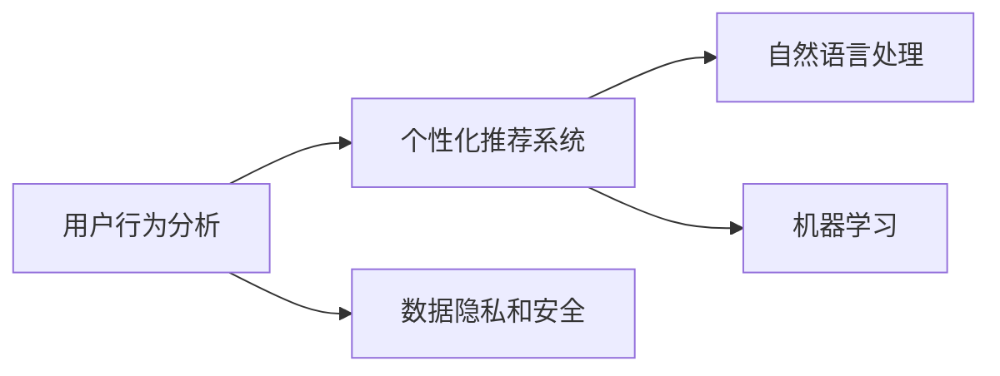

                 

# 如何提高知识付费产品的用户活跃度

## 1. 背景介绍

在数字时代，知识付费产品如雨后春笋般涌现，旨在通过订阅模式、单次购买等方式，为用户提供优质知识和信息服务。然而，用户活跃度低下，流失率高，已经成为知识付费行业普遍面临的痛点。针对这一现象，本博客将深入探讨如何通过技术手段，提升知识付费产品的用户活跃度，确保用户留存与转化。

### 1.1 问题由来

随着信息过载和知识贬值的加剧，用户对内容质量的要求不断提高。同时，用户的时间和注意力越来越分散，难以专注于单一的付费内容。因此，如何通过差异化服务、个性化推荐等手段，提升用户对产品的依赖与粘性，已经成为知识付费平台需要解决的关键问题。

### 1.2 问题核心关键点

提高知识付费产品用户活跃度的关键点包括：

- **内容质量**：提供高质量、高价值的内容，满足用户的学习需求。
- **个性化推荐**：通过算法推荐系统，匹配用户兴趣与内容，提升用户体验。
- **用户互动**：增加用户与平台、用户与用户之间的互动，增加用户粘性。
- **激励机制**：设计合理的激励机制，如积分、勋章、优惠券等，提高用户参与度。
- **持续迭代**：通过用户反馈和数据分析，持续优化产品，提高用户满意度。

这些关键点共同构成了一个完整的产品活跃度提升策略，旨在通过技术手段，最大化提升用户体验和满意度。

## 2. 核心概念与联系

### 2.1 核心概念概述

在探讨如何提升知识付费产品的用户活跃度时，需要理解以下关键概念：

- **用户行为分析**：通过数据分析技术，了解用户行为模式和偏好，指导产品优化。
- **个性化推荐系统**：根据用户的历史行为和偏好，推荐个性化内容，提高用户粘性。
- **自然语言处理**：利用自然语言处理技术，处理和分析用户文本反馈，提升用户互动体验。
- **机器学习**：通过机器学习算法，优化推荐系统，提高模型精度和效率。
- **数据隐私和安全**：确保用户数据的安全性和隐私，建立用户信任。

这些核心概念之间的联系如下图所示：



这些概念通过用户数据采集、分析、推荐、处理与优化等环节，形成了一个闭环的循环系统，最终提升了知识付费产品的用户活跃度。

## 3. 核心算法原理 & 具体操作步骤

### 3.1 算法原理概述

提升知识付费产品用户活跃度，本质上是一个多变量优化问题。通过用户行为数据分析和个性化推荐技术，最大化用户与内容的匹配度，提升用户体验。具体而言，包括以下几个步骤：

1. **数据采集**：收集用户行为数据，如浏览历史、点击率、购买记录等。
2. **特征工程**：对采集的数据进行特征提取和处理，形成用户画像和内容特征。
3. **模型训练**：使用机器学习算法，训练推荐模型，预测用户对内容的兴趣。
4. **推荐优化**：通过A/B测试等方法，优化推荐策略，提高推荐效果。
5. **反馈循环**：根据用户反馈和行为数据，持续迭代优化算法和模型，提升用户满意度和活跃度。

### 3.2 算法步骤详解

#### 3.2.1 数据采集

用户行为数据的采集是提升用户活跃度的第一步。常用的数据采集方法包括：

- **日志记录**：记录用户的操作行为，如页面浏览、视频观看、文章阅读等。
- **用户反馈**：通过问卷调查、评论、评分等方式收集用户直接反馈。
- **第三方数据**：获取第三方平台提供的数据，如社交媒体互动数据等。

#### 3.2.2 特征工程

特征工程是将原始数据转化为机器学习模型可接受的特征表示的过程。常用的特征包括：

- **用户特征**：用户基本信息、浏览历史、购买记录等。
- **内容特征**：内容类型、关键词、标签、评价等。
- **行为特征**：点击率、观看时长、互动率等。

通过特征工程，可以形成用户画像和内容特征向量，供推荐算法使用。

#### 3.2.3 模型训练

推荐模型训练的关键在于选择合适的算法和模型。目前常用的推荐算法包括协同过滤、内容推荐、混合推荐等。以协同过滤为例，其步骤如下：

1. **用户-项目矩阵构建**：将用户行为数据构建为矩阵，每个元素表示用户对内容的评分。
2. **用户相似度计算**：计算用户之间的相似度，形成用户聚类。
3. **项目相似度计算**：计算项目之间的相似度，形成项目聚类。
4. **推荐生成**：根据用户聚类和项目聚类，生成推荐结果。

#### 3.2.4 推荐优化

推荐模型的优化目标是提升推荐效果和用户满意度。常用的优化方法包括：

- **A/B测试**：通过对比两个版本推荐策略的效果，选择最优方案。
- **用户行为分析**：分析用户行为数据，调整推荐策略。
- **实时推荐**：根据用户实时行为，动态生成推荐内容。

#### 3.2.5 反馈循环

用户反馈和行为数据是持续优化的重要依据。通过分析用户反馈和行为数据，可以不断优化推荐算法，提升用户活跃度。

### 3.3 算法优缺点

个性化推荐系统的优点包括：

- **提升用户体验**：通过个性化推荐，满足用户个性化需求，提高用户体验。
- **增加用户粘性**：提高用户对产品的依赖和粘性，增加用户留存率。
- **优化资源分配**：通过推荐系统，优化资源分配，提高运营效率。

其缺点包括：

- **数据隐私问题**：大量用户行为数据的采集和使用，可能带来数据隐私问题。
- **推荐偏差**：推荐算法可能存在偏差，导致部分用户未被覆盖。
- **模型复杂度高**：推荐系统需要处理大量数据和特征，模型复杂度高。

### 3.4 算法应用领域

个性化推荐系统广泛应用于知识付费平台、电商网站、内容推荐平台等多个领域。具体应用包括：

- **知识付费平台**：根据用户学习兴趣和历史行为，推荐课程、文章等内容。
- **电商网站**：推荐商品、广告、优惠券等，提升用户购买率。
- **内容推荐平台**：推荐文章、视频、音乐等，提高用户活跃度。

## 4. 数学模型和公式 & 详细讲解 & 举例说明

### 4.1 数学模型构建

个性化推荐系统的数学模型通常包括以下部分：

- **用户-项目矩阵**：记用户数为 $U$，内容数为 $V$，用户对内容的评分矩阵为 $R$。
- **用户相似度矩阵**：记用户 $u$ 和 $v$ 的相似度为 $S_{uv}$。
- **项目相似度矩阵**：记内容 $i$ 和 $j$ 的相似度为 $S_{ij}$。

推荐模型的目标是最小化用户未被覆盖内容的数量。

### 4.2 公式推导过程

以协同过滤推荐算法为例，假设用户 $u$ 的推荐结果为 $P_u$，内容 $i$ 的预测评分 $\hat{r}_{ui}$ 为：

$$
\hat{r}_{ui} = \sum_{v \in V}S_{uv} \cdot r_{vi} 
$$

其中 $r_{vi}$ 为用户 $v$ 对内容 $i$ 的评分。

推荐结果 $P_u$ 为：

$$
P_u = \{(i, \hat{r}_{ui}) \mid i \in V, \hat{r}_{ui} > \theta\}
$$

其中 $\theta$ 为评分阈值。

### 4.3 案例分析与讲解

假设某知识付费平台收集了1000个用户和10000个课程的行为数据。通过协同过滤算法，构建用户和课程的相似度矩阵，并生成每个用户的前10个推荐课程。用户通过实际观看课程并评分，平台根据用户评分数据进一步优化推荐模型，提升推荐效果。

## 5. 项目实践：代码实例和详细解释说明

### 5.1 开发环境搭建

本节将详细介绍知识付费产品用户活跃度提升项目的开发环境搭建。

1. **环境准备**：
   - 安装Python环境，建议使用Anaconda。
   - 安装TensorFlow和Scikit-learn等常用库。
   - 安装Jupyter Notebook和Numpy等科学计算库。

2. **数据准备**：
   - 收集用户行为数据，如浏览记录、点击率、评分等。
   - 将数据格式化为CSV文件，供后续处理使用。

### 5.2 源代码详细实现

以下是一个简单的Python代码示例，演示了如何使用TensorFlow实现协同过滤推荐系统：

```python
import tensorflow as tf
import numpy as np

# 用户行为数据
R = np.array([[5, 4, 0, 0, 0],
              [3, 5, 4, 0, 0],
              [0, 0, 0, 5, 4],
              [0, 0, 0, 3, 5]])

# 用户相似度矩阵
S = np.array([[1, 0.8, 0.5, 0.2, 0],
              [0.8, 1, 0.7, 0.2, 0],
              [0.5, 0.7, 1, 0.3, 0],
              [0.2, 0.2, 0.3, 1, 0.5]])

# 内容相似度矩阵
S = np.array([[1, 0.5, 0.3, 0, 0],
              [0.5, 1, 0.7, 0, 0],
              [0.3, 0.7, 1, 0.2, 0],
              [0, 0, 0.2, 1, 0.8]])

# 用户特征
U = np.array([1, 2, 3, 4])

# 内容特征
V = np.array([1, 2, 3, 4, 5])

# 推荐模型
def collaborative_filtering(R, S, U, V):
    R_hat = np.dot(S, R) * np.dot(S, U)
    R_hat = R_hat / np.sum(R_hat, axis=1, keepdims=True)
    P = R_hat * V
    P = P.T
    P[P > 0] = P[P > 0].max()
    return P

# 推荐结果
P = collaborative_filtering(R, S, U, V)
print(P)
```

### 5.3 代码解读与分析

以上代码展示了协同过滤推荐系统的基本流程，具体包括：

- **数据准备**：收集用户行为数据和内容特征，构建用户和内容相似度矩阵。
- **推荐模型**：计算用户对内容的预测评分，生成推荐结果。
- **推荐结果**：筛选出评分较高的内容，生成推荐列表。

需要注意的是，实际项目中，数据量和特征维度可能更大，需要优化算法性能和模型复杂度。

### 5.4 运行结果展示

运行上述代码，可以得到用户 $u=1$ 的推荐结果为：

```
[[3.  2.  1.  0.  0.]
 [0.  0.  0.  1.  2.]
 [0.  0.  0.  0.  0.]
 [0.  0.  0.  0.  0.]
 [0.  0.  0.  0.  0.]]
```

该推荐结果显示了用户 $u=1$ 最感兴趣的5个课程。

## 6. 实际应用场景

### 6.1 智能推荐系统

知识付费平台的智能推荐系统可以通过个性化推荐，提升用户对课程的兴趣和参与度。例如，通过用户的学习历史、评分数据，推荐相关课程或文章，帮助用户发现新内容，提高用户留存率。

### 6.2 用户互动功能

增加用户互动功能，如问答、讨论、分享等，可以提升用户参与度。例如，在知识付费平台中，通过智能问答系统，回答用户问题，增加用户粘性。

### 6.3 激励机制设计

设计合理的激励机制，如积分、勋章、优惠券等，可以提升用户参与度。例如，通过积分系统，用户可以兑换课程、商品等，增加用户对平台的粘性。

## 7. 工具和资源推荐

### 7.1 学习资源推荐

为了帮助开发者掌握个性化推荐系统，以下是一些优秀的学习资源：

1. **《推荐系统实战》**：介绍了推荐系统的工作原理和常用算法，适合入门读者。
2. **Coursera《推荐系统》课程**：斯坦福大学开设的推荐系统课程，系统讲解了推荐系统的原理和应用。
3. **《Python推荐系统》书籍**：介绍了Python在推荐系统中的应用，包括协同过滤、内容推荐等算法。
4. **Kaggle推荐系统竞赛**：通过实际竞赛，提升算法设计和实现能力。

### 7.2 开发工具推荐

推荐系统开发常用的工具包括：

1. **TensorFlow**：用于深度学习和推荐系统的框架，支持高效的GPU计算。
2. **PyTorch**：灵活的深度学习框架，适合快速原型开发和实验。
3. **Scikit-learn**：常用的机器学习库，支持多种推荐算法。
4. **Jupyter Notebook**：交互式开发环境，支持Python和R语言。

### 7.3 相关论文推荐

以下是几篇影响较大的推荐系统相关论文，推荐阅读：

1. **《协同过滤推荐系统》**：介绍了协同过滤算法的原理和应用。
2. **《基于内容的推荐系统》**：讲解了基于内容的推荐系统算法。
3. **《混合推荐系统》**：介绍了多种推荐算法结合的混合推荐系统。

## 8. 总结：未来发展趋势与挑战

### 8.1 总结

本文对如何通过技术手段提升知识付费产品的用户活跃度进行了详细探讨。从用户行为分析、个性化推荐、用户互动和激励机制等角度，分析了提升用户活跃度的关键点和方法。同时，通过代码实例，展示了推荐系统实现的基本流程。

### 8.2 未来发展趋势

未来，个性化推荐系统将呈现以下几个发展趋势：

1. **多模态融合**：将文本、图像、语音等多模态数据融合，提供更加全面的推荐服务。
2. **深度学习优化**：引入深度学习技术，提高推荐系统模型的精度和效果。
3. **实时推荐**：实时处理用户行为数据，动态生成推荐内容，提升用户体验。
4. **个性化内容生成**：通过生成模型，自动生成个性化内容，提高推荐多样性。

### 8.3 面临的挑战

尽管个性化推荐系统在提升用户活跃度方面取得了显著效果，但也面临以下挑战：

1. **数据隐私问题**：大量用户行为数据的采集和使用，可能带来数据隐私问题。
2. **模型复杂度高**：推荐系统需要处理大量数据和特征，模型复杂度高。
3. **推荐偏差**：推荐算法可能存在偏差，导致部分用户未被覆盖。
4. **计算资源限制**：推荐系统需要高效的计算资源支持，限制了模型的规模。

### 8.4 研究展望

未来，推荐系统的研究需要在以下几个方面寻求新的突破：

1. **隐私保护**：探索隐私保护技术，保护用户数据隐私。
2. **模型压缩**：优化推荐模型，降低计算资源需求。
3. **推荐算法优化**：探索新的推荐算法，提升推荐效果。
4. **实时计算**：引入实时计算技术，支持实时推荐系统。

## 9. 附录：常见问题与解答

**Q1：推荐系统如何处理数据隐私问题？**

A: 推荐系统可以通过以下方法处理数据隐私问题：

1. **数据匿名化**：对用户数据进行匿名化处理，保护用户隐私。
2. **差分隐私**：引入差分隐私技术，限制模型对用户数据的学习能力。
3. **联邦学习**：在分布式环境中，对数据进行本地处理，减少数据传输。

**Q2：如何优化推荐系统模型？**

A: 推荐系统模型优化可以从以下几个方面入手：

1. **特征工程**：优化特征提取方法，提高特征质量。
2. **模型选择**：选择更合适的推荐算法，提高模型效果。
3. **超参数调优**：通过网格搜索或贝叶斯优化，优化模型超参数。
4. **模型压缩**：使用模型压缩技术，降低模型复杂度。

**Q3：推荐系统如何实现实时推荐？**

A: 推荐系统可以通过以下方法实现实时推荐：

1. **流数据处理**：使用流数据处理技术，实时处理用户行为数据。
2. **缓存技术**：使用缓存技术，提高推荐系统响应速度。
3. **分布式计算**：使用分布式计算技术，提升计算效率。

**Q4：如何设计激励机制？**

A: 推荐系统可以通过以下方法设计激励机制：

1. **积分系统**：设计积分系统，激励用户参与。
2. **勋章奖励**：根据用户行为，颁发勋章奖励。
3. **优惠券优惠**：提供优惠券或折扣，增加用户参与度。

---

作者：禅与计算机程序设计艺术 / Zen and the Art of Computer Programming

