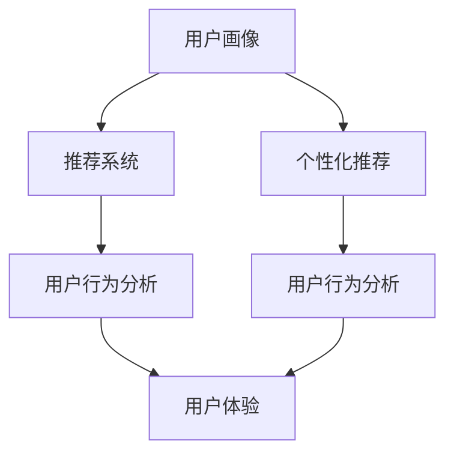

                 

## 1. 背景介绍

### 1.1 问题由来

随着知识付费服务的兴起，越来越多的用户通过订阅平台获取有价值的知识内容。然而，尽管这些平台提供了丰富的学习资源，但高昂的订阅费用和平台活跃度下降，造成了用户的流失。据相关调查显示，超过50%的付费用户，在订阅一年后选择不再续费。

为了应对这一挑战，知识付费平台纷纷采用各种手段，如推荐系统、个性化推荐、用户行为分析等，但这些方法往往只能解决部分问题。用户的真实需求和体验，才是提高用户留存率的根本出路。

### 1.2 问题核心关键点

如何利用数据驱动，更精准地了解用户的实际需求，构建符合用户期望的内容推荐体系，提供良好的学习体验，从而实现用户留存率的持续提升，是知识付费产品面临的核心问题。

要解决这一问题，首先需要构建完整的用户画像，通过分析用户行为数据，形成多维度的用户特征，深入挖掘用户的潜在需求。同时，结合用户画像构建推荐系统，实现精准推荐，提升用户的满意度和粘性。

此外，构建良好的用户体验，强化平台与用户的互动，也是提升用户留存率的重要手段。

### 1.3 问题研究意义

对于知识付费平台来说，提升用户留存率不仅能够减少用户流失带来的运营损失，同时也能为平台的长期发展提供坚实的基础。通过对用户行为数据进行深度分析，结合推荐系统的优化，平台能够更好地实现个性化推荐，提升用户体验。

此外，提升用户留存率也能够增强平台的用户粘性，通过用户数据积累，构建更丰富的用户画像，为未来的产品迭代和业务扩展提供有价值的参考。

## 2. 核心概念与联系

### 2.1 核心概念概述

为更好地理解如何提高知识付费产品的用户留存率，本节将介绍几个关键概念：

- 知识付费产品：指用户通过付费订阅获取有价值的知识服务，如在线课程、电子书、研究报告等。
- 用户画像(User Persona)：基于用户的行为、兴趣、需求等数据构建的个性化用户模型。
- 推荐系统(Recommendation System)：通过算法对用户行为数据进行分析，预测用户兴趣，实现个性化推荐，提升用户体验的系统。
- 个性化推荐(Personalization)：通过用户画像，对用户行为进行精准分析，提升推荐准确性，满足用户个性化需求。
- 用户行为分析(User Behavior Analysis)：通过对用户在平台上的行为数据进行分析，了解用户的使用习惯和潜在需求，实现精准的用户细分。
- 用户体验(User Experience)：用户在使用知识付费产品的过程中，通过界面设计、功能优化、内容呈现等手段，提升用户满意度和平台粘性。

这些概念之间的联系紧密，互相依赖，共同构成了一个知识付费产品用户留存提升的完整框架。

### 2.2 核心概念原理和架构的 Mermaid 流程图



## 3. 核心算法原理 & 具体操作步骤

### 3.1 算法原理概述

提升知识付费产品用户留存率的核心在于构建精准的用户画像，结合推荐系统，实现个性化推荐，增强用户体验。具体的实现步骤如下：

1. 通过用户行为数据，构建完整的用户画像，形成多维度的用户特征。
2. 结合用户画像，应用推荐系统算法，预测用户兴趣，实现个性化推荐。
3. 通过优化用户体验，强化平台与用户的互动，提升用户满意度和粘性。
4. 定期更新用户画像和推荐系统，实时调整个性化推荐策略，满足用户不断变化的需求。

### 3.2 算法步骤详解

#### 3.2.1 用户画像构建

**Step 1: 数据收集**
- 收集用户在平台上的各种行为数据，如浏览、点击、订阅、互动等。
- 收集用户的人口统计信息，如年龄、性别、职业等。

**Step 2: 数据处理**
- 对收集到的数据进行清洗和预处理，去除无效数据和噪声。
- 采用特征工程方法，提取有意义的特征，如兴趣领域、学习时间、学习难度等。

**Step 3: 数据建模**
- 应用机器学习算法，如协同过滤、内容过滤等，对用户行为数据进行建模，形成用户画像。

#### 3.2.2 推荐系统构建

**Step 1: 推荐算法选择**
- 根据业务需求和数据特点，选择合适的推荐算法，如协同过滤、基于内容的推荐、深度学习推荐等。

**Step 2: 模型训练**
- 应用已构建的用户画像，训练推荐模型，预测用户对各个内容的兴趣度。

**Step 3: 推荐实现**
- 将推荐结果与内容库进行匹配，实现对用户的个性化推荐。

#### 3.2.3 用户体验优化

**Step 1: 界面设计**
- 设计简洁、直观、易用的用户界面，提升用户的浏览和使用体验。

**Step 2: 功能优化**
- 根据用户反馈，不断优化和更新平台功能，如内容推荐、互动交流等。

**Step 3: 内容呈现**
- 通过动态化界面、个性化推荐等方式，提升内容展示效果，提升用户粘性。

### 3.3 算法优缺点

基于推荐系统的个性化推荐，具有以下优点：

1. 高效精准：通过对用户行为的深度分析，实现精准推荐，提升用户满意度和粘性。
2. 动态调整：定期更新用户画像和推荐模型，实时调整个性化推荐策略，满足用户不断变化的需求。
3. 提升转化：通过精准推荐，帮助用户发现其感兴趣的内容，提高内容订阅和付费转化率。

但同时，推荐系统也存在一定的局限性：

1. 数据依赖：推荐的准确性高度依赖于数据的全面性和质量，数据稀疏或噪声较多的情况下，推荐效果较差。
2. 冷启动问题：新用户或新内容加入时，推荐系统难以精准预测其兴趣，初期推荐效果可能不佳。
3. 用户体验：推荐算法过于精确，可能会产生信息茧房，限制用户的信息多样性，影响用户体验。

### 3.4 算法应用领域

推荐系统在知识付费产品中的应用，不仅限于个性化推荐，还涵盖了以下几个方面：

- 新用户推荐：通过用户画像分析，推荐用户感兴趣的内容，促进新用户订阅和付费。
- 内容推送：基于用户行为数据，动态调整内容推送策略，提升内容曝光度。
- 互动社区：通过推荐系统，为相似兴趣的用户构建社区，增加用户互动频次。
- 营销活动：通过精准推荐，提高营销活动的效果和参与度。

## 4. 数学模型和公式 & 详细讲解 & 举例说明

### 4.1 数学模型构建

本节将使用数学语言对知识付费产品用户留存率提升的理论基础和实践技巧进行更加严格的刻画。

记用户画像为 $\mathbf{X}=\{x_1,x_2,\cdots,x_n\}$，其中 $x_i$ 表示用户特征。推荐系统预测用户对内容 $\mathbf{Y}=\{y_1,y_2,\cdots,y_m\}$ 的兴趣度 $\hat{y}=f(\mathbf{X},\mathbf{Y})$，其中 $f$ 为推荐模型。

目标是最小化推荐误差，即：

$$
\min_{f} \frac{1}{N}\sum_{i=1}^N \lVert y_i - \hat{y} \rVert^2
$$

### 4.2 公式推导过程

对于协同过滤推荐系统，其基本思想是通过相似度计算，找出与目标用户兴趣相似的其他用户，根据这些用户对内容的评分，预测目标用户对内容的评分。具体的公式如下：

$$
\hat{y} = \mathbf{X}^T \mathbf{A} \mathbf{y}
$$

其中 $\mathbf{A}$ 为相似度矩阵，通常采用余弦相似度或皮尔逊相关系数进行计算。

### 4.3 案例分析与讲解

以协同过滤推荐系统为例，我们对用户画像和推荐模型进行具体分析。假设平台收集了用户的历史行为数据，包括浏览、点击、评分等。通过协同过滤算法，构建用户相似度矩阵，将用户分为不同兴趣群组。

以用户 A 为例，假设其对内容 X1 的评分 $y_1$ 为 3，相似度矩阵 A 为：

$$
\mathbf{A} = \begin{bmatrix} 
0.8 & 0.7 & 0.6 \\
0.7 & 0.9 & 0.6 \\
0.6 & 0.6 & 0.8 
\end{bmatrix}
$$

则协同过滤算法对用户 A 的推荐为：

$$
\hat{y}_1 = \begin{bmatrix} 0.8 & 0.7 & 0.6 \end{bmatrix} \begin{bmatrix} 3 \\
4 \\
2 
\end{bmatrix} = 4.4
$$

由此可知，协同过滤算法推荐用户 A 对内容 X2 的评分最高，最有可能对 X2 感兴趣。

## 5. 项目实践：代码实例和详细解释说明

### 5.1 开发环境搭建

在进行推荐系统开发前，我们需要准备好开发环境。以下是使用Python进行Scikit-learn开发的环境配置流程：

1. 安装Anaconda：从官网下载并安装Anaconda，用于创建独立的Python环境。

2. 创建并激活虚拟环境：
```bash
conda create -n recommendation-env python=3.8 
conda activate recommendation-env
```

3. 安装Scikit-learn：
```bash
pip install scikit-learn
```

4. 安装各类工具包：
```bash
pip install numpy pandas scikit-learn matplotlib tqdm jupyter notebook ipython
```

完成上述步骤后，即可在`recommendation-env`环境中开始推荐系统开发。

### 5.2 源代码详细实现

我们先以协同过滤推荐系统为例，给出使用Scikit-learn进行推荐开发的PyTorch代码实现。

首先，定义协同过滤推荐系统：

```python
from sklearn.metrics.pairwise import cosine_similarity
from scipy.sparse import coo_matrix

class CollaborativeFiltering:
    def __init__(self, k=10):
        self.k = k
    
    def fit(self, X, Y):
        n_users = X.shape[0]
        n_items = X.shape[1]
        R = X.todense()
        
        user2item = {}
        for i, row in enumerate(R):
            user2item[i] = list(range(n_items))
        
        item2user = {}
        for j, col in enumerate(R.T):
            item2user[j] = list(range(n_users))
        
        self.R_hat = np.zeros((n_users, n_items))
        for i in range(n_users):
            for j in range(n_items):
                if R[i][j] > 0:
                    self.R_hat[i][j] = 1
    
        for i in range(n_users):
            row = R[i]
            items = user2item[i]
            weights = np.array(row[items])
            normalizer = np.linalg.norm(weights)
            if normalizer > 0:
                weights /= normalizer
            else:
                weights = np.zeros(n_items)
                
            for j in items:
                self.R_hat[i][j] = np.dot(weights, self.R_hat[j])
    
    def predict(self, X):
        n_users = X.shape[0]
        n_items = X.shape[1]
        R_hat = self.R_hat
        
        predictions = np.zeros((n_users, n_items))
        for i in range(n_users):
            row = R_hat[i]
            items = user2item[i]
            weights = np.array(row[items])
            normalizer = np.linalg.norm(weights)
            if normalizer > 0:
                weights /= normalizer
            else:
                weights = np.zeros(n_items)
            
            predictions[i] = np.dot(weights, self.R_hat)
    
        return predictions
```

然后，构建协同过滤推荐系统的代码框架：

```python
import pandas as pd
import numpy as np
from collaborative_filtering import CollaborativeFiltering

# 准备数据集
data = pd.read_csv('recommendation_data.csv')
X = data[['item_id']].values
Y = data[['rating']].values

# 构建协同过滤推荐系统
model = CollaborativeFiltering()
model.fit(X, Y)

# 推荐测试数据
X_test = np.array([[1, 2, 3], [4, 5, 6]])
predictions = model.predict(X_test)
```

最后，评估推荐系统的效果：

```python
# 计算评分
from sklearn.metrics import mean_squared_error
mse = mean_squared_error(Y, predictions)

# 打印结果
print(f'Mean Squared Error: {mse:.3f}')
```

以上就是使用Scikit-learn对协同过滤推荐系统进行开发的完整代码实现。可以看到，Scikit-learn的协同过滤算法封装简洁，能够快速实现推荐系统功能。

### 5.3 代码解读与分析

让我们再详细解读一下关键代码的实现细节：

**CollaborativeFiltering类**：
- `__init__`方法：初始化协同过滤算法，设置超参数。
- `fit`方法：对用户-物品评分矩阵进行建模，构建用户相似度矩阵。
- `predict`方法：预测用户对物品的评分，实现个性化推荐。

**数据处理**：
- 通过pandas读取CSV数据集，提取用户和物品的评分数据，构建用户-物品评分矩阵。
- 应用协同过滤算法对评分矩阵进行建模，构建用户相似度矩阵。

**推荐实现**：
- 通过用户-物品评分矩阵和用户相似度矩阵，计算用户对物品的评分预测，实现个性化推荐。

通过以上代码，我们完成了协同过滤推荐系统的构建和推荐实现。需要注意的是，在实际应用中，为了提升推荐效果，可能需要对用户画像和推荐模型进行持续优化和迭代。

## 6. 实际应用场景

### 6.1 智能课程推荐

在知识付费产品中，智能课程推荐是其核心应用之一。通过推荐系统，平台能够根据用户的兴趣和需求，推荐符合用户期望的课程，提升用户的满意度和订阅率。

以在线教育平台为例，平台可以收集用户的学习记录、评分数据、互动反馈等，通过协同过滤推荐算法，为用户推荐其感兴趣的课程。推荐系统可以根据用户的近期行为，动态调整推荐策略，实现更加精准的课程推荐。

### 6.2 内容个性化推荐

内容个性化推荐在知识付费产品中也应用广泛。平台通过收集用户的阅读记录、浏览历史等数据，构建用户画像，结合推荐算法，实现内容推荐。

以电子书平台为例，用户可以通过订阅不同的书籍、阅读章节、添加书签等行为，生成用户画像。平台通过协同过滤、基于内容的推荐算法，为用户推荐其感兴趣的内容。推荐系统可以实时更新推荐结果，提升用户的阅读体验和粘性。

### 6.3 用户行为预测

用户行为预测在知识付费产品的运营管理中也非常重要。平台可以通过收集用户的订阅记录、付费行为、阅读时间等数据，预测用户未来的行为，提前进行运营干预。

以在线视频平台为例，平台可以收集用户的观看记录、互动反馈等数据，构建用户画像，应用机器学习算法，预测用户的未来行为。平台可以根据预测结果，优化内容推荐、调整价格策略等，提升用户的留存率和付费转化率。

### 6.4 未来应用展望

随着推荐系统技术的不断发展，其在知识付费产品中的应用前景将更加广阔。

在未来的智能教育领域，推荐系统将能够更好地结合人工智能、大数据等技术，提升教育资源的精准匹配，提高教学效果和学习效率。同时，通过实时反馈机制，平台能够及时调整教学策略，增强用户的满意度和粘性。

在智慧医疗领域，推荐系统将能够为患者推荐最适合其病情的诊疗方案，提升诊疗效率和医疗服务的质量。通过用户行为分析，平台能够实现对医疗资源的精准调度，优化医疗资源配置。

在智慧城市治理中，推荐系统将能够为市民推荐最合适的公共服务项目，提升城市治理的智能化水平。平台能够实时监测市民的需求和反馈，动态调整服务策略，提升市民的获得感和满意度。

此外，在企业培训、金融服务、体育赛事等众多领域，推荐系统也将不断得到应用，为行业发展注入新的动力。相信随着推荐系统技术的不断进步，其在知识付费产品中的应用也将越来越广泛，为人工智能技术的落地和普及提供坚实的基础。

## 7. 工具和资源推荐

### 7.1 学习资源推荐

为了帮助开发者系统掌握推荐系统的理论基础和实践技巧，这里推荐一些优质的学习资源：

1. 《推荐系统实战》系列书籍：详细介绍了推荐系统的原理、算法和应用，适合初学者和进阶者。
2. CS 259《推荐系统》课程：斯坦福大学开设的推荐系统经典课程，有lecture视频和配套作业，涵盖推荐系统理论、算法和实践。
3. 《推荐系统》一书：深入浅出地介绍了推荐系统的原理、算法和应用，适合初学者。
4. Kaggle竞赛：Kaggle上的推荐系统竞赛，提供真实数据集，可以实战练手，提升推荐系统开发能力。
5. Scikit-learn官方文档：详细介绍了Scikit-learn库的推荐系统模块，提供丰富的推荐系统样例代码。

通过对这些资源的学习实践，相信你一定能够快速掌握推荐系统的精髓，并用于解决实际的推荐问题。

### 7.2 开发工具推荐

高效的推荐系统开发离不开优秀的工具支持。以下是几款用于推荐系统开发的常用工具：

1. Scikit-learn：Python机器学习库，提供了丰富的推荐系统算法和工具，适合快速迭代研究。
2. TensorFlow：Google主导的深度学习框架，支持大规模推荐系统的训练和部署。
3. PyTorch：基于Python的开源深度学习框架，适合快速迭代研究和部署。
4. Weights & Biases：推荐系统实验跟踪工具，可以记录和可视化模型训练过程中的各项指标，方便对比和调优。
5. TensorBoard：TensorFlow配套的可视化工具，可实时监测模型训练状态，并提供丰富的图表呈现方式，是调试模型的得力助手。

合理利用这些工具，可以显著提升推荐系统开发的效率，加快创新迭代的步伐。

### 7.3 相关论文推荐

推荐系统领域的发展离不开学界的持续研究。以下是几篇奠基性的相关论文，推荐阅读：

1. "Collaborative Filtering for Implicit Feedback Datasets"：提出了协同过滤算法的经典应用，为推荐系统研究奠定了基础。
2. "Factorization Machines"：介绍了因子化机算法，提高了推荐系统的精度和效率。
3. "Deep Personalized Recommendation with Memory Networks"：提出了深度记忆网络算法，提升推荐系统的表达能力和泛化能力。
4. "Generative Adversarial Nets"：提出了生成对抗网络算法，进一步提升了推荐系统的生成能力和多样性。
5. "Attention and Transformer based Recommender Systems"：介绍了基于注意力机制和Transformer模型的推荐系统，提升了推荐系统对长序列数据的处理能力。

这些论文代表了大数据推荐系统的发展脉络。通过学习这些前沿成果，可以帮助研究者把握学科前进方向，激发更多的创新灵感。

## 8. 总结：未来发展趋势与挑战

### 8.1 总结

本文对知识付费产品用户留存率的提升进行了全面系统的介绍。首先阐述了推荐系统在知识付费产品中的重要性，明确了通过个性化推荐、用户画像和用户体验等手段，实现用户留存率提升的核心思路。其次，从原理到实践，详细讲解了推荐系统的数学模型和推荐算法，给出了推荐系统开发的完整代码实例。同时，本文还广泛探讨了推荐系统在智能教育、智慧医疗、智慧城市等众多领域的应用前景，展示了推荐系统技术的广泛适用性。此外，本文精选了推荐系统的各类学习资源，力求为读者提供全方位的技术指引。

通过本文的系统梳理，可以看到，推荐系统在知识付费产品中的应用具有广阔的前景，能够显著提升用户的满意度和粘性，推动平台的发展和增长。

### 8.2 未来发展趋势

展望未来，推荐系统技术将呈现以下几个发展趋势：

1. 多模态推荐系统：结合图像、视频、音频等多种模态数据，提升推荐系统的多样性和表达能力。
2. 深度学习推荐系统：应用深度神经网络算法，提升推荐系统的复杂表达能力和泛化能力。
3. 强化学习推荐系统：结合强化学习算法，优化推荐系统的策略和用户体验。
4. 联邦学习推荐系统：结合联邦学习算法，保护用户隐私和数据安全。
5. 联邦式推荐系统：结合联邦学习算法，优化推荐系统的跨平台协同推荐效果。
6. 实时推荐系统：结合流式数据处理算法，实现实时推荐，提升推荐系统的时效性。

以上趋势凸显了推荐系统技术的广阔前景。这些方向的探索发展，必将进一步提升推荐系统的性能和应用范围，为知识付费产品的用户留存率提升提供新的解决方案。

### 8.3 面临的挑战

尽管推荐系统技术已经取得了显著成就，但在迈向更加智能化、普适化应用的过程中，它仍面临着诸多挑战：

1. 数据稀疏性问题：推荐系统依赖于用户行为数据，数据稀疏或噪声较多的情况下，推荐效果较差。
2. 冷启动问题：新用户或新内容加入时，推荐系统难以精准预测其兴趣，初期推荐效果可能不佳。
3. 算法公平性问题：推荐算法可能存在偏见，导致部分用户被忽视，影响用户体验和公平性。
4. 数据隐私保护：推荐系统需要大量用户数据，如何保护用户隐私和数据安全，成为重要的研究课题。
5. 用户行为预测问题：用户行为预测的准确性高度依赖于数据质量，数据噪声或偏差较大的情况下，预测效果可能不理想。
6. 推荐系统鲁棒性问题：推荐系统对数据质量、特征选择、模型结构等高度敏感，如何在复杂环境下保持鲁棒性，还需要更多理论和实践的积累。

### 8.4 研究展望

面对推荐系统面临的这些挑战，未来的研究需要在以下几个方面寻求新的突破：

1. 探索多模态推荐方法。结合图像、视频、音频等多种模态数据，提升推荐系统的多样性和表达能力。
2. 研究深度学习推荐算法。应用深度神经网络算法，提升推荐系统的复杂表达能力和泛化能力。
3. 引入强化学习技术。结合强化学习算法，优化推荐系统的策略和用户体验。
4. 应用联邦学习技术。结合联邦学习算法，保护用户隐私和数据安全。
5. 探索联邦式推荐系统。结合联邦学习算法，优化推荐系统的跨平台协同推荐效果。
6. 实现实时推荐系统。结合流式数据处理算法，实现实时推荐，提升推荐系统的时效性。
7. 引入用户行为预测算法。结合流式数据处理算法，实现实时推荐，提升推荐系统的时效性。

这些研究方向的探索，必将引领推荐系统技术迈向更高的台阶，为知识付费产品提供更加智能化、精准化的推荐服务，推动行业的发展和变革。

## 9. 附录：常见问题与解答

**Q1：推荐系统如何优化用户体验？**

A: 推荐系统可以通过以下手段优化用户体验：
1. 界面设计：设计简洁、直观、易用的用户界面，提升用户的浏览和使用体验。
2. 内容展示：通过动态化界面、个性化推荐等方式，提升内容展示效果，增强用户粘性。
3. 互动社区：为相似兴趣的用户构建社区，增加用户互动频次，提升用户满意度和粘性。
4. 反馈机制：收集用户的反馈和建议，持续优化推荐算法和模型，提升推荐效果和用户满意度。

**Q2：推荐系统如何解决冷启动问题？**

A: 冷启动问题是推荐系统常见的挑战之一。常见的解决手段包括：
1. 利用用户历史行为数据，通过协同过滤、基于内容的推荐算法，实现对新用户和新内容的推荐。
2. 引入推荐算法中的冷启动算法，如基于用户画像、上下文信息的推荐算法，实现对新用户和新内容的推荐。
3. 通过引导用户填写兴趣信息，结合用户画像和推荐算法，实现对新用户的推荐。

**Q3：推荐系统如何实现个性化推荐？**

A: 个性化推荐是推荐系统的重要目标之一。推荐系统可以通过以下手段实现个性化推荐：
1. 构建完整的用户画像，形成多维度的用户特征，深入挖掘用户的潜在需求。
2. 应用推荐系统算法，如协同过滤、基于内容的推荐算法，对用户行为数据进行建模，实现个性化推荐。
3. 通过定期更新用户画像和推荐模型，实时调整个性化推荐策略，满足用户不断变化的需求。

**Q4：推荐系统如何提升推荐精度？**

A: 提升推荐精度是推荐系统的核心目标之一。推荐系统可以通过以下手段提升推荐精度：
1. 收集更多的用户行为数据，增加推荐模型的训练样本，提升推荐模型的泛化能力。
2. 应用先进的推荐算法，如深度学习推荐算法、强化学习推荐算法，提升推荐模型的表达能力和泛化能力。
3. 定期更新推荐模型，实时调整个性化推荐策略，满足用户不断变化的需求。
4. 引入用户行为预测算法，实现对用户未来的行为预测，优化推荐策略。

**Q5：推荐系统如何保护用户隐私？**

A: 保护用户隐私是推荐系统的关键问题之一。推荐系统可以通过以下手段保护用户隐私：
1. 使用差分隐私技术，通过添加噪声和限制查询次数，保护用户隐私。
2. 应用联邦学习算法，在本地对数据进行处理和优化，保护用户隐私和数据安全。
3. 采用匿名化处理，保护用户的身份信息。

这些手段结合应用，可以有效保护用户隐私，提升用户对平台的信任度。

---

作者：禅与计算机程序设计艺术 / Zen and the Art of Computer Programming

