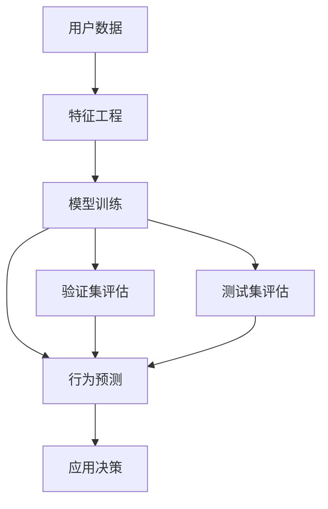

                 

# 如何进行有效的用户行为预测

> 关键词：用户行为预测, 协同过滤, 推荐系统, 深度学习, 强化学习, 神经网络, 特征工程

## 1. 背景介绍

在现代互联网时代，用户行为数据无处不在。从电商平台的用户购买记录、浏览历史到社交网络的用户互动，大量数据蕴含着用户兴趣和行为的丰富信息。如何从海量数据中挖掘出用户行为规律，预测用户未来行为，已成为互联网企业提高用户体验和销售额的重要任务。传统的协同过滤算法虽然简单易用，但在冷启动和数据稀疏问题上存在不足。近年来，基于深度学习和强化学习的预测方法因其强大的建模能力在用户行为预测中得到广泛应用。本文将从原理、步骤和应用等角度，深入探讨如何进行有效的用户行为预测。

## 2. 核心概念与联系

### 2.1 核心概念概述

用户行为预测是利用历史用户数据和特征，通过机器学习或深度学习模型预测用户未来行为的技术。常用的用户行为包括购买、浏览、评论、点击、点赞等，预测任务可以分为两类：

- **显式行为预测**：如用户是否购买某商品，预测目标为二分类问题。
- **隐式行为预测**：如用户浏览的页面序列，预测目标为序列分类或回归问题。

### 2.2 核心概念原理和架构的 Mermaid 流程图



- **A: 用户数据**：包括用户的历史行为记录、属性信息、上下文信息等。
- **B: 特征工程**：通过数据预处理、特征提取等方法，将原始数据转换为模型能够处理的输入特征。
- **C: 模型训练**：选择合适的预测模型，在带有标签的训练集上训练优化模型参数。
- **D: 行为预测**：利用训练好的模型对新用户数据进行预测，生成行为预测结果。
- **E/F: 验证集/测试集评估**：通过在验证集/测试集上评估模型性能，调整模型参数或选择更优模型。
- **G: 应用决策**：根据预测结果做出相应的决策，如个性化推荐、广告投放等。

## 3. 核心算法原理 & 具体操作步骤

### 3.1 算法原理概述

基于深度学习的用户行为预测，主要分为两类：序列预测和推荐系统预测。

- **序列预测**：如预测用户下一步浏览的页面，目标为序列分类或回归。
- **推荐系统预测**：如预测用户是否购买某商品，目标为二分类问题。

对于序列预测，常用的模型包括RNN、LSTM、GRU等序列模型。对于推荐系统预测，常用的模型包括MLP、CNN、DNN等深度神经网络模型。

### 3.2 算法步骤详解

#### 3.2.1 数据预处理

- **数据清洗**：处理缺失值、异常值，去除噪声数据。
- **特征工程**：提取用户行为特征，如用户ID、商品ID、时间戳、浏览时长等，并进行归一化处理。
- **数据划分**：将数据划分为训练集、验证集和测试集。

#### 3.2.2 模型训练

- **模型选择**：选择适合任务的深度学习模型，如RNN、LSTM、MLP、CNN等。
- **超参数调优**：通过网格搜索、随机搜索等方法，选择最优的模型超参数，如学习率、批大小、迭代次数等。
- **模型训练**：使用训练集数据训练模型，使用验证集数据进行参数调整，直至模型收敛。

#### 3.2.3 模型评估

- **验证集评估**：在验证集上评估模型性能，如准确率、召回率、F1分数等。
- **测试集评估**：在测试集上评估模型泛化能力，如AUC、RMSE等。
- **超参数调整**：根据评估结果，调整模型参数或选择更优模型。

#### 3.2.4 预测应用

- **预测**：使用训练好的模型对新数据进行预测，生成行为预测结果。
- **决策**：根据预测结果进行个性化推荐、广告投放等决策。

### 3.3 算法优缺点

#### 3.3.1 优点

- **建模能力强**：深度学习模型具有强大的非线性建模能力，能够捕捉复杂行为模式。
- **泛化能力强**：模型通常具有良好的泛化能力，可以适应多种数据分布。
- **可解释性强**：深度学习模型通常具有较高的可解释性，如权重、梯度等。

#### 3.3.2 缺点

- **数据需求高**：需要大量标注数据进行训练，对数据质量要求高。
- **计算资源需求大**：训练深度模型需要大量计算资源，特别是GPU/TPU等高性能设备。
- **模型复杂度高**：深度模型通常具有较多参数，容易过拟合。

### 3.4 算法应用领域

用户行为预测在多个领域得到广泛应用，包括：

- **电子商务**：个性化推荐、商品召回、广告投放等。
- **社交网络**：用户兴趣发现、内容推荐、好友推荐等。
- **金融行业**：风险评估、信用评分、投资建议等。
- **旅游行业**：行程推荐、价格预测、用户评分等。

## 4. 数学模型和公式 & 详细讲解 & 举例说明

### 4.1 数学模型构建

#### 4.1.1 序列预测模型

以LSTM模型为例，其数学模型可以表示为：

$$
h_t = \text{LSTM}(h_{t-1}, x_t; \theta)
$$

其中 $h_t$ 为时间步 $t$ 的隐藏状态，$x_t$ 为时间步 $t$ 的输入特征，$\theta$ 为模型参数。

#### 4.1.2 推荐系统模型

以MLP模型为例，其数学模型可以表示为：

$$
y = \sigma(W^Tx + b)
$$

其中 $y$ 为预测结果，$W$ 为权重矩阵，$x$ 为输入特征向量，$b$ 为偏置项，$\sigma$ 为激活函数。

### 4.2 公式推导过程

#### 4.2.1 序列预测模型推导

以LSTM模型为例，其反向传播算法推导过程如下：

- **前向传播**：

$$
h_t = f(\text{LSTM}(h_{t-1}, x_t; \theta))
$$

其中 $f$ 为激活函数，如Tanh或ReLU。

- **反向传播**：

$$
\frac{\partial L}{\partial h_t} = \frac{\partial L}{\partial y} \frac{\partial y}{\partial h_t}
$$

$$
\frac{\partial L}{\partial \theta} = \frac{\partial L}{\partial h_t} \frac{\partial h_t}{\partial \theta}
$$

其中 $L$ 为损失函数，$y$ 为预测结果。

#### 4.2.2 推荐系统模型推导

以MLP模型为例，其反向传播算法推导过程如下：

- **前向传播**：

$$
y = \sigma(W^Tx + b)
$$

- **反向传播**：

$$
\frac{\partial L}{\partial y} = \frac{\partial L}{\partial y} \frac{\partial y}{\partial x}
$$

$$
\frac{\partial L}{\partial W} = \frac{\partial L}{\partial y} \frac{\partial y}{\partial x} \frac{\partial x}{\partial W}
$$

$$
\frac{\partial L}{\partial b} = \frac{\partial L}{\partial y} \frac{\partial y}{\partial x}
$$

其中 $L$ 为损失函数。

### 4.3 案例分析与讲解

以电商平台个性化推荐系统为例，其用户行为预测流程如下：

1. **数据预处理**：清洗、归一化用户行为数据，提取用户ID、商品ID、浏览时长等特征。
2. **模型训练**：使用LSTM模型训练预测用户是否购买某商品。
3. **模型评估**：在验证集上评估模型性能，选择最优模型。
4. **预测应用**：使用训练好的模型对新用户行为进行预测，生成个性化推荐结果。

## 5. 项目实践：代码实例和详细解释说明

### 5.1 开发环境搭建

- **Python**：安装Python 3.8及以上版本，推荐使用Anaconda。
- **深度学习框架**：安装TensorFlow或PyTorch。
- **数据处理库**：安装Pandas、NumPy、Scikit-Learn。
- **可视化库**：安装Matplotlib、Seaborn。

### 5.2 源代码详细实现

以LSTM模型为例，代码实现如下：

```python
import tensorflow as tf
from tensorflow.keras.layers import LSTM, Dense
from tensorflow.keras.models import Sequential
from tensorflow.keras.optimizers import Adam

# 构建LSTM模型
model = Sequential()
model.add(LSTM(128, input_shape=(None, 10)))
model.add(Dense(1, activation='sigmoid'))

# 编译模型
model.compile(optimizer=Adam(learning_rate=0.001), loss='binary_crossentropy', metrics=['accuracy'])

# 训练模型
model.fit(train_x, train_y, batch_size=64, epochs=10, validation_data=(val_x, val_y))

# 评估模型
test_loss, test_acc = model.evaluate(test_x, test_y)
print(f'Test loss: {test_loss}, Test accuracy: {test_acc}')

# 预测新用户行为
new_user_behavior = [1, 2, 3, 4, 5, 6, 7, 8, 9, 10]
predictions = model.predict(new_user_behavior)
print(f'Prediction: {predictions}')
```

### 5.3 代码解读与分析

- **模型构建**：使用Sequential模型构建LSTM模型，输入层为LSTM层，输出层为Dense层。
- **模型编译**：使用Adam优化器和二元交叉熵损失函数编译模型。
- **模型训练**：使用训练集数据训练模型，验证集数据评估模型性能。
- **模型评估**：在测试集上评估模型性能，输出损失和准确率。
- **预测应用**：使用训练好的模型对新用户行为进行预测，输出预测结果。

## 6. 实际应用场景

### 6.1 个性化推荐系统

电商平台通过用户历史浏览记录和购买行为，使用深度学习模型预测用户是否会购买某商品，从而实现个性化推荐。具体实现如下：

1. **数据预处理**：清洗、归一化用户行为数据，提取用户ID、商品ID、浏览时长等特征。
2. **模型训练**：使用LSTM模型训练预测用户是否购买某商品。
3. **模型评估**：在验证集上评估模型性能，选择最优模型。
4. **预测应用**：使用训练好的模型对新用户行为进行预测，生成个性化推荐结果。

### 6.2 内容推荐系统

社交媒体通过用户历史互动数据，使用深度学习模型预测用户是否会对某个内容进行点赞、分享或评论，从而实现内容推荐。具体实现如下：

1. **数据预处理**：清洗、归一化用户互动数据，提取用户ID、内容ID、互动类型等特征。
2. **模型训练**：使用MLP模型训练预测用户是否会对某个内容进行互动。
3. **模型评估**：在验证集上评估模型性能，选择最优模型。
4. **预测应用**：使用训练好的模型对新用户行为进行预测，生成内容推荐结果。

### 6.3 广告投放系统

在线广告平台通过用户历史浏览记录和点击行为，使用深度学习模型预测用户是否会点击某个广告，从而实现个性化广告投放。具体实现如下：

1. **数据预处理**：清洗、归一化用户点击行为数据，提取用户ID、广告ID、点击位置等特征。
2. **模型训练**：使用CNN模型训练预测用户是否会点击某个广告。
3. **模型评估**：在验证集上评估模型性能，选择最优模型。
4. **预测应用**：使用训练好的模型对新用户行为进行预测，生成广告投放策略。

## 7. 工具和资源推荐

### 7.1 学习资源推荐

- **深度学习课程**：推荐Coursera上的深度学习专项课程。
- **深度学习书籍**：推荐《深度学习》（Ian Goodfellow、Yoshua Bengio、Aaron Courville著）。
- **在线资源**：推荐Kaggle网站，提供大量深度学习竞赛和数据集。

### 7.2 开发工具推荐

- **深度学习框架**：推荐TensorFlow、PyTorch。
- **数据处理库**：推荐Pandas、NumPy。
- **可视化库**：推荐Matplotlib、Seaborn。

### 7.3 相关论文推荐

- **序列预测**：推荐论文《A Neural Probabilistic Language Model》（Hinton et al. 2006）。
- **推荐系统**：推荐论文《BPR: Bayesian Personalized Ranking from Historical Interaction Data》（He et al. 2007）。

## 8. 总结：未来发展趋势与挑战

### 8.1 研究成果总结

深度学习在用户行为预测中取得了显著成果，主要体现在以下方面：

1. **建模能力**：深度学习模型具有强大的非线性建模能力，能够捕捉复杂行为模式。
2. **泛化能力**：模型通常具有良好的泛化能力，可以适应多种数据分布。
3. **可解释性**：深度学习模型通常具有较高的可解释性，如权重、梯度等。

### 8.2 未来发展趋势

未来深度学习在用户行为预测领域的发展趋势如下：

1. **模型结构优化**：引入更深层次的模型结构，如Transformer、ResNet等，提高模型建模能力。
2. **数据处理方法**：引入更多数据处理方法，如迁移学习、强化学习等，提高模型泛化能力。
3. **计算资源优化**：引入分布式计算、混合精度训练等方法，提高模型训练和推理效率。
4. **可解释性增强**：引入更多可解释性方法，如LIME、SHAP等，提高模型可解释性。

### 8.3 面临的挑战

尽管深度学习在用户行为预测中取得了显著成果，但仍面临以下挑战：

1. **数据质量问题**：数据不完整、数据噪声等问题会影响模型训练效果。
2. **模型复杂度问题**：深度学习模型参数众多，训练复杂度高。
3. **模型泛化能力**：模型在冷启动和数据稀疏情况下，泛化能力较差。
4. **模型可解释性**：深度学习模型通常具有较高的复杂度，难以解释其内部决策过程。

### 8.4 研究展望

未来深度学习在用户行为预测领域的研究展望如下：

1. **模型结构优化**：引入更深层次的模型结构，如Transformer、ResNet等，提高模型建模能力。
2. **数据处理方法**：引入更多数据处理方法，如迁移学习、强化学习等，提高模型泛化能力。
3. **计算资源优化**：引入分布式计算、混合精度训练等方法，提高模型训练和推理效率。
4. **可解释性增强**：引入更多可解释性方法，如LIME、SHAP等，提高模型可解释性。

## 9. 附录：常见问题与解答

### Q1: 如何处理数据稀疏问题？

**A**：数据稀疏是深度学习模型面临的主要问题之一。常见的处理方法是引入数据增强技术，如随机回译、近义替换等，增加训练数据量，缓解数据稀疏问题。

### Q2: 如何提高模型泛化能力？

**A**：提高模型泛化能力的方法包括：
1. **数据增强**：引入数据增强技术，如随机回译、近义替换等，增加训练数据量。
2. **迁移学习**：使用预训练模型作为初始化参数，减少微调参数量，提高模型泛化能力。
3. **强化学习**：使用强化学习技术，通过模拟环境训练模型，提高模型泛化能力。

### Q3: 如何提高模型可解释性？

**A**：提高模型可解释性的方法包括：
1. **LIME**：使用LIME方法生成局部模型解释，解释模型决策过程。
2. **SHAP**：使用SHAP方法生成全局模型解释，解释模型整体行为。
3. **特征可视化**：通过特征可视化技术，展示模型重要特征和决策点。

### Q4: 如何选择最优模型？

**A**：选择最优模型的方法包括：
1. **网格搜索**：使用网格搜索方法，遍历所有超参数组合，选择最优模型。
2. **随机搜索**：使用随机搜索方法，随机生成超参数组合，选择最优模型。
3. **交叉验证**：使用交叉验证方法，评估模型在训练集和验证集上的表现，选择最优模型。

### Q5: 如何评估模型性能？

**A**：评估模型性能的方法包括：
1. **准确率**：使用准确率评估分类任务性能。
2. **召回率**：使用召回率评估分类任务性能。
3. **F1分数**：使用F1分数综合评估分类任务性能。
4. **RMSE**：使用RMSE评估回归任务性能。

---

作者：禅与计算机程序设计艺术 / Zen and the Art of Computer Programming

