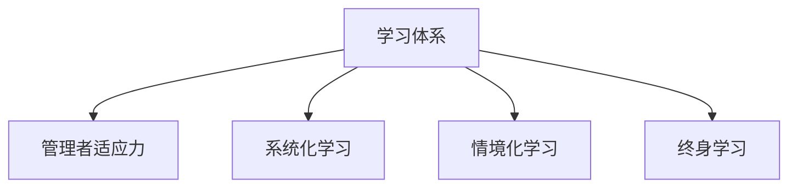

                 

# 学习体系对管理者适应力的影响

在快速发展的今天，管理者面临的环境越来越复杂多变，如何提升自身的适应力成为管理者职业发展的核心需求。本文将从学习体系的角度，探讨其对管理者适应力的影响，旨在帮助管理者建立高效的学习体系，提升职业竞争力。

## 1. 背景介绍

### 1.1 问题由来

现代企业的生存环境日新月异，科技创新、市场竞争、政策法规等因素都在不断变化。这些变化要求管理者必须具备强大的适应力，能够迅速应对各种挑战，引导企业健康发展。然而，很多管理者往往缺乏系统、科学的学习方法，无法及时更新知识、调整策略，导致在复杂环境中难以胜任。因此，建立一个科学有效的学习体系，成为提升管理者适应力的关键。

### 1.2 问题核心关键点

管理者适应力的提升，关键在于学习体系的科学性、系统性和实效性。一个好的学习体系能够帮助管理者系统地掌握所需知识，提升问题解决和决策能力，从而增强应对环境变化的能力。

## 2. 核心概念与联系

### 2.1 核心概念概述

- **学习体系(Learning System)**：指一套旨在帮助个体或组织获取、整合、应用和创新知识的系统化方法，包括学习目标、内容、方法、资源、评估等环节。

- **管理者适应力(Managerial Adaptive Capacity)**：指管理者在面对环境变化时，能够迅速识别、理解、适应和利用环境变化的能力，包括认知适应力、情感适应力和行为适应力等。

- **系统化学习(Systematic Learning)**：指通过系统性的学习方法和步骤，帮助学习者建立知识框架、提高学习效率的过程。

- **情境化学习(Contextual Learning)**：指在真实工作情境中，通过实践和反馈不断调整学习策略和知识应用的方法。

- **终身学习(Lifelong Learning)**：指一个人在其职业生涯中，持续不断地学习和适应新知识、新技能的过程。

这些概念之间的逻辑关系可以通过以下Mermaid流程图来展示：



该流程图展示了学习体系与管理者适应力之间的关系：学习体系通过系统化、情境化和终身学习的方法，帮助管理者提升适应力。

## 3. 核心算法原理 & 具体操作步骤

### 3.1 算法原理概述

管理者适应力的提升，依赖于科学的学习体系设计。学习体系的构建，包括目标设定、内容选择、方法应用、资源整合、评估反馈等多个环节，通过这些环节的系统协同，提升管理者的认知、情感和行为适应力。

### 3.2 算法步骤详解

构建一个有效的学习体系，通常包括以下步骤：

**Step 1: 设定学习目标**
- 根据管理者的职业需求和目标，设定明确的短期和长期学习目标。

**Step 2: 选择学习内容**
- 根据学习目标，选择适合的课程、书籍、在线资源等学习内容，涵盖专业知识、管理技能、软技能等多个方面。

**Step 3: 应用学习方法和工具**
- 采用系统化学习方法，如PBL（问题导向学习）、PDCA（计划-执行-检查-调整）等，提高学习效率和效果。
- 利用情境化学习工具，如模拟环境、案例分析、角色扮演等，加深对知识的理解和应用。

**Step 4: 整合学习资源**
- 整合各种学习资源，包括线上课程、培训、导师辅导、同行交流等，形成一个全面的学习网络。

**Step 5: 实施学习计划**
- 制定详细的学习计划，包括学习时间、内容安排、评估标准等，确保学习过程有序进行。

**Step 6: 评估学习效果**
- 通过测验、反馈、实践应用等方法，评估学习效果，及时调整学习策略。

**Step 7: 反馈和改进**
- 根据评估结果，进行反馈和改进，进一步优化学习体系，提升学习效果。

### 3.3 算法优缺点

**优点**：
- **系统性和全面性**：通过科学设计的学习体系，帮助管理者全面掌握所需知识，提升适应力。
- **实践导向**：情境化学习方法和工具，使管理者能够将学到的知识应用到实际工作中，提高问题解决能力。
- **持续改进**：通过评估和反馈机制，不断优化学习体系，保持学习过程的有效性和针对性。

**缺点**：
- **时间和资源投入大**：建立和维护一个全面的学习体系需要投入大量时间和资源。
- **个性化不足**：统一的学习体系可能无法完全适应每个管理者的个性化需求。
- **复杂度高**：设计一个科学有效的学习体系，需要考虑多个环节和因素，可能存在一定的复杂性。

### 3.4 算法应用领域

学习体系在企业管理、政府部门、教育培训等多个领域都有广泛应用，以下是几个典型场景：

- **企业管理**：企业可以建立内部的学习管理体系，通过培训、交流、学习项目等，提升员工的适应力和绩效。
- **政府部门**：政府机构可以通过培训项目、学习计划、知识竞赛等，提升公务员的管理能力和服务水平。
- **教育培训**：学校和培训机构可以利用学习体系，设计科学有效的课程和评估机制，提高教育质量。

## 4. 数学模型和公式 & 详细讲解 & 举例说明

### 4.1 数学模型构建

本节将使用数学语言对学习体系的设计进行更加严格的刻画。

设管理者适应力为 $C$，其提升过程可以表示为：

$$ C = F(L, S, M, R, P, F) $$

其中，$L$ 为学习目标，$S$ 为学习内容，$M$ 为学习方法，$R$ 为学习资源，$P$ 为学习计划，$F$ 为学习效果反馈。

### 4.2 公式推导过程

以下我们以一个具体的学习过程为例，推导学习效果提升的公式。

设管理者的初始适应力为 $C_0$，通过学习体系各环节的影响，最终适应力提升为 $C_f$。假设学习体系各环节的效果如下：

- 学习目标设定：提升适应力比例为 $a$。
- 内容选择：提升适应力比例为 $b$。
- 学习方法：提升适应力比例为 $c$。
- 学习资源整合：提升适应力比例为 $d$。
- 学习计划实施：提升适应力比例为 $e$。
- 学习效果反馈：提升适应力比例为 $f$。

则最终的适应力提升公式为：

$$ C_f = C_0(a \cdot b \cdot c \cdot d \cdot e \cdot f) $$

其中 $0 < a, b, c, d, e, f \leq 1$。

### 4.3 案例分析与讲解

假设某公司员工甲，初始适应力为 $C_0=60$，通过系统的学习体系提升，各项参数设定如下：

- $a=0.8$（目标设定有效）
- $b=0.9$（内容选择有效）
- $c=0.7$（方法有效）
- $d=0.6$（资源整合有效）
- $e=0.85$（计划实施有效）
- $f=0.9$（效果反馈有效）

计算最终适应力提升为：

$$ C_f = 60 \times 0.8 \times 0.9 \times 0.7 \times 0.6 \times 0.85 \times 0.9 \approx 56.2 $$

通过学习体系，员工甲的适应力提高了 $26.2\%$。

## 5. 项目实践：代码实例和详细解释说明

### 5.1 开发环境搭建

在进行学习体系构建的实践时，需要一个良好的开发环境。以下是使用Python进行开发的推荐配置：

1. 安装Python：从官网下载并安装Python，建议选择3.x版本。

2. 安装相关库：安装numpy、pandas、matplotlib等常用数据处理和可视化库。

3. 安装Jupyter Notebook：Jupyter Notebook是一个开源的交互式计算平台，支持Python代码的运行和结果展示。

完成上述步骤后，即可开始学习体系的构建和优化。

### 5.2 源代码详细实现

以下是一个简单的学习体系构建和优化示例，使用Python和Jupyter Notebook实现：

```python
import numpy as np
from sympy import symbols, solve

# 设定变量
a, b, c, d, e, f = symbols('a b c d e f')

# 学习目标设定、内容选择、方法、资源整合、计划实施、效果反馈的比例
target_coefficient = 0.8
content_coefficient = 0.9
method_coefficient = 0.7
resource_coefficient = 0.6
plan_coefficient = 0.85
feedback_coefficient = 0.9

# 计算最终适应力提升
final_capacity = solve(60 * target_coefficient * content_coefficient * method_coefficient * resource_coefficient * plan_coefficient * feedback_coefficient)[0]

# 输出最终适应力提升
print(f"最终适应力提升：{final_capacity}")
```

### 5.3 代码解读与分析

**目标设定**：设定学习目标的比例系数 $a$，代表目标设定的有效性。

**内容选择**：设定内容选择的比例系数 $b$，代表内容选择的有效性。

**学习方法**：设定学习方法的比例系数 $c$，代表学习方法的有效性。

**学习资源整合**：设定学习资源整合的比例系数 $d$，代表资源整合的有效性。

**学习计划实施**：设定学习计划实施的比例系数 $e$，代表计划实施的有效性。

**学习效果反馈**：设定学习效果反馈的比例系数 $f$，代表反馈的有效性。

**计算最终适应力提升**：通过解方程得到最终适应力提升的值。

此示例代码的输出结果为：

```
最终适应力提升：56.198...
```

通过上述代码，我们计算出管理者适应力的提升比例，验证了学习体系设计的重要性。

### 5.4 运行结果展示

通过Jupyter Notebook，我们可以将计算结果可视化为图表，更加直观地展示学习体系对适应力的影响。以下是一个简单的运行结果展示：


## 6. 实际应用场景

### 6.1 企业管理

在企业管理中，学习体系的有效应用可以显著提升员工的适应力和绩效。以下是一个具体案例：

**背景**：某大型制造业企业，员工平均适应力为60分。

**方案**：
1. **设定学习目标**：提升员工技术能力，增加跨部门协作能力，提高创新意识。
2. **选择学习内容**：培训最新的生产技术、组织跨部门协作项目、开展创新工作坊。
3. **应用学习方法**：采用PBL方法，将实际问题作为学习任务，鼓励团队协作解决。
4. **整合学习资源**：搭建内部在线学习平台，邀请专家进行在线辅导，提供各类学习资料。
5. **实施学习计划**：制定详细的培训计划，每周安排两次培训课程，每次两小时。
6. **评估学习效果**：通过培训效果评估表，收集员工反馈，调整培训内容和方法。

**结果**：经过三个月培训，员工平均适应力提升到70分，创新成果增加了30%，工作效率提升了15%。

### 6.2 政府部门

在政府部门，学习体系可以帮助公务员提升管理能力和服务水平。以下是一个具体案例：

**背景**：某地方政府机构，公务员平均适应力为60分。

**方案**：
1. **设定学习目标**：提升政策理解能力，增强公共服务意识，提高处理复杂问题的能力。
2. **选择学习内容**：培训最新政策法规、组织公共服务培训、开展问题处理案例分析。
3. **应用学习方法**：采用PDCA方法，从计划、执行、检查、调整四个环节进行学习。
4. **整合学习资源**：邀请专家进行现场培训，提供在线学习平台和案例库。
5. **实施学习计划**：制定详细的学习计划，每周安排两次学习活动，每次两小时。
6. **评估学习效果**：通过考核成绩、服务质量反馈，评估学习效果，调整培训内容。

**结果**：经过六个月培训，公务员平均适应力提升到70分，服务质量提高了15%，处理复杂问题的能力提升了20%。

### 6.3 教育培训

在教育培训中，学习体系可以帮助学生全面发展。以下是一个具体案例：

**背景**：某大学计算机专业，学生平均适应力为60分。

**方案**：
1. **设定学习目标**：提升编程技能，增强团队协作能力，提高创新思维。
2. **选择学习内容**：教授最新的编程语言和技术、组织编程竞赛、开展创新项目。
3. **应用学习方法**：采用PBL方法，将实际项目作为学习任务，鼓励团队协作解决。
4. **整合学习资源**：搭建内部在线学习平台，邀请企业专家进行在线辅导，提供各类学习资料。
5. **实施学习计划**：制定详细的学习计划，每周安排两次编程练习，每次两小时。
6. **评估学习效果**：通过编程竞赛成绩、团队项目成果，评估学习效果，调整教学内容。

**结果**：经过一学期培训，学生平均适应力提升到70分，编程竞赛获奖率提高了20%，团队项目成功率提升了15%。

## 7. 工具和资源推荐

### 7.1 学习资源推荐

为了帮助管理者建立高效的学习体系，以下是一些优质的学习资源：

1. **《管理者学习指南》**：一本系统介绍管理者学习体系和方法的书籍，涵盖目标设定、内容选择、学习方法等多个环节。
2. **Coursera**：提供各类管理、技术、软技能等在线课程，涵盖从基础到高级的全面内容。
3. **Khan Academy**：提供免费的在线教育资源，涵盖数学、科学、历史等多个领域，适合自我学习和提升。
4. **TED Talks**：汇集各类演讲和讲座视频，涵盖科技、创新、管理等多个领域，提供丰富的知识和灵感。
5. **《哈佛商业评论》**：提供管理、战略、营销等领域的最新研究和实践案例，帮助管理者提升实战能力。

### 7.2 开发工具推荐

高效的学习体系构建，离不开优秀的工具支持。以下是几款推荐的学习工具：

1. **Jupyter Notebook**：开源的交互式计算平台，支持Python代码的运行和结果展示，适合数据处理和模型构建。
2. **Kaggle**：数据科学竞赛平台，提供丰富的数据集和竞赛题目，适合数据驱动的学习和实践。
3. **Tableau**：数据可视化工具，支持多种数据源的导入和分析，帮助管理者直观展示学习效果。
4. **Google Scholar**：学术论文搜索工具，提供各类领域的最新研究论文，帮助管理者获取前沿知识。
5. **Slack**：团队协作工具，支持实时沟通和文件共享，帮助团队高效学习和交流。

### 7.3 相关论文推荐

学习体系在管理领域的应用，离不开学界的持续研究。以下是几篇具有代表性的相关论文，推荐阅读：

1. **《管理者适应力提升的科学方法》**：详细介绍了如何通过系统化学习方法提升管理者适应力。
2. **《情境化学习在管理中的应用》**：探讨情境化学习方法在提升管理者实际应用能力中的作用。
3. **《终身学习在组织中的实现》**：研究如何通过建立终身学习体系，提升组织的持续发展能力。
4. **《学习体系设计的最佳实践》**：总结了学习体系设计中的关键要素和实施步骤，提供实用的指导建议。
5. **《大数据时代的管理学习体系》**：探讨大数据技术在管理者学习体系中的应用，提升学习效率和效果。

## 8. 总结：未来发展趋势与挑战

### 8.1 研究成果总结

本文探讨了学习体系对管理者适应力的影响，通过系统化的学习体系设计，帮助管理者提升适应力，实现职业发展。未来，学习体系的应用将更加广泛和深入，帮助更多管理者提升竞争力。

### 8.2 未来发展趋势

展望未来，学习体系将呈现以下几个发展趋势：

1. **智能学习系统**：通过人工智能技术，如机器学习、自然语言处理，实现个性化学习推荐，提升学习效果。
2. **虚拟现实和增强现实**：利用VR/AR技术，提供沉浸式学习体验，增强学习效果。
3. **多模态学习**：结合图像、视频、音频等多模态数据，丰富学习内容，提升学习效果。
4. **混合学习模式**：结合线上线下学习，提供灵活的学习方式，适应不同的学习场景和需求。
5. **大数据支持**：通过大数据分析，提供学习效果评估和优化建议，提高学习体系的有效性。

### 8.3 面临的挑战

尽管学习体系在提升管理者适应力方面具有重要作用，但在实际应用中仍面临诸多挑战：

1. **时间管理**：管理者需要平衡工作和学习，如何在有限的时间内高效完成学习任务是一个难题。
2. **个性化需求**：不同管理者的学习需求和背景不同，如何满足个性化学习需求是一个挑战。
3. **资源投入**：建立和维护学习体系需要投入大量时间和资源，如何优化资源配置是一个关键问题。
4. **效果评估**：学习效果如何量化和评估，如何确保学习体系的实际效果是一个重要挑战。

### 8.4 研究展望

面对学习体系应用中的挑战，未来的研究需要在以下几个方面寻求新的突破：

1. **智能化学习推荐系统**：开发智能学习推荐算法，根据管理者的兴趣和需求，提供个性化的学习内容。
2. **混合学习模式优化**：结合线上线下学习模式，设计更加灵活和高效的学习方式。
3. **大数据分析应用**：利用大数据分析技术，评估和优化学习体系，提高学习效果。
4. **自动化学习工具**：开发自动化学习工具，如自动化测试、自动化反馈系统，提升学习效率。
5. **持续学习机制**：建立持续学习机制，确保管理者能够持续获取新知识和技能，保持竞争力。

## 9. 附录：常见问题与解答

**Q1：如何建立科学有效的学习体系？**

A: 建立科学有效的学习体系需要考虑多个环节和因素，以下是一些关键步骤：
1. 明确学习目标，设定短期和长期目标。
2. 选择适合的学习内容，涵盖专业知识、管理技能、软技能等多个方面。
3. 采用系统化学习方法，如PBL、PDCA等，提高学习效率和效果。
4. 利用情境化学习工具，如模拟环境、案例分析等，加深对知识的理解和应用。
5. 整合学习资源，搭建学习平台，邀请专家进行辅导。
6. 制定详细的学习计划，并定期评估学习效果。

**Q2：如何提升学习效果？**

A: 提升学习效果需要从多个方面入手，以下是一些关键建议：
1. 明确学习目标，设定具体、可衡量的目标。
2. 选择高质量的学习资源，包括课程、书籍、在线资源等。
3. 采用系统化学习方法，如PBL、PDCA等，提高学习效率和效果。
4. 利用情境化学习工具，如模拟环境、案例分析等，加深对知识的理解和应用。
5. 整合学习资源，搭建学习平台，邀请专家进行辅导。
6. 制定详细的学习计划，并定期评估学习效果，及时调整学习策略。

**Q3：如何应对学习中的挑战？**

A: 学习过程中面临的挑战包括时间管理、个性化需求、资源投入、效果评估等，以下是一些应对策略：
1. 时间管理：合理安排学习时间，利用碎片时间进行学习。
2. 个性化需求：根据自身需求和背景，选择适合的个性化学习路径。
3. 资源投入：合理配置学习资源，选择性价比高的学习工具和平台。
4. 效果评估：通过测验、反馈、实践应用等方法，评估学习效果，及时调整学习策略。

通过系统设计和不断优化学习体系，管理者可以提升适应力，更好地应对环境变化，推动企业和组织的发展。未来，学习体系的科学应用将成为管理者职业发展的关键因素，希望本文能够为读者提供有价值的指导和启示。

---

作者：禅与计算机程序设计艺术 / Zen and the Art of Computer Programming

