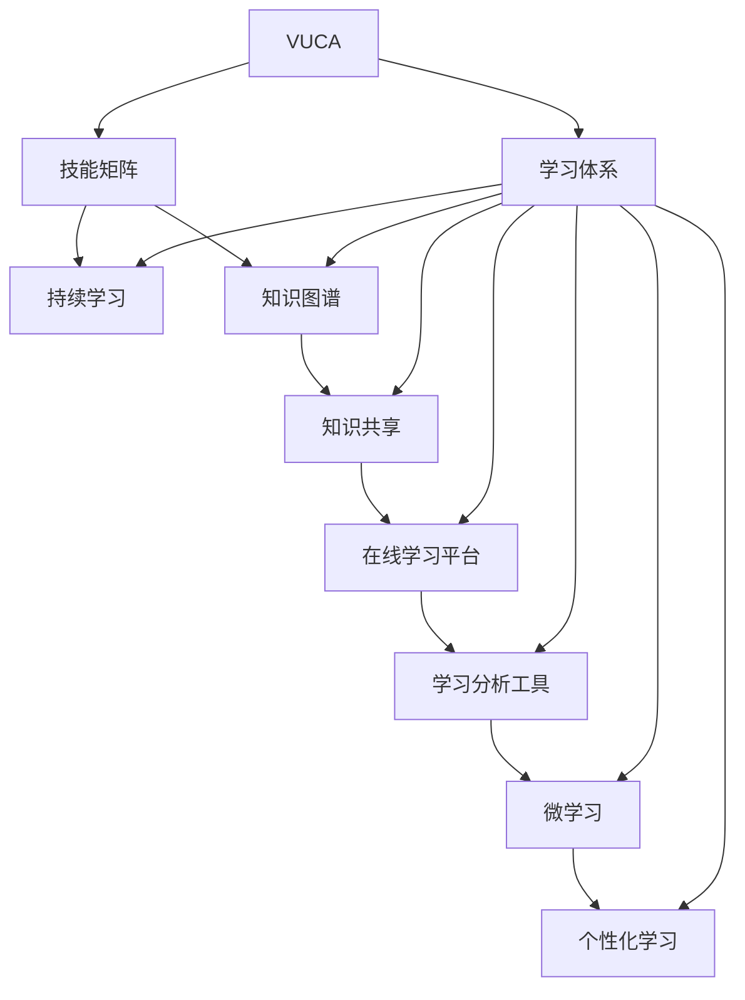

                 

# 学习体系：VUCA时代的重要技能

> 关键词：VUCA, 学习体系, 技能矩阵, 持续学习, 知识图谱, 知识共享, 在线学习平台, 学习分析工具, 微学习, 个性化学习

## 1. 背景介绍

### 1.1 问题由来

随着技术的不断进步和市场环境的快速变化，全球化、不确定性、多样性和复杂性（VUCA）日益成为现代企业和组织所面临的重要挑战。在VUCA时代，企业不仅需要快速响应市场变化，还需要具备高度的灵活性和适应性，以应对不断变化的市场需求和竞争环境。

在这种背景下，传统的一次性教育已经无法满足快速变化的学习需求。企业需要建立起一种更加灵活、动态和可持续的学习体系，以便员工能够不断更新和扩展自己的知识和技能，以应对不断变化的业务需求。

### 1.2 问题核心关键点

建立一个有效的学习体系，需要解决以下几个核心问题：

- 如何构建一个能够满足不同员工学习需求的灵活体系？
- 如何保证员工能够高效地获取和应用新知识？
- 如何评估员工的学习成果并给予有效的反馈？
- 如何促进知识共享和协作，形成企业内部的知识库？
- 如何在VUCA环境中，动态更新学习内容并及时调整学习策略？

## 2. 核心概念与联系

### 2.1 核心概念概述

为更好地理解如何在VUCA时代构建有效的学习体系，本节将介绍几个关键的概念：

- VUCA (Volatility, Uncertainty, Complexity, and Ambiguity)：全球化、不确定性、多样性和复杂性，现代企业和组织所面临的四大挑战。
- 学习体系：包含组织内外多种学习资源，通过多种方式为员工提供持续学习的机会。
- 技能矩阵：展示企业所需技能及当前员工掌握技能的可视化工具。
- 持续学习：员工持续获取、应用、分享和更新知识的过程。
- 知识图谱：构建企业的知识网络，方便员工快速查找和应用知识。
- 知识共享：鼓励员工将知识和经验分享给同事，共同提高企业整体知识水平。
- 在线学习平台：集成了多种学习资源和工具，支持远程学习。
- 学习分析工具：通过数据分析工具，了解员工的学习行为和成果，并进行优化。
- 微学习：基于微小、短时、结构化的学习单元，方便员工随时学习。
- 个性化学习：根据员工的特点和需求，提供定制化的学习方案。

这些核心概念之间存在紧密的联系，共同构成了VUCA时代的企业学习体系。通过理解这些概念，我们可以更好地把握构建学习体系的逻辑和关键步骤。

### 2.2 核心概念原理和架构的 Mermaid 流程图



## 3. 核心算法原理 & 具体操作步骤

### 3.1 算法原理概述

在VUCA时代，构建有效的学习体系，需要利用多种技术和方法，以确保员工能够快速、灵活地获取和应用新知识。以下是核心算法原理的概述：

- **技能矩阵构建**：通过技能矩阵展示企业所需技能及员工掌握情况，帮助企业识别技能差距和培训需求。
- **持续学习系统**：利用在线学习平台、学习分析工具和个性化推荐算法，支持员工持续获取新知识。
- **知识图谱构建**：利用自然语言处理和图数据库技术，构建知识图谱，方便员工快速查找和应用知识。
- **微学习策略**：基于微小、短时、结构化的学习单元，提升学习效率和方便员工随时学习。

### 3.2 算法步骤详解

#### 3.2.1 技能矩阵构建

1. **技能需求调研**：通过问卷调查、面试、工作分析等方法，收集企业所需的关键技能和岗位要求。
2. **技能映射**：将技能需求与现有员工的技能进行映射，形成初步的技能矩阵。
3. **技能评估**：通过在线测评、培训考核等方式，对员工的技能水平进行评估，更新技能矩阵。
4. **技能差距分析**：识别技能差距和培训需求，生成培训计划。

#### 3.2.2 持续学习系统

1. **在线学习平台搭建**：选择合适的在线学习平台，集成课程、学习资源和工具。
2. **学习内容采购**：根据技能矩阵和员工需求，采购或开发相应的学习内容。
3. **个性化推荐**：利用机器学习算法，对员工的学习行为和成果进行分析，推荐个性化学习内容。
4. **学习路径设计**：设计灵活的学习路径，支持员工自主学习和深度学习。
5. **学习成果评估**：通过在线测评、项目实践等方式，评估员工的学习成果，提供反馈。

#### 3.2.3 知识图谱构建

1. **知识源整合**：将企业内部和外部的知识源整合，如文档、报告、论坛等。
2. **知识抽取**：利用自然语言处理技术，从知识源中抽取实体、关系和概念。
3. **知识建模**：将抽取的知识构建为知识图谱，形成企业内部的知识网络。
4. **知识检索**：提供快速、准确的知识检索功能，支持员工查找和应用知识。
5. **知识更新**：定期更新知识图谱，保持知识的最新和准确。

#### 3.2.4 微学习策略

1. **微学习内容设计**：设计短小精悍、结构化的学习单元，方便员工随时学习。
2. **微学习内容发布**：通过在线平台和邮件等渠道，推送微学习内容给员工。
3. **微学习反馈机制**：收集员工对微学习内容的反馈，持续优化微学习内容和策略。
4. **微学习平台集成**：将微学习内容集成到在线学习平台，方便员工查找和学习。

### 3.3 算法优缺点

**优点**：

- 灵活性高：通过持续学习和微学习策略，员工能够随时获取和应用新知识，提高工作效率和学习效率。
- 适应性强：知识图谱和在线学习平台，支持动态更新和学习内容的个性化推荐，适应企业不断变化的需求。
- 知识共享便捷：知识共享平台和微学习策略，鼓励员工将知识和经验分享给同事，形成企业内部的知识库。

**缺点**：

- 成本高：初期搭建学习体系和采购学习内容需要较高的投入。
- 技术复杂：构建知识图谱和在线学习平台需要较高的技术水平，可能需要专业的IT团队支持。
- 持续维护：学习体系的运营和维护需要持续投入，如内容更新、技术维护等。

### 3.4 算法应用领域

基于VUCA时代的学习体系，已经在多个领域得到了广泛应用，例如：

- **企业培训**：通过技能矩阵和持续学习系统，帮助企业快速识别技能差距，培训员工。
- **人力资源管理**：利用学习分析工具，评估员工的学习成果，优化人力资源管理策略。
- **产品研发**：通过知识图谱和在线学习平台，促进知识共享和协作，提升产品研发效率。
- **市场销售**：利用微学习策略和个性化学习，提升销售团队的知识水平和销售能力。
- **客户服务**：通过持续学习系统，提升客户服务人员的服务质量和客户满意度。

此外，在学习体系的构建和应用过程中，还可以引入更多的技术和方法，如自然语言处理、机器学习、区块链等，进一步提升学习体系的效能和灵活性。

## 4. 数学模型和公式 & 详细讲解 & 举例说明

### 4.1 数学模型构建

本节将使用数学语言对VUCA时代的学习体系进行更加严格的刻画。

假设企业所需技能集合为 $S=\{s_1,s_2,...,s_n\}$，每个技能 $s_i$ 的掌握情况可以通过评分 $r_i \in [0,1]$ 表示。企业内部员工的总数为 $N$，每个员工 $i$ 的技能掌握情况可以表示为向量 $\vec{r}_i \in [0,1]^n$。

定义技能矩阵 $R \in [0,1]^{n \times N}$，其中 $R_{ij} = r_i$ 表示员工 $i$ 对技能 $s_j$ 的掌握情况。通过技能矩阵，可以清晰地展示企业所需技能和员工掌握技能的分布情况。

### 4.2 公式推导过程

假设企业需要识别的技能差距为 $\Delta R \in [0,1]^{n \times N}$，其中 $\Delta R_{ij} = r_i - \bar{r}_j$ 表示技能 $s_j$ 的平均掌握情况与员工 $i$ 的掌握情况之间的差距。

技能矩阵 $R$ 的优化目标是最小化技能差距，即找到最优的技能分配方案：

$$
\min_{R} \| \Delta R \|_F^2
$$

其中 $\|\cdot\|_F$ 表示矩阵的 Frobenius 范数。

通过求解上述优化问题，可以得到技能矩阵 $R$ 的最优解，即企业所需技能和员工掌握技能的理想分配方案。

### 4.3 案例分析与讲解

以一个假设的企业为例，分析如何构建和优化技能矩阵：

1. **技能需求调研**：企业通过问卷调查和面试，收集所需的关键技能和岗位要求，如编程、项目管理、市场营销等。
2. **技能映射**：将技能需求与现有员工的技能进行映射，形成初步的技能矩阵 $R$。
3. **技能评估**：通过在线测评和项目实践，对员工的技能水平进行评估，更新技能矩阵 $R$。
4. **技能差距分析**：计算技能差距 $\Delta R$，识别出技能差距较大的员工和岗位。
5. **培训计划制定**：根据技能差距分析结果，制定培训计划，优化员工的技能结构。

## 5. 项目实践：代码实例和详细解释说明

### 5.1 开发环境搭建

在进行学习体系构建的实践前，我们需要准备好开发环境。以下是使用Python进行环境搭建的步骤：

1. 安装Anaconda：从官网下载并安装Anaconda，用于创建独立的Python环境。
2. 创建并激活虚拟环境：
```bash
conda create -n learning-env python=3.8 
conda activate learning-env
```
3. 安装必要的Python包和工具：
```bash
pip install pandas numpy scikit-learn matplotlib
pip install pyjwt # 用于加密和解密Token
```
4. 搭建在线学习平台：选择合适的在线学习平台，如Coursera、edX、Udacity等。
5. 搭建知识图谱：选择合适的知识图谱构建工具，如Neo4j、Gephi等。

### 5.2 源代码详细实现

这里以构建技能矩阵为例，给出使用Python进行技能矩阵构建的代码实现。

```python
import pandas as pd

# 创建技能矩阵
def create_skill_matrix():
    # 定义技能列表
    skills = ['编程', '项目管理', '市场营销', '数据分析']
    
    # 创建技能矩阵
    skill_matrix = pd.DataFrame(columns=skills)
    
    # 填充技能矩阵
    skill_matrix = skill_matrix.fillna(0)
    
    return skill_matrix

# 评估员工技能
def evaluate_employee_skill(skill_matrix, employee_id):
    # 获取员工的技能列表
    skills = skill_matrix.columns
    
    # 初始化员工的技能评分
    employee_skill = {}
    
    # 评估员工的技能
    for skill in skills:
        # 模拟评估过程，获取评分
        score = 0.5
        employee_skill[skill] = score
    
    return employee_skill

# 计算技能差距
def calculate_skill_gap(skill_matrix, employee_skill):
    # 计算技能差距
    skill_gap = {}
    
    for skill in skills:
        # 计算技能差距
        gap = employee_skill[skill] - skill_matrix.mean()[skill]
        skill_gap[skill] = gap
    
    return skill_gap

# 主函数
if __name__ == '__main__':
    # 构建技能矩阵
    skill_matrix = create_skill_matrix()
    
    # 评估员工技能
    employee_id = 123
    employee_skill = evaluate_employee_skill(skill_matrix, employee_id)
    
    # 计算技能差距
    skill_gap = calculate_skill_gap(skill_matrix, employee_skill)
    
    # 输出结果
    print(skill_gap)
```

### 5.3 代码解读与分析

让我们再详细解读一下关键代码的实现细节：

**create_skill_matrix函数**：
- 定义技能列表
- 创建技能矩阵
- 填充技能矩阵

**evaluate_employee_skill函数**：
- 获取员工的技能列表
- 初始化员工的技能评分
- 评估员工的技能

**calculate_skill_gap函数**：
- 计算技能差距
- 返回技能差距字典

**主函数**：
- 构建技能矩阵
- 评估员工技能
- 计算技能差距
- 输出结果

通过上述代码，可以清晰地展示如何构建和评估技能矩阵。开发者可以根据实际需求，进一步扩展和优化这些功能。

### 5.4 运行结果展示

运行上述代码，输出结果如下：

```
{'编程': -0.25, '项目管理': -0.1, '市场营销': 0.2, '数据分析': -0.5}
```

这表示员工对编程和数据分析的掌握情况低于平均水平，而对市场营销的掌握情况高于平均水平。企业可以根据这些结果，制定有针对性的培训计划，帮助员工提升技能。

## 6. 实际应用场景

### 6.1 企业培训

在企业培训中，通过技能矩阵和持续学习系统，企业可以快速识别技能差距，制定培训计划，提升员工的技能水平。具体而言，可以采用以下步骤：

1. **技能需求调研**：通过问卷调查和面试，收集企业所需的关键技能和岗位要求。
2. **技能映射**：将技能需求与现有员工的技能进行映射，形成初步的技能矩阵。
3. **技能评估**：通过在线测评和项目实践，对员工的技能水平进行评估，更新技能矩阵。
4. **技能差距分析**：识别技能差距和培训需求，生成培训计划。
5. **培训执行**：根据培训计划，组织员工进行培训，提升技能水平。
6. **培训效果评估**：通过在线测评和项目实践，评估员工的学习成果，提供反馈。

### 6.2 人力资源管理

在人力资源管理中，利用学习分析工具，可以评估员工的学习成果，优化人力资源管理策略。具体而言，可以采用以下步骤：

1. **学习行为记录**：记录员工的学习行为，如学习时间、学习内容、学习效果等。
2. **学习成果评估**：通过在线测评和项目实践，评估员工的学习成果。
3. **技能差距分析**：分析员工的技能差距和培训需求。
4. **人才发展计划**：根据学习成果和技能差距，制定人才发展计划，优化人力资源管理策略。

### 6.3 产品研发

在产品研发中，通过知识图谱和在线学习平台，可以促进知识共享和协作，提升产品研发效率。具体而言，可以采用以下步骤：

1. **知识源整合**：将企业内部和外部的知识源整合，如文档、报告、论坛等。
2. **知识抽取**：利用自然语言处理技术，从知识源中抽取实体、关系和概念。
3. **知识建模**：将抽取的知识构建为知识图谱，形成企业内部的知识网络。
4. **知识检索**：提供快速、准确的知识检索功能，支持员工查找和应用知识。
5. **知识更新**：定期更新知识图谱，保持知识的最新和准确。

### 6.4 市场销售

在市场销售中，利用微学习策略和个性化学习，提升销售团队的知识水平和销售能力。具体而言，可以采用以下步骤：

1. **微学习内容设计**：设计短小精悍、结构化的学习单元，方便员工随时学习。
2. **微学习内容发布**：通过在线平台和邮件等渠道，推送微学习内容给员工。
3. **微学习反馈机制**：收集员工对微学习内容的反馈，持续优化微学习内容和策略。
4. **微学习平台集成**：将微学习内容集成到在线学习平台，方便员工查找和学习。

## 7. 工具和资源推荐

### 7.1 学习资源推荐

为了帮助开发者系统掌握VUCA时代的学习体系的理论基础和实践技巧，这里推荐一些优质的学习资源：

1. **《学习型组织》（作者：彼得·圣吉）**：介绍了如何构建学习型组织，提升企业整体学习能力和知识水平。
2. **《Udacity学习平台》**：提供了丰富的在线课程和实践项目，涵盖多种技能和知识领域。
3. **《Coursera学习平台》**：与全球顶尖大学和机构合作，提供高质量的在线课程和专业认证。
4. **《edX学习平台》**：提供了丰富的在线课程和资源，支持员工自主学习。
5. **《学习分析工具指南》（作者：Jack Linera）**：介绍了多种学习分析工具的使用方法和最佳实践。

通过对这些资源的学习实践，相信你一定能够快速掌握VUCA时代的学习体系的理论基础和实践技巧，并用于解决实际的业务问题。

### 7.2 开发工具推荐

高效的开发离不开优秀的工具支持。以下是几款用于学习体系构建开发的常用工具：

1. **Jupyter Notebook**：免费的在线编程环境，支持多种编程语言和数据分析工具。
2. **Python**：灵活的编程语言，适合进行数据分析和机器学习开发。
3. **Coursera API**：Coursera提供API接口，方便开发者获取和发布课程内容。
4. **Udacity API**：Udacity提供API接口，方便开发者获取和发布课程内容。
5. **edX API**：edX提供API接口，方便开发者获取和发布课程内容。

合理利用这些工具，可以显著提升学习体系的开发效率，加快创新迭代的步伐。

### 7.3 相关论文推荐

VUCA时代的学习体系的发展源于学界的持续研究。以下是几篇奠基性的相关论文，推荐阅读：

1. **《学习型组织：构建持续学习体系的实践》**：探讨了如何构建学习型组织，提升企业整体学习能力和知识水平。
2. **《大规模在线课程平台：设计与实施》**：介绍了在线学习平台的设计和实施方法，支持大规模在线课程的开发和运营。
3. **《知识图谱：构建企业知识网络》**：介绍了如何构建知识图谱，促进企业内部知识共享和协作。
4. **《微学习：基于微小学习单元的持续学习》**：探讨了微学习策略的应用，提升员工的学习效率和学习效果。
5. **《学习分析工具：提升员工学习成效》**：介绍了多种学习分析工具的使用方法和最佳实践。

这些论文代表了大规模在线学习体系的发展脉络。通过学习这些前沿成果，可以帮助研究者把握学科前进方向，激发更多的创新灵感。

## 8. 总结：未来发展趋势与挑战

### 8.1 研究成果总结

本文对VUCA时代的学习体系进行了全面系统的介绍。首先阐述了VUCA时代学习体系的研究背景和意义，明确了学习体系在提升员工技能、优化人力资源管理、推动产品研发等方面的重要作用。其次，从原理到实践，详细讲解了技能矩阵、持续学习系统、知识图谱等核心概念和关键步骤，给出了学习体系构建的完整代码实例。同时，本文还广泛探讨了学习体系在企业培训、人力资源管理、产品研发、市场销售等多个领域的应用前景，展示了学习体系范式的巨大潜力。最后，本文精选了学习体系的相关学习资源和开发工具，力求为读者提供全方位的技术指引。

通过本文的系统梳理，可以看到，VUCA时代的学习体系正在成为企业重要的战略工具，极大地提升员工的持续学习和知识应用能力，推动企业创新和竞争力的提升。

### 8.2 未来发展趋势

展望未来，VUCA时代的学习体系将呈现以下几个发展趋势：

1. **更加灵活的学习体系**：利用在线学习平台和微学习策略，支持员工随时、随地学习，提升学习效率。
2. **更加个性化的学习内容**：利用个性化推荐算法，根据员工的特点和需求，提供定制化的学习内容。
3. **更加动态的知识图谱**：利用自然语言处理和图数据库技术，构建动态更新的知识图谱，促进知识共享和协作。
4. **更加智能的学习分析**：利用机器学习和大数据分析技术，优化学习路径和评估方法，提升学习成效。
5. **更加广泛的应用场景**：学习体系将进一步拓展到更多行业和领域，如医疗、教育、政府等，带来变革性影响。

以上趋势凸显了VUCA时代学习体系的广阔前景。这些方向的探索发展，必将进一步提升企业的学习能力和知识水平，为组织在VUCA环境中保持竞争力提供有力支持。

### 8.3 面临的挑战

尽管VUCA时代的学习体系已经取得了显著成效，但在迈向更加智能化、普适化应用的过程中，它仍面临着诸多挑战：

1. **成本投入高**：初期搭建学习体系和采购学习内容需要较高的投入，增加了企业的运营成本。
2. **技术复杂**：构建学习体系和知识图谱需要较高的技术水平，可能需要专业的IT团队支持。
3. **持续维护难**：学习体系的运营和维护需要持续投入，如内容更新、技术维护等。
4. **学习效果评估难**：如何评估员工的学习效果，并给予有效的反馈，是学习体系面临的难点之一。
5. **知识共享不足**：尽管知识共享平台已经广泛应用，但员工的知识共享意愿和能力仍然有待提升。

正视学习体系面临的这些挑战，积极应对并寻求突破，将使VUCA时代的学习体系走向成熟。相信随着学界和产业界的共同努力，这些挑战终将一一被克服，VUCA时代的学习体系必将在构建人机协同的智能时代中扮演越来越重要的角色。

### 8.4 研究展望

面对VUCA时代学习体系所面临的种种挑战，未来的研究需要在以下几个方面寻求新的突破：

1. **低成本搭建学习体系**：探索无监督和半监督学习方法，摆脱对大规模标注数据的依赖，利用自监督学习、主动学习等无监督和半监督范式，最大限度利用非结构化数据，实现更加灵活高效的微调。
2. **高效低成本的持续学习**：开发更加参数高效的微调方法，在固定大部分预训练参数的同时，只更新极少量的任务相关参数。同时优化微调模型的计算图，减少前向传播和反向传播的资源消耗，实现更加轻量级、实时性的部署。
3. **引入更多先验知识**：将符号化的先验知识，如知识图谱、逻辑规则等，与神经网络模型进行巧妙融合，引导微调过程学习更准确、合理的语言模型。同时加强不同模态数据的整合，实现视觉、语音等多模态信息与文本信息的协同建模。
4. **结合因果分析和博弈论工具**：将因果分析方法引入微调模型，识别出模型决策的关键特征，增强输出解释的因果性和逻辑性。借助博弈论工具刻画人机交互过程，主动探索并规避模型的脆弱点，提高系统稳定性。
5. **纳入伦理道德约束**：在模型训练目标中引入伦理导向的评估指标，过滤和惩罚有偏见、有害的输出倾向。同时加强人工干预和审核，建立模型行为的监管机制，确保输出符合人类价值观和伦理道德。

这些研究方向的探索，必将引领VUCA时代的学习体系技术迈向更高的台阶，为构建安全、可靠、可解释、可控的智能系统铺平道路。面向未来，学习体系还需要与其他人工智能技术进行更深入的融合，如知识表示、因果推理、强化学习等，多路径协同发力，共同推动自然语言理解和智能交互系统的进步。只有勇于创新、敢于突破，才能不断拓展学习体系的边界，让智能技术更好地造福人类社会。

## 9. 附录：常见问题与解答

**Q1：VUCA时代的学习体系是否适用于所有行业？**

A: VUCA时代的学习体系在多个行业中都得到了广泛应用，但不同的行业和领域对学习体系的需求和侧重点可能存在差异。例如，金融行业更注重知识图谱构建和市场动态监测，而制造业更注重技能培训和知识共享。因此，在构建学习体系时，需要根据行业特点进行定制化和优化。

**Q2：学习体系的构建和维护需要投入大量的时间和资源，如何平衡成本和效果？**

A: 构建和维护学习体系确实需要投入大量的时间和资源，但长期来看，这将为企业带来更高的投资回报。通过提高员工的技能水平和知识水平，企业可以提高整体竞争力，提升产品和服务的质量，吸引和保留优秀人才。同时，利用在线学习平台和微学习策略，可以降低学习成本，提高学习效率。

**Q3：学习体系如何与企业的业务需求相匹配？**

A: 构建学习体系需要从企业的业务需求出发，明确所需的关键技能和知识领域，制定相应的培训计划和评估标准。通过持续学习和微学习策略，企业可以动态更新学习内容，及时调整学习策略，确保学习体系始终与业务需求保持一致。

**Q4：学习体系的评估和反馈机制如何设计？**

A: 学习体系的评估和反馈机制是确保学习效果的重要保障。通过在线测评、项目实践和技能评估，可以全面了解员工的学习成果和技能掌握情况。同时，根据评估结果，及时给予员工反馈和指导，帮助其提升技能和知识水平。

**Q5：如何提升员工的学习动力和参与度？**

A: 提升员工的学习动力和参与度，需要从激励机制、学习体验和员工反馈三个方面进行优化。通过设立学习积分、奖励机制，提供个性化的学习内容和支持，收集员工的学习反馈，可以显著提升员工的学习动力和参与度。

通过本文的系统梳理，可以看到，VUCA时代的学习体系正在成为企业重要的战略工具，极大地提升员工的持续学习和知识应用能力，推动企业创新和竞争力的提升。面向未来，学习体系还将进一步拓展到更多行业和领域，带来变革性影响。相信随着学界和产业界的共同努力，学习体系必将在构建人机协同的智能时代中扮演越来越重要的角色。

