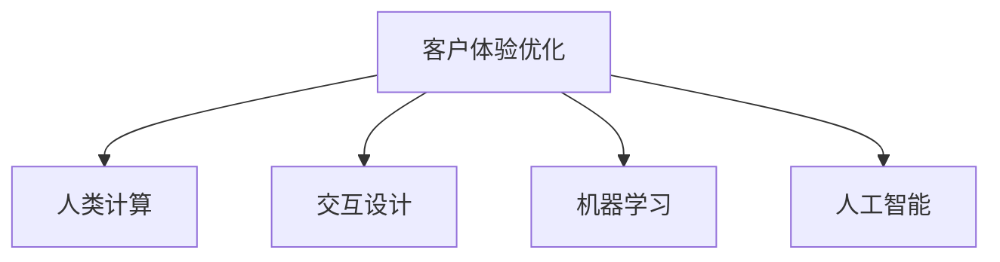

                 

## 1. 背景介绍

在当今数字化时代，企业面临的竞争环境日益激烈，客户体验已成为企业成功的关键因素之一。为了提升客户满意度，企业需要通过技术手段优化客户互动的各个环节，提升服务质量和运营效率。人类计算(Human-in-the-loop, HITL)作为一种新型的计算方式，通过将人类专家的知识和技能融入计算流程中，提升系统的智能水平和决策能力。本文将探讨人类计算在优化客户体验中的应用，分析其优势和挑战，并提出未来发展方向。

## 2. 核心概念与联系

### 2.1 核心概念概述

为了更清晰地理解人类计算在客户体验优化中的应用，我们需要先介绍几个关键概念：

- **客户体验优化**：指的是通过技术手段改进客户与企业交互的各个环节，提升客户满意度和忠诚度的过程。
- **人类计算(HITL)**：指的是在计算流程中融入人类的决策和干预，提升系统的智能水平和决策能力。
- **交互设计**：指的是设计直观、易用的用户界面，提升用户体验和满意度。
- **机器学习**：指的是通过算法让机器从数据中学习规律，自主提升决策能力。
- **人工智能**：指的是通过模拟人类的智能行为，实现自主学习、推理和决策。

这些概念之间的关系可以用以下Mermaid流程图来表示：



这个流程图展示了客户体验优化过程中各个概念之间的联系：

1. 通过交互设计提升用户体验，增强客户满意度。
2. 利用机器学习优化系统性能，提升服务质量。
3. 引入人工智能增强决策能力，优化客户体验。
4. 人类计算将人类专家的知识和技能融入计算流程中，进一步提升系统的智能水平和决策能力。

### 2.2 核心概念原理和架构

人类计算的核心原理是将人类专家的知识和技能与机器学习算法相结合，实现系统的智能决策。具体来说，人类计算包括以下几个关键步骤：

1. **数据收集**：收集客户行为数据和反馈信息。
2. **特征提取**：使用机器学习算法提取关键特征。
3. **决策辅助**：将提取出的特征输入人类专家进行辅助决策。
4. **反馈迭代**：将专家的决策结果反馈给系统，用于模型优化和迭代。
5. **自动化决策**：在多次迭代后，系统能够自主进行决策，优化客户体验。

## 3. 核心算法原理 & 具体操作步骤

### 3.1 算法原理概述

人类计算的核心算法原理是结合机器学习和人类专家的决策能力，通过反馈迭代机制不断优化系统决策。具体来说，算法流程如下：

1. **数据预处理**：将客户行为数据和反馈信息进行清洗和标准化。
2. **特征选择**：使用特征选择算法（如PCA、LDA等）提取关键特征。
3. **辅助决策**：将提取出的特征输入人类专家进行决策辅助。
4. **反馈迭代**：将专家的决策结果反馈给系统，用于模型优化和迭代。
5. **自动化决策**：在多次迭代后，系统能够自主进行决策，优化客户体验。

### 3.2 算法步骤详解

下面详细介绍人类计算的具体操作步骤：

**Step 1: 数据收集和预处理**
- 通过日志、调查问卷、在线反馈等方式收集客户行为数据和反馈信息。
- 对数据进行清洗和标准化，去除噪声和异常值。

**Step 2: 特征选择**
- 使用机器学习算法（如PCA、LDA等）对数据进行降维，提取关键特征。
- 选择合适的特征子集，剔除无关或噪声特征。

**Step 3: 辅助决策**
- 将提取出的特征输入人类专家进行决策辅助，提供推荐建议或优化方案。
- 专家根据经验和直觉，综合考虑数据和业务背景，做出决策。

**Step 4: 反馈迭代**
- 将专家的决策结果反馈给系统，用于模型优化和迭代。
- 系统根据反馈信息，重新训练模型，并调整特征提取和决策算法。

**Step 5: 自动化决策**
- 在多次迭代后，系统能够自主进行决策，优化客户体验。
- 系统可以根据最新的数据和反馈，实时调整决策策略，提升决策效果。

### 3.3 算法优缺点

人类计算具有以下优点：
1. **融合专家经验**：结合人类专家的经验和直觉，提升决策的准确性和可靠性。
2. **多层次决策**：通过多层级决策机制，提升系统的智能水平和决策能力。
3. **灵活调整**：可以根据最新的数据和反馈，实时调整决策策略，提高系统的适应性。

同时，人类计算也存在一些局限性：
1. **依赖专家知识**：依赖专家知识和经验，对专家的水平和经验要求较高。
2. **成本较高**：专家参与决策和迭代过程需要较高的成本和时间投入。
3. **易受主观影响**：专家的主观判断和偏见可能会影响决策结果的客观性。
4. **依赖数据质量**：依赖高质量的数据和特征提取算法，数据质量不佳会影响算法效果。

### 3.4 算法应用领域

人类计算在多个领域都有广泛的应用，包括但不限于：

- **客户服务**：通过结合人类专家的决策，优化客户服务流程，提升客户满意度。
- **市场营销**：通过决策辅助和反馈迭代，优化市场营销策略，提升转化率和ROI。
- **产品设计**：通过专家参与产品设计和迭代，提升产品体验和市场竞争力。
- **金融风控**：通过决策辅助和实时监控，优化风险评估和控制策略。
- **健康医疗**：通过专家参与诊断和治疗方案制定，提升医疗服务的质量和效果。

## 4. 数学模型和公式 & 详细讲解 & 举例说明

### 4.1 数学模型构建

人类计算的数学模型主要由以下几个部分组成：

1. **特征提取模型**：使用机器学习算法（如PCA、LDA等）提取关键特征。
2. **决策模型**：使用决策树、随机森林等算法进行决策辅助。
3. **反馈模型**：使用回归、分类等算法进行模型优化和迭代。

### 4.2 公式推导过程

以客户服务优化为例，推导决策模型的公式如下：

假设客户行为数据为 $X = \{x_1, x_2, \ldots, x_n\}$，反馈信息为 $Y = \{y_1, y_2, \ldots, y_n\}$，其中 $y_i \in \{0, 1\}$ 表示客户满意度（0表示不满意，1表示满意）。

1. **特征提取**：使用PCA算法对数据进行降维，提取关键特征 $Z = \{z_1, z_2, \ldots, z_n\}$。
2. **决策辅助**：将特征 $Z$ 输入决策树模型，得到客户满意度的预测值 $Z'$。
3. **反馈迭代**：将预测值 $Z'$ 与真实值 $Y$ 进行比较，得到误差 $E = Z' - Y$。
4. **模型优化**：使用回归算法对决策树模型进行优化，最小化误差 $E$。

### 4.3 案例分析与讲解

以某电商平台的客户服务优化为例，说明人类计算的应用过程：

1. **数据收集**：收集用户在电商平台上的浏览、购买、反馈等数据。
2. **特征提取**：使用PCA算法对数据进行降维，提取关键特征，如用户停留时间、购买频率等。
3. **辅助决策**：将提取出的特征输入决策树模型，得到用户满意度的预测值。
4. **反馈迭代**：将预测值与真实值进行比较，得到误差，使用回归算法对模型进行优化。
5. **自动化决策**：多次迭代后，系统能够自主进行决策，优化客户服务流程。

## 5. 项目实践：代码实例和详细解释说明

### 5.1 开发环境搭建

要进行人类计算的实践，首先需要搭建相应的开发环境。以下是使用Python进行Scikit-learn开发的流程：

1. 安装Anaconda：从官网下载并安装Anaconda，用于创建独立的Python环境。
2. 创建并激活虚拟环境：
```bash
conda create -n hitl-env python=3.8 
conda activate hitl-env
```
3. 安装Scikit-learn：
```bash
pip install scikit-learn
```

4. 安装numpy、pandas等工具包：
```bash
pip install numpy pandas matplotlib seaborn
```

完成上述步骤后，即可在`hitl-env`环境中开始人类计算的实践。

### 5.2 源代码详细实现

下面以电商客户服务优化为例，给出使用Scikit-learn进行人类计算的PyTorch代码实现。

首先，定义数据处理函数：

```python
import pandas as pd
import numpy as np
from sklearn.decomposition import PCA
from sklearn.ensemble import DecisionTreeClassifier
from sklearn.linear_model import LinearRegression

def preprocess_data(data_path):
    data = pd.read_csv(data_path)
    X = data.drop(columns=['satisfaction'])
    Y = data['satisfaction']
    return X, Y

X, Y = preprocess_data('customer_data.csv')
```

然后，定义特征提取和决策模型：

```python
X = X.values
Y = Y.values

pca = PCA(n_components=5)
X_pca = pca.fit_transform(X)

dt = DecisionTreeClassifier()
dt.fit(X_pca, Y)
```

接着，定义反馈迭代和模型优化：

```python
def feedback_iteration(X_pca, Y):
    Y_pred = dt.predict(X_pca)
    E = Y_pred - Y
    lr = LinearRegression()
    lr.fit(X_pca, E)
    return X_pca, Y_pred, E, lr

X_pca, Y_pred, E, lr = feedback_iteration(X_pca, Y)
```

最后，启动模型训练和测试：

```python
# 模型训练
X_pca = pca.fit_transform(X)
dt.fit(X_pca, Y)

# 模型测试
X_test = pca.transform(X_test)
Y_pred_test = dt.predict(X_test)
```

以上就是使用Scikit-learn进行人类计算的完整代码实现。可以看到，Scikit-learn提供了丰富的机器学习算法，使得人类计算的实现变得简单易行。

### 5.3 代码解读与分析

让我们再详细解读一下关键代码的实现细节：

**preprocess_data函数**：
- 定义数据预处理函数，从CSV文件中读取数据，并去除目标变量，返回特征矩阵和目标向量。

**PCA算法**：
- 使用PCA算法对特征矩阵进行降维，提取关键特征。

**决策树模型**：
- 定义决策树模型，对降维后的特征矩阵进行训练，得到预测模型。

**反馈迭代函数**：
- 定义反馈迭代函数，计算预测误差，使用线性回归模型对模型进行优化。

**模型训练**：
- 使用降维后的特征矩阵训练决策树模型。

**模型测试**：
- 对测试数据进行降维，使用训练好的模型进行预测，得到预测结果。

## 6. 实际应用场景

### 6.1 智能客服系统

人类计算在智能客服系统中具有广泛的应用。传统的客服系统往往依赖自动化的语音识别和文本分析，难以处理复杂多变的情况。通过引入人类计算，客服系统可以结合人类专家的知识和经验，提升系统的智能水平和决策能力。

具体来说，智能客服系统可以结合以下几个方面：

1. **语音识别与情感分析**：将语音转换为文本，使用情感分析算法对客户情绪进行识别。
2. **意图识别与推荐系统**：结合意图识别算法，为客户提供最合适的解决方案。
3. **决策支持系统**：结合决策树和专家知识库，提供决策辅助。
4. **知识图谱与推理系统**：结合知识图谱和推理系统，为客户提供更全面、准确的信息。

通过引入人类计算，智能客服系统能够更灵活、高效地处理客户问题，提升客户满意度。

### 6.2 市场营销

人类计算在市场营销中也有广泛的应用，通过结合人类专家的知识和经验，优化市场营销策略，提升转化率和ROI。

具体来说，市场营销可以结合以下几个方面：

1. **客户细分与画像**：结合聚类算法和专家知识，对客户进行细分和画像。
2. **广告投放优化**：结合回归模型和专家决策，优化广告投放策略，提升广告效果。
3. **客户生命周期管理**：结合时间序列分析和专家知识，管理客户生命周期。
4. **销售预测与库存管理**：结合预测算法和专家知识，优化销售预测和库存管理策略。

通过引入人类计算，市场营销系统能够更全面、准确地理解客户需求，提升营销效果。

### 6.3 产品设计

产品设计是企业竞争力的重要组成部分，通过结合人类计算，可以提升产品设计和迭代的速度和质量。

具体来说，产品设计可以结合以下几个方面：

1. **用户需求分析**：结合文本分析算法和专家知识，分析用户需求和痛点。
2. **产品功能设计**：结合决策树和专家知识，设计产品功能和界面。
3. **用户体验优化**：结合反馈迭代和专家知识，优化用户体验。
4. **产品迭代与改进**：结合回归模型和专家知识，迭代和改进产品设计。

通过引入人类计算，产品设计系统能够更全面、准确地理解用户需求，提升产品竞争力。

### 6.4 金融风控

金融风控是金融行业的重要环节，通过结合人类计算，可以提升风险评估和控制策略。

具体来说，金融风控可以结合以下几个方面：

1. **风险评估与预测**：结合回归模型和专家知识，评估和预测客户风险。
2. **信用评分与授信管理**：结合决策树和专家知识，管理信用评分和授信策略。
3. **反欺诈与监控**：结合聚类算法和专家知识，监控和防范欺诈行为。
4. **金融产品创新**：结合文本分析和专家知识，创新金融产品。

通过引入人类计算，金融风控系统能够更全面、准确地评估风险，提升金融安全性。

## 7. 工具和资源推荐

### 7.1 学习资源推荐

为了帮助开发者系统掌握人类计算的理论基础和实践技巧，这里推荐一些优质的学习资源：

1. 《Human-in-the-loop Machine Learning》系列博文：由人类计算技术专家撰写，深入浅出地介绍了人类计算原理、应用和实现方法。

2. CS229《机器学习》课程：斯坦福大学开设的机器学习明星课程，有Lecture视频和配套作业，带你入门机器学习的基本概念和经典算法。

3. 《Human-Computer Interaction》书籍：斯坦福大学出版的经典教材，全面介绍了人机交互的基本原理和设计方法。

4. IEEE Xplore数据库：包含大量人机交互和计算领域的经典论文，是学习人类计算的宝贵资源。

5. ACM SIGCHI论文集：包含大量人机交互和计算领域的最新研究成果，提供了丰富的理论支持。

通过对这些资源的学习实践，相信你一定能够快速掌握人类计算的精髓，并用于解决实际的商业问题。

### 7.2 开发工具推荐

高效的开发离不开优秀的工具支持。以下是几款用于人类计算开发的常用工具：

1. Python：由于其丰富的机器学习库和数据处理能力，Python是进行人类计算开发的首选语言。
2. Scikit-learn：Python的机器学习库，提供了丰富的算法和工具，支持快速原型开发和模型优化。
3. Jupyter Notebook：Python的交互式开发环境，支持数据可视化、代码执行和结果展示。
4. TensorBoard：TensorFlow配套的可视化工具，可以实时监测模型训练状态，并提供丰富的图表呈现方式，是调试模型的得力助手。
5. Weights & Biases：模型训练的实验跟踪工具，可以记录和可视化模型训练过程中的各项指标，方便对比和调优。

合理利用这些工具，可以显著提升人类计算的开发效率，加快创新迭代的步伐。

### 7.3 相关论文推荐

人类计算的研究源于学界的持续研究。以下是几篇奠基性的相关论文，推荐阅读：

1. "A Survey of Human-in-the-loop Learning" by Ien Ang and Iain Murray（2021）：全面综述了人类计算的研究现状和未来趋势。

2. "Human-in-the-Loop Machine Learning: Survey and Synthesis" by Robert R. Selbst、James Baum、Tamir Hazan（2021）：提供了人类计算的理论与应用综述，介绍了多种应用场景和方法。

3. "Human-in-the-loop Machine Learning: Challenges, Methods, and Future Directions" by Yan Li et al.（2022）：介绍了人类计算的挑战、方法和未来发展方向。

4. "Human-in-the-loop Learning for Digital Health" by Ilhan Baytas et al.（2022）：探讨了人类计算在数字健康领域的应用，提供了实用的案例和解决方案。

这些论文代表了大语言模型微调技术的发展脉络。通过学习这些前沿成果，可以帮助研究者把握学科前进方向，激发更多的创新灵感。

## 8. 总结：未来发展趋势与挑战

### 8.1 研究成果总结

本文对人类计算在客户体验优化中的应用进行了全面系统的介绍。首先阐述了人类计算的核心概念和原理，分析了其在客户体验优化中的应用优势和局限性。其次，从原理到实践，详细讲解了人类计算的数学模型和实现方法，给出了具体的应用案例。同时，本文还广泛探讨了人类计算在多个行业领域的应用前景，展示了其在商业中的巨大潜力。

### 8.2 未来发展趋势

展望未来，人类计算将呈现以下几个发展趋势：

1. **自动化程度提升**：随着技术的进步，人类计算将进一步自动化，减少人类专家的参与，提升系统的响应速度和决策效率。
2. **数据融合与融合**：人类计算将更注重跨领域数据融合，结合多源异构数据，提升系统的全面性和鲁棒性。
3. **实时性增强**：人类计算将更注重实时性，提升系统的响应速度和决策效率，满足客户即时需求。
4. **决策支持与优化**：人类计算将更注重决策支持与优化，结合专家知识和数据模型，提升决策的准确性和可靠性。
5. **隐私保护与安全**：人类计算将更注重隐私保护与安全，保护客户数据和决策过程的安全性。

### 8.3 面临的挑战

尽管人类计算已经取得了瞩目成就，但在迈向更加智能化、普适化应用的过程中，它仍面临着诸多挑战：

1. **依赖专家知识**：依赖专家知识和经验，对专家的水平和经验要求较高。
2. **成本较高**：专家参与决策和迭代过程需要较高的成本和时间投入。
3. **易受主观影响**：专家的主观判断和偏见可能会影响决策结果的客观性。
4. **依赖数据质量**：依赖高质量的数据和特征提取算法，数据质量不佳会影响算法效果。
5. **隐私保护与安全**：保护客户数据和决策过程的安全性，防止数据泄露和滥用。

### 8.4 研究展望

面对人类计算面临的种种挑战，未来的研究需要在以下几个方面寻求新的突破：

1. **自动化决策**：开发更高级的自动化决策算法，减少对人类专家的依赖。
2. **多模态融合**：结合多模态数据（如语音、图像、文本等），提升系统的全面性和鲁棒性。
3. **隐私保护**：开发隐私保护技术，保护客户数据和决策过程的安全性。
4. **实时优化**：开发实时优化算法，提升系统的响应速度和决策效率。
5. **跨领域融合**：结合跨领域数据和知识，提升系统的全面性和适应性。

这些研究方向的探索，必将引领人类计算技术迈向更高的台阶，为构建更加智能、高效、安全的商业系统提供新的动力。

## 9. 附录：常见问题与解答

**Q1：人类计算是否适用于所有商业应用？**

A: 人类计算适用于各种商业应用场景，但需要结合具体的业务背景和需求进行优化。例如，在金融风控、市场营销、客户服务等场景中，人类计算已经取得较好的应用效果。但在某些特定的应用场景中，如高科技产品设计等，可能需要结合其他技术手段进行优化。

**Q2：人类计算如何与机器学习结合？**

A: 人类计算与机器学习结合，主要通过数据收集、特征提取、辅助决策、反馈迭代等步骤进行。具体来说，人类计算将人类专家的知识和经验融入机器学习算法中，提升算法的决策能力。例如，在智能客服系统中，可以结合决策树和专家知识库，提供决策辅助。

**Q3：人类计算在多模态数据融合中的应用前景如何？**

A: 人类计算在多模态数据融合中具有广泛的应用前景。结合多模态数据，如语音、图像、文本等，可以提升系统的全面性和鲁棒性。例如，在智能安防系统中，可以结合图像和语音数据，提升异常检测和识别的准确性。

**Q4：人类计算在隐私保护与安全中的应用如何？**

A: 人类计算在隐私保护与安全中具有重要应用。通过结合数据匿名化、加密技术等方法，可以保护客户数据和决策过程的安全性。例如，在客户数据处理中，可以使用差分隐私技术保护客户隐私。

**Q5：人类计算在未来发展中的关键技术有哪些？**

A: 未来发展中，人类计算的关键技术包括自动化决策、多模态融合、隐私保护、实时优化和跨领域融合。这些技术的发展将提升系统的全面性、鲁棒性和安全性，推动人类计算技术的不断进步。

---

作者：禅与计算机程序设计艺术 / Zen and the Art of Computer Programming

