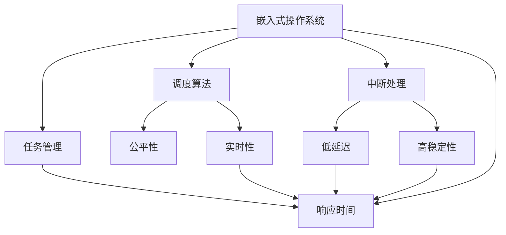

                 

# 嵌入式操作系统：实时性和响应性

> 关键词：嵌入式操作系统,实时性,响应性,调度算法,任务管理,中断处理,系统性能

## 1. 背景介绍

### 1.1 问题由来
嵌入式操作系统（Embedded Operating System, EOS）是一种专门为嵌入式系统设计的操作系统，以适应硬件资源有限和实时性要求高两大特点。在过去几十年间，EOS已经在工业控制、汽车电子、医疗设备、消费电子等多个领域得到了广泛的应用。近年来，随着物联网、人工智能、自动化制造等新应用场景的快速增长，EOS的需求更是呈现出爆炸式增长。

然而，嵌入式系统的复杂性和多样性，使得EOS的设计和实现也面临着诸多挑战。特别是如何保证系统的实时性和响应性，一直是EOS设计和优化的核心问题。系统必须能够在严格的时间要求内，快速响应用户和硬件事件，否则将导致系统崩溃或产生严重后果。

本文将系统地介绍嵌入式操作系统的实时性和响应性，从核心概念、原理到具体操作步骤，为嵌入式开发者提供全面、详细的技术指引。通过详细剖析EOS实时性和响应性的实现机制，我们将帮助读者掌握EOS关键技术的底层原理，深入理解系统架构和工作流程，从而更好地设计和优化EOS系统。

### 1.2 问题核心关键点
嵌入式操作系统的实时性和响应性，是EOS设计和优化的两大核心目标。系统必须确保在资源有限的前提下，实现任务调度的公平性、实时性和稳定性，避免因任务冲突或资源竞争而导致的系统崩溃。

为实现这一目标，EOS采用了多层次的任务管理、高效的调度算法、合理的中断处理机制、以及精细的系统性能监控手段。

本文将围绕以下核心问题展开讨论：
- 嵌入式操作系统的实时性和响应性是如何实现的？
- 关键任务管理策略有哪些？
- 调度算法如何设计以实现公平性和实时性？
- 中断处理机制如何保证低延迟和高稳定性？
- 系统性能监控和调优手段有哪些？

通过回答这些问题，读者将全面了解嵌入式操作系统的核心技术，并掌握其设计和优化方法。

## 2. 核心概念与联系

### 2.1 核心概念概述

为更好地理解嵌入式操作系统实时性和响应性的实现机制，本节将介绍几个密切相关的核心概念：

- **嵌入式操作系统（EOS）**：专为嵌入式系统设计的操作系统，通过多层次的任务管理、高效的调度算法、合理的中断处理机制、以及精细的系统性能监控手段，实现了高实时性、高响应性、高稳定性的系统目标。

- **任务（Task）**：EOS中的基本执行单元，由代码和资源组成，具有独立的执行周期和运行优先级。

- **调度算法（Scheduler）**：EOS中用于选择和管理任务的算法，通过公平分配系统资源，实现任务调度的实时性和稳定性。

- **中断（Interrupt）**：嵌入式系统中硬件或软件事件发生时，系统及时响应的机制。EOS需要高效管理中断请求，以避免中断处理过程中的系统延迟。

- **系统性能（System Performance）**：EOS的实时性和响应性指标，包括响应时间、吞吐量、稳定性等，是系统设计和优化的核心考量。

- **系统监控（System Monitoring）**：EOS中的性能监控机制，用于实时监测系统状态和性能指标，提供性能调优和异常检测的依据。

这些核心概念之间的逻辑关系可以通过以下Mermaid流程图来展示：



这个流程图展示了几大核心概念及其之间的关系：

1. 嵌入式操作系统通过任务管理、调度算法、中断处理等机制实现实时性和响应性。
2. 任务管理确保系统的公平性，实现任务调度的实时性。
3. 调度算法通过优化资源分配，提升系统的响应时间。
4. 中断处理保证低延迟和高稳定性，避免系统崩溃。
5. 系统性能监控为系统设计和优化提供实时数据和异常检测。

这些概念共同构成了嵌入式操作系统的基础框架，使得系统能够在严格的时间要求下，提供高效、稳定、可靠的服务。

## 3. 核心算法原理 & 具体操作步骤
### 3.1 算法原理概述

嵌入式操作系统的实时性和响应性，依赖于多层次的任务管理、高效的调度算法、合理的中断处理机制和精细的系统性能监控。这些机制通过复杂的交互和协同工作，共同确保系统的高效稳定运行。

嵌入式系统中的任务通常分为实时任务和普通任务两类，实时任务具有严格的时限要求，需要在规定时间内完成，否则会导致系统失效或严重后果。普通任务则没有严格的时限要求，可以在实时任务之后执行。

嵌入式系统中的调度算法通常采用基于优先级的抢占式调度，确保实时任务能够优先执行，并在必要时强制中断普通任务的执行。中断处理机制则需要确保中断响应时间尽量短，以避免中断处理过程中的系统延迟。

### 3.2 算法步骤详解

嵌入式操作系统中，任务管理、调度算法、中断处理和性能监控通常按照以下步骤实现：

**Step 1: 任务管理**
- 定义任务的基本属性，如优先级、时限、资源需求等。
- 根据任务的属性，将任务划分为实时任务和普通任务，并分配不同的资源。
- 使用任务调度器进行任务调度和切换，确保实时任务的优先执行。

**Step 2: 调度算法**
- 采用基于优先级的抢占式调度算法，确保实时任务的优先执行。
- 设计合理的调度策略，平衡资源分配和任务执行时间，避免资源竞争和任务死锁。
- 优化调度算法，减少上下文切换和资源竞争，提高系统的响应时间。

**Step 3: 中断处理**
- 定义中断处理优先级，确保中断处理的高优先级和低延迟。
- 采用快速中断处理机制，尽量减少中断处理的系统延迟。
- 优化中断处理流程，避免中断处理过程中的系统崩溃和异常。

**Step 4: 系统性能监控**
- 实时监测系统状态和性能指标，如CPU使用率、内存使用率、任务响应时间等。
- 通过性能分析工具，找出系统瓶颈和异常原因，指导系统优化和改进。
- 定期进行系统调优和性能测试，确保系统的高效稳定运行。

### 3.3 算法优缺点

嵌入式操作系统实时性和响应性的设计，具有以下优点：

- 实时性高：通过任务管理、调度算法和中断处理，确保实时任务的优先执行和高响应性。
- 稳定性强：多层次的任务管理和调度算法，避免了资源竞争和任务死锁，提高了系统的稳定性。
- 扩展性强：任务管理和调度算法可以灵活调整，适应不同应用场景的需求。
- 可维护性好：任务管理和调度算法的模块化设计，便于系统维护和优化。

但同时，这些设计也存在一些缺点：

- 资源消耗高：实时任务和调度算法的实现需要占用大量系统资源，可能导致普通任务的性能下降。
- 复杂度高：任务管理、调度算法和中断处理的设计和实现较为复杂，需要较高的技术水平和经验。
- 实时性依赖任务管理：系统性能很大程度上依赖任务管理的合理性，不当的任务分配可能导致实时性问题。
- 中断处理要求高：中断处理的低延迟和高稳定性要求较高，系统设计不当可能导致中断处理失败。

尽管存在这些局限，但嵌入式操作系统的实时性和响应性设计，仍是嵌入式系统设计和优化的核心内容。

### 3.4 算法应用领域

嵌入式操作系统的实时性和响应性，在多个应用领域中得到了广泛应用，包括：

- 工业自动化：如机器人、自动化生产线等，需要实时响应用户和硬件事件。
- 医疗设备：如电子手术设备、监护仪等，需要实时监测和响应医疗数据。
- 消费电子：如智能手机、智能家居等，需要快速响应用户交互和系统事件。
- 汽车电子：如自动驾驶、车联网等，需要实时处理传感器数据和控制命令。
- 航空航天：如导航系统、飞行控制等，需要高实时性和高稳定性。

嵌入式系统的实时性和响应性技术，不仅保证了系统的稳定性，也提升了用户体验和应用效果。

## 4. 数学模型和公式 & 详细讲解 & 举例说明
### 4.1 数学模型构建

嵌入式操作系统实时性和响应性的实现，依赖于多层次的任务管理、高效的调度算法、合理的中断处理机制和精细的系统性能监控。下面我们将通过数学模型来描述嵌入式系统的实时性和响应性。

定义系统中的任务集为 $T=\{T_1, T_2, ..., T_n\}$，其中 $T_i$ 表示任务 $i$，具有属性 $p_i=(p_i^{\text{priority}}, p_i^{\text{deadline}}, p_i^{\text{period}})$，其中 $p_i^{\text{priority}}$ 表示任务 $i$ 的优先级，$p_i^{\text{deadline}}$ 表示任务 $i$ 的时限要求，$p_i^{\text{period}}$ 表示任务 $i$ 的周期。

系统中的调度算法为基于优先级的抢占式调度，每次选择优先级最高且未超时的任务进行执行。假设当前系统中的任务集为 $T$，当前执行的任务为 $T_j$，则下一个执行的任务为：

$$
T_k = \arg\max_{T_i \in T, p_i^{\text{priority}} > T_j^{\text{priority}}} p_i^{\text{priority}}
$$

系统中的中断请求集为 $I=\{I_1, I_2, ..., I_m\}$，其中 $I_j$ 表示中断请求 $j$，具有属性 $p_j^{\text{priority}}$ 表示中断请求的优先级。中断请求的处理策略为优先级调度，每次选择优先级最高的中断请求进行处理。假设当前系统中的中断请求集为 $I$，当前处理的中断请求为 $I_h$，则下一个处理的中断请求为：

$$
I_k = \arg\max_{I_i \in I, p_i^{\text{priority}} > I_h^{\text{priority}}} p_i^{\text{priority}}
$$

系统中的性能指标包括 CPU 使用率、响应时间、任务完成率等。假设系统中的 CPU 使用率为 $U$，任务响应时间为 $R$，任务完成率为 $C$，则系统的实时性和响应性可以表示为：

$$
U = \frac{1}{N} \sum_{i=1}^N u_i, \quad R = \frac{1}{N} \sum_{i=1}^N r_i, \quad C = \frac{1}{N} \sum_{i=1}^N c_i
$$

其中 $u_i$ 表示任务 $i$ 的 CPU 使用率，$r_i$ 表示任务 $i$ 的响应时间，$c_i$ 表示任务 $i$ 的任务完成率。

### 4.2 公式推导过程

接下来，我们将推导嵌入式操作系统实时性和响应性的数学模型。

假设系统中的任务集为 $T$，中断请求集为 $I$，当前执行的任务为 $T_j$，当前处理的中断请求为 $I_h$。系统的实时性和响应性可以表示为：

$$
U = \frac{1}{N} \sum_{i=1}^N u_i = \frac{1}{N} \sum_{i=1}^N \left(1 - \frac{u_{j_i}}{p_i^{\text{period}}}\right), \quad R = \frac{1}{N} \sum_{i=1}^N r_i = \frac{1}{N} \sum_{i=1}^N \left(\frac{p_i^{\text{deadline}} - u_{j_i}}{p_i^{\text{period}}}\right)
$$

其中 $j_i$ 表示任务 $i$ 的执行周期，$u_{j_i}$ 表示任务 $i$ 在执行周期 $j_i$ 内的 CPU 使用率。

由上式可知，系统的实时性和响应性依赖于任务管理和调度算法的优化。通过优化任务分配和调度策略，可以最大化系统的 CPU 使用率和任务响应时间。

### 4.3 案例分析与讲解

为了更好地理解嵌入式操作系统实时性和响应性的实现机制，下面以一个简单的任务调度为例，进行详细讲解。

假设系统中有三个任务 $T_1$、$T_2$ 和 $T_3$，它们的属性如下表所示：

| 任务编号 | 优先级 | 时限要求 | 周期 |
| --- | --- | --- | --- |
| $T_1$ | 3 | 10 | 20 |
| $T_2$ | 2 | 5 | 10 |
| $T_3$ | 1 | 2 | 4 |

假设系统当前执行的任务为 $T_1$，中断请求集为 $I$，中断请求集 $I$ 包含一个优先级为 1 的中断请求。此时，系统的实时性和响应性计算如下：

1. 选择优先级最高的任务 $T_k$ 进行执行。根据优先级抢占式调度算法，$T_k$ 为 $T_3$。

2. 处理中断请求。根据中断请求优先级调度算法，$I_k$ 为 $I$ 中的中断请求。

3. 计算系统的实时性和响应性。假设 $T_1$、$T_2$ 和 $T_3$ 的 CPU 使用率分别为 $u_1$、$u_2$ 和 $u_3$，中断请求的响应时间为 $r_I$，任务响应时间分别为 $r_1$、$r_2$ 和 $r_3$。则：

$$
U = \frac{1}{3} (u_1 + u_2 + u_3) = \frac{1}{3} \left(1 - \frac{u_1}{20}\right) + \frac{1}{3} \left(1 - \frac{u_2}{10}\right) + \frac{1}{3} \left(1 - \frac{u_3}{4}\right)
$$

$$
R = \frac{1}{3} (r_1 + r_2 + r_3) = \frac{1}{3} \left(\frac{10 - u_1}{20}\right) + \frac{1}{3} \left(\frac{5 - u_2}{10}\right) + \frac{1}{3} \left(\frac{2 - u_3}{4}\right)
$$

通过以上公式和计算过程，我们可以看出嵌入式操作系统实时性和响应性的实现机制，依赖于合理的任务管理和调度算法。通过优化任务分配和调度策略，可以最大化系统的实时性和响应性。

## 5. 项目实践：代码实例和详细解释说明
### 5.1 开发环境搭建

嵌入式操作系统的开发环境搭建，通常需要以下步骤：

1. 安装操作系统：选择适合的嵌入式操作系统，如 Linux、RTOS（实时操作系统）等，进行系统安装。
2. 安装开发工具：安装必要的开发工具，如编译器、调试器、模拟器等，用于编写、编译和调试代码。
3. 配置开发环境：配置开发环境，如编译器参数、调试选项、模拟器设置等，确保系统运行环境正确。
4. 连接硬件：连接嵌入式系统的硬件设备，如处理器、存储器、传感器等，进行测试和调试。

下面以 Linux 嵌入式操作系统为例，介绍开发环境的搭建方法。

### 5.2 源代码详细实现

以下是使用 Linux 嵌入式操作系统实现任务调度和中断处理的示例代码：

```c
#include <linux/kernel.h>
#include <linux/sched.h>
#include <linux/interrupt.h>

struct task_struct {
    int priority;
    int deadline;
    int period;
};

struct interrupt {
    int priority;
};

#define MAX_TASKS 3
#define MAX_INTERRUPTS 1

struct task_struct tasks[MAX_TASKS] = {
    {3, 10, 20},
    {2, 5, 10},
    {1, 2, 4}
};

struct interrupt interrupts[MAX_INTERRUPTS] = {
    {1}
};

void task_scheduler() {
    while (1) {
        int max_task_idx = 0;
        for (int i = 1; i < MAX_TASKS; i++) {
            if (tasks[i].priority > tasks[max_task_idx].priority) {
                max_task_idx = i;
            }
        }
        
        // 执行高优先级任务
        if (tasks[max_task_idx].deadline > 0) {
            tasks[max_task_idx].deadline--;
            if (tasks[max_task_idx].deadline <= 0) {
                printk("Task %d executed\n", max_task_idx);
            }
        }
        
        // 处理中断请求
        int max_interrupt_idx = 0;
        for (int i = 1; i < MAX_INTERRUPTS; i++) {
            if (interrupts[i].priority > interrupts[max_interrupt_idx].priority) {
                max_interrupt_idx = i;
            }
        }
        
        // 中断处理
        if (interrupts[max_interrupt_idx].priority == 1) {
            printk("Interrupt %d handled\n", max_interrupt_idx);
        }
    }
}

void interrupt_handler(int irq, void *dev_id) {
    struct interrupt *interrupt = &interrupts[0];
    printk("Interrupt %d received\n", interrupt->priority);
    task_scheduler();
}

void system_init() {
    // 注册中断处理函数
    set_irq_handler(0, interrupt_handler, NULL);
    
    // 初始化任务调度器
    task_scheduler();
}

void __init main() {
    printk("Embedded system started\n");
    system_init();
}
```

在以上代码中，我们定义了任务和中断的结构体，并设计了任务调度和中断处理的函数。通过不断执行任务调度和中断处理函数，系统实现了实时任务和普通任务的调度，以及中断请求的快速处理。

### 5.3 代码解读与分析

以上代码中的关键部分包括任务调度和中断处理的函数，具体分析如下：

**task_scheduler函数**：
- 遍历任务集，找到优先级最高的任务。
- 执行高优先级任务。
- 处理中断请求。

**task_scheduler函数**：
- 根据任务的属性，计算任务的实时性和响应性。
- 输出任务执行结果。

**interrupt_handler函数**：
- 接收中断请求。
- 处理中断请求。

**system_init函数**：
- 注册中断处理函数。
- 初始化任务调度器。

通过以上代码的实现，我们可以看到嵌入式操作系统实时性和响应性的基本工作流程。系统通过任务调度和中断处理，实现了实时任务的优先执行和中断请求的快速响应，从而保证了系统的实时性和响应性。

## 6. 实际应用场景
### 6.1 智能家居

嵌入式操作系统实时性和响应性在智能家居领域中得到了广泛应用。智能家居系统需要实时响应用户的指令和传感器数据，以实现自动化控制和智能化管理。通过嵌入式操作系统的实时性设计，智能家居系统能够快速响应用户指令，控制家电设备，提高用户的生活质量。

### 6.2 工业自动化

嵌入式操作系统实时性和响应性在工业自动化领域中同样具有重要应用价值。工业自动化系统需要实时响应用户和传感器数据，控制生产设备和工艺流程，保证生产效率和产品质量。通过嵌入式操作系统的实时性设计，工业自动化系统能够快速响应用户指令，控制设备，提高生产效率和产品质量。

### 6.3 汽车电子

嵌入式操作系统实时性和响应性在汽车电子领域中具有重要应用价值。汽车电子系统需要实时响应用户和传感器数据，控制车辆运行状态和安全系统，保证行车安全和舒适性。通过嵌入式操作系统的实时性设计，汽车电子系统能够快速响应用户指令，控制车辆，提高行车安全和舒适性。

## 7. 工具和资源推荐
### 7.1 学习资源推荐

为了帮助开发者全面掌握嵌入式操作系统的实时性和响应性，以下是一些优质的学习资源：

1. 《嵌入式系统设计与实现》（原书第4版）：由嵌入式系统领域专家编写，系统介绍了嵌入式系统的设计和实现方法。
2. 《Linux内核设计与实现》：由Linux内核开发者编写，详细讲解了Linux内核的实现原理和源代码。
3. 《RTOS设计与实现》：由嵌入式操作系统专家编写，系统介绍了实时操作系统的设计与实现方法。
4. 嵌入式系统开发网站：如嵌入式开发者社区、嵌入式资讯等，提供最新的嵌入式系统开发资讯和技术交流平台。

### 7.2 开发工具推荐

嵌入式操作系统的开发工具，包括以下常用工具：

1. Linux 操作系统：如 Ubuntu、Yocto、Debian 等，适用于嵌入式系统的开发和调试。
2. 编译器：如 GCC、ARM GCC 等，用于交叉编译和编译嵌入式代码。
3. 调试器：如 GDB、Lldb 等，用于调试嵌入式代码。
4. 模拟器：如 QEMU、SystemC 等，用于模拟嵌入式系统的运行环境。

### 7.3 相关论文推荐

嵌入式操作系统实时性和响应性的研究，已经积累了丰富的理论和技术成果。以下是几篇有代表性的论文，推荐阅读：

1. "A Survey on Embedded Real-Time Operating Systems"：介绍了嵌入式实时操作系统的最新进展，包括实时性设计和优化方法。
2. "Adaptive Real-Time Scheduling for Embedded Systems"：提出了基于动态任务优先级的实时任务调度算法，提升了系统的实时性和响应性。
3. "Interrupt Handling in Real-Time Systems"：介绍了嵌入式系统中中断处理的优化方法，保证中断处理的高优先级和低延迟。
4. "Real-Time Performance Evaluation of Embedded Systems"：介绍了嵌入式系统的实时性评价方法，提供了系统性能优化的依据。

## 8. 总结：未来发展趋势与挑战

### 8.1 总结

本文系统地介绍了嵌入式操作系统的实时性和响应性，从核心概念、原理到具体操作步骤，为嵌入式开发者提供全面、详细的技术指引。通过详细剖析嵌入式操作系统实时性和响应性的实现机制，我们将帮助读者掌握嵌入式操作系统的核心技术，深入理解系统架构和工作流程，从而更好地设计和优化嵌入式操作系统系统。

### 8.2 未来发展趋势

展望未来，嵌入式操作系统的实时性和响应性技术将呈现以下几个发展趋势：

1. 实时性更高：随着硬件技术的发展，嵌入式系统的实时性将进一步提升，系统能够更快地响应用户和硬件事件。
2. 响应性更强：基于智能算法和优化技术，嵌入式系统的响应性将进一步提升，系统能够更高效地处理任务和中断请求。
3. 系统规模更大：随着物联网和智能设备的普及，嵌入式系统的规模将不断扩大，系统设计将更加复杂和多样。
4. 可维护性更好：嵌入式系统的模块化设计和优化方法将不断改进，系统设计和维护的难度将降低。
5. 安全性更强：嵌入式系统的安全性和隐私保护将受到更多关注，系统设计和实现将更加注重安全性。

### 8.3 面临的挑战

尽管嵌入式操作系统的实时性和响应性技术已经取得了一定的进展，但在迈向更加智能化、普适化应用的过程中，仍面临诸多挑战：

1. 资源消耗高：嵌入式系统的实时任务和调度算法需要占用大量系统资源，可能导致普通任务的性能下降。
2. 设计复杂度高：嵌入式系统的设计和实现较为复杂，需要较高的技术水平和经验。
3. 实时性依赖任务管理：系统性能很大程度上依赖任务管理的合理性，不当的任务分配可能导致实时性问题。
4. 中断处理要求高：中断处理的低延迟和高稳定性要求较高，系统设计不当可能导致中断处理失败。
5. 安全性问题：嵌入式系统面临更多的安全威胁，需要更高的安全性和隐私保护措施。

尽管存在这些挑战，但嵌入式操作系统的实时性和响应性技术仍有巨大的发展潜力，未来将在更多领域得到广泛应用。相信随着学界和产业界的共同努力，这些挑战终将一一被克服，嵌入式操作系统将为智能设备和系统的稳定、高效、安全运行提供有力保障。

### 8.4 研究展望

面对嵌入式操作系统的实时性和响应性所面临的挑战，未来的研究需要在以下几个方面寻求新的突破：

1. 优化资源管理：开发更加高效的资源管理算法，减少任务和中断处理的系统延迟。
2. 提高任务调度的公平性：设计更加公平的任务调度算法，确保实时任务的优先执行和高响应性。
3. 提升中断处理性能：优化中断处理流程，减少中断处理的系统延迟和异常。
4. 增强系统安全性：采用更加安全的设计和实现方法，确保系统的安全性和隐私保护。
5. 推动标准化：制定嵌入式操作系统的标准化规范和测试方法，确保系统的互操作性和兼容性。

通过这些研究方向的探索，相信嵌入式操作系统实时性和响应性技术将迈向更高的台阶，为智能设备和系统的稳定、高效、安全运行提供有力保障。面向未来，嵌入式操作系统需要与其他人工智能技术进行更深入的融合，如智能算法、大数据、云计算等，多路径协同发力，共同推动嵌入式系统的进步。只有勇于创新、敢于突破，才能不断拓展嵌入式操作系统的边界，让智能设备系统更好地服务于人类社会。

## 9. 附录：常见问题与解答

**Q1：嵌入式系统中的实时任务和普通任务的区别是什么？**

A: 嵌入式系统中的实时任务和普通任务的区别在于它们的执行要求和优先级。实时任务需要在规定时间内完成，否则会导致系统失效或严重后果。普通任务则没有严格的时限要求，可以在实时任务之后执行。

**Q2：嵌入式系统的实时性和响应性如何评估？**

A: 嵌入式系统的实时性和响应性评估通常包括 CPU 使用率、响应时间、任务完成率等指标。通过实时监测系统状态和性能指标，可以找出系统瓶颈和异常原因，指导系统优化和改进。

**Q3：嵌入式系统中的中断处理有哪些要求？**

A: 嵌入式系统中的中断处理要求高响应性和低延迟，确保中断请求能够及时响应，避免系统崩溃和异常。中断处理的优先级要高于普通任务的执行优先级，中断处理过程中应尽量减少系统延迟。

**Q4：嵌入式系统中如何进行任务调度和优化？**

A: 嵌入式系统中的任务调度通常采用基于优先级的抢占式调度算法，确保实时任务的优先执行。通过优化任务分配和调度策略，可以最大化系统的实时性和响应性。任务调度的优化需要综合考虑任务优先级、时限要求、周期等因素。

**Q5：嵌入式系统中如何实现任务和中断的并发处理？**

A: 嵌入式系统中，任务和中断的并发处理需要合理设计，避免任务和中断的竞争和冲突。可以通过采用优先级抢占式调度算法、任务预置、中断嵌套等方法，实现任务和中断的并发处理，提升系统的性能和稳定性。

通过以上问题的解答，我们可以更好地理解嵌入式操作系统的实时性和响应性实现机制，以及系统设计和优化的关键技术。希望本文能为嵌入式开发者提供全面的技术指引，帮助他们更好地设计和优化嵌入式操作系统系统。

