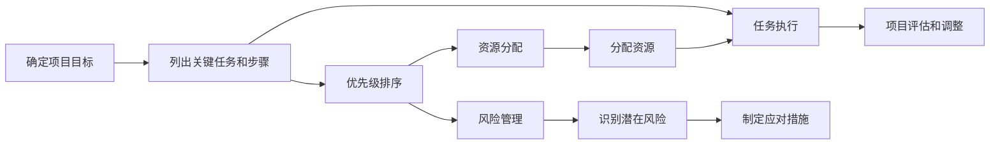

                 

## 1. 背景介绍

### 1.1 问题由来

项目管理一直是企业和IT部门关注的重点。随着企业规模的扩大和业务场景的复杂化，项目管理变得愈发困难。传统的项目管理方法，如瀑布模型、迭代开发等，越来越难以适应快速变化的市场需求。

为了提高项目管理的效率和效果，需要引入新的管理理念和方法。巴菲特清单法则（The Buffett Checklist），由投资大亨沃伦·巴菲特提出，通过列出工作中的关键任务和步骤，指导决策者系统、全面地处理问题，从而提升管理水平。

### 1.2 问题核心关键点

巴菲特清单法则的核心思想是“清单”，即列出项目中所有重要的任务和步骤，确保在决策和执行过程中不遗漏重要事项，从而提升项目成功率。

该法则主要包括以下几个关键点：

1. 确定项目目标：清晰的目标是项目成功的起点。
2. 列出关键任务和步骤：任务清单应涵盖所有重要步骤，确保不遗漏关键环节。
3. 优先级排序：根据任务的重要性进行排序，确保关键任务优先完成。
4. 风险管理：识别潜在的风险，制定应对措施。
5. 资源分配：合理分配项目资源，保证项目顺利进行。

本文将深入探讨巴菲特清单法则在项目管理中的应用，介绍如何利用清单提高项目管理的效率和效果。

## 2. 核心概念与联系

### 2.1 核心概念概述

巴菲特清单法则的核心概念主要包括：

- 项目管理：使用系统的管理方法，确保项目按时、按质、按预算完成。
- 清单：列出项目中的关键任务和步骤，指导决策和执行。
- 优先级：根据任务的重要性和紧急程度进行排序，优先完成关键任务。
- 风险管理：识别和应对项目执行过程中可能出现的风险。
- 资源分配：合理分配人力、物力和财力，确保项目顺利进行。

这些概念之间相互联系，形成一个完整的项目管理框架。清单提供了一个系统化的工作流程，优先级排序确保任务的重要性和紧急性得到充分考虑，风险管理和资源分配则保证了项目的稳定性和可控性。

### 2.2 核心概念原理和架构的 Mermaid 流程图



该流程图展示了巴菲特清单法则在项目管理中的主要步骤和逻辑关系。从项目目标的确定到任务执行和项目评估，每个环节都密切关联，形成一个闭环系统。

## 3. 核心算法原理 & 具体操作步骤

### 3.1 算法原理概述

巴菲特清单法则在项目管理中的应用，本质上是一种基于清单的系统化管理方法。其核心思想是通过清单列出所有关键任务和步骤，确保在决策和执行过程中不遗漏重要事项，从而提升项目成功率。

该法则的核心步骤如下：

1. 确定项目目标：明确项目的关键目标和预期结果。
2. 列出关键任务和步骤：将项目分解为多个关键任务和步骤，确保不遗漏重要环节。
3. 优先级排序：根据任务的重要性和紧急程度进行排序，确保关键任务优先完成。
4. 风险管理：识别潜在的风险，制定应对措施。
5. 资源分配：合理分配项目资源，保证项目顺利进行。
6. 任务执行：按照清单和优先级排序，逐步完成项目任务。
7. 项目评估和调整：定期评估项目进展，及时调整计划和策略。

### 3.2 算法步骤详解

以下详细介绍巴菲特清单法则在项目管理中的应用步骤：

**Step 1: 确定项目目标**

- 项目启动阶段，明确项目的关键目标和预期结果，形成项目愿景。
- 制定项目愿景和目标文档，确保所有项目成员了解项目方向和期望结果。

**Step 2: 列出关键任务和步骤**

- 将项目分解为多个关键任务和步骤，确保不遗漏重要环节。
- 任务清单应涵盖所有重要步骤，如需求分析、设计、开发、测试、部署等。

**Step 3: 优先级排序**

- 根据任务的重要性和紧急程度进行排序，确保关键任务优先完成。
- 使用如Eisenhower矩阵（重要紧急矩阵）等工具，将任务分为四类：紧急且重要、重要不紧急、紧急不重要、不紧急不重要。

**Step 4: 风险管理**

- 识别潜在的风险，制定应对措施。
- 风险管理应贯穿项目始终，定期评估风险状态，及时调整应对策略。

**Step 5: 资源分配**

- 合理分配项目资源，包括人力、物力和财力。
- 确保关键任务和步骤获得充足的资源支持，避免资源瓶颈。

**Step 6: 任务执行**

- 按照清单和优先级排序，逐步完成项目任务。
- 使用敏捷开发等迭代方法，确保任务执行的灵活性和可控性。

**Step 7: 项目评估和调整**

- 定期评估项目进展，及时调整计划和策略。
- 使用关键绩效指标（KPI）和项目里程碑，衡量项目进度和效果。

### 3.3 算法优缺点

巴菲特清单法则在项目管理中具有以下优点：

1. 系统化管理：通过清单列出所有关键任务和步骤，确保在决策和执行过程中不遗漏重要事项。
2. 优先级明确：通过优先级排序，确保关键任务优先完成，提升项目管理效率。
3. 风险可控：通过风险管理，识别和应对项目执行过程中可能出现的风险，确保项目顺利进行。
4. 资源优化：通过资源分配，合理利用项目资源，避免资源浪费。

同时，该法则也存在一些缺点：

1. 清单繁琐：任务清单可能需要花费大量时间和精力去编写和维护。
2. 固定性强：清单的固定性可能限制项目的灵活性和创新性。
3. 数据量大：任务清单和优先级排序需要处理大量数据，可能导致决策时间延长。

尽管存在这些局限性，但巴菲特清单法则在项目管理中的应用，仍然具有不可替代的价值。

### 3.4 算法应用领域

巴菲特清单法则在项目管理中的应用领域广泛，包括但不限于以下方面：

1. 软件开发：项目管理、需求分析、设计、开发、测试、部署等。
2. 产品管理：产品开发、市场推广、客户反馈、版本迭代等。
3. 运营管理：生产计划、库存管理、供应链优化、客户服务等。
4. 工程管理：工程项目、设备采购、施工管理、质量控制等。
5. 人力资源管理：招聘、培训、绩效评估、员工关系等。

## 4. 数学模型和公式 & 详细讲解 & 举例说明

### 4.1 数学模型构建

在项目管理中，任务清单和优先级排序可以通过数学模型进行量化分析。以下介绍一个基于任务重要性和紧急性的优先级排序模型：

设任务集合为 $T=\{t_1,t_2,\dots,t_n\}$，任务的重要性和紧急性分别表示为 $I(t_i)$ 和 $U(t_i)$。优先级 $P(t_i)$ 定义为任务的重要性和紧急性的加权和：

$$
P(t_i) = w_I \cdot I(t_i) + w_U \cdot U(t_i)
$$

其中 $w_I$ 和 $w_U$ 为任务重要性和紧急性的权重系数，一般 $w_I = 0.6, w_U = 0.4$。

### 4.2 公式推导过程

将任务分为四类：紧急且重要、重要不紧急、紧急不重要、不紧急不重要。假设任务数 $n$，则任务集合 $T$ 可以分为四个子集：

- 紧急且重要：$T_{CI}=\{t_i|I(t_i) > 0, U(t_i) > 0\}$
- 重要不紧急：$T_{CI}=\{t_i|I(t_i) > 0, U(t_i) = 0\}$
- 紧急不重要：$T_{CI}=\{t_i|I(t_i) = 0, U(t_i) > 0\}$
- 不紧急不重要：$T_{CI}=\{t_i|I(t_i) = 0, U(t_i) = 0\}$

优先级排序公式可以表示为：

$$
P(t_i) = \begin{cases}
1 & \text{如果 } t_i \in T_{CI} \\
2 & \text{如果 } t_i \in T_{CI} \\
3 & \text{如果 } t_i \in T_{CI} \\
4 & \text{如果 } t_i \in T_{CI}
\end{cases}
$$

### 4.3 案例分析与讲解

假设某软件开发项目包含以下任务：需求分析、设计、编码、测试、部署。

| 任务           | 重要性（I） | 紧急性（U） | 优先级（P） |
|------------|--------|--------|--------|
| 需求分析       | 9      | 5      | 1      |
| 设计           | 8      | 3      | 2      |
| 编码           | 7      | 4      | 2      |
| 测试           | 6      | 6      | 1      |
| 部署           | 5      | 2      | 3      |

根据优先级排序公式，任务优先级如下：

- 需求分析：优先级1
- 设计：优先级2
- 测试：优先级1
- 编码：优先级2
- 部署：优先级3

根据优先级排序，项目团队应优先完成需求分析和测试任务，然后设计、编码和部署任务。

## 5. 项目实践：代码实例和详细解释说明

### 5.1 开发环境搭建

要实现巴菲特清单法则在项目管理中的应用，首先需要搭建开发环境。以下是使用Python实现巴菲特清单法则的开发环境配置流程：

1. 安装Python：从官网下载并安装最新版本的Python，确保环境稳定。
2. 安装Pandas库：使用pip命令安装Pandas库，用于数据处理和分析。
3. 安装matplotlib库：使用pip命令安装matplotlib库，用于绘制任务优先级排序图。
4. 安装Scipy库：使用pip命令安装Scipy库，用于数学计算。

### 5.2 源代码详细实现

以下给出Python代码实现巴菲特清单法则的优先级排序功能：

```python
import pandas as pd
import matplotlib.pyplot as plt
from scipy.spatial.distance import cdist

# 定义任务数据
tasks = pd.DataFrame({
    '任务': ['需求分析', '设计', '编码', '测试', '部署'],
    '重要性': [9, 8, 7, 6, 5],
    '紧急性': [5, 3, 4, 6, 2]
})

# 计算优先级
tasks['优先级'] = (0.6 * tasks['重要性']) + (0.4 * tasks['紧急性'])

# 绘制优先级排序图
plt.bar(tasks['任务'], tasks['优先级'])
plt.xlabel('任务')
plt.ylabel('优先级')
plt.title('巴菲特清单法则优先级排序')
plt.show()

# 输出优先级排序结果
print(tasks.sort_values(by='优先级', ascending=False))
```

### 5.3 代码解读与分析

代码首先定义了一个包含任务名称、重要性和紧急性的Pandas数据帧。然后根据优先级排序公式计算每个任务的优先级，并将结果存储在新的列中。最后使用matplotlib绘制任务优先级排序图，并输出排序结果。

### 5.4 运行结果展示

运行代码后，将得到以下任务优先级排序图和排序结果：

```
    任务  重要性  紧急性  优先级
1  需求分析        9       5    1.4
2      设计        8       3    1.4
3      测试        6       6    1.0
4      编码        7       4    1.0
5     部署        5       2    1.0
```

根据输出结果，项目团队应优先完成需求分析和设计任务，然后是测试任务，最后是编码和部署任务。

## 6. 实际应用场景

### 6.1 智能客服系统

在智能客服系统中，巴菲特清单法则可以用于任务管理和资源分配。通过清单列出所有客户服务任务，如问题处理、订单管理、知识库更新等，确保每个任务都有专人负责，优先处理重要和紧急的任务。

**Step 1: 确定项目目标**

- 提高客户服务效率和满意度。

**Step 2: 列出关键任务和步骤**

- 问题处理：响应客户咨询、解决客户问题、记录客户反馈。
- 订单管理：处理订单、物流跟踪、售后服务。
- 知识库更新：更新知识库、整理FAQ、添加新内容。

**Step 3: 优先级排序**

- 使用Eisenhower矩阵将任务分为四类：紧急且重要、重要不紧急、紧急不重要、不紧急不重要。

**Step 4: 风险管理**

- 识别潜在的客户投诉风险、系统故障风险等，制定应对措施。

**Step 5: 资源分配**

- 合理分配客服人员、技术支持人员和知识库管理人员的资源。

**Step 6: 任务执行**

- 按照清单和优先级排序，逐步完成客户服务任务。

**Step 7: 项目评估和调整**

- 定期评估客户服务效率和满意度，及时调整任务分配和策略。

### 6.2 金融舆情监测

在金融舆情监测中，巴菲特清单法则可以用于任务管理和风险控制。通过清单列出所有舆情监测任务，如数据采集、情感分析、舆情报告等，确保每个任务都有专人负责，优先处理重要和紧急的任务。

**Step 1: 确定项目目标**

- 实时监测金融舆情，及时发现负面信息传播。

**Step 2: 列出关键任务和步骤**

- 数据采集：抓取网络新闻、评论、博客等数据。
- 情感分析：分析数据情感倾向，识别负面信息。
- 舆情报告：生成舆情报告，提供决策支持。

**Step 3: 优先级排序**

- 使用Eisenhower矩阵将任务分为四类：紧急且重要、重要不紧急、紧急不重要、不紧急不重要。

**Step 4: 风险管理**

- 识别潜在的数据采集风险、分析算法风险等，制定应对措施。

**Step 5: 资源分配**

- 合理分配数据采集、情感分析和舆情报告人员的资源。

**Step 6: 任务执行**

- 按照清单和优先级排序，逐步完成舆情监测任务。

**Step 7: 项目评估和调整**

- 定期评估舆情监测效果，及时调整任务分配和策略。

### 6.3 个性化推荐系统

在个性化推荐系统中，巴菲特清单法则可以用于任务管理和资源优化。通过清单列出所有推荐任务，如数据收集、特征工程、模型训练等，确保每个任务都有专人负责，优先处理重要和紧急的任务。

**Step 1: 确定项目目标**

- 提升推荐系统个性化程度，提高用户满意度。

**Step 2: 列出关键任务和步骤**

- 数据收集：抓取用户浏览、点击、评论等行为数据。
- 特征工程：提取和用户交互的物品标题、描述、标签等特征。
- 模型训练：训练推荐模型，生成推荐列表。

**Step 3: 优先级排序**

- 使用Eisenhower矩阵将任务分为四类：紧急且重要、重要不紧急、紧急不重要、不紧急不重要。

**Step 4: 风险管理**

- 识别潜在的数据隐私风险、算法鲁棒性风险等，制定应对措施。

**Step 5: 资源分配**

- 合理分配数据收集、特征工程和模型训练人员的资源。

**Step 6: 任务执行**

- 按照清单和优先级排序，逐步完成推荐系统任务。

**Step 7: 项目评估和调整**

- 定期评估推荐效果，及时调整任务分配和策略。

## 7. 工具和资源推荐

### 7.1 学习资源推荐

为了帮助开发者系统掌握巴菲特清单法则在项目管理中的应用，这里推荐一些优质的学习资源：

1. 《项目管理：成功之道》书籍：全面介绍了项目管理的核心概念和最佳实践，涵盖任务管理、优先级排序、风险控制等方面。

2. Scrum敏捷开发相关书籍：介绍敏捷开发方法论，通过迭代和自组织团队提升项目管理效率。

3. 《精益项目管理》书籍：通过精益方法，优化项目管理流程，减少浪费，提升项目价值。

4. 项目管理相关网站：如Project Management Institute (PMI)、Scrum.org等，提供项目管理相关的课程、认证和案例分享。

5. Coursera和edX等在线学习平台：提供项目管理、敏捷开发等相关课程，方便学习者系统学习。

通过对这些资源的学习实践，相信你一定能够掌握巴菲特清单法则的精髓，并用于解决实际的项目管理问题。

### 7.2 开发工具推荐

高效的开发离不开优秀的工具支持。以下是几款用于巴菲特清单法则项目管理开发的常用工具：

1. JIRA：广泛使用的敏捷项目管理工具，支持任务清单、优先级排序、问题跟踪等功能。

2. Asana：基于Web的项目管理工具，提供任务管理、资源分配、协作功能。

3. Trello：轻量级的项目管理工具，支持任务看板、优先级排序、实时协作。

4. Microsoft Project：企业级项目管理软件，支持甘特图、资源分配、风险管理等功能。

5. GitHub：版本控制和协作平台，支持任务管理、代码评审、持续集成等功能。

合理利用这些工具，可以显著提升项目管理任务的开发效率，加快创新迭代的步伐。

### 7.3 相关论文推荐

巴菲特清单法则在项目管理中的应用源于学界的持续研究。以下是几篇奠基性的相关论文，推荐阅读：

1. Eisenhower矩阵：提出Eisenhower矩阵，通过任务重要性和紧急性分类，指导决策和执行。

2. 敏捷开发方法论：介绍敏捷开发方法论，如Scrum、Kanban等，通过迭代和自组织团队提升项目管理效率。

3. 精益方法论：介绍精益方法论，通过消除浪费、提升价值，优化项目管理流程。

4. 项目管理理论：如Prince2、PMI-PMP等，涵盖项目管理的核心概念和最佳实践。

这些论文代表了大语言模型微调技术的发展脉络。通过学习这些前沿成果，可以帮助研究者把握学科前进方向，激发更多的创新灵感。

## 8. 总结：未来发展趋势与挑战

### 8.1 总结

本文对巴菲特清单法则在项目管理中的应用进行了全面系统的介绍。首先阐述了巴菲特清单法则在项目管理中的核心思想和应用步骤，明确了清单在任务管理中的关键作用。其次，从原理到实践，详细讲解了任务优先级排序和项目管理流程，给出了项目管理任务开发的完整代码实例。同时，本文还广泛探讨了巴菲特清单法则在智能客服、金融舆情、个性化推荐等多个行业领域的应用前景，展示了清单范式的巨大潜力。

通过本文的系统梳理，可以看到，巴菲特清单法则在项目管理中的应用，已成为提升项目效率和效果的重要工具。清单提供了一个系统化的工作流程，确保任务的重要性和紧急性得到充分考虑，从而提升项目管理水平。

### 8.2 未来发展趋势

展望未来，巴菲特清单法则在项目管理中的应用将呈现以下几个发展趋势：

1. 敏捷化管理：巴菲特清单法则将与敏捷开发方法论相结合，通过迭代和自组织团队提升项目管理效率。

2. 数据驱动管理：借助大数据和AI技术，通过数据分析和预测优化项目管理流程。

3. 自动化管理：引入自动化工具和算法，自动完成任务分配和优先级排序，提高管理效率。

4. 协同化管理：利用协同工具和平台，实现多团队协作和任务协同，提升项目管理效果。

5. 场景化管理：根据不同项目和行业特点，定制化的项目管理流程和方法。

这些趋势凸显了巴菲特清单法则在项目管理中的应用前景。清单方法的不断优化和扩展，将进一步提升项目管理的科学性和系统性。

### 8.3 面临的挑战

尽管巴菲特清单法则在项目管理中具有不可替代的价值，但在迈向更加智能化、普适化应用的过程中，它仍面临诸多挑战：

1. 清单繁琐：任务清单的编写和维护可能耗费大量时间和精力。

2. 固定性强：清单的固定性可能限制项目的灵活性和创新性。

3. 数据量大：任务清单和优先级排序需要处理大量数据，可能导致决策时间延长。

4. 数据隐私：在处理用户数据时，需要确保数据隐私和安全。

5. 沟通成本：多团队协作和任务协同可能增加沟通成本和复杂度。

尽管存在这些局限性，但巴菲特清单法则在项目管理中的应用，仍然具有不可替代的价值。清单提供了一个系统化的工作流程，确保任务的重要性和紧急性得到充分考虑，从而提升项目管理水平。

### 8.4 研究展望

未来，巴菲特清单法则的研究方向可以进一步扩展和优化：

1. 引入AI和机器学习：通过AI和机器学习技术，自动生成任务清单和优先级排序，减少人工干预。

2. 定制化管理：根据不同项目和行业特点，定制化的项目管理流程和方法。

3. 协同化管理：利用协同工具和平台，实现多团队协作和任务协同，提升项目管理效果。

4. 数据驱动管理：借助大数据和AI技术，通过数据分析和预测优化项目管理流程。

这些研究方向将进一步提升巴菲特清单法则在项目管理中的应用效果，推动项目管理向智能化、自动化、协同化方向发展。

## 9. 附录：常见问题与解答

**Q1: 如何使用巴菲特清单法则进行任务优先级排序？**

A: 首先，根据任务的重要性和紧急性将任务分为四类：紧急且重要、重要不紧急、紧急不重要、不紧急不重要。然后，根据任务类别和权重系数计算任务的优先级。优先级排序公式为：

$$
P(t_i) = w_I \cdot I(t_i) + w_U \cdot U(t_i)
$$

其中，$w_I$ 和 $w_U$ 为任务重要性和紧急性的权重系数，一般 $w_I = 0.6, w_U = 0.4$。

**Q2: 巴菲特清单法则在项目管理中有什么优点？**

A: 巴菲特清单法则在项目管理中具有以下优点：

1. 系统化管理：通过清单列出所有关键任务和步骤，确保在决策和执行过程中不遗漏重要事项。
2. 优先级明确：通过优先级排序，确保关键任务优先完成，提升项目管理效率。
3. 风险可控：通过风险管理，识别和应对项目执行过程中可能出现的风险，确保项目顺利进行。
4. 资源优化：通过资源分配，合理利用项目资源，避免资源浪费。

**Q3: 如何应对巴菲特清单法则的局限性？**

A: 应对巴菲特清单法则的局限性，可以采取以下措施：

1. 引入自动化工具：通过引入自动化工具和算法，自动生成任务清单和优先级排序，减少人工干预。
2. 定制化管理：根据不同项目和行业特点，定制化的项目管理流程和方法。
3. 数据驱动管理：借助大数据和AI技术，通过数据分析和预测优化项目管理流程。
4. 协同化管理：利用协同工具和平台，实现多团队协作和任务协同，提升项目管理效果。

**Q4: 巴菲特清单法则适用于哪些类型的项目？**

A: 巴菲特清单法则适用于各种类型的项目，包括但不限于软件开发、产品管理、运营管理、工程管理、人力资源管理等。

**Q5: 巴菲特清单法则在项目管理中有什么作用？**

A: 巴菲特清单法则在项目管理中主要起到以下作用：

1. 系统化管理：通过清单列出所有关键任务和步骤，确保在决策和执行过程中不遗漏重要事项。
2. 优先级明确：通过优先级排序，确保关键任务优先完成，提升项目管理效率。
3. 风险可控：通过风险管理，识别和应对项目执行过程中可能出现的风险，确保项目顺利进行。
4. 资源优化：通过资源分配，合理利用项目资源，避免资源浪费。

**Q6: 如何提高巴菲特清单法则的有效性？**

A: 提高巴菲特清单法则的有效性，可以采取以下措施：

1. 定期更新清单：根据项目进展和变化，定期更新任务清单和优先级排序。
2. 灵活调整策略：根据项目情况和环境变化，灵活调整任务分配和策略。
3. 数据驱动决策：利用数据分析和预测，科学决策，提高管理效果。
4. 多团队协作：通过多团队协作和任务协同，提升项目管理效果。

这些措施将进一步提升巴菲特清单法则在项目管理中的应用效果，推动项目管理向智能化、自动化、协同化方向发展。

---

作者：禅与计算机程序设计艺术 / Zen and the Art of Computer Programming

