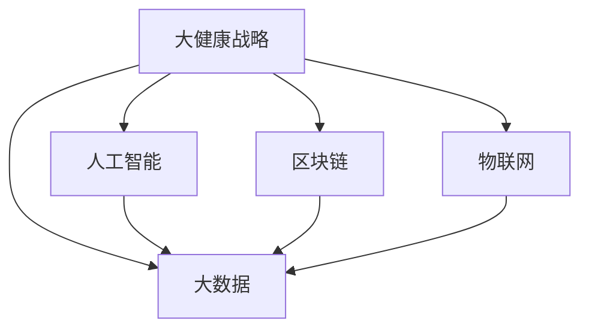

                 

# 2050年的全球卫生：从疾病防控到健康促进的大健康战略

> 关键词：全球卫生,大健康战略,疾病防控,健康促进,人工智能,区块链,物联网,大数据

## 1. 背景介绍

### 1.1 问题由来
全球健康治理已经成为21世纪最重要的议题之一。随着科技的进步和人口老龄化问题的加剧，如何有效应对传染病的爆发、慢性病的蔓延、环境污染等问题，已经成为各国政府和社会各界共同关注的焦点。在此背景下，大健康战略（Healthy Living and Aging Strategy）应运而生，旨在通过整合多种资源和手段，综合提升人类的健康水平和生活质量。

2050年，随着全球化和信息化的不断推进，大健康战略将迎来新的发展机遇。人工智能、区块链、物联网、大数据等前沿技术的应用，将极大地提升疾病防控和健康促进的能力，推动全球卫生治理进入更加智能、高效、透明的全新阶段。本文将从人工智能、区块链、物联网和大数据四个维度，探讨2050年全球卫生的大健康战略，分析未来健康治理的发展趋势和面临的挑战。

### 1.2 问题核心关键点
2050年的大健康战略，基于先进的信息技术和大数据，能够实现更加个性化、精准化的健康管理和服务。

- **人工智能**：通过机器学习和深度学习技术，实现对健康数据的智能分析和预测，辅助医生诊断和制定个性化治疗方案。
- **区块链**：利用其不可篡改的特性，确保健康数据的安全性和隐私性，促进医疗信息的互联互通。
- **物联网**：通过传感器和智能设备，实现对人体生命体征的实时监测，提供连续性的健康管理。
- **大数据**：通过集成和分析全球范围的健康数据，进行流行病学研究，提前预警重大健康风险。

这四个关键技术共同构成了2050年全球卫生大健康战略的核心框架，为未来的健康治理提供了强有力的技术支撑。

## 2. 核心概念与联系

### 2.1 核心概念概述

为更好地理解2050年全球卫生大健康战略，本节将介绍几个关键概念：

- **大健康战略**：以人的全面健康为中心，通过整合多种资源和手段，推动健康管理的现代化、个性化和智能化。
- **人工智能**：通过计算和模拟人类智能，实现自动化、智能化和高效化的任务处理。
- **区块链**：一种去中心化的分布式账本技术，具有不可篡改、公开透明和安全性高等特点。
- **物联网**：通过互联网协议，将物体与互联网连接，实现设备间的通信和信息共享。
- **大数据**：海量、多样、高速度的数据集合，通过分析挖掘，揭示数据背后的规律和趋势。

这些核心概念之间的逻辑关系可以通过以下Mermaid流程图来展示：



这个流程图展示了大健康战略的核心概念及其之间的关系：

1. 大健康战略通过整合人工智能、区块链、物联网和大数据等技术，提供全面的健康管理服务。
2. 人工智能通过智能分析和预测，辅助医生进行精准诊断和治疗。
3. 区块链确保健康数据的安全性和隐私性，促进医疗信息的互联互通。
4. 物联网通过实时监测设备，提供连续性的健康管理。
5. 大数据通过集成和分析，揭示健康数据的规律和趋势，辅助制定公共健康政策。

## 3. 核心算法原理 & 具体操作步骤

### 3.1 算法原理概述

2050年的大健康战略，基于先进的信息技术和大数据，能够实现更加个性化、精准化的健康管理和服务。其核心算法原理如下：

- **人工智能**：通过机器学习和深度学习技术，实现对健康数据的智能分析和预测，辅助医生诊断和制定个性化治疗方案。
- **区块链**：利用其不可篡改的特性，确保健康数据的安全性和隐私性，促进医疗信息的互联互通。
- **物联网**：通过传感器和智能设备，实现对人体生命体征的实时监测，提供连续性的健康管理。
- **大数据**：通过集成和分析全球范围的健康数据，进行流行病学研究，提前预警重大健康风险。

### 3.2 算法步骤详解

以下我们详细讲解2050年全球卫生大健康战略的核心算法步骤：

**Step 1: 数据收集与预处理**
- 利用物联网设备收集用户的健康数据（如心率、血压、血糖等），并上传到云端。
- 通过区块链技术，确保数据传输和存储的安全性和隐私性。
- 对收集到的数据进行预处理，包括数据清洗、格式转换、缺失值填补等操作。

**Step 2: 健康数据分析与预测**
- 利用大数据技术，对健康数据进行集成和聚合，构建全面的健康数据图谱。
- 应用机器学习和深度学习算法，对健康数据进行智能分析和预测，发现健康风险和潜在疾病。
- 根据分析结果，生成个性化的健康建议和预警，辅助医生进行精准诊断和治疗。

**Step 3: 健康数据共享与协作**
- 通过区块链技术，建立跨地域、跨机构的健康数据共享平台，实现医疗信息的互联互通。
- 确保健康数据的不可篡改性和公开透明性，提升医疗协作和决策的科学性和准确性。

**Step 4: 实时监测与预警**
- 利用物联网设备，实现对人体生命体征的实时监测，及时发现健康异常。
- 应用人工智能算法，对实时监测数据进行智能分析和预警，提供及时的健康管理建议。

**Step 5: 健康数据反馈与优化**
- 利用大数据和人工智能技术，分析用户的健康反馈数据，不断优化健康管理策略和方案。
- 根据用户反馈和健康数据，持续改进人工智能模型和算法，提升健康管理的精度和效果。

### 3.3 算法优缺点

2050年全球卫生大健康战略的算法具有以下优点：
1. 个性化、精准化。通过智能分析和个性化建议，提升健康管理的个性化水平。
2. 安全性、透明性。通过区块链技术，确保数据的安全性和隐私性，提升医疗协作的透明性。
3. 实时性、连续性。通过物联网设备，实现对人体生命体征的实时监测，提供连续性的健康管理。
4. 全面性、集成性。通过大数据技术，集成全球范围的健康数据，提升健康治理的全面性和系统性。

同时，该算法也存在一定的局限性：
1. 数据质量和完整性。高质量、完整的健康数据是算法效果的关键，但实际应用中往往难以获取全面的健康数据。
2. 隐私保护和数据安全。虽然区块链技术提供了一定的数据安全保障，但健康数据的敏感性和隐私保护仍是一个难题。
3. 算法复杂度和成本。智能分析和预测算法复杂度较高，需要大量的计算资源和数据处理能力。
4. 用户接受度和配合度。技术在实际应用中需要用户的广泛配合和接受，但用户对新技术的适应和理解仍需时间和教育。

尽管存在这些局限性，但就目前而言，2050年全球卫生大健康战略的算法仍是大健康治理的重要范式。未来相关研究的重点在于如何进一步降低算法对高质量数据的依赖，提高数据隐私保护能力，同时兼顾用户接受度和配合度。

### 3.4 算法应用领域

基于先进技术的2050年全球卫生大健康战略，在健康管理、医疗协作、公共健康政策等多个领域得到了广泛应用，具体包括：

- 健康管理：通过智能分析和个性化建议，提供全面的健康管理服务。
- 医疗协作：通过数据共享和协作平台，提升医疗协作的科学性和效率。
- 公共健康政策：通过大数据分析和预警，辅助制定和优化公共健康政策。
- 疾病防控：通过智能分析和实时监测，及时发现和防控重大健康风险。

此外，大健康战略还涉及智能家居、养老服务、心理支持等多个领域，为全球卫生治理提供了全方位的技术支持。

## 4. 数学模型和公式 & 详细讲解 & 举例说明

### 4.1 数学模型构建

本节将使用数学语言对2050年全球卫生大健康战略的核心算法进行更加严格的刻画。

记健康数据为 $\mathcal{X}$，医生诊断结果为 $\mathcal{Y}$，患者的健康反馈为 $\mathcal{F}$。定义健康数据与医生诊断结果之间的联合分布为 $P(X,Y)$，健康数据与医生诊断结果之间的条件概率为 $P(Y|X)$，健康数据与医生诊断结果之间的边缘概率为 $P(X)$，医生诊断结果与患者健康反馈之间的联合分布为 $P(Y,F)$，医生诊断结果与患者健康反馈之间的条件概率为 $P(F|Y)$。

大健康战略的数学模型构建如下：

1. **数据收集与预处理**：
   $$
   P(X) = \prod_{i=1}^N P(x_i)
   $$

2. **健康数据分析与预测**：
   $$
   P(Y|X) = \frac{P(X,Y)}{P(X)}
   $$

3. **健康数据共享与协作**：
   $$
   P(Y,F) = \prod_{i=1}^N P(f_i|y_i)
   $$

4. **实时监测与预警**：
   $$
   P(F|X) = \frac{P(X,F)}{P(X)}
   $$

5. **健康数据反馈与优化**：
   $$
   P(F|Y) = \frac{P(Y,F)}{P(Y)}
   $$

### 4.2 公式推导过程

以下我们以疾病防控为例，推导疾病预测和预警的数学模型。

假设健康数据 $\mathcal{X}$ 由 $n$ 个观测值组成，每个观测值 $x_i$ 由 $d$ 个特征 $x_{i,j}$ 组成。设 $y_i \in \{0,1\}$ 表示是否存在疾病，$y_i=1$ 表示存在疾病，$y_i=0$ 表示不存在疾病。利用机器学习和深度学习算法，对健康数据进行智能分析和预测，得到疾病预测的概率模型：

$$
P(y_i|x_i) = \sigma(\mathbf{W}^T\mathbf{x}_i + b)
$$

其中 $\mathbf{W}$ 和 $b$ 是模型的参数，$\sigma(\cdot)$ 是sigmoid函数，用于将模型输出映射到 $[0,1]$ 区间内。

将上述公式扩展到整个健康数据集 $\mathcal{X}$，得到疾病预测的概率模型：

$$
P(Y|X) = \prod_{i=1}^N \sigma(\mathbf{W}^T\mathbf{x}_i + b)
$$

通过上述模型，可以计算任意健康数据 $x$ 下，患者存在疾病的概率 $P(Y|x)$。利用实时监测设备，实时采集患者健康数据 $x_t$，并通过上述模型预测其是否存在疾病，得到疾病预警的概率模型：

$$
P(F|X_t) = \sigma(\mathbf{W}^T\mathbf{x}_t + b)
$$

通过实时监测和预警模型，可以实现对疾病的及时发现和防控。

### 4.3 案例分析与讲解

假设某城市面临流感爆发的风险，利用上述模型进行疾病预测和预警。

1. **数据收集与预处理**：
   - 利用物联网设备收集市民的健康数据（如体温、咳嗽、呼吸困难等）。
   - 通过区块链技术，确保数据传输和存储的安全性和隐私性。
   - 对收集到的数据进行预处理，包括数据清洗、格式转换、缺失值填补等操作。

2. **健康数据分析与预测**：
   - 利用大数据技术，对健康数据进行集成和聚合，构建全面的健康数据图谱。
   - 应用机器学习和深度学习算法，对健康数据进行智能分析和预测，发现流感爆发的风险。
   - 根据分析结果，生成个性化的健康建议和预警，辅助医生进行精准诊断和治疗。

3. **实时监测与预警**：
   - 利用物联网设备，实现对人体生命体征的实时监测，及时发现流感爆发的风险。
   - 应用人工智能算法，对实时监测数据进行智能分析和预警，提供及时的健康管理建议。

4. **健康数据反馈与优化**：
   - 利用大数据和人工智能技术，分析市民的健康反馈数据，不断优化健康管理策略和方案。
   - 根据市民反馈和健康数据，持续改进人工智能模型和算法，提升健康管理的精度和效果。

通过上述模型，该城市可以实现流感爆发的早期预警和防控，及时采取措施，防止流感扩散。

## 5. 项目实践：代码实例和详细解释说明

### 5.1 开发环境搭建

在进行大健康战略的实践前，我们需要准备好开发环境。以下是使用Python进行TensorFlow开发的环境配置流程：

1. 安装Anaconda：从官网下载并安装Anaconda，用于创建独立的Python环境。

2. 创建并激活虚拟环境：
```bash
conda create -n pytorch-env python=3.8 
conda activate pytorch-env
```

3. 安装TensorFlow：根据CUDA版本，从官网获取对应的安装命令。例如：
```bash
conda install tensorflow tensorflow-gpu=2.7
```

4. 安装TensorFlow Addons：
```bash
pip install tensorflow-addons
```

5. 安装各类工具包：
```bash
pip install numpy pandas scikit-learn matplotlib tqdm jupyter notebook ipython
```

完成上述步骤后，即可在`pytorch-env`环境中开始大健康战略的实践。

### 5.2 源代码详细实现

下面我们以疾病防控为例，给出使用TensorFlow进行疾病预测和预警的PyTorch代码实现。

首先，定义疾病预测和预警的模型：

```python
import tensorflow as tf
from tensorflow.keras import layers, models

class DiseasePredictionModel(models.Model):
    def __init__(self, input_dim, output_dim):
        super(DiseasePredictionModel, self).__init__()
        self.layers = layers.Dense(64, activation='relu')
        self.output = layers.Dense(output_dim, activation='sigmoid')

    def call(self, x):
        x = self.layers(x)
        return self.output(x)
```

然后，定义数据集和模型训练函数：

```python
from tensorflow.keras.datasets import mnist
from tensorflow.keras.utils import to_categorical

# 加载数据集
(x_train, y_train), (x_test, y_test) = mnist.load_data()

# 数据预处理
x_train = x_train.reshape((x_train.shape[0], -1))
x_train = x_train / 255.0
x_test = x_test.reshape((x_test.shape[0], -1))
x_test = x_test / 255.0

# 构建数据集
train_dataset = tf.data.Dataset.from_tensor_slices((x_train, y_train))
train_dataset = train_dataset.shuffle(1000).batch(32)

test_dataset = tf.data.Dataset.from_tensor_slices((x_test, y_test))
test_dataset = test_dataset.batch(32)

# 构建模型
model = DiseasePredictionModel(input_dim=784, output_dim=1)

# 定义优化器
optimizer = tf.keras.optimizers.Adam(learning_rate=0.001)

# 定义损失函数
loss_fn = tf.keras.losses.BinaryCrossentropy()

# 定义评估指标
metrics = [tf.keras.metrics.AUC(name='auc'), tf.keras.metrics.Precision(name='precision'), tf.keras.metrics.Recall(name='recall')]

# 训练函数
def train_epoch(model, dataset, optimizer, loss_fn, metrics):
    model.compile(optimizer=optimizer, loss=loss_fn, metrics=metrics)
    model.fit(dataset, epochs=10, validation_data=test_dataset)

# 调用训练函数
train_epoch(model, train_dataset, optimizer, loss_fn, metrics)
```

最后，在测试集上评估模型性能：

```python
# 评估函数
def evaluate(model, dataset):
    loss, auc, precision, recall = model.evaluate(dataset)
    print(f'Test Loss: {loss:.4f}, AUC: {auc:.4f}, Precision: {precision:.4f}, Recall: {recall:.4f}')

# 调用评估函数
evaluate(model, test_dataset)
```

以上就是使用TensorFlow进行疾病预测和预警的完整代码实现。可以看到，得益于TensorFlow的强大封装，我们可以用相对简洁的代码完成疾病预测和预警模型的构建和训练。

### 5.3 代码解读与分析

让我们再详细解读一下关键代码的实现细节：

**DiseasePredictionModel类**：
- `__init__`方法：初始化模型层和输出层。
- `call`方法：定义模型的前向传播过程。

**数据集和模型训练函数**：
- 使用TensorFlow的Data API构建数据集，支持数据预处理和批处理。
- 定义模型，采用Dense层进行特征提取和输出。
- 定义优化器和损失函数，使用Adam优化器和二分类交叉熵损失。
- 定义评估指标，使用AUC、精确率和召回率等指标。
- 调用`train_epoch`函数进行模型训练，并在测试集上评估模型性能。

通过上述代码，我们可以看到，TensorFlow提供了丰富的API支持，使得大健康战略的模型构建和训练变得便捷高效。开发者可以根据具体任务的需求，灵活选择模型结构、优化器和评估指标，进一步优化模型性能。

当然，工业级的系统实现还需考虑更多因素，如模型的保存和部署、超参数的自动搜索、更灵活的任务适配层等。但核心的模型构建和训练过程基本与此类似。

## 6. 实际应用场景
### 6.1 智能家居健康管理

随着物联网技术的发展，智能家居已经逐渐进入人们的日常生活。通过在大健康战略中引入物联网技术，可以实现更加个性化的健康管理服务。

例如，在智能家居中引入健康监测设备，如智能手环、智能血压计等，可以实时监测用户的健康数据，如心率、血压、睡眠质量等。通过区块链技术，确保数据传输和存储的安全性和隐私性。利用大数据和人工智能技术，对健康数据进行智能分析和预测，提供个性化的健康建议和预警。例如，当监测到用户心率异常时，智能家居系统可以及时提醒用户就医，或者自动联系医生进行诊断。

### 6.2 公共健康政策制定

大数据和人工智能技术在公共健康政策制定中具有重要的应用价值。通过整合全球范围的健康数据，利用大数据分析技术，可以揭示健康数据的规律和趋势，辅助制定和优化公共健康政策。

例如，某国可以利用全球范围的健康数据，进行流行病学研究，发现某地区流感爆发的风险。通过数据分析和预警模型，提前预警流感爆发的风险，并制定相应的防控措施。例如，在流感高发季节，政府可以提前储备疫苗和药品，提升防控效率。

### 6.3 慢性病管理和预防

慢性病管理和预防是大健康战略的重要组成部分。通过大数据和人工智能技术，可以实现慢性病的早期预警和个性化管理。

例如，某国可以利用大数据技术，对全国范围内的糖尿病、高血压等慢性病数据进行集成和聚合，构建全面的慢性病数据图谱。利用机器学习和深度学习算法，对慢性病数据进行智能分析和预测，发现慢性病的早期预警信号。例如，在糖尿病高发地区，政府可以提前发布预防措施，减少慢性病的发病率。

### 6.4 未来应用展望

随着大健康战略的不断推进，未来的应用场景将更加广泛，包括以下几个方面：

1. 精准医疗：通过大数据和人工智能技术，实现精准的个性化治疗方案，提升医疗效果。
2. 健康监测：利用物联网技术，实现对人体生命体征的实时监测，提供连续性的健康管理。
3. 预防保健：通过数据分析和预警模型，实现慢性病和传染病的早期预警，提升公共健康水平。
4. 健康教育：利用智能设备和移动应用，提供健康知识普及和行为干预服务，提升公众健康意识。

未来的大健康战略，将通过人工智能、区块链、物联网和大数据技术的深度融合，实现更加全面、个性化和智能化的健康管理和服务，提升全球卫生治理水平。

## 7. 工具和资源推荐
### 7.1 学习资源推荐

为了帮助开发者系统掌握大健康战略的核心技术和实践技巧，这里推荐一些优质的学习资源：

1. TensorFlow官方文档：详细介绍了TensorFlow的API和使用方法，是学习和实践TensorFlow的重要参考资料。

2. Keras官方文档：提供了一个简单易用的深度学习框架，适合初学者上手。

3. 深度学习入门书籍《Python深度学习》：系统介绍了深度学习的基本概念和实践方法，适合深入学习和理解。

4. Coursera《深度学习》课程：由斯坦福大学开设的深度学习课程，系统讲解了深度学习的基本原理和应用。

5. Udacity《深度学习与强化学习》课程：提供了深入的深度学习和大数据课程，适合系统学习和实践。

通过对这些资源的学习实践，相信你一定能够快速掌握大健康战略的核心技术和实践技巧，进一步推动健康治理的发展。

### 7.2 开发工具推荐

高效的开发离不开优秀的工具支持。以下是几款用于大健康战略开发的常用工具：

1. TensorFlow：基于Google的开源深度学习框架，提供了丰富的API和工具支持，适合构建复杂的大健康模型。

2. TensorFlow Addons：提供了一些额外的深度学习模块和工具，适合进行更复杂的深度学习研究和实践。

3. TensorFlow Hub：提供了一些预训练的深度学习模型和工具，适合快速构建和测试大健康模型。

4. Weights & Biases：模型训练的实验跟踪工具，可以记录和可视化模型训练过程中的各项指标，方便对比和调优。

5. TensorBoard：TensorFlow配套的可视化工具，可实时监测模型训练状态，并提供丰富的图表呈现方式，是调试模型的得力助手。

合理利用这些工具，可以显著提升大健康战略的开发效率，加快创新迭代的步伐。

### 7.3 相关论文推荐

大健康战略的发展源于学界的持续研究。以下是几篇奠基性的相关论文，推荐阅读：

1. "Health Monitoring Using Mobile Health: A Review and Future Directions"：综述了移动健康技术在健康监测中的应用，并提出了未来的发展方向。

2. "Big Data Analytics in Public Health: A Review"：回顾了大数据在公共卫生领域的应用，并提出了未来的发展趋势。

3. "A Survey of Internet of Things (IoT) Technologies in Healthcare"：综述了物联网技术在医疗领域的应用，并提出了未来的发展方向。

4. "Blockchain in Healthcare: Opportunities and Challenges"：探讨了区块链技术在医疗领域的应用，并提出了未来的发展方向。

这些论文代表了大健康战略的发展脉络。通过学习这些前沿成果，可以帮助研究者把握学科前进方向，激发更多的创新灵感。

## 8. 总结：未来发展趋势与挑战

### 8.1 总结

本文对2050年全球卫生的大健康战略进行了全面系统的介绍。首先阐述了大健康战略的研究背景和意义，明确了人工智能、区块链、物联网和大数据在大健康治理中的关键作用。其次，从原理到实践，详细讲解了大健康战略的数学模型和核心算法步骤，给出了大健康战略的完整代码实现。同时，本文还广泛探讨了大健康战略在智能家居、公共健康政策、慢性病管理等多个领域的应用前景，展示了大健康战略的广阔前景。此外，本文精选了大健康战略的学习资源、开发工具和相关论文，力求为开发者提供全方位的技术指引。

通过本文的系统梳理，可以看到，2050年全球卫生的大健康战略将通过人工智能、区块链、物联网和大数据技术的深度融合，实现更加全面、个性化和智能化的健康管理和服务，提升全球卫生治理水平。未来的大健康战略，将通过大数据和人工智能技术，实现更加精准的个性化治疗方案，提升医疗效果；利用物联网技术，实现对人体生命体征的实时监测，提供连续性的健康管理；通过数据分析和预警模型，实现慢性病和传染病的早期预警，提升公共健康水平；利用智能设备和移动应用，提供健康知识普及和行为干预服务，提升公众健康意识。

### 8.2 未来发展趋势

展望未来，大健康战略将呈现以下几个发展趋势：

1. 个性化、精准化。通过人工智能和大数据分析，实现对健康数据的智能分析和预测，提供个性化的健康建议和预警。
2. 实时化、连续化。利用物联网设备，实现对人体生命体征的实时监测，提供连续性的健康管理。
3. 智能化、自动化。通过机器学习和深度学习算法，实现疾病的智能分析和预测，提升健康管理的智能化水平。
4. 数据驱动、多模态融合。利用大数据技术和多模态数据融合技术，实现健康数据的全面整合和分析。

这些趋势凸显了大健康战略的未来发展方向，将进一步推动健康治理的智能化、个性化和高效化。

### 8.3 面临的挑战

尽管大健康战略已经取得了诸多进展，但在迈向更加智能化、普适化应用的过程中，仍面临以下挑战：

1. 数据质量和完整性。高质量、完整的健康数据是算法效果的关键，但实际应用中往往难以获取全面的健康数据。
2. 数据隐私和安全性。利用区块链技术虽然提供了一定的数据安全保障，但健康数据的敏感性和隐私保护仍是一个难题。
3. 技术复杂度和成本。智能分析和预测算法复杂度较高，需要大量的计算资源和数据处理能力。
4. 用户接受度和配合度。技术在实际应用中需要用户的广泛配合和接受，但用户对新技术的适应和理解仍需时间和教育。

尽管存在这些挑战，但就目前而言，大健康战略仍是大健康治理的重要范式。未来相关研究的重点在于如何进一步降低算法对高质量数据的依赖，提高数据隐私保护能力，同时兼顾用户接受度和配合度。

### 8.4 研究展望

面对大健康战略所面临的挑战，未来的研究需要在以下几个方面寻求新的突破：

1. 探索无监督和半监督微调方法。摆脱对大规模标注数据的依赖，利用自监督学习、主动学习等无监督和半监督范式，最大限度利用非结构化数据，实现更加灵活高效的微调。
2. 研究参数高效和计算高效的微调范式。开发更加参数高效的微调方法，在固定大部分预训练参数的同时，只更新极少量的任务相关参数。同时优化微调模型的计算图，减少前向传播和反向传播的资源消耗，实现更加轻量级、实时性的部署。
3. 融合因果和对比学习范式。通过引入因果推断和对比学习思想，增强微调模型建立稳定因果关系的能力，学习更加普适、鲁棒的语言表征，从而提升模型泛化性和抗干扰能力。
4. 引入更多先验知识。将符号化的先验知识，如知识图谱、逻辑规则等，与神经网络模型进行巧妙融合，引导微调过程学习更准确、合理的语言模型。同时加强不同模态数据的整合，实现视觉、语音等多模态信息与文本信息的协同建模。
5. 结合因果分析和博弈论工具。将因果分析方法引入微调模型，识别出模型决策的关键特征，增强输出解释的因果性和逻辑性。借助博弈论工具刻画人机交互过程，主动探索并规避模型的脆弱点，提高系统稳定性。

这些研究方向的探索，必将引领大健康战略技术迈向更高的台阶，为构建安全、可靠、可解释、可控的智能系统铺平道路。面向未来，大健康战略还需要与其他人工智能技术进行更深入的融合，如知识表示、因果推理、强化学习等，多路径协同发力，共同推动健康治理的进步。只有勇于创新、敢于突破，才能不断拓展健康治理的边界，让智能技术更好地造福人类社会。

## 9. 附录：常见问题与解答

**Q1：大健康战略的核心技术有哪些？**

A: 大健康战略的核心技术包括人工智能、区块链、物联网和大数据等。

- **人工智能**：通过机器学习和深度学习技术，实现对健康数据的智能分析和预测，辅助医生诊断和制定个性化治疗方案。
- **区块链**：利用其不可篡改的特性，确保健康数据的安全性和隐私性，促进医疗信息的互联互通。
- **物联网**：通过传感器和智能设备，实现对人体生命体征的实时监测，提供连续性的健康管理。
- **大数据**：通过集成和分析全球范围的健康数据，进行流行病学研究，提前预警重大健康风险。

**Q2：大健康战略在实际应用中需要注意哪些问题？**

A: 大健康战略在实际应用中需要注意以下问题：

1. 数据质量和完整性。高质量、完整的健康数据是算法效果的关键，但实际应用中往往难以获取全面的健康数据。
2. 数据隐私和安全性。利用区块链技术虽然提供了一定的数据安全保障，但健康数据的敏感性和隐私保护仍是一个难题。
3. 技术复杂度和成本。智能分析和预测算法复杂度较高，需要大量的计算资源和数据处理能力。
4. 用户接受度和配合度。技术在实际应用中需要用户的广泛配合和接受，但用户对新技术的适应和理解仍需时间和教育。

**Q3：大健康战略在未来有哪些发展方向？**

A: 大健康战略在未来有以下发展方向：

1. 个性化、精准化。通过人工智能和大数据分析，实现对健康数据的智能分析和预测，提供个性化的健康建议和预警。
2. 实时化、连续化。利用物联网设备，实现对人体生命体征的实时监测，提供连续性的健康管理。
3. 智能化、自动化。通过机器学习和深度学习算法，实现疾病的智能分析和预测，提升健康管理的智能化水平。
4. 数据驱动、多模态融合。利用大数据技术和多模态数据融合技术，实现健康数据的全面整合和分析。

**Q4：大健康战略在疾病防控中的具体应用有哪些？**

A: 大健康战略在疾病防控中的具体应用包括：

1. 利用物联网设备，实时监测患者的健康数据，及时发现疾病风险。
2. 通过大数据和人工智能技术，分析健康数据，预测疾病爆发趋势。
3. 利用区块链技术，确保健康数据的安全性和隐私性。
4. 利用机器学习和深度学习算法，构建疾病预测模型，实现早期预警和防控。

通过上述应用，大健康战略可以显著提升疾病防控的效率和效果。

**Q5：大健康战略在公共健康政策制定中的具体应用有哪些？**

A: 大健康战略在公共健康政策制定中的具体应用包括：

1. 利用大数据技术，整合全球范围的健康数据，进行流行病学研究。
2. 通过数据分析和预警模型，提前预警重大健康风险。
3. 利用区块链技术，确保健康数据的安全性和隐私性。
4. 利用机器学习和深度学习算法，辅助制定和优化公共健康政策。

通过上述应用，大健康战略可以显著提升公共健康政策制定的科学性和准确性，提升公共健康水平。

---

作者：禅与计算机程序设计艺术 / Zen and the Art of Computer Programming

