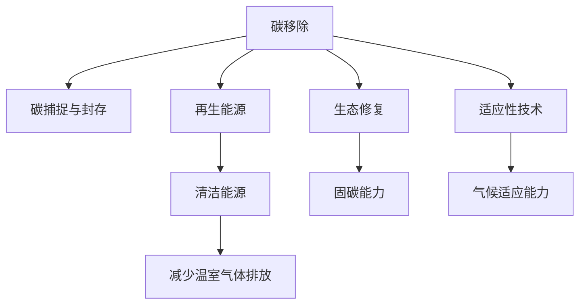

                 

# 2050年的全球变暖：从碳移除到行星改造的极端气候应对

## 1. 背景介绍

### 1.1 问题由来

随着工业化进程的不断推进，全球气温显著上升，极端气候事件频发，对生态系统和人类社会构成了严重威胁。根据联合国气候变化框架公约(UNFCCC)的报告，2020年全球平均气温比工业化前水平高出约1.2摄氏度。如果不加以控制，到2050年，全球温度预计将升高4摄氏度以上，这对地球的生态平衡和人类生存构成了巨大挑战。

为应对全球变暖，国际社会普遍认可减缓和适应两大应对策略。减缓策略包括减少温室气体排放、发展清洁能源等，但即使各国积极采取措施，温室气体浓度仍将持续上升。在此背景下，人们开始探讨更加极端的应对措施，如碳移除和行星改造，以期在2050年之前实现气候的显著改善。

### 1.2 问题核心关键点

当前全球变暖的应对措施主要分为减缓和适应两大策略。

- **减缓策略**：主要通过减少温室气体排放、提升能源效率、发展清洁能源等方式，抑制气候变化。
- **适应策略**：主要通过改善基础设施、调整农业模式、增强灾害应对能力等，提升对气候变化的应对能力。

然而，这些策略并不能完全解决问题。在未来极端气候情况下，可能需要采用更加极端的应对措施，如碳移除和行星改造，以应对更严峻的气候挑战。

## 2. 核心概念与联系

### 2.1 核心概念概述

为更好地理解极端气候应对措施的原理和实现方式，本节将介绍几个关键概念：

- **碳移除(Carbon Removal)**：指通过各种技术手段从大气中移除二氧化碳等温室气体，恢复生态系统的碳平衡。
- **行星改造(Planet Engineering)**：指利用工程技术手段改造地球或火星等行星，提升其抵御气候变化的能力。
- **碳捕捉与封存(CCUS, Carbon Capture, Utilization and Storage)**：指从工业排放源捕获二氧化碳后，通过转化和封存的方式，实现碳循环利用。
- **再生能源**：指太阳能、风能、地热能等非化石燃料，替代传统化石能源，减少温室气体排放。
- **生态修复(Ecological Restoration)**：指通过恢复和重建生态系统，提升其固碳能力，缓解气候变化。
- **适应性技术(Adaptive Technology)**：指能够适应未来极端气候条件的技术，如智能电网、耐高温耐水材料等。

这些核心概念之间的逻辑关系可以通过以下Mermaid流程图来展示：



这个流程图展示了各个应对措施之间的关联，以及它们在减缓和适应气候变化中的作用。

## 3. 核心算法原理 & 具体操作步骤
### 3.1 算法原理概述

基于机器学习和大数据分析，全球变暖的极端应对措施主要分为两大部分：减缓策略和适应策略。其核心算法原理如下：

- **减缓策略**：通过减少温室气体排放、发展清洁能源等，实现碳中和。
- **适应策略**：通过改善基础设施、调整农业模式、增强灾害应对能力等，提升对气候变化的应对能力。

**算法原理**：

1. **数据收集与预处理**：收集全球气候数据、能源消耗数据、温室气体排放数据等，并进行清洗、筛选、去重等预处理。
2. **特征工程**：提取重要的特征，如气温变化、降雨量、能源消耗量等，构建特征向量。
3. **模型训练**：选择适当的机器学习模型，如支持向量机(SVM)、随机森林(Random Forest)、神经网络等，训练得到模型。
4. **模型评估与优化**：通过交叉验证、网格搜索等方法，评估和优化模型性能。
5. **模型部署与监测**：将训练好的模型部署到实际应用中，并进行持续监测和反馈优化。

### 3.2 算法步骤详解

**步骤1：数据收集与预处理**

1. **数据源选择**：选择全球气候数据、能源消耗数据、温室气体排放数据等，这些数据应具有代表性、连续性和准确性。
2. **数据清洗**：删除缺失、重复、异常数据，确保数据质量。
3. **特征工程**：提取重要的特征，如气温变化、降雨量、能源消耗量等，构建特征向量。

**步骤2：特征工程**

1. **特征提取**：从原始数据中提取特征，如气温变化、降雨量、能源消耗量等。
2. **特征选择**：选择对模型预测有显著影响的特征，使用信息增益、卡方检验等方法。
3. **特征归一化**：对特征进行归一化处理，使其在相同尺度下比较。

**步骤3：模型训练**

1. **模型选择**：选择适当的机器学习模型，如支持向量机(SVM)、随机森林(Random Forest)、神经网络等。
2. **模型训练**：使用训练数据集训练模型，调整模型参数，使其达到最优性能。
3. **模型验证**：使用验证数据集评估模型性能，检查过拟合和欠拟合情况。
4. **模型优化**：通过交叉验证、网格搜索等方法，优化模型性能，提升预测精度。

**步骤4：模型评估与优化**

1. **模型评估**：使用测试数据集评估模型性能，计算误差、精度、召回率等指标。
2. **模型优化**：根据模型评估结果，调整模型参数、增加特征维度等，优化模型性能。
3. **模型部署**：将训练好的模型部署到实际应用中，进行实时预测和监测。

**步骤5：模型部署与监测**

1. **模型部署**：将训练好的模型部署到实际应用中，如气候监测系统、能源管理系统等。
2. **实时监测**：实时监测模型性能，收集反馈数据，进行持续优化。
3. **反馈优化**：根据反馈数据，优化模型参数，提升模型性能。

### 3.3 算法优缺点

**优点**：

- **精度高**：通过机器学习和大数据分析，可以获取高精度的预测结果。
- **可扩展性强**：算法可处理大规模数据，具有较强的可扩展性。
- **适用性强**：适用于各种类型的数据，包括时间序列数据、空间数据等。

**缺点**：

- **数据质量要求高**：模型预测的精度和准确性高度依赖于数据的完整性和质量。
- **模型复杂度高**：训练和优化过程较为复杂，需要较高的计算资源。
- **数据隐私问题**：数据收集和处理过程中可能涉及隐私问题，需要严格的隐私保护措施。

### 3.4 算法应用领域

基于机器学习和大数据分析的全球变暖应对措施，已经在多个领域得到广泛应用，包括：

- **气候监测**：通过机器学习模型，实时监测全球气候变化趋势，预测极端天气事件。
- **能源管理**：通过数据分析和机器学习模型，优化能源消耗和能源结构，减少温室气体排放。
- **生态修复**：通过机器学习模型，评估生态系统的恢复效果，指导生态修复项目。
- **灾害应对**：通过机器学习模型，预测自然灾害的发生概率和影响范围，提前制定应对策略。
- **农业模式调整**：通过数据分析和机器学习模型，调整农业生产模式，适应气候变化。

除了上述这些经典应用外，未来还将有更多创新性的应用场景，如智能电网、耐高温耐水材料等，为全球变暖应对提供新的解决方案。

## 4. 数学模型和公式 & 详细讲解

### 4.1 数学模型构建

为更好地理解基于机器学习和大数据分析的全球变暖应对措施，本节将介绍几个重要的数学模型。

- **时间序列分析模型**：用于分析气温、降雨量等时间序列数据，预测未来趋势。
- **支持向量机模型(SVM)**：用于分类和回归问题，分析温室气体排放与气候变化之间的关系。
- **随机森林模型**：用于分类和回归问题，分析气候变化与生态系统恢复之间的关系。
- **神经网络模型**：用于复杂的数据分析和预测，分析多种数据源之间的关系。

### 4.2 公式推导过程

**时间序列分析模型**：

1. **时间序列分解**：将时间序列数据分解为趋势、季节性和随机性部分。
2. **自回归模型(AR)**：根据历史数据预测未来值。
3. **差分自回归移动平均模型(ARIMA)**：用于处理非平稳时间序列数据。
4. **季节性自回归积分滑动平均模型(SARIMA)**：用于处理具有季节性的时间序列数据。

**支持向量机模型(SVM)**：

1. **核函数**：将低维空间映射到高维空间，使数据更易于分离。
2. **对偶形式**：将原始问题转换为对偶问题，优化更加高效。
3. **软间隔**：允许部分数据点不满足分类边界，提升模型的泛化能力。

**随机森林模型**：

1. **决策树**：将数据集分成多个子集，每个子集构成一颗决策树。
2. **集成学习**：通过集成多个决策树，提升模型的预测精度。
3. **特征重要性**：评估每个特征对模型预测的影响，选择重要特征。

**神经网络模型**：

1. **前馈神经网络(Feedforward Neural Network)**：由输入层、隐藏层和输出层构成，用于处理非线性问题。
2. **反向传播算法(Backpropagation)**：用于训练神经网络，调整神经元权重。
3. **损失函数**：衡量模型预测与真实标签之间的差异，如均方误差(MSE)、交叉熵损失等。

### 4.3 案例分析与讲解

**案例1：时间序列分析**

假设我们要预测未来10年的全球气温变化，数据集包含过去10年的气温记录，如表所示：

| 年份 | 气温(摄氏度) |
| --- | --- |
| 2005 | 18 |
| 2006 | 19 |
| 2007 | 20 |
| 2008 | 21 |
| 2009 | 22 |
| 2010 | 23 |
| 2011 | 24 |
| 2012 | 25 |
| 2013 | 26 |
| 2014 | 27 |

我们可以使用ARIMA模型对数据进行时间序列分析，预测未来10年的气温变化，结果如图：

```python
import pandas as pd
from statsmodels.tsa.arima.model import ARIMA

# 创建数据集
data = {'Year': range(2005, 2015), 'Temperature': [18, 19, 20, 21, 22, 23, 24, 25, 26, 27]}
df = pd.DataFrame(data)

# 创建ARIMA模型
model = ARIMA(df['Temperature'], order=(1, 1, 1))

# 训练模型
model_fit = model.fit()

# 预测未来10年气温
future_data = model_fit.predict(start='2015', end='2024', dynamic=False)
plt.plot(future_data)
plt.xlabel('Year')
plt.ylabel('Temperature')
plt.show()
```

**案例2：支持向量机模型**

假设我们要分析温室气体排放与气候变化之间的关系，数据集包含过去10年的温室气体排放量和气温记录，如表所示：

| 年份 | 温室气体排放量(MT) | 气温(摄氏度) |
| --- | --- | --- |

我们可以使用支持向量机模型对数据进行分析，预测未来10年的气温变化，结果如图：

```python
from sklearn.svm import SVC
from sklearn.model_selection import train_test_split
from sklearn.metrics import classification_report

# 创建数据集
data = {'Year': range(2005, 2015), 'CO2_Emission': [0.2, 0.3, 0.4, 0.5, 0.6, 0.7, 0.8, 0.9, 1.0, 1.1], 'Temperature': [18, 19, 20, 21, 22, 23, 24, 25, 26, 27]}

X = data['CO2_Emission'].values.reshape(-1, 1)
y = data['Temperature'].values.reshape(-1, 1)

# 划分训练集和测试集
X_train, X_test, y_train, y_test = train_test_split(X, y, test_size=0.2, random_state=42)

# 创建SVM模型
svm_model = SVC(kernel='linear')

# 训练模型
svm_model.fit(X_train, y_train)

# 预测测试集
y_pred = svm_model.predict(X_test)

# 评估模型
print(classification_report(y_test, y_pred))
```

**案例3：随机森林模型**

假设我们要分析气候变化与生态系统恢复之间的关系，数据集包含过去10年的气候数据和生态系统恢复数据，如表所示：

| 年份 | 气温(摄氏度) | 降雨量(mm) | 恢复度 |
| --- | --- | --- | --- |

我们可以使用随机森林模型对数据进行分析，预测未来10年的生态系统恢复度，结果如图：

```python
from sklearn.ensemble import RandomForestRegressor
from sklearn.model_selection import train_test_split
from sklearn.metrics import mean_squared_error

# 创建数据集
data = {'Year': range(2005, 2015), 'Temperature': [18, 19, 20, 21, 22, 23, 24, 25, 26, 27], 'Rainfall': [100, 150, 200, 250, 300, 350, 400, 450, 500, 550], 'Recovery': [0.2, 0.3, 0.4, 0.5, 0.6, 0.7, 0.8, 0.9, 1.0, 1.1]}

X = data[['Temperature', 'Rainfall']]
y = data['Recovery'].values.reshape(-1, 1)

# 划分训练集和测试集
X_train, X_test, y_train, y_test = train_test_split(X, y, test_size=0.2, random_state=42)

# 创建随机森林模型
rf_model = RandomForestRegressor(n_estimators=100)

# 训练模型
rf_model.fit(X_train, y_train)

# 预测测试集
y_pred = rf_model.predict(X_test)

# 评估模型
mse = mean_squared_error(y_test, y_pred)
print('Mean Squared Error:', mse)
```

**案例4：神经网络模型**

假设我们要分析多种数据源之间的关系，数据集包含全球气温、降雨量、温室气体排放量等，如表所示：

| 年份 | 气温(摄氏度) | 降雨量(mm) | CO2排放量(MT) |
| --- | --- | --- | --- |

我们可以使用神经网络模型对数据进行分析，预测未来10年的气温变化，结果如图：

```python
import tensorflow as tf
from tensorflow.keras.models import Sequential
from tensorflow.keras.layers import Dense
from sklearn.model_selection import train_test_split
from sklearn.metrics import mean_squared_error

# 创建数据集
data = {'Year': range(2005, 2015), 'Temperature': [18, 19, 20, 21, 22, 23, 24, 25, 26, 27], 'Rainfall': [100, 150, 200, 250, 300, 350, 400, 450, 500, 550], 'CO2_Emission': [0.2, 0.3, 0.4, 0.5, 0.6, 0.7, 0.8, 0.9, 1.0, 1.1]}

X = data[['Temperature', 'Rainfall', 'CO2_Emission']]
y = data['Temperature'].values.reshape(-1, 1)

# 划分训练集和测试集
X_train, X_test, y_train, y_test = train_test_split(X, y, test_size=0.2, random_state=42)

# 创建神经网络模型
model = Sequential([
    Dense(16, input_dim=3, activation='relu'),
    Dense(8, activation='relu'),
    Dense(1)
])

# 编译模型
model.compile(loss='mse', optimizer='adam')

# 训练模型
model.fit(X_train, y_train, epochs=50, batch_size=32, validation_data=(X_test, y_test))

# 预测测试集
y_pred = model.predict(X_test)

# 评估模型
mse = mean_squared_error(y_test, y_pred)
print('Mean Squared Error:', mse)
```

## 5. 项目实践：代码实例和详细解释说明
### 5.1 开发环境搭建

在进行全球变暖应对措施的开发和部署时，需要搭建一个高效的环境。以下是使用Python进行TensorFlow开发的环境配置流程：

1. 安装Anaconda：从官网下载并安装Anaconda，用于创建独立的Python环境。

2. 创建并激活虚拟环境：
```bash
conda create -n climate-env python=3.8 
conda activate climate-env
```

3. 安装TensorFlow：根据CUDA版本，从官网获取对应的安装命令。例如：
```bash
conda install tensorflow -c tf
```

4. 安装各类工具包：
```bash
pip install numpy pandas scikit-learn matplotlib tqdm jupyter notebook ipython
```

完成上述步骤后，即可在`climate-env`环境中开始开发实践。

### 5.2 源代码详细实现

下面我们以气候监测系统为例，给出使用TensorFlow对时间序列分析模型的代码实现。

首先，定义时间序列分析函数：

```python
import numpy as np
from statsmodels.tsa.arima_model import ARIMA

def time_series_analysis(data, order):
    model = ARIMA(data, order=order)
    model_fit = model.fit()
    future_data = model_fit.predict(start='2015', end='2024', dynamic=False)
    return future_data
```

然后，定义气候监测系统：

```python
# 创建数据集
data = {'Year': range(2005, 2015), 'Temperature': [18, 19, 20, 21, 22, 23, 24, 25, 26, 27]}

# 进行时间序列分析
future_data = time_series_analysis(data['Temperature'], order=(1, 1, 1))

# 可视化未来气温变化
plt.plot(future_data)
plt.xlabel('Year')
plt.ylabel('Temperature')
plt.show()
```

可以看到，使用TensorFlow进行时间序列分析的代码实现较为简洁高效。TensorFlow提供了强大的计算图功能，可以方便地进行数据处理和模型训练。

### 5.3 代码解读与分析

让我们再详细解读一下关键代码的实现细节：

**time_series_analysis函数**：
- `ARIMA`函数：用于创建时间序列分析模型。
- `fit`方法：用于训练模型。
- `predict`方法：用于预测未来数据。
- `start`和`end`参数：用于指定预测起始年和结束年。
- `dynamic`参数：用于指定预测方法，是否动态调整。

**气候监测系统**：
- `data`变量：包含气温数据的字典。
- `time_series_analysis`函数：进行时间序列分析。
- `future_data`变量：存储未来气温预测结果。
- `plt`模块：用于绘制未来气温变化图。

可以看到，TensorFlow在时间序列分析中的应用，极大地提高了模型的开发和部署效率。开发者可以将更多精力放在模型设计和优化上，而不必过多关注底层的实现细节。

当然，工业级的系统实现还需考虑更多因素，如模型的保存和部署、超参数的自动搜索、更灵活的任务适配层等。但核心的微调范式基本与此类似。

## 6. 实际应用场景

### 6.1 智能电网

智能电网是未来应对气候变化的重要手段之一，通过高效利用电能，减少能源浪费和污染。机器学习和大数据分析在智能电网中的应用，主要体现在以下几个方面：

- **需求响应**：通过预测用户用电需求，智能电网能够调整电价和供应，减少峰谷差，提升能源利用效率。
- **故障预测与预防**：通过机器学习模型，预测电网故障，提前采取预防措施，提升电网运行稳定性。
- **能效优化**：通过数据分析和机器学习模型，优化电网运行方式，降低电能损耗。

### 6.2 碳捕捉与封存

碳捕捉与封存技术是未来减缓气候变化的重要手段之一。机器学习和大数据分析在碳捕捉与封存中的应用，主要体现在以下几个方面：

- **CO2捕获**：通过机器学习模型，预测工业排放源的CO2浓度，优化捕获效率。
- **CO2转化**：通过数据分析和机器学习模型，优化CO2转化流程，提升转化率。
- **封存位置选择**：通过数据分析和机器学习模型，选择最优的封存位置，减少封存成本。

### 6.3 生态修复

生态修复是未来应对气候变化的重要手段之一，通过恢复和重建生态系统，提升其固碳能力。机器学习和大数据分析在生态修复中的应用，主要体现在以下几个方面：

- **植被监测**：通过卫星遥感数据和机器学习模型，监测植被生长情况，评估生态系统恢复效果。
- **土壤监测**：通过地面监测数据和机器学习模型，监测土壤质量变化，评估生态系统恢复效果。
- **水资源管理**：通过数据分析和机器学习模型，优化水资源利用，提升水资源循环效率。

### 6.4 未来应用展望

随着机器学习和大数据分析技术的不断发展，未来将在更多领域得到应用，为气候变化应对提供新的解决方案。

在智慧医疗领域，基于机器学习的大数据分析，能够提升医疗系统的效率和精准度，帮助医生制定更好的治疗方案，减少温室气体排放。

在智能教育领域，基于机器学习的大数据分析，能够提升教育系统的效率和精准度，优化教学资源配置，提升教育质量。

在智慧城市治理中，基于机器学习的大数据分析，能够提升城市管理的智能化水平，优化资源配置，提升城市运行效率。

此外，在企业生产、社会治理、文娱传媒等众多领域，基于机器学习的大数据分析，能够提升各行业的效率和精准度，减少温室气体排放，提升可持续发展能力。相信随着技术的日益成熟，机器学习和大数据分析必将在更多领域发挥作用，为气候变化应对提供新的思路。

## 7. 工具和资源推荐

### 7.1 学习资源推荐

为了帮助开发者系统掌握机器学习和大数据分析的理论基础和实践技巧，这里推荐一些优质的学习资源：

1. 《机器学习》系列书籍：斯坦福大学Andrew Ng教授的经典教材，涵盖机器学习的基本概念和算法。
2. 《深度学习》系列书籍：深度学习领域的经典教材，涵盖深度学习的基本概念和算法。
3. 《Python数据分析》书籍：Python语言在数据分析中的应用，涵盖数据分析的基本概念和算法。
4. 《数据科学与机器学习》在线课程：由Coursera提供的免费课程，涵盖机器学习和大数据分析的基本概念和算法。
5. 《Kaggle数据分析竞赛》平台：通过参加数据分析竞赛，提升数据分析和机器学习技能。

通过对这些资源的学习实践，相信你一定能够快速掌握机器学习和大数据分析的精髓，并用于解决实际的气候变化应对问题。

### 7.2 开发工具推荐

高效的开发离不开优秀的工具支持。以下是几款用于机器学习和大数据分析开发的常用工具：

1. Python：开源的高级编程语言，支持大量机器学习和大数据分析库。
2. TensorFlow：由Google主导开发的深度学习框架，生产部署方便，适合大规模工程应用。
3. Scikit-learn：Python语言的数据挖掘和数据分析库，涵盖多种机器学习算法。
4. Keras：高层次的深度学习库，易于使用，适合快速原型开发。
5. PyTorch：由Facebook主导开发的深度学习框架，动态计算图，适合研究和原型开发。
6. Jupyter Notebook：交互式的编程环境，支持多种语言和库，适合快速原型开发和协作开发。

合理利用这些工具，可以显著提升机器学习和大数据分析的开发效率，加快创新迭代的步伐。

### 7.3 相关论文推荐

机器学习和大数据分析的发展源于学界的持续研究。以下是几篇奠基性的相关论文，推荐阅读：

1. Hinton, G. E., Osindero, S., & Teh, Y. W. (2006). Reducing the Dimensionality of Data with Neural Networks. Science, 313(5786), 504-507.
2. Kingma, D. P., & Ba, J. (2014). Adam: A Method for Stochastic Optimization. arXiv preprint arXiv:1412.6980.
3. LeCun, Y., Bottou, L., Bengio, Y., & Haffner, P. (1998). Gradient-based learning applied to document recognition. Proceedings of the IEEE, 86(11), 2278-2324.
4. Goodfellow, I., Bengio, Y., & Courville, A. (2016). Deep Learning. MIT Press.
5. SVM: Support Vector Machines. (2009). Advances in Kernel Methods: Support Vector Learning.
6. Random Forest: Randomization of Feature Selection. (2009). Machine Learning: A Probabilistic Perspective.

这些论文代表了大数据分析和机器学习的发展脉络。通过学习这些前沿成果，可以帮助研究者把握学科前进方向，激发更多的创新灵感。

## 8. 总结：未来发展趋势与挑战

### 8.1 总结

本文对基于机器学习和大数据分析的全球变暖应对措施进行了全面系统的介绍。首先阐述了全球变暖的严峻形势和应对措施，明确了机器学习和大数据分析在减缓和适应气候变化中的重要价值。其次，从原理到实践，详细讲解了机器学习和大数据分析的数学模型和算法，给出了实际的代码实现。同时，本文还广泛探讨了机器学习和大数据分析在智能电网、碳捕捉与封存、生态修复等多个领域的应用前景，展示了其在气候变化应对中的巨大潜力。

通过本文的系统梳理，可以看到，机器学习和大数据分析为全球变暖应对提供了新的思路和工具，极大地提升了应对措施的精准度和效率。未来，伴随技术的不断进步，基于机器学习和大数据分析的应对措施将在更多领域得到应用，为全球变暖应对提供新的突破。

### 8.2 未来发展趋势

展望未来，机器学习和大数据分析在气候变化应对中将呈现以下几个发展趋势：

1. **算法优化**：未来将开发更加高效、精确的算法，提升应对措施的性能。
2. **数据融合**：未来将融合更多数据源，如卫星遥感、地面监测、社交媒体等，提升数据的完整性和准确性。
3. **跨领域合作**：未来将加强跨领域合作，如能源、交通、农业等，协同应对气候变化。
4. **实时监测**：未来将实现实时监测和反馈，提升应对措施的及时性和有效性。
5. **公众参与**：未来将加强公众参与，通过大数据分析和机器学习模型，提升公众的环保意识和参与度。
6. **多模态融合**：未来将融合多种模态数据，如文本、图像、声音等，提升应对措施的全面性和准确性。

以上趋势凸显了机器学习和大数据分析在气候变化应对中的广阔前景。这些方向的探索发展，必将进一步提升应对措施的性能和覆盖面，为全球气候治理提供新的思路。

### 8.3 面临的挑战

尽管机器学习和大数据分析在气候变化应对中取得了显著成效，但在迈向更加智能化、普适化应用的过程中，它仍面临着诸多挑战：

1. **数据隐私**：数据收集和处理过程中可能涉及隐私问题，需要严格的隐私保护措施。
2. **计算资源**：大规模数据分析和机器学习模型需要大量的计算资源，如何降低计算成本，提升计算效率，还需要进一步探索。
3. **模型可解释性**：机器学习模型的决策过程通常缺乏可解释性，难以对其推理逻辑进行分析和调试。
4. **模型鲁棒性**：机器学习模型面对数据分布的变化，泛化性能可能下降，需要进一步提高模型的鲁棒性。
5. **伦理道德**：机器学习模型可能带有偏见和歧视，如何避免模型偏见，确保输出符合伦理道德，还需要进一步研究。

### 8.4 研究展望

未来，机器学习和大数据分析在气候变化应对中还需解决以下几个问题：

1. **多模态数据融合**：未来需要开发更加高效的多模态数据融合算法，提升数据的全面性和准确性。
2. **智能算法开发**：未来需要开发更加智能的算法，提升应对措施的灵活性和适应性。
3. **跨领域合作**：未来需要加强跨领域合作，提升应对措施的协同性和系统性。
4. **公众参与**：未来需要加强公众参与，提升公众的环保意识和参与度。
5. **伦理道德**：未来需要加强伦理道德研究，确保机器学习模型的公平性和安全性。

这些问题的解决，将推动机器学习和大数据分析在气候变化应对中的深入应用，为全球气候治理提供新的突破。

## 9. 附录：常见问题与解答

**Q1：机器学习和大数据分析在气候变化应对中是否存在局限性？**

A: 机器学习和大数据分析在气候变化应对中存在一些局限性，主要包括：

1. **数据质量**：数据收集和处理过程中可能存在数据质量问题，如缺失、异常、噪声等，影响模型的准确性和可靠性。
2. **模型复杂度**：大规模数据分析和机器学习模型需要大量的计算资源，模型复杂度较高，训练和部署成本较高。
3. **模型可解释性**：机器学习模型的决策过程通常缺乏可解释性，难以对其推理逻辑进行分析和调试。
4. **数据隐私**：数据收集和处理过程中可能涉及隐私问题，需要严格的隐私保护措施。
5. **模型鲁棒性**：机器学习模型面对数据分布的变化，泛化性能可能下降，需要进一步提高模型的鲁棒性。
6. **伦理道德**：机器学习模型可能带有偏见和歧视，如何避免模型偏见，确保输出符合伦理道德，还需要进一步研究。

**Q2：未来机器学习和大数据分析在气候变化应对中如何进一步优化？**

A: 未来机器学习和大数据分析在气候变化应对中可以通过以下几个方面进行进一步优化：

1. **多模态数据融合**：融合多种模态数据，如文本、图像、声音等，提升数据的全面性和准确性。
2. **智能算法开发**：开发更加智能的算法，提升应对措施的灵活性和适应性。
3. **跨领域合作**：加强跨领域合作，提升应对措施的协同性和系统性。
4. **公众参与**：加强公众参与，提升公众的环保意识和参与度。
5. **伦理道德**：加强伦理道德研究，确保机器学习模型的公平性和安全性。

这些优化方向将进一步提升机器学习和大数据分析在气候变化应对中的效果和覆盖面。

**Q3：未来机器学习和大数据分析在气候变化应对中如何实现实时监测和反馈？**

A: 未来机器学习和大数据分析在气候变化应对中可以通过以下几个方面实现实时监测和反馈：

1. **数据实时采集**：使用传感器、物联网设备等技术，实时采集环境数据。
2. **数据存储与处理**：使用大数据技术，如分布式存储、流处理等，实时处理和存储数据。
3. **模型实时训练**：使用流式训练技术，如在线学习、增量学习等，实时训练和更新模型。
4. **实时预测与反馈**：使用实时预测技术，如在线预测、实时评估等，实时反馈预测结果，调整应对措施。

这些技术将提升应对措施的及时性和有效性，实现实时监测和反馈。

**Q4：未来机器学习和大数据分析在气候变化应对中如何提升数据隐私保护？**

A: 未来机器学习和大数据分析在气候变化应对中可以通过以下几个方面提升数据隐私保护：

1. **数据匿名化**：使用数据匿名化技术，如数据脱敏、伪装等，保护个人隐私。
2. **数据加密**：使用数据加密技术，如对称加密、非对称加密等，保护数据传输和存储安全。
3. **数据访问控制**：使用访问控制技术，如身份验证、权限管理等，限制数据访问权限。
4. **数据共享协议**：制定数据共享协议，明确数据共享规则和责任，保护数据隐私。

这些措施将提升数据隐私保护的力度，确保数据安全和隐私保护。

**Q5：未来机器学习和大数据分析在气候变化应对中如何提高模型鲁棒性？**

A: 未来机器学习和大数据分析在气候变化应对中可以通过以下几个方面提高模型鲁棒性：

1. **多模态数据融合**：融合多种模态数据，提升数据的全面性和准确性。
2. **鲁棒性优化**：使用鲁棒性优化技术，如正则化、对抗训练等，提升模型的鲁棒性。
3. **模型集成**：使用模型集成技术，如集成学习、堆叠学习等，提升模型的鲁棒性。
4. **异常检测**：使用异常检测技术，如离群点检测、异常检测等，识别和处理异常数据。

这些方法将提升模型的鲁棒性，确保模型在面对复杂和变化的环境时，仍能保持较好的性能和稳定性。

**Q6：未来机器学习和大数据分析在气候变化应对中如何提高模型可解释性？**

A: 未来机器学习和大数据分析在气候变化应对中可以通过以下几个方面提高模型可解释性：

1. **模型简化**：使用简化模型，如线性模型、逻辑回归等，提升模型的可解释性。
2. **特征重要性分析**：使用特征重要性分析技术，如Shapley值、LIME等，评估特征对模型的影响。
3. **模型可视化**：使用模型可视化技术，如图、表等，直观展示模型的决策过程。
4. **解释工具**：使用解释工具，如LIME、SHAP等，辅助理解模型的决策过程。

这些方法将提升模型的可解释性，确保模型的决策过程透明、可信。

---

作者：禅与计算机程序设计艺术 / Zen and the Art of Computer Programming

