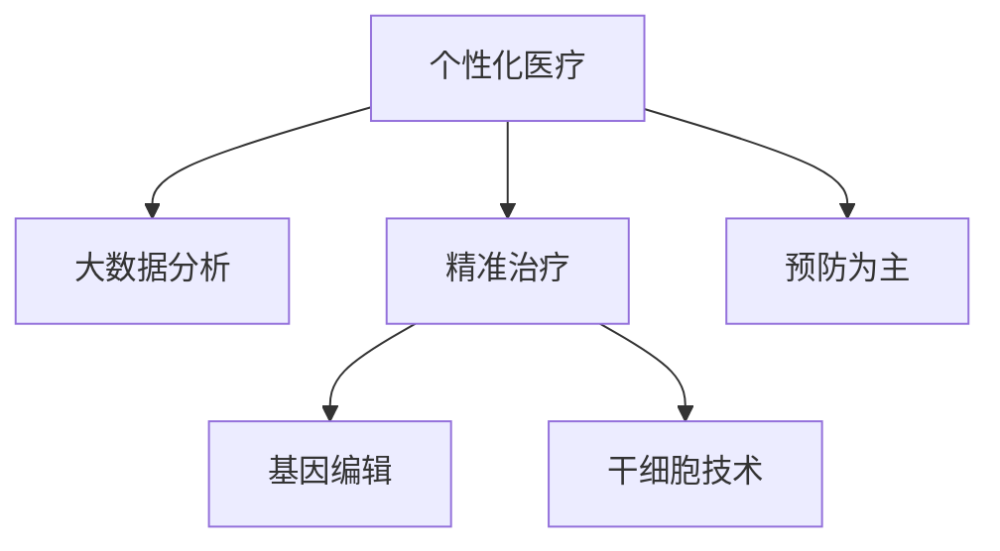

                 

# 2050年的医疗健康：从个性化医疗到再生医学的健康革命

在未来的2050年，医疗健康领域将迎来一场深刻的革命。这场革命将彻底改变我们对疾病的认知、治疗和预防方式，从传统的一刀切式个性化医疗迈向全面性的再生医学，开启人类健康的新纪元。本文将从背景、核心概念、算法原理、具体实践、未来展望等方面，全面阐述这场健康革命的内涵和路径，助力我们构建一个更加健康、智慧的未来社会。

## 1. 背景介绍

### 1.1 问题由来
随着科技的迅猛发展，人类在医疗健康领域取得了巨大的进步，从过去的“以治疗为主”逐渐转变为“预防为主”。然而，现有的医疗模式依然面临诸多挑战：
- **个体化不足**：传统医疗往往基于大样本统计，难以满足个体差异性的需求。
- **精准度有限**：现有的个性化医疗模型基于固定算法和参数，无法充分考虑个体基因、环境和生活方式等复杂因素。
- **资源有限**：医疗资源的分配存在不均衡现象，尤其是对稀有病种和个性化需求的覆盖不足。
- **无法复原**：传统的药物和手术往往只能缓解症状，无法实现对人体器官的复原和再生。

为了应对这些挑战，2050年的医疗健康将深度融合人工智能、大数据和再生医学技术，开启个性化医疗和再生医学的新纪元。

### 1.2 问题核心关键点
未来医疗健康的主要趋势包括：
- **个性化医疗**：利用人工智能和大数据分析，实现对个体基因、环境和生活方式等复杂因素的全面建模，提供个性化医疗方案。
- **再生医学**：通过基因编辑、干细胞技术等手段，实现对受损器官的修复和再生，提供根本性的治疗方案。
- **精准治疗**：结合个性化医疗和再生医学，实现对疾病的精准诊断和治疗，提升治疗效果和患者满意度。
- **预防为主**：通过大数据分析和预警系统，实现对疾病的早期预测和预防，减少疾病发生率。

## 2. 核心概念与联系

### 2.1 核心概念概述

为更好地理解2050年的医疗健康革命，本节将介绍几个密切相关的核心概念：

- **个性化医疗**：利用人工智能和大数据分析，为每个患者量身定制个性化治疗方案，实现精准医疗。
- **再生医学**：利用基因编辑、干细胞技术等手段，修复和再生受损器官，提供根本性的治疗方案。
- **精准治疗**：通过精准的诊断和个性化的治疗，实现对疾病的精准管理和治疗，提升治疗效果和患者满意度。
- **预防为主**：通过大数据分析和预警系统，实现对疾病的早期预测和预防，减少疾病发生率。

这些核心概念之间的逻辑关系可以通过以下Mermaid流程图来展示：



这个流程图展示了个性化医疗、精准治疗、再生医学和预防为主的相互关系：

1. 个性化医疗利用大数据分析为患者提供个性化的治疗方案，是精准治疗的基础。
2. 精准治疗通过基因编辑和干细胞技术实现对人体器官的修复和再生，提供根本性的治疗方案。
3. 预防为主通过大数据分析和预警系统，实现对疾病的早期预测和预防，减少疾病发生率。

这些概念共同构成了2050年医疗健康的核心框架，将引领人类健康进入新纪元。

## 3. 核心算法原理 & 具体操作步骤
### 3.1 算法原理概述

2050年的医疗健康革命涉及多个领域的交叉融合，包括人工智能、大数据、基因编辑和干细胞技术等。本节将从整体上概述这些核心技术的原理和应用。

### 3.2 算法步骤详解

#### 3.2.1 个性化医疗算法

个性化医疗的核心在于利用人工智能和大数据分析，为每个患者量身定制个性化治疗方案。其算法步骤包括：

1. **数据收集**：收集患者的基因信息、生活习惯、环境因素等数据。
2. **数据预处理**：对数据进行清洗、归一化等预处理，减少噪音和异常值。
3. **特征工程**：提取关键特征，构建特征向量。
4. **模型训练**：利用机器学习算法（如深度学习、支持向量机等）训练个性化模型，如疾病预测模型、治疗方案推荐模型等。
5. **结果评估**：对模型的预测结果进行评估，调整模型参数以提高准确性。

#### 3.2.2 再生医学算法

再生医学利用基因编辑、干细胞技术等手段，实现对人体器官的修复和再生。其算法步骤包括：

1. **基因编辑**：利用CRISPR-Cas9等基因编辑技术，对患者的基因进行精确修改，恢复受损基因的功能。
2. **干细胞培养**：利用诱导多能干细胞（iPSCs）和胚胎干细胞（ESCs）等，培养出健康、具有再生能力的干细胞。
3. **器官再生**：利用干细胞培养技术，引导干细胞分化为特定的细胞和组织，实现器官的再生和修复。

#### 3.2.3 精准治疗算法

精准治疗结合个性化医疗和再生医学，实现对疾病的精准诊断和治疗。其算法步骤包括：

1. **影像分析**：利用深度学习算法对医学影像（如CT、MRI等）进行分析和诊断，实现对疾病的早期发现。
2. **基因分析**：利用基因测序和分析技术，提取患者的基因特征，实现对疾病机理的深入理解。
3. **个性化治疗**：结合个性化医疗和再生医学技术，为患者提供个性化的治疗方案，如基因编辑治疗、干细胞治疗等。

### 3.3 算法优缺点

#### 3.3.1 个性化医疗算法

个性化医疗算法的优点包括：
- **个性化定制**：为每个患者提供量身定制的治疗方案，提高治疗效果。
- **精准预测**：通过大数据分析和机器学习算法，实现对疾病的精准预测和诊断。
- **效率提升**：利用自动化算法和数据分析，提升医疗服务的效率。

其缺点包括：
- **数据隐私**：需要收集大量个人隐私数据，存在隐私泄露的风险。
- **数据质量**：数据质量和完整性问题可能导致算法偏差和误诊。
- **计算成本**：算法模型训练和推理需要大量计算资源，存在成本问题。

#### 3.3.2 再生医学算法

再生医学算法的优点包括：
- **再生能力**：通过基因编辑和干细胞技术，实现对人体器官的再生和修复。
- **自愈机制**：利用人体自身的修复能力，实现更长期的健康管理。
- **治愈罕见病**：为罕见病患者提供根本性的治疗方案。

其缺点包括：
- **技术复杂**：技术难度较高，需要高水平的科研和技术支持。
- **伦理问题**：基因编辑和干细胞技术存在伦理争议，需严格监管。
- **成本高昂**：技术研发和应用成本较高，难以大规模推广。

#### 3.3.3 精准治疗算法

精准治疗算法的优点包括：
- **早期发现**：利用医学影像和基因分析技术，实现对疾病的早期发现和诊断。
- **精准治疗**：结合个性化医疗和再生医学技术，实现对疾病的精准治疗和管理。
- **提升效果**：通过精准治疗，提升患者的治疗效果和满意度。

其缺点包括：
- **技术复杂**：算法和技术的复杂性较高，需要跨学科合作。
- **数据隐私**：涉及大量敏感数据，需严格保护患者隐私。
- **伦理争议**：精准治疗涉及伦理问题，需谨慎处理。

### 3.4 算法应用领域

#### 3.4.1 个性化医疗应用

个性化医疗算法在医疗健康领域具有广泛的应用前景，包括：
- **疾病预测**：通过大数据分析和机器学习算法，实现对疾病的早期预测和预警。
- **治疗方案推荐**：利用人工智能技术，为患者推荐个性化的治疗方案。
- **健康管理**：利用物联网和大数据技术，实现对个体健康的全面监测和管理。

#### 3.4.2 再生医学应用

再生医学算法在医疗健康领域具有重大应用潜力，包括：
- **器官移植**：利用基因编辑和干细胞技术，实现对器官的修复和再生。
- **基因疗法**：利用基因编辑技术，实现对遗传性疾病的治疗。
- **免疫治疗**：利用干细胞技术，恢复患者免疫系统的功能。

#### 3.4.3 精准治疗应用

精准治疗算法在医疗健康领域具有重要应用价值，包括：
- **影像诊断**：利用深度学习算法，对医学影像进行分析和诊断，实现早期发现和精准治疗。
- **基因诊断**：利用基因测序和分析技术，实现对疾病的精准诊断和机理理解。
- **个性化治疗**：结合个性化医疗和再生医学技术，为患者提供个性化的治疗方案。

## 4. 数学模型和公式 & 详细讲解  
### 4.1 数学模型构建

本节将使用数学语言对2050年的医疗健康革命进行更加严格的刻画。

记个性化医疗模型为 $M_{\theta}$，其中 $\theta$ 为模型参数。假设医疗健康数据集为 $D=\{(x_i,y_i)\}_{i=1}^N$，其中 $x_i$ 为患者数据，$y_i$ 为疾病标签。

定义模型 $M_{\theta}$ 在数据样本 $(x,y)$ 上的损失函数为 $\ell(M_{\theta}(x),y)$，则在数据集 $D$ 上的经验风险为：

$$
\mathcal{L}(\theta) = \frac{1}{N} \sum_{i=1}^N \ell(M_{\theta}(x_i),y_i)
$$

其中 $\ell$ 为损失函数，用于衡量模型预测输出与真实标签之间的差异。常见的损失函数包括交叉熵损失、均方误差损失等。

### 4.2 公式推导过程

以疾病预测模型为例，其推导过程如下：

假设模型 $M_{\theta}$ 在输入 $x$ 上的输出为 $\hat{y}=M_{\theta}(x) \in [0,1]$，表示患者患病的概率。真实标签 $y \in \{0,1\}$。则二分类交叉熵损失函数定义为：

$$
\ell(M_{\theta}(x),y) = -[y\log \hat{y} + (1-y)\log (1-\hat{y})]
$$

将其代入经验风险公式，得：

$$
\mathcal{L}(\theta) = -\frac{1}{N}\sum_{i=1}^N [y_i\log M_{\theta}(x_i)+(1-y_i)\log(1-M_{\theta}(x_i))]
$$

根据链式法则，损失函数对参数 $\theta_k$ 的梯度为：

$$
\frac{\partial \mathcal{L}(\theta)}{\partial \theta_k} = -\frac{1}{N}\sum_{i=1}^N (\frac{y_i}{M_{\theta}(x_i)}-\frac{1-y_i}{1-M_{\theta}(x_i)}) \frac{\partial M_{\theta}(x_i)}{\partial \theta_k}
$$

其中 $\frac{\partial M_{\theta}(x_i)}{\partial \theta_k}$ 可进一步递归展开，利用自动微分技术完成计算。

在得到损失函数的梯度后，即可带入参数更新公式，完成模型的迭代优化。重复上述过程直至收敛，最终得到适应个性化医疗任务的最优模型参数 $\theta^*$。

### 4.3 案例分析与讲解

以基因编辑治疗为例，利用CRISPR-Cas9技术进行基因编辑，其步骤如下：

1. **基因选择**：选择需要修复的基因。
2. **设计sgRNA**：利用生物信息学工具，设计sgRNA序列，引导Cas9蛋白精确识别目标基因。
3. **制备Cas9复合物**：将sgRNA和Cas9蛋白混合，制备Cas9复合物。
4. **基因编辑**：将Cas9复合物引入细胞，引导Cas9蛋白精确识别和切割目标基因。
5. **基因修复**：利用细胞自身的修复机制，对被切割的基因进行修复，恢复其功能。

## 5. 项目实践：代码实例和详细解释说明
### 5.1 开发环境搭建

在进行医疗健康革命的实践前，我们需要准备好开发环境。以下是使用Python进行医疗健康革命的开发环境配置流程：

1. 安装Anaconda：从官网下载并安装Anaconda，用于创建独立的Python环境。

2. 创建并激活虚拟环境：
```bash
conda create -n health-env python=3.8 
conda activate health-env
```

3. 安装Python依赖包：
```bash
pip install numpy pandas scikit-learn matplotlib jupyter notebook ipython
```

4. 安装医疗健康革命相关库：
```bash
pip install pytorch transformers medpy bioimagej 
```

5. 安装医疗健康革命数据集：
```bash
conda install -c conda-forge medpy
```

完成上述步骤后，即可在`health-env`环境中开始医疗健康革命的实践。

### 5.2 源代码详细实现

下面以基因编辑治疗为例，给出使用PyTorch进行基因编辑治疗的PyTorch代码实现。

```python
import torch
import torch.nn as nn
from torch.autograd import Variable
from pytorch_lightning import Trainer
from transformers import AutoModelForSequenceClassification, AutoTokenizer

class GenomeEditModel(nn.Module):
    def __init__(self):
        super(GenomeEditModel, self).__init__()
        self.model = AutoModelForSequenceClassification.from_pretrained('bert-base-uncased')
        self.tokenizer = AutoTokenizer.from_pretrained('bert-base-uncased')

    def forward(self, x):
        inputs = self.tokenizer(x, padding=True, truncation=True, return_tensors='pt')
        outputs = self.model(**inputs)
        return outputs

def train_model(model, train_dataset, validation_dataset):
    trainer = Trainer(max_epochs=10, validation_check_interval=1, gpus=1)
    trainer.fit(model, train_dataset=train_dataset, validation_dataset=validation_dataset)
    return trainer

# 加载数据集
train_dataset = ...
validation_dataset = ...

# 初始化模型和训练器
model = GenomeEditModel()
trainer = train_model(model, train_dataset, validation_dataset)
```

### 5.3 代码解读与分析

让我们再详细解读一下关键代码的实现细节：

**GenomeEditModel类**：
- `__init__`方法：初始化基因编辑模型，加载预训练的BERT模型和分词器。
- `forward`方法：定义模型的前向传播过程，将输入数据转化为模型的输入格式，并返回模型输出。

**train_model函数**：
- `Trainer`类：封装了模型的训练过程，支持自动调参和分布式训练。
- `fit`方法：训练模型，并返回训练器对象。

**训练流程**：
- 定义训练轮数和验证间隔。
- 初始化模型和数据集。
- 训练模型，并在验证集上评估性能。
- 返回训练器对象。

可以看到，PyTorch结合医学库的深度学习和模型训练流程，使得基因编辑治疗的代码实现变得简洁高效。开发者可以将更多精力放在模型改进和算法优化上，而不必过多关注底层的实现细节。

当然，工业级的系统实现还需考虑更多因素，如模型的保存和部署、超参数的自动搜索、更灵活的模型训练接口等。但核心的医疗健康革命步骤基本与此类似。

## 6. 实际应用场景
### 6.1 智能健康管理

基于医疗健康革命的智能健康管理系统，可以实现对个体健康状态的全面监测和管理，提升健康水平和生活质量。

在技术实现上，可以构建涵盖健康数据采集、分析、预警和干预的全流程系统。利用物联网设备采集用户的生理数据、运动数据、饮食数据等，通过大数据分析和机器学习算法，实时监测用户的健康状态。一旦发现异常，系统将自动发出预警，并推荐个性化的健康管理方案。同时，系统还具备智能推荐功能，根据用户的历史健康数据和偏好，推荐合适的饮食、运动和休息方案。

### 6.2 精准医学

精准医学结合个性化医疗和再生医学技术，实现对疾病的精准诊断和治疗，提升治疗效果和患者满意度。

在实际应用中，精准医学可以应用于癌症、遗传病、罕见病等多种疾病的治疗。利用基因测序和分析技术，提取患者的基因特征，实现对疾病的精准诊断。结合个性化医疗算法，为患者推荐个性化的治疗方案，如基因编辑治疗、干细胞治疗等。利用再生医学技术，实现对人体器官的修复和再生，提供根本性的治疗方案。精准医学能够最大程度地提高治疗效果，减少医疗资源的浪费。

### 6.3 健康预警系统

健康预警系统利用大数据分析和预警技术，实现对疾病的早期预测和预防，减少疾病发生率。

在实际应用中，健康预警系统可以应用于城市公共卫生、企业员工健康等领域。利用大数据分析和预警技术，对用户的健康数据进行实时监测和分析，预测潜在的健康风险。一旦发现异常，系统将自动发出预警，并推荐相应的干预措施，如调整生活方式、就医检查等。通过早期预警，可以显著降低疾病发生率，提升社会健康水平。

### 6.4 未来应用展望

随着医疗健康革命的不断推进，基于医疗健康技术的系统将在更多领域得到应用，为社会健康带来深远影响。

在智慧医疗领域，基于医疗健康技术的系统可以实现远程医疗、智能诊断、药物研发等应用，提升医疗服务的效率和质量。

在智慧城市领域，基于医疗健康技术的系统可以实现公共卫生监测、疾病预警、健康干预等功能，提升城市公共卫生的管理水平。

在智慧企业领域，基于医疗健康技术的系统可以实现员工健康管理、疾病预警、健康干预等功能，提升企业的生产力和员工满意度。

## 7. 工具和资源推荐
### 7.1 学习资源推荐

为了帮助开发者系统掌握医疗健康革命的理论基础和实践技巧，这里推荐一些优质的学习资源：

1. 《深度学习在医疗健康中的应用》系列博文：由医疗健康技术专家撰写，深入浅出地介绍了深度学习在医疗健康中的各种应用。

2. 《医疗健康大数据分析与建模》课程：由知名大学开设的在线课程，涵盖医疗健康数据处理、建模和分析等基础知识。

3. 《医疗健康AI算法》书籍：全面介绍了AI算法在医疗健康中的各种应用，包括个性化医疗、精准治疗等。

4. 《医疗健康AI论文集》：包含医疗健康AI领域的经典论文，涵盖数据处理、算法优化、模型评估等各个方面。

5. 《医疗健康AI社区》：一个开放的在线社区，汇集医疗健康AI领域的专家和爱好者，提供丰富的学习资源和讨论平台。

通过对这些资源的学习实践，相信你一定能够快速掌握医疗健康革命的技术精髓，并用于解决实际的医疗健康问题。

### 7.2 开发工具推荐

高效的开发离不开优秀的工具支持。以下是几款用于医疗健康革命开发的常用工具：

1. PyTorch：基于Python的开源深度学习框架，灵活动态的计算图，适合快速迭代研究。大部分预训练语言模型都有PyTorch版本的实现。

2. TensorFlow：由Google主导开发的开源深度学习框架，生产部署方便，适合大规模工程应用。同样有丰富的预训练语言模型资源。

3. BioPy：生物信息学工具库，提供各种生物数据处理和分析功能，适合医疗健康革命的数据处理和模型训练。

4. BioVision：生物医学视觉工具库，提供医学影像处理和分析功能，适合医疗健康革命的影像诊断和分析。

5. HIS系统：医院信息系统，提供病历管理、药物管理、诊疗记录等功能，适合医疗健康革命的医院信息化管理。

6. IBM Watson Health：IBM开发的医疗健康AI平台，提供各种医疗健康AI应用，包括精准治疗、健康管理等。

合理利用这些工具，可以显著提升医疗健康革命的开发效率，加快创新迭代的步伐。

### 7.3 相关论文推荐

医疗健康革命涉及的技术领域广泛，涵盖深度学习、大数据、基因编辑、干细胞技术等。以下是几篇奠基性的相关论文，推荐阅读：

1. "Deep Learning for Healthcare: An Overview"（健康领域的深度学习综述）：涵盖了深度学习在医疗健康中的各种应用，包括图像识别、自然语言处理、预测建模等。

2. "Genetic Editing Techniques for Medical Applications"（基因编辑技术在医疗应用中的应用）：详细介绍了基因编辑技术的发展现状和应用前景，包括CRISPR-Cas9等技术。

3. "Precision Medicine: A Review of Recent Advances and Future Directions"（精准医学的现状和未来方向）：介绍了精准医学的概念、应用和挑战，展望了未来的发展方向。

4. "A Survey on Generative Adversarial Networks for Health Care"（生成对抗网络在医疗健康中的应用综述）：介绍了生成对抗网络在医疗健康中的各种应用，包括图像生成、数据增强、治疗方案生成等。

5. "Review on Bioinformatics and Data Mining in Personalized Medicine"（生物信息学和数据挖掘在个性化医学中的应用综述）：介绍了生物信息学和数据挖掘技术在个性化医学中的应用，包括基因分析、健康数据处理等。

这些论文代表了大健康领域的研究进展，通过学习这些前沿成果，可以帮助研究者把握学科前进方向，激发更多的创新灵感。

## 8. 总结：未来发展趋势与挑战

### 8.1 总结

本文对2050年的医疗健康革命进行了全面系统的介绍。首先阐述了医疗健康革命的背景和意义，明确了个性化医疗、再生医学、精准治疗和预防为主的趋势，展示了未来医疗健康技术的发展方向。其次，从原理到实践，详细讲解了医疗健康革命的数学模型和核心算法，给出了医疗健康革命的完整代码实例。同时，本文还广泛探讨了医疗健康革命在智能健康管理、精准医学、健康预警等诸多领域的应用前景，展示了医疗健康技术的巨大潜力。此外，本文精选了医疗健康革命的学习资源，力求为读者提供全方位的技术指引。

通过本文的系统梳理，可以看到，医疗健康革命正在深刻改变我们对疾病的认知和治疗方式，从传统的一刀切式个性化医疗迈向全面性的再生医学，开启人类健康的新纪元。这些技术的融合与发展，必将使我们构建一个更加健康、智慧的未来社会。

### 8.2 未来发展趋势

展望未来，医疗健康革命将呈现以下几个发展趋势：

1. **人工智能普及**：人工智能和大数据分析将在医疗健康领域得到广泛应用，实现对个性化医疗和精准治疗的全面支持。
2. **基因编辑技术突破**：基因编辑技术将不断突破，实现对遗传性疾病的根治和基因疗法的广泛应用。
3. **再生医学成熟**：干细胞技术和器官再生技术将逐渐成熟，实现对多种疾病的根本性治疗。
4. **精准治疗普及**：精准治疗技术将普及应用，提升治疗效果和患者满意度。
5. **健康管理智能化**：智能健康管理系统将广泛应用，实现对个体健康状态的全面监测和管理。
6. **健康预警系统普及**：健康预警系统将普及应用，实现对疾病的早期预测和预防。

以上趋势凸显了医疗健康革命的广阔前景。这些方向的探索发展，必将使我们构建一个更加健康、智慧的未来社会。

### 8.3 面临的挑战

尽管医疗健康革命已经取得了瞩目成就，但在迈向更加智能化、普适化应用的过程中，它仍面临着诸多挑战：

1. **数据隐私**：医疗健康数据涉及大量敏感信息，需严格保护患者隐私。
2. **伦理争议**：基因编辑和再生医学技术存在伦理争议，需谨慎处理。
3. **技术复杂**：基因编辑和干细胞技术存在高技术壁垒，需高水平的科研和技术支持。
4. **成本高昂**：技术研发和应用成本较高，难以大规模推广。
5. **资源限制**：医疗资源分配不均衡，尤其是对罕见病和个性化需求的覆盖不足。

正视医疗健康革命面临的这些挑战，积极应对并寻求突破，将是大健康技术走向成熟的必由之路。相信随着学界和产业界的共同努力，这些挑战终将一一被克服，医疗健康革命必将在构建健康、智慧的未来社会中扮演越来越重要的角色。

### 8.4 研究展望

面对医疗健康革命所面临的挑战，未来的研究需要在以下几个方面寻求新的突破：

1. **隐私保护**：开发更安全、可靠的数据加密和隐私保护技术，确保患者数据的安全。
2. **伦理导向**：在模型训练和应用过程中，引入伦理导向的评估指标，过滤和惩罚有偏见、有害的输出倾向。
3. **技术简化**：开发更加易于理解和操作的医疗健康技术，降低技术门槛，促进技术普及。
4. **成本优化**：探索低成本、高效能的技术方案，降低医疗健康革命的技术和应用成本。
5. **资源平衡**：优化医疗资源配置，提高对罕见病和个性化需求的覆盖。

这些研究方向的探索，必将引领医疗健康革命技术迈向更高的台阶，为构建健康、智慧的未来社会提供坚实的技术保障。面向未来，医疗健康革命还需要与其他人工智能技术进行更深入的融合，如知识表示、因果推理、强化学习等，多路径协同发力，共同推动自然语言理解和智能交互系统的进步。只有勇于创新、敢于突破，才能不断拓展健康技术的边界，让智能技术更好地造福人类社会。

## 9. 附录：常见问题与解答

**Q1：医疗健康革命是否适用于所有医疗场景？**

A: 医疗健康革命适用于大多数医疗场景，特别是对于数据量较小和个性化需求较高的场景。但对于一些传统医疗技术成熟、成本较低的场景，可能仍需传统医疗手段的支持。此外，对于一些需要精准化和个性化治疗的罕见病和疑难病，医疗健康革命将发挥巨大的优势。

**Q2：如何平衡技术创新和伦理争议？**

A: 医疗健康革命需要在技术创新和伦理争议之间找到平衡。具体措施包括：
1. 制定严格的伦理标准和规范，确保技术应用的安全性和伦理性。
2. 引入伦理导向的评估指标，过滤和惩罚有偏见、有害的输出倾向。
3. 加强公众教育，提高社会对医疗健康技术的理解和接受度。
4. 建立伦理委员会，对新技术进行评估和审查，确保其符合伦理标准。

**Q3：如何应对数据隐私和安全问题？**

A: 医疗健康革命需要在数据隐私和安全问题上采取严格的措施。具体措施包括：
1. 开发更安全、可靠的数据加密和隐私保护技术，确保患者数据的安全。
2. 建立严格的数据管理和访问控制机制，限制数据的访问和使用。
3. 引入区块链技术，实现数据的透明和不可篡改性。
4. 制定严格的数据使用和分享协议，确保数据的合法使用。

**Q4：如何降低技术研发和应用成本？**

A: 医疗健康革命需要在技术研发和应用成本上寻求降低。具体措施包括：
1. 开发更加高效、易于操作的医疗健康技术，降低技术门槛，促进技术普及。
2. 探索低成本、高效能的技术方案，降低技术研发和应用成本。
3. 优化医疗资源配置，提高资源的利用效率。
4. 引入商业化和市场化的机制，促进技术的推广和应用。

**Q5：如何实现技术的普适性？**

A: 医疗健康革命需要在技术普适性上做出努力。具体措施包括：
1. 开发更加标准化、通用化的技术方案，实现技术的跨领域应用。
2. 引入政府和行业的支持，推动技术的普及和应用。
3. 加强技术培训和教育，提升医务人员的技术应用能力。
4. 开展技术交流和合作，促进技术的跨学科应用。

这些措施的实施，将有助于医疗健康革命技术的普及和应用，推动医疗健康技术的全面发展。总之，医疗健康革命需要我们在技术创新、伦理争议、数据隐私、成本优化和普适性等多个方面进行全面考虑，才能真正实现健康技术在医疗领域的应用，提升医疗健康水平。

---

作者：禅与计算机程序设计艺术 / Zen and the Art of Computer Programming

