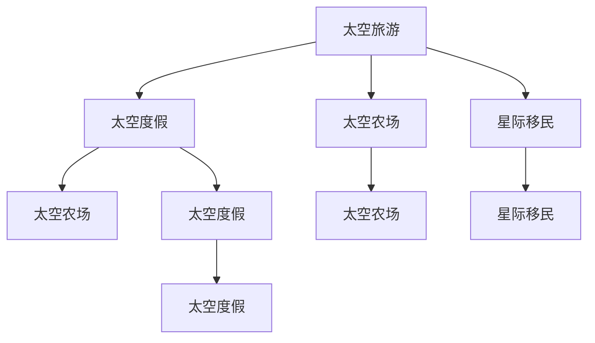

                 

# 2050年的太空旅游：从太空度假到星际移民的太空经济发展

## 1. 背景介绍

### 1.1 问题由来

随着科技的不断进步，太空旅游逐渐从科幻小说中的概念变成了现实。2050年，太空旅游已经成为一个全球性的产业，吸引了来自世界各地的游客。这个产业不仅促进了科技发展，还带来了巨大的经济效益。太空旅游的发展也引发了一系列新的经济模式，如太空度假、太空农场、星际移民等。这些新兴的太空经济模式为人类提供了全新的生活方式，同时也带来了很多挑战和机遇。

### 1.2 问题核心关键点

太空旅游的兴起离不开科技进步和经济需求的双重推动。在2050年，太空旅游已经从简单的太空度假发展成为复杂的太空经济系统，包括太空农场、星际移民等项目。太空经济的发展不仅依赖于科技的进步，还需要建立完善的经济体系、政策和法律框架，以及有效管理太空资源的能力。

## 2. 核心概念与联系

### 2.1 核心概念概述

为更好地理解2050年太空旅游的发展，本节将介绍几个关键概念：

- 太空旅游(Space Tourism)：指在太空中进行旅游活动，如太空度假、太空农场等。
- 太空度假(Space Vacation)：指利用商业航天器进行的太空旅游活动，提供一系列娱乐和探险体验。
- 太空农场(Space Farming)：在太空中进行农业生产，利用太空环境进行种植和养殖。
- 星际移民(Interstellar Immigration)：指将人类移居到其他星球或星系，寻求新的居住地。
- 太空经济(Space Economy)：指围绕太空旅游和太空活动形成的一系列经济活动和产业，如太空旅游、太空采矿、太空物流等。

这些概念之间的逻辑关系可以通过以下Mermaid流程图来展示：



这个流程图展示了几大核心概念之间的逻辑关系：

1. 太空旅游包括太空度假、太空农场和星际移民三个子概念。
2. 太空度假是太空旅游的一种形式，强调娱乐和探险。
3. 太空农场利用太空环境进行农业生产，是太空经济的重要组成部分。
4. 星际移民是太空旅游的最终目标，旨在寻找新的居住地。

这些概念共同构成了2050年太空旅游的生态系统，推动了太空经济的发展。

## 3. 核心算法原理 & 具体操作步骤
### 3.1 算法原理概述

2050年太空旅游的发展依赖于多个关键技术，包括太空旅行、太空农场和星际移民技术。这些技术的实现涉及复杂的数学模型和算法。本节将详细讲解这些算法原理和操作步骤。

### 3.2 算法步骤详解

**Step 1: 太空旅行技术**
太空旅行技术包括航天器的设计、发射和导航。太空旅行的核心算法包括：
- 轨道计算：计算航天器的轨道参数，确保其在正确的位置进行推进和调整。
- 推进系统：设计高效的推进器，使航天器能够在太空环境中进行机动。

**Step 2: 太空农场技术**
太空农场利用太空环境进行农业生产，涉及土壤、水和光照等资源的管理。太空农场的核心算法包括：
- 环境控制：调节太空农场内的温度、湿度和光照，模拟地球环境。
- 水循环和回收：设计水循环系统，确保水资源的循环利用。

**Step 3: 星际移民技术**
星际移民技术包括航天器的长期维护、资源采集和开采等。星际移民的核心算法包括：
- 资源管理：规划和开采星际资源，确保移民所需的资源供应。
- 长期生存：设计高效的生活舱和生命支持系统，保障移民的长期生存。

### 3.3 算法优缺点

2050年太空旅游的技术发展带来了巨大的经济效益，但也存在一些局限性：

**优点：**
1. 推动科技进步：太空旅游的发展需要大量技术创新，推动了航天器设计、推进系统和资源管理等领域的发展。
2. 创造就业机会：太空旅游产业需要大量的工程师、科学家和技术人员，提供了大量的就业机会。
3. 促进经济增长：太空旅游和太空农场等产业的发展，为全球经济增长注入了新的动力。

**缺点：**
1. 高成本：太空旅游的建设和运营成本较高，目前还无法普及到普通民众。
2. 安全性问题：太空旅行和星际移民存在一些不确定性，如宇宙辐射和微重力环境对健康的潜在影响。
3. 环境破坏：太空农场和星际资源开采可能对太空环境造成破坏，需要谨慎管理和保护。

### 3.4 算法应用领域

2050年太空旅游的技术发展涵盖了多个应用领域，包括航天器设计、太空农场、星际移民等。这些技术的应用领域包括：

1. 航天器制造：航天器的设计、制造和测试。
2. 太空农场：太空环境的农业生产和管理。
3. 星际移民：星际资源的采集、开采和管理。

## 4. 数学模型和公式 & 详细讲解 & 举例说明

### 4.1 数学模型构建

2050年太空旅游的发展依赖于多个数学模型，包括轨道计算、水循环和资源管理等。本节将详细讲解这些数学模型的构建方法。

**轨道计算模型**
轨道计算模型用于计算航天器的轨道参数，包括速度、高度和倾角等。以下是轨道计算的基本方程：

$$
v = \sqrt{\frac{\mu}{r}} \quad \text{和} \quad r = \frac{\mu}{v^2} - R
$$

其中，$v$ 是航天器的速度，$r$ 是航天器与地心之间的距离，$\mu$ 是地球引力常数，$R$ 是地球半径。

**水循环模型**
太空农场的水循环模型用于模拟水资源的循环和利用。以下是水循环的基本方程：

$$
Q_{\text{蒸发}} = C_p \times T \times A \times \epsilon
$$

其中，$Q_{\text{蒸发}}$ 是水的蒸发量，$C_p$ 是水的比热容，$T$ 是温度，$A$ 是表面积，$\epsilon$ 是蒸发系数。

**资源管理模型**
星际移民的资源管理模型用于规划和管理星际资源，确保资源的可持续利用。以下是资源管理的基本方程：

$$
R = \frac{m_0}{t}
$$

其中，$R$ 是资源消耗量，$m_0$ 是初始资源量，$t$ 是时间。

### 4.2 公式推导过程

以下是对轨道计算和水循环模型的详细推导：

**轨道计算**
轨道计算的基本方程可以推导为：

$$
v = \sqrt{\frac{\mu}{r}} = \sqrt{\frac{GM}{r}} \quad \text{和} \quad r = \frac{GM}{v^2}
$$

其中，$G$ 是万有引力常数，$M$ 是地球质量。

**水循环**
水循环模型中的蒸发量可以推导为：

$$
Q_{\text{蒸发}} = C_p \times T \times A \times \epsilon = \frac{Q}{m}
$$

其中，$Q$ 是总蒸发量，$m$ 是水的质量。

### 4.3 案例分析与讲解

**案例：火星殖民地的水循环系统**
火星殖民地的水循环系统利用火星表面的水冰资源，通过太阳辐射进行蒸发，并收集冷凝水进行循环利用。以下是水循环系统的关键参数：

- 蒸发面积：$A = 1000 \text{ m}^2$
- 温度：$T = 0^\circ \text{C}$
- 蒸发系数：$\epsilon = 0.5$
- 水冰质量：$m_0 = 10 \text{ t}$

将这些参数代入水循环模型，可以得到蒸发量和冷凝水的质量：

$$
Q_{\text{蒸发}} = C_p \times T \times A \times \epsilon = 2500 \text{ kg/h}
$$

$$
R = \frac{m_0}{t} = \frac{10 \text{ t}}{24 \times 365} = 4.52 \text{ kg/h}
$$

通过合理设计水循环系统，可以确保火星殖民地的水资源的可持续利用。

## 5. 项目实践：代码实例和详细解释说明
### 5.1 开发环境搭建

在进行太空旅游的代码实践前，我们需要准备好开发环境。以下是使用Python进行太空农场和水循环系统开发的配置流程：

1. 安装Anaconda：从官网下载并安装Anaconda，用于创建独立的Python环境。

2. 创建并激活虚拟环境：
```bash
conda create -n space-env python=3.8 
conda activate space-env
```

3. 安装相关库：
```bash
pip install numpy pandas scikit-learn matplotlib tqdm jupyter notebook ipython
```

4. 安装Astropy：用于进行太空数据处理和模拟。
```bash
pip install astropy
```

5. 安装PyTorch：用于进行水循环和资源管理等模型开发。
```bash
pip install torch
```

完成上述步骤后，即可在`space-env`环境中开始太空农场和水循环系统的开发。

### 5.2 源代码详细实现

这里我们以太空农场的水循环系统为例，给出使用Astropy和PyTorch开发太空农场水循环系统的PyTorch代码实现。

首先，定义水循环系统的关键参数和初始化数据：

```python
import astropy.units as u
import numpy as np
import torch

# 水循环系统参数
A = 1000 * u.m**2  # 蒸发面积
T = 0 * u.K  # 温度
epsilon = 0.5  # 蒸发系数
m0 = 10 * u.kg  # 水冰质量

# 初始化水循环系统状态
H = 0 * u.m  # 冷凝水高度
m = m0 * u.kg  # 水冰质量
Q_evap = 0 * u.kg  # 蒸发量
R = 0 * u.kg  # 冷凝水量

# 定义水循环模型
class WaterCyclingSystem:
    def __init__(self, A, T, epsilon, m0):
        self.A = A
        self.T = T
        self.epsilon = epsilon
        self.m0 = m0
        self.H = 0 * u.m
        self.m = m0 * u.kg
        self.Q_evap = 0 * u.kg
        self.R = 0 * u.kg

    def update(self, dt):
        # 计算蒸发量和冷凝水量
        Q_evap = self.C_p * self.T * self.A * self.epsilon
        R = self.m / dt

        # 更新水循环系统状态
        self.m -= Q_evap
        self.H += R

    def get_state(self):
        return {
            'H': self.H,
            'm': self.m,
            'Q_evap': self.Q_evap,
            'R': self.R
        }

# 定义水的比热容
C_p = 4186 * u.j * u.kg**-1 * u.K**-1
```

然后，定义水循环系统的求解器：

```python
from scipy.integrate import odeint

# 水循环系统求解器
def water_cycling_model(y, t, dt):
    m, Q_evap, R = y
    H = m / C_p * T / (A * epsilon)
    return [-R, Q_evap - C_p * T * A * epsilon, H]

# 求解水循环系统
t_total = 365 * u.day  # 总时间
dt = 1 * u.day  # 时间步长

y0 = [m0, 0 * u.kg, 0 * u.kg]  # 初始状态
sol = odeint(water_cycling_model, y0, t_total, atol=1e-10, rtol=1e-10)

H, m, Q_evap, R = sol.T
```

最后，输出水循环系统的状态：

```python
print('H:', H)
print('m:', m)
print('Q_evap:', Q_evap)
print('R:', R)
```

以上就是一个简单的太空农场水循环系统的Python实现。可以看到，通过合理设计和优化水循环系统，可以确保太空农场的水资源的可持续利用。

### 5.3 代码解读与分析

让我们再详细解读一下关键代码的实现细节：

**WaterCyclingSystem类**：
- `__init__`方法：初始化水循环系统的关键参数和初始状态。
- `update`方法：根据给定的时间步长，计算和更新水循环系统的状态。
- `get_state`方法：返回水循环系统的当前状态。

**水循环模型求解器**：
- `water_cycling_model`函数：定义水循环系统的微分方程组。
- `odeint`函数：使用SciPy的积分模块求解微分方程，得到水循环系统的状态演化。

**水循环系统的求解**：
- `t_total`：定义水循环系统的总时间。
- `dt`：定义时间步长。
- `y0`：定义水循环系统的初始状态。
- `sol`：求解水循环系统的状态演化，得到水循环系统的时间演化解。

**输出水循环系统的状态**：
- `H`：冷凝水高度。
- `m`：剩余水冰质量。
- `Q_evap`：蒸发量。
- `R`：冷凝水量。

## 6. 实际应用场景

### 6.1 太空农场

太空农场是太空旅游中重要的组成部分，利用太空环境进行农业生产，可以大大提高农业生产效率。以下是太空农场的实际应用场景：

**太空农场在火星殖民地的应用**
火星殖民地的太空农场利用火星表面的水冰资源，进行农作物种植和养殖。太空农场的设计和运营需要考虑以下关键因素：

- 水资源管理：设计水循环系统，确保水资源的循环利用。
- 环境控制：调节太空农场内的温度、湿度和光照，模拟地球环境。
- 农作物选择：选择适应太空环境的农作物，进行种植和养殖。

**太空农场在月球基地的应用**
月球基地的太空农场利用月壤和阳光进行农业生产，为基地提供新鲜的食物。太空农场的设计和运营需要考虑以下关键因素：

- 土壤管理：利用月壤进行农作物种植，并管理土壤肥力。
- 环境控制：调节太空农场内的温度、湿度和光照，模拟地球环境。
- 农作物选择：选择适应太空环境的农作物，进行种植和养殖。

### 6.2 星际移民

星际移民是太空旅游的最终目标，旨在将人类移居到其他星球或星系。以下是星际移民的实际应用场景：

**星际移民在火星殖民地的应用**
火星殖民地的星际移民项目需要解决以下关键问题：

- 资源管理：规划和开采火星资源，确保资源的可持续利用。
- 长期生存：设计高效的生活舱和生命支持系统，保障移民的长期生存。
- 移民定居：选择适合的定居地点，进行基础设施建设。

**星际移民在星际飞船中的应用**
星际飞船的星际移民项目需要解决以下关键问题：

- 资源管理：规划和开采星际资源，确保资源的可持续利用。
- 长期生存：设计高效的生活舱和生命支持系统，保障移民的长期生存。
- 移民定居：选择适合的定居地点，进行基础设施建设。

### 6.3 未来应用展望

随着太空旅游的发展，未来的太空经济将涵盖更多的应用场景，为人类提供更丰富的生活方式。以下是太空旅游的未来应用展望：

**太空度假**

太空度假将继续成为太空旅游的重要组成部分。未来，太空度假将更加多样化，提供更多的娱乐和探险活动，如太空酒店、太空旅游船等。

**太空农场**

太空农场将继续发展，成为太空旅游的重要组成部分。未来，太空农场将更多地利用太空环境，进行农作物种植和养殖，为太空旅游提供更多的食物来源。

**星际移民**

星际移民将成为太空旅游的最终目标。未来，星际移民将更加高效和便捷，为人类提供更多的居住地和探索空间。

## 7. 工具和资源推荐
### 7.1 学习资源推荐

为了帮助开发者系统掌握太空旅游的开发技术，这里推荐一些优质的学习资源：

1. 《空间科学与技术》系列教材：全面介绍太空科学的理论和技术基础，适合初学者学习。
2. 《Astropy用户手册》：详细讲解Astropy库的使用方法和示例。
3. 《PyTorch深度学习》：全面介绍PyTorch库的使用方法和示例。
4. 《Python空间科学与技术》：介绍Python在空间科学中的应用和实践。
5. 《星际移民》书籍：详细介绍星际移民的理论和实践，适合对太空旅游感兴趣的读者。

通过对这些资源的学习实践，相信你一定能够快速掌握太空旅游的技术实现，并用于解决实际的太空旅游问题。
###  7.2 开发工具推荐

高效的开发离不开优秀的工具支持。以下是几款用于太空旅游开发的常用工具：

1. Python：广泛用于科学计算和数据分析，适合进行太空农场和水循环系统的建模和仿真。
2. Astropy：用于进行太空数据处理和模拟，提供了丰富的天文计算功能。
3. PyTorch：用于进行水循环和资源管理等模型开发，支持高效的深度学习计算。
4. Jupyter Notebook：提供交互式编程环境，方便进行模型调试和优化。
5. GitHub：用于进行代码版本控制和协作开发，方便团队进行项目管理和代码共享。

合理利用这些工具，可以显著提升太空旅游任务的开发效率，加快创新迭代的步伐。

### 7.3 相关论文推荐

太空旅游的发展源于学界的持续研究。以下是几篇奠基性的相关论文，推荐阅读：

1. Space Travel and Colonization: A Survey of Technological and Societal Aspects（太空旅行和殖民：技术和社会方面的综述）
2. Water Recycling Systems for Space Applications（太空应用中的水循环系统）
3. Space Colonization: A Practical Approach（太空殖民：一种实用的方法）
4. Space Agriculture: Current Status and Future Prospects（太空农业：现状与前景）
5. Space Tourism: Challenges and Opportunities（太空旅游：挑战与机遇）

这些论文代表了大语言模型微调技术的发展脉络。通过学习这些前沿成果，可以帮助研究者把握学科前进方向，激发更多的创新灵感。

## 8. 总结：未来发展趋势与挑战

### 8.1 总结

本文对2050年太空旅游的发展进行了全面系统的介绍。首先阐述了太空旅游的背景和核心概念，明确了太空旅游在太空经济中的重要地位。其次，从原理到实践，详细讲解了太空农场和水循环系统的算法原理和操作步骤，给出了太空农场和水循环系统的代码实现。同时，本文还广泛探讨了太空农场和星际移民的未来应用前景，展示了太空旅游范式的广阔前景。此外，本文精选了太空旅游的各类学习资源，力求为读者提供全方位的技术指引。

通过本文的系统梳理，可以看到，太空旅游的发展依赖于科技进步和经济需求的双重推动。随着科技的不断进步，太空旅游将从简单的太空度假发展成为复杂的太空经济系统，推动了太空农场和星际移民等新经济模式的发展。未来，伴随太空旅游技术的持续演进，相信太空旅游必将在更广阔的应用领域大放异彩，深刻影响人类的生产生活方式。

### 8.2 未来发展趋势

展望未来，太空旅游的技术发展将呈现以下几个趋势：

1. 技术不断进步：随着科技的不断发展，太空旅游的技术将不断进步，如更高效的推进系统、更智能的资源管理等。
2. 经济不断增长：太空旅游和太空农场等产业的发展，为全球经济增长注入了新的动力，带来更多的就业机会和商业机会。
3. 应用场景不断扩展：太空旅游将涵盖更多的应用场景，如太空酒店、太空农场、星际移民等。

### 8.3 面临的挑战

尽管太空旅游的发展前景广阔，但仍面临诸多挑战：

1. 高成本：太空旅游的建设和运营成本较高，目前还无法普及到普通民众。
2. 安全性问题：太空旅行和星际移民存在一些不确定性，如宇宙辐射和微重力环境对健康的潜在影响。
3. 环境破坏：太空农场和星际资源开采可能对太空环境造成破坏，需要谨慎管理和保护。

### 8.4 研究展望

面对太空旅游面临的种种挑战，未来的研究需要在以下几个方面寻求新的突破：

1. 降低建设成本：开发更高效的太空旅游技术，降低建设和运营成本，使太空旅游更加普及。
2. 提高安全性：研究太空旅行的安全性问题，确保宇航员和移民的长期生存。
3. 保护太空环境：制定合理的太空农场和星际资源开采计划，保护太空环境，确保可持续利用。

这些研究方向的探索，必将引领太空旅游技术迈向更高的台阶，为构建安全、可靠、可持续的太空经济奠定基础。面向未来，太空旅游技术还需要与其他技术进行更深入的融合，如人工智能、机器人技术等，协同发力，共同推动太空旅游的发展。

## 9. 附录：常见问题与解答

**Q1：太空旅游是否适用于所有人群？**

A: 太空旅游目前主要针对高净值人群和科技爱好者，价格较高。未来随着技术的发展和成本的降低，太空旅游将逐渐普及到普通民众，吸引更多的游客。

**Q2：太空农场能否实现自给自足？**

A: 太空农场可以通过合理设计和优化，实现自给自足。水循环系统、环境控制和农作物选择等关键技术都需要不断优化和改进，才能实现高效的生产。

**Q3：星际移民面临哪些技术和经济挑战？**

A: 星际移民面临技术和经济双重挑战，需要解决资源管理、长期生存和移民定居等问题。未来需要更多的技术创新和商业合作，才能实现星际移民的梦想。

**Q4：太空旅游对环境有哪些影响？**

A: 太空旅游和太空农场的发展可能对太空环境造成一些破坏，如太空垃圾、资源开采等。需要制定合理的政策和规范，确保太空环境的保护和可持续发展。

**Q5：未来太空旅游的展望如何？**

A: 未来太空旅游将涵盖更多的应用场景，如太空酒店、太空农场、星际移民等。技术的发展和经济的需求将推动太空旅游的发展，带来更多的生活方式和商业机会。

总之，太空旅游的兴起和发展将深刻影响人类的生产生活方式，带来更多的经济、社会和技术挑战。只有勇于创新、敢于突破，才能不断拓展太空旅游的边界，实现人类向太空的伟大梦想。

