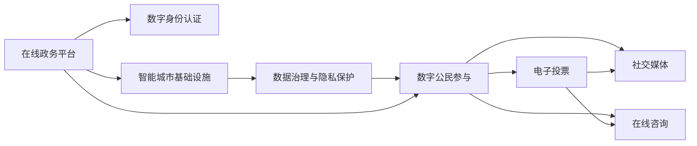
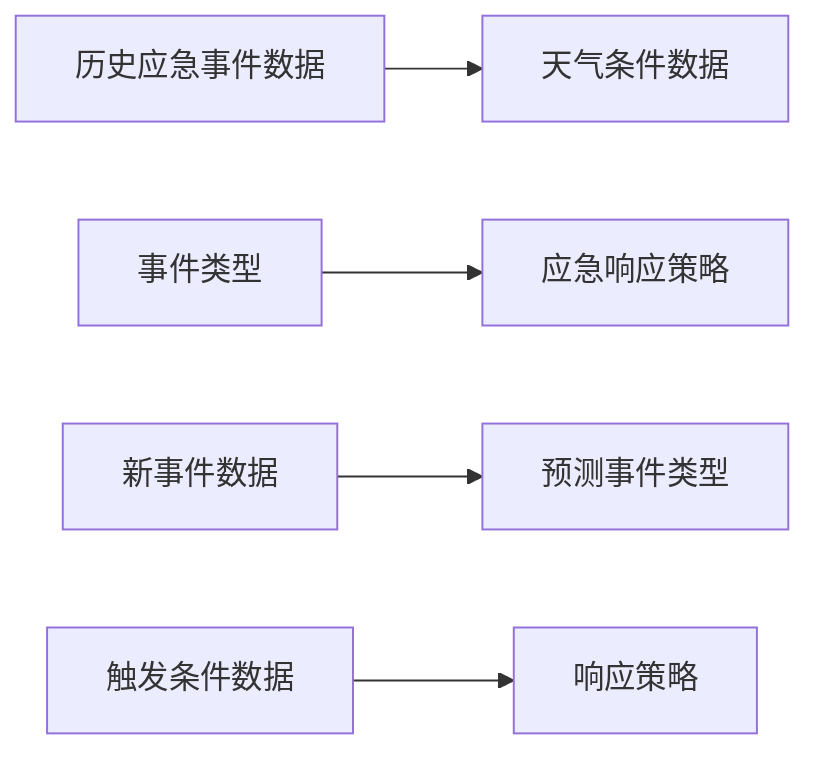

                 

## 1. 背景介绍

### 1.1 问题由来
随着数字技术在政府治理和社会管理中的应用日益深入，在线政务、数字身份、智能城市等数字治理模式正在重塑社会生活格局。从2050年回望，我们将看到一个以数据为核心、以算法为支撑、以公民为中心的全新治理体系。这个体系将借助数字技术，打通行政、经济、社会等领域的壁垒，实现智能决策、透明监管、高效服务，真正实现数字民主。

### 1.2 问题核心关键点
数字治理的核心在于构建一个多维融合的数字生态系统，将政府、市场、社会等各方的力量整合在一起，实现共建共治共享。该系统的核心组成部分包括在线政务平台、数字身份认证系统、智能城市基础设施、数据治理与隐私保护机制等。这些关键技术的集成应用，将促进民主参与、提升治理效率、保障公民权益，开启数字时代的民主新篇章。

### 1.3 问题研究意义
研究2050年数字治理范式，对推动政府治理数字化转型、构建智慧型社会、促进数字公民参与具有重要意义：

1. **提升治理效能**：通过数字化手段，打破信息孤岛，实现资源整合，优化行政流程，提升公共服务的质量和效率。
2. **促进数字民主**：提供便捷、透明的公共参与渠道，让更多公民参与决策过程，提升政府透明度和公信力。
3. **保障数据安全**：构建完善的数据治理和隐私保护机制，确保公民隐私不受侵犯，维护数字社会的公正与安全。
4. **驱动产业创新**：推动数字技术在各行业的深度应用，促进新业态和新模式的发展，带动经济社会全面转型。

## 2. 核心概念与联系

### 2.1 核心概念概述

为了更好地理解数字治理的核心概念，本节将介绍几个关键概念及其相互之间的联系：

- **在线政务平台**：政府通过互联网提供的公共服务与信息公开平台，涵盖政务办理、信息发布、互动交流等功能，是数字治理的基础设施。
- **数字身份认证系统**：通过数字技术实现身份验证与认证，保证用户身份的真实性和安全性，是数字治理的核心安全保障。
- **智能城市基础设施**：基于物联网、大数据、人工智能等技术，构建智能交通、智慧能源、环境监测等系统，提升城市管理水平。
- **数据治理与隐私保护机制**：建立数据收集、存储、处理、共享的标准与规范，确保数据的安全与隐私，促进数据的开放与共享。
- **数字公民参与**：通过数字技术，如电子投票、社交媒体、在线咨询等，让公民广泛参与到社会治理和公共决策中，提升民主参与度。

这些核心概念之间通过数字化手段紧密连接，共同构成数字治理的生态系统，推动社会治理体系和治理能力现代化。

### 2.2 核心概念原理和架构的 Mermaid 流程图



这个流程图展示了在线政务平台、数字身份认证系统、智能城市基础设施、数据治理与隐私保护机制以及数字公民参与等核心概念之间的相互关系和作用路径。

## 3. 核心算法原理 & 具体操作步骤
### 3.1 算法原理概述

数字治理的实现依赖于一系列复杂的算法和模型，包括但不限于：

- **自然语言处理(NLP)**：用于分析和处理用户提交的自然语言文本，提取关键信息，辅助决策。
- **机器学习与深度学习**：通过算法学习历史数据，预测未来趋势，优化决策模型。
- **数据挖掘与知识图谱**：从海量数据中挖掘有价值的信息，构建知识图谱，辅助决策。
- **人工智能与优化算法**：利用算法优化城市管理、资源配置、应急响应等。

这些算法共同作用，构建了一个多层次、多维度的治理体系，实现了智能决策、透明监管、高效服务。

### 3.2 算法步骤详解

以下是数字治理的主要算法步骤：

1. **数据收集与预处理**：收集政府、企业、社会等多源数据，并进行清洗、标注、归一化等预处理工作。

2. **数据建模与分析**：利用NLP、机器学习等技术，对数据进行建模与分析，提取关键特征与模式。

3. **算法训练与优化**：根据分析结果，设计并训练适合的算法模型，如分类、回归、聚类等，优化模型参数。

4. **模型评估与验证**：在验证集上评估模型性能，调整模型参数，确保模型的准确性和鲁棒性。

5. **模型部署与应用**：将训练好的模型部署到在线政务平台、智能城市基础设施等场景中，提供实时服务与决策支持。

### 3.3 算法优缺点

数字治理的算法体系具有以下优点：

- **高效性**：通过算法自动化处理大量数据，显著提升决策速度与效率。
- **准确性**：利用机器学习等先进技术，提高预测与决策的准确性。
- **透明性**：算法模型与决策过程可解释，提升政府透明度。
- **灵活性**：算法可快速调整与更新，适应不断变化的社会环境。

同时，也存在一些局限：

- **依赖数据质量**：算法的效果高度依赖于输入数据的质量与完整性。
- **模型复杂度**：复杂算法可能难以解释，增加决策的复杂性。
- **算法偏见**：算法可能继承或放大数据中的偏见，影响决策的公正性。
- **安全风险**：算法模型可能被攻击或滥用，带来安全风险。

### 3.4 算法应用领域

数字治理的算法体系在多个领域都有广泛应用：

- **城市管理**：利用智能交通、智慧能源、环境监测等系统，优化城市运行效率。
- **公共安全**：通过数据分析与机器学习，提升应急响应与灾害预警能力。
- **环境保护**：利用遥感、物联网等技术，监测环境变化，保护生态系统。
- **公共卫生**：通过数据分析与模型预测，提高疾病防控与医疗服务水平。
- **社会治理**：通过电子投票、在线咨询等工具，促进公民参与，提升政府透明度。

## 4. 数学模型和公式 & 详细讲解 & 举例说明

### 4.1 数学模型构建

数字治理的数学模型通常基于以下框架：

1. **输入层**：数据预处理与特征提取。
2. **中间层**：模型训练与参数优化。
3. **输出层**：决策支持与结果评估。

### 4.2 公式推导过程

以公共安全领域的应急响应为例，我们推导一下其数学模型：

设 $X$ 为历史应急事件数据集，$Y$ 为事件类型标签，$Z$ 为触发条件数据集，$A$ 为应急响应策略库。目标是根据 $X$ 和 $Z$，预测未来事件类型 $Y'$ 并制定最优响应策略 $A'$。

数学模型为：

$$
Y' = f(X, Z; \theta) \\
A' = g(Y', A; \phi)
$$

其中 $f$ 为预测模型，$\theta$ 为模型参数；$g$ 为策略制定模型，$\phi$ 为策略参数。

### 4.3 案例分析与讲解

在公共安全领域，某城市利用机器学习算法对历史应急事件数据进行分析，发现不同天气条件对事故发生频率的影响，如图：



通过机器学习模型，可以构建事件类型与天气条件之间的关系，实时预测新事件的类型，并根据预测结果调用相应的应急响应策略。

## 5. 项目实践：代码实例和详细解释说明

### 5.1 开发环境搭建

以下是在Python环境下搭建数字治理系统所需环境的详细步骤：

1. 安装Python：
```bash
sudo apt-get update
sudo apt-get install python3-pip
```

2. 创建虚拟环境：
```bash
python3 -m venv venv
source venv/bin/activate
```

3. 安装依赖库：
```bash
pip install numpy pandas scikit-learn transformers torch
```

4. 安装数据集处理工具：
```bash
pip install torchtext gensim
```

5. 安装在线政务平台及智能城市基础设施的开发工具：
```bash
pip install flask
pip install plotly
```

### 5.2 源代码详细实现

以下是一个简单的在线政务平台后端服务实现代码：

```python
from flask import Flask, request, jsonify
import torch
import torchtext
from transformers import BertForSequenceClassification, BertTokenizer

app = Flask(__name__)

# 加载预训练模型和分词器
model = BertForSequenceClassification.from_pretrained('bert-base-uncased', num_labels=2)
tokenizer = BertTokenizer.from_pretrained('bert-base-uncased')

# 数据加载
train_data, test_data = torchtext.datasets.BigQueryDataset.splits(
    'https://console.cloud.google.com/bigquery?p=bigquery-public-data&d=samples&t=natality', 
    train='train', test='test', fields=['baby_name', 'mother_age', 'num_babies', 'baby_gender'])

# 数据预处理
def preprocess(text):
    tokens = tokenizer.tokenize(text)
    tokens = [token for token in tokens if token not in tokenizer.mask_token]
    return tokenizer.encode(tokens, add_special_tokens=True, max_length=512)

# 模型预测
@app.route('/predict', methods=['POST'])
def predict():
    data = request.get_json()
    text = data['text']
    tokens = preprocess(text)
    inputs = tokenizer.convert_ids_to_tokens(tokens)
    logits = model(torch.tensor(tokens))
    prediction = torch.argmax(logits, dim=1).tolist()[0]
    return jsonify(prediction)

if __name__ == '__main__':
    app.run(host='0.0.0.0', port=5000)
```

### 5.3 代码解读与分析

以上代码实现了一个基于Bert模型的在线政务平台后端服务，该服务可用于自然语言处理和决策支持。代码中，我们首先加载了预训练的Bert模型和分词器，然后加载了数据集并进行了预处理。在API端点`/predict`中，接收文本输入，进行预处理并调用模型进行预测，最终返回预测结果。

## 6. 实际应用场景

### 6.1 智慧医疗

在智慧医疗领域，数字治理技术能够帮助医疗机构提升效率和精准度。通过智能诊断系统、电子病历管理系统、远程医疗平台等应用，医疗机构可以实时监控患者数据，提供个性化的医疗服务。

具体应用包括：

- **智能诊断**：利用NLP和深度学习技术，分析病历记录，辅助医生进行疾病诊断。
- **电子病历**：通过电子化病历管理，提高病历查询和共享效率。
- **远程医疗**：通过在线问诊、医疗咨询等平台，实现远程医疗服务。

### 6.2 智慧教育

在智慧教育领域，数字治理技术能够促进教育公平和个性化教育的发展。通过在线学习平台、智能辅导系统、教育数据分析等应用，教育机构可以更好地支持学生的学习需求。

具体应用包括：

- **在线学习**：利用在线课程、智能推荐系统，提供个性化学习路径。
- **智能辅导**：通过智能辅导系统，实时回答学生问题，提供个性化的学习支持。
- **教育数据分析**：通过数据分析，了解学生学习行为，优化教学策略。

### 6.3 智慧城市

在智慧城市领域，数字治理技术能够提升城市管理效率和居民生活质量。通过智能交通、智慧能源、环境监测等应用，城市管理者可以实时监控城市运行状况，优化资源配置。

具体应用包括：

- **智能交通**：通过智能交通系统，优化交通流量，减少拥堵。
- **智慧能源**：通过智能电网、可再生能源管理系统，提高能源利用效率。
- **环境监测**：通过遥感技术、环境监测系统，实时监测环境变化，保护生态环境。

### 6.4 未来应用展望

展望未来，数字治理技术将进一步深化应用，提升治理效能和公民参与度。以下是几个重要的发展趋势：

1. **全场景数字治理**：数字治理将覆盖更多行业和领域，形成全场景的数字生态系统，实现跨行业的协同治理。
2. **数据驱动决策**：数据将成为决策的主要依据，通过大数据分析，实现科学决策和精准治理。
3. **智能交互体验**：通过智能语音交互、虚拟现实等技术，提升用户交互体验，促进数字公民参与。
4. **隐私保护与安全**：建立完善的隐私保护机制，确保数据安全与隐私，提升公众信任度。
5. **跨领域融合**：促进数字治理与区块链、物联网、5G等新技术的深度融合，推动治理体系全面升级。

## 7. 工具和资源推荐

### 7.1 学习资源推荐

以下是几个推荐的数字治理学习资源，帮助你掌握相关技术和方法：

1. **《数据治理与隐私保护》书籍**：详细介绍了数据治理的基本概念、技术和策略，是数字治理的入门读物。
2. **Coursera《数字治理与公共管理》课程**：由斯坦福大学开设，涵盖数字治理的多个方面，包括电子政务、智能城市、数据治理等。
3. **Kaggle数据竞赛**：通过参与Kaggle的数据竞赛，实践数字治理相关的算法与技术。
4. **GitHub开源项目**：通过阅读和参与GitHub上的开源项目，了解数字治理技术的实际应用。
5. **政府公开数据**：访问政府公开数据平台，了解政府数据开放和共享的政策与实践。

### 7.2 开发工具推荐

以下是几个推荐的数字治理开发工具，提高开发效率和质量：

1. **Jupyter Notebook**：支持Python、R等语言，集成了数据处理、可视化、编程于一体，适合数据分析与模型开发。
2. **Python VSCode**：基于VSCode的Python开发环境，提供丰富的插件和扩展，提高开发效率。
3. **AWS云平台**：提供全面的云计算服务，支持数据存储、计算、分析等，适合大规模数据处理。
4. **Tableau**：数据可视化工具，支持多种数据源，提供丰富的图表和仪表盘，便于数据展示与分析。
5. **TensorFlow**：深度学习框架，支持多种模型和算法，适合复杂数据分析与预测。

### 7.3 相关论文推荐

以下是几篇关于数字治理的经典论文，推荐阅读：

1. **《数据治理与隐私保护框架》**：提出了数据治理与隐私保护的基本框架，包括数据质量管理、数据访问控制、隐私保护等。
2. **《智慧城市治理的计算模型》**：利用计算模型研究智慧城市治理问题，提出了一套智能决策的框架。
3. **《数字治理与公民参与》**：探讨了数字治理与公民参与的关系，提出了一套促进公民参与的机制。
4. **《公共安全与应急响应》**：研究了公共安全与应急响应的数学模型，提出了一套优化应急响应策略的方法。

## 8. 总结：未来发展趋势与挑战

### 8.1 总结

数字治理技术的快速发展，正在推动政府治理的数字化转型，构建智慧型社会，提升数字公民参与度。本文系统介绍了数字治理的核心概念、算法原理、操作步骤和实际应用，展示了大规模数据驱动决策的巨大潜力。未来，数字治理将与人工智能、区块链、物联网等技术深度融合，开启智能治理的新时代。

### 8.2 未来发展趋势

展望未来，数字治理将呈现以下趋势：

1. **智能决策的普及**：基于大数据和AI技术，实现更加智能、高效的决策支持系统，优化资源配置，提升治理效率。
2. **数据治理的成熟**：建立完善的数据治理机制，确保数据质量与安全，实现数据的开放与共享。
3. **跨领域融合的深化**：数字治理技术与更多新兴技术的融合，推动治理体系的全面升级。
4. **数字公民的全面参与**：通过智能交互和公民参与平台，提升公众对数字治理的参与度与信任度。
5. **全球治理的协作**：数字治理技术在全球范围内的应用与合作，促进全球治理体系的现代化。

### 8.3 面临的挑战

尽管数字治理技术发展迅速，但仍面临一些挑战：

1. **数据隐私与安全的保障**：如何在保障数据安全与隐私的同时，实现数据的开放与共享。
2. **技术复杂性与可解释性**：复杂的算法模型可能难以解释，影响决策的透明性与可接受性。
3. **跨领域协同的障碍**：不同领域的治理体系与技术标准存在差异，如何实现协同治理是一个难题。
4. **技术普及与接受度**：如何普及数字治理技术，提升公众对新技术的接受度与信任度。
5. **资金与资源的投入**：数字治理技术的应用需要大量资金与资源支持，如何有效投入与分配是一个挑战。

### 8.4 研究展望

为了应对这些挑战，未来研究需要在以下几个方面进行探索：

1. **隐私保护技术的突破**：开发更加高效、安全的隐私保护技术，确保数据在开放共享过程中的安全。
2. **算法模型的可解释性**：研究可解释性更强的算法模型，提升决策的透明性与可接受性。
3. **跨领域治理的协同**：探索跨领域治理的协同机制，促进不同治理体系与技术的深度融合。
4. **技术普及与推广**：加强对公众的数字治理教育与培训，提高数字治理技术的普及度和接受度。
5. **资源配置与优化**：研究资源配置与优化的新方法，提升数字治理技术的经济效益与社会效益。

## 9. 附录：常见问题与解答

### Q1: 数字治理中的数据隐私如何保障？

A: 数据隐私保障是数字治理中的重要问题。主要手段包括：

1. **数据匿名化**：对数据进行去标识化处理，保护用户隐私。
2. **数据加密**：对敏感数据进行加密存储与传输，防止数据泄露。
3. **访问控制**：设置严格的访问权限，确保数据仅被授权人员访问。
4. **隐私保护技术**：如差分隐私、联邦学习等，在不破坏数据隐私的前提下，实现数据的开放与共享。

### Q2: 数字治理中的算法偏见如何避免？

A: 算法偏见是数字治理中需要关注的重要问题。主要手段包括：

1. **数据多样性**：收集多样化的数据，减少数据偏见。
2. **算法公平性**：设计公平性更高的算法模型，避免算法偏见。
3. **模型解释**：增加模型可解释性，帮助发现并修正算法偏见。
4. **人工审核**：引入人工审核机制，检查模型输出与实际结果的一致性。

### Q3: 数字治理的资源配置与优化有哪些方法？

A: 资源配置与优化是数字治理中的重要问题。主要手段包括：

1. **资源池化**：将不同来源的资源进行整合，实现资源的高效利用。
2. **需求预测**：利用算法预测资源需求，优化资源分配。
3. **弹性调度**：根据需求变化，动态调整资源配置。
4. **云资源利用**：利用云计算平台，按需扩展与缩减资源。

### Q4: 数字治理的算法模型如何进行可解释性研究？

A: 可解释性是数字治理中需要关注的重要问题。主要手段包括：

1. **模型透明性**：设计透明的模型结构，便于理解模型决策过程。
2. **特征可解释**：解释模型输入与输出之间的关系，帮助理解模型的决策逻辑。
3. **可视化工具**：利用可视化工具，展示模型内部运作机制。
4. **多模型融合**：结合多个模型的输出结果，提高决策的准确性与可解释性。

### Q5: 数字治理中的跨领域协同有哪些挑战？

A: 跨领域协同是数字治理中的重要挑战。主要挑战包括：

1. **标准不一**：不同领域的治理体系与技术标准存在差异，难以实现协同。
2. **数据共享**：不同领域的数据格式与标准不同，难以实现数据的共享与融合。
3. **系统互操作**：不同系统的接口与协议不统一，难以实现系统的互操作。
4. **政策与法规**：不同领域的治理政策与法规存在差异，需要协调统一。
5. **协同机制**：缺乏有效的协同机制，难以实现跨领域的协同治理。

### Q6: 数字治理中的算法复杂性与可解释性如何平衡？

A: 算法复杂性与可解释性是数字治理中需要平衡的重要问题。主要方法包括：

1. **简化模型**：设计简洁的模型结构，减少复杂性。
2. **特征选择**：选择重要的特征，去除冗余特征，提高模型可解释性。
3. **模型解释**：利用模型解释技术，帮助理解模型决策过程。
4. **多模型集成**：结合多个简单的模型，提升决策的准确性与可解释性。

综上所述，数字治理技术正处于快速发展阶段，其在智慧医疗、智慧教育、智慧城市等多个领域具有广泛的应用前景。通过构建多维融合的数字治理生态系统，实现智能决策、透明监管、高效服务，数字治理将推动社会治理体系和治理能力现代化，为数字时代的民主治理提供新的范式。

