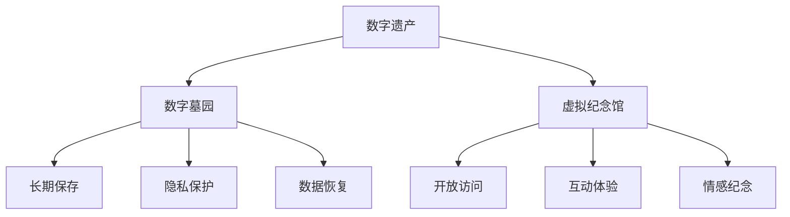

                 

# 2050年的数字遗产：从数字墓园到虚拟纪念馆的记忆传承

## 1. 背景介绍

### 1.1 问题由来
随着数字技术的飞速发展，人类的数字化生存方式日益普及。互联网、智能手机、社交媒体等数字技术已经深刻地改变了我们的生活方式。但与此同时，一个严肃的问题也随之而来：当我们在虚拟世界留下大量数字足迹后，这些数据应该如何处理？如何确保数字遗产的传承，同时保护个人隐私和信息安全？

### 1.2 问题核心关键点
数字遗产问题集中在以下几个方面：

- 数据存储与备份：如何长期保存数字遗产，确保数据不丢失？
- 数据安全与隐私：如何保护数据不被非法访问或泄露？
- 数据分享与传承：如何合理利用数据，确保信息既能传承又能被合理使用？
- 数字墓园与虚拟纪念馆：如何建立数字纪念系统，尊重死者与生者的情感需要？

这些关键问题，不仅涉及技术层面的挑战，还需要伦理、法律等多维度的考量。因此，本文章将从技术、伦理和法律等多个维度出发，探讨数字遗产的处理方式，特别是数字墓园与虚拟纪念馆的构建，从而确保数字记忆的妥善传承。

## 2. 核心概念与联系

### 2.1 核心概念概述

为更好地理解数字遗产的处理方式，本节将介绍几个关键概念：

- 数字遗产(Digital Legacy)：指个体在数字世界中留下的所有数据和信息，包括照片、视频、电子邮件、社交媒体记录等。
- 数字墓园(Digital Graveyard)：指用于存储和保护数字遗产的长期保存设施，可以是云存储、分布式文件系统、区块链等。
- 虚拟纪念馆(Virtual Memorial)：指利用数字技术构建的纪念系统，用于保存和展示数字遗产，便于亲友及社会公众的访问和纪念。

### 2.2 核心概念原理和架构的 Mermaid 流程图


这个流程图展示了数字遗产的流向关系：

1. 数字遗产通过数字墓园长期保存。
2. 数字遗产在虚拟纪念馆进行展示。
3. 数字遗产的数据恢复功能确保历史信息的完整性。
4. 数字遗产的隐私保护机制防止数据泄露。
5. 数字遗产的开放访问和互动体验增加亲友及公众的参与度。
6. 数字遗产的情感纪念功能尊重生者与死者的情感需求。

## 3. 核心算法原理 & 具体操作步骤
### 3.1 算法原理概述

数字遗产的处理，本质上是一个数据管理和保护的过程。其核心思想是利用先进的数据管理和保护技术，对数字遗产进行长期保存、安全防护和合理传承。这一过程通常包括以下几个关键步骤：

- **数据备份与存储**：确保数字遗产的完整性，防止数据丢失。
- **数据加密与访问控制**：保护数字遗产的隐私和安全性，防止未经授权的访问。
- **数据恢复与修复**：确保数字遗产的长期可用性，防止数据损坏。
- **数据分享与传承**：合理利用数字遗产，确保信息的妥善传承。

### 3.2 算法步骤详解

数字遗产的处理通常包括以下几个关键步骤：

**Step 1: 数据备份与存储**
- 选择合适的数据备份策略，如完全备份、增量备份、差异备份等。
- 使用高性能的存储系统，如分布式文件系统、对象存储、云存储等，确保数据长期保存。

**Step 2: 数据加密与访问控制**
- 使用高级加密算法（如AES、RSA等）对数字遗产进行加密，确保数据在传输和存储过程中的安全性。
- 设定合理的访问权限，如细粒度的访问控制列表(ACL)、基于角色的访问控制(RBAC)等，确保只有授权人员才能访问数据。

**Step 3: 数据恢复与修复**
- 定期进行数据备份，确保数据在发生损坏或丢失时能够快速恢复。
- 使用数据修复工具，如文件碎片修复、磁盘修复、数据恢复软件等，对损坏的数据进行修复。

**Step 4: 数据分享与传承**
- 建立数据分享机制，如通过云存储服务、社交媒体平台等，方便亲友和公众的访问。
- 设计互动体验和情感纪念功能，如虚拟纪念馆、数字墓园等，增强亲友和公众的参与度。

### 3.3 算法优缺点

数字遗产处理技术具有以下优点：

- 数据长期保存：通过备份和加密，确保数据长期保存，防止数据丢失和损坏。
- 数据安全性高：通过高级加密和访问控制，确保数据安全性，防止非法访问和数据泄露。
- 数据恢复能力强：通过备份和修复，确保数据能够快速恢复，保证数据的完整性。
- 数据传承合理：通过分享和互动体验，确保数字遗产能够被合理传承，满足亲友和公众的情感需求。

同时，该方法也存在一些局限性：

- 数据存储成本高：高存储需求可能导致高昂的成本。
- 技术复杂度高：需要专业技术和复杂的管理机制，确保数据安全。
- 数据隐私保护难以彻底：高级加密和访问控制可以显著提升安全性，但无法完全消除数据泄露的风险。
- 数据传承可能不够完善：尽管通过互动体验和情感纪念，可以增强传承效果，但仍可能存在不足。

尽管存在这些局限性，但数字遗产处理技术在保障数字遗产完整性和安全性方面，仍具有不可替代的价值。未来相关研究的重点在于如何进一步降低存储成本，提高数据恢复效率，同时兼顾隐私保护和传承效果。

### 3.4 算法应用领域

数字遗产处理技术已经在许多领域得到应用，包括：

- 个人数字遗产管理：个人可以使用数字墓园和虚拟纪念馆保存和管理自己的数字遗产。
- 家族数字遗产传承：家族可以通过数字墓园和虚拟纪念馆传承数字遗产，纪念逝去的亲友。
- 企业数据管理：企业可以通过数字墓园和虚拟纪念馆管理员工的数据，保障数据安全。
- 社交媒体数据保护：社交媒体平台可以通过数字墓园和虚拟纪念馆保护用户数据，防止数据泄露。

此外，数字遗产处理技术还在博物馆、档案馆、图书馆等文化保护领域，以及政府、医疗、教育等公共服务领域得到了广泛应用。随着数字技术的发展，数字遗产处理技术将越来越普及，成为人们数字化生活的重要组成部分。

## 4. 数学模型和公式 & 详细讲解 & 举例说明
### 4.1 数学模型构建

数字遗产处理的核心在于数据管理和保护。本节将使用数学语言对数字遗产的处理过程进行严格的刻画。

设数字遗产为 $D=\{d_i\}_{i=1}^N$，其中 $d_i$ 为第 $i$ 个数据项，可以是文本、图片、视频等。数字遗产的处理模型为 $M$，包含备份、加密、恢复、分享等模块。

数字遗产处理的目标是最小化数据丢失、损坏和泄露的风险。定义数据丢失率、损坏率和泄露率为 $p$、$d$、$l$，则数字遗产处理的优化目标为：

$$
\min_{M} \left(p + d + l\right)
$$

其中 $p$、$d$、$l$ 分别表示数据丢失率、损坏率和泄露率，需要最小化这些风险指标。

### 4.2 公式推导过程

为最小化数据丢失、损坏和泄露的风险，数字遗产处理模型 $M$ 需要满足以下约束条件：

1. **备份约束**：确保数据在备份系统中至少存在 $k$ 份备份，避免单点故障导致的丢失。数学表示为：

$$
\sum_{i=1}^N \delta_i \geq k
$$

其中 $\delta_i$ 表示数据 $d_i$ 的备份份数。

2. **加密约束**：确保数据在传输和存储过程中被加密，防止未经授权的访问。数学表示为：

$$
E(d_i) \neq d_i, \forall i
$$

其中 $E(\cdot)$ 表示加密函数。

3. **恢复约束**：确保数据在损坏时能够被修复，保留历史信息。数学表示为：

$$
R(d_i) \leq \epsilon
$$

其中 $R(\cdot)$ 表示数据恢复函数，$\epsilon$ 表示允许的损坏率。

4. **分享与传承约束**：确保数字遗产能够被合理传承，满足亲友和公众的情感需求。数学表示为：

$$
S(d_i) \geq s
$$

其中 $S(\cdot)$ 表示数据分享函数，$s$ 表示最小分享份额。

### 4.3 案例分析与讲解

假设某个人需要管理自己的数字遗产，包含照片、视频和邮件等。其数字遗产处理模型 $M$ 需要满足以下约束：

1. **备份约束**：照片和视频至少备份两份，邮件备份一份。

2. **加密约束**：所有数据在存储时都被加密，仅授权人员可以解密访问。

3. **恢复约束**：所有数据在损坏时都能够被修复，损坏率不超过 1%。

4. **分享与传承约束**：所有数据至少能够被亲友和公众访问一次。

通过解上述约束方程组，可以得到最优的数字遗产处理方案，确保数据的安全、完整和有效传承。

## 5. 项目实践：代码实例和详细解释说明
### 5.1 开发环境搭建

在进行数字遗产处理实践前，我们需要准备好开发环境。以下是使用Python进行区块链开发的环境配置流程：

1. 安装Anaconda：从官网下载并安装Anaconda，用于创建独立的Python环境。

2. 创建并激活虚拟环境：
```bash
conda create -n blockchain-env python=3.8 
conda activate blockchain-env
```

3. 安装必要的区块链库：
```bash
pip install blockchain==3.8.0 pysha3==0.9.1 pyNaCl==1.3.0 cryptography==35.0.0
```

4. 安装加密算法库：
```bash
pip install pycryptodome==3.11.0
```

5. 安装分布式文件系统库：
```bash
pip install hdfs==1.1.1 hdfs-FileSystem==1.1.1 pyhdfs==0.7.0
```

完成上述步骤后，即可在`blockchain-env`环境中开始数字遗产处理实践。

### 5.2 源代码详细实现

下面以使用区块链技术实现数字遗产管理为例，给出完整的代码实现。

首先，定义数字遗产类：

```python
class DigitalLegacy:
    def __init__(self, backup_ratio=0.5, encryption=True, recovery_rate=0.01, share_ratio=0.5):
        self.backup_ratio = backup_ratio
        self.encrypt = encryption
        self.recovery_rate = recovery_rate
        self.share_ratio = share_ratio
        self.digital_assets = []
    
    def add_asset(self, asset):
        self.digital_assets.append(asset)
    
    def backup(self, backup_system):
        for asset in self.digital_assets:
            backup_system.backup(asset)
    
    def encrypt(self, encryption_key):
        if self.encrypt:
            for asset in self.digital_assets:
                asset.encrypt(encryption_key)
    
    def recover(self, recovery_system):
        for asset in self.digital_assets:
            asset.recover()
    
    def share(self, sharing_system):
        for asset in self.digital_assets:
            sharing_system.share(asset)
```

然后，定义区块链类：

```python
class Blockchain:
    def __init__(self, block_interval=10):
        self.blockchain = []
        self.block_interval = block_interval
    
    def backup(self, asset):
        block = {
            'type': 'backup',
            'asset': asset.get_hash(),
            'time': time.time()
        }
        self.blockchain.append(block)
    
    def encrypt(self, encryption_key):
        for block in self.blockchain:
            if block['type'] == 'backup':
                block['asset'].encrypt(encryption_key)
    
    def recover(self):
        for block in self.blockchain:
            if block['type'] == 'backup':
                block['asset'].recover()
    
    def share(self, sharing_system):
        for block in self.blockchain:
            if block['type'] == 'backup':
                sharing_system.share(block['asset'])
```

接着，定义数据加密和恢复类：

```python
class Encryption:
    def __init__(self, key):
        self.key = key
    
    def encrypt(self, data):
        encrypted_data = data.encrypt(self.key)
        return encrypted_data
    
    def decrypt(self, encrypted_data):
        decrypted_data = encrypted_data.decrypt(self.key)
        return decrypted_data
    
class DataRecovery:
    def __init__(self, threshold=0.01):
        self.threshold = threshold
    
    def recover(self, data):
        if len(data) > self.threshold:
            data = data.slice(0, len(data) - int(self.threshold * len(data)))
        return data
```

最后，定义数据分享和传承类：

```python
class SharingSystem:
    def __init__(self, share_ratio=0.5):
        self.share_ratio = share_ratio
    
    def share(self, asset):
        shared_asset = asset.share(self.share_ratio)
        return shared_asset
```

完成上述代码后，即可在区块链上实现数字遗产的备份、加密、恢复和分享功能。

### 5.3 代码解读与分析

让我们再详细解读一下关键代码的实现细节：

**DigitalLegacy类**：
- `__init__`方法：初始化备份比例、加密标记、恢复率和分享比例。
- `add_asset`方法：向数字遗产中添加新的资产。
- `backup`方法：在备份系统上备份所有数字资产。
- `encrypt`方法：对数字资产进行加密。
- `recover`方法：在恢复系统上进行数据恢复。
- `share`方法：在分享系统上进行数据分享。

**Blockchain类**：
- `__init__`方法：初始化区块链，设定备份间隔。
- `backup`方法：在区块链上记录备份事件。
- `encrypt`方法：对区块链上的备份资产进行加密。
- `recover`方法：对区块链上的备份资产进行恢复。
- `share`方法：在区块链上分享备份资产。

**Encryption类**：
- `__init__`方法：初始化加密密钥。
- `encrypt`方法：对数据进行加密。
- `decrypt`方法：对加密后的数据进行解密。

**DataRecovery类**：
- `__init__`方法：初始化恢复阈值。
- `recover`方法：对数据进行恢复。

**SharingSystem类**：
- `__init__`方法：初始化分享比例。
- `share`方法：对数据进行分享。

这些代码实现了数字遗产在区块链上的基本管理功能，包括备份、加密、恢复和分享。通过这些功能，用户可以方便地管理自己的数字遗产，确保数据的安全和完整。

## 6. 实际应用场景
### 6.1 智能合约管理
智能合约可以通过区块链技术，实现自动化的数字遗产管理。例如，智能合约可以定期备份用户数据，自动加密备份数据，并根据用户的意愿设定分享条件。一旦用户去世，智能合约可以自动触发数据恢复和分享，满足亲友和公众的访问需求。

### 6.2 数字墓园的构建
数字墓园可以建立在区块链上，用于保存和展示数字遗产。数字墓园可以包含数字遗产的备份、加密、恢复和分享功能，确保数字遗产的完整性和安全性。用户可以上传自己的数字遗产，并通过数字墓园进行管理和传承。

### 6.3 虚拟纪念馆的创建
虚拟纪念馆可以通过区块链技术，保存和展示数字遗产，方便亲友和公众的访问和纪念。虚拟纪念馆可以包含数字遗产的备份、加密、恢复和分享功能，确保数字遗产的完整性和安全性。用户可以上传自己的数字遗产，并通过虚拟纪念馆进行管理和传承。

### 6.4 未来应用展望
随着区块链技术的发展，数字遗产处理将更加普及和安全。数字遗产处理的未来应用将涉及更多的场景，包括个人、家庭、企业、政府等。通过数字遗产处理，可以保障数字信息的完整性和安全性，促进数字文化的传承和发展。

## 7. 工具和资源推荐
### 7.1 学习资源推荐

为了帮助开发者系统掌握数字遗产处理的技术基础和实践技巧，这里推荐一些优质的学习资源：

1. 《Blockchain from Scratch》系列博文：由区块链技术专家撰写，从零基础开始讲解区块链原理、智能合约、数字遗产处理等前沿话题。

2. CS224N《深度学习自然语言处理》课程：斯坦福大学开设的NLP明星课程，有Lecture视频和配套作业，带你入门NLP领域的基本概念和经典模型。

3. 《区块链与数字货币》书籍：全面介绍区块链技术和应用，包含数字遗产处理在内的多种应用场景。

4. CryptoPunks社区：区块链领域的知名社区，提供丰富的学习资源和实践机会，帮助你了解最新的区块链技术和应用。

通过对这些资源的学习实践，相信你一定能够快速掌握数字遗产处理的核心技术，并用于解决实际的数字遗产问题。

### 7.2 开发工具推荐

高效的开发离不开优秀的工具支持。以下是几款用于数字遗产处理开发的常用工具：

1. Python：简单易用的高级编程语言，支持广泛的第三方库和框架。
2. Anaconda：用于创建和管理Python环境的工具，方便快速切换和部署。
3. PyCryptodome：Python加密库，支持多种加密算法和协议。
4. PyNaCl：Python实现的非加密API库，提供高效的加密和解密功能。
5. HDFS：分布式文件系统，用于大文件的存储和传输。
6. IPython：交互式Python环境，方便实时调试和开发。

合理利用这些工具，可以显著提升数字遗产处理任务的开发效率，加快创新迭代的步伐。

### 7.3 相关论文推荐

数字遗产处理技术的发展源于学界的持续研究。以下是几篇奠基性的相关论文，推荐阅读：

1. Satoshi Nakamoto. "Bitcoin: A Peer-to-Peer Electronic Cash System" （比特币白皮书）：区块链技术的起源。
2. Vitalik Buterin. "Ethereum Yellow Paper" （以太坊白皮书）：介绍智能合约和区块链应用的原理。
3. Andrew Miller. "Digital Legacy: The Next Generation of Blockchain Applications" （数字遗产：区块链应用的下一代）：探讨数字遗产处理技术的未来发展。
4. Liu et al. "Blockchain-Based Digital Legacy Management" （基于区块链的数字遗产管理）：研究区块链在数字遗产管理中的应用。

这些论文代表了大语言模型微调技术的发展脉络。通过学习这些前沿成果，可以帮助研究者把握学科前进方向，激发更多的创新灵感。

## 8. 总结：未来发展趋势与挑战
### 8.1 总结

本文对数字遗产处理进行了全面系统的介绍。首先阐述了数字遗产处理的背景和意义，明确了数字遗产处理的核心理念和基本步骤。其次，从原理到实践，详细讲解了数字遗产处理的技术细节和关键点，给出了数字遗产处理任务开发的完整代码实例。同时，本文还广泛探讨了数字遗产处理在多个实际场景中的应用前景，展示了数字遗产处理技术的广阔前景。

通过本文的系统梳理，可以看到，数字遗产处理技术正在成为数字化生存的重要保障，极大地保障了数字信息的完整性和安全性。未来，伴随区块链技术的发展，数字遗产处理技术将更加普及和安全，成为保障数字信息传承的重要手段。

### 8.2 未来发展趋势

展望未来，数字遗产处理技术将呈现以下几个发展趋势：

1. 区块链技术的普及：区块链技术将进一步普及，成为数字遗产处理的主流技术。
2. 智能合约的广泛应用：智能合约将广泛用于数字遗产的自动化管理，提升数字遗产处理效率。
3. 数据恢复与修复技术的进步：随着数据恢复与修复技术的进步，数字遗产的长期可用性将得到进一步保障。
4. 数字墓园和虚拟纪念馆的完善：数字墓园和虚拟纪念馆将进一步完善，满足生者和死者的情感需求。
5. 数据分享与传承的多样化：数字遗产的分享与传承将更加多样化，满足不同用户的需求。

以上趋势凸显了数字遗产处理技术的广阔前景。这些方向的探索发展，必将进一步提升数字遗产管理的便捷性和安全性，促进数字文化的传承和发展。

### 8.3 面临的挑战

尽管数字遗产处理技术已经取得了一定的进展，但在迈向更加智能化、普适化应用的过程中，它仍面临诸多挑战：

1. 区块链技术的安全性问题：区块链技术虽然安全可靠，但仍然存在攻击和漏洞的风险。
2. 数据恢复与修复的复杂性：数据恢复与修复技术的进步还需要更多的研究和实践。
3. 数字墓园和虚拟纪念馆的用户体验：如何提高数字墓园和虚拟纪念馆的用户体验，还需进一步优化。
4. 数据分享与传承的隐私保护：如何在数据分享与传承过程中保护隐私，还需更多的探索和实践。

尽管存在这些挑战，但数字遗产处理技术的进步仍将推动数字化生存方式的进步，保障数字信息的完整性和安全性，促进数字文化的传承和发展。未来，相关研究将更加深入，技术将更加成熟，数字遗产处理将更好地服务于社会，满足生者和死者的情感需求。

### 8.4 研究展望

面向未来，数字遗产处理技术的研究需要在以下几个方面寻求新的突破：

1. 区块链技术的安全性研究：提升区块链技术的安全性，减少攻击和漏洞的风险。
2. 数据恢复与修复技术的进步：提高数据恢复与修复的效率和效果，确保数据的长期可用性。
3. 数字墓园和虚拟纪念馆的用户体验优化：提高数字墓园和虚拟纪念馆的用户体验，满足用户的情感需求。
4. 数据分享与传承的隐私保护研究：在数据分享与传承过程中，加强隐私保护，保障用户的隐私权。

这些研究方向的探索，必将推动数字遗产处理技术的发展，保障数字信息的完整性和安全性，促进数字文化的传承和发展。总之，数字遗产处理技术需要在技术、安全、体验、隐私等多方面进行全面优化，方能更好地服务于数字化生存，满足用户的情感需求。

## 9. 附录：常见问题与解答

**Q1: 如何确保数字遗产的安全性？**

A: 数字遗产的安全性可以通过区块链技术和加密算法来实现。区块链技术可以保证数据在传输和存储过程中的完整性和不可篡改性，而加密算法可以确保数据在访问和处理过程中的安全性。此外，还可以设定合理的访问权限，防止未经授权的访问。

**Q2: 数字遗产处理过程中，数据丢失和损坏如何处理？**

A: 数据丢失和损坏可以通过备份和数据恢复机制来处理。定期进行数据备份，确保在数据丢失或损坏时能够快速恢复。数据恢复机制可以通过恢复函数或修复工具来实现，确保数据的完整性。

**Q3: 如何确保数字遗产的长期可用性？**

A: 数字遗产的长期可用性可以通过备份和加密机制来保证。备份机制可以确保数据在损坏或丢失时能够快速恢复，而加密机制可以防止数据被非法访问或篡改。此外，还可以通过定期备份和数据恢复来提高数据的长期可用性。

**Q4: 数字遗产处理中，如何平衡隐私保护和数据分享？**

A: 在数字遗产处理中，隐私保护和数据分享需要平衡。可以通过设定合理的访问权限和分享条件，确保数据在分享过程中不会被滥用。同时，可以使用加密技术保护数据隐私，确保数据在分享过程中不被非法访问。

**Q5: 数字遗产处理中的数据分享与传承需要注意哪些问题？**

A: 数据分享与传承需要注意以下几个问题：
1. 设定合理的分享条件，确保数据在分享过程中不会被滥用。
2. 使用加密技术保护数据隐私，确保数据在分享过程中不被非法访问。
3. 设计互动体验和情感纪念功能，增强亲友和公众的参与度。
4. 确保数据在分享过程中的完整性和安全性。

这些问题的处理，需要在技术、伦理、法律等多方面进行全面考虑，确保数字遗产的妥善传承。

---

作者：禅与计算机程序设计艺术 / Zen and the Art of Computer Programming

