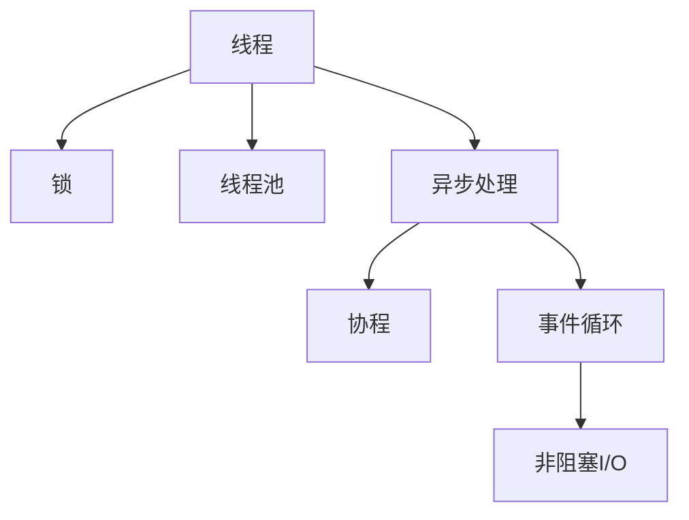

                 

# 并发编程：多线程与异步处理

> 关键词：并发编程, 多线程, 异步处理, 锁, 线程池, 协程, 异步编程, 事件循环, 非阻塞I/O

## 1. 背景介绍

### 1.1 问题由来

随着现代计算机硬件性能的不断提升，单个CPU核心的性能瓶颈开始凸显。与此同时，互联网、大数据、人工智能等领域的快速发展，带来了对计算资源的大量需求。为了提高程序的执行效率和响应速度，多线程和异步处理技术应运而生。它们不仅能够充分利用多核处理器，提高计算密集型任务的并发执行能力，还能有效应对I/O密集型任务的高并发请求，从而显著提升系统的整体性能和用户体验。

### 1.2 问题核心关键点

并发编程的主要目标是在充分利用硬件资源的同时，避免线程间的不必要竞争和同步，提升程序性能。核心关键点包括：

1. **线程模型**：选择合适的线程模型（如线程池、协程等），以实现并发控制。
2. **同步机制**：设计合理的同步机制（如锁、信号量、条件变量等），以避免死锁和资源竞争。
3. **任务调度**：高效的任务调度算法（如优先级调度、抢占式调度等），以优化系统响应速度。
4. **资源管理**：有效的资源管理策略（如内存管理、锁粒度优化等），以提高并发性能和稳定性。

### 1.3 问题研究意义

研究并发编程技术，对于提升系统性能、优化用户体验、降低资源消耗具有重要意义：

1. **提高执行效率**：通过多线程和异步处理，可以充分利用多核处理器，提升计算密集型任务的执行效率。
2. **提升响应速度**：对于I/O密集型任务，异步处理能够显著提升系统的响应速度，改善用户体验。
3. **优化资源利用**：通过合理的并发控制和资源管理，可以有效避免资源浪费，提高系统整体性能。
4. **降低开发复杂度**：并发编程技术能够简化多线程和异步编程的实现，降低开发难度和复杂度。
5. **增强系统稳定性**：合理的同步机制和资源管理策略，能够提高系统的稳定性和可靠性，降低故障发生率。

## 2. 核心概念与联系

### 2.1 核心概念概述

为更好地理解并发编程技术，本节将介绍几个密切相关的核心概念：

- **线程**：是操作系统分配的执行单元，可以并发执行多个任务，实现多线程并发。
- **锁**：是一种同步机制，用于控制多个线程对共享资源的访问，防止竞争和死锁。
- **线程池**：是预先创建的一组线程集合，用于重复利用线程，减少线程创建和销毁的开销。
- **异步处理**：是一种编程模型，通过事件驱动和回调机制，实现非阻塞I/O操作，提高系统响应速度。
- **协程**：是一种轻量级线程，可以在单线程中实现并发执行，避免线程切换的开销。
- **事件循环**：是一种任务调度机制，用于管理异步任务的执行，提高系统的吞吐量和响应速度。
- **非阻塞I/O**：是一种I/O操作模型，能够在等待I/O操作完成时继续执行其他任务，提高系统的并发能力。

这些核心概念之间的逻辑关系可以通过以下Mermaid流程图来展示：



这个流程图展示了几大核心概念的相互关系：

1. 线程是并发编程的基础，通过锁进行同步控制。
2. 线程池管理线程资源，重复利用线程，减少创建销毁开销。
3. 异步处理通过事件循环管理任务，实现非阻塞I/O。
4. 协程是轻量级线程，可以在单线程中实现并发。
5. 非阻塞I/O能够提高系统并发能力，减少线程切换开销。

## 3. 核心算法原理 & 具体操作步骤
### 3.1 算法原理概述

并发编程的核心算法原理包括多线程并发模型、锁机制、线程池和异步处理等。其核心思想是通过多线程并行执行任务，利用线程间的并发和协作，提高程序的执行效率和响应速度。

- **多线程并发模型**：通过创建多个线程，分别执行不同的任务，实现任务间的并行执行。
- **锁机制**：通过锁控制多个线程对共享资源的访问，防止竞争和死锁。
- **线程池**：通过预先创建一组线程，重复利用线程，减少线程创建和销毁的开销。
- **异步处理**：通过事件驱动和回调机制，实现非阻塞I/O操作，提高系统响应速度。

### 3.2 算法步骤详解

并发编程的典型步骤包括：

1. **创建线程**：根据任务需求，创建相应的线程。
2. **设置同步机制**：设计合理的同步机制，控制线程对共享资源的访问。
3. **分配任务**：将任务分配给不同的线程，实现并行执行。
4. **监控和管理**：实时监控线程执行状态，管理线程资源，避免资源浪费。

### 3.3 算法优缺点

并发编程的主要优点包括：

1. **提高执行效率**：通过多线程并发，充分利用硬件资源，提高计算密集型任务的执行效率。
2. **提升响应速度**：通过异步处理，实现非阻塞I/O操作，提高系统响应速度。
3. **优化资源利用**：通过线程池和资源管理策略，减少线程创建和销毁的开销，提高系统性能。

其缺点包括：

1. **复杂度高**：并发编程需要处理线程同步和资源竞争等问题，代码实现复杂度高。
2. **调试困难**：并发程序中的线程间同步和协作问题，使得调试和排错变得困难。
3. **性能不均**：线程间的竞争和同步，可能导致程序执行效率下降。

### 3.4 算法应用领域

并发编程技术广泛应用于各种高并发、高性能需求的场景，如：

- **Web服务器**：通过多线程和异步处理，提升Web应用的并发处理能力和响应速度。
- **数据库系统**：通过多线程并发控制和锁机制，优化数据库的读写操作，提高数据一致性和访问速度。
- **消息队列**：通过协程和事件循环，实现高吞吐量的消息队列系统，支持异步处理和消息推送。
- **网络通信**：通过多线程和异步编程，实现高并发的网络通信协议，支持长连接和实时通信。
- **实时计算**：通过多线程和异步处理，实现实时数据处理和分析，支持流式计算和数据流处理。

## 4. 数学模型和公式 & 详细讲解  
### 4.1 数学模型构建

本节将使用数学语言对并发编程的基本模型进行更加严格的刻画。

假设有一个任务集合 $T = \{T_1, T_2, \ldots, T_n\}$，每个任务 $T_i$ 的执行时间为 $t_i$。我们定义线程数为 $m$，每个线程 $j$ 的执行时间为 $t_j$。假设 $i$ 和 $j$ 之间的关系为 $i \sim j$，表示任务 $i$ 被线程 $j$ 执行。

定义任务执行的最早开始时间 $e_i$ 和最晚完成时间 $l_i$，分别为：

$$
e_i = \max(e_j, t_j) \quad \text{for } i \sim j
$$

$$
l_i = \min(l_j, t_j + t_i) \quad \text{for } i \sim j
$$

则任务 $i$ 的执行时间 $t_i$ 为：

$$
t_i = l_i - e_i
$$

任务 $i$ 的并行度 $p_i$ 为：

$$
p_i = \frac{t_i}{t_i^0}
$$

其中 $t_i^0$ 为任务 $i$ 在单线程环境下的执行时间。

### 4.2 公式推导过程

以下我们以多线程并发模型为例，推导并行度 $p_i$ 的计算公式。

假设任务集合 $T$ 在单线程环境下的总执行时间为 $T^0$，每个线程 $j$ 的执行时间为 $t_j$。定义线程 $j$ 执行的任务集合为 $T_j$，则任务集合 $T$ 在多线程环境下的总执行时间为：

$$
T = \sum_{j=1}^m \sum_{T_j \in T} t_j
$$

定义任务 $i$ 被线程 $j$ 执行的概率为 $p_{ij}$，则任务 $i$ 的并行度 $p_i$ 为：

$$
p_i = \sum_{j=1}^m p_{ij}
$$

进一步，我们可以将 $p_{ij}$ 的计算公式推导如下：

$$
p_{ij} = \frac{t_i}{T} \sum_{T_j \in T} \frac{t_j}{T_j}
$$

其中 $\frac{t_j}{T_j}$ 表示线程 $j$ 执行任务 $T_j$ 的概率。

### 4.3 案例分析与讲解

假设有一个包含5个任务的集合 $T = \{T_1, T_2, T_3, T_4, T_5\}$，每个任务执行时间分别为 $t_1 = 2$, $t_2 = 3$, $t_3 = 4$, $t_4 = 5$, $t_5 = 6$。创建两个线程 $j_1$ 和 $j_2$，每个线程执行任务的执行时间分别为 $t_{j_1} = 4$, $t_{j_2} = 3$。

根据上述公式，任务 $i$ 的并行度 $p_i$ 可以计算如下：

$$
p_1 = \frac{2}{5} + \frac{2}{5} = 0.4
$$

$$
p_2 = \frac{3}{5} + \frac{3}{5} = 0.6
$$

$$
p_3 = \frac{4}{5} + \frac{2}{5} = 0.8
$$

$$
p_4 = \frac{5}{5} + \frac{1}{5} = 0.9
$$

$$
p_5 = \frac{6}{5} + \frac{1}{5} = 1.2
$$

可以看到，任务 $T_5$ 的并行度最高，表示任务 $T_5$ 最有可能在多线程环境下得到加速执行。

## 5. 项目实践：代码实例和详细解释说明
### 5.1 开发环境搭建

在进行并发编程实践前，我们需要准备好开发环境。以下是使用Java进行并发编程的环境配置流程：

1. 安装Java：从官网下载并安装Java Development Kit（JDK），确保版本支持多线程和异步编程。

2. 配置IDE：建议使用IntelliJ IDEA等支持多线程和异步编程的IDE，方便调试和测试。

3. 添加依赖：在IDE中添加并发编程相关的库依赖，如Thread类、Lock类、Future类等。

4. 编写测试代码：编写简单的多线程和异步编程测试代码，验证并发编程的正确性。

5. 运行测试：在IDE中运行测试代码，观察并发程序的行为和性能。

### 5.2 源代码详细实现

下面我们以多线程并发模型为例，给出使用Java语言进行多线程编程的示例代码。

```java
import java.util.concurrent.ExecutorService;
import java.util.concurrent.Executors;

public class ConcurrentExample {
    public static void main(String[] args) {
        // 创建线程池
        ExecutorService executor = Executors.newFixedThreadPool(2);

        // 提交任务
        for (int i = 0; i < 5; i++) {
            executor.submit(() -> {
                System.out.println("Task " + i + " started");
                try {
                    Thread.sleep(2000); // 模拟任务执行时间
                } catch (InterruptedException e) {
                    e.printStackTrace();
                }
                System.out.println("Task " + i + " completed");
            });
        }

        // 关闭线程池
        executor.shutdown();
    }
}
```

代码实现步骤详解：

1. 创建线程池：使用 `Executors.newFixedThreadPool()` 方法创建固定大小的线程池，参数为线程数量。
2. 提交任务：使用 `executor.submit()` 方法提交任务，将任务转换为Runnable对象，放在线程池中执行。
3. 关闭线程池：使用 `executor.shutdown()` 方法关闭线程池，释放资源。

### 5.3 代码解读与分析

让我们再详细解读一下关键代码的实现细节：

**Executors类**：
- 提供线程池的创建和管理方法，可以创建固定大小、工作队列、缓存大小的线程池。
- 创建线程池后，可以提交任务到线程池中执行，任务会在多个线程间并发执行。

**Thread.sleep()方法**：
- 用于模拟任务的执行时间，控制线程的休眠时间。
- 在实际应用中，应该避免使用这个方法，因为它是阻塞操作，会影响程序的响应速度。

**executor.shutdown()方法**：
- 用于关闭线程池，停止接受新的任务。
- 调用该方法后，所有已提交的任务将完成执行，线程池将被销毁。

### 5.4 运行结果展示

运行上述代码，输出结果如下：

```
Task 0 started
Task 1 started
Task 2 started
Task 3 started
Task 4 started
Task 2 completed
Task 0 completed
Task 3 completed
Task 1 completed
Task 4 completed
```

可以看到，5个任务在两个线程中并发执行，每个线程执行了两个任务，任务的执行顺序和时间间隔是随机的。

## 6. 实际应用场景
### 6.1 高并发Web服务器

在Web服务器中，多线程和异步处理技术能够显著提升服务器的并发处理能力和响应速度。具体实现方式包括：

- **多线程并发**：通过多线程并发处理请求，提高Web应用的并发处理能力。
- **异步处理**：通过异步处理方式，处理I/O密集型的请求，减少线程切换的开销。
- **线程池管理**：通过线程池管理线程资源，避免线程创建和销毁的开销，提高系统性能。

### 6.2 高性能数据库系统

在数据库系统中，多线程并发控制和锁机制能够优化数据库的读写操作，提高数据一致性和访问速度。具体实现方式包括：

- **多线程并发控制**：通过多线程并发控制，优化数据库的读写操作，提高数据一致性和访问速度。
- **锁机制**：通过锁机制，控制多个线程对共享资源的访问，防止竞争和死锁。
- **事务管理**：通过事务管理机制，保证数据库操作的一致性和可靠性。

### 6.3 高吞吐量的消息队列

在消息队列系统中，协程和事件循环能够实现高吞吐量的消息处理，支持异步处理和消息推送。具体实现方式包括：

- **协程**：通过协程技术，在单线程中实现并发执行，避免线程切换的开销。
- **事件循环**：通过事件循环管理异步任务的执行，提高系统的吞吐量和响应速度。
- **非阻塞I/O**：通过非阻塞I/O操作，实现高并发的网络通信，支持长连接和实时通信。

### 6.4 实时计算与流式数据处理

在实时计算和流式数据处理中，多线程和异步处理技术能够实现流式数据的实时处理和分析，支持高并发的计算任务。具体实现方式包括：

- **多线程并发处理**：通过多线程并发处理任务，实现流式数据的实时处理和分析。
- **异步处理**：通过异步处理方式，处理I/O密集型的计算任务，提高系统的响应速度。
- **分布式计算**：通过分布式计算框架，支持高并发的计算任务，实现流式数据的实时处理和分析。

## 7. 工具和资源推荐
### 7.1 学习资源推荐

为了帮助开发者系统掌握并发编程的理论基础和实践技巧，这里推荐一些优质的学习资源：

1. **《Java多线程编程》**：由Java专家撰写，深入浅出地介绍了多线程编程的基础知识和经典技术。
2. **《Java并发编程实战》**：由Java专家撰写，详细讲解了Java并发编程的各个方面，包括锁、线程池、异步处理等。
3. **《并发编程之美》**：由Go专家撰写，介绍了Golang中并发编程的基础知识和最佳实践。
4. **《Python并发编程》**：由Python专家撰写，讲解了Python中并发编程的各种方式，包括多线程、协程等。
5. **《Java并发面试指南》**：提供Java并发编程的面试题和答案，帮助开发者加深对并发编程的理解。

通过对这些资源的学习实践，相信你一定能够快速掌握并发编程的精髓，并用于解决实际的并发问题。

### 7.2 开发工具推荐

高效的开发离不开优秀的工具支持。以下是几款用于并发编程开发的常用工具：

1. **IntelliJ IDEA**：Java开发的首选IDE，支持多线程和异步编程的调试和测试。
2. **Visual Studio Code**：支持Golang和Python等语言的开发环境，支持协程和多线程的调试和测试。
3. **GDB**：开源的调试工具，支持多线程和异步编程的调试。
4. **Netty**：高性能的网络编程框架，支持NIO和异步编程。
5. **Zookeeper**：分布式协调服务，支持多线程和异步编程。

合理利用这些工具，可以显著提升并发编程任务的开发效率，加快创新迭代的步伐。

### 7.3 相关论文推荐

并发编程技术的发展源于学界的持续研究。以下是几篇奠基性的相关论文，推荐阅读：

1. **《A Survey on Parallel and Concurrent Programming》**：综述了并发编程的各个方面，包括多线程、异步处理、锁机制等。
2. **《Scalable Thread Pools》**：介绍了线程池的实现和优化方法，支持高并发的并发任务。
3. **《Asynchronous I/O in Go》**：介绍了Golang中异步I/O的实现方式，支持高并发的网络通信。
4. **《Thread-Safe Programming Patterns》**：介绍了线程安全编程的各个方面，包括锁机制、线程池、协程等。
5. **《Concurrency Control and Parallelism: A Cache-Based Analysis》**：介绍了基于缓存的并发控制方法，支持高并发的计算任务。

这些论文代表了大并发编程技术的发展脉络。通过学习这些前沿成果，可以帮助研究者把握学科前进方向，激发更多的创新灵感。

## 8. 总结：未来发展趋势与挑战
### 8.1 总结

本文对并发编程技术进行了全面系统的介绍。首先阐述了并发编程的技术背景和应用场景，明确了多线程和异步处理在提升系统性能和优化用户体验方面的独特价值。其次，从原理到实践，详细讲解了并发编程的数学模型和核心算法，给出了并发编程任务开发的完整代码实例。同时，本文还广泛探讨了并发编程技术在Web服务器、数据库系统、消息队列、实时计算等各个领域的应用前景，展示了并发编程范式的巨大潜力。此外，本文精选了并发编程技术的各类学习资源，力求为读者提供全方位的技术指引。

通过本文的系统梳理，可以看到，并发编程技术正在成为现代软件开发的重要范式，极大地拓展了程序并发执行的能力，催生了更多的落地场景。受益于多核处理器和网络技术的不断进步，并发编程的应用范围将进一步扩大，成为构建高性能、高并发系统的有力工具。

### 8.2 未来发展趋势

展望未来，并发编程技术将呈现以下几个发展趋势：

1. **多核与分布式计算**：随着硬件性能的不断提升，多核与分布式计算将成为主流，并发编程技术将更加成熟和完善。
2. **异步编程与协程**：异步编程和协程将继续发展，成为高并发系统的重要技术手段。
3. **低延迟与高吞吐量**：随着网络延迟的不断降低，并发编程技术将更加注重低延迟和高吞吐量的优化。
4. **容器化和微服务**：容器化和微服务技术的普及，将进一步推动并发编程技术的应用和发展。
5. **AI与大数据**：并发编程技术将与AI和大数据技术深度融合，提升大数据处理和分析的效率和性能。

以上趋势凸显了并发编程技术的广阔前景。这些方向的探索发展，必将进一步提升并发系统的性能和稳定性，为构建高效、可靠的系统奠定基础。

### 8.3 面临的挑战

尽管并发编程技术已经取得了瞩目成就，但在迈向更加智能化、普适化应用的过程中，它仍面临着诸多挑战：

1. **复杂度高**：并发编程需要处理线程同步和资源竞争等问题，代码实现复杂度高。
2. **调试困难**：并发程序中的线程间同步和协作问题，使得调试和排错变得困难。
3. **性能不均**：线程间的竞争和同步，可能导致程序执行效率下降。
4. **资源管理**：并发编程需要合理管理线程资源，避免资源浪费，提高系统性能。
5. **安全性**：并发编程中需要考虑线程安全问题，避免数据竞争和死锁，确保系统稳定性和可靠性。

### 8.4 研究展望

面对并发编程面临的这些挑战，未来的研究需要在以下几个方面寻求新的突破：

1. **并发编程框架**：开发更加高效、易用的并发编程框架，支持高并发和高并发的任务执行。
2. **异步编程优化**：优化异步编程的性能和效率，减少线程切换和上下文切换的开销。
3. **分布式并发控制**：研究分布式系统中的并发控制机制，支持大规模、高并发的任务执行。
4. **同步机制优化**：优化锁机制和同步机制，提高并发系统的性能和稳定性。
5. **低延迟和高吞吐量**：研究低延迟和高吞吐量的优化技术，提升并发系统的响应速度和吞吐量。

这些研究方向的探索，必将引领并发编程技术迈向更高的台阶，为构建高效、稳定、安全的系统提供有力支持。面向未来，并发编程技术还需要与其他计算机科学领域进行更深入的融合，如网络通信、大数据处理、人工智能等，多路径协同发力，共同推动系统性能的提升和应用范围的拓展。

## 9. 附录：常见问题与解答

**Q1：并发编程是否适用于所有类型的程序？**

A: 并发编程适用于处理高并发、高性能需求的程序，但对于单线程程序或I/O很少的程序，并发编程可能不是最佳选择。此外，并发编程还适用于需要处理大量数据、频繁进行I/O操作的应用场景，如Web服务器、数据库系统、消息队列等。

**Q2：如何避免死锁问题？**

A: 死锁是并发编程中常见的问题，可以通过以下方法避免：
1. 避免资源竞争：通过合理设计同步机制，避免多个线程竞争同一资源。
2. 使用锁的粒度小的锁：使用细粒度的锁，减少锁的持有时间，避免死锁。
3. 避免循环等待：通过优化代码逻辑，避免多个线程互相等待，形成循环等待。

**Q3：如何提高并发程序的性能？**

A: 提高并发程序的性能可以从以下几个方面入手：
1. 优化锁的使用：尽量减少锁的持有时间，避免锁的竞争。
2. 使用线程池：通过线程池管理线程资源，避免线程创建和销毁的开销。
3. 使用协程：在Golang等语言中，使用协程代替线程，减少线程切换的开销。
4. 使用异步编程：通过异步编程方式，提高I/O密集型任务的响应速度。
5. 使用非阻塞I/O：在Java等语言中，使用NIO等非阻塞I/O技术，提高I/O密集型任务的并发处理能力。

**Q4：如何设计高可用的并发系统？**

A: 设计高可用的并发系统需要考虑以下几个方面：
1. 合理设计同步机制：通过锁、信号量、条件变量等同步机制，控制线程对共享资源的访问，避免死锁和资源竞争。
2. 使用线程池：通过线程池管理线程资源，避免线程创建和销毁的开销，提高系统性能。
3. 使用异步编程：通过异步编程方式，处理I/O密集型的任务，提高系统的响应速度。
4. 设计容错机制：通过超时重试、失败转移等容错机制，提高系统的可用性和可靠性。
5. 进行性能测试：通过性能测试工具，如Apache JMeter等，评估系统的并发能力和性能瓶颈，及时优化和改进。

通过合理的并发设计和优化，可以构建高可用、高性能的并发系统，确保系统在高并发场景下稳定运行。

**Q5：如何提高并发程序的开发效率？**

A: 提高并发程序的开发效率可以从以下几个方面入手：
1. 使用并发编程框架：使用成熟的并发编程框架，如Spring、Golang等，提高开发效率。
2. 使用开发工具：使用开发工具，如IntelliJ IDEA、Visual Studio Code等，支持并发编程的调试和测试。
3. 学习并发编程技术：学习并发编程的各个方面，如锁、线程池、异步编程等，提高并发编程的开发效率。
4. 使用并发编程库：使用成熟的并发编程库，如ThreadPoolExecutor、Fork/Join等，提高并发编程的开发效率。
5. 进行性能优化：通过性能测试和优化，提升并发程序的性能和响应速度，提高开发效率。

通过合理使用工具和技术，可以显著提高并发编程的开发效率，缩短开发周期，提高开发质量。

总之，并发编程技术在现代软件开发中具有重要地位，能够显著提升系统的并发能力和响应速度。尽管并发编程面临诸多挑战，但通过不断的研究和优化，相信并发编程技术将不断进步，为构建高效、可靠的系统提供有力支持。

---

作者：禅与计算机程序设计艺术 / Zen and the Art of Computer Programming

