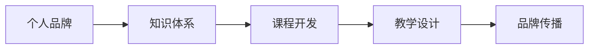

                 

# 开发个人品牌课程：系统化你的知识体系

> 关键词：个人品牌, 知识体系, 课程开发, 系统化, 学习路径, 知识传播, 持续学习, 终身学习

## 1. 背景介绍

### 1.1 问题由来

在信息爆炸的互联网时代，知识更新速度日益加快，个人如何在浩如烟海的资讯中脱颖而出，建立一个强大的个人品牌，成为越来越多人的关注焦点。特别是在技术领域，技术更迭迅速，职场竞争激烈，拥有一个系统化的知识体系，可以有效提升个人竞争力，开启职业生涯的加速器。

个人品牌课程开发，正是为了帮助技术从业者建立并维护其专业形象，展示技术能力，促进职业发展而产生的一个热门领域。本文将从课程开发的各个关键环节，详细介绍如何系统化地构建个人品牌课程，帮助技术专家在不断变化的技术生态中，保持持续学习和专业成长。

### 1.2 问题核心关键点

开发个人品牌课程的核心在于：

- **内容构建**：精选具有实用价值、创新性和行业领先性的知识点，构建课程内容。
- **教学设计**：采用创新的教学方法和互动形式，提高学习者的参与感和学习效果。
- **品牌传播**：利用多种媒介渠道，高效传播课程内容，扩大个人影响力。
- **持续更新**：随着技术的迭代，及时更新课程内容，保持课程的时效性和实用性。

本文将聚焦于内容构建和教学设计的系统化方法，探讨如何通过课程开发，打造个人品牌，提升职业价值。

## 2. 核心概念与联系

### 2.1 核心概念概述

- **个人品牌**：个人在职场和社会上建立的专业形象和声誉，包括技术能力、行业影响力、人际网络等方面。
- **知识体系**：系统化、结构化的知识集合，涵盖理论基础、实践应用、前沿技术等。
- **课程开发**：将专业知识转化为可学习的课程内容，设计并实施教学过程，提升学习效果。
- **教学设计**：包括课程目标、教学方法、评估方式等，旨在最大化学习体验。

这些概念之间通过以下Mermaid流程图进行展示：



### 2.2 核心概念原理和架构

知识体系是个人品牌课程开发的基础。一个完整的知识体系应具备以下特点：

- **全面性**：覆盖领域内的主要知识点和技术栈。
- **系统性**：将知识点按逻辑层次组织，形成连贯的知识链。
- **实战性**：强调理论知识的实际应用，突出解决问题的方法和案例。

课程开发则是在知识体系的基础上，进一步细化和结构化。具体来说，课程开发包括以下几个关键步骤：

1. **需求分析**：明确课程目标受众、预期效果和学习目标。
2. **内容策划**：设计课程框架，确定核心教学内容。
3. **教学设计**：选择适合的教学方法，设计互动环节。
4. **测试评估**：通过预测试和学生反馈，不断优化课程内容。
5. **品牌传播**：通过多种渠道，扩大课程影响，吸引更多学员。

品牌传播是课程开发的最终目标，通过有效的传播手段，将课程内容推广到更广泛的受众，提升个人品牌影响力。

## 3. 核心算法原理 & 具体操作步骤

### 3.1 算法原理概述

个人品牌课程的开发，本质上是一种系统的知识传播和教学设计过程。其核心算法原理包括：

- **内容管理系统(CMS)**：用于存储、管理和发布课程内容。
- **学习管理系统(LMS)**：记录学员的学习进度、评估测试成绩等，进行个性化推荐。
- **互动社区**：促进学员之间的交流和讨论，形成学习共同体。

课程开发的成功，依赖于这些系统的协同工作，确保知识传递的高效性和学习体验的互动性。

### 3.2 算法步骤详解

#### 3.2.1 需求分析

- **目标受众**：确定目标受众群体，如初级、中级或高级开发者。
- **学习目标**：明确课程目标，如掌握某项技术、提升实战能力等。
- **预期效果**：设定学习后的预期效果，如通过某认证、找到新工作等。

#### 3.2.2 内容策划

- **课程框架设计**：确定课程的整体结构，包括前言、主体、案例分析、总结等部分。
- **核心内容确定**：根据需求分析，选择最能满足受众需求的知识点。
- **教学内容编排**：将知识点按逻辑顺序编排，形成连贯的教学流程。

#### 3.2.3 教学设计

- **互动教学**：采用小组讨论、项目实战、在线答疑等形式，增强学习体验。
- **评估体系**：设计作业、测试、项目评审等多种评估方式，确保学习效果。
- **个性化推荐**：根据学员的学习进度和兴趣，推荐个性化的学习路径。

#### 3.2.4 测试评估

- **预测试**：在正式开课前，进行预测试评估，了解学习者的初始水平。
- **反馈收集**：通过学员反馈，了解课程的不足之处，进行优化改进。
- **迭代更新**：根据反馈和市场变化，定期更新课程内容，保持其时效性和实用性。

#### 3.2.5 品牌传播

- **营销策略**：选择合适的营销渠道，如社交媒体、技术社区、个人博客等。
- **内容推广**：通过内容营销，吸引潜在学员，展示课程价值。
- **学员管理**：建立学员社群，促进学员间的交流和合作。

### 3.3 算法优缺点

#### 3.3.1 优点

- **系统化**：通过系统化的内容设计，确保课程结构的合理性和连贯性。
- **互动性**：通过互动教学和个性化推荐，提升学习效果。
- **高效率**：借助教学管理系统和互动社区，提高教学管理和学员管理效率。

#### 3.3.2 缺点

- **复杂性**：课程开发需要综合多方面的知识和技能，复杂度较高。
- **更新挑战**：随着技术的发展，课程内容需要定期更新，维护成本较高。
- **营销成本**：高质量的品牌传播需要投入一定资源，如营销费用、品牌推广等。

### 3.4 算法应用领域

个人品牌课程开发主要应用于以下领域：

- **企业培训**：为公司内部员工设计技术培训课程，提升技术能力和团队协作。
- **技术博客**：通过撰写系列技术文章，建立个人技术品牌，吸引更多读者关注。
- **在线教育**：在各大在线教育平台发布课程，吸引全球学员，扩大个人影响力。
- **技术演讲**：通过技术演讲，分享知识，展示个人品牌和专业能力。

## 4. 数学模型和公式 & 详细讲解 & 举例说明

### 4.1 数学模型构建

知识体系和课程开发过程，可以通过数学模型进行抽象和描述。例如，我们可以将知识体系表示为图结构，其中每个知识点为节点，不同知识点之间的关联为边。课程开发则可以看作是对图结构进行优化和扩展的过程。

### 4.2 公式推导过程

对于课程开发，我们可以使用以下公式进行描述：

$$
C = P + T + A + E
$$

其中，$C$ 表示课程，$P$ 表示课程框架，$T$ 表示核心教学内容，$A$ 表示教学设计，$E$ 表示品牌传播。

### 4.3 案例分析与讲解

以某知名在线教育平台的课程开发为例：

- **需求分析**：面向中级开发者，提升其在分布式系统设计方面的能力。
- **内容策划**：设计课程框架，包含基本概念、实践项目、案例分析、总结提升等部分。
- **教学设计**：采用实战项目、小组讨论、在线答疑等多种形式，确保学员深入理解。
- **测试评估**：通过在线测试和项目评审，评估学员学习效果，进行个性化推荐。
- **品牌传播**：通过社交媒体推广、学员社群互动，扩大课程影响。

## 5. 项目实践：代码实例和详细解释说明

### 5.1 开发环境搭建

在进行课程开发实践前，我们需要准备好开发环境。以下是使用Python进行Flask框架开发的项目环境配置流程：

1. 安装Anaconda：从官网下载并安装Anaconda，用于创建独立的Python环境。
2. 创建并激活虚拟环境：
```bash
conda create -n myproject python=3.8 
conda activate myproject
```

3. 安装Flask：
```bash
pip install Flask
```

4. 安装其他必要的工具包：
```bash
pip install Flask-WTF flask-login flask-sqlalchemy
```

### 5.2 源代码详细实现

以下是使用Flask框架构建在线课程系统的源代码实现：

```python
from flask import Flask, render_template, request, redirect, url_for, flash
from flask_login import LoginManager, UserMixin, login_user, login_required, logout_user
from flask_sqlalchemy import SQLAlchemy
from flask_wtf import FlaskForm
from wtforms import StringField, PasswordField, SubmitField
from wtforms.validators import DataRequired, Email, EqualTo
from werkzeug.security import generate_password_hash, check_password_hash

app = Flask(__name__)
app.config['SECRET_KEY'] = 'supersecretkey'
app.config['SQLALCHEMY_DATABASE_URI'] = 'sqlite:////tmp/test.db'
app.config['LOGIN_DISABLED'] = False

db = SQLAlchemy(app)
login_manager = LoginManager()
login_manager.init_app(app)

class User(db.Model, UserMixin):
    id = db.Column(db.Integer, primary_key=True)
    email = db.Column(db.String(120), unique=True, nullable=False)
    password = db.Column(db.String(80), nullable=False)

    def __repr__(self):
        return '<User %r>' % self.email

@login_manager.user_loader
def load_user(user_id):
    return User.query.get(int(user_id))

class RegistrationForm(FlaskForm):
    email = StringField('Email', validators=[DataRequired(), Email()])
    password = PasswordField('Password', validators=[DataRequired()])
    confirm_password = PasswordField('Confirm Password', validators=[DataRequired(), EqualTo('password')])
    submit = SubmitField('Sign Up')

@app.route('/')
@login_required
def home():
    return render_template('home.html')

@app.route('/login')
def login():
    return render_template('login.html')

@app.route('/logout')
@login_required
def logout():
    logout_user()
    return redirect(url_for('home'))

@app.route('/register', methods=['GET', 'POST'])
def register():
    form = RegistrationForm()
    if form.validate_on_submit():
        hashed_password = generate_password_hash(form.password.data, method='sha256')
        new_user = User(email=form.email.data, password=hashed_password)
        db.session.add(new_user)
        db.session.commit()
        flash('Account created successfully!', 'success')
        return redirect(url_for('login'))
    return render_template('register.html', form=form)

if __name__ == '__main__':
    app.run(debug=True)
```

### 5.3 代码解读与分析

**User类**：
- 定义用户模型，包含email和password字段。
- 实现登录和注册功能。

**FlaskForm类**：
- 定义注册表单，包含email和password字段。
- 使用WTForms库进行表单验证，确保输入数据格式正确。

**视图函数**：
- 定义路由和视图函数，实现登录、注册、登出等功能。
- 利用Flask-Login扩展，实现用户认证和管理。

### 5.4 运行结果展示

运行上述代码，即可搭建一个简单的在线课程系统，支持用户注册、登录、课程浏览等功能。

## 6. 实际应用场景

### 6.1 企业培训

企业培训是一个典型的个人品牌课程应用场景。通过为内部员工设计系统化的技术培训课程，可以有效提升团队的技术水平和协作能力，推动企业创新。

### 6.2 技术博客

技术博客是另一种个人品牌课程的形式。通过撰写系列技术文章，分享个人对某技术栈的深入理解，可以吸引更多读者关注，提升个人品牌影响力。

### 6.3 在线教育

在线教育平台为个人品牌课程提供了广泛的应用舞台。通过在平台发布高质量课程，吸引全球学员，可以扩大个人在技术社区的影响力。

### 6.4 技术演讲

技术演讲是展示个人品牌和专业能力的有效途径。通过在行业会议、技术沙龙等场合分享知识，可以提升个人在技术界的知名度和认可度。

## 7. 工具和资源推荐

### 7.1 学习资源推荐

为了帮助开发者系统掌握课程开发的理论基础和实践技巧，这里推荐一些优质的学习资源：

1. **《系统化编程设计》系列博文**：由系统设计专家撰写，详细介绍系统化编程设计和软件开发的最佳实践。
2. **Udacity《软件工程》课程**：涵盖软件开发的全生命周期，从需求分析到测试部署，全面提升编程技能。
3. **Coursera《数据结构与算法》课程**：由普林斯顿大学提供，深入浅出地介绍数据结构和算法基础，提升编程能力。
4. **《Clean Code》书籍**：通过实践案例，介绍编写清晰、可维护的代码的最佳实践。
5. **Stack Overflow**：全球最大的程序员问答社区，提供丰富的编程知识和解决方案。

通过对这些资源的学习实践，相信你一定能够快速掌握课程开发的精髓，并用于解决实际的开发问题。

### 7.2 开发工具推荐

高效的开发离不开优秀的工具支持。以下是几款用于课程开发常用的工具：

1. **Jupyter Notebook**：开源的交互式编程环境，适合编写和测试代码。
2. **Git**：版本控制系统，便于代码管理和协作。
3. **GitHub**：代码托管平台，支持代码仓库、问题跟踪、协作开发等功能。
4. **Flask**：轻量级Web框架，易于学习和使用，适合开发在线课程系统。
5. **GitLab**：代码托管平台，支持CI/CD、私有仓库等功能，便于项目管理。
6. **Slack**：团队沟通工具，促进学员间的交流和互动。

合理利用这些工具，可以显著提升课程开发的效率和质量，加快创新迭代的步伐。

### 7.3 相关论文推荐

课程开发技术的发展源于学界的持续研究。以下是几篇奠基性的相关论文，推荐阅读：

1. **《软件设计和维护：构建可维护的系统》**：通过系统化编程设计的理念，介绍如何构建可维护的软件系统。
2. **《软件开发生命周期：从需求分析到测试部署》**：详细阐述软件开发的全生命周期，提供实用的开发建议。
3. **《教育技术学：提升教学效果的最佳实践》**：通过教育技术学的方法，提升在线教育的教学效果。
4. **《编程风格和设计模式》**：介绍编写清晰、可维护的代码的最佳实践。
5. **《人工智能与教育：推动在线学习的革命》**：通过人工智能技术，提升在线学习的效果和体验。

这些论文代表了大语言模型微调技术的发展脉络。通过学习这些前沿成果，可以帮助研究者把握学科前进方向，激发更多的创新灵感。

## 8. 总结：未来发展趋势与挑战

### 8.1 总结

本文对个人品牌课程开发的各个关键环节进行了全面系统的介绍。从内容构建到教学设计，再到品牌传播，详细讲解了如何系统化地构建课程，帮助技术专家在不断变化的技术生态中，保持持续学习和专业成长。通过本文的系统梳理，可以看到，系统化个人品牌课程开发不仅能够提升个人技术能力，还能有效传播专业知识，建立个人品牌，助力职业发展。

### 8.2 未来发展趋势

展望未来，个人品牌课程开发将呈现以下几个发展趋势：

1. **内容多样化**：随着技术的发展，课程内容将更加丰富多样，涵盖更广泛的技术栈和应用场景。
2. **技术融合**：结合AI、VR、AR等前沿技术，提供沉浸式学习体验，提升学习效果。
3. **社交化学习**：通过社交化互动，构建学习共同体，促进知识共享和合作学习。
4. **个性化推荐**：利用大数据和机器学习技术，实现个性化学习路径和资源推荐，提高学习效率。
5. **终身学习**：支持学习者的终身学习，通过课程更新和再学习，保持知识体系的与时俱进。

这些趋势凸显了个人品牌课程开发的广阔前景，将为技术从业者提供更加丰富和高效的学习资源，推动技术教育和职业发展的不断进步。

### 8.3 面临的挑战

尽管个人品牌课程开发已经取得了显著成效，但在迈向更加智能化、普适化应用的过程中，仍面临诸多挑战：

1. **内容更新挑战**：随着技术的快速迭代，课程内容需要定期更新，保持其时效性和实用性，这对课程开发者提出了较高的要求。
2. **学习体验提升**：如何通过多种教学方法和互动形式，提升学习者的参与度和学习效果，仍需进一步探索。
3. **学员管理问题**：学员数量的增加，对课程管理和学员互动提出了新的挑战，需要采用更加高效的管理工具。
4. **品牌传播难题**：如何通过多种渠道高效传播课程内容，扩大个人影响力，需要更多的营销和推广策略。
5. **经济效益平衡**：如何平衡课程成本和收益，确保课程开发的可持续发展，是一个重要的现实问题。

这些挑战需要课程开发者不断创新和优化，才能使个人品牌课程开发取得更大的成功。

### 8.4 未来突破

面对课程开发面临的种种挑战，未来的研究需要在以下几个方面寻求新的突破：

1. **课程自动化**：利用AI技术自动化课程内容开发，提升开发效率和质量。
2. **学习分析**：通过学习分析技术，实时监控学习者的学习行为和效果，提供个性化推荐。
3. **社交化学习平台**：构建基于社交化网络的在线学习平台，促进知识共享和互动学习。
4. **混合学习模式**：结合线上线下多种学习方式，提升学习效果和学员满意度。
5. **跨平台支持**：支持多种设备和平台，提供灵活的学习体验。

这些研究方向的探索，必将引领个人品牌课程开发技术迈向更高的台阶，为技术从业者提供更加丰富和高效的学习资源，推动技术教育和职业发展的不断进步。

## 9. 附录：常见问题与解答

**Q1：课程开发需要多少时间和成本？**

A: 课程开发的时间和成本取决于课程的复杂度、目标受众和预期效果。一般来说，一个中等规模的课程开发需要1-3个月的时间，涉及市场调研、内容策划、教学设计、技术实现等多个环节，成本从数千到数万不等。

**Q2：如何选择适合的技术栈和工具？**

A: 选择合适的技术栈和工具，应根据课程的特点和开发者的技能水平进行评估。常用的开发工具包括Flask、Django、React等，常用的数据库包括MySQL、MongoDB等。可以根据实际需求进行选择和组合。

**Q3：课程开发如何实现内容自动化生成？**

A: 内容自动化生成可以通过NLP技术实现。例如，使用GPT-3等大模型自动生成教学内容，根据用户的学习进度和反馈，动态生成个性化推荐内容。

**Q4：课程开发的迭代更新策略是什么？**

A: 课程开发的迭代更新策略包括：

1. **用户反馈**：收集学员的反馈和评价，了解课程的不足之处。
2. **市场调研**：跟踪技术发展趋势，了解行业需求变化。
3. **数据驱动**：利用数据分析工具，实时监控课程效果，发现问题并进行优化。
4. **持续改进**：定期评估课程效果，根据市场反馈进行迭代更新。

通过这些策略，可以确保课程内容的时效性和实用性，不断提升学习效果和用户满意度。

**Q5：如何提升课程的互动性和参与度？**

A: 提升课程的互动性和参与度，可以通过以下方式实现：

1. **互动式教学**：采用小组讨论、项目实战、在线答疑等形式，增强学习体验。
2. **社交化互动**：建立学员社群，促进学员间的交流和合作。
3. **反馈机制**：及时收集学员的反馈，进行优化改进。
4. **奖励机制**：通过课程奖励、学分认证等方式，激励学员积极参与。

通过这些方法，可以显著提升课程的互动性和参与度，增强学习效果。

---

作者：禅与计算机程序设计艺术 / Zen and the Art of Computer Programming

