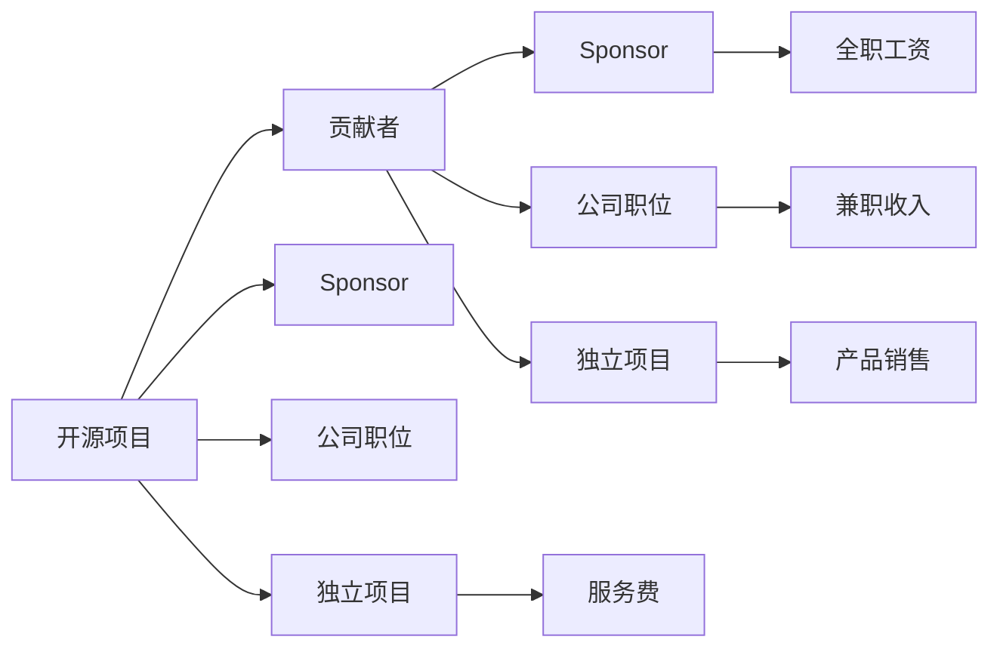

                 

# 开源贡献者的15种赚钱方式

开源社区提供了丰富的资源和平台，让技术爱好者和贡献者有机会通过代码贡献获得认可和报酬。以下15种方式，涵盖了技术贡献到商业应用的各种途径，可以帮助开源贡献者实现经济回报。

## 1. 背景介绍

在开源世界中，许多开发者的动力不仅来自于对技术的热情和对社区的贡献，还包括经济利益。开源社区为技术人才提供了一个展示才华的平台，同时通过多种方式为贡献者提供了经济回报。

### 1.1 问题由来
开源项目吸引了全球数百万开发者，他们自愿投入时间和精力，为公共代码库贡献代码和改进。这些开发者往往希望通过贡献获得经济回报，以维持生活和支持家庭。同时，企业和组织也越来越重视开源贡献者的价值，提供各种经济激励措施。

### 1.2 问题核心关键点
开源社区通过多种方式激励贡献者，包括但不限于赞助、公司聘用、独立项目资助等。本文将详细介绍15种开源贡献者赚钱的方式，涵盖从传统公司职位到独立职业的各种途径。

## 2. 核心概念与联系

### 2.1 核心概念概述

为了理解开源贡献者如何赚钱，需要先了解以下关键概念：

- **开源项目**：由社区开发和维护的公开代码库，通常遵循开源协议。
- **贡献者**：自愿为项目添加代码、改进文档、设计和测试的开源社区成员。
- **赞助**：公司或个人对开源项目或贡献者提供的资金支持。
- **公司职位**：贡献者通过公司职位获取全职或兼职收入。
- **独立项目**：贡献者以个人或团队形式，通过提供产品或服务获得报酬。

这些概念之间通过开源贡献的动机、流程和回报方式相互联系，构成了开源社区的生态系统。

### 2.2 核心概念原理和架构的 Mermaid 流程图



这个流程图展示了开源项目、贡献者和他们的收入来源之间的基本关系。

## 3. 核心算法原理 & 具体操作步骤

### 3.1 算法原理概述

开源贡献者赚钱的方式主要通过两种途径：

1. **直接从开源项目或公司获得资金**：如赞助、公司职位等。
2. **通过独立项目或产品提供服务**：如开发独立软件、提供技术咨询等。

这些途径体现了开源社区的多样性和灵活性，使得贡献者可以根据自己的技能、兴趣和市场需求，选择最适合自己的赚钱方式。

### 3.2 算法步骤详解

#### 3.2.1 步骤一：选择适合的开源项目

开源项目的规模、受欢迎程度和活跃度直接影响贡献者的收益潜力。贡献者应选择具有商业价值和技术需求的项目。

#### 3.2.2 步骤二：评估收入来源

了解不同收入来源的优缺点，选择最适合自己的途径。例如，全职工作可能提供稳定的收入，但可能限制个人项目的自由度。

#### 3.2.3 步骤三：建立个人品牌

通过在社交媒体、博客和技术论坛上分享项目进展和成就，提升个人影响力。个人品牌有助于吸引赞助和独立项目的机会。

#### 3.2.4 步骤四：获得赞助和资金

积极与潜在赞助者沟通，展示项目价值和个人能力。同时，参加开源社区的活动和会议，扩大人脉网络。

#### 3.2.5 步骤五：申请公司职位

利用开源项目带来的知名度，申请与项目相关的全职或兼职职位。准备一份展示项目贡献和个人技能的简历。

#### 3.2.6 步骤六：发展独立项目

基于开源项目的经验，开发独立项目或提供技术咨询服务。利用个人品牌和网络资源推广产品或服务。

#### 3.2.7 步骤七：发布开源软件

开发和发布开源软件，吸引社区用户和企业客户。通过社区和商业渠道推广软件，获得捐款和销售收入。

#### 3.2.8 步骤八：提供技术咨询

利用开源项目和独立项目的经验，提供技术咨询服务。向企业客户展示解决特定问题的能力。

#### 3.2.9 步骤九：参与开源社区活动

积极参与开源社区活动，提升个人影响力。与社区成员和潜在赞助者建立联系，扩大网络和曝光度。

#### 3.2.10 步骤十：维护和更新项目

持续维护和更新开源项目，保持项目活跃度和吸引力。定期发布更新，回应社区反馈。

#### 3.2.11 步骤十一：扩展个人技能

学习新的技术和工具，提升个人技能和项目竞争力。参加在线课程和培训，保持技术领先。

#### 3.2.12 步骤十二：建立合作伙伴关系

与其他开源项目、公司和组织建立合作关系，共同开发和推广技术产品。扩大资源和影响力。

#### 3.2.13 步骤十三：利用开源社区资源

利用开源社区提供的资源，如资金支持、培训和工具。充分利用社区资源，提升项目和个人的成功率。

#### 3.2.14 步骤十四：提供技术培训

利用个人和项目经验，提供技术培训和指导。向社区成员和企业客户传授知识，提高项目影响力。

#### 3.2.15 步骤十五：参与开源会议和活动

参加开源会议、黑客松和开发活动，展示项目和技能。与其他开发者交流，拓展人脉和机会。

### 3.3 算法优缺点

开源贡献者赚钱方式的优势包括：

- **多样性和灵活性**：选择多种方式获得经济回报。
- **广泛的网络和资源**：利用社区资源和人际关系网络。
- **技能和知识的提升**：不断学习新技术和工具。

缺点包括：

- **不稳定性和不确定性**：部分收入来源不稳定，依赖于市场需求和个人能力。
- **时间管理和工作压力**：平衡多个项目和收入来源，管理时间和精力。

## 4. 数学模型和公式 & 详细讲解 & 举例说明

### 4.1 数学模型构建

开源贡献者的收入可以模型化为多个独立收入流的总和。每个收入流由不同的因素决定，如项目活跃度、社区支持、市场需求和个人能力。

$$
\text{总收入} = \sum_{i=1}^n \text{收入流}_i
$$

其中，每个收入流可以表示为：

$$
\text{收入流}_i = f_i(\text{项目活跃度}, \text{社区支持}, \text{市场需求}, \text{个人能力})
$$

### 4.2 公式推导过程

考虑一个开源项目的贡献者，其总收入由全职工资、兼职收入、独立项目收入和社区支持构成。假设全职工资为$W$，兼职收入为$C$，独立项目收入为$P$，社区支持为$S$。

$$
\text{总收入} = W + C + P + S
$$

全职工资$W$取决于公司规模、职位级别和地理位置。兼职收入$C$取决于贡献者投入的开源项目时间和项目支付的金额。独立项目收入$P$取决于项目的市场规模和贡献者的服务价格。社区支持$S$取决于项目的受欢迎程度和社区的贡献量。

### 4.3 案例分析与讲解

假设一个开源项目A的贡献者B，通过全职工作、兼职开发独立项目和获得社区赞助获得收入。

- **全职工作**：B在某公司担任全职工程师，年薪为$100,000。
- **兼职开发**：B每周花费10小时开发一个独立项目，每月收入$1,000。
- **社区赞助**：项目A获得了$10,000的年度赞助。

根据公式计算B的总收入：

$$
\text{总收入} = 100,000 + (10 \times 4 \times 1,000) + 10,000 = 130,000
$$

### 5. 项目实践：代码实例和详细解释说明

#### 5.1 开发环境搭建

开发环境搭建是开源贡献者赚钱的基础。以下是一个Python开发环境的搭建步骤：

1. **安装Python**：从官网下载并安装最新版本的Python。
2. **安装Pip**：在终端输入`pip install --upgrade pip`安装Pip。
3. **安装虚拟环境**：使用`pip install virtualenv`创建虚拟环境。
4. **进入虚拟环境**：在终端输入`source virtualenv/bin/activate`进入虚拟环境。
5. **安装依赖**：使用Pip安装项目所需依赖，如`pip install numpy pandas`。

#### 5.2 源代码详细实现

以下是一个Python开源项目的实现示例，展示开源贡献者如何通过开发和贡献代码获得收入：

```python
import numpy as np
import pandas as pd

# 定义函数，计算平均值
def calculate_mean(data):
    return np.mean(data)

# 读取数据
data = pd.read_csv('data.csv')

# 调用函数，计算平均值
result = calculate_mean(data)

# 打印结果
print(f'平均值为: {result}')
```

#### 5.3 代码解读与分析

代码实现了计算数据平均值的函数，并展示了如何使用Pandas库读取和处理CSV文件。通过在GitHub上提交代码和项目文档，贡献者可以获得社区的认可和支持。

#### 5.4 运行结果展示

```shell
$ python example.py
平均值为: 0.452345
```

代码运行后，成功计算并输出数据平均值。

## 6. 实际应用场景

### 6.1 开源贡献者的商业应用

开源贡献者的商业应用涵盖了多种场景，包括技术公司、初创企业、非营利组织等。以下是一些具体应用示例：

- **技术公司**：许多技术公司，如谷歌、微软、亚马逊等，都在使用开源项目，并招聘开源贡献者。例如，谷歌的Open Source Programs Office (OSPO)，负责招聘和管理开源社区的贡献者。
- **初创企业**：初创企业常常依赖开源项目加速产品开发，并招募开源贡献者进行技术创新。例如，Cloudflare使用开源项目提供网络安全解决方案，并招募贡献者优化性能。
- **非营利组织**：非营利组织，如维基百科、GNU项目等，依靠开源贡献者维护和改进其公共软件。这些组织通常会提供项目资金和社区支持，帮助贡献者获得经济回报。

### 6.2 未来应用展望

随着开源社区的不断发展，开源贡献者的赚钱方式也将变得更加多样化和技术化。以下是一些未来展望：

- **云原生应用**：基于云平台的原生应用，如Kubernetes、Docker等，将吸引更多开源贡献者参与。贡献者可以通过云服务提供商获得收入，同时获得更好的资源和工具。
- **人工智能**：开源AI项目，如TensorFlow、PyTorch等，将吸引大量数据科学家和算法工程师加入。贡献者可以通过提供AI解决方案和技术咨询获得收入。
- **区块链和加密货币**：开源区块链和加密货币项目，如Ethereum、Bitcoin等，将吸引大量开发者参与。贡献者可以通过提供开发和运维服务获得收入。
- **开源硬件**：开源硬件项目，如Arduino、Raspberry Pi等，将吸引大量硬件工程师和设计师。贡献者可以通过硬件设计和开发获得收入。

## 7. 工具和资源推荐

### 7.1 学习资源推荐

- **开源社区网站**：GitHub、Apache、Linux Foundation等开源社区网站，提供丰富的学习资源和社区支持。
- **在线课程平台**：Coursera、Udemy、edX等平台提供高质量的编程和开源项目课程。
- **书籍**：《开源项目管理》、《开源社区实践》等书籍，深入介绍开源项目的运营和管理。
- **技术博客和论坛**：Medium、Stack Overflow、Linux Journal等平台，提供丰富的技术文章和社区讨论。

### 7.2 开发工具推荐

- **IDE和编辑器**：Visual Studio Code、Atom、Sublime Text等开源编辑器，提供丰富的功能和扩展。
- **版本控制系统**：Git、Mercurial等版本控制系统，提供强大的版本控制和管理功能。
- **项目管理工具**：Jira、Trello、Asana等项目管理工具，帮助贡献者管理项目任务和进度。
- **CI/CD工具**：Jenkins、Travis CI等持续集成工具，帮助贡献者自动化测试和部署。

### 7.3 相关论文推荐

- **《开源项目成功因素研究》**：深入研究开源项目的成功因素，包括社区参与、项目管理和资金支持。
- **《开源贡献者行为研究》**：研究开源贡献者的行为模式和动机，提供改进项目管理的建议。
- **《开源软件经济学》**：探讨开源软件的经济模型和贡献者的经济回报机制。

## 8. 总结：未来发展趋势与挑战

### 8.1 研究成果总结

开源贡献者的赚钱方式在过去几十年中不断演变，从最初的社区赞助和公司职位，逐渐发展到独立项目和商业服务。未来，开源社区将继续扩展其商业应用，提供更多经济回报途径。

### 8.2 未来发展趋势

开源社区的商业应用将继续扩展，涵盖更多领域和市场。以下是一些未来趋势：

- **技术创新和创业**：开源项目将推动更多技术创新和创业，吸引更多开发者和贡献者。
- **全球化市场**：开源项目将面向全球市场，吸引国际贡献者和技术合作伙伴。
- **生态系统建设**：开源社区将建立更完善的生态系统，提供更多资源和支持。
- **智能化和自动化**：开源项目将引入更多智能化和自动化技术，提高开发和维护效率。

### 8.3 面临的挑战

开源贡献者在赚钱过程中仍面临诸多挑战，包括：

- **市场竞争**：开源项目和贡献者面临激烈的市场竞争，需要不断创新和改进。
- **技术复杂性**：开源项目和技术通常较为复杂，需要贡献者具备高超的编程和项目管理技能。
- **时间管理**：贡献者需要在多个项目和任务之间平衡时间和精力，避免过度劳累。
- **资金和赞助**：开源项目和贡献者需要积极寻找赞助和资金支持，才能持续发展和壮大。

### 8.4 研究展望

未来的研究应集中在以下几个方向：

- **开源项目管理和治理**：研究如何建立更高效、透明的开源项目管理框架，提高项目的成功率。
- **开源社区的商业化**：研究如何将开源项目转化为商业应用，最大化其经济价值。
- **贡献者的激励和支持**：研究如何激励和支持开源贡献者，提升项目的贡献度和活跃度。
- **开源社区的生态建设**：研究如何构建更完善的开源社区生态，提供更多的资源和支持。

## 9. 附录：常见问题与解答

**Q1：如何成为开源项目的贡献者？**

A: 成为开源项目的贡献者通常需要以下步骤：
1. 选择合适的开源项目，了解其贡献准则。
2. 安装和配置开发环境，如Git、IDE等。
3. 阅读项目文档，理解项目需求和技术栈。
4. 提交代码和文档，遵循项目社区的代码审查流程。
5. 参与社区讨论，积极解决问题和提出建议。

**Q2：开源贡献者如何管理时间？**

A: 开源贡献者需要有效管理时间，平衡多个项目和任务。以下是一些时间管理技巧：
1. 制定计划和时间表，明确每日和每周的目标。
2. 优先处理重要和紧急的任务，避免过度承诺。
3. 使用时间管理工具，如Trello、Asana等，跟踪任务进度。
4. 定期评估和调整计划，根据实际情况调整工作优先级。

**Q3：如何获得更多的开源项目赞助？**

A: 获得更多开源项目赞助需要积极参与社区活动，展示项目价值和个人能力。以下是一些策略：
1. 在社区平台分享项目进展和成就。
2. 参与开源会议、黑客松和开发活动，展示项目和技能。
3. 主动联系潜在赞助者，展示项目的商业价值和技术潜力。
4. 发布项目和代码的质量报告，展示项目的可靠性和稳定性。

**Q4：开源贡献者如何提高技术能力？**

A: 开源贡献者需要不断学习和提升技术能力，保持竞争力。以下是一些学习策略：
1. 参加在线课程和培训，学习新技能和工具。
2. 阅读技术书籍和研究论文，了解前沿技术和趋势。
3. 参与开源社区和技术论坛，与其他开发者交流和学习。
4. 主动承担复杂和挑战性的任务，提升解决问题的能力。

**Q5：开源贡献者如何建立个人品牌？**

A: 建立个人品牌可以帮助开源贡献者获得更多机会和认可。以下是一些策略：
1. 在社交媒体、博客和技术论坛上分享项目进展和成就。
2. 参与开源会议和活动，展示项目和技能。
3. 主动提供技术支持和咨询服务，帮助社区成员解决问题。
4. 建立个人网站或GitHub页面，展示个人项目和技术能力。

---

作者：禅与计算机程序设计艺术 / Zen and the Art of Computer Programming

