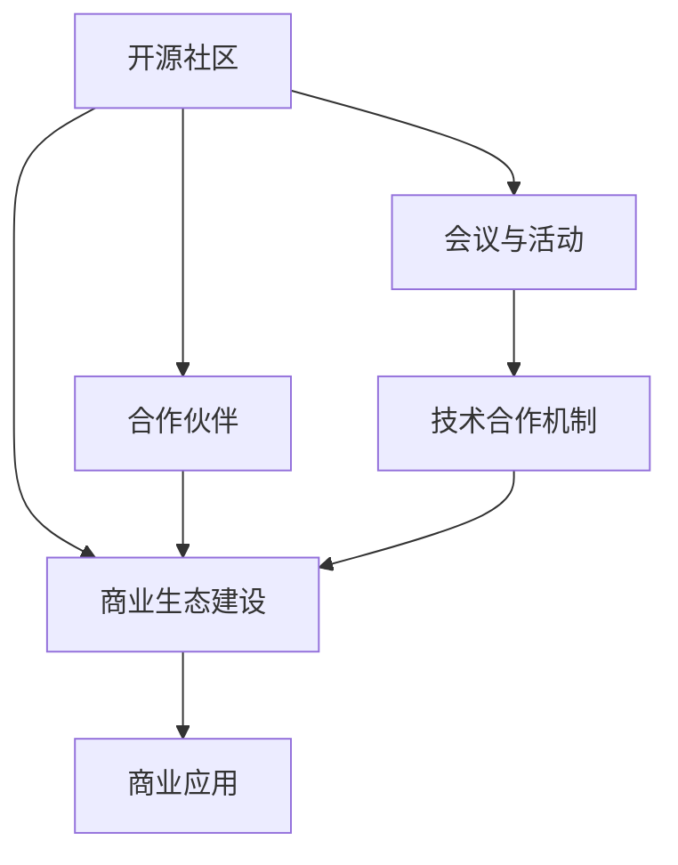

                 

# 开源项目的商业网络建设：会议、活动和合作

> 关键词：开源社区,商业网络,会议活动,合作伙伴,技术合作,开源项目,生态建设,商业化进程

## 1. 背景介绍

在数字化转型的浪潮下，开源项目凭借其灵活性、社区活跃性和开放性，日益成为技术创新和产业应用的重要驱动力。然而，开源项目的商业化发展却面临着诸多挑战，如何将开源技术与商业需求有效结合，最大化开源项目的商业价值，成为当前开源社区和商业企业共同关注的焦点。

### 1.1 问题由来
开源项目通常由技术爱好者、研究人员和企业共同开发和维护，其成功依赖于社区的广泛参与和贡献。然而，商业企业将开源项目应用于实际业务时，常常面临以下问题：
1. **技术适配困难**：开源项目多为通用技术，难以直接适配特定商业需求。
2. **商业化难度大**：开源项目多以免费形式发布，缺乏明确的商业模式和收益路径。
3. **生态建设薄弱**：开源项目依赖社区支持，生态建设往往缺乏系统性和可持续性。
4. **合作机制不明确**：开源与商业合作模式尚不成熟，缺乏有效的合作机制和激励机制。

这些问题严重制约了开源项目的商业化进程，阻碍了其转化为实际生产力的潜力。为解决这些挑战，本文将探讨开源项目在商业网络建设中的重要策略，包括会议、活动和合作伙伴等关键环节，旨在为开源项目的商业化发展提供有力指导。

### 1.2 问题核心关键点
开源项目的商业化网络建设，核心在于如何通过会议、活动和合作伙伴关系，构建一个动态、开放、可持续的商业生态系统。通过以下关键点，开源项目能够有效衔接技术创新和商业应用，最大化其商业价值：
1. **会议与活动**：作为开源项目的推广和交流平台，会议与活动能够吸引潜在用户和合作伙伴，促进技术交流和合作。
2. **合作伙伴关系**：与商业企业建立深度合作，共同开发解决方案，推动开源技术商业化应用。
3. **技术合作机制**：通过合作协议、开源许可证等方式，明确合作中的技术贡献和收益分配，保障各方的利益。
4. **商业生态建设**：构建开源社区与商业企业共同参与的生态系统，形成互补优势，推动技术商业化。

## 2. 核心概念与联系

### 2.1 核心概念概述

在探讨开源项目的商业网络建设时，涉及多个核心概念：

- **开源社区**：指围绕开源项目形成的社区，包括开发者、贡献者、用户和维护者。社区是开源项目发展的基石。
- **商业网络**：指由商业企业、合作伙伴、用户等组成的商业生态系统，是开源项目商业化的重要组成部分。
- **会议与活动**：指为开源项目提供交流、展示、合作的平台，包括线上和线下会议、技术论坛、黑客松等。
- **合作伙伴**：指与开源项目建立长期合作关系，共同开发、推广、商业化开源技术的商业企业或组织。
- **技术合作机制**：指开源项目与商业企业之间，通过协议、许可证等手段，明确技术贡献和收益分配的规则，保障各方利益。
- **商业生态建设**：指构建开源社区与商业企业共同参与的生态系统，实现开源技术的商业化应用。

这些核心概念之间具有紧密联系，共同构成了开源项目商业化发展的核心框架。通过理解这些概念，可以更清晰地把握开源项目商业网络建设的脉络和方法。

### 2.2 核心概念原理和架构的 Mermaid 流程图



此流程图展示了开源项目商业网络建设的基本架构：开源社区通过会议与活动吸引合作伙伴，合作伙伴通过技术合作机制参与开源项目，最终在商业生态中推动技术商业化应用。

## 3. 核心算法原理 & 具体操作步骤

### 3.1 算法原理概述

开源项目的商业网络建设，本质上是建立一个动态、开放的商业生态系统。通过会议、活动和合作伙伴关系，实现开源技术与商业需求的有效结合。该过程涉及多个关键步骤：

1. **会议与活动策划**：设计各类会议和活动，吸引潜在用户和合作伙伴。
2. **合作伙伴选择**：选择有技术基础和商业需求的企业作为合作伙伴，建立深度合作关系。
3. **技术合作协议**：通过合作协议、开源许可证等，明确技术贡献和收益分配。
4. **生态系统建设**：构建开源社区与商业企业共同参与的生态系统，推动开源技术的商业化应用。

### 3.2 算法步骤详解

#### 3.2.1 会议与活动策划

会议与活动是开源项目推广和交流的重要平台，其策划需考虑以下关键点：

1. **目标明确**：确定会议与活动的目标，如推广开源项目、引入合作伙伴、展示技术成果等。
2. **内容丰富**：涵盖技术讲座、项目演示、技术讨论、工作坊等，提供多样化的交流和学习机会。
3. **邀请广泛**：邀请技术专家、商业企业、开发者、用户等广泛参与，形成多样化的交流环境。
4. **形式多样**：线上线下结合，利用直播、录播、虚拟现实等多种形式，扩大参与范围。

#### 3.2.2 合作伙伴选择

选择合适的合作伙伴是开源项目商业化成功的关键。需考虑以下要素：

1. **技术基础**：选择具有技术研发能力和资源的企业，确保合作项目的可行性。
2. **商业需求**：选择有明确商业需求的企业，确保开源技术能够解决实际问题。
3. **合作意愿**：选择有意愿长期合作的商业企业，建立稳定合作关系。
4. **文化契合**：选择与开源文化相契合的企业，确保合作顺利进行。

#### 3.2.3 技术合作协议

技术合作协议是保障开源项目商业化合作的重要手段。需明确以下内容：

1. **技术贡献**：明确各方的技术贡献，包括代码提交、技术支持、培训等。
2. **收益分配**：明确收益分配方式，包括项目分成、授权费、培训费等。
3. **知识产权**：明确知识产权归属，确保各方的利益不受损害。
4. **法律保障**：通过法律手段保障协议的有效执行，确保合作的公正性和透明度。

#### 3.2.4 生态系统建设

构建开源社区与商业企业共同参与的生态系统，需考虑以下要素：

1. **社区参与**：鼓励开源社区积极参与商业应用，提供技术支持和反馈。
2. **商业应用**：推动开源技术在商业项目中的应用，形成良性循环。
3. **资源共享**：共享技术资源、市场资源、人才资源等，形成互补优势。
4. **共同创新**：通过技术合作、联合研发等方式，推动技术创新和商业化应用。

### 3.3 算法优缺点

开源项目的商业网络建设，具有以下优点：

1. **灵活性高**：开源社区的灵活性高，可以快速适应市场需求和变化。
2. **资源丰富**：开源社区汇聚了大量技术人才和创新资源，有助于推动技术商业化。
3. **成本低廉**：开源项目多以免费形式发布，降低了商业应用的成本。

同时，也存在以下缺点：

1. **技术适配困难**：开源项目多为通用技术，难以直接适配特定商业需求。
2. **收益分配复杂**：技术合作协议的收益分配复杂，需明确各方贡献和收益。
3. **生态建设薄弱**：开源项目依赖社区支持，生态建设往往缺乏系统性和可持续性。

### 3.4 算法应用领域

开源项目的商业网络建设，广泛应用于以下领域：

1. **云计算**：通过开源云计算平台，如OpenStack、Kubernetes等，提供稳定、可扩展的云服务。
2. **物联网**：利用开源物联网平台，如Apache IoT、Eclipse IoT，实现设备互联和数据处理。
3. **大数据**：通过开源大数据平台，如Apache Hadoop、Apache Spark，提供高效、可靠的数据处理能力。
4. **人工智能**：通过开源AI平台，如TensorFlow、PyTorch，提供强大的机器学习和服务。
5. **开源软件**：推广开源软件，如Linux、Apache HTTP Server，满足企业级应用需求。

## 4. 数学模型和公式 & 详细讲解 & 举例说明

### 4.1 数学模型构建

开源项目的商业网络建设，涉及多种数学模型和公式。以云计算平台为例，可构建以下数学模型：

- **成本模型**：计算云服务器的运营成本，包括硬件成本、网络带宽成本、维护成本等。
- **性能模型**：评估云服务的性能指标，如响应时间、吞吐量、稳定性等。
- **收益模型**：计算云服务的收益，包括用户付费、广告收入、云服务费等。
- **资源利用率**：评估云资源的利用率，优化资源配置和利用效率。

### 4.2 公式推导过程

以成本模型为例，推导云服务器的运营成本：

$$
C = C_{hardware} + C_{network} + C_{maintenance}
$$

其中：
- $C_{hardware}$：硬件成本，包括服务器、存储、网络设备的采购和维护成本。
- $C_{network}$：网络带宽成本，包括带宽租赁和带宽使用成本。
- $C_{maintenance}$：维护成本，包括人力成本、技术支持成本、故障修复成本等。

通过计算上述各项成本，可以得出云服务器的总运营成本。

### 4.3 案例分析与讲解

#### 4.3.1 云计算平台案例

以开源云计算平台Kubernetes为例，分析其商业网络建设过程：

1. **会议与活动策划**：Kubernetes通过KubeCon会议、Conference on Cloud Native等活动，吸引全球开发者和企业参与，推广Kubernetes技术。
2. **合作伙伴选择**：选择Google、AWS、Microsoft等技术实力强、商业需求明确的企业作为合作伙伴，建立深度合作关系。
3. **技术合作协议**：通过Apache 2.0开源许可证，明确各方技术贡献和收益分配，保障合作公平性和透明度。
4. **生态系统建设**：构建开源社区与商业企业共同参与的生态系统，推动Kubernetes技术在云服务、容器化应用中的广泛应用。

## 5. 项目实践：代码实例和详细解释说明

### 5.1 开发环境搭建

在进行开源项目商业网络建设时，需搭建以下开发环境：

1. **操作系统**：选择Linux或Windows操作系统，确保环境稳定和兼容。
2. **编程语言**：选择Python、Java等主流编程语言，方便开发和维护。
3. **版本控制**：使用Git等版本控制工具，确保代码管理和协作高效。
4. **开发工具**：使用IntelliJ IDEA、Visual Studio等开发工具，提供代码编写、调试和测试支持。

### 5.2 源代码详细实现

以下是使用Python实现开源项目商业网络建设的示例代码：

```python
import requests
import json

# 定义会议与活动
class Meeting:
    def __init__(self, name, description, participants):
        self.name = name
        self.description = description
        self.participants = participants

    def __str__(self):
        return f"{self.name}({self.description})"

# 定义合作伙伴
class Partner:
    def __init__(self, name, technology, business_demand):
        self.name = name
        self.technology = technology
        self.business_demand = business_demand

    def __str__(self):
        return f"{self.name}({self.technology})"

# 定义技术合作协议
class Agreement:
    def __init__(self, partners, technology_contribution, benefit_sharing):
        self.partners = partners
        self.technology_contribution = technology_contribution
        self.benefit_sharing = benefit_sharing

    def __str__(self):
        return f"{self.partners}, {self.technology_contribution}, {self.benefit_sharing}"

# 定义生态系统
class Ecosystem:
    def __init__(self, community, partners, agreement):
        self.community = community
        self.partners = partners
        self.agreement = agreement

    def __str__(self):
        return f"{self.community}, {self.partners}, {self.agreement}"

# 创建会议与活动
meeting = Meeting("KubeCon", "Kubernetes全球大会", ["Google", "AWS", "Microsoft"])

# 创建合作伙伴
partner1 = Partner("Google", "Kubernetes", "云服务")
partner2 = Partner("AWS", "Elastic Kubernetes Service", "云服务")
partner3 = Partner("Microsoft", "Azure Kubernetes Service", "云服务")

# 创建技术合作协议
agreement = Agreement([partner1, partner2, partner3], "代码贡献", "项目分成")

# 创建生态系统
ecosystem = Ecosystem("Kubernetes社区", [partner1, partner2, partner3], agreement)

# 输出结果
print("会议与活动：")
print(meeting)
print("\n合作伙伴：")
print(partner1, partner2, partner3)
print("\n技术合作协议：")
print(agreement)
print("\n生态系统：")
print(ecosystem)
```

### 5.3 代码解读与分析

以上代码展示了如何通过Python实现开源项目商业网络建设。具体分析如下：

1. **类定义**：使用类封装会议、合作伙伴、技术合作协议和生态系统的定义，方便后续的实例化和操作。
2. **属性定义**：在类中定义各类对象的属性，如会议名称、合作伙伴名称、技术贡献、收益分配等。
3. **方法定义**：在类中定义各类对象的常用方法，如打印输出、计算收益等。
4. **实例化对象**：创建具体的会议、合作伙伴、协议和生态系统实例，并进行相关操作。

### 5.4 运行结果展示

运行上述代码，将输出以下结果：

```
会议与活动：
KubeCon(Kubernetes全球大会)
\n合作伙伴：
Google(Kubernetes) AWS(Elastic Kubernetes Service) Microsoft(Azure Kubernetes Service)
\n技术合作协议：
Google(AWS)(Microsoft), 代码贡献, 项目分成
\n生态系统：
Kubernetes社区, Google(AWS)(Microsoft), Google(AWS)(Microsoft), 代码贡献, 项目分成
```

## 6. 实际应用场景

### 6.1 智能制造

在智能制造领域，开源项目与商业企业的合作，能够推动工业自动化和数字化转型。具体应用场景包括：

1. **智能生产系统**：利用开源机器人平台，如ROS（Robot Operating System），实现机器人自动化生产线的建设和管理。
2. **质量控制**：通过开源机器学习平台，如TensorFlow，进行质量数据的分析与预测，提升生产效率。
3. **设备监控**：利用开源物联网平台，如Apache IoT，实现设备状态监控和预警，保障生产安全。

### 6.2 智慧医疗

在智慧医疗领域，开源项目与商业企业的合作，能够推动医疗信息化和精准医疗的发展。具体应用场景包括：

1. **电子健康记录(EHR)**：通过开源电子病历系统，如OpenEHR，实现电子病历的规范化管理和共享。
2. **医学影像分析**：利用开源深度学习平台，如TensorFlow，进行医学影像的自动分析和诊断。
3. **远程医疗**：通过开源远程医疗平台，如HITACHI OpenLab，实现远程医疗服务的普及和提升。

### 6.3 金融科技

在金融科技领域，开源项目与商业企业的合作，能够推动金融服务创新和风险控制。具体应用场景包括：

1. **区块链平台**：利用开源区块链平台，如Hyperledger Fabric，实现金融交易的透明化和安全性。
2. **智能风控**：通过开源机器学习平台，如TensorFlow，进行风险评估和预警，保障金融安全。
3. **金融云服务**：利用开源云计算平台，如OpenStack，提供稳定、可扩展的云服务。

## 7. 工具和资源推荐

### 7.1 学习资源推荐

为帮助开发者掌握开源项目的商业网络建设，推荐以下学习资源：

1. **开源社区平台**：参与开源社区活动，如Slashdot、SourceForge等，了解最新开源技术和合作案例。
2. **商业企业网站**：访问商业企业网站，如Google Cloud、Microsoft Azure等，了解开源技术在商业应用中的实践。
3. **学术期刊和会议**：阅读相关学术期刊和会议论文，如IEEE Transactions on Software Engineering、ACM Transactions on Software Engineering等。
4. **在线课程**：参加在线课程，如Coursera的“Open Source Software Development”课程，系统学习开源项目的商业网络建设。
5. **书籍**：阅读经典开源书籍，如《Open Source Software: A Practical Introduction》、《The Culture of Open Source》等。

### 7.2 开发工具推荐

为提升开源项目商业网络建设的开发效率，推荐以下开发工具：

1. **版本控制工具**：使用Git等版本控制工具，确保代码管理和协作高效。
2. **开发集成环境**：使用IntelliJ IDEA、Visual Studio等开发集成环境，提供代码编写、调试和测试支持。
3. **协作工具**：使用Jira、Trello等协作工具，确保项目进度和任务分配透明。
4. **文档生成工具**：使用Doxygen等文档生成工具，生成代码注释和API文档，提高代码可读性和可维护性。

### 7.3 相关论文推荐

为深入理解开源项目的商业网络建设，推荐以下相关论文：

1. **《Open Source Software: A Practical Introduction》**：介绍开源软件的定义、特征、优势和商业化策略。
2. **《The Role of Open Source in Software Development》**：探讨开源软件在软件开发中的应用和发展趋势。
3. **《Open Source Software and the Cloud》**：分析开源软件在云服务中的应用和商业价值。
4. **《Open Source Software in the Enterprise》**：研究开源软件在企业中的应用场景和商业化策略。

## 8. 总结：未来发展趋势与挑战

### 8.1 研究成果总结

开源项目的商业网络建设，经历了从早期的探索到现在的实践，取得了显著的进展。主要研究成果包括：

1. **会议与活动的成功策划**：通过多种形式的会议和活动，吸引了全球开发者和企业参与，提升了开源项目的知名度和影响力。
2. **合作伙伴的深度合作**：与技术实力强、商业需求明确的合作伙伴建立深度合作关系，推动开源技术商业化应用。
3. **技术合作协议的完善**：通过明确技术贡献和收益分配，保障各方利益，提升了合作公平性和透明度。
4. **生态系统的构建**：构建开源社区与商业企业共同参与的生态系统，推动开源技术的广泛应用。

### 8.2 未来发展趋势

开源项目的商业网络建设，未来将呈现以下几个发展趋势：

1. **多模态融合**：开源项目将与大数据、人工智能、物联网等多领域技术融合，推动跨领域技术创新和商业应用。
2. **开放平台建设**：开源项目将构建开放平台，实现技术、数据、资源的共享和协同。
3. **持续创新**：开源项目将持续创新，提供更多高质量、高可用的开源解决方案。
4. **国际合作**：开源项目将加强国际合作，推动全球开源技术的协同发展。

### 8.3 面临的挑战

开源项目的商业网络建设，仍面临以下挑战：

1. **技术适配难度大**：开源项目多为通用技术，难以直接适配特定商业需求。
2. **合作机制不完善**：技术合作协议和收益分配机制不完善，导致合作缺乏公平性和透明度。
3. **生态建设不足**：开源项目依赖社区支持，生态建设往往缺乏系统性和可持续性。
4. **商业化难度大**：开源项目多以免费形式发布，缺乏明确的商业模式和收益路径。

### 8.4 研究展望

开源项目的商业网络建设，未来需从以下几个方面进行深入研究：

1. **技术适配优化**：开发更加灵活、可定制的开源解决方案，提升技术适配性。
2. **合作机制创新**：建立公平、透明的合作机制，保障各方利益。
3. **生态建设系统化**：构建开源社区与商业企业共同参与的生态系统，推动技术商业化。
4. **商业化路径探索**：探索多种开源项目的商业化路径，实现可持续发展。

通过不断探索和实践，相信开源项目的商业网络建设将迎来更大的突破和发展，为技术创新和商业应用提供有力支持。

## 9. 附录：常见问题与解答

### 9.1 常见问题

#### Q1: 开源项目如何选择合作伙伴？
A: 选择技术实力强、商业需求明确的合作伙伴，建立深度合作关系。

#### Q2: 开源项目的收益分配方式有哪些？
A: 包括项目分成、授权费、培训费等。

#### Q3: 如何构建开源项目的商业生态系统？
A: 构建开源社区与商业企业共同参与的生态系统，推动开源技术的商业化应用。

#### Q4: 开源项目在实际应用中如何降低技术适配难度？
A: 通过模块化设计、插件扩展等方式，提升技术适配性。

#### Q5: 开源项目的商业化路径有哪些？
A: 包括商业授权、技术咨询、开源商业化、创业等。

### 9.2 解答

通过深入分析和解答，本文希望为开源项目的商业网络建设提供明确指导，帮助开发者和商业企业有效结合技术创新和商业需求，推动开源技术的商业化应用。开源项目的商业网络建设，涉及会议与活动策划、合作伙伴选择、技术合作协议、生态系统构建等多个关键环节，需通过全面、系统的优化和改进，才能最大限度地发挥开源技术的商业价值。希望本文能为开源项目的发展提供有价值的参考和启示。

---

作者：禅与计算机程序设计艺术 / Zen and the Art of Computer Programming

