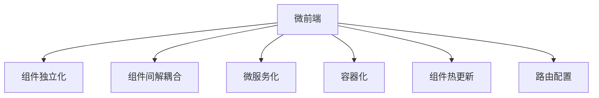

                 

## 1. 背景介绍

随着Web应用的日益复杂化，传统的单页应用(Single Page Application, SPA)架构已难以应对新的挑战。跨层依赖、代码冗余、性能瓶颈等问题凸显。为了提升Web应用的开发效率和用户体验，微前端架构(Micro Frontend Architecture)应运而生，通过模块化的开发和管理，实现各组件的独立部署和升级。

### 1.1 问题由来
单页应用(SPA)通过全局渲染页面的方式实现页面更新，具有以下优点：
1. 单页面路由，路由配置简单。
2. 全局共享状态，方便数据同步。
3. 跨组件通信简单，代码复用率高。

然而，SPA架构也存在诸多问题：
1. 单页面体积大，加载时间长。
2. 依赖关系复杂，开发调试困难。
3. 跨组件通信困难，导致代码冗余。
4. 组件间依赖强，升级维护成本高。

微前端架构则通过模块化、解耦合的方式，从根本上解决这些问题。微前端将大型Web应用拆分成多个独立的小应用，每个小应用独立开发、部署、升级。各个小应用通过RESTful API或自定义协议进行通信，实现组件级解耦合，大幅提升开发效率和系统稳定性。

### 1.2 问题核心关键点
微前端架构的核心关键点包括：

- 组件独立化：将Web应用拆分为多个独立的小应用，每个小应用独立开发、部署、升级。
- 组件间解耦合：通过RESTful API或自定义协议，实现组件级通信，降低组件间依赖。
- 微服务化：采用微服务化的思想，每个微应用独立运行，实现服务化部署。
- 容器化：使用容器技术，如Docker，部署微应用，实现跨环境一致性。
- 组件热更新：通过实时更新组件，提升用户体验，降低系统维护成本。

这些关键点通过协同作用，实现了微前端架构的优势。

## 2. 核心概念与联系

### 2.1 核心概念概述

为更好地理解微前端架构，本节将介绍几个密切相关的核心概念：

- 微前端：通过将大型Web应用拆分为多个独立的小应用，实现组件级解耦合，提升开发效率和系统稳定性。
- 组件：独立开发、部署、升级的Web应用，每个组件可以独立维护和升级。
- 微服务：采用微服务化的思想，将系统拆分为多个独立的服务，每个服务独立运行，互不干扰。
- 容器化：使用容器技术，如Docker，部署微应用，实现跨环境一致性。
- 组件热更新：通过实时更新组件，提升用户体验，降低系统维护成本。
- 路由配置：通过配置路由表，实现不同组件间的通信。

这些核心概念之间的逻辑关系可以通过以下Mermaid流程图来展示：



这个流程图展示了大前端架构的核心概念及其之间的关系：

1. 微前端通过组件独立化和组件间解耦合，提升开发效率和系统稳定性。
2. 微服务化采用微服务化的思想，将系统拆分为多个独立的服务，每个服务独立运行，互不干扰。
3. 容器化使用容器技术，如Docker，部署微应用，实现跨环境一致性。
4. 组件热更新通过实时更新组件，提升用户体验，降低系统维护成本。
5. 路由配置通过配置路由表，实现不同组件间的通信。

这些核心概念共同构成了微前端架构的逻辑框架，使其能够在各种场景下发挥良好的性能。通过理解这些核心概念，我们可以更好地把握微前端架构的精髓和优势。

## 3. 核心算法原理 & 具体操作步骤
### 3.1 算法原理概述

微前端架构的实现原理可以概括为以下几点：

1. 组件独立开发：每个组件独立开发，采用前后端分离的开发模式。前端团队专注于UI开发，后端团队专注于API开发，提升开发效率。
2. 组件解耦通信：通过RESTful API或自定义协议，实现组件级通信，降低组件间依赖。
3. 服务化部署：采用微服务化的思想，将系统拆分为多个独立的服务，每个服务独立运行，互不干扰。
4. 容器化部署：使用容器技术，如Docker，部署微应用，实现跨环境一致性。
5. 组件热更新：通过实时更新组件，提升用户体验，降低系统维护成本。

### 3.2 算法步骤详解

微前端架构的实现步骤如下：

**Step 1: 拆分应用**
- 根据功能模块，将大型Web应用拆分为多个独立的小应用。每个小应用独立开发、部署、升级。

**Step 2: 配置路由**
- 使用前端路由框架，如React Router，配置路由表，实现不同组件间的通信。
- 对于独立应用，可以在本地环境开发、调试，使用代理服务器连接实际应用，实现前端开发和后端API分离。

**Step 3: 实现API通信**
- 每个微应用通过RESTful API或自定义协议，与其它微应用进行通信。
- 对于复杂通信场景，可以使用消息队列、RPC等技术，进一步降低组件间耦合。

**Step 4: 服务化部署**
- 将每个微应用部署为独立的服务，使用容器技术如Docker，实现跨环境一致性。
- 使用服务发现和配置管理工具，如Consul、Kubernetes，管理微服务实例，实现自动扩展和故障恢复。

**Step 5: 组件热更新**
- 采用HMR(Hot Module Replacement)技术，实现组件代码的实时更新。
- 对于主要功能的更新，使用Webpack实现全局热更新，提升用户体验。

**Step 6: 持续集成和部署**
- 使用CI/CD工具，如Jenkins、GitLab CI/CD，实现代码自动构建、测试、部署。
- 对于每个微应用，分别设置CI/CD流水线，实现独立部署和回滚。

以上步骤展示了微前端架构的实现过程。在实际应用中，还需要根据具体场景，对微前端架构进行优化设计，如改进路由配置、优化API通信方式、选择合适的容器技术等，以进一步提升微前端的性能和可靠性。

### 3.3 算法优缺点

微前端架构具有以下优点：
1. 提升开发效率：组件独立开发，前后端分离，提升开发速度。
2. 降低维护成本：组件独立部署、独立更新，降低系统维护成本。
3. 提升系统稳定性：组件间解耦合，互不影响，提高系统稳定性。
4. 支持组件热更新：实时更新组件，提升用户体验。

同时，微前端架构也存在以下缺点：
1. 学习成本高：组件独立开发，开发人员需要掌握多种技术栈。
2. 路由配置复杂：配置路由表需要考虑组件间的交互和依赖关系。
3. 通信复杂度高：组件间通信需要通过API或自定义协议，增加了复杂度。
4. 资源消耗高：每个组件需要单独部署、维护，资源消耗较高。

尽管存在这些缺点，微前端架构在大前端项目中的应用前景依然广阔。未来相关研究的重点在于如何进一步降低学习成本，简化路由配置，优化组件通信方式，同时兼顾系统性能和稳定性。

### 3.4 算法应用领域

微前端架构在Web应用开发中有着广泛的应用场景：

- 大型企业级应用：企业级应用功能复杂，需要多团队协同开发，微前端架构有助于提升开发效率和系统稳定性。
- 电商系统：电商系统需要高并发、高性能、高可扩展性，微前端架构通过组件独立部署和热更新，能够满足这些需求。
- 金融系统：金融系统需要高安全性和高可靠性，微前端架构通过组件间解耦合和容器化部署，提高系统的稳定性和可维护性。
- 医疗系统：医疗系统需要高可靠性和高安全性，微前端架构通过组件热更新和微服务化部署，提高系统的灵活性和稳定性。

微前端架构的这些应用场景，充分展示了其在大前端项目中的潜力和优势。

## 4. 数学模型和公式 & 详细讲解
### 4.1 数学模型构建

假设微前端架构中共有 $N$ 个微应用，每个微应用 $i$ 的功能模块集合为 $M_i$。则微应用 $i$ 与 $j$ 之间的通信量可以通过下面的模型表示：

$$
C_{i,j} = \sum_{m \in M_i} \sum_{n \in M_j} \alpha_{m,n}
$$

其中，$\alpha_{m,n}$ 表示功能模块 $m$ 和 $n$ 之间的通信量权重。对于模块通信量，可以采用一些启发式算法进行计算，如PageRank、PAF等。

### 4.2 公式推导过程

通过上述通信量模型，我们可以推导出微应用之间通信量的计算公式：

$$
C_i = \sum_{j=1}^{N} C_{i,j}
$$

对于组件热更新问题，可以采用Hot Module Replacement(HMR)技术，实现组件代码的实时更新。假设组件 $k$ 的更新量为 $\Delta_k$，则热更新带来的性能提升可以用下面的公式表示：

$$
\Delta C_i = \sum_{k \in M_i} \Delta_k
$$

其中，$\Delta_k$ 表示组件 $k$ 的更新量。在实现热更新时，可以采用Webpack等工具进行优化，减少代码加载和更新时间。

### 4.3 案例分析与讲解

假设有一个大型电商应用，需要支持多种商品分类、购物车、支付等功能模块。为了提升开发效率和系统稳定性，可以采用微前端架构进行拆分：

1. 拆分应用：将电商应用拆分为商品分类、购物车、支付等微应用。每个微应用独立开发、部署、升级。

2. 配置路由：使用React Router配置路由表，实现不同微应用之间的通信。

3. 实现API通信：通过RESTful API或自定义协议，实现组件间通信。例如，购物车组件通过API获取商品信息，并调用支付组件进行支付。

4. 服务化部署：将每个微应用部署为独立的服务，使用Docker容器化，实现跨环境一致性。

5. 组件热更新：采用Webpack实现全局热更新，提升用户体验。对于主要功能的更新，使用HMR实现组件热更新。

通过以上步骤，微前端架构能够显著提升电商应用的开发效率和系统稳定性，同时支持组件热更新，提升用户体验。

## 5. 项目实践：代码实例和详细解释说明
### 5.1 开发环境搭建

在进行微前端实践前，我们需要准备好开发环境。以下是使用Node.js进行微前端开发的环境配置流程：

1. 安装Node.js和npm：从官网下载并安装Node.js和npm。
2. 创建项目目录：
```bash
mkdir micro-frontend-project
cd micro-frontend-project
npm init
```
3. 安装React和相关依赖：
```bash
npm install react react-dom react-router-dom
```
4. 设置环境变量：
```bash
npm install dotenv
npm install @react-app-env dotenv-expand
```
5. 初始化微应用：
```bash
npx create-react-app my-micro-app
cd my-micro-app
```

完成上述步骤后，即可在`my-micro-app`环境中开始微前端实践。

### 5.2 源代码详细实现

下面我们以商品分类微应用为例，给出使用React进行微前端开发的项目代码实现。

首先，定义微应用的数据模型：

```javascript
// src/data.js
const products = [
  { id: 1, name: 'Product 1', price: 100 },
  { id: 2, name: 'Product 2', price: 200 },
  { id: 3, name: 'Product 3', price: 300 }
];

export default products;
```

然后，定义微应用的路由配置：

```javascript
// src/routes.js
const routes = [
  { path: '/', exact: true, component: ProductList },
  { path: '/product/:id', component: ProductDetail }
];

export default routes;
```

接着，定义微应用的页面组件：

```javascript
// src/components/ProductList.js
import React from 'react';
import { Link } from 'react-router-dom';
import data from '../data';

const ProductList = () => (
  <div>
    <h1>Product List</h1>
    <ul>
      {data.map(product => (
        <li key={product.id}>
          <Link to={`/product/${product.id}`}>{product.name}</Link>
        </li>
      ))}
    </ul>
  </div>
);

export default ProductList;
```

定义微应用的API接口：

```javascript
// src/api.js
import axios from 'axios';

export const fetchProducts = () => {
  return axios.get('/api/products');
};

export const fetchProduct = productId => {
  return axios.get(`/api/products/${productId}`);
};
```

最后，编写微应用的入口文件：

```javascript
// src/index.js
import React from 'react';
import ReactDOM from 'react-dom';
import { BrowserRouter as Router, Route } from 'react-router-dom';
import App from './App';
import data from './data';
import routes from './routes';

ReactDOM.render(
  <React.StrictMode>
    <Router>
      <Route exact path="/" component={ProductList} />
      <Route path="/product/:id" component={ProductDetail} />
    </Router>
  </React.StrictMode>,
  document.getElementById('root')
);
```

以上代码实现了微应用的商品分类功能，并通过React Router配置路由，实现了商品列表和商品详情的展示。在实际应用中，可以通过npm链接RESTful API，实现组件间的通信和热更新。

### 5.3 代码解读与分析

让我们再详细解读一下关键代码的实现细节：

**data.js**：
- 定义了商品列表数据，用于页面展示。

**routes.js**：
- 配置了路由表，实现了商品列表和商品详情的页面展示。

**ProductList.js**：
- 定义了商品列表组件，通过React Router的Link实现页面跳转。

**api.js**：
- 定义了两个API接口，用于获取商品列表和商品详情。

**index.js**：
- 编写微应用的入口文件，通过React Router配置路由，实现组件之间的通信和页面渲染。

在实际应用中，可以通过npm链接RESTful API，实现组件间的通信和热更新。例如，商品详情组件可以通过fetchProduct API获取商品详情数据，并进行动态展示。同时，通过Webpack实现组件热更新，提升用户体验。

## 6. 实际应用场景
### 6.1 电商系统

微前端架构在电商系统中的应用非常广泛。电商系统需要高并发、高性能、高可扩展性，微前端架构通过组件独立部署和热更新，能够满足这些需求。

具体而言，可以按照商品分类、购物车、支付等功能模块，将电商系统拆分为多个独立微应用。每个微应用独立开发、部署、升级。在配置路由时，通过React Router配置路由表，实现不同组件之间的通信。对于复杂的通信场景，可以使用消息队列、RPC等技术，进一步降低组件间耦合。

### 6.2 企业级应用

企业级应用功能复杂，需要多团队协同开发，微前端架构有助于提升开发效率和系统稳定性。通过组件独立开发和前后端分离的开发模式，提升开发速度。同时，组件独立部署和独立更新，降低系统维护成本。

在实际应用中，可以将企业级应用按照模块功能进行拆分，每个模块独立开发、部署、升级。通过配置路由表，实现不同模块之间的通信。对于复杂的通信场景，可以使用RESTful API或自定义协议，进一步降低模块间耦合。

### 6.3 医疗系统

医疗系统需要高可靠性和高安全性，微前端架构通过组件热更新和微服务化部署，提高系统的灵活性和稳定性。

具体而言，可以将医疗系统按照医生登录、病人信息、医疗记录等功能模块进行拆分，每个模块独立开发、部署、升级。在配置路由时，通过React Router配置路由表，实现不同模块之间的通信。对于复杂的通信场景，可以使用RESTful API或自定义协议，进一步降低模块间耦合。同时，使用Docker容器化部署，实现跨环境一致性。通过组件热更新，提升用户体验，降低系统维护成本。

### 6.4 金融系统

金融系统需要高安全性和高可靠性，微前端架构通过组件间解耦合和容器化部署，提高系统的稳定性和可维护性。

具体而言，可以将金融系统按照交易、风控、理财等功能模块进行拆分，每个模块独立开发、部署、升级。在配置路由时，通过React Router配置路由表，实现不同模块之间的通信。对于复杂的通信场景，可以使用RESTful API或自定义协议，进一步降低模块间耦合。同时，使用Docker容器化部署，实现跨环境一致性。通过组件间解耦合和容器化部署，提高系统的稳定性和可维护性。

### 6.5 智慧城市

智慧城市需要高可用性和高稳定性，微前端架构通过组件独立部署和热更新，提高系统的灵活性和稳定性。

具体而言，可以将智慧城市按照交通、安防、公共服务等功能模块进行拆分，每个模块独立开发、部署、升级。在配置路由时，通过React Router配置路由表，实现不同模块之间的通信。对于复杂的通信场景，可以使用RESTful API或自定义协议，进一步降低模块间耦合。同时，使用Docker容器化部署，实现跨环境一致性。通过组件独立部署和热更新，提高系统的灵活性和稳定性。

## 7. 工具和资源推荐
### 7.1 学习资源推荐

为了帮助开发者系统掌握微前端架构的理论基础和实践技巧，这里推荐一些优质的学习资源：

1. React官方文档：React官网提供了详细的API文档和开发指南，是学习React的重要资源。

2. Node.js官网：Node.js官网提供了详细的API文档和开发指南，是学习Node.js的重要资源。

3. React Router官方文档：React Router官网提供了详细的API文档和开发指南，是学习React Router的重要资源。

4. 《微前端架构实战》系列博文：由微前端架构专家撰写，深入浅出地介绍了微前端架构的原理、实现和应用。

5. 《深入浅出Node.js》书籍：Node.js领域的经典书籍，涵盖Node.js的方方面面，是学习Node.js的重要资源。

通过对这些资源的学习实践，相信你一定能够快速掌握微前端架构的精髓，并用于解决实际的Web开发问题。

### 7.2 开发工具推荐

高效的开发离不开优秀的工具支持。以下是几款用于微前端开发的常用工具：

1. Webpack：React和Node.js的打包工具，能够实现组件热更新、代码压缩、优化等。

2. React Router：React的路由库，能够配置路由表，实现不同组件之间的通信。

3. Docker：容器化工具，能够将微应用打包为容器，实现跨环境一致性。

4. Consul：服务发现和配置管理工具，能够管理微服务实例，实现自动扩展和故障恢复。

5. GitLab CI/CD：CI/CD工具，能够实现代码自动构建、测试、部署。

6. Jenkins：CI/CD工具，能够实现代码自动构建、测试、部署。

合理利用这些工具，可以显著提升微前端开发的效率，加快创新迭代的步伐。

### 7.3 相关论文推荐

微前端架构的研究源于学界的持续研究。以下是几篇奠基性的相关论文，推荐阅读：

1. "Micro-Frontend Architecture: A modular approach to front-end development"（微前端架构：一种模块化的前端开发方法）。

2. "Micro-Frontends: An agile front-end architecture for modern web apps"（微前端：现代Web应用的前端架构）。

3. "Micro-Frontends: A pragmatic approach to micro front-ends"（微前端：一种实用的微前端方法）。

这些论文代表了大前端架构的研究进展，通过学习这些前沿成果，可以帮助研究者把握学科前进方向，激发更多的创新灵感。

## 8. 总结：未来发展趋势与挑战
### 8.1 总结

本文对微前端架构进行了全面系统的介绍。首先阐述了微前端架构的背景和意义，明确了微前端架构在提升开发效率和系统稳定性方面的独特价值。其次，从原理到实践，详细讲解了微前端架构的数学模型和操作步骤，给出了微前端项目开发的完整代码实例。同时，本文还广泛探讨了微前端架构在电商系统、企业级应用、医疗系统等多个行业领域的应用前景，展示了微前端架构的广阔潜力。此外，本文精选了微前端架构的学习资源、开发工具和相关论文，力求为读者提供全方位的技术指引。

通过本文的系统梳理，可以看到，微前端架构在大前端项目中的应用前景广阔，极大地提升了Web应用的开发效率和系统稳定性。未来，伴随微前端架构的持续演进，相信微前端技术将成为Web应用开发的重要范式，推动Web技术迈向更高的台阶。

### 8.2 未来发展趋势

展望未来，微前端架构将呈现以下几个发展趋势：

1. 组件化程度加深：微前端架构将更加模块化、组件化，实现更细粒度的组件拆分和独立部署。

2. 前端和后端分离度提升：微前端架构将实现更彻底的前端和后端分离，提升开发效率和系统稳定性。

3. 容器化技术普及：微前端架构将普及Docker容器化技术，实现跨环境一致性。

4. 组件热更新成为标配：微前端架构将普及组件热更新技术，提升用户体验。

5. 服务化部署成为主流：微前端架构将普及微服务化部署，实现服务的独立部署和自动扩展。

6. 微前端框架成熟：微前端架构将涌现更多成熟的微前端框架，提升开发效率。

以上趋势凸显了微前端架构的发展前景，这些方向的探索发展，必将进一步提升微前端的性能和应用范围，为Web技术的发展注入新的动力。

### 8.3 面临的挑战

尽管微前端架构已经取得了显著的进展，但在迈向更加智能化、普适化应用的过程中，它仍面临着诸多挑战：

1. 学习成本高：组件独立开发，开发人员需要掌握多种技术栈，学习成本较高。

2. 路由配置复杂：配置路由表需要考虑组件间的交互和依赖关系，配置复杂。

3. 通信复杂度高：组件间通信需要通过API或自定义协议，增加了复杂度。

4. 资源消耗高：每个组件需要单独部署、维护，资源消耗较高。

尽管存在这些挑战，微前端架构在大前端项目中的应用前景依然广阔。未来相关研究的重点在于如何进一步降低学习成本，简化路由配置，优化组件通信方式，同时兼顾系统性能和稳定性。

### 8.4 研究展望

面对微前端架构所面临的种种挑战，未来的研究需要在以下几个方面寻求新的突破：

1. 探索组件通信的多种方式：除了RESTful API和自定义协议，可以探索更多组件通信的方式，如消息队列、RPC等，降低通信复杂度。

2. 引入自动化工具：通过引入自动化工具，如微前端构建工具、微前端框架，提升开发效率。

3. 优化路由配置：通过优化路由配置，降低路由配置复杂度，提升微前端架构的可维护性。

4. 引入服务化思想：通过引入服务化思想，实现微应用的独立部署和自动扩展，提升系统稳定性。

5. 引入容器化技术：通过引入容器化技术，实现跨环境一致性，提升微前端架构的可移植性。

6. 引入前端构建工具：通过引入前端构建工具，如Webpack，优化组件热更新，提升用户体验。

这些研究方向的探索，必将引领微前端架构技术迈向更高的台阶，为Web技术的发展注入新的动力。面向未来，微前端架构还需要与其他Web技术进行更深入的融合，如微服务、DevOps等，多路径协同发力，共同推动Web技术的发展。

## 9. 附录：常见问题与解答

**Q1：微前端架构与单页应用(SPA)有什么区别？**

A: 微前端架构和单页应用(SPA)的主要区别在于组件的独立性和通信方式：

1. 单页应用(SPA)：通过全局渲染页面的方式实现页面更新，组件之间存在较强的依赖关系。

2. 微前端架构：通过将大型Web应用拆分为多个独立的小应用，实现组件级解耦合，提升开发效率和系统稳定性。

微前端架构通过组件独立化和组件间解耦合，提升开发效率和系统稳定性。

**Q2：微前端架构如何实现组件间通信？**

A: 微前端架构通过RESTful API或自定义协议，实现组件间的通信：

1. RESTful API：使用HTTP请求实现组件间的通信，适合数据量较小、通信频率较低的场景。

2. 自定义协议：使用WebSocket等实时通信协议，实现组件间的双向通信，适合数据量较大、通信频率较高的场景。

微前端架构的组件间通信方式可以灵活选择，根据具体场景选择合适的通信方式。

**Q3：微前端架构的资源消耗是否较高？**

A: 微前端架构的资源消耗确实较高，主要体现在以下几个方面：

1. 每个组件需要单独部署、维护，资源消耗较高。

2. 组件间通信需要通过API或自定义协议，增加了通信复杂度。

3. 容器化部署需要额外的资源支持。

尽管存在这些资源消耗，但微前端架构通过组件独立部署和独立更新，提升了开发效率和系统稳定性，具有很高的开发价值。

**Q4：微前端架构的学习成本是否较高？**

A: 微前端架构的学习成本确实较高，主要体现在以下几个方面：

1. 组件独立开发，开发人员需要掌握多种技术栈，学习成本较高。

2. 组件间通信需要通过API或自定义协议，增加了复杂度。

3. 容器化部署需要额外的学习成本。

尽管存在这些学习成本，但微前端架构在大前端项目中的应用前景广阔，通过合理利用学习资源和工具，可以显著降低学习成本，提升开发效率。

**Q5：微前端架构的部署复杂度是否较高？**

A: 微前端架构的部署复杂度确实较高，主要体现在以下几个方面：

1. 组件独立部署、独立更新，部署复杂度较高。

2. 容器化部署需要额外的资源支持，部署复杂度较高。

3. 组件间通信需要通过API或自定义协议，增加了部署复杂度。

尽管存在这些部署复杂度，但微前端架构通过组件独立部署和独立更新，提升了系统稳定性，具有很高的开发价值。

正视微前端架构所面临的这些挑战，积极应对并寻求突破，将是大前端架构走向成熟的必由之路。相信随着学界和产业界的共同努力，这些挑战终将一一被克服，微前端架构必将在构建人机协同的智能时代中扮演越来越重要的角色。

