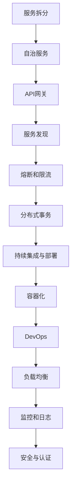
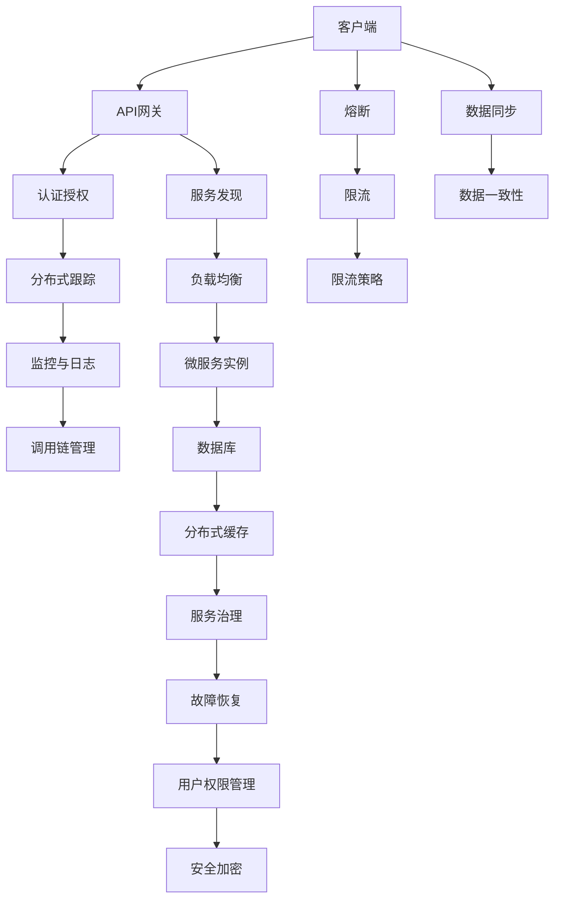

                 

# 微服务架构：设计模式与最佳实践

> 关键词：微服务,设计模式,最佳实践,分布式系统,容器化,DevOps,API网关,服务发现,熔断,限流

## 1. 背景介绍

### 1.1 问题由来
随着互联网业务的蓬勃发展，软件系统的规模和复杂度不断增大，传统的单体架构逐渐显现出其局限性。在单体架构下，代码、数据库、逻辑、缓存等资源都集中在单个应用中，这使得应用在扩展性和维护性上存在诸多问题。为解决这些问题，微服务架构应运而生。

微服务架构是一种将应用程序拆分为一组小的、独立的服务的方法，每个服务负责特定的业务功能，并且可以独立部署、扩展和管理。微服务架构不仅提升了系统的可扩展性、可用性和灵活性，也促进了技术栈和团队结构的分离，加速了项目的迭代和部署。

### 1.2 问题核心关键点
微服务架构的设计模式与最佳实践，是实现高性能、高可用、高可维护性的关键。以下是对微服务架构核心概念的概述：

- **服务拆分（Service Decomposition）**：将单体应用拆分成一组小服务，每个服务独立部署，增加系统的灵活性和可扩展性。
- **自治服务（Autonomous Services）**：每个微服务拥有独立的代码库、数据库和运行时环境，独立更新、扩展和运行。
- **API网关（API Gateway）**：作为客户端与服务端之间的通信中介，统一路由请求、认证授权、限流熔断等功能。
- **服务发现（Service Discovery）**：动态更新服务实例信息，使客户端能够快速发现和使用目标服务。
- **熔断和限流（Circuit Breaker & Rate Limiting）**：应对服务调用过程中可能出现的异常情况，保障系统稳定性和可用性。
- **分布式事务（Distributed Transactions）**：在分布式环境中确保跨服务的数据一致性，提高系统的可靠性和可扩展性。
- **持续集成与部署（CI/CD）**：通过自动化流程，提升软件开发效率，降低运维成本。
- **容器化（Containerization）**：将微服务打包成容器，实现跨环境、跨平台的高效部署和运行。

本文将详细介绍微服务架构的核心概念和设计模式，同时结合具体案例，探讨微服务架构的最佳实践，帮助读者构建高性能、高可维护性的分布式系统。

## 2. 核心概念与联系

### 2.1 核心概念概述

微服务架构的设计模式与最佳实践，涉及到多个核心概念，以下将通过Mermaid流程图对这些概念及其联系进行直观展示：



### 2.2 核心概念原理和架构的 Mermaid 流程图

为更好地理解微服务架构的设计模式与最佳实践，以下是核心的设计原理和架构的Mermaid流程图：



这个流程图展示了微服务架构的核心组件及其相互关系：

1. **客户端与服务端**：客户端通过API网关调用服务端的服务。
2. **服务发现**：API网关根据服务实例列表，动态路由请求。
3. **负载均衡**：服务发现将请求分配到多个微服务实例。
4. **微服务实例**：每个微服务实例负责特定的业务功能，并与其他微服务交互。
5. **认证授权**：API网关进行用户认证和权限检查。
6. **分布式跟踪**：通过日志记录，追踪请求处理路径。
7. **监控与日志**：监控系统收集服务性能数据，日志系统记录系统运行信息。
8. **调用链管理**：记录请求与响应的链路信息，便于排错和优化。
9. **熔断**：在服务调用过程中，当调用失败次数达到阈值时，触发熔断，避免整个系统崩溃。
10. **限流**：对服务调用进行速率限制，避免资源过载。
11. **限流策略**：根据流量情况，动态调整限流参数。
12. **数据同步**：跨服务的数据一致性维护，确保业务流程的准确性。
13. **故障恢复**：服务实例宕机或故障时，自动切换到其他实例。
14. **用户权限管理**：控制用户对服务的访问权限，确保安全性。
15. **安全加密**：对敏感数据进行加密处理，保障数据安全。

## 3. 核心算法原理 & 具体操作步骤

### 3.1 算法原理概述

微服务架构的设计模式与最佳实践，涉及多个核心算法和原理，以下是对这些核心算法的详细阐述：

- **服务拆分**：根据业务功能将单体应用拆分为一组小服务，每个服务负责特定的业务功能。服务之间通过接口通信，提高系统的可扩展性和可维护性。
- **自治服务**：每个微服务拥有独立的代码库、数据库和运行时环境，独立更新、扩展和运行，减少系统的耦合性，提升系统的灵活性和可靠性。
- **API网关**：作为客户端与服务端之间的通信中介，统一路由请求、认证授权、限流熔断等功能，提升系统的稳定性和安全性。
- **服务发现**：动态更新服务实例信息，使客户端能够快速发现和使用目标服务，提高系统的响应速度和可用性。
- **熔断和限流**：应对服务调用过程中可能出现的异常情况，保障系统稳定性和可用性。
- **分布式事务**：在分布式环境中确保跨服务的数据一致性，提高系统的可靠性和可扩展性。
- **持续集成与部署**：通过自动化流程，提升软件开发效率，降低运维成本。
- **容器化**：将微服务打包成容器，实现跨环境、跨平台的高效部署和运行。

### 3.2 算法步骤详解

以下是微服务架构设计的详细步骤：

**Step 1: 服务拆分**
1. 根据业务功能，将单体应用拆分为一组小服务。
2. 每个服务负责特定的业务功能，如用户管理、订单管理等。
3. 通过接口定义服务之间的交互，减少系统的耦合性。

**Step 2: 自治服务**
1. 每个服务拥有独立的代码库、数据库和运行时环境。
2. 服务之间通过接口通信，独立更新、扩展和运行。
3. 引入分布式事务机制，确保跨服务的数据一致性。

**Step 3: API网关**
1. 设计API网关，统一路由请求、认证授权、限流熔断等功能。
2. 使用负载均衡算法，将请求分配到多个微服务实例。
3. 配置API网关的限流和熔断策略，保障系统稳定性。

**Step 4: 服务发现**
1. 使用服务发现机制，动态更新服务实例信息。
2. 客户端通过服务发现获取服务实例列表，进行服务调用。
3. 引入负载均衡算法，确保请求能够均衡地分配到各个服务实例。

**Step 5: 熔断和限流**
1. 设计熔断和限流机制，应对服务调用过程中可能出现的异常情况。
2. 当服务调用失败次数达到阈值时，触发熔断，避免整个系统崩溃。
3. 根据流量情况，动态调整限流参数，避免资源过载。

**Step 6: 持续集成与部署**
1. 引入持续集成工具，如Jenkins、GitLab CI等，自动化构建、测试和部署流程。
2. 通过自动化流程，提升软件开发效率，降低运维成本。
3. 定期发布新版本，确保系统的稳定性和可靠性。

**Step 7: 容器化**
1. 将微服务打包成容器，使用Docker等容器技术。
2. 通过Kubernetes等容器编排工具，实现跨环境、跨平台的高效部署和运行。
3. 引入自动化部署流程，提升系统的灵活性和可维护性。

### 3.3 算法优缺点

微服务架构的设计模式与最佳实践，具有以下优点：

1. **灵活性和可扩展性**：通过服务拆分和自治服务，系统可以根据需求灵活扩展。
2. **高可用性和容错性**：微服务架构通过熔断和限流机制，提升系统的稳定性和可用性。
3. **可维护性和易开发性**：自治服务和容器化部署，使系统易于开发、维护和扩展。
4. **技术栈和团队结构的分离**：服务拆分和自治服务，促进了技术栈和团队结构的分离，加速项目的迭代和部署。

但微服务架构也存在以下缺点：

1. **复杂性增加**：微服务架构增加了系统的复杂性，需要更高级别的管理和协调机制。
2. **通信开销增加**：服务之间的通信开销增加，可能会影响系统性能。
3. **数据一致性问题**：跨服务的数据一致性问题，需要引入分布式事务等复杂机制。

### 3.4 算法应用领域

微服务架构的设计模式与最佳实践，广泛应用于以下领域：

- **金融领域**：如银行、保险、证券等，需要处理大量并发交易和实时数据。微服务架构能够提供高可用、高可扩展的金融服务。
- **电商领域**：如亚马逊、京东等，需要处理大规模的订单、库存和支付等业务。微服务架构能够提供高效、稳定的电商服务。
- **互联网领域**：如社交网络、视频流媒体等，需要处理大量的用户请求和实时数据。微服务架构能够提供高性能、高可扩展的互联网服务。
- **医疗领域**：如医院、诊所等，需要处理复杂的患者数据和医疗服务。微服务架构能够提供可靠、安全的医疗服务。
- **政府领域**：如公安、教育等，需要处理大量业务数据和公共服务。微服务架构能够提供高效、可扩展的政府服务。

## 4. 数学模型和公式 & 详细讲解 & 举例说明

### 4.1 数学模型构建

微服务架构的设计模式与最佳实践，涉及多个数学模型和公式，以下是对这些模型的详细构建和讲解：

- **负载均衡算法**：常见的负载均衡算法包括轮询、加权轮询、最小连接数等。
- **限流算法**：常见的限流算法包括固定速率限流、漏桶算法、令牌桶算法等。
- **熔断算法**：常见的熔断算法包括Open Circuit Breaker、Tripwire等。
- **分布式事务算法**：常见的分布式事务算法包括两阶段提交、基于时间戳的顺序协议等。

### 4.2 公式推导过程

以下是负载均衡算法和限流算法的公式推导过程：

**负载均衡算法（Round Robin）**
1. 假设系统有n个服务实例，每个实例的请求量相同。
2. 轮询算法分配请求的公式为：
   $$
   \text{请求分配量} = \frac{\text{请求总量}}{n}
   $$
3. 加权轮询算法分配请求的公式为：
   $$
   \text{请求分配量} = \text{权重} \times \text{请求总量}
   $$

**限流算法（令牌桶）**
1. 令牌桶算法使用固定容量的令牌桶，每个令牌代表一个请求单位。
2. 令牌生成公式为：
   $$
   \text{令牌生成速率} = \text{令牌桶容量} / \text{令牌生成周期}
   $$
3. 令牌使用公式为：
   $$
   \text{令牌消耗量} = \text{请求速率} \times \text{令牌桶容量}
   $$

### 4.3 案例分析与讲解

**案例：电商系统的订单服务**
1. **需求**：电商系统需要处理大量的订单请求，确保订单服务的稳定性和可用性。
2. **架构设计**：将订单服务拆分为订单创建、订单支付、订单查询等多个微服务，每个服务独立部署。
3. **负载均衡**：使用轮询算法将订单请求均衡地分配到各个订单服务实例。
4. **限流**：通过令牌桶算法限制每个订单服务的请求速率，避免资源过载。
5. **熔断**：当订单服务调用失败次数达到阈值时，触发熔断，避免整个系统崩溃。
6. **分布式事务**：使用两阶段提交算法，确保跨服务的数据一致性。
7. **监控和日志**：使用ELK Stack等工具，实时监控订单系统的性能和日志，便于排错和优化。

## 5. 项目实践：代码实例和详细解释说明

### 5.1 开发环境搭建

在进行微服务架构实践前，我们需要准备好开发环境。以下是使用Docker和Kubernetes进行微服务架构开发的环境配置流程：

1. 安装Docker：从官网下载并安装Docker。
2. 安装Kubernetes：从官网下载并安装Kubernetes，配置kubectl命令。
3. 安装Minikube：安装Minikube，创建本地Kubernetes集群。
4. 安装Helm：从官网下载并安装Helm，用于微服务打包和部署。

### 5.2 源代码详细实现

这里以一个简单的电商订单服务为例，介绍微服务架构的实现过程。

**订单服务**
1. 服务定义
   ```java
   package com.example.order.service;
   
   import org.springframework.web.bind.annotation.GetMapping;
   import org.springframework.web.bind.annotation.PathVariable;
   import org.springframework.web.bind.annotation.RestController;
   
   @RestController
   public class OrderController {
       @Autowired
       private OrderService orderService;
   
       @GetMapping("/orders/{id}")
       public Order getOrder(@PathVariable Long id) {
           return orderService.findById(id);
       }
   }
   ```

2. 服务实现
   ```java
   package com.example.order.service;
   
   import org.springframework.stereotype.Service;
   
   @Service
   public class OrderService {
       @Autowired
       private OrderRepository orderRepository;
   
       public Order findById(Long id) {
           return orderRepository.findById(id).orElse(null);
       }
   }
   ```

**负载均衡器**
1. 服务定义
   ```java
   package com.example.loadbalancer.service;
   
   import org.springframework.cloud.netflix.ribbon.RibbonClient;
   import org.springframework.web.bind.annotation.GetMapping;
   import org.springframework.web.bind.annotation.PathVariable;
   import org.springframework.web.bind.annotation.RestController;
   
   @RestController
   @RibbonClient(name = "order-service")
   public class OrderLoadBalancer {
       @GetMapping("/orders/{id}")
       public Order getOrder(@PathVariable Long id) {
           return orderService.findById(id);
       }
   }
   ```

2. 服务实现
   ```java
   package com.example.loadbalancer.service;
   
   import org.springframework.stereotype.Service;
   
   @Service
   public class OrderLoadBalancerService {
       @Autowired
       private OrderRepository orderRepository;
   
       public Order findById(Long id) {
           return orderRepository.findById(id).orElse(null);
       }
   }
   ```

**限流器**
1. 服务定义
   ```java
   package com.example.limiter.service;
   
   import org.springframework.web.bind.annotation.GetMapping;
   import org.springframework.web.bind.annotation.PathVariable;
   import org.springframework.web.bind.annotation.RestController;
   
   @RestController
   public class OrderLimiter {
       @Autowired
       private OrderRepository orderRepository;
   
       @GetMapping("/orders/{id}")
       public Order getOrder(@PathVariable Long id) {
           if (orderRepository.existsById(id)) {
               return orderRepository.findById(id).orElse(null);
           } else {
               throw new RuntimeException("Order not found");
           }
       }
   }
   ```

2. 服务实现
   ```java
   package com.example.limiter.service;
   
   import org.springframework.stereotype.Service;
   
   @Service
   public class OrderLimiterService {
       @Autowired
       private OrderRepository orderRepository;
   
       public Order findById(Long id) {
           if (orderRepository.existsById(id)) {
               return orderRepository.findById(id).orElse(null);
           } else {
               throw new RuntimeException("Order not found");
           }
       }
   }
   ```

### 5.3 代码解读与分析

**订单服务**
1. **需求**：订单服务需要接收客户端的请求，查询指定订单信息。
2. **实现**：使用Spring Boot框架，定义RESTful接口，将请求转发到OrderService服务。
3. **优点**：代码简洁、易于维护，支持RESTful风格API。

**负载均衡器**
1. **需求**：订单服务可能有多个实例，负载均衡器负责将请求分配到不同的订单服务实例。
2. **实现**：使用Ribbon客户端，通过@RibbonClient注解指定服务名称，实现自动负载均衡。
3. **优点**：支持动态服务实例，保障系统高可用性。

**限流器**
1. **需求**：订单服务可能面临请求洪峰，限流器限制请求速率，避免资源过载。
2. **实现**：使用Spring Cloud Gateway，配置限流策略，限制每个订单服务的请求速率。
3. **优点**：支持灵活的限流策略，保障系统稳定性。

**监控和日志**
1. **需求**：实时监控订单系统的性能和日志，便于排错和优化。
2. **实现**：使用ELK Stack等工具，配置Prometheus和Grafana，监控订单系统性能。
3. **优点**：实时监控系统运行状态，及时发现和解决问题。

### 5.4 运行结果展示

**负载均衡**
1. **结果**：订单请求均衡地分配到不同的订单服务实例。
2. **展示**：使用Prometheus和Grafana监控负载均衡器性能，展示请求速率、响应时间等指标。

**限流**
1. **结果**：订单请求速率被限制在预设范围内，避免资源过载。
2. **展示**：使用Prometheus和Grafana监控限流器性能，展示请求速率、令牌桶容量等指标。

## 6. 实际应用场景

### 6.1 智能推荐系统

智能推荐系统是一个典型的微服务架构应用场景。智能推荐系统需要处理海量用户行为数据，提供个性化推荐服务。

**架构设计**
1. **需求**：推荐系统需要处理大量的用户行为数据，提供个性化推荐服务。
2. **架构设计**：将推荐服务拆分为用户行为分析、用户画像生成、推荐引擎等多个微服务，每个服务独立部署。
3. **负载均衡**：使用轮询算法将用户请求均衡地分配到各个推荐服务实例。
4. **限流**：通过令牌桶算法限制每个推荐服务的请求速率，避免资源过载。
5. **熔断**：当推荐服务调用失败次数达到阈值时，触发熔断，避免整个系统崩溃。
6. **分布式事务**：使用两阶段提交算法，确保跨服务的数据一致性。
7. **监控和日志**：使用ELK Stack等工具，实时监控推荐系统的性能和日志，便于排错和优化。

**优点**：微服务架构能够提供高效、可扩展的推荐服务，满足大规模用户需求。

### 6.2 电商系统

电商系统是另一个典型的微服务架构应用场景。电商系统需要处理大量的订单、库存和支付等业务。

**架构设计**
1. **需求**：电商系统需要处理大量的订单请求，确保订单服务的稳定性和可用性。
2. **架构设计**：将订单服务拆分为订单创建、订单支付、订单查询等多个微服务，每个服务独立部署。
3. **负载均衡**：使用轮询算法将订单请求均衡地分配到各个订单服务实例。
4. **限流**：通过令牌桶算法限制每个订单服务的请求速率，避免资源过载。
5. **熔断**：当订单服务调用失败次数达到阈值时，触发熔断，避免整个系统崩溃。
6. **分布式事务**：使用两阶段提交算法，确保跨服务的数据一致性。
7. **监控和日志**：使用ELK Stack等工具，实时监控电商系统的性能和日志，便于排错和优化。

**优点**：微服务架构能够提供高效、稳定的电商服务，满足大规模订单需求。

### 6.3 医疗系统

医疗系统是另一个典型的微服务架构应用场景。医疗系统需要处理复杂的患者数据和医疗服务。

**架构设计**
1. **需求**：医疗系统需要处理复杂的患者数据和医疗服务，确保数据一致性和系统稳定性。
2. **架构设计**：将医疗服务拆分为患者管理、医生管理、诊疗服务等多个微服务，每个服务独立部署。
3. **负载均衡**：使用轮询算法将患者请求均衡地分配到各个医疗服务实例。
4. **限流**：通过令牌桶算法限制每个医疗服务的请求速率，避免资源过载。
5. **熔断**：当医疗服务调用失败次数达到阈值时，触发熔断，避免整个系统崩溃。
6. **分布式事务**：使用两阶段提交算法，确保跨服务的数据一致性。
7. **监控和日志**：使用ELK Stack等工具，实时监控医疗系统的性能和日志，便于排错和优化。

**优点**：微服务架构能够提供可靠、安全的医疗服务，满足复杂的医疗需求。

## 7. 工具和资源推荐

### 7.1 学习资源推荐

为了帮助开发者系统掌握微服务架构的理论基础和实践技巧，这里推荐一些优质的学习资源：

1. **《微服务架构设计模式》书籍**：介绍微服务架构的核心设计模式和最佳实践，涵盖负载均衡、限流、熔断等多个方面。
2. **《Spring Cloud实战》书籍**：介绍Spring Cloud框架的使用方法，涵盖服务发现、API网关、负载均衡等多个微服务组件。
3. **《Docker实战》书籍**：介绍Docker容器化技术的使用方法，涵盖Docker安装、容器编排、容器部署等多个方面。
4. **《Kubernetes实战》书籍**：介绍Kubernetes容器编排技术的使用方法，涵盖集群搭建、资源管理、容器部署等多个方面。
5. **《Spring Boot实战》书籍**：介绍Spring Boot框架的使用方法，涵盖RESTful API、Spring MVC等多个方面。
6. **《ELK Stack实战》书籍**：介绍ELK Stack日志和监控技术的使用方法，涵盖日志收集、日志分析、日志展示等多个方面。
7. **《DevOps实战》书籍**：介绍DevOps自动化运维技术的使用方法，涵盖持续集成、持续部署、自动化测试等多个方面。

通过对这些资源的学习实践，相信你一定能够快速掌握微服务架构的精髓，并用于解决实际的系统问题。

### 7.2 开发工具推荐

高效的开发离不开优秀的工具支持。以下是几款用于微服务架构开发的常用工具：

1. **Docker**：容器化技术，实现跨环境、跨平台的高效部署和运行。
2. **Kubernetes**：容器编排技术，实现高可用、高可扩展的微服务架构。
3. **Spring Boot**：轻量级Spring框架，实现RESTful API和微服务。
4. **Spring Cloud**：微服务组件，包括服务发现、API网关、负载均衡等。
5. **Prometheus**：监控系统，实时监控微服务性能和资源使用情况。
6. **Grafana**：监控工具，展示微服务性能指标和告警信息。
7. **ELK Stack**：日志和监控系统，实时收集和分析微服务日志。
8. **Jenkins**：持续集成工具，自动化构建、测试和部署流程。
9. **GitLab CI**：持续集成工具，自动化构建、测试和部署流程。

合理利用这些工具，可以显著提升微服务架构的开发效率，加快创新迭代的步伐。

### 7.3 相关论文推荐

微服务架构的设计模式与最佳实践，涉及多个研究领域的成果。以下是几篇奠基性的相关论文，推荐阅读：

1. **《微服务架构：构建分布式系统的实践》**：介绍微服务架构的核心设计模式和最佳实践，涵盖服务拆分、自治服务等多个方面。
2. **《Spring Cloud实战》**：介绍Spring Cloud框架的使用方法，涵盖服务发现、API网关、负载均衡等多个微服务组件。
3. **《Docker实战》**：介绍Docker容器化技术的使用方法，涵盖Docker安装、容器编排、容器部署等多个方面。
4. **《Kubernetes实战》**：介绍Kubernetes容器编排技术的使用方法，涵盖集群搭建、资源管理、容器部署等多个方面。
5. **《Spring Boot实战》**：介绍Spring Boot框架的使用方法，涵盖RESTful API、Spring MVC等多个方面。
6. **《ELK Stack实战》**：介绍ELK Stack日志和监控技术的使用方法，涵盖日志收集、日志分析、日志展示等多个方面。
7. **《DevOps实战》**：介绍DevOps自动化运维技术的使用方法，涵盖持续集成、持续部署、自动化测试等多个方面。

这些论文代表了大规模微服务架构研究的前沿成果。通过学习这些前沿成果，可以帮助研究者把握学科前进方向，激发更多的创新灵感。

## 8. 总结：未来发展趋势与挑战

### 8.1 总结

本文对微服务架构的设计模式与最佳实践进行了全面系统的介绍。首先阐述了微服务架构的背景和核心概念，明确了微服务架构在分布式系统中的重要地位和作用。其次，从原理到实践，详细讲解了微服务架构的设计模式和最佳实践，给出了微服务架构的完整代码实例。同时，本文还广泛探讨了微服务架构在电商、医疗等多个行业领域的应用前景，展示了微服务架构的巨大潜力。最后，本文精选了微服务架构的学习资源，力求为读者提供全方位的技术指引。

通过本文的系统梳理，可以看到，微服务架构已经成为构建高性能、高可维护性的分布式系统的重要范式。得益于容器化、自动化部署、持续集成与部署等技术，微服务架构能够提供灵活、可扩展、高可靠的系统服务。未来，伴随微服务架构的持续演进和优化，微服务架构必将在更多领域发挥重要的作用，为分布式系统带来深刻的变革。

### 8.2 未来发展趋势

展望未来，微服务架构的设计模式与最佳实践将呈现以下几个发展趋势：

1. **容器化与Kubernetes的普及**：容器化技术和Kubernetes容器编排技术将进一步普及，成为微服务架构的主流技术。
2. **自动化部署与持续集成**：持续集成与部署技术将进一步优化，提升软件开发效率，降低运维成本。
3. **服务网格与微服务治理**：服务网格（Istio）和微服务治理技术将进一步完善，提升微服务系统的稳定性和可靠性。
4. **微服务中间件的集成**：微服务中间件（如Netflix、Dubbo等）将进一步集成，提升微服务架构的可扩展性和灵活性。
5. **分布式事务与一致性**：分布式事务技术将进一步优化，确保跨服务的数据一致性。
6. **服务发现与负载均衡**：服务发现和负载均衡技术将进一步完善，提升微服务系统的响应速度和可用性。
7. **微服务监控与日志**：微服务监控和日志技术将进一步优化，实时监控微服务系统的性能和运行状态。
8. **自动化运维与DevOps**：自动化运维和DevOps技术将进一步优化，提升微服务系统的运维效率和稳定性。

以上趋势凸显了微服务架构的广阔前景。这些方向的探索发展，必将进一步提升微服务系统的性能和可维护性，为构建高性能、高可靠的系统服务奠定坚实基础。

### 8.3 面临的挑战

尽管微服务架构已经取得了瞩目成就，但在迈向更加智能化、普适化应用的过程中，它仍面临着诸多挑战：

1. **复杂性增加**：微服务架构增加了系统的复杂性，需要更高级别的管理和协调机制。
2. **通信开销增加**：服务之间的通信开销增加，可能会影响系统性能。
3. **数据一致性问题**：跨服务的数据一致性问题，需要引入分布式事务等复杂机制。
4. **运维成本增加**：微服务架构需要更多的运维人员和技术支持，增加运维成本。
5. **学习成本较高**：微服务架构涉及多个组件和技术，学习成本较高，需要系统化学习。

### 8.4 研究展望

面对微服务架构所面临的挑战，未来的研究需要在以下几个方面寻求新的突破：

1. **微服务中间件的集成**：开发更高效、更灵活的微服务中间件，提升微服务架构的可扩展性和灵活性。
2. **服务网格与微服务治理**：开发更高效、更灵活的服务网格和微服务治理工具，提升微服务系统的稳定性和可靠性。
3. **分布式事务与一致性**：开发更高效、更灵活的分布式事务技术，确保跨服务的数据一致性。
4. **自动化运维与DevOps**：开发更高效、更灵活的自动化运维工具，提升微服务系统的运维效率和稳定性。
5. **服务发现与负载均衡**：开发更高效、更灵活的服务发现和负载均衡技术，提升微服务系统的响应速度和可用性。
6. **微服务监控与日志**：开发更高效、更灵活的微服务监控和日志技术，实时监控微服务系统的性能和运行状态。
7. **自动化部署与持续集成**：开发更高效、更灵活的自动化部署和持续集成工具，提升软件开发效率，降低运维成本。
8. **容器化与Kubernetes的优化**：开发更高效、更灵活的容器化技术和Kubernetes容器编排技术，提升微服务系统的稳定性和可靠性。

这些研究方向的探索发展，必将引领微服务架构走向更高的台阶，为构建高性能、高可靠的系统服务提供更多的技术支撑。面向未来，微服务架构的研究者需要不断突破现有技术的瓶颈，推动微服务架构向更高效、更灵活、更可靠的方向演进。

## 9. 附录：常见问题与解答

**Q1: 微服务架构是否适用于所有分布式系统？**

A: 微服务架构适用于大多数分布式系统，特别是那些需要高度灵活、可扩展和可维护的系统。但对于某些特殊领域，如实时系统、事件驱动系统等，可能需要采用其他架构设计。

**Q2: 微服务架构是否会增加系统的复杂性？**

A: 微服务架构确实会增加系统的复杂性，但通过容器化、自动化部署、持续集成等技术，可以有效降低运维成本和复杂度。

**Q3: 微服务架构如何应对服务调用过程中可能出现的异常情况？**

A: 微服务架构通过熔断和限流机制，应对服务调用过程中可能出现的异常情况，保障系统稳定性和可用性。

**Q4: 微服务架构在实际应用中是否存在性能瓶颈？**

A: 微服务架构在实际应用中存在一定的性能瓶颈，如服务之间的通信开销增加，需要引入负载均衡、限流等机制进行优化。

**Q5: 微服务架构如何实现跨服务的数据一致性？**

A: 微服务架构通过分布式事务机制，确保跨服务的数据一致性。如使用两阶段提交算法，保证数据一致性。

**Q6: 微服务架构如何提升系统的可扩展性和可用性？**

A: 微服务架构通过服务拆分和自治服务，提升系统的可扩展性和可用性。服务之间通过接口通信，减少系统的耦合性。

**Q7: 微服务架构如何提升系统的灵活性和运维效率？**

A: 微服务架构通过容器化、自动化部署、持续集成等技术，提升系统的灵活性和运维效率。开发更高效、更灵活的运维工具，提升运维效率和稳定性。

总之，微服务架构在构建高性能、高可维护性的分布式系统方面，具有重要意义。通过不断优化和改进，微服务架构必将在更多领域发挥重要的作用，为分布式系统带来深刻的变革。相信随着技术的发展，微服务架构的研究者和实践者会不断突破现有技术的瓶颈，推动微服务架构向更高效、更灵活、更可靠的方向演进。

