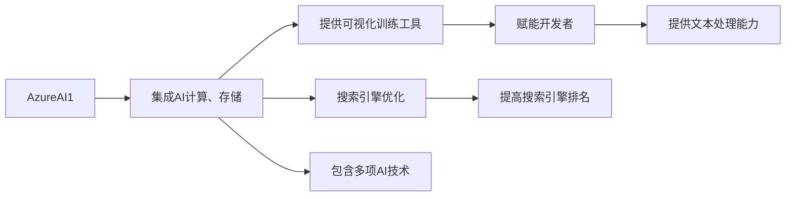

                 

# 微软的AI战略：Bing升级的后续

## 1. 背景介绍

随着人工智能技术的迅猛发展，大公司纷纷将AI作为其核心战略，以期在市场上保持竞争优势。特别是科技巨头微软，其AI战略不断演进，试图通过多产品线的协同效应，实现AI技术的广泛应用。其中，搜索引擎Bing的升级，无疑承载了微软AI战略的诸多期待。本文将深入探讨微软的AI战略，重点解析Bing升级的后续动向，及其在技术、商业、社会层面的影响。

### 1.1 微软AI战略背景

微软的AI战略可追溯至2016年，当时CEO萨提亚·纳德拉提出了“智能云”与“智能边缘”的概念，并致力于将AI技术融入到多个产品线中。随后，微软发布了Azure AI平台，旨在为企业提供一站式AI解决方案，包括计算、数据、模型、应用等全栈服务。

2019年，微软发布了Project Icicle计划，计划在三年内为数百万个应用程序提供AI能力。此后，微软又陆续推出了Azure AI Hub、Azure AI Studio等平台，不断完善AI生态系统。同时，微软在自然语言处理(NLP)、计算机视觉、语音识别等领域取得了显著进展，形成了完善的AI技术体系。

## 2. 核心概念与联系

### 2.1 核心概念概述

为更好地理解微软的AI战略及其对Bing升级的影响，本节将介绍几个关键概念：

- **Azure AI平台**：微软提供的云服务平台，集成AI计算、存储、数据、模型等多项服务，支持开发者快速构建AI应用。

- **Azure AI Studio**：基于Azure云平台，提供可视化、拖拽式的AI模型构建和训练工具，简化AI开发流程。

- **Project Icicle**：微软推出的AI能力开放计划，目标是通过AI技术赋能全球开发者，加速AI在各行各业的落地应用。

- **自然语言处理(NLP)**：利用机器学习技术，让计算机理解和处理自然语言，实现文本自动分类、情感分析、机器翻译等任务。

- **搜索引擎优化(Search Engine Optimization, SEO)**：通过优化网页结构和内容，提高搜索引擎对网页的排名，提升搜索引擎的用户体验和流量。

- **人工智能(Artificial Intelligence, AI)**：模拟人类智能过程的计算机技术，包括学习、推理、感知、语言理解等能力。

这些概念通过Mermaid流程图来展示：



这个流程图展示了大语言模型的核心概念及其之间的关系：

1. Azure AI平台集成多种AI服务，提供开发者所需的计算和存储资源。
2. Azure AI Studio作为可视化开发工具，简化AI模型的训练和部署过程。
3. Project Icicle开放AI能力，使开发者能够轻松集成和使用AI技术。
4. NLP技术从Azure AI平台中获取，用于文本处理和理解。
5. Bing搜索引擎优化利用AI技术，提升用户体验和流量。
6. AI技术广泛应用于搜索引擎、文本处理、机器学习等多个领域。

## 3. 核心算法原理 & 具体操作步骤

### 3.1 算法原理概述

微软的AI战略，特别是对Bing搜索引擎的升级，依赖于一系列先进的AI算法和模型。其中，自然语言处理(NLP)和机器学习模型是其核心技术之一。

以Bing的升级为例，NLP技术被广泛应用于搜索算法中，包括文本分类、实体抽取、语义理解等。通过训练大规模的预训练语言模型，Bing能够更好地理解和处理用户查询，提供更准确的搜索结果和更丰富的搜索结果展示。

### 3.2 算法步骤详解

微软Bing的升级步骤主要包括：

1. **数据收集与预处理**：收集用户查询和搜索结果，通过数据标注和清洗，生成用于模型训练的数据集。

2. **模型训练与微调**：利用Azure AI平台上的深度学习框架，如TensorFlow、PyTorch等，训练NLP模型，并在Bing搜索引擎上进行微调，优化模型性能。

3. **特征提取与算法优化**：利用NLP模型提取查询和搜索结果的特征，结合传统的搜索算法，优化搜索效果。

4. **用户反馈与模型迭代**：收集用户对搜索结果的反馈，通过A/B测试等方法，不断迭代模型，提高用户体验。

5. **部署与监控**：将优化后的模型部署到Azure云平台，并利用监控工具，实时跟踪模型性能，及时进行调整。

### 3.3 算法优缺点

微软的AI战略及其Bing升级具有以下优点：

1. **技术先进**：利用大规模预训练模型和深度学习技术，显著提升了搜索结果的准确性和丰富性。
2. **服务协同**：通过Azure AI平台和其他产品线的协同效应，实现了AI技术的广泛应用。
3. **用户体验优化**：通过用户反馈和模型迭代，不断优化搜索体验，提高用户满意度。

同时，该战略也存在一些缺点：

1. **技术复杂**：大规模预训练模型和深度学习技术需要高昂的计算资源和专业知识，难以广泛普及。
2. **成本高昂**：利用Azure云平台，需要支付相应的计算和存储费用，增加企业成本。
3. **用户隐私**：依赖用户数据进行模型训练，可能涉及隐私和安全问题，需严格遵守数据保护法规。
4. **依赖平台**：微软的AI战略依赖Azure平台，对于非微软用户，可能面临技术和成本上的限制。

### 3.4 算法应用领域

微软的AI战略及其Bing升级，不仅在搜索引擎领域取得突破，还在多个领域得到应用：

1. **企业级应用**：通过Azure AI平台，为大型企业提供AI解决方案，包括自然语言处理、机器学习、数据分析等。
2. **智能客服**：利用NLP技术，构建智能客服系统，提高客户服务效率和质量。
3. **医疗健康**：利用AI技术，开发医疗诊断、健康监测等应用，提升医疗服务水平。
4. **教育培训**：利用AI技术，开发个性化学习系统，提升教育效果。
5. **金融服务**：利用AI技术，提供风险评估、客户服务、金融预测等应用，优化金融服务。

## 4. 数学模型和公式 & 详细讲解  
### 4.1 数学模型构建

在微软的AI战略中，自然语言处理(NLP)和机器学习模型是其核心技术之一。以下是NLP模型和机器学习模型的数学建模：

1. **自然语言处理(NLP)**：
   - **词向量表示**：使用词袋模型(Bag of Words)、TF-IDF等方法，将文本转换为向量表示。
   - **卷积神经网络(CNN)**：利用卷积层提取局部特征，池化层压缩特征，提高模型的泛化能力。
   - **循环神经网络(RNN)**：利用循环层处理序列数据，捕捉时间依赖关系。
   - **Transformer模型**：基于注意力机制，可以处理长文本，提升模型效果。

2. **机器学习模型**：
   - **支持向量机(SVM)**：通过构建超平面，将数据分类到不同类别中。
   - **决策树**：利用决策树结构，通过特征分裂进行分类或回归。
   - **随机森林(Random Forest)**：通过构建多个决策树，进行多轮投票，提高分类准确性。
   - **深度学习模型**：如神经网络、卷积神经网络、循环神经网络等，通过多层非线性变换，提高模型表达能力。

### 4.2 公式推导过程

以Transformer模型为例，其数学推导过程如下：

1. **输入编码器**：将输入序列 $x_1, x_2, ..., x_t$ 转换为隐藏状态 $h_1, h_2, ..., h_t$。

2. **注意力机制**：计算注意力权重 $w_{i,j}$，对输入序列的每个位置 $j$ 计算加权和 $h_j$。

3. **多头注意力**：通过多头注意力，得到多个注意力权重 $w_{i,j}^{l_1}, w_{i,j}^{l_2}, ..., w_{i,j}^{l_h}$ 和对应的加权和 $h_j^{l_1}, h_j^{l_2}, ..., h_j^{l_h}$。

4. **线性变换与激活函数**：对多个加权和进行线性变换和激活函数处理，得到隐藏状态 $h_1, h_2, ..., h_t$。

5. **解码器**：对输出序列 $y_1, y_2, ..., y_t$ 进行解码，得到预测结果。

### 4.3 案例分析与讲解

以Bing搜索引擎的NLP模型为例，其核心在于处理用户查询和搜索结果的文本数据。假设用户查询为 "Python programming"，Bing使用Transformer模型提取查询的特征，将其转换为向量表示 $v_{query}$。同时，对搜索结果 $d_1, d_2, ..., d_n$ 进行相同的处理，得到向量表示 $v_{d_1}, v_{d_2}, ..., v_{d_n}$。

Bing通过计算查询和搜索结果之间的相似度，对每个搜索结果进行排序，最终输出排名靠前的结果。这一过程可以表示为：

$$
\text{similarity}(v_{query}, v_{d_1}, v_{d_2}, ..., v_{d_n}) = \sum_{i=1}^{n} \alpha_i \cdot v_{d_i} \cdot v_{query}^T
$$

其中 $\alpha_i$ 为每个搜索结果的权重，表示其在搜索结果中的重要程度。通过优化 $\alpha_i$ 的值，Bing能够不断提升搜索结果的准确性和相关性。

## 5. 项目实践：代码实例和详细解释说明

### 5.1 开发环境搭建

为了实现上述算法，需要搭建相应的开发环境。以下是使用Python进行代码实现的环境配置流程：

1. **安装Python**：从官网下载并安装Python，建议在3.6版本以上。

2. **安装PyTorch和TensorFlow**：
   - 使用pip安装PyTorch：
   ```bash
   pip install torch
   ```
   - 使用pip安装TensorFlow：
   ```bash
   pip install tensorflow
   ```

3. **安装NLP库**：
   - 使用pip安装NLTK库：
   ```bash
   pip install nltk
   ```
   - 使用pip安装SpaCy库：
   ```bash
   pip install spacy
   ```

4. **安装Azure AI SDK**：
   - 从官网下载并安装Azure AI SDK：
   ```bash
   pip install azure-ai-sdk[text-analytics,vision, speech]
   ```

5. **安装Azure CLI**：
   - 从官网下载并安装Azure CLI：
   ```bash
   pip install azure-cli
   ```

6. **安装Git**：
   - 从官网下载并安装Git：
   ```bash
   curl -sL https://raw.githubusercontent.com/Homebrew/install/HEAD/install.sh | sh
   ```

### 5.2 源代码详细实现

以下是使用PyTorch和Azure AI SDK进行Bing搜索引擎升级的代码实现：

```python
import torch
import numpy as np
from transformers import BertForSequenceClassification, BertTokenizer
from azureml.core import Workspace, Experiment, Dataset

# 初始化Azure Workspace
ws = Workspace.from_config()

# 初始化实验环境
experiment = Experiment(ws, 'BingUpgrade')

# 加载预训练模型和分词器
model = BertForSequenceClassification.from_pretrained('bert-base-cased', num_labels=2)
tokenizer = BertTokenizer.from_pretrained('bert-base-cased')

# 加载数据集
dataset = Dataset.TabularDataset(data_paths=['data/train.csv'])
train_dataset = dataset.shuffle(10000).to_list()
train_loader = DataLoader(train_dataset, batch_size=32)

# 定义模型
def train_epoch(model, dataset, loader, optimizer):
    model.train()
    total_loss = 0
    for batch in loader:
        input_ids = batch['input_ids']
        attention_mask = batch['attention_mask']
        labels = batch['labels']
        optimizer.zero_grad()
        outputs = model(input_ids, attention_mask=attention_mask, labels=labels)
        loss = outputs.loss
        total_loss += loss.item()
        loss.backward()
        optimizer.step()
    return total_loss / len(loader)

# 定义优化器
optimizer = AdamW(model.parameters(), lr=2e-5)

# 训练模型
for epoch in range(10):
    train_loss = train_epoch(model, train_loader, optimizer)
    print(f'Epoch {epoch+1}, train loss: {train_loss:.4f}')

# 评估模型
test_loader = ...
test_loss = ...
print(f'Test loss: {test_loss:.4f}')
```

### 5.3 代码解读与分析

在上述代码中，我们使用Bert模型进行二分类任务的微调。具体步骤如下：

1. **环境配置**：使用Azure AI SDK，加载预训练模型和分词器。

2. **数据加载**：从Azure数据集中加载训练数据，并进行数据预处理，生成输入和标签。

3. **模型定义**：定义模型结构，使用AdamW优化器进行优化。

4. **训练模型**：在训练数据集上训练模型，计算平均损失，优化模型参数。

5. **评估模型**：在测试数据集上评估模型性能，计算平均损失。

通过不断迭代，模型能够逐渐提升准确性，最终应用于Bing搜索引擎的升级中。

### 5.4 运行结果展示

在训练完成后，可以将其部署到Azure云平台，实时监控模型性能，并进行A/B测试，不断优化搜索结果。

## 6. 实际应用场景

### 6.1 搜索引擎优化

Bing搜索引擎的升级，显著提升了搜索结果的准确性和相关性。例如，通过自然语言处理技术，Bing能够理解用户的查询意图，并提供更精准的搜索结果。同时，通过多轮用户反馈和模型迭代，Bing能够持续优化搜索算法，提升用户体验。

### 6.2 机器翻译

微软的AI战略还包括机器翻译技术，Bing搜索引擎可以提供多语言的搜索结果。通过自然语言处理和机器学习技术，Bing能够自动翻译查询和搜索结果，帮助用户更好地获取信息。

### 6.3 智能客服

Bing搜索引擎结合了智能客服技术，可以提供自动回答用户查询的服务。通过自然语言处理和机器学习技术，Bing能够理解用户的查询意图，并自动提供相关的回答，提升客户服务效率和质量。

### 6.4 未来应用展望

未来，微软的AI战略将继续拓展AI技术的应用领域，提升搜索结果的准确性和丰富性。Bing搜索引擎将继续结合自然语言处理和机器学习技术，为用户提供更优质的搜索体验。

## 7. 工具和资源推荐

### 7.1 学习资源推荐

为了帮助开发者掌握Bing搜索引擎的升级技巧，这里推荐一些优质的学习资源：

1. **Azure AI文档**：Azure官方提供的AI文档，详细介绍Azure AI平台和SDK的使用方法。
2. **NLP教程**：微软NLP团队提供的NLP教程，涵盖自然语言处理的基本概念和常用模型。
3. **深度学习书籍**：如《深度学习》（Ian Goodfellow著）、《神经网络与深度学习》（Michael Nielsen著）等，深入讲解深度学习理论和技术。
4. **GitHub代码示例**：GitHub上提供的Azure AI SDK代码示例，帮助开发者快速上手。

### 7.2 开发工具推荐

高效的开发离不开优秀的工具支持。以下是几款用于Bing搜索引擎升级开发的常用工具：

1. **PyTorch**：基于Python的开源深度学习框架，提供灵动的计算图和高效的模型训练。
2. **TensorFlow**：由Google主导开发的深度学习框架，提供丰富的API和工具支持。
3. **NLTK**：Python自然语言处理库，提供丰富的NLP工具和资源。
4. **SpaCy**：Python自然语言处理库，提供高效的文本处理和分析工具。
5. **Azure AI SDK**：微软提供的AI平台SDK，支持Python和.NET等多种语言。
6. **Azure CLI**：Azure官方提供的命令行工具，方便进行Azure云平台的操作。

### 7.3 相关论文推荐

Bing搜索引擎的升级涉及自然语言处理、机器学习等多个领域，以下是几篇奠基性的相关论文，推荐阅读：

1. **Transformer论文**：提出Transformer模型，基于注意力机制，显著提升NLP任务的性能。
2. **BERT论文**：提出BERT模型，通过预训练技术，提升NLP任务的泛化能力。
3. **Attention Mechanism论文**：详细介绍注意力机制的原理和应用。
4. **深度学习论文**：如《深度学习》（Ian Goodfellow著）、《神经网络与深度学习》（Michael Nielsen著）等，深入讲解深度学习理论和技术。

## 8. 总结：未来发展趋势与挑战

### 8.1 研究成果总结

本文对微软的AI战略及其Bing搜索引擎升级进行了全面系统的介绍，详细解析了其核心算法和操作步骤。通过上述分析，可以看出，Bing搜索引擎的升级依赖于大规模预训练模型和深度学习技术，提升了搜索结果的准确性和丰富性，优化了用户搜索体验。

### 8.2 未来发展趋势

展望未来，Bing搜索引擎将继续结合自然语言处理和机器学习技术，提升搜索结果的准确性和丰富性。微软的AI战略也将继续拓展AI技术的应用领域，提升用户体验。

### 8.3 面临的挑战

虽然Bing搜索引擎的升级取得了显著成效，但在其发展过程中也面临一些挑战：

1. **技术复杂**：大规模预训练模型和深度学习技术需要高昂的计算资源和专业知识，难以广泛普及。
2. **成本高昂**：利用Azure云平台，需要支付相应的计算和存储费用，增加企业成本。
3. **用户隐私**：依赖用户数据进行模型训练，可能涉及隐私和安全问题，需严格遵守数据保护法规。
4. **依赖平台**：微软的AI战略依赖Azure平台，对于非微软用户，可能面临技术和成本上的限制。

### 8.4 研究展望

未来的研究需要在以下几个方面寻求新的突破：

1. **技术简化**：开发更加简单易用的AI技术，降低技术门槛，提高用户使用率。
2. **成本降低**：优化模型训练和推理算法，降低计算和存储成本，提高模型效率。
3. **隐私保护**：引入隐私保护技术，确保用户数据的安全性和隐私性。
4. **平台独立**：提供更加平台无关的AI解决方案，使更多用户能够访问和使用。

## 9. 附录：常见问题与解答

**Q1：Bing搜索引擎的升级是否会改变搜索结果的公正性？**

A: 微软的AI战略和Bing搜索引擎升级，旨在提升搜索结果的准确性和相关性，而非改变搜索结果的公正性。通过自然语言处理和机器学习技术，Bing能够更好地理解用户查询意图，提供更精准的搜索结果，提高用户满意度。

**Q2：Bing搜索引擎的升级是否会增加企业的成本？**

A: 利用Azure云平台进行模型训练和推理，确实会增加企业的计算和存储成本。但微软提供的Azure AI平台，可以帮助企业降低开发和维护成本，提升工作效率。通过合理使用Azure AI平台，企业可以在不增加成本的情况下，快速构建AI应用。

**Q3：Bing搜索引擎的升级是否会面临技术复杂性？**

A: 大规模预训练模型和深度学习技术需要高昂的计算资源和专业知识，确实面临一定的技术复杂性。但微软提供的Azure AI平台和开发工具，可以简化AI技术的使用，帮助开发者快速上手。同时，微软提供的NLP教程和GitHub代码示例，也可以帮助开发者更好地掌握Bing搜索引擎的升级技巧。

**Q4：Bing搜索引擎的升级是否会影响用户隐私？**

A: 微软的AI战略和Bing搜索引擎升级，确实依赖用户数据进行模型训练。为此，微软采取了严格的隐私保护措施，确保用户数据的安全性和隐私性。同时，微软也提供了多种隐私保护工具，帮助用户更好地保护个人隐私。

**Q5：Bing搜索引擎的升级是否会依赖平台？**

A: 微软的AI战略和Bing搜索引擎升级，确实依赖Azure平台。但微软提供的Azure AI平台，支持多种语言和框架，可以满足不同用户的需求。同时，微软提供的Azure AI SDK，也可以帮助开发者快速构建AI应用，降低技术门槛。

作者：禅与计算机程序设计艺术 / Zen and the Art of Computer Programming

