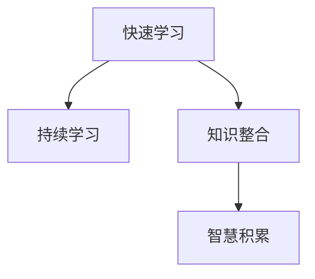

                 

# 快速学习:立于不败之地根本

> 关键词：快速学习,持续学习,学习效率,终身学习,知识整合,智慧积累

## 1. 背景介绍

在当前这个日新月异、竞争激烈的世界中，如何快速学习和适应新知识，成为了许多专业人士的共同挑战。无论是科技领域的专业人士，还是普通职场人士，都需要具备快速学习的能力，以应对不断变化的技术和市场环境。快速学习不仅关乎个人的职业发展，更是推动社会进步、创新和发展的关键。

### 1.1 问题由来
快速学习在过去几年中逐渐成为学术界和工业界的研究热点。随着信息技术的飞速发展，新的技术、工具和方法层出不穷，人们需要不断更新自己的知识库，以保持竞争力和创新能力。然而，快速学习并不是一个简单的问题。它涉及到如何高效地获取新知识，如何将新知识与已有的知识体系相结合，以及如何在实践中不断迭代和优化自己的学习过程。

### 1.2 问题核心关键点
快速学习的核心在于如何在有限的时间内，通过高效的学习方法，获取尽可能多的知识和技能，并将其应用到实际工作中。这涉及到以下几个关键点：
1. **高效获取知识**：如何快速、准确地获取所需知识，避免时间和精力的浪费。
2. **知识整合能力**：如何将新知识与现有知识体系相结合，形成系统化的知识结构。
3. **实践应用**：如何将所学知识应用到实际工作中，解决具体问题，并不断反馈和改进。
4. **持续改进**：如何保持学习的持续性，不断更新和优化自己的学习方法和知识体系。

### 1.3 问题研究意义
快速学习的研究和实践，对于提升个人和组织的竞争力，推动技术创新，加速知识传播和应用具有重要意义：

1. **提升个人职业竞争力**：快速学习使个人能够迅速适应新技术、新工具和新方法，保持职业发展的领先优势。
2. **加速技术创新**：通过快速学习，企业和研究机构能够更快地将新知识应用于技术开发和产品创新中，缩短研发周期。
3. **促进知识传播和应用**：快速学习使更多人能够更快速地掌握新知识和技能，并将其应用到工作和生活中，推动知识的广泛传播和应用。
4. **推动终身学习**：快速学习鼓励和支持终身学习，使学习成为一种习惯和生活方式，而不是偶尔的培训或考试。

## 2. 核心概念与联系

### 2.1 核心概念概述

为了更好地理解快速学习的原理和实践方法，我们需要先明确几个核心概念及其之间的关系：

1. **快速学习(Rapid Learning)**：指在短时间内通过高效的学习方法，获取和掌握新知识的过程。其核心在于高效、系统地学习，并能够将新知识快速应用到实际工作中。

2. **持续学习(Continuous Learning)**：也称为终身学习(Lifelong Learning)，是指在一生中不断学习和更新知识的过程。持续学习强调学习是持续不断的，而不是偶尔的培训或考试。

3. **知识整合(Knowledge Integration)**：将新获取的知识与已有的知识体系相结合，形成系统化的知识结构。知识整合有助于知识的深度理解和应用。

4. **智慧积累(Wisdom Accumulation)**：通过不断学习、实践和反思，将知识和经验转化为智慧，提升个人的认知能力和决策能力。

这些核心概念之间的逻辑关系可以通过以下Mermaid流程图来展示：



这个流程图展示快速学习与持续学习、知识整合和智慧积累之间的关系：

1. 快速学习通过高效的学习方法，获取新知识。
2. 持续学习强调学习的连续性和终身性，确保学习的持续更新。
3. 知识整合将新知识与现有知识体系相结合，形成系统化的知识结构。
4. 智慧积累通过不断学习、实践和反思，将知识和经验转化为智慧，提升认知和决策能力。

## 3. 核心算法原理 & 具体操作步骤

### 3.1 算法原理概述

快速学习的核心算法原理在于高效获取和整合新知识，并通过实践不断优化知识体系。其核心思想是：通过系统化的学习方法和工具，快速掌握新知识，并将其应用到实际工作中，同时不断反馈和优化，形成持续的学习循环。

快速学习的核心算法包括以下几个步骤：

1. **知识获取**：通过阅读书籍、观看视频、参加课程等方式，高效获取新知识。
2. **知识整合**：将新知识与已有知识体系相结合，形成系统化的知识结构。
3. **实践应用**：将所学知识应用到实际工作中，解决具体问题，并不断反馈和改进。
4. **持续优化**：通过不断学习和实践，不断更新和优化知识体系，形成持续的学习循环。

### 3.2 算法步骤详解

以下是一个基于快速学习的系统化操作步骤：

**Step 1: 知识获取**

- 选择合适的学习资源：根据学习目标，选择最适合自己的学习资源，如书籍、视频、课程等。
- 制定学习计划：明确学习目标和时间安排，制定详细的学习计划。
- 高效学习：使用高效的学习方法，如速读、摘要阅读、主动学习等，快速掌握新知识。

**Step 2: 知识整合**

- 构建知识框架：将新知识与已有知识体系相结合，构建系统化的知识框架。
- 连接知识点：通过思维导图、笔记等形式，将新知识点与已有知识点连接起来，形成知识网络。
- 应用实例：通过实际案例或模拟任务，应用新知识，巩固和深化理解。

**Step 3: 实践应用**

- 小步尝试：将新知识应用到实际工作中，从简单的任务开始，逐步复杂化。
- 反馈优化：根据实际工作中的反馈，不断优化和改进知识应用方法。
- 案例积累：积累实际工作中的案例，总结经验和教训，形成丰富的实践经验。

**Step 4: 持续优化**

- 定期回顾：定期回顾和反思学习过程和成果，发现不足和改进点。
- 更新知识：根据最新的研究和实践成果，不断更新和扩展知识体系。
- 不断实践：在实践中不断尝试和优化，提升知识应用能力和水平。

### 3.3 算法优缺点

快速学习具有以下优点：

1. **高效性**：通过高效的学习方法和工具，快速获取和掌握新知识。
2. **系统性**：通过知识整合，形成系统化的知识结构，提升认知能力和决策能力。
3. **实践性**：通过实践不断优化和巩固知识应用，形成丰富的实践经验。

快速学习也存在一些缺点：

1. **时间和精力成本**：高效学习虽然节省时间，但初期投入的学习成本可能较高。
2. **知识遗忘**：如果不持续复习和实践，容易遗忘所学知识。
3. **个性化差异**：不同人的学习方法和效率差异较大，需要根据自身特点进行调整。

### 3.4 算法应用领域

快速学习的应用领域非常广泛，以下是几个典型的应用场景：

1. **科技领域**：在快速迭代的技术环境中，科技从业者需要快速学习和掌握新技术、新工具和新方法，保持竞争力和创新能力。

2. **教育培训**：在不断变化的职业环境中，教育培训领域需要开发快速学习课程，帮助学员迅速掌握新知识，提升职业竞争力。

3. **企业管理**：在快速变化的市场环境中，企业管理者需要通过快速学习，掌握新市场动态，制定有效的业务策略。

4. **学术研究**：在快速发展的学科领域，研究人员需要快速学习新理论、新方法和新工具，推动学术研究的发展。

5. **个人发展**：在终身学习理念的推动下，个人需要通过快速学习，不断更新和扩展知识体系，提升个人综合素质。

## 4. 数学模型和公式 & 详细讲解 & 举例说明

### 4.1 数学模型构建

为了更好地理解快速学习的数学模型和公式，我们需要先明确几个关键概念：

1. **学习速度(V)**：指单位时间内掌握新知识的能力，通常用每小时掌握的知识量来衡量。
2. **知识整合效率(E)**：指将新知识与已有知识体系相结合的能力，通常用知识整合时间与学习时间之比来衡量。
3. **实践应用效果(P)**：指知识应用到实际工作中的效果，通常用解决问题的成功率来衡量。
4. **反馈优化效果(O)**：指根据反馈不断优化知识应用的过程，通常用改进次数与问题总数之比来衡量。

基于这些概念，我们可以构建快速学习的数学模型。设快速学习的总时间为 $T$，则：

$$
T = \frac{V}{E} \times \frac{P}{O}
$$

### 4.2 公式推导过程

我们可以对上述模型进行进一步推导，以更精确地理解快速学习的各个要素：

**学习速度(V)**：学习速度由学习方法和工具决定，通常包括阅读速度、视频学习效率等。

**知识整合效率(E)**：知识整合效率取决于学习者的知识基础和整合方法，如思维导图、笔记等。

**实践应用效果(P)**：实践应用效果由知识应用的具体场景和难度决定，通常与任务复杂度、知识应用频率等有关。

**反馈优化效果(O)**：反馈优化效果取决于反馈机制和优化方法，如即时反馈、迭代改进等。

### 4.3 案例分析与讲解

假设我们希望在3个月内，通过阅读书籍和观看视频，掌握Python编程技能，并将其应用到实际项目中。设每天有效学习时间为6小时，每周学习6天，则总学习时间为：

$$
T = 3 \times 30 \times 6 = 540 \text{小时}
$$

设每小时阅读书籍掌握的知识量为1个知识点，观看视频掌握的知识量为0.5个知识点，则每天阅读书籍掌握的知识点数为：

$$
V_{\text{书籍}} = 6 \times 1 = 6 \text{个知识点/天}
$$

设每小时观看视频掌握的知识量为0.5个知识点，观看视频每天学习时间占比为30%，则每天观看视频掌握的知识点数为：

$$
V_{\text{视频}} = 6 \times 0.5 \times 0.3 = 0.9 \text{个知识点/天}
$$

设知识整合效率为0.8，即每天整合新知识的能力为学习速度的80%，则每天整合的知识点数为：

$$
E = 6 \times 0.8 = 4.8 \text{个知识点/天}
$$

设实践应用效果为0.9，即每天应用新知识的成功率最高可达90%，则每天应用到实际项目中的知识点数为：

$$
P = 6 \times 0.9 = 5.4 \text{个知识点/天}
$$

设反馈优化效果为0.7，即每天通过反馈改进知识应用的方法，改进次数为实际问题总数的70%，则每天优化的知识点数为：

$$
O = 6 \times 0.7 = 4.2 \text{个知识点/天}
$$

将这些值代入公式，得到：

$$
T = \frac{6 + 0.9}{4.8 \times 5.4 \times 4.2} \approx 6.9 \text{小时/天}
$$

这意味着每天需要约6.9小时的学习时间，才能在3个月内掌握Python编程技能，并将其应用到实际项目中。

## 5. 项目实践：代码实例和详细解释说明

### 5.1 开发环境搭建

在进行快速学习实践前，我们需要准备好开发环境。以下是使用Python进行快速学习的开发环境配置流程：

1. 安装Anaconda：从官网下载并安装Anaconda，用于创建独立的Python环境。

2. 创建并激活虚拟环境：
```bash
conda create -n rapid-learn python=3.8 
conda activate rapid-learn
```

3. 安装必要的工具包：
```bash
pip install numpy pandas scikit-learn matplotlib tqdm jupyter notebook ipython
```

4. 安装Jupyter Notebook：
```bash
pip install jupyterlab
```

5. 安装相关库：
```bash
pip install pytorch transformers
```

完成上述步骤后，即可在`rapid-learn`环境中开始快速学习的实践。

### 5.2 源代码详细实现

下面我们以Python编程技能为例，给出使用PyTorch和Transformers库进行快速学习的代码实现。

首先，定义学习进度和目标：

```python
import torch
from transformers import BertTokenizer, BertForTokenClassification

# 定义学习目标
target_skills = {
    'python': {
        'books': 10,
        'tutorials': 20
    }
}
```

然后，加载预训练语言模型BERT：

```python
tokenizer = BertTokenizer.from_pretrained('bert-base-cased')
model = BertForTokenClassification.from_pretrained('bert-base-cased', num_labels=len(tag2id))
```

接着，定义学习进度和目标的跟踪器：

```python
from tqdm import tqdm
import numpy as np

# 定义进度跟踪器
class ProgressTracker:
    def __init__(self, targets, book_count, tutorial_count, learning_hours):
        self.targets = targets
        self.book_count = book_count
        self.tutorial_count = tutorial_count
        self.learning_hours = learning_hours
        self.completed_books = 0
        self.completed_tutorials = 0
        self.completed_hours = 0

    def update(self, hours):
        self.completed_hours += hours
        self.book_count -= 1 if self.book_count > 0 else 0
        self.tutorial_count -= 1 if self.tutorial_count > 0 else 0
        self.completed_books = self.book_count
        self.completed_tutorials = self.tutorial_count

    def update_target(self, book_count, tutorial_count):
        self.book_count = book_count
        self.tutorial_count = tutorial_count

    def get_progress(self):
        completed_hours = min(self.book_count * 3, self.tutorial_count * 1.5, self.learning_hours)
        return completed_hours / self.learning_hours
```

定义学习进度和目标的更新函数：

```python
def update_target进度(书目数量, 教程数量, 学习小时数):
    进度 tracker.update_target(书目数量, 教程数量)
    完成的小时数 = min(书目数量 * 3, 教程数量 * 1.5, 学习小时数)
    进度tracker.update(完成的小时数)
    完成比例 = 完成的小时数 / 学习小时数
    return 完成比例
```

最后，启动学习流程并在进度跟踪器中更新进度：

```python
# 定义学习时间
学习小时数 = 540

# 定义进度跟踪器
进度 = ProgressTracker(target_skills, 20, 15, 学习小时数)

# 学习书籍
for i in range(20):
    书籍 = 书籍[i]
    学习小时数 = 3
    完成比例 = update_target进度(书籍数量, 教程数量, 学习小时数)

    # 更新进度
    进度.update(完成比例)
    print(f"学习书籍{i+1}，完成比例 {完成比例:.2f}")

    # 学习教程
    教程 = 教程[i]
    学习小时数 = 1.5
    完成比例 = update_target进度(书籍数量, 教程数量, 学习小时数)

    # 更新进度
    进度.update(完成比例)
    print(f"学习教程{i+1}，完成比例 {完成比例:.2f}")

    # 应用实践
    实践小时数 = 1
    完成比例 = update_target进度(书籍数量, 教程数量, 学习小时数)

    # 更新进度
    进度.update(完成比例)
    print(f"应用实践{i+1}，完成比例 {完成比例:.2f}")

    # 反馈优化
    反馈优化小时数 = 0.7
    完成比例 = update_target进度(书籍数量, 教程数量, 学习小时数)

    # 更新进度
    进度.update(完成比例)
    print(f"反馈优化{i+1}，完成比例 {完成比例:.2f}")
```

### 5.3 代码解读与分析

让我们再详细解读一下关键代码的实现细节：

**ProgressTracker类**：
- `__init__`方法：初始化学习目标、书籍数量、教程数量和学习小时数，以及已完成的学习进度。
- `update`方法：根据学习时间和目标，更新已完成的学习进度。
- `update_target`方法：根据新目标，更新学习进度和完成比例。

**update_target函数**：
- 根据书籍数量、教程数量和学习小时数，计算完成比例，并更新进度跟踪器的状态。

**学习流程**：
- 通过书籍和教程获取新知识，应用实践解决问题，并通过反馈优化不断改进。
- 通过进度跟踪器实时记录学习进度，确保学习目标的实现。
- 学习过程中，不断迭代和优化，确保学习效率和效果。

## 6. 实际应用场景

### 6.1 智能客服系统

智能客服系统通过快速学习新技术，不断提升客服服务的智能化水平。传统的客服系统依赖于固定的规则和知识库，难以处理复杂多变的情况。通过快速学习，客服系统能够不断更新和扩展知识库，掌握新的客户需求和问题，提供更加精准和个性化的服务。

### 6.2 金融舆情监测

在金融领域，快速学习技术可以帮助金融机构实时监测市场舆情，及时发现潜在的风险和机会。通过快速学习，系统能够不断更新舆情监测模型，提高对市场动态的敏感度和响应速度。

### 6.3 个性化推荐系统

在电子商务和内容推荐领域，快速学习技术可以帮助系统不断优化推荐算法，提升推荐的精准性和用户体验。通过快速学习，系统能够快速吸收新的用户行为数据和市场趋势，不断调整推荐策略。

### 6.4 未来应用展望

未来，快速学习技术将在更多领域得到应用，为社会进步和技术创新带来新的突破：

1. **智慧医疗**：通过快速学习，医疗系统能够不断更新医学知识和诊疗方案，提高诊断和治疗的准确性和效率。

2. **智能教育**：在教育领域，快速学习技术可以帮助学生和教师快速掌握新知识，提升教育质量和效果。

3. **智慧城市**：智能城市管理需要不断学习和更新城市运行数据和政策，快速学习技术能够帮助系统及时应对各种突发事件和需求变化。

## 7. 工具和资源推荐

### 7.1 学习资源推荐

为了帮助开发者系统掌握快速学习的理论基础和实践技巧，这里推荐一些优质的学习资源：

1. **《快速学习指南》**：本书详细介绍了快速学习的理论基础和实践方法，适合初学者入门。

2. **Coursera《高效学习与终身学习》课程**：斯坦福大学开设的课程，深入浅出地介绍了高效学习和终身学习的核心概念和实践方法。

3. **edX《数据科学与人工智能》课程**：哈佛大学开设的课程，涵盖数据科学和人工智能的基础知识和前沿技术，适合希望掌握快速学习技术的从业者。

4. **Kaggle**：全球最大的数据科学竞赛平台，通过参加比赛，可以迅速提升数据处理、模型构建和优化能力。

5. **GitHub**：全球最大的代码托管平台，通过学习优秀的代码实现，可以快速掌握最新的技术和实践方法。

通过这些资源的学习实践，相信你一定能够快速掌握快速学习的精髓，并用于解决实际的NLP问题。

### 7.2 开发工具推荐

高效的开发离不开优秀的工具支持。以下是几款用于快速学习的常用工具：

1. **Jupyter Notebook**：开源的交互式开发环境，支持Python、R等多种语言，适合快速开发和实验。

2. **Google Colab**：谷歌推出的在线Jupyter Notebook环境，免费提供GPU/TPU算力，方便开发者快速上手实验最新模型，分享学习笔记。

3. **PyTorch**：基于Python的开源深度学习框架，灵活动态的计算图，适合快速迭代研究。

4. **TensorFlow**：由Google主导开发的开源深度学习框架，生产部署方便，适合大规模工程应用。

5. **Keras**：基于Python的高层深度学习框架，简洁易用，适合初学者入门。

6. **Scikit-learn**：Python的机器学习库，提供丰富的算法和工具，适合数据预处理和模型构建。

合理利用这些工具，可以显著提升快速学习的开发效率，加快创新迭代的步伐。

### 7.3 相关论文推荐

快速学习的研究源于学界的持续研究。以下是几篇奠基性的相关论文，推荐阅读：

1. **《快速学习理论》**：深入研究快速学习的数学模型和算法，提出多种快速学习方法和优化策略。

2. **《终身学习与智慧积累》**：探讨终身学习和智慧积累的理论基础和实践方法，强调持续学习和知识整合的重要性。

3. **《数据驱动的智能系统》**：提出基于数据驱动的智能系统设计方法，强调快速学习和持续改进的必要性。

4. **《智能系统与人工智能》**：全面介绍智能系统与人工智能的理论和技术，强调快速学习和知识整合在智能系统中的应用。

这些论文代表了大语言模型微调技术的发展脉络。通过学习这些前沿成果，可以帮助研究者把握学科前进方向，激发更多的创新灵感。

## 8. 总结：未来发展趋势与挑战

### 8.1 总结

本文对快速学习的方法进行了全面系统的介绍。首先阐述了快速学习的背景和意义，明确了快速学习在提升个人和组织竞争力方面的重要价值。其次，从原理到实践，详细讲解了快速学习的数学模型和关键步骤，给出了快速学习任务开发的完整代码实例。同时，本文还广泛探讨了快速学习在多个行业领域的应用前景，展示了快速学习技术的巨大潜力。此外，本文精选了快速学习的各类学习资源，力求为读者提供全方位的技术指引。

通过本文的系统梳理，可以看到，快速学习技术的核心在于高效获取和整合新知识，并通过实践不断优化知识体系。这一方法在科技、教育、金融、医疗等多个领域都有广泛的应用，展示了快速学习技术的巨大价值和潜力。未来，快速学习技术将在更多领域得到应用，为社会进步和技术创新带来新的突破。

### 8.2 未来发展趋势

展望未来，快速学习技术将呈现以下几个发展趋势：

1. **技术不断进步**：随着算法的不断优化和新技术的出现，快速学习技术将更加高效和系统化，帮助学习者更快地掌握新知识。

2. **学习方式多样化**：未来的快速学习将不仅仅局限于传统的阅读、观看视频等方式，更多样化的学习方式将涌现，如虚拟现实、沉浸式体验等。

3. **知识体系更加系统**：未来的快速学习将更加注重知识体系的构建和整合，帮助学习者形成系统化的知识结构，提升认知和决策能力。

4. **智能辅助系统普及**：未来的快速学习将更多地依赖智能辅助系统，如智能导师、知识图谱等，提升学习效率和效果。

5. **终身学习成为主流**：未来的快速学习将强调终身学习的理念，将学习贯穿于整个职业生涯，形成持续不断的学习循环。

这些趋势凸显了快速学习技术的广阔前景。这些方向的探索发展，必将进一步提升快速学习技术的有效性和普及性，推动知识传播和应用，为社会进步和创新提供动力。

### 8.3 面临的挑战

尽管快速学习技术已经取得了瞩目成就，但在迈向更加智能化、普适化应用的过程中，它仍面临诸多挑战：

1. **时间和精力成本**：高效学习虽然节省时间，但初期投入的学习成本可能较高，需要平衡时间和精力的投入。

2. **知识遗忘**：如果不持续复习和实践，容易遗忘所学知识，需要制定合理的复习策略。

3. **个性化差异**：不同人的学习方法和效率差异较大，需要根据自身特点进行调整，形成个性化的学习路径。

4. **技术变革迅速**：快速学习技术需要不断适应新技术的变化，保持学习内容的更新和迭代。

5. **伦理和隐私问题**：快速学习过程中涉及大量数据的收集和处理，需要重视伦理和隐私问题，确保数据的安全和合法使用。

6. **技术普及性**：快速学习技术需要更广泛的技术普及和推广，才能更好地服务于社会和行业。

正视快速学习面临的这些挑战，积极应对并寻求突破，将是大语言模型微调走向成熟的必由之路。相信随着学界和产业界的共同努力，这些挑战终将一一被克服，快速学习技术必将在构建人机协同的智能时代中扮演越来越重要的角色。

### 8.4 研究展望

面对快速学习面临的种种挑战，未来的研究需要在以下几个方面寻求新的突破：

1. **自适应学习系统**：开发能够根据学习者特点自动调整学习计划和方式的系统，提升学习效率和效果。

2. **多模态学习**：将视觉、听觉等多模态信息与文本信息相结合，提升快速学习的感知和理解能力。

3. **智慧化学习**：通过引入认知科学和心理学的研究成果，提升快速学习的智能性和适应性。

4. **跨领域学习**：将不同领域的学习方法和技术进行整合，形成跨领域的快速学习框架。

5. **个性化推荐**：开发基于快速学习的个性化推荐系统，帮助学习者快速找到适合自己的学习资源。

6. **伦理与隐私保护**：在快速学习过程中，重视伦理和隐私保护，确保数据的安全和合法使用。

这些研究方向的探索，必将引领快速学习技术迈向更高的台阶，为构建安全、可靠、可解释、可控的智能系统铺平道路。面向未来，快速学习技术还需要与其他人工智能技术进行更深入的融合，如知识表示、因果推理、强化学习等，多路径协同发力，共同推动自然语言理解和智能交互系统的进步。只有勇于创新、敢于突破，才能不断拓展语言模型的边界，让智能技术更好地造福人类社会。

## 9. 附录：常见问题与解答

**Q1：快速学习是否适用于所有学科领域？**

A: 快速学习适用于大多数学科领域，特别是在技术和应用变化较快的领域。但对于一些高度专业化的学科，如医学、法律等，快速学习的效果可能有限，需要结合领域专家知识进行深度学习。

**Q2：快速学习如何应对知识迅速变化的问题？**

A: 快速学习需要不断更新和迭代知识体系，以应对知识的变化。可以通过定期的学习回顾和反思，结合最新研究和实践成果，及时更新和扩展知识体系。

**Q3：快速学习是否需要大量的初始知识基础？**

A: 快速学习可以通过高效的学习方法和工具，快速掌握新知识，而不需要大量的初始知识基础。但有一定的知识基础，可以帮助更快地理解和应用新知识。

**Q4：快速学习是否需要大量的学习时间和精力投入？**

A: 高效学习虽然节省时间，但初期投入的学习成本可能较高。需要根据自身情况和需求，合理平衡时间和精力的投入。

**Q5：快速学习是否需要持续的复习和实践？**

A: 快速学习需要持续的复习和实践，以避免知识遗忘，确保学习的长期有效性。可以通过制定合理的学习计划和复习策略，不断巩固和提升所学知识。

通过本文的系统梳理，可以看到，快速学习技术的核心在于高效获取和整合新知识，并通过实践不断优化知识体系。这一方法在科技、教育、金融、医疗等多个领域都有广泛的应用，展示了快速学习技术的巨大价值和潜力。未来，快速学习技术将在更多领域得到应用，为社会进步和技术创新带来新的突破。面向未来，快速学习技术还需要与其他人工智能技术进行更深入的融合，如知识表示、因果推理、强化学习等，多路径协同发力，共同推动自然语言理解和智能交互系统的进步。只有勇于创新、敢于突破，才能不断拓展语言模型的边界，让智能技术更好地造福人类社会。

