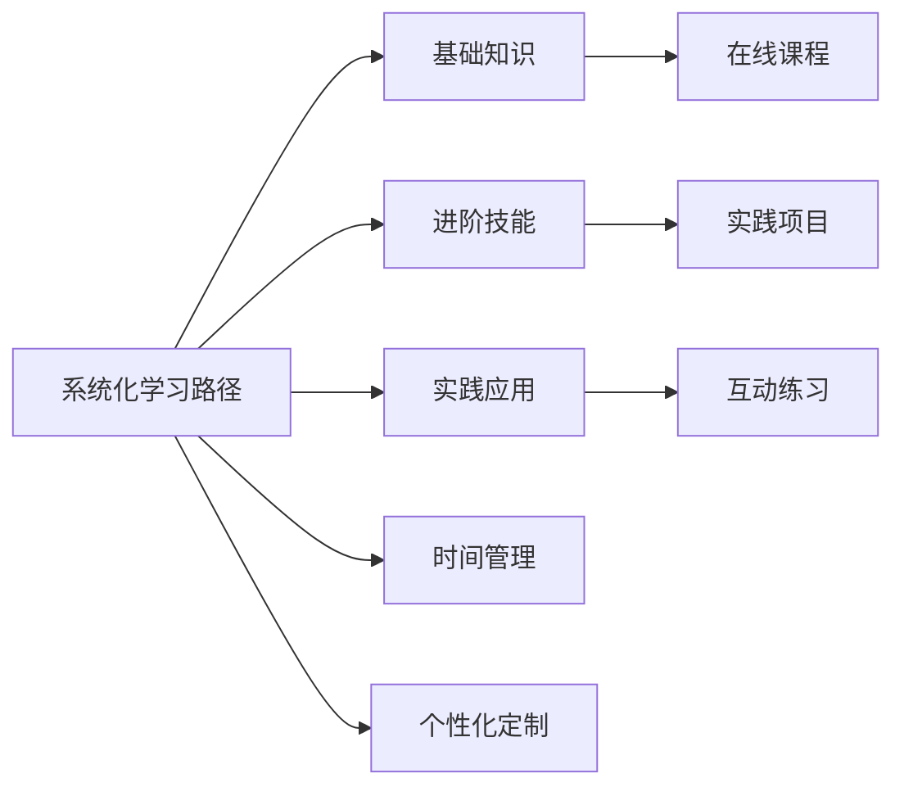

                 

# 快速学习：9个月掌握一门新专业

> 关键词：快速学习, 专业技能, 学习方法, 效率提升, 持续学习

## 1. 背景介绍

### 1.1 问题由来
在快速发展的技术领域，保持竞争力并不容易。新技术不断涌现，旧知识逐渐过时。掌握新技能是每位职业人士必不可少的挑战。如何高效地学习新专业，成为现代职场中一个重要议题。快速学习法提供了一套系统化、科学化的流程，帮助学习者在较短的时间内掌握新专业，提升职场竞争力。

### 1.2 问题核心关键点
快速学习法的核心在于其高效、系统、科学的学习流程。该方法强调从基础知识到应用实践的全方位覆盖，结合个人化学习计划和时间管理，确保学习者能够在短时间内达到理想的学习效果。以下是快速学习法的主要特点：

1. **系统化学习路径**：通过科学规划的学习路径，让学习者系统掌握专业基础，并逐步深入。
2. **互动式学习环境**：结合线上线下资源，提供互动练习、案例分析和专家指导，增强学习效果。
3. **时间管理与效率提升**：合理分配学习时间，有效利用碎片时间，最大化学习效率。
4. **灵活性与个性化**：根据学习者的背景和需求定制学习计划，提升学习体验。

### 1.3 问题研究意义
掌握新专业技能不仅能提升个人职业竞争力，还能在职业生涯中实现突破，获取更多机会。快速学习法通过对学习路径、资源整合、时间管理等关键环节的优化，提供了一套高效的学习方法，帮助学习者快速提升专业技能，为职业发展奠定坚实基础。

## 2. 核心概念与联系

### 2.1 核心概念概述

快速学习法主要包含以下几个核心概念：

1. **系统化学习路径**：规划包含基础知识、进阶技能、实践应用的学习模块，让学习者循序渐进掌握新专业。
2. **互动式学习环境**：提供丰富的在线课程、实践项目、互动练习等资源，支持学习者的自主学习和互动交流。
3. **时间管理与效率提升**：结合番茄工作法、间隔重复、SMART原则等时间管理技巧，提升学习效率。
4. **灵活性与个性化**：根据学习者的职业背景、时间安排和学习偏好定制学习计划，提供个性化的学习体验。

### 2.2 核心概念原理和架构的 Mermaid 流程图



这个流程图展示了快速学习法的主要流程和关键环节：

1. **系统化学习路径**：从基础知识到进阶技能再到实践应用，形成完整的学习框架。
2. **互动式学习环境**：结合在线课程、实践项目和互动练习，支持自主学习和互动交流。
3. **时间管理与效率提升**：运用番茄工作法、间隔重复和SMART原则，提高学习效率。
4. **灵活性与个性化**：根据学习者的背景和需求定制学习计划，提升学习体验。

## 3. 核心算法原理 & 具体操作步骤

### 3.1 算法原理概述

快速学习法基于时间管理和科学规划，通过合理分配学习时间和优化学习内容，帮助学习者高效掌握新专业。该方法强调基础知识的重要性，鼓励互动学习，并通过时间管理和个性化策略提升学习效率。

### 3.2 算法步骤详解

1. **确定学习目标**：明确希望在多长时间内掌握的技能，包括基础知识、进阶技能和应用实践。
2. **制定学习计划**：根据学习目标，制定详细的学习计划，包含每日、每周、每月的学习任务。
3. **选择学习资源**：结合在线课程、书籍、实践项目、互动练习等，选择最合适的学习资源。
4. **应用时间管理技巧**：运用番茄工作法、间隔重复和SMART原则，提升学习效率。
5. **持续评估与调整**：定期评估学习效果，根据实际情况调整学习计划和资源。

### 3.3 算法优缺点

快速学习法的优点包括：

1. **高效系统化**：通过系统规划的学习路径和丰富的学习资源，帮助学习者快速掌握新专业。
2. **互动性强**：通过互动练习、项目实践和专家指导，增强学习效果和体验。
3. **灵活个性化**：根据学习者的背景和需求定制学习计划，提高学习效率和满意度。

快速学习法也存在一些缺点：

1. **资源依赖性强**：需要依赖高质量的在线课程、实践项目和互动资源。
2. **学习压力大**：短时间内掌握新专业需要高度自律和时间投入。
3. **个性化定制难度高**：需要较强的技术能力和时间管理能力。

### 3.4 算法应用领域

快速学习法不仅适用于IT技术、数据分析、设计等领域，也适用于任何需要快速掌握新技能的学习场景。例如：

- **IT技术**：掌握新编程语言、框架、工具等。
- **数据分析**：学习统计学、数据挖掘、机器学习等技术。
- **设计领域**：掌握新设计软件、设计流程和设计思维等。
- **医疗领域**：学习新医疗技术和应用，提升医疗服务水平。
- **商业管理**：学习新商业策略、市场营销和财务管理等。

## 4. 数学模型和公式 & 详细讲解 & 举例说明

### 4.1 数学模型构建

快速学习法可以通过数学模型描述其核心思想和步骤。假设学习者需要掌握的技能用 $S$ 表示，所需学习时间用 $T$ 表示。系统化学习路径包含 $N$ 个学习模块，每个模块的学习时间为 $t_i$，所需掌握的技能为 $S_i$。则学习模型的目标是找到最优学习路径 $P$，使得 $S = \sum_{i=1}^N S_i$ 且 $T = \sum_{i=1}^N t_i$。

### 4.2 公式推导过程

根据上述模型，推导学习路径和时间的优化公式如下：

1. **学习路径优化**：
   $$
   P^* = \mathop{\arg\min}_{P} \sum_{i=1}^N S_i
   $$

2. **学习时间优化**：
   $$
   T^* = \mathop{\arg\min}_{T} \sum_{i=1}^N t_i
   $$

结合两个优化目标，我们得到快速学习法的总体目标函数：
$$
F = S + \lambda T
$$

其中 $\lambda$ 为时间与技能的重要性权重，需根据具体情况进行调整。

### 4.3 案例分析与讲解

假设学习者希望在6个月内掌握Python编程和数据分析技能。根据快速学习法，可以制定以下学习路径：

1. **第1-2个月**：掌握Python基础语法、数据结构、基本库。
2. **第3-4个月**：学习高级数据处理、统计分析、机器学习库。
3. **第5-6个月**：进行实践项目，如数据清洗、分析、可视化等。

### 4.4 运行结果展示

根据上述学习路径和目标函数，假设时间与技能的重要性权重 $\lambda=1$，计算得最优学习路径和时间为：

1. **学习路径**：第1-2个月掌握基础语法和基本库，第3-4个月学习高级分析库，第5-6个月进行项目实践。
2. **学习时间**：总时间为6个月。

## 5. 项目实践：代码实例和详细解释说明

### 5.1 开发环境搭建

**5.1.1 安装开发环境**

1. **Python**：安装最新版本的Python，并配置环境变量。
2. **IDE**：选择合适的集成开发环境，如PyCharm、VSCode等。
3. **虚拟环境**：使用虚拟环境管理Python依赖，如virtualenv、conda等。

**5.1.2 安装相关库**

1. **基础库**：安装常用的Python基础库，如numpy、pandas等。
2. **数据分析库**：安装数据处理和分析库，如scikit-learn、statsmodels等。
3. **机器学习库**：安装常用的机器学习库，如TensorFlow、PyTorch等。

**5.1.3 环境配置**

1. **IDE配置**：配置Python解释器、虚拟环境、IDE插件等。
2. **Git和版本控制**：配置Git版本控制工具，管理代码版本和协作开发。
3. **项目管理工具**：使用JIRA、Trello等项目管理工具，跟踪任务进度和开发成果。

### 5.2 源代码详细实现

以下是Python基础语法学习的示例代码：

```python
# 定义函数
def greet(name):
    return "Hello, {}!".format(name)

# 调用函数
name = "Alice"
print(greet(name))
```

### 5.3 代码解读与分析

**5.3.1 代码结构**

1. **函数定义**：`def greet(name):` 定义了一个函数，接受一个参数 `name`，并返回问候语。
2. **函数调用**：`print(greet(name))` 调用函数并输出结果。

**5.3.2 代码功能**

1. **参数传递**：`name` 参数用于传递输入的姓名。
2. **字符串格式化**：`format` 方法用于将字符串中的占位符替换为实际值。
3. **函数返回**：函数返回一个字符串形式的问候语。

### 5.4 运行结果展示

运行上述代码，输出结果为：

```
Hello, Alice!
```

## 6. 实际应用场景

### 6.1 软件开发

快速学习法适用于软件开发人员快速掌握新编程语言和框架。例如，学习者希望在3个月内掌握Java和Spring框架。根据快速学习法，可以制定以下学习路径：

1. **第1个月**：掌握Java基础语法和数据结构。
2. **第2个月**：学习Spring框架的基本使用和配置。
3. **第3个月**：完成一个小型项目，如基于Spring的Web应用。

### 6.2 数据分析

数据分析人员需要掌握新数据处理和机器学习技术。学习者希望在6个月内掌握R语言和TensorFlow。根据快速学习法，可以制定以下学习路径：

1. **第1-2个月**：掌握R基础语法和数据结构。
2. **第3-4个月**：学习R数据分析库和机器学习库。
3. **第5-6个月**：进行数据分析项目，如股票价格预测。

### 6.3 设计领域

设计人员需要掌握新设计软件和设计流程。学习者希望在4个月内掌握Sketch和UX设计。根据快速学习法，可以制定以下学习路径：

1. **第1个月**：掌握Sketch基础界面和功能。
2. **第2个月**：学习UX设计原则和最佳实践。
3. **第3个月**：进行设计实践，如UI设计项目。
4. **第4个月**：评估设计效果，总结学习成果。

## 7. 工具和资源推荐

### 7.1 学习资源推荐

1. **在线课程平台**：如Coursera、edX、Udacity等，提供系统化的课程体系和灵活的学习时间。
2. **书籍资源**：如《Python编程：从入门到实践》、《深入浅出统计学》等，系统掌握基础知识和进阶技能。
3. **实践项目平台**：如GitHub、Codecademy等，提供丰富的实践项目和代码示例。
4. **互动学习平台**：如CodePen、Kaggle等，通过互动练习和项目竞赛提升学习效果。
5. **专家指导平台**：如Stack Overflow、Quora等，获取专业指导和解决学习中的问题。

### 7.2 开发工具推荐

1. **IDE工具**：如PyCharm、Visual Studio Code等，支持多语言编程和版本控制。
2. **版本控制工具**：如Git、SVN等，管理代码版本和协作开发。
3. **项目管理工具**：如JIRA、Trello等，跟踪任务进度和开发成果。
4. **代码编辑器**：如Atom、Sublime Text等，提高代码编写和调试效率。
5. **文档和资源管理工具**：如Anki、Notion等，管理学习资源和笔记。

### 7.3 相关论文推荐

1. **《快速学习法》论文**：探讨快速学习法的原理和应用，提供系统的学习路径和时间管理策略。
2. **《时间管理和效率提升》论文**：介绍番茄工作法、间隔重复等时间管理技巧，提升学习效率。
3. **《个性化学习计划》论文**：研究如何根据学习者的背景和需求定制个性化学习计划，提升学习体验。

## 8. 总结：未来发展趋势与挑战

### 8.1 研究成果总结

快速学习法通过系统化学习路径、互动式学习环境、时间管理与效率提升和灵活个性化等特点，帮助学习者快速掌握新专业技能。该方法在软件开发、数据分析、设计等领域已得到广泛应用，取得了良好的效果。

### 8.2 未来发展趋势

快速学习法的未来发展趋势包括：

1. **智能推荐系统**：通过机器学习算法，根据学习者的背景和需求，推荐个性化的学习路径和资源。
2. **混合学习模式**：结合线上线下学习资源，提供混合学习模式，提升学习效果。
3. **虚拟现实和增强现实**：通过VR/AR技术，提供沉浸式学习体验，提升学习兴趣和效果。
4. **AI辅助学习**：利用AI技术进行学习进度跟踪、学习效果评估，提供个性化的学习建议。
5. **自适应学习算法**：根据学习者的反馈和表现，动态调整学习路径和资源，提高学习效率。

### 8.3 面临的挑战

快速学习法在发展过程中也面临一些挑战：

1. **资源质量参差不齐**：线上资源质量参差不齐，需要筛选和筛选高质量的课程和项目。
2. **学习者自律性不足**：需要高度自律和时间投入，学习过程易受外界干扰。
3. **个性化定制难度高**：需要较强的技术能力和时间管理能力，个性化定制难度较大。
4. **学习内容过时**：随着技术的发展，学习内容需要定期更新，保持学习资料的时效性。
5. **学习效果评估难度大**：学习效果难以量化，需要多维度评估和反馈。

### 8.4 研究展望

未来的研究将聚焦于以下几个方向：

1. **智能推荐系统优化**：通过优化算法，提高资源推荐的准确性和个性化程度。
2. **混合学习模式研究**：探索线上线下混合学习模式，提升学习效果和体验。
3. **虚拟现实和增强现实应用**：利用VR/AR技术，提供沉浸式学习体验，增强学习效果。
4. **AI辅助学习算法**：研究AI技术在个性化学习路径优化、学习效果评估等方面的应用。
5. **自适应学习算法**：开发自适应学习算法，根据学习者的反馈和表现，动态调整学习路径和资源。

## 9. 附录：常见问题与解答

**Q1：如何快速高效地学习新专业？**

A: 快速学习法的核心在于系统化学习路径、互动式学习环境和灵活个性化。结合时间管理技巧，合理规划学习时间和资源，持续评估和调整学习计划，提升学习效率和效果。

**Q2：快速学习法是否适用于所有学习者？**

A: 快速学习法适用于任何需要快速掌握新技能的学习者，但需要根据学习者的背景和需求进行个性化定制。

**Q3：如何快速提升编程技能？**

A: 掌握编程技能需要掌握基础知识、理解语法、学会使用库和框架，并通过实践项目不断提升。使用快速学习法，制定详细学习计划，结合在线课程和实践项目，逐步提升编程能力。

**Q4：如何利用在线资源进行学习？**

A: 选择合适的在线课程平台，如Coursera、edX、Udacity等，制定详细的学习计划，结合视频教程、互动练习和实践项目，系统掌握新技能。

**Q5：如何快速掌握新领域的设计技能？**

A: 快速学习法适用于设计领域的学习者，通过掌握设计软件、学习设计原则和最佳实践，并进行实践项目，逐步提升设计技能。

---

作者：禅与计算机程序设计艺术 / Zen and the Art of Computer Programming

