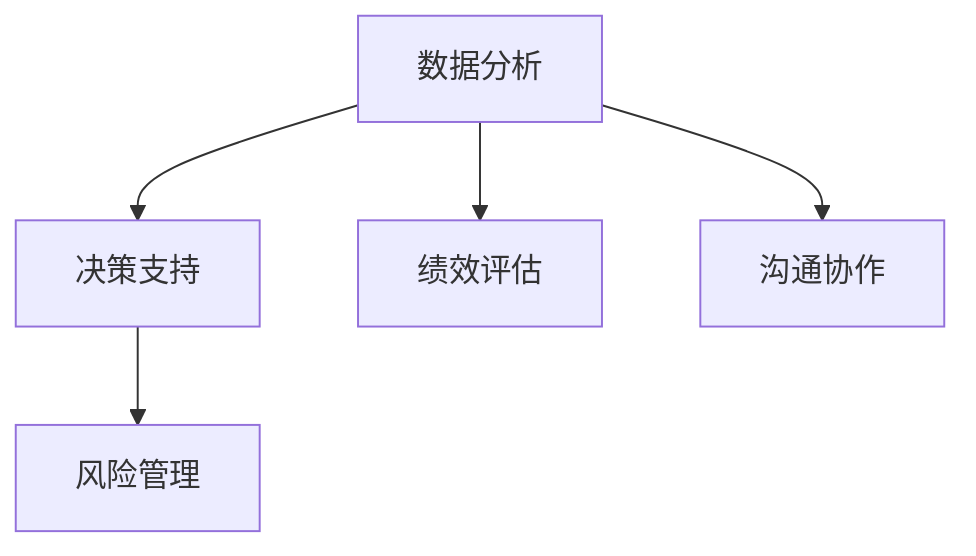
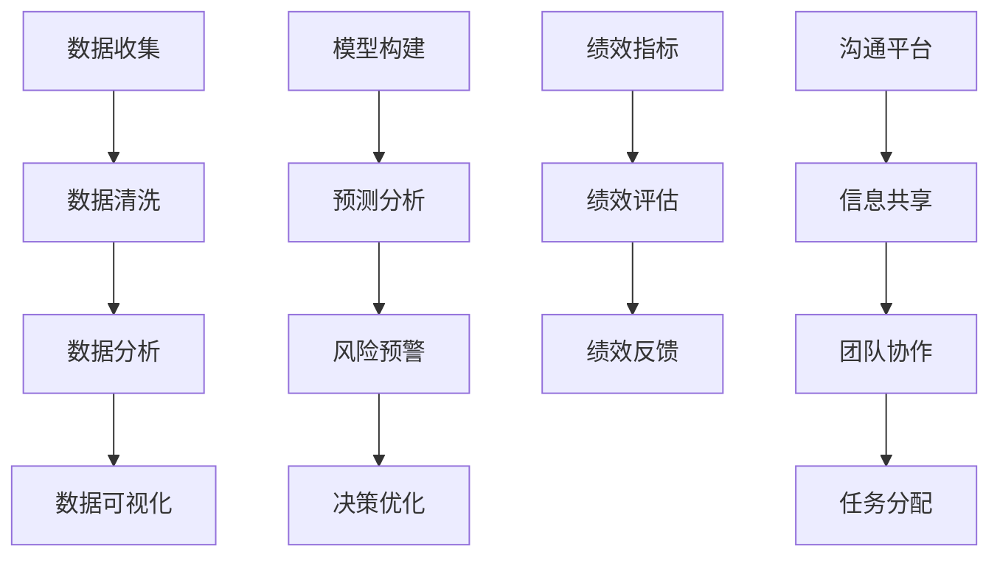

                 

# 思维工具在管理中的实际应用

> 关键词：思维工具, 项目管理, 决策支持, 绩效评估, 沟通协作, 大数据分析

## 1. 背景介绍

### 1.1 问题由来
在现代企业管理中，面对复杂的组织结构、多样化的业务场景和动态变化的市场环境，管理者需要高效地组织资源、制定决策、优化流程。然而，单纯依靠经验和直觉进行管理，往往难以满足高效、精准的要求。近年来，随着人工智能和大数据技术的飞速发展，新兴的思维工具应运而生，极大地提升了管理的智能化水平。

### 1.2 问题核心关键点
- 数据分析：利用大数据分析工具，提取和管理组织和市场中的关键信息。
- 决策支持：构建基于人工智能的决策支持系统，辅助管理者做出更为科学合理的决策。
- 绩效评估：采用先进的绩效评估工具，动态跟踪和分析员工和项目的绩效表现。
- 沟通协作：借助协作工具和平台，提升团队内部的信息流动和沟通效率。
- 风险管理：运用预测模型，识别和缓解管理中的潜在风险。

这些工具帮助管理者从海量数据中提取有价值的信息，支持高效的决策制定，提升团队的协作效率和绩效水平，对于提高企业运营的智能化和自动化水平具有重要意义。

### 1.3 问题研究意义
思维工具在现代企业管理中的应用，对于提升组织效率、优化资源配置、推动创新发展、增强决策科学性和员工满意度等方面具有重要价值。通过合理使用这些工具，管理者能够更好地理解业务现状、预见未来趋势、协调内部资源，从而推动企业健康稳定地发展。

## 2. 核心概念与联系

### 2.1 核心概念概述

为了深入理解思维工具在管理中的应用，本节将介绍几个核心概念：

- **数据分析**：通过收集、处理和分析数据，提取管理中关键的统计信息和趋势。
- **决策支持系统(DSS)**：利用人工智能算法和工具，辅助管理者进行决策分析。
- **绩效评估**：通过量化和评估指标，实时跟踪和分析员工和项目的绩效表现。
- **沟通协作工具**：借助协作平台，提升团队沟通效率，促进信息共享。
- **风险管理**：利用预测模型和仿真技术，识别和缓解管理中的潜在风险。

这些核心概念之间的关系可以通过以下Mermaid流程图来展示：



### 2.2 核心概念原理和架构的 Mermaid 流程图



这个流程图展示了数据分析、决策支持、绩效评估、沟通协作和风险管理等核心概念的逻辑关系：

1. 数据收集和清洗是基础。通过多种方式收集数据，然后进行清洗和预处理，为后续分析奠定基础。
2. 数据分析通过可视化、统计和挖掘等技术，从数据中提取关键信息。
3. 模型构建利用机器学习和统计模型，进行预测分析和风险预警。
4. 绩效评估通过设定和追踪关键绩效指标(KPIs)，实时监控和优化。
5. 沟通协作通过平台和工具，促进团队内部的信息流动和任务协调。

## 3. 核心算法原理 & 具体操作步骤

### 3.1 算法原理概述

思维工具在管理中的应用，很大程度上依赖于先进的数据分析算法和人工智能模型。这些算法和技术主要包括以下几个方面：

- **统计分析**：通过描述性统计和推断统计方法，提取数据的关键特征和趋势。
- **预测建模**：利用时间序列分析和回归模型，预测未来的业务变化和风险趋势。
- **机器学习**：应用监督学习和无监督学习算法，构建高精度的分类、聚类和推荐模型。
- **优化算法**：通过线性规划、整数规划等优化算法，求解最优的决策方案。

这些算法构成了思维工具的核心，能够帮助管理者从数据中提取关键信息、预测未来趋势、优化决策方案，从而提升管理水平。

### 3.2 算法步骤详解

以下以决策支持系统(DSS)为例，详细介绍其操作步骤：

**Step 1: 数据收集和预处理**
- 收集组织和市场中的相关数据，包括销售数据、财务数据、员工绩效数据等。
- 对数据进行清洗和预处理，确保数据的准确性和一致性。

**Step 2: 数据建模**
- 利用统计分析和机器学习算法，构建预测模型和决策模型。
- 选择合适的特征变量，设定模型的目标函数和约束条件。

**Step 3: 模型训练和评估**
- 在历史数据上训练模型，优化模型的参数和结构。
- 使用交叉验证和测试集评估模型的性能，确保模型的泛化能力。

**Step 4: 模型应用**
- 将训练好的模型应用到实际管理场景中，进行预测分析和决策支持。
- 实时监控模型的运行状态，根据反馈调整模型的参数和策略。

### 3.3 算法优缺点

思维工具在管理中的应用，具有以下优点：

- **高效性**：利用先进的数据分析和人工智能算法，快速处理和分析海量数据。
- **准确性**：通过科学的方法和模型，提高决策的准确性和可靠性。
- **可扩展性**：支持多种数据源和业务场景，灵活应对不同需求。

同时，也存在一些局限性：

- **复杂性**：算法和技术复杂，需要专业的知识和技能。
- **成本高**：初期投入较大，包括硬件设备和专业人才。
- **数据依赖**：模型的准确性和有效性高度依赖于数据的质量和完备性。

### 3.4 算法应用领域

思维工具在多个领域得到了广泛应用，具体包括：

- **财务管理**：利用大数据分析和预测建模，进行财务预算、风险评估和投资决策。
- **人力资源管理**：采用绩效评估工具和数据分析技术，优化招聘、培训和绩效管理流程。
- **市场营销**：借助协作工具和决策支持系统，提升市场分析和营销策略的制定效率。
- **供应链管理**：运用数据分析和预测模型，优化库存管理、物流规划和供应链协作。
- **客户关系管理(CRM)**：利用数据分析和客户建模技术，提升客户满意度和忠诚度。

这些工具的应用，帮助企业提升运营效率、降低风险、提升客户体验，推动业务的持续发展。

## 4. 数学模型和公式 & 详细讲解 & 举例说明

### 4.1 数学模型构建

以预测模型为例，构建其数学模型：

假设存在历史数据 $(x_i, y_i)$，其中 $x$ 为输入特征，$y$ 为目标变量。建模过程包括以下步骤：

1. 数据收集和预处理：
   - 数据收集：收集组织和市场中的相关数据，如销售记录、财务报表、员工绩效等。
   - 数据预处理：对数据进行清洗、归一化、特征工程等操作，确保数据质量和一致性。

2. 特征选择和提取：
   - 特征选择：从原始数据中选取最具代表性的特征，去除噪声和冗余。
   - 特征提取：利用PCA、LDA等降维技术，将高维数据转化为低维表示。

3. 模型构建和训练：
   - 模型选择：选择适当的预测模型，如线性回归、决策树、随机森林、神经网络等。
   - 模型训练：利用训练数据训练模型，调整模型参数和结构。

4. 模型评估和优化：
   - 模型评估：在测试数据集上评估模型的性能，使用MAE、RMSE等指标衡量预测精度。
   - 模型优化：根据评估结果调整模型，优化模型结构和参数。

### 4.2 公式推导过程

以线性回归模型为例，推导其数学公式：

线性回归模型形式为：
$$
y = \beta_0 + \beta_1 x_1 + \beta_2 x_2 + ... + \beta_p x_p + \epsilon
$$
其中 $\beta$ 为回归系数，$x$ 为输入特征，$\epsilon$ 为误差项。

最小二乘法求解 $\beta$：
$$
\hat{\beta} = (X^T X)^{-1} X^T y
$$
其中 $X = [x_1, x_2, ..., x_p]$，$y$ 为目标变量。

推导过程如下：
- 将模型写成矩阵形式：
  $$
  y = X \beta + \epsilon
  $$
- 求解最小二乘估计 $\hat{\beta}$，使得预测误差 $\epsilon$ 最小化：
  $$
  \hat{\beta} = \mathop{\arg\min}_{\beta} \sum_{i=1}^n (y_i - X_i \beta)^2
  $$
- 通过求导并令导数为0，得到 $\hat{\beta}$ 的解：
  $$
  \hat{\beta} = (X^T X)^{-1} X^T y
  $$

### 4.3 案例分析与讲解

**案例：销售预测**

某电商公司需要预测未来一个月的销售情况，数据包括历史销售记录、季节性因素、促销活动、市场竞争等。通过建立线性回归模型，预测结果如下：

1. 数据收集和预处理：收集历史销售数据、市场数据和促销数据，进行清洗和预处理。
2. 特征选择和提取：选择销售额、季节性因素、促销活动、市场竞争等特征，并进行特征提取。
3. 模型构建和训练：构建线性回归模型，利用历史数据训练模型，调整回归系数。
4. 模型评估和优化：在测试数据集上评估模型性能，优化模型参数和结构。
5. 模型应用：将训练好的模型应用于实际预测，进行销售趋势分析。

## 5. 项目实践：代码实例和详细解释说明

### 5.1 开发环境搭建

在进行思维工具的开发实践前，我们需要准备好开发环境。以下是使用Python进行PyTorch开发的环境配置流程：

1. 安装Anaconda：从官网下载并安装Anaconda，用于创建独立的Python环境。

2. 创建并激活虚拟环境：
```bash
conda create -n pytorch-env python=3.8 
conda activate pytorch-env
```

3. 安装PyTorch：根据CUDA版本，从官网获取对应的安装命令。例如：
```bash
conda install pytorch torchvision torchaudio cudatoolkit=11.1 -c pytorch -c conda-forge
```

4. 安装各类工具包：
```bash
pip install numpy pandas scikit-learn matplotlib tqdm jupyter notebook ipython
```

完成上述步骤后，即可在`pytorch-env`环境中开始思维工具的开发实践。

### 5.2 源代码详细实现

下面我们以线性回归模型为例，给出使用PyTorch进行数据分析和预测的PyTorch代码实现。

```python
import torch
import torch.nn as nn
import torch.optim as optim
from sklearn.model_selection import train_test_split
from sklearn.preprocessing import StandardScaler
from sklearn.metrics import mean_squared_error

# 加载数据
data = load_data('sales.csv')
X = data['features']
y = data['target']

# 数据预处理
scaler = StandardScaler()
X_scaled = scaler.fit_transform(X)
X_train, X_test, y_train, y_test = train_test_split(X_scaled, y, test_size=0.2, random_state=42)

# 定义模型
class LinearRegression(nn.Module):
    def __init__(self, input_dim, output_dim):
        super(LinearRegression, self).__init__()
        self.linear = nn.Linear(input_dim, output_dim)

    def forward(self, x):
        return self.linear(x)

# 模型训练和评估
input_dim = X_train.shape[1]
output_dim = 1
model = LinearRegression(input_dim, output_dim)
criterion = nn.MSELoss()
optimizer = optim.Adam(model.parameters(), lr=0.01)

num_epochs = 1000
for epoch in range(num_epochs):
    optimizer.zero_grad()
    outputs = model(X_train)
    loss = criterion(outputs, y_train)
    loss.backward()
    optimizer.step()
    if (epoch + 1) % 100 == 0:
        test_outputs = model(X_test)
        test_loss = criterion(test_outputs, y_test)
        print(f'Epoch {epoch+1}, Test Loss: {test_loss:.4f}')
        predictions = torch.sigmoid(test_outputs)
        rmse = np.sqrt(mean_squared_error(y_test, predictions.numpy()))
        print(f'Epoch {epoch+1}, RMSE: {rmse:.4f}')

# 模型应用
X_new = load_data('new_sales.csv')['features']
X_new_scaled = scaler.transform(X_new)
predictions = model(X_new_scaled)
print(f'Predicted Sales: {predictions.numpy().flatten()[:30]}')
```

### 5.3 代码解读与分析

让我们再详细解读一下关键代码的实现细节：

**数据预处理**：
- `StandardScaler`：使用标准化处理，将数据缩放到均值为0，标准差为1的范围内。
- `train_test_split`：将数据集划分为训练集和测试集，保留20%的数据用于测试。

**模型定义**：
- `nn.Linear`：定义线性层，进行线性回归。

**模型训练**：
- `Adam`：使用Adam优化器进行模型训练。
- `nn.MSELoss`：定义均方误差损失函数，计算预测值与真实值之间的误差。

**模型评估**：
- `mean_squared_error`：使用均方误差评估模型预测的准确性。
- `rmse`：计算均方根误差，衡量预测精度。

**模型应用**：
- 对新数据进行标准化处理，输入模型进行预测。

可以看到，使用PyTorch进行线性回归模型的开发，代码实现简洁高效。开发者可以灵活地使用PyTorch提供的高级接口，快速实现各种数学模型和算法。

## 6. 实际应用场景

### 6.1 智能决策支持系统

在企业决策过程中，管理者往往需要处理大量复杂数据，并做出高效的决策。智能决策支持系统利用数据分析和机器学习技术，帮助管理者从海量数据中提取关键信息，辅助决策制定。

具体应用场景包括：
- **财务决策**：通过分析财务报表、销售数据等，预测未来盈利趋势，制定投资策略。
- **市场分析**：利用市场数据、客户行为数据等，进行市场趋势预测，优化营销策略。
- **人力资源管理**：通过员工绩效数据、培训数据等，优化招聘、培训和绩效管理流程。

通过智能决策支持系统，企业能够更快速、更准确地制定决策，提升运营效率和竞争力。

### 6.2 绩效管理与员工评估

绩效管理是企业人力资源管理的核心环节，但传统的手工评估方法存在主观性强、效率低、准确性差等问题。利用数据分析和模型构建技术，可以构建更加客观、科学的绩效评估体系，提升员工评估的准确性和公正性。

具体应用场景包括：
- **绩效指标设计**：根据企业战略和岗位要求，设计关键绩效指标(KPIs)，衡量员工的工作表现。
- **数据收集与分析**：通过系统自动收集和分析员工的工作数据，如项目完成情况、客户反馈、团队协作等，为绩效评估提供依据。
- **模型评估与优化**：构建回归模型、分类模型等，对员工绩效进行预测和评估，并根据反馈不断优化模型。

通过绩效管理工具，企业能够更加客观地评估员工表现，优化人力资源配置，提升员工满意度和企业竞争力。

### 6.3 风险管理与预警

风险管理是企业运营中不可或缺的一环。利用大数据分析和预测模型，企业可以提前识别和缓解潜在风险，保障业务稳定运行。

具体应用场景包括：
- **市场风险预测**：通过市场数据、财务数据等，预测市场波动和价格变化，制定应对策略。
- **供应链风险管理**：利用供应链数据、供应商数据等，预测供应链中断和延迟，优化物流规划。
- **信用风险评估**：通过客户数据、交易数据等，评估客户的信用风险，制定信贷政策。

通过风险管理工具，企业能够及时识别和应对各类风险，保障业务健康发展。

## 7. 工具和资源推荐

### 7.1 学习资源推荐

为了帮助开发者系统掌握思维工具的理论基础和实践技巧，这里推荐一些优质的学习资源：

1. **《Python数据科学手册》**：该书详细介绍了Python在数据分析和机器学习中的应用，适合初学者和进阶者。
2. **《TensorFlow实战》**：该书介绍了TensorFlow在深度学习和数据分析中的应用，提供了丰富的案例和代码。
3. **《统计学习方法》**：李航教授的经典教材，系统介绍了统计学习理论和方法，适合理论学习。
4. **《机器学习实战》**：本书通过实例讲解机器学习算法，适合实践操作。
5. **Coursera《数据分析与统计学习》**：由斯坦福大学和Johns Hopkins大学提供的在线课程，涵盖数据分析和机器学习的核心内容。

通过这些资源的学习实践，相信你一定能够快速掌握思维工具的精髓，并用于解决实际的业务问题。

### 7.2 开发工具推荐

高效的开发离不开优秀的工具支持。以下是几款用于数据分析和机器学习开发的常用工具：

1. **PyTorch**：基于Python的开源深度学习框架，灵活动态的计算图，适合快速迭代研究。
2. **TensorFlow**：由Google主导开发的开源深度学习框架，生产部署方便，适合大规模工程应用。
3. **Scikit-learn**：基于Python的机器学习库，提供了丰富的算法和工具，适合快速原型开发。
4. **Jupyter Notebook**：交互式开发环境，支持Python、R等多种语言，适合编写和调试代码。
5. **Python Data Tools (PDT)**：面向数据分析的Python库，提供了丰富的数据处理和可视化工具。

合理利用这些工具，可以显著提升数据分析和机器学习任务的开发效率，加快创新迭代的步伐。

### 7.3 相关论文推荐

思维工具在管理中的应用源于学界的持续研究。以下是几篇奠基性的相关论文，推荐阅读：

1. **《企业决策支持系统的构建》**：该文探讨了企业决策支持系统的构建方法，介绍了常见的数据挖掘和机器学习技术。
2. **《绩效评估与员工管理》**：该文讨论了绩效评估工具的设计和应用，介绍了基于数据分析的员工管理方法。
3. **《风险管理与预测模型》**：该文介绍了风险管理的基本概念和预测模型，探讨了利用大数据进行风险评估的方法。

这些论文代表了大数据和人工智能在管理中的应用进展，为进一步研究提供了理论和实践的指导。

## 8. 总结：未来发展趋势与挑战

### 8.1 总结

本文对基于数据分析和机器学习的思维工具在管理中的应用进行了全面系统的介绍。首先阐述了这些工具在提升管理效率、优化决策制定、改进绩效评估等方面的重要价值。其次，从原理到实践，详细讲解了数据收集、预处理、建模、评估和应用等关键步骤，给出了具体案例的代码实现。最后，本文还广泛探讨了这些工具在多个行业领域的应用前景，展示了其广阔的应用前景。

通过本文的系统梳理，可以看到，基于数据分析和机器学习的思维工具正在成为管理领域的重要工具，极大地提升了管理智能化和自动化水平，帮助企业更好地应对市场变化和业务挑战。未来，伴随技术的不断演进，这些工具将进一步拓展应用场景，推动管理理论与实践的深度融合。

### 8.2 未来发展趋势

展望未来，思维工具在管理中的应用将呈现以下几个发展趋势：

1. **智能化升级**：利用先进的人工智能技术和算法，提升决策支持的智能化水平，实现更加高效、准确的决策制定。
2. **可视化增强**：通过数据可视化技术，将复杂的数据和分析结果转化为直观的图形和图表，提升管理者的理解力和决策效率。
3. **自动化流程**：通过机器人流程自动化(RPA)和自动化决策系统，实现管理流程的自动化和智能化，提升运营效率。
4. **多模态融合**：将文本、图像、语音等多模态数据进行融合，提升信息提取和分析的全面性。
5. **实时性提升**：利用实时数据流和流式计算技术，实现决策支持的实时性和动态性。

这些趋势凸显了思维工具在管理中的应用前景，推动其向更加智能化、自动化和实时化方向发展。

### 8.3 面临的挑战

尽管思维工具在管理中的应用取得了显著成效，但在迈向更加智能化、普适化应用的过程中，仍面临诸多挑战：

1. **数据质量**：数据的质量和完整性是思维工具应用的基础，但现实中的数据往往存在噪声和缺失。如何提高数据质量，确保数据完整性，将是重要的研究方向。
2. **模型鲁棒性**：模型在实际应用中往往面临数据分布变化、样本偏差等问题，如何提高模型的鲁棒性和泛化能力，避免过拟合和灾难性遗忘，还需要更多理论和实践的积累。
3. **可解释性**：模型决策过程的透明性和可解释性对于管理者的理解和信任至关重要，但目前许多高级模型如深度学习模型具有"黑盒"特性，难以解释其内部工作机制。如何赋予模型更强的可解释性，将是亟待攻克的难题。
4. **计算资源**：大型数据分析和机器学习任务对计算资源的要求较高，如何利用云资源和分布式计算技术，降低计算成本，提升计算效率，将是重要的优化方向。
5. **安全与隐私**：在应用过程中，如何保护数据隐私和安全，防止数据泄露和滥用，确保系统可靠性，将是重要的保障措施。

正视这些挑战，积极应对并寻求突破，将是大数据和机器学习在管理中应用的必由之路。相信随着技术的不断进步，思维工具将更加智能、高效、可靠，为企业管理提供更全面的支持。

### 8.4 研究展望

面对未来管理中面临的诸多挑战，需要从多个方面寻求新的突破：

1. **数据预处理与清洗**：开发高效的数据预处理和清洗算法，提升数据质量和完整性。
2. **模型鲁棒性提升**：研究鲁棒性模型和优化算法，提高模型泛化能力和抗干扰能力。
3. **模型可解释性增强**：开发可解释性模型和可视化工具，增强模型的透明性和可解释性。
4. **计算资源优化**：利用云资源和分布式计算技术，优化计算资源分配，提升计算效率。
5. **安全与隐私保障**：建立数据隐私和安全保障机制，确保系统可靠性和数据安全。

这些研究方向的探索，必将引领大数据和机器学习在管理中的应用走向更高的台阶，推动企业管理更加智能化、自动化和透明化。总之，思维工具需要从数据、模型、计算和隐私等多个维度进行全面优化，才能真正成为管理者的有力助手。

## 9. 附录：常见问题与解答

**Q1: 数据分析和机器学习在管理中的应用有哪些？**

A: 数据分析和机器学习在管理中的应用广泛，主要包括：
- **数据收集与清洗**：从各种数据源收集数据，并进行预处理和清洗。
- **数据建模与分析**：利用统计分析和机器学习技术，建立预测模型和决策模型。
- **模型评估与优化**：在测试数据集上评估模型性能，根据反馈不断优化模型。
- **应用与部署**：将模型应用到实际业务场景中，实现自动化和智能化决策。

这些应用能够帮助企业从海量数据中提取关键信息，辅助决策制定，提升管理效率。

**Q2: 数据分析和机器学习在应用中需要考虑哪些关键问题？**

A: 数据分析和机器学习在应用中需要考虑以下关键问题：
- **数据质量**：确保数据的质量和完整性，避免噪声和缺失。
- **模型鲁棒性**：提高模型的泛化能力和抗干扰能力，避免过拟合和灾难性遗忘。
- **模型可解释性**：增强模型的透明性和可解释性，提升管理者的理解和信任。
- **计算资源**：优化计算资源分配，提升计算效率，降低计算成本。
- **数据隐私与安全**：保护数据隐私和安全，防止数据泄露和滥用。

只有解决好这些问题，才能确保数据分析和机器学习在管理中的应用效果。

**Q3: 如何构建一个高效的数据分析与机器学习系统？**

A: 构建一个高效的数据分析与机器学习系统需要从多个方面进行优化：
- **数据预处理与清洗**：开发高效的数据预处理和清洗算法，提升数据质量和完整性。
- **模型选择与优化**：选择合适的模型，并根据数据特点进行优化。
- **模型训练与评估**：使用高质量的数据集进行模型训练和评估，确保模型的泛化能力和性能。
- **系统部署与优化**：将模型部署到生产环境中，优化系统性能和可靠性。
- **用户交互与反馈**：提供用户友好的交互界面，并根据用户反馈不断优化系统。

通过综合考虑这些因素，可以构建一个高效、可靠、易用的数据分析与机器学习系统。

---

作者：禅与计算机程序设计艺术 / Zen and the Art of Computer Programming

