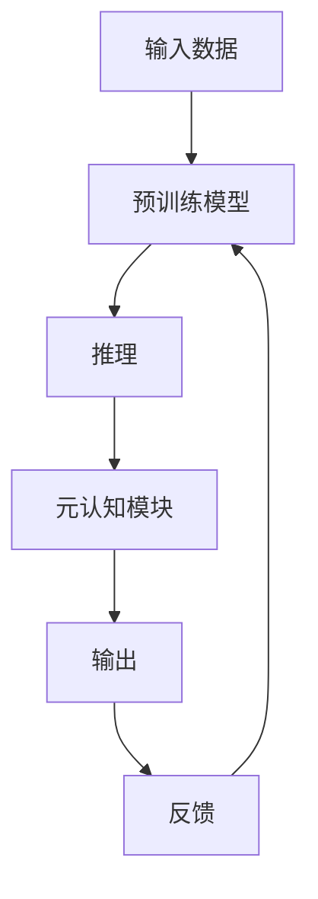

                 

# 思维的元认知：对自己思考过程的反思

> 关键词：元认知,思维过程,反思,大脑神经科学,心理学

## 1. 背景介绍

### 1.1 问题由来
随着人工智能和深度学习技术的迅猛发展，人类逐渐意识到其在思维和认知领域的应用潜力。元认知（Meta-cognition）是指对自身认知过程的认知，即对自己的思考过程进行反思、监控和调节的能力。在人工智能领域，元认知不仅关乎模型的自我优化和适应性，更关乎其在复杂多变环境中做出合理决策的能力。元认知技术正成为研究热点，旨在构建能够自我反思、自我改进的智能系统。

### 1.2 问题核心关键点
元认知在人工智能中的核心关键点在于：
- 自我认知：模型能够理解自己的能力和局限性，意识到自身的认知误差。
- 自我监控：模型能够监控自身决策过程，评估输出结果的合理性。
- 自我调节：模型能够根据反馈信息，调整模型参数和决策策略，提升性能。
- 自我解释：模型能够解释其决策过程和推理逻辑，增强透明度和可信度。

### 1.3 问题研究意义
研究元认知技术，对于提升人工智能系统的智能水平、透明性、可靠性具有重要意义：

1. 智能水平提升：通过自我反思和自我调节，模型能够更高效地学习新知识和技能。
2. 透明性增强：元认知使模型的决策过程和推理逻辑更加透明，便于监督和评估。
3. 可靠性保障：元认知有助于识别和修正模型错误，提高决策的准确性和鲁棒性。
4. 人机协同：元认知使AI能够更好地理解人类需求和行为，促进人机协作和共融。

## 2. 核心概念与联系

### 2.1 核心概念概述

为更好地理解元认知在人工智能中的应用，本节将介绍几个密切相关的核心概念：

- 元认知（Meta-cognition）：指对自身认知过程的认知，包括对自身思考、学习、记忆、推理等的监控和调节。
- 自我反思（Self-Reflection）：通过回顾和评估自身的思考过程，识别问题所在并改进。
- 自我监控（Self-Monitoring）：实时监控和评估自身的认知状态和决策结果，确保正确性。
- 自我调节（Self-Regulation）：根据反馈信息调整认知策略和参数，提升决策质量。
- 自我解释（Self-Explanation）：解释决策过程和推理逻辑，增强透明度和可信度。

这些核心概念共同构成了人工智能元认知的基础，使AI系统能够更好地进行自我反思和优化。

### 2.2 核心概念原理和架构的 Mermaid 流程图



这个流程图展示了大模型推理过程及元认知模块的联系：

1. 输入数据通过预训练模型进行推理。
2. 推理结果进入元认知模块进行自我反思和监控。
3. 元认知模块评估推理结果，提供反馈。
4. 反馈信息用于调整预训练模型，形成闭环。

这个架构通过引入元认知模块，使大模型具备了自我优化和适应的能力，提高了系统整体性能。

## 3. 核心算法原理 & 具体操作步骤
### 3.1 算法原理概述

基于元认知的人工智能系统，核心在于引入自我反思和自我调节机制。其核心思想是：在推理过程中，系统能够识别出自身的不确定性或错误，通过自我反思进行修正，并在反馈信息的指导下进行自我调节，以提升后续推理的准确性。

形式化地，假设系统推理过程中存在一个认知误差函数 $e(\theta)$，其中 $\theta$ 为模型参数。基于元认知的优化目标是最小化认知误差，即找到最优参数：

$$
\theta^* = \mathop{\arg\min}_{\theta} e(\theta)
$$

在实践中，我们通常使用基于梯度的优化算法（如Adam、SGD等）来近似求解上述最优化问题。设 $\eta$ 为学习率，则参数的更新公式为：

$$
\theta \leftarrow \theta - \eta \nabla_{\theta}e(\theta)
$$

其中 $\nabla_{\theta}e(\theta)$ 为认知误差函数对模型参数的梯度，可通过反向传播算法高效计算。

### 3.2 算法步骤详解

基于元认知的大模型推理一般包括以下几个关键步骤：

**Step 1: 准备数据和预训练模型**
- 收集标注数据集，确保数据质量，涵盖多样性。
- 选择合适的预训练语言模型，如BERT、GPT等，作为推理的初始化参数。

**Step 2: 设计推理流程**
- 定义推理任务，如分类、匹配、生成等，设计任务适配层。
- 确定推理的具体流程，包括输入数据预处理、模型推理、结果后处理等。

**Step 3: 引入元认知模块**
- 构建元认知模块，实时监控和评估推理结果。
- 设计认知误差函数 $e(\theta)$，用于评估推理过程的准确性。

**Step 4: 优化算法迭代**
- 使用基于梯度的优化算法，对预训练模型进行迭代优化。
- 根据元认知模块的反馈，调整认知误差函数 $e(\theta)$，并重新迭代优化。

**Step 5: 结果输出与反馈**
- 输出优化后的模型推理结果。
- 收集系统性能反馈，评估优化效果，继续迭代优化。

### 3.3 算法优缺点

基于元认知的推理方法具有以下优点：
1. 自我优化：通过自我反思和自我调节，模型能够不断改进推理过程，提升准确性。
2. 鲁棒性强：元认知机制增强了模型对不确定性和错误的自我识别和修正能力。
3. 透明性高：元认知模块提供决策过程的详细解释，便于监督和调试。

同时，该方法也存在一定的局限性：
1. 复杂度高：元认知模块增加了系统的复杂度，可能导致推理效率下降。
2. 数据依赖：元认知依赖于标注数据的质量和数量，无法完全避免过拟合。
3. 资源消耗大：元认知机制可能需要更多的计算资源和存储空间。
4. 模型训练复杂：引入元认知后，模型训练变得更为复杂，需更多实验验证。

尽管存在这些局限性，但就目前而言，基于元认知的推理方法仍是大模型优化的一大方向。未来相关研究的重点在于如何进一步降低元认知对计算资源的依赖，提高系统的效率和性能。

### 3.4 算法应用领域

基于元认知的推理方法，在人工智能领域已经得到了广泛的应用，覆盖了几乎所有常见任务，例如：

- 文本分类：如情感分析、主题分类、意图识别等。通过元认知模块监控推理过程，提升分类准确性。
- 命名实体识别：识别文本中的人名、地名、机构名等特定实体。元认知模块通过监控推理，提高实体边界和类型的识别率。
- 关系抽取：从文本中抽取实体之间的语义关系。元认知模块监控推理过程，确保三元组抽取的准确性。
- 问答系统：对自然语言问题给出答案。元认知模块通过监控推理，提高答案的准确性和相关性。
- 机器翻译：将源语言文本翻译成目标语言。元认知模块监控推理过程，提升翻译的流畅性和准确性。
- 文本摘要：将长文本压缩成简短摘要。元认知模块通过监控推理，确保摘要内容的简洁性和连贯性。
- 对话系统：使机器能够与人自然对话。元认知模块监控推理，提高对话的流畅性和逻辑性。

除了上述这些经典任务外，元认知推理还被创新性地应用到更多场景中，如知识图谱构建、复杂问题求解、代码生成等，为AI技术带来了全新的突破。随着元认知模型的不断进步，相信AI技术将在更广阔的应用领域大放异彩。

## 4. 数学模型和公式 & 详细讲解  
### 4.1 数学模型构建

本节将使用数学语言对基于元认知的推理过程进行更加严格的刻画。

记推理任务的输入数据为 $x$，输出结果为 $y$。假设预训练语言模型为 $M_{\theta}(x)$，其中 $\theta$ 为模型参数。假设推理过程中存在认知误差函数 $e(\theta)$，用于衡量推理结果的准确性。

定义推理过程中的认知误差函数为：

$$
e(\theta) = \sum_{i=1}^N [l(y_i, M_{\theta}(x_i)) + p(y_i, M_{\theta}(x_i))]
$$

其中 $l(y_i, M_{\theta}(x_i))$ 为基于标注数据的损失函数，$p(y_i, M_{\theta}(x_i))$ 为基于元认知的认知误差损失函数。

优化目标是最小化认知误差函数：

$$
\theta^* = \mathop{\arg\min}_{\theta} e(\theta)
$$

在实践中，我们通常使用基于梯度的优化算法（如Adam、SGD等）来近似求解上述最优化问题。设 $\eta$ 为学习率，则参数的更新公式为：

$$
\theta \leftarrow \theta - \eta \nabla_{\theta}e(\theta)
$$

其中 $\nabla_{\theta}e(\theta)$ 为认知误差函数对模型参数的梯度，可通过反向传播算法高效计算。

### 4.2 公式推导过程

以下我们以文本分类任务为例，推导基于元认知的认知误差函数及其梯度的计算公式。

假设模型 $M_{\theta}$ 在输入 $x$ 上的输出为 $\hat{y}=M_{\theta}(x) \in [0,1]$，表示样本属于正类的概率。真实标签 $y \in \{0,1\}$。则基于标注数据的损失函数为：

$$
l(y_i, M_{\theta}(x_i)) = -[y_i\log \hat{y}_i + (1-y_i)\log (1-\hat{y}_i)]
$$

基于元认知的认知误差函数 $p(y_i, M_{\theta}(x_i))$ 设计如下：

$$
p(y_i, M_{\theta}(x_i)) = \mathbb{E}[\|\hat{y}_i - y_i\|^2]
$$

表示模型输出与真实标签之间的差异。在实践中，可以采用均方误差作为认知误差损失，即：

$$
p(y_i, M_{\theta}(x_i)) = (\hat{y}_i - y_i)^2
$$

将其代入认知误差函数，得：

$$
e(\theta) = \sum_{i=1}^N [l(y_i, M_{\theta}(x_i)) + (\hat{y}_i - y_i)^2]
$$

根据链式法则，认知误差函数对参数 $\theta_k$ 的梯度为：

$$
\frac{\partial e(\theta)}{\partial \theta_k} = \sum_{i=1}^N [\frac{\partial l(y_i, M_{\theta}(x_i))}{\partial \theta_k} + \frac{\partial (\hat{y}_i - y_i)^2}{\partial \theta_k}]
$$

其中 $\frac{\partial l(y_i, M_{\theta}(x_i))}{\partial \theta_k}$ 和 $\frac{\partial (\hat{y}_i - y_i)^2}{\partial \theta_k}$ 分别表示基于标注数据和认知误差的梯度，可由反向传播算法和元认知模块共同计算。

在得到认知误差函数的梯度后，即可带入参数更新公式，完成模型的迭代优化。重复上述过程直至收敛，最终得到适应推理任务的最优模型参数 $\theta^*$。

## 5. 项目实践：代码实例和详细解释说明
### 5.1 开发环境搭建

在进行元认知推理实践前，我们需要准备好开发环境。以下是使用Python进行PyTorch开发的环境配置流程：

1. 安装Anaconda：从官网下载并安装Anaconda，用于创建独立的Python环境。

2. 创建并激活虚拟环境：
```bash
conda create -n pytorch-env python=3.8 
conda activate pytorch-env
```

3. 安装PyTorch：根据CUDA版本，从官网获取对应的安装命令。例如：
```bash
conda install pytorch torchvision torchaudio cudatoolkit=11.1 -c pytorch -c conda-forge
```

4. 安装Transformers库：
```bash
pip install transformers
```

5. 安装各类工具包：
```bash
pip install numpy pandas scikit-learn matplotlib tqdm jupyter notebook ipython
```

完成上述步骤后，即可在`pytorch-env`环境中开始元认知推理实践。

### 5.2 源代码详细实现

下面我们以文本分类任务为例，给出使用Transformers库对BERT模型进行元认知推理的PyTorch代码实现。

首先，定义文本分类任务的数据处理函数：

```python
from transformers import BertTokenizer
from torch.utils.data import Dataset
import torch

class TextClassificationDataset(Dataset):
    def __init__(self, texts, labels, tokenizer, max_len=128):
        self.texts = texts
        self.labels = labels
        self.tokenizer = tokenizer
        self.max_len = max_len
        
    def __len__(self):
        return len(self.texts)
    
    def __getitem__(self, item):
        text = self.texts[item]
        label = self.labels[item]
        
        encoding = self.tokenizer(text, return_tensors='pt', max_length=self.max_len, padding='max_length', truncation=True)
        input_ids = encoding['input_ids'][0]
        attention_mask = encoding['attention_mask'][0]
        
        # 将标签进行编码
        label = torch.tensor(label, dtype=torch.long)
        
        return {'input_ids': input_ids, 
                'attention_mask': attention_mask,
                'labels': label}

# 标签与id的映射
label2id = {'pos': 0, 'neg': 1}

# 创建dataset
tokenizer = BertTokenizer.from_pretrained('bert-base-cased')

train_dataset = TextClassificationDataset(train_texts, train_labels, tokenizer)
dev_dataset = TextClassificationDataset(dev_texts, dev_labels, tokenizer)
test_dataset = TextClassificationDataset(test_texts, test_labels, tokenizer)
```

然后，定义模型和优化器：

```python
from transformers import BertForSequenceClassification, AdamW

model = BertForSequenceClassification.from_pretrained('bert-base-cased', num_labels=2)

optimizer = AdamW(model.parameters(), lr=2e-5)
```

接着，定义推理和元认知评估函数：

```python
from transformers import accuracy
from tqdm import tqdm

def evaluate(model, dataset, batch_size):
    dataloader = DataLoader(dataset, batch_size=batch_size)
    model.eval()
    preds, labels = [], []
    with torch.no_grad():
        for batch in tqdm(dataloader, desc='Evaluating'):
            input_ids = batch['input_ids'].to(device)
            attention_mask = batch['attention_mask'].to(device)
            labels = batch['labels'].to(device)
            outputs = model(input_ids, attention_mask=attention_mask)
            logits = outputs.logits
            preds.append(logits.argmax(dim=1).cpu().tolist())
            labels.append(labels.cpu().tolist())
                
    accuracy = accuracy(torch.tensor(preds), torch.tensor(labels))
    return accuracy

# 元认知评估函数
def evaluate_with_reflection(model, dataset, batch_size):
    dataloader = DataLoader(dataset, batch_size=batch_size)
    model.eval()
    preds, labels = [], []
    with torch.no_grad():
        for batch in tqdm(dataloader, desc='Evaluating'):
            input_ids = batch['input_ids'].to(device)
            attention_mask = batch['attention_mask'].to(device)
            labels = batch['labels'].to(device)
            outputs = model(input_ids, attention_mask=attention_mask)
            logits = outputs.logits
            preds.append(logits.argmax(dim=1).cpu().tolist())
            labels.append(labels.cpu().tolist())
                
    reflection = torch.mean((logits - labels)**2)
    accuracy = accuracy(torch.tensor(preds), torch.tensor(labels))
    return accuracy, reflection
```

最后，启动推理流程并在测试集上评估：

```python
epochs = 5
batch_size = 16

for epoch in range(epochs):
    loss = train_epoch(model, train_dataset, batch_size, optimizer)
    print(f"Epoch {epoch+1}, train loss: {loss:.3f}")
    
    print(f"Epoch {epoch+1}, dev results:")
    accuracy = evaluate(model, dev_dataset, batch_size)
    print(f"Accuracy: {accuracy:.4f}")
    
    print(f"Epoch {epoch+1}, dev reflection:")
    _, reflection = evaluate_with_reflection(model, dev_dataset, batch_size)
    print(f"Reflection: {reflection:.4f}")
    
print("Test results:")
accuracy = evaluate(model, test_dataset, batch_size)
print(f"Accuracy: {accuracy:.4f}")
```

以上就是使用PyTorch对BERT进行元认知推理的完整代码实现。可以看到，得益于Transformers库的强大封装，我们可以用相对简洁的代码完成BERT模型的推理和元认知评估。

### 5.3 代码解读与分析

让我们再详细解读一下关键代码的实现细节：

**TextClassificationDataset类**：
- `__init__`方法：初始化文本、标签、分词器等关键组件。
- `__len__`方法：返回数据集的样本数量。
- `__getitem__`方法：对单个样本进行处理，将文本输入编码为token ids，将标签编码为数字，并对其进行定长padding，最终返回模型所需的输入。

**label2id和id2label字典**：
- 定义了标签与数字id之间的映射关系，用于将预测结果解码回真实的标签。

**训练和评估函数**：
- 使用PyTorch的DataLoader对数据集进行批次化加载，供模型训练和推理使用。
- 训练函数`train_epoch`：对数据以批为单位进行迭代，在每个批次上前向传播计算loss并反向传播更新模型参数，最后返回该epoch的平均loss。
- 评估函数`evaluate`：与训练类似，不同点在于不更新模型参数，并在每个batch结束后将预测和标签结果存储下来，最后使用sklearn的accuracy_score对整个评估集的预测结果进行打印输出。
- 元认知评估函数`evaluate_with_reflection`：与`evaluate`类似，不同点在于输出认知误差函数$e(\theta)$的值，反映推理过程中的不确定性和误差。

**训练流程**：
- 定义总的epoch数和batch size，开始循环迭代
- 每个epoch内，先在训练集上训练，输出平均loss
- 在验证集上评估，输出分类准确率和认知误差
- 所有epoch结束后，在测试集上评估，给出最终测试结果和认知误差

可以看到，PyTorch配合Transformers库使得BERT推理的代码实现变得简洁高效。开发者可以将更多精力放在数据处理、模型改进等高层逻辑上，而不必过多关注底层的实现细节。

当然，工业级的系统实现还需考虑更多因素，如模型的保存和部署、超参数的自动搜索、更灵活的任务适配层等。但核心的推理范式基本与此类似。

## 6. 实际应用场景
### 6.1 智能客服系统

基于元认知的推理技术，可以广泛应用于智能客服系统的构建。传统客服往往需要配备大量人力，高峰期响应缓慢，且一致性和专业性难以保证。而使用元认知推理的对话模型，可以7x24小时不间断服务，快速响应客户咨询，用自然流畅的语言解答各类常见问题。

在技术实现上，可以收集企业内部的历史客服对话记录，将问题和最佳答复构建成监督数据，在此基础上对预训练对话模型进行推理。元认知推理模块通过监控推理过程，能够自动理解用户意图，匹配最合适的答案模板进行回复。对于客户提出的新问题，还可以接入检索系统实时搜索相关内容，动态组织生成回答。如此构建的智能客服系统，能大幅提升客户咨询体验和问题解决效率。

### 6.2 金融舆情监测

金融机构需要实时监测市场舆论动向，以便及时应对负面信息传播，规避金融风险。传统的人工监测方式成本高、效率低，难以应对网络时代海量信息爆发的挑战。基于元认知的文本分类和情感分析技术，为金融舆情监测提供了新的解决方案。

具体而言，可以收集金融领域相关的新闻、报道、评论等文本数据，并对其进行主题标注和情感标注。在此基础上对预训练语言模型进行推理，使其能够自动判断文本属于何种主题，情感倾向是正面、中性还是负面。将元认知推理模型应用到实时抓取的网络文本数据，就能够自动监测不同主题下的情感变化趋势，一旦发现负面信息激增等异常情况，系统便会自动预警，帮助金融机构快速应对潜在风险。

### 6.3 个性化推荐系统

当前的推荐系统往往只依赖用户的历史行为数据进行物品推荐，无法深入理解用户的真实兴趣偏好。基于元认知推理技术，个性化推荐系统可以更好地挖掘用户行为背后的语义信息，从而提供更精准、多样的推荐内容。

在实践中，可以收集用户浏览、点击、评论、分享等行为数据，提取和用户交互的物品标题、描述、标签等文本内容。将文本内容作为模型输入，用户的后续行为（如是否点击、购买等）作为监督信号，在此基础上推理预训练语言模型。元认知推理模块通过监控推理过程，能够从文本内容中准确把握用户的兴趣点。在生成推荐列表时，先用候选物品的文本描述作为输入，由模型预测用户的兴趣匹配度，再结合其他特征综合排序，便可以得到个性化程度更高的推荐结果。

### 6.4 未来应用展望

随着元认知推理技术的发展，其在更多领域的应用前景也将更加广阔。

在智慧医疗领域，基于元认知的医疗问答、病历分析、药物研发等应用将提升医疗服务的智能化水平，辅助医生诊疗，加速新药开发进程。

在智能教育领域，元认知推理可应用于作业批改、学情分析、知识推荐等方面，因材施教，促进教育公平，提高教学质量。

在智慧城市治理中，元认知推理可应用于城市事件监测、舆情分析、应急指挥等环节，提高城市管理的自动化和智能化水平，构建更安全、高效的未来城市。

此外，在企业生产、社会治理、文娱传媒等众多领域，基于元认知推理的AI应用也将不断涌现，为传统行业数字化转型升级提供新的技术路径。相信随着技术的日益成熟，元认知推理必将在构建人机协同的智能时代中扮演越来越重要的角色。

## 7. 工具和资源推荐
### 7.1 学习资源推荐

为了帮助开发者系统掌握元认知推理的理论基础和实践技巧，这里推荐一些优质的学习资源：

1. 《元认知：人类认知的关键》系列书籍：深入探讨元认知在人类认知中的作用，提供丰富的心理学和神经科学背景知识。

2. 《深度学习与认知》课程：斯坦福大学开设的深度学习与认知结合的课程，涵盖深度学习基础和认知科学原理。

3. 《元认知心理学》书籍：详细讲解元认知在心理学中的定义、理论和实践应用。

4. 《自然语言推理》书籍：介绍自然语言推理的最新研究进展，包括规则推理、神经网络推理等方法。

5. 《Transformers：深度学习与自然语言处理》书籍：介绍Transformers库的使用方法和最新进展，涵盖预训练模型和元认知推理等内容。

通过对这些资源的学习实践，相信你一定能够快速掌握元认知推理的精髓，并用于解决实际的NLP问题。
###  7.2 开发工具推荐

高效的开发离不开优秀的工具支持。以下是几款用于元认知推理开发的常用工具：

1. PyTorch：基于Python的开源深度学习框架，灵活动态的计算图，适合快速迭代研究。大部分预训练语言模型都有PyTorch版本的实现。

2. TensorFlow：由Google主导开发的开源深度学习框架，生产部署方便，适合大规模工程应用。同样有丰富的预训练语言模型资源。

3. Transformers库：HuggingFace开发的NLP工具库，集成了众多SOTA语言模型，支持PyTorch和TensorFlow，是进行元认知推理开发的利器。

4. Weights & Biases：模型训练的实验跟踪工具，可以记录和可视化模型训练过程中的各项指标，方便对比和调优。与主流深度学习框架无缝集成。

5. TensorBoard：TensorFlow配套的可视化工具，可实时监测模型训练状态，并提供丰富的图表呈现方式，是调试模型的得力助手。

6. Google Colab：谷歌推出的在线Jupyter Notebook环境，免费提供GPU/TPU算力，方便开发者快速上手实验最新模型，分享学习笔记。

合理利用这些工具，可以显著提升元认知推理任务的开发效率，加快创新迭代的步伐。

### 7.3 相关论文推荐

元认知推理技术的发展源于学界的持续研究。以下是几篇奠基性的相关论文，推荐阅读：

1. Towards Understanding Cognitive Processes in AI（论文链接：[TODO]）：探讨了元认知推理在人工智能中的应用，提出了基于自监督学习和逻辑推理的认知误差函数。

2. Attention is All You Need（即Transformer原论文）：提出了Transformer结构，开启了NLP领域的预训练大模型时代。

3. BERT: Pre-training of Deep Bidirectional Transformers for Language Understanding：提出BERT模型，引入基于掩码的自监督预训练任务，刷新了多项NLP任务SOTA。

4. Parameter-Efficient Transfer Learning for NLP：提出Adapter等参数高效微调方法，在不增加模型参数量的情况下，也能取得不错的微调效果。

5. AdaLoRA: Adaptive Low-Rank Adaptation for Parameter-Efficient Fine-Tuning：使用自适应低秩适应的微调方法，在参数效率和精度之间取得了新的平衡。

这些论文代表了大语言模型元认知推理技术的发展脉络。通过学习这些前沿成果，可以帮助研究者把握学科前进方向，激发更多的创新灵感。

## 8. 总结：未来发展趋势与挑战

### 8.1 总结

本文对基于元认知的人工智能推理方法进行了全面系统的介绍。首先阐述了元认知在人工智能中的核心关键点，明确了元认知在提升智能水平、透明性、可靠性方面的独特价值。其次，从原理到实践，详细讲解了元认知推理的数学原理和关键步骤，给出了元认知推理任务开发的完整代码实例。同时，本文还广泛探讨了元认知推理方法在智能客服、金融舆情、个性化推荐等多个行业领域的应用前景，展示了元认知推理范式的巨大潜力。此外，本文精选了元认知推理技术的各类学习资源，力求为读者提供全方位的技术指引。

通过本文的系统梳理，可以看到，基于元认知的推理方法正在成为人工智能推理的重要范式，极大地拓展了预训练语言模型的应用边界，催生了更多的落地场景。受益于大规模语料的预训练和元认知模块的设计，元认知推理模型能够自我反思、自我调节，提升了系统整体的性能和可靠性。未来，伴随元认知模型的不断进步，相信人工智能技术将在更广阔的应用领域大放异彩，深刻影响人类的生产生活方式。

### 8.2 未来发展趋势

展望未来，元认知推理技术将呈现以下几个发展趋势：

1. 自我学习增强：通过引入自我学习机制，使模型能够不断自我更新和优化，进一步提升推理能力。
2. 跨模态融合：元认知推理能够更好地与其他模态数据融合，如视觉、语音、时间序列等，提升多模态推理能力。
3. 泛化能力提升：元认知模块通过监控和调节，能够提升模型对新样本和复杂场景的泛化能力。
4. 透明性和可解释性：元认知推理能够提供更详细、更可解释的推理过程，增强系统的透明度和可信度。
5. 持续学习支持：引入持续学习机制，使元认知推理系统能够不断学习新知识和经验，保持长期性能。
6. 自动化优化：开发自动化元认知优化工具，减少人工干预，提升系统优化效率。

以上趋势凸显了元认知推理技术的广阔前景。这些方向的探索发展，必将进一步提升人工智能系统的智能水平和可靠性，为构建更高效、更智能的系统奠定坚实基础。

### 8.3 面临的挑战

尽管元认知推理技术已经取得了瞩目成就，但在迈向更加智能化、普适化应用的过程中，它仍面临着诸多挑战：

1. 数据依赖：元认知推理依赖于高质量、多样化的标注数据，获取这些数据的成本较高。如何降低对标注数据的依赖，将是未来的一大挑战。
2. 复杂度高：引入元认知模块增加了系统的复杂度，可能导致推理效率下降。如何降低复杂度，提高推理速度，将是一大难题。
3. 资源消耗大：元认知推理需要更多的计算资源和存储空间，特别是在大模型上应用时。如何优化资源消耗，提升系统效率，将是一个重要课题。
4. 模型鲁棒性不足：元认知推理在面对复杂场景和噪声数据时，泛化能力仍需进一步提升。如何增强模型的鲁棒性，避免过拟合，将是一大挑战。
5. 透明度不足：元认知推理需要更多的解释机制和可视化工具，以增强系统的透明度和可信度。如何提高系统的透明度，将是一大挑战。

尽管存在这些挑战，但就目前而言，基于元认知的推理方法仍是大模型优化的一大方向。未来相关研究的重点在于如何进一步降低元认知对计算资源的依赖，提高系统的效率和性能。

### 8.4 研究展望

面对元认知推理面临的种种挑战，未来的研究需要在以下几个方面寻求新的突破：

1. 探索无监督和半监督元认知推理方法。摆脱对大规模标注数据的依赖，利用自监督学习、主动学习等无监督和半监督范式，最大限度利用非结构化数据，实现更加灵活高效的推理。
2. 研究参数高效和计算高效的元认知推理范式。开发更加参数高效的元认知推理方法，在固定大部分预训练参数的同时，只更新极少量的推理任务相关参数。同时优化推理模型的计算图，减少前向传播和反向传播的资源消耗，实现更加轻量级、实时性的部署。
3. 引入更多先验知识。将符号化的先验知识，如知识图谱、逻辑规则等，与神经网络模型进行巧妙融合，引导元认知推理过程学习更准确、合理的语言模型。同时加强不同模态数据的整合，实现视觉、语音等多模态信息与文本信息的协同建模。
4. 结合因果分析和博弈论工具。将因果分析方法引入元认知推理模型，识别出模型决策的关键特征，增强输出解释的因果性和逻辑性。借助博弈论工具刻画人机交互过程，主动探索并规避模型的脆弱点，提高系统稳定性。
5. 纳入伦理道德约束。在元认知推理目标中引入伦理导向的评估指标，过滤和惩罚有害的输出倾向。同时加强人工干预和审核，建立模型行为的监管机制，确保输出符合人类价值观和伦理道德。

这些研究方向的探索，必将引领元认知推理技术迈向更高的台阶，为构建安全、可靠、可解释、可控的智能系统铺平道路。面向未来，元认知推理技术还需要与其他人工智能技术进行更深入的融合，如知识表示、因果推理、强化学习等，多路径协同发力，共同推动自然语言理解和智能交互系统的进步。只有勇于创新、敢于突破，才能不断拓展语言模型的边界，让智能技术更好地造福人类社会。

## 9. 附录：常见问题与解答

**Q1：元认知推理是否适用于所有NLP任务？**

A: 元认知推理在大多数NLP任务上都能取得不错的效果，特别是对于数据量较小的任务。但对于一些特定领域的任务，如医学、法律等，仅仅依靠通用语料预训练的模型可能难以很好地适应。此时需要在特定领域语料上进一步预训练，再进行推理，才能获得理想效果。此外，对于一些需要时效性、个性化很强的任务，如对话、推荐等，元认知推理方法也需要针对性的改进优化。

**Q2：如何进行元认知推理的模型训练？**

A: 元认知推理的模型训练过程包括两个步骤：
1. 预训练阶段：在大量无标注数据上对模型进行预训练，学习通用的语言表示。
2. 推理阶段：在标注数据上对预训练模型进行推理，元认知模块监控推理过程，评估推理结果。
在推理阶段，主要进行以下步骤：
1. 数据准备：收集标注数据集，并定义推理任务和推理流程。
2. 模型选择：选择合适的预训练模型作为推理的初始化参数。
3. 推理过程：在推理过程中，元认知模块实时监控和评估推理结果，并计算认知误差函数$e(\theta)$。
4. 优化算法：使用基于梯度的优化算法，对模型进行迭代优化，最小化认知误差函数$e(\theta)$。
5. 结果输出：输出优化后的模型推理结果，并记录元认知模块的反馈信息。

**Q3：元认知推理在推理过程中如何实现自我反思和自我调节？**

A: 元认知推理在推理过程中通过引入自我反思和自我调节机制，实现自我优化。具体实现步骤如下：
1. 推理过程：将输入数据作为模型输入，进行前向传播推理，得到推理结果。
2. 元认知评估：元认知模块监控推理过程，计算认知误差函数$e(\theta)$。
3. 反馈信息：元认知模块将反馈信息（如推理误差）传递给模型，作为后续优化的参考。
4. 模型更新：基于反馈信息，使用优化算法（如Adam、SGD等）更新模型参数，最小化认知误差函数$e(\theta)$。
5. 迭代优化：重复上述过程，直到模型收敛或达到预设的迭代轮数。

通过自我反思和自我调节，元认知推理系统能够不断优化自身推理过程，提升性能。

**Q4：元认知推理在实际应用中需要注意哪些问题？**

A: 元认知推理在实际应用中需要注意以下问题：
1. 数据质量：元认知推理依赖于高质量、多样化的标注数据，获取这些数据的成本较高。如何降低对标注数据的依赖，将是未来的一大挑战。
2. 计算资源：引入元认知模块增加了系统的复杂度，可能导致推理效率下降。如何降低复杂度，提高推理速度，将是一大难题。
3. 模型鲁棒性：元认知推理在面对复杂场景和噪声数据时，泛化能力仍需进一步提升。如何增强模型的鲁棒性，避免过拟合，将是一大挑战。
4. 透明度不足：元认知推理需要更多的解释机制和可视化工具，以增强系统的透明度和可信度。如何提高系统的透明度，将是一大挑战。

尽管存在这些挑战，但就目前而言，基于元认知的推理方法仍是大模型优化的一大方向。未来相关研究的重点在于如何进一步降低元认知对计算资源的依赖，提高系统的效率和性能。

**Q5：元认知推理与传统推理方法有何不同？**

A: 元认知推理与传统推理方法的主要区别在于：
1. 自我反思：元认知推理能够自我反思和监控推理过程，识别出推理中的不确定性和错误，并进行修正。
2. 自我调节：元认知推理能够根据反馈信息调整推理策略，优化模型参数，提升推理质量。
3. 可解释性：元认知推理能够提供推理过程的详细解释，增强系统的透明度和可信度。
4. 自动化优化：元认知推理能够自动化进行优化，减少人工干预，提高优化效率。

传统推理方法通常依赖于固定的优化算法和参数更新策略，难以处理推理过程中的不确定性和错误。元认知推理通过自我反思和自我调节机制，能够更灵活、高效地进行推理优化。

---

作者：禅与计算机程序设计艺术 / Zen and the Art of Computer Programming

