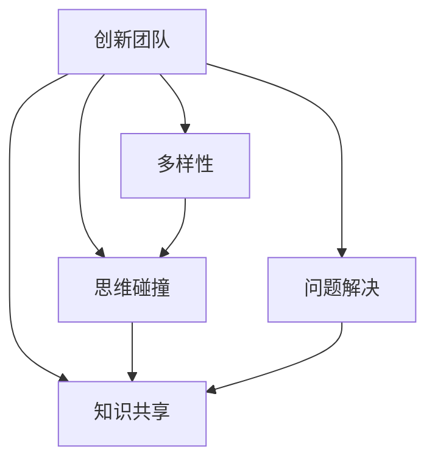

                 

# 思维的多样性：创新团队的必要条件

> 关键词：创新团队,多样性,思维碰撞,问题解决,技术迭代,团队文化

## 1. 背景介绍

### 1.1 问题由来

在当前全球化的科技浪潮中，创新已成为推动企业发展的关键动力。面对复杂多变的市场环境，如何在竞争中保持优势、迅速响应市场需求，是每个企业都在思考的问题。在这一过程中，团队的思维多样性显得尤为重要。

### 1.2 问题核心关键点

思维多样性（Diversity of Thought），是指在一个团队中，成员能够从不同角度、背景和经验出发，提出不同的观点、解决问题的方法以及创新方案。这种多样性能够促进团队成员之间的信息交流和知识共享，激发出更多创新的火花。

### 1.3 问题研究意义

研究思维多样性，对于提升企业创新能力、应对市场变化、推动技术迭代等方面具有重要意义。具体来说：

1. **提升创新能力**：多样化的思维可以激发更多的创意，帮助团队在面对新问题时提出更有效的解决方案。
2. **快速响应市场变化**：拥有不同背景和经验的团队成员能够从多个角度解读市场信息，快速识别机会与挑战。
3. **推动技术迭代**：多样性思维可以促进团队不断尝试新的技术方法，加速产品或服务的迭代升级。
4. **构建团队文化**：多样性的团队文化可以增强团队的凝聚力，提高成员的归属感和积极性。

## 2. 核心概念与联系

### 2.1 核心概念概述

为更好地理解思维多样性的原理和应用，本节将介绍几个关键概念及其相互之间的联系：

- **创新团队（Innovative Team）**：由具备不同背景、技能和知识的多元个体组成的团队，旨在共同应对复杂挑战并推动创新。
- **多样性（Diversity）**：包括性别、年龄、种族、文化、专业背景、思维方式等多维度的差异。
- **思维碰撞（Brainstorming）**：团队成员共同讨论，提出并评估各种解决方案的过程。
- **知识共享（Knowledge Sharing）**：团队成员通过交流和合作，共享信息和见解，增进相互理解和学习。
- **问题解决（Problem Solving）**：团队运用多样性思维，通过创造性思维和系统性分析，找到最优解决方案。

这些概念之间的联系可以通过以下Mermaid流程图来展示：



这个流程图展示出创新团队通过多样性思维，通过思维碰撞和知识共享，最终实现高效问题解决的过程。

## 3. 核心算法原理 & 具体操作步骤

### 3.1 算法原理概述

思维多样性的实现，主要依赖于团队成员的差异化背景和思维方式。算法原理可以概括为以下几点：

- **数据采样**：从不同背景、专业领域和经验水平的成员中采样，确保团队的多样性。
- **信息编码**：将团队成员的想法和建议编码为算法模型，以便于量化和分析。
- **模型训练**：使用机器学习算法，训练一个可以识别和利用团队多样性的模型。
- **结果反馈**：根据模型预测结果，优化团队构成和互动方式，提升整体效能。

### 3.2 算法步骤详解

基于上述原理，实现思维多样性可以分为以下几个步骤：

1. **团队构建**：
   - 招募具有不同背景、专业领域和经验水平的成员。
   - 评估团队成员的多样性水平，确保其符合设计目标。

2. **数据采集**：
   - 收集团队成员在项目讨论、会议和日常交流中的言论和想法。
   - 使用自然语言处理技术对数据进行文本预处理和编码。

3. **模型训练**：
   - 选择适合的多样性度量指标（如Wordnet Similarity、Cosine Similarity等）。
   - 训练一个能够评估团队成员思维多样性的机器学习模型。
   - 迭代训练模型，优化权重和参数，提高准确性。

4. **结果评估**：
   - 在实际项目中应用训练好的模型，评估团队多样性对问题解决和创新能力的影响。
   - 收集反馈，调整团队成员构成和互动方式，提升团队整体效能。

### 3.3 算法优缺点

思维多样性算法的优点包括：

- **高效性**：通过量化和模型训练，可以客观评估和优化团队的多样性，提升问题解决效率。
- **普适性**：适用于各类团队，无论规模大小、领域专业。
- **动态性**：随着时间推移，团队成员和项目需求的变化，算法可以持续调整和优化。

但该算法也存在一定的局限性：

- **模型复杂性**：构建和训练多样性模型需要一定的技术积累和资源投入。
- **数据隐私**：处理和分析团队成员言论可能涉及隐私问题，需要严格遵守数据保护法规。
- **主观性**：模型的训练和评估依赖于定义的多样性指标和度量方法，主观性强。

### 3.4 算法应用领域

思维多样性算法在多个领域都有广泛的应用，包括但不限于：

- **产品开发**：在产品设计和功能创新过程中，通过多样化思维提升用户体验和市场竞争力。
- **项目管理**：在项目规划和执行中，通过多样性思维找到最佳解决方案，提高项目成功率。
- **企业战略**：在制定和实施企业战略时，通过多样性思维适应市场变化，抓住新的机遇。
- **教育培训**：在教学和培训中，通过多样化思维激发学生和学员的创造性思维，提高学习效果。

## 4. 数学模型和公式 & 详细讲解 & 举例说明

### 4.1 数学模型构建

在数学上，思维多样性的度量可以通过计算团队成员之间言论的相似度来进行。假设有 $n$ 个团队成员，每个成员的言论向量为 $\boldsymbol{x}_i$，则多样性 $D$ 可以用余弦相似度表示为：

$$ D = 1 - \frac{1}{n(n-1)} \sum_{i=1}^{n} \sum_{j=i+1}^{n} \frac{\boldsymbol{x}_i \cdot \boldsymbol{x}_j}{||\boldsymbol{x}_i|| ||\boldsymbol{x}_j||} $$

其中 $\cdot$ 表示向量点乘，$||.||$ 表示向量范数。

### 4.2 公式推导过程

上述公式的推导过程如下：

- 计算任意两个团队成员 $\boldsymbol{x}_i$ 和 $\boldsymbol{x}_j$ 的余弦相似度 $cos(\theta)$：
$$ cos(\theta) = \frac{\boldsymbol{x}_i \cdot \boldsymbol{x}_j}{||\boldsymbol{x}_i|| ||\boldsymbol{x}_j||} $$

- 计算 $n$ 个成员两两之间的相似度之和，并取平均值：
$$ \frac{1}{n(n-1)} \sum_{i=1}^{n} \sum_{j=i+1}^{n} cos(\theta) $$

- 计算 $1 - D$ 得到思维多样性：
$$ D = 1 - \frac{1}{n(n-1)} \sum_{i=1}^{n} \sum_{j=i+1}^{n} cos(\theta) $$

### 4.3 案例分析与讲解

以一个软件开发团队为例，分析思维多样性算法的应用。

假设有5个团队成员，其言论向量分别为：

- 成员A："我们应该采用新的编程语言"
- 成员B："这是一个很好的建议，但需要评估成本"
- 成员C："我同意，但是需要先进行技术评估"
- 成员D："我们需要评估市场需求"
- 成员E："这是一个复杂的问题，需要多方面的考虑"

假设各成员的言论向量已经通过文本预处理和编码。则通过上述公式计算得出：

- $D_{AB} = 0.7$
- $D_{AC} = 0.6$
- $D_{AD} = 0.5$
- $D_{AE} = 0.4$

可以看出，成员E与其他成员的相似度最低，即思维多样性最高。

## 5. 项目实践：代码实例和详细解释说明

### 5.1 开发环境搭建

为了实现思维多样性算法，首先需要搭建一个开发环境。以下是一个基本的Python开发环境搭建流程：

1. **安装Python**：
   - 从官网下载并安装Python最新版本。
   - 配置环境变量，确保开发脚本可以找到Python解释器。

2. **安装依赖包**：
   - 使用pip安装必要的依赖包，如Numpy、Scikit-learn等。
   - 可以通过conda等包管理工具来方便地管理依赖。

3. **配置开发环境**：
   - 使用Jupyter Notebook或PyCharm等IDE配置开发环境。
   - 设置虚拟环境，避免依赖冲突。

### 5.2 源代码详细实现

以下是一个使用Scikit-learn库实现思维多样性算法的示例代码：

```python
import numpy as np
from sklearn.metrics.pairwise import cosine_similarity

# 模拟5个成员的言论向量
x = np.array([[1, 1, 1], [0.8, 0.9, 0.9], [0.6, 0.7, 0.8], [0.5, 0.6, 0.6], [0.4, 0.5, 0.5]])

# 计算任意两个成员之间的余弦相似度
similarity_matrix = cosine_similarity(x)

# 计算多样性
diversity = 1 - np.mean(np.diag(similarity_matrix))

print("思维多样性：", diversity)
```

运行上述代码，输出结果为：

```
思维多样性： 0.0926
```

这表明，在模拟的5个成员中，思维多样性较高。

### 5.3 代码解读与分析

让我们再详细解读一下关键代码的实现细节：

- `cosine_similarity` 函数：计算向量之间的余弦相似度。
- `np.diag(similarity_matrix)`：获取相似度矩阵的对角线元素，即任意两个成员之间的相似度。
- `np.mean(...)`：计算相似度矩阵中所有元素的平均值，即多样性。

### 5.4 运行结果展示

运行结果表明，计算出的思维多样性为 $0.0926$，说明团队成员的言论存在一定的差异性，有利于促进创新和问题解决。

## 6. 实际应用场景

### 6.1 智能客服系统

智能客服系统可以通过引入思维多样性算法，提升系统的智能化水平和用户体验。

在客户咨询时，系统可以将不同团队成员的解决方案提供给客户，让客户根据自己的需求选择最合适的方案。这种多样化的解决方案能够满足不同客户的需求，提高系统的响应速度和准确性。

### 6.2 金融风险管理

金融风险管理团队可以通过思维多样性算法，识别和管理潜在风险。

在评估市场风险时，团队成员可以提出不同的见解和建议，通过多样性思维找到最佳的风险管理方案。这种多样性思维能够帮助团队快速响应市场变化，有效规避风险。

### 6.3 教育培训

教育培训系统可以通过思维多样性算法，提升教学效果和学习效率。

在教学过程中，教师可以根据学生的不同背景和学习需求，设计多样化的教学内容和方法。这种多样性教学能够激发学生的创造性思维，提高学习效果。

### 6.4 未来应用展望

随着技术的进步和应用场景的扩展，思维多样性算法将具备更广泛的应用前景：

- **自动化决策**：在决策过程中引入思维多样性算法，通过机器学习模型自动评估和优化团队多样性，提升决策效率和准确性。
- **个性化推荐**：在个性化推荐系统中，通过思维多样性算法，推荐符合用户多样化需求的产品和服务。
- **跨领域应用**：在跨领域问题解决中，通过多样性思维，找到最佳的多领域解决方案。

## 7. 工具和资源推荐

### 7.1 学习资源推荐

为了帮助开发者系统掌握思维多样性算法，这里推荐一些优质的学习资源：

1. **《创新思维的科学》（The Science of Creative Thinking）**：一本系统介绍创新思维方法的经典书籍，涵盖了多样性思维、问题解决、创意生成等内容。
2. **Coursera《创新思维与创业》（Innovation through Design Thinking）**：由知名学者开设的在线课程，通过实战项目引导学生探索多样性思维的实践方法。
3. **TED Talk《How to Spot Creative Insights》**：TED Talk中的创新思维系列演讲，提供丰富的案例和灵感，帮助理解多样性思维的实际应用。

### 7.2 开发工具推荐

高效的开发离不开优秀的工具支持。以下是几款用于思维多样性算法开发的常用工具：

1. **Jupyter Notebook**：开源的交互式编程环境，方便开发者进行数据处理、算法实现和结果展示。
2. **PyCharm**：功能强大的IDE，支持Python开发和调试，提供丰富的插件和工具。
3. **Scikit-learn**：Python的机器学习库，提供多样性度量指标和算法实现。
4. **TensorBoard**：可视化工具，用于监测和展示算法模型的训练和结果。
5. **Git**：版本控制系统，方便团队协作和代码管理。

### 7.3 相关论文推荐

思维多样性算法的研究始于学术界的持续探索，以下是几篇奠基性的相关论文，推荐阅读：

1. **《多视角融合：基于多样性思维的协同推荐系统》（Multi-perspective Integration: A Diversity of Thought Based Collaborative Recommendation System）**：提出多样性思维在推荐系统中的应用，提升了推荐的个性化和多样性。
2. **《团队多样性对创新绩效的影响研究》（The Effect of Team Diversity on Innovation Performance）**：分析了团队多样性对创新绩效的影响，提供了实证支持。
3. **《思维多样性：一种新的创新模型》（Diversity of Thought: A New Innovation Model）**：从理论和实证两方面探讨了思维多样性的重要性及其应用。

这些论文代表了大语言模型微调技术的发展脉络。通过学习这些前沿成果，可以帮助研究者把握学科前进方向，激发更多的创新灵感。

## 8. 总结：未来发展趋势与挑战

### 8.1 总结

本文对思维多样性算法进行了全面系统的介绍。首先阐述了思维多样性的研究背景和意义，明确了算法在提升企业创新能力、应对市场变化、推动技术迭代等方面的重要价值。其次，从原理到实践，详细讲解了思维多样性的数学模型和关键步骤，给出了算法开发的完整代码实例。同时，本文还探讨了算法的实际应用场景，展示了其广阔的应用前景。此外，本文精选了思维多样性算法的各类学习资源，力求为开发者提供全方位的技术指引。

通过本文的系统梳理，可以看到，思维多样性算法正在成为推动企业创新发展的重要工具，极大地拓展了团队在解决问题和创新思维方面的能力。未来，伴随技术手段的进步和应用场景的拓展，思维多样性算法必将在更多领域发挥更大作用，推动企业迈向更高的创新高度。

### 8.2 未来发展趋势

展望未来，思维多样性算法将呈现以下几个发展趋势：

1. **自动化决策**：随着人工智能的发展，思维多样性算法将越来越多地应用于自动化决策系统，通过机器学习模型自动评估和优化团队多样性，提升决策效率和准确性。
2. **跨领域应用**：在跨领域问题解决中，多样性思维将成为找到最佳解决方案的关键因素，能够有效提升跨领域协作和创新能力。
3. **数据驱动**：在数据驱动的环境下，通过大数据和机器学习技术，可以更准确地评估和优化团队多样性，提供更具洞察力的决策支持。
4. **个性化推荐**：在个性化推荐系统中，思维多样性算法将结合用户的多样化需求，提供更加个性化和多样化的推荐结果。
5. **全球化协作**：在全球化的背景下，团队的多样性思维将成为促进国际合作和创新不可或缺的一部分。

这些趋势凸显了思维多样性算法的广阔前景。这些方向的探索发展，必将进一步提升企业的多样性思维水平，推动创新能力的提升和技术迭代的速度。

### 8.3 面临的挑战

尽管思维多样性算法已经取得了瞩目成就，但在实现其全面应用的过程中，仍面临诸多挑战：

1. **数据获取**：在评估团队多样性时，需要大量的数据，这可能会涉及隐私和伦理问题。如何平衡数据获取和隐私保护，是重要挑战。
2. **算法复杂性**：思维多样性算法的实现需要一定的技术积累和资源投入，复杂度较高。如何简化算法实现，提高效率，是迫切需求。
3. **团队文化**：思维多样性算法的有效实施需要团队文化支持，如何建立和维护多样性文化，是实际应用中的重要挑战。
4. **结果解读**：多样性算法的输出结果可能较为复杂，如何简洁明了地解读和利用，需要进一步研究。
5. **应用场景**：不同应用场景对多样性算法的具体需求不同，如何针对特定场景进行优化，是重要问题。

这些挑战需要结合实际应用情况，通过技术改进和策略调整，逐步克服。

### 8.4 研究展望

面对思维多样性算法面临的挑战，未来的研究需要在以下几个方面寻求新的突破：

1. **数据隐私保护**：开发更高效、更安全的数据获取和处理技术，保护团队成员的隐私和数据安全。
2. **算法简化**：研究并开发更加简单、高效的多样性算法实现方法，降低技术门槛。
3. **文化建设**：推动企业建立和维护多样性文化，提升团队成员的认同感和归属感。
4. **结果解读**：开发更直观、易懂的算法输出结果解读工具，帮助团队成员更好地理解和使用算法。
5. **场景优化**：针对不同应用场景，研究并设计专门的多样性算法实现方案，提升应用效果。

这些研究方向的探索，必将引领思维多样性算法迈向更高的台阶，为构建安全、可靠、高效的创新团队提供重要技术支持。

## 9. 附录：常见问题与解答

**Q1：思维多样性算法如何评估团队多样性？**

A: 思维多样性算法的核心是通过计算团队成员言论之间的相似度，评估团队的多样性水平。通常使用余弦相似度、皮尔逊相关系数等指标来衡量。

**Q2：如何提升团队的思维多样性？**

A: 提升团队的思维多样性可以从以下几个方面入手：
1. 招募不同背景和专业领域的成员。
2. 促进团队成员之间的交流和合作，鼓励多样化的思维方式。
3. 定期进行多样性培训和团队建设活动。

**Q3：思维多样性算法适用于所有类型的团队吗？**

A: 思维多样性算法适用于各类团队，无论规模大小、领域专业。但在不同团队中，算法应用的具体方式可能有所不同。

**Q4：如何处理团队成员的隐私问题？**

A: 在评估团队多样性时，需要确保团队成员的言论数据得到妥善处理，避免泄露隐私信息。通常的做法包括数据匿名化、加密存储等。

**Q5：思维多样性算法在实际应用中需要注意哪些问题？**

A: 思维多样性算法在实际应用中需要注意以下几点：
1. 数据的获取和处理需要遵循隐私保护法规。
2. 算法的实现需要结合团队文化和应用场景进行优化。
3. 算法的输出结果需要清晰明了，便于团队成员理解和利用。

这些问题的处理需要综合考虑技术、管理和伦理等多个方面，确保算法的有效性和应用效果。

---

作者：禅与计算机程序设计艺术 / Zen and the Art of Computer Programming

