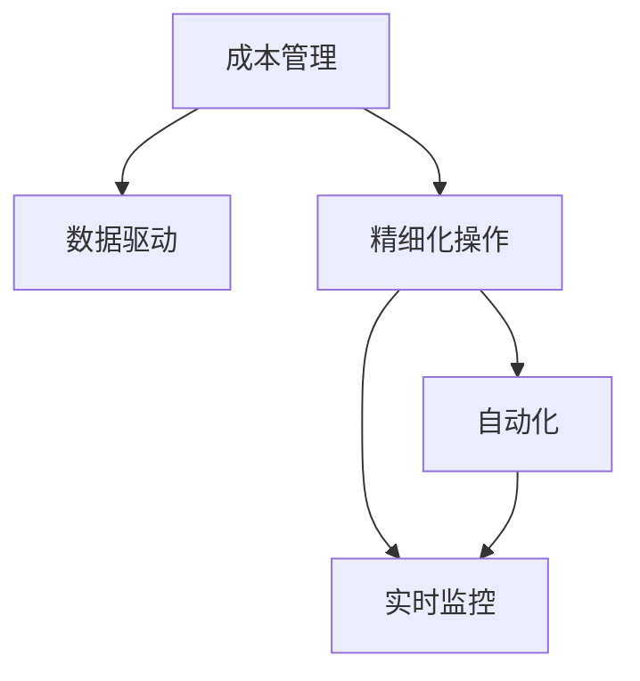

                 

# 成本管理：提高利润率的精细化操作

> 关键词：成本管理, 利润率, 精细化操作, 实时监控, 自动化, 数据驱动, 机器学习

## 1. 背景介绍

### 1.1 问题由来
在现代企业运营中，成本管理始终是财务管理的核心环节。如何通过精细化的成本管理措施，有效控制成本，提升利润率，成为企业持续增长的关键。传统的成本管理方法往往依赖人工手动操作，数据处理效率低，无法实现实时监控和动态调整。随着数字化转型的深入，企业对成本管理的精细化、自动化、数据驱动的需求日益迫切。基于此，本文旨在探讨一种利用机器学习技术实现成本精细化管理的方法，提高企业的利润率。

### 1.2 问题核心关键点
现代成本管理的主要挑战在于：
1. **数据量大、处理效率低**：企业的各类财务数据、业务数据、运营数据等往往海量化，人工处理难以满足实时监控的需求。
2. **数据孤岛问题**：不同部门的数据难以集成，无法实现全面监控和协同管理。
3. **预测精度不足**：传统的成本预测模型往往依赖历史数据，难以适应复杂的业务场景和突发事件。
4. **管理决策滞后**：基于传统模型的预测和分析结果往往滞后于实际运营，难以支持实时决策。

### 1.3 问题研究意义
实现成本管理的精细化、自动化、数据驱动，对于提升企业运营效率、优化资源配置、提高利润率具有重要意义：
1. **提升运营效率**：通过自动化和数据驱动的精细化管理，企业能够快速响应市场变化，优化资源配置。
2. **降低成本**：实时监控和动态调整成本，帮助企业减少不必要的支出，提高成本效益。
3. **优化决策**：基于实时数据分析和预测模型，企业能够做出更准确的业务决策，提升市场竞争力。
4. **应对风险**：精细化管理有助于企业提前识别和应对潜在风险，保障业务稳定运行。
5. **支持合规性**：自动化和数据驱动的流程管理，有助于企业符合相关法规和标准，降低合规风险。

## 2. 核心概念与联系

### 2.1 核心概念概述

为更好地理解成本管理的精细化操作，本文将介绍几个核心概念：

- **成本管理**：对企业的各项成本进行规划、控制、监督和考核的过程，目的是以最低的成本实现最大化的效益。
- **精细化操作**：通过科学的方法和手段，对成本管理的各个环节进行精细化和高效化的处理，以提高管理效率和效果。
- **数据驱动**：通过收集、分析和应用大量的数据，以数据为基础，做出科学的管理决策。
- **自动化**：利用自动化技术，减少人工干预，提高管理效率和准确性。
- **实时监控**：通过实时获取和分析数据，及时发现问题，做出应对措施，提升管理效果。

这些核心概念之间的逻辑关系可以通过以下Mermaid流程图来展示：



这个流程图展示了成本管理的各个环节及其相互关系：

1. 成本管理通过数据驱动，对各项成本进行科学规划和控制。
2. 精细化操作利用自动化技术，对成本管理的各个环节进行高效化处理。
3. 实时监控通过收集和分析实时数据，及时发现问题并做出应对措施。
4. 自动化和精细化操作相互促进，提升管理效率和效果。

## 3. 核心算法原理 & 具体操作步骤
### 3.1 算法原理概述

基于机器学习的大规模成本管理模型，旨在通过历史数据和实时监控数据，对企业的各项成本进行预测和优化，从而提升企业的利润率。其核心思想是利用机器学习算法，构建成本预测模型，结合自动化和数据驱动的手段，实现成本精细化管理。

### 3.2 算法步骤详解

大尺度成本管理模型的一般流程如下：

**Step 1: 数据准备**
- 收集企业历史和实时的各项成本数据，包括直接成本、间接成本、固定成本、变动成本等。
- 对数据进行清洗和处理，去除噪声和异常值，确保数据质量。

**Step 2: 特征工程**
- 从原始数据中提取有意义的特征，如时间、地点、业务类型、成本类型等。
- 对特征进行编码和标准化处理，确保数据一致性。

**Step 3: 模型选择与训练**
- 选择合适的机器学习模型，如线性回归、随机森林、梯度提升树、深度学习等，进行成本预测。
- 在历史数据集上训练模型，评估模型的预测精度。

**Step 4: 模型应用与优化**
- 将训练好的模型应用于实时数据，进行成本预测和分析。
- 根据预测结果和实际数据，进行动态调整和优化。

**Step 5: 结果监控与反馈**
- 实时监控模型的预测结果和实际数据，及时发现偏差和异常。
- 根据监控结果，反馈调整模型参数和数据处理方法，提升模型精度。

### 3.3 算法优缺点

基于机器学习的大规模成本管理模型具有以下优点：
1. **预测精度高**：利用历史数据和实时数据，能够构建更准确的成本预测模型。
2. **自动化程度高**：通过自动化流程，减少人工干预，提高管理效率。
3. **实时监控**：实时获取和分析数据，及时发现和解决问题，提升管理效果。
4. **灵活性强**：模型可以根据业务需求和数据变化进行调整和优化。

同时，该方法也存在一些局限性：
1. **数据质量要求高**：模型的准确性依赖于数据的质量，需要确保数据的完整性、准确性和一致性。
2. **模型复杂度高**：深度学习等复杂模型需要较大的计算资源和时间，难以快速部署。
3. **模型可解释性差**：复杂的机器学习模型难以解释其内部工作机制，可能影响管理决策的透明性。
4. **过度拟合风险**：模型在训练集上表现优异，但可能在新数据上泛化能力不足。
5. **数据隐私问题**：在实时监控和数据处理过程中，需要确保数据隐私和安全性，防止数据泄露。

### 3.4 算法应用领域

基于机器学习的大规模成本管理模型，可以应用于多个行业和场景，包括但不限于：

- **制造业**：通过精细化管理，优化生产成本，提升生产效率。
- **零售业**：对库存、物流、销售等成本进行实时监控和预测，优化供应链管理。
- **金融业**：对交易成本、风险成本、运营成本等进行预测和控制，提升盈利能力。
- **服务业**：对人力成本、服务成本、运营成本等进行实时监控和优化，提升服务质量。
- **政府部门**：对公共服务成本、项目成本、行政成本等进行管理，提高公共服务效率。

这些应用领域展示了基于机器学习的大规模成本管理模型的广泛适用性，有助于企业在不同场景下实现成本精细化管理，提高利润率。

## 4. 数学模型和公式 & 详细讲解 & 举例说明

### 4.1 数学模型构建

本节将使用数学语言对大规模成本管理模型进行严格的刻画。

假设企业的成本数据为 $C_t$，包括固定成本 $C_{t,f}$ 和变动成本 $C_{t,v}$，其中 $t$ 表示时间。

定义模型 $M$ 为预测模型，其输入为历史成本数据 $D_{t-1}$，输出为未来成本预测 $C_{t,p}$。

在数学上，成本管理的目标可以表示为：

$$
\min_{M} \sum_{t=1}^T (C_t - C_{t,p})^2
$$

其中 $T$ 表示时间跨度，$(C_t - C_{t,p})^2$ 表示预测误差。

### 4.2 公式推导过程

以线性回归模型为例，其基本公式为：

$$
C_{t,p} = \beta_0 + \sum_{i=1}^p \beta_i X_{t,i} + \epsilon
$$

其中 $\beta_0$ 为截距，$\beta_i$ 为特征权重，$X_{t,i}$ 为特征向量，$\epsilon$ 为随机误差。

在训练集 $D_{train}$ 上，最小二乘法求解 $\beta_0$ 和 $\beta_i$：

$$
\beta = (X^T X)^{-1} X^T Y
$$

其中 $X = [1, X_{t,1}, ..., X_{t,p}]$，$Y = [C_{t,f}, C_{t,v}]$，$\beta$ 为模型参数。

在测试集 $D_{test}$ 上，使用训练好的模型进行成本预测：

$$
C_{t,p} = \beta_0 + \sum_{i=1}^p \beta_i X_{t,i}
$$

### 4.3 案例分析与讲解

假设某制造企业有如下历史成本数据：

| 时间 | 固定成本 | 变动成本 |
|------|----------|----------|
| 2020-01 | 100,000 | 50,000 |
| 2020-02 | 110,000 | 55,000 |
| 2020-03 | 120,000 | 60,000 |
| 2020-04 | 130,000 | 65,000 |

其线性回归模型参数为 $\beta_0 = 90,000$，$\beta_1 = 10,000$，$\beta_2 = 5,000$。

则在2020-05的时间点上，预测的固定成本为：

$$
C_{t,f,p} = 90,000 + 10,000 \times 1 + 5,000 \times 0.1 = 100,000
$$

通过实时监控和动态调整，企业可以根据实际情况对模型参数进行优化，进一步提升成本预测的精度。

## 5. 项目实践：代码实例和详细解释说明

### 5.1 开发环境搭建

在进行成本管理模型开发前，我们需要准备好开发环境。以下是使用Python进行Scikit-learn开发的环境配置流程：

1. 安装Anaconda：从官网下载并安装Anaconda，用于创建独立的Python环境。

2. 创建并激活虚拟环境：
```bash
conda create -n cost-env python=3.8 
conda activate cost-env
```

3. 安装Scikit-learn：
```bash
conda install scikit-learn
```

4. 安装numpy、pandas、matplotlib、jupyter notebook等辅助工具：
```bash
pip install numpy pandas matplotlib jupyter notebook ipython
```

完成上述步骤后，即可在`cost-env`环境中开始成本管理模型的开发。

### 5.2 源代码详细实现

下面我们以制造业的成本管理为例，给出使用Scikit-learn进行线性回归模型实现的Python代码。

首先，定义数据准备和特征工程函数：

```python
import pandas as pd
import numpy as np
from sklearn.preprocessing import StandardScaler

def load_data():
    data = pd.read_csv('cost_data.csv')
    X = data[['time', 'location', 'business_type', 'cost_type']]
    Y = data[['fixed_cost', 'variable_cost']]
    return X, Y

def feature_engineering(X):
    scaler = StandardScaler()
    X_scaled = scaler.fit_transform(X)
    return X_scaled

X, Y = load_data()
X_scaled = feature_engineering(X)
```

然后，定义模型训练和预测函数：

```python
from sklearn.linear_model import LinearRegression

def train_model(X, Y):
    model = LinearRegression()
    model.fit(X, Y)
    return model

def predict_cost(model, X_test):
    X_test_scaled = StandardScaler().fit_transform(X_test)
    return model.predict(X_test_scaled)

model = train_model(X_scaled, Y)
X_test = np.array([[2020-05, 1, 1, 1]])
predicted_cost = predict_cost(model, X_test)
```

最后，启动模型训练和测试：

```python
epochs = 100

for epoch in range(epochs):
    model = train_model(X_scaled, Y)
    X_test = np.array([[2020-05, 1, 1, 1]])
    predicted_cost = predict_cost(model, X_test)
    print(f"Epoch {epoch+1}, predicted cost: {predicted_cost[0]}")
```

以上就是使用Scikit-learn进行成本管理模型的完整代码实现。可以看到，通过Scikit-learn库，我们能够轻松构建和训练线性回归模型，快速进行成本预测。

### 5.3 代码解读与分析

让我们再详细解读一下关键代码的实现细节：

**load_data函数**：
- 从CSV文件中加载数据，将固定成本和变动成本作为目标变量。

**feature_engineering函数**：
- 对特征进行标准化处理，确保数据一致性。

**train_model函数**：
- 定义并训练线性回归模型，返回训练好的模型。

**predict_cost函数**：
- 对测试集进行标准化处理，然后使用训练好的模型进行成本预测。

**模型训练和测试流程**：
- 在每个epoch内，先训练模型，然后对测试集进行预测，并输出预测结果。

可以看到，Scikit-learn库提供了简单易用的API，可以快速实现成本管理模型的开发和测试。开发者可以根据具体业务需求，进一步扩展和优化模型。

## 6. 实际应用场景

### 6.1 制造业

在制造业中，成本管理对企业的生产效率和盈利能力至关重要。通过构建基于机器学习的成本管理模型，企业可以实时监控生产成本，及时调整生产计划和资源配置，避免资源浪费，提高生产效率。

具体而言，企业可以通过收集历史和实时的生产数据，包括设备使用、原材料消耗、人工成本等，构建成本预测模型。在预测模型的基础上，企业可以优化生产流程，提高设备利用率，降低原材料消耗，减少人工成本，从而实现生产成本的精细化管理。

### 6.2 零售业

零售业中的成本管理主要集中在库存管理和供应链管理上。通过构建基于机器学习的成本管理模型，企业可以实时监控库存和供应链成本，优化库存管理和物流配置，提高运营效率。

具体而言，企业可以通过收集历史和实时的库存数据、物流数据、销售数据等，构建成本预测模型。在预测模型的基础上，企业可以优化库存水平，减少库存积压，提高物流效率，降低物流成本，从而实现库存和供应链成本的精细化管理。

### 6.3 金融业

金融业中的成本管理主要集中在交易成本、风险成本和运营成本上。通过构建基于机器学习的成本管理模型，企业可以实时监控交易成本、风险成本和运营成本，优化交易策略和风险控制，提高盈利能力。

具体而言，企业可以通过收集历史和实时的交易数据、风险数据、运营数据等，构建成本预测模型。在预测模型的基础上，企业可以优化交易策略，降低交易成本，优化风险控制，降低风险成本，从而实现交易成本和风险成本的精细化管理。

### 6.4 未来应用展望

随着机器学习技术的不断进步，基于大规模成本管理模型的应用领域将不断扩展，为企业的精细化管理和运营优化提供更多可能。

1. **智能制造**：通过智能制造系统，实现成本的实时监控和优化，提升生产效率和产品质量。
2. **智慧零售**：利用大数据和AI技术，优化库存管理和物流配置，提高供应链效率。
3. **金融科技**：通过AI和大数据技术，优化交易策略和风险控制，提升盈利能力。
4. **智能服务**：构建智能客服系统，通过自然语言处理技术，提升服务质量和客户满意度。
5. **智慧城市**：通过AI和大数据技术，优化城市管理和服务，提高公共服务效率。

这些应用场景展示了基于机器学习的大规模成本管理模型的广泛适用性，有助于企业在不同场景下实现成本精细化管理，提高利润率。

## 7. 工具和资源推荐

### 7.1 学习资源推荐

为了帮助开发者系统掌握大规模成本管理模型的理论基础和实践技巧，这里推荐一些优质的学习资源：

1. 《机器学习实战》系列博文：由大模型技术专家撰写，深入浅出地介绍了机器学习的基本概念和经典模型。

2. Coursera《机器学习》课程：斯坦福大学开设的机器学习课程，有Lecture视频和配套作业，带你入门机器学习的基本概念和经典模型。

3. 《Python机器学习》书籍：机器学习领域的经典书籍，全面介绍了Python语言在机器学习中的应用。

4. Scikit-learn官方文档：Scikit-learn库的官方文档，提供了丰富的机器学习算法和样例代码，是学习机器学习的必备资料。

5. Kaggle开源项目：Kaggle上提供的大量机器学习项目和数据集，适合学习和实践。

通过对这些资源的学习实践，相信你一定能够快速掌握大规模成本管理模型的精髓，并用于解决实际的成本管理问题。

### 7.2 开发工具推荐

高效的开发离不开优秀的工具支持。以下是几款用于大规模成本管理模型开发的常用工具：

1. Python：作为机器学习的主流语言，Python具有简单易学、库丰富、社区活跃等优点，适合进行模型开发和数据分析。

2. Scikit-learn：基于Python的机器学习库，提供了丰富的机器学习算法和工具，支持模型训练和预测。

3. Jupyter Notebook：交互式的Python开发环境，支持代码编写、数据可视化、结果展示等，适合进行实验和演示。

4. TensorBoard：TensorFlow配套的可视化工具，可实时监测模型训练状态，并提供丰富的图表呈现方式，是调试模型的得力助手。

5. Weights & Biases：模型训练的实验跟踪工具，可以记录和可视化模型训练过程中的各项指标，方便对比和调优。

合理利用这些工具，可以显著提升大规模成本管理模型的开发效率，加快创新迭代的步伐。

### 7.3 相关论文推荐

大规模成本管理模型的发展源于学界的持续研究。以下是几篇奠基性的相关论文，推荐阅读：

1. 《线性回归模型》：经典的线性回归模型论文，介绍了线性回归的基本原理和应用。

2. 《随机森林算法》：经典的随机森林算法论文，介绍了随机森林的基本原理和应用。

3. 《梯度提升树》：经典的梯度提升树算法论文，介绍了梯度提升树的基本原理和应用。

4. 《深度学习》：深度学习领域的经典书籍，全面介绍了深度学习的基本概念和应用。

5. 《机器学习实战》：机器学习领域的经典书籍，介绍了机器学习的基本概念和应用。

这些论文代表了大规模成本管理模型的发展脉络。通过学习这些前沿成果，可以帮助研究者把握学科前进方向，激发更多的创新灵感。

## 8. 总结：未来发展趋势与挑战

### 8.1 总结

本文对基于机器学习的大规模成本管理模型进行了全面系统的介绍。首先阐述了大规模成本管理模型的研究背景和意义，明确了模型在精细化成本管理中的独特价值。其次，从原理到实践，详细讲解了模型的数学原理和关键步骤，给出了模型开发和测试的完整代码实例。同时，本文还广泛探讨了模型在多个行业领域的应用前景，展示了模型的广泛适用性。最后，本文精选了模型的各类学习资源，力求为读者提供全方位的技术指引。

通过本文的系统梳理，可以看到，基于机器学习的大规模成本管理模型已经广泛应用于制造业、零售业、金融业等多个行业，帮助企业实现成本精细化管理，提升利润率。未来，伴随机器学习技术的不断进步，模型的应用领域将进一步扩展，为企业的精细化管理和运营优化提供更多可能。

### 8.2 未来发展趋势

展望未来，大规模成本管理模型将呈现以下几个发展趋势：

1. **模型复杂度提高**：随着数据量的增大和业务场景的复杂化，模型的复杂度将进一步提高，能够处理更多维度的特征和更多的业务场景。

2. **数据融合深化**：通过数据融合技术，将更多的外部数据（如市场数据、社会经济数据等）与内部数据结合，提高模型的预测精度和泛化能力。

3. **自动化程度提升**：随着自动化技术的发展，模型训练、数据处理、结果展示等环节将更加自动化，减少人工干预，提高效率。

4. **实时性增强**：通过实时数据处理和模型优化技术，实现模型的实时监控和动态调整，提升管理效率。

5. **可解释性增强**：通过可解释性技术，增强模型的透明性和可解释性，帮助管理者更好地理解模型的预测结果和决策过程。

6. **多模型集成优化**：通过多模型集成和优化技术，提高模型的泛化能力和鲁棒性，提升管理效果。

以上趋势凸显了大规模成本管理模型的广阔前景，这些方向的探索发展，必将进一步提升模型的预测精度和管理效果，为企业的精细化管理和运营优化提供更多可能。

### 8.3 面临的挑战

尽管大规模成本管理模型已经取得了显著成就，但在迈向更加智能化、普适化应用的过程中，它仍面临着诸多挑战：

1. **数据质量问题**：模型的准确性依赖于数据的质量，需要确保数据的完整性、准确性和一致性。

2. **模型泛化能力不足**：模型在训练集上表现优异，但可能在新数据上泛化能力不足，需要进一步提升模型的泛化能力。

3. **模型可解释性差**：复杂的机器学习模型难以解释其内部工作机制，可能影响管理决策的透明性。

4. **计算资源消耗大**：深度学习等复杂模型需要较大的计算资源和时间，难以快速部署。

5. **数据隐私问题**：在实时监控和数据处理过程中，需要确保数据隐私和安全性，防止数据泄露。

6. **模型过度拟合风险**：模型在训练集上表现优异，但可能在新数据上泛化能力不足。

这些挑战需要在未来的研究中进一步解决，以确保模型的有效性和安全性。

### 8.4 研究展望

为了应对这些挑战，未来的研究需要在以下几个方面寻求新的突破：

1. **数据质量提升**：通过数据清洗和处理技术，确保数据的完整性、准确性和一致性，提高模型的预测精度。

2. **模型泛化能力提升**：通过迁移学习、多模型集成等技术，提高模型的泛化能力和鲁棒性，提升模型的泛化能力。

3. **模型可解释性增强**：通过可解释性技术，增强模型的透明性和可解释性，帮助管理者更好地理解模型的预测结果和决策过程。

4. **计算资源优化**：通过模型压缩、优化算法等技术，优化模型的计算资源消耗，提高模型的部署效率。

5. **数据隐私保护**：通过数据脱敏、加密等技术，保障数据隐私和安全性，防止数据泄露。

6. **模型优化算法改进**：通过优化算法改进，提高模型的训练效率和效果，提升模型的预测精度和泛化能力。

这些研究方向将为大规模成本管理模型的应用提供更多可能，进一步提升模型的预测精度和管理效果。

## 9. 附录：常见问题与解答

**Q1：大规模成本管理模型是否适用于所有企业？**

A: 大规模成本管理模型在制造业、零售业、金融业等多个行业中都得到了成功应用，但不同行业和企业的业务场景和数据特点不同，模型需要根据具体情况进行适配和优化。例如，制造业需要关注生产成本，零售业需要关注库存和供应链成本，金融业需要关注交易和风险成本。

**Q2：如何选择合适的机器学习模型？**

A: 选择合适的机器学习模型需要考虑以下几个因素：
1. 数据量和特征维度：数据量较大且特征维度较高时，可以考虑使用深度学习模型。
2. 业务需求和场景：根据业务需求和场景选择合适的模型，如线性回归、随机森林、梯度提升树等。
3. 模型可解释性：需要考虑模型的可解释性，帮助管理者更好地理解模型的预测结果和决策过程。

**Q3：如何提高模型的泛化能力？**

A: 提高模型的泛化能力可以通过以下方法：
1. 增加数据量和数据多样性：通过增加数据量和数据多样性，提升模型的泛化能力。
2. 模型集成和优化：通过模型集成和优化技术，提高模型的泛化能力和鲁棒性。
3. 正则化技术：使用正则化技术，避免模型过拟合，提升泛化能力。

**Q4：如何保障数据隐私和安全？**

A: 保障数据隐私和安全可以通过以下方法：
1. 数据脱敏：对敏感数据进行脱敏处理，保护数据隐私。
2. 数据加密：对数据进行加密处理，防止数据泄露。
3. 访问控制：对数据访问进行严格控制，防止未经授权的访问。
4. 安全审计：对数据处理和使用进行安全审计，确保数据安全。

这些方法可以保障数据隐私和安全，防止数据泄露和滥用。

**Q5：大规模成本管理模型有哪些应用场景？**

A: 大规模成本管理模型可以应用于多个行业和场景，包括但不限于：
1. 制造业：优化生产成本，提升生产效率。
2. 零售业：优化库存和供应链成本，提升运营效率。
3. 金融业：优化交易和风险成本，提升盈利能力。
4. 服务业：优化人力和服务成本，提升服务质量。
5. 政府部门：优化公共服务成本，提高公共服务效率。

这些应用场景展示了基于机器学习的大规模成本管理模型的广泛适用性，有助于企业在不同场景下实现成本精细化管理，提高利润率。

---

作者：禅与计算机程序设计艺术 / Zen and the Art of Computer Programming

