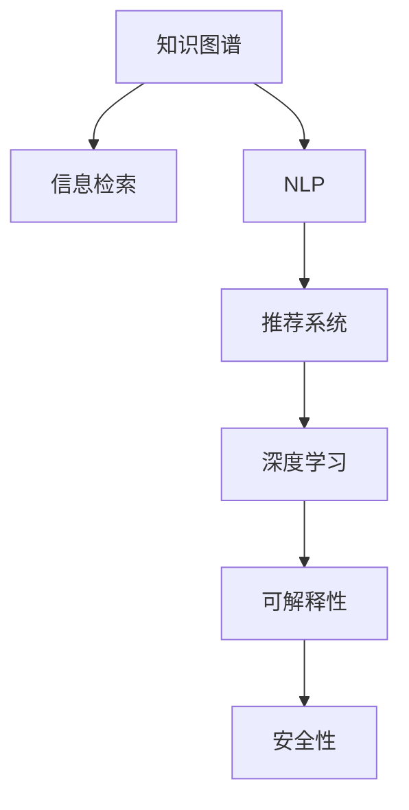

                 

# 打造个人知识发现引擎：程序员的必备技能

> 关键词：知识图谱, 信息检索, 自然语言处理, 深度学习, 推荐系统

## 1. 背景介绍

### 1.1 问题由来
在现代信息技术飞速发展的今天，程序员面临的信息量和知识增长速度越来越快。如何高效地组织、存储和利用这些知识，成为了程序员面临的重要挑战。传统的数据库和文档管理方式，已经难以满足快速变化的业务需求。

为应对这一挑战，越来越多的技术手段被引入知识管理领域，其中知识图谱（Knowledge Graph）和推荐系统（Recommendation System）技术成为重大的突破点。本文将系统阐述这两项技术的工作原理和应用方法，帮助程序员打造个人知识发现引擎，提高工作效率和学习能力。

### 1.2 问题核心关键点
- 知识图谱：以结构化形式存储和描述实体及其关系的知识库，便于高效查询和推理。
- 信息检索：通过关键词匹配等技术，从海量的文档和数据中快速定位信息。
- 自然语言处理：利用深度学习技术，理解自然语言，并进行语义匹配和抽取。
- 推荐系统：根据用户历史行为和兴趣，推荐相关的信息或产品。
- 深度学习：利用多层神经网络进行模式识别和数据挖掘，提高信息检索和推荐精度。
- 可解释性：确保推荐系统的决策过程可理解、可解释，提高用户信任度。
- 安全性和隐私保护：确保知识图谱和推荐系统的数据安全和用户隐私不被侵犯。

这些核心概念共同构成了个人知识发现引擎的基础架构，使得程序员可以高效地组织、查询和使用知识，提升工作效率和学习能力。

## 2. 核心概念与联系

### 2.1 核心概念概述

为更好地理解个人知识发现引擎的构建，本节将介绍几个密切相关的核心概念：

- **知识图谱（Knowledge Graph）**：以节点和边为基本单元构建的知识网络，用于描述实体及其关系。每个节点表示一个实体，边表示实体之间的关系。
- **信息检索（Information Retrieval）**：通过索引和查询，从海量的文本数据中快速定位所需信息。
- **自然语言处理（Natural Language Processing, NLP）**：利用深度学习技术，对自然语言进行理解和处理，实现语义匹配和抽取。
- **推荐系统（Recommendation System）**：根据用户历史行为和兴趣，推荐相关的信息或产品。
- **深度学习（Deep Learning）**：利用多层神经网络进行模式识别和数据挖掘，提高信息检索和推荐的精度。
- **可解释性（Explainability）**：确保推荐系统的决策过程可理解、可解释，提高用户信任度。
- **安全性和隐私保护（Security and Privacy Protection）**：确保知识图谱和推荐系统的数据安全和用户隐私不被侵犯。

这些核心概念之间的逻辑关系可以通过以下Mermaid流程图来展示：



这个流程图展示了知识图谱、信息检索、NLP、推荐系统和深度学习之间的联系：

1. 知识图谱作为信息检索和NLP的基础，为推荐系统提供数据支持。
2. NLP技术帮助解析和理解文本信息，支持信息检索和推荐系统。
3. 深度学习技术进一步提升信息检索和推荐系统的精度。
4. 推荐系统基于用户行为数据，通过深度学习算法进行智能推荐。
5. 可解释性和安全性在推荐系统中至关重要，确保模型的决策透明和用户隐私。

## 3. 核心算法原理 & 具体操作步骤

### 3.1 算法原理概述

个人知识发现引擎的核心算法主要包括知识图谱构建、信息检索、NLP和推荐系统。以下将分别介绍这些算法的原理。

### 3.2 算法步骤详解

#### 3.2.1 知识图谱构建

知识图谱的构建通常包括以下几个步骤：

1. **实体识别**：从文档、网页、知识库等源数据中提取实体，如人名、地名、机构名等。
2. **关系抽取**：识别实体之间的关系，如“居住”、“工作于”、“属于”等。
3. **实体和关系合并**：将提取的实体和关系进行合并，形成知识图谱的基本单元。
4. **知识图谱存储**：使用图形数据库存储知识图谱，支持高效的查询和推理。

#### 3.2.2 信息检索

信息检索的主要目标是快速定位与用户查询相关的文档或数据。基本步骤包括：

1. **索引构建**：从大量文档中提取关键词和元数据，建立索引。
2. **查询处理**：接收用户查询请求，根据索引快速定位匹配的文档。
3. **结果排序**：根据相关性得分，对搜索结果进行排序，返回最优结果。

#### 3.2.3 自然语言处理

NLP的目的是从文本中提取有用信息，支持信息检索和推荐系统。主要步骤包括：

1. **文本预处理**：对文本进行分词、去停用词、词性标注等预处理。
2. **语义匹配**：使用深度学习模型（如BERT、GPT等），对文本进行语义匹配和抽取。
3. **实体抽取**：识别文本中的实体及其关系，进行结构化处理。
4. **语义理解**：理解文本的含义，支持信息检索和推荐系统。

#### 3.2.4 推荐系统

推荐系统的主要目标是根据用户的历史行为和兴趣，推荐相关的信息或产品。基本步骤包括：

1. **用户画像构建**：根据用户的历史行为和兴趣，构建用户画像。
2. **物品画像构建**：对推荐系统中的物品进行特征提取和描述。
3. **相似度计算**：计算用户画像和物品画像之间的相似度。
4. **推荐排序**：根据相似度计算结果，对推荐结果进行排序，返回最优结果。

### 3.3 算法优缺点

知识图谱、信息检索、NLP和推荐系统各有优缺点，具体如下：

#### 知识图谱

**优点**：

- 结构化存储和组织实体及关系，便于查询和推理。
- 支持语义匹配和信息抽取，提升信息检索的准确性。

**缺点**：

- 构建和维护成本较高，需要大量标注数据。
- 对实体和关系提取的准确性依赖较大。

#### 信息检索

**优点**：

- 高效快速地定位与查询相关的文档或数据。
- 适用范围广，可以用于各种文本数据。

**缺点**：

- 对索引构建和查询处理的优化要求较高。
- 对查询词的表达方式敏感，可能导致误匹配。

#### 自然语言处理

**优点**：

- 理解自然语言，提升信息检索和推荐系统的精度。
- 支持复杂的语义匹配和实体抽取。

**缺点**：

- 深度学习模型复杂，训练和推理资源消耗较大。
- 对预训练数据依赖较大，可能存在领域偏差。

#### 推荐系统

**优点**：

- 根据用户兴趣和历史行为，推荐相关内容，提升用户体验。
- 可以进行个性化推荐，适应用户多样化需求。

**缺点**：

- 对用户数据的依赖较大，存在隐私泄露风险。
- 模型复杂度较高，训练和推理资源消耗较大。

### 3.4 算法应用领域

知识图谱、信息检索、NLP和推荐系统在多个领域都有广泛的应用：

- **电商推荐**：基于用户浏览和购买行为，推荐相关商品。
- **社交媒体推荐**：根据用户兴趣和互动行为，推荐相关内容。
- **智能客服**：通过信息检索和NLP技术，快速解答用户问题。
- **新闻推荐**：根据用户阅读习惯，推荐相关新闻和文章。
- **医疗诊断**：构建医疗知识图谱，辅助医生诊断和治疗。
- **金融风控**：分析用户交易行为，识别潜在风险。

## 4. 数学模型和公式 & 详细讲解 & 举例说明

### 4.1 数学模型构建

知识图谱、信息检索、NLP和推荐系统中的数学模型通常包括：

- **知识图谱**：图结构模型，如三元组（主语-谓语-宾语）表示实体及关系。
- **信息检索**：向量空间模型，如TF-IDF算法。
- **NLP**：深度学习模型，如BERT、GPT等。
- **推荐系统**：协同过滤、基于内容的推荐、混合推荐等模型。

### 4.2 公式推导过程

#### 4.2.1 知识图谱

知识图谱的基本数学模型是三元组表示法，即：

$$
G = (E, R, S)
$$

其中 $E$ 为实体集合，$R$ 为关系集合，$S$ 为三元组集合。三元组的表示形式为：

$$
(e, r, o) \in S
$$

其中 $e$ 为主语，$r$ 为谓语，$o$ 为宾语。

#### 4.2.2 信息检索

信息检索的向量空间模型使用TF-IDF算法，计算文档与查询的相关度：

$$
\text{score}(q, d) = \sum_{i=1}^n (TF(q_i, d) \times IDF(q_i) \times TF(q_i, q) \times IDF(q_i))
$$

其中 $q$ 为查询向量，$d$ 为文档向量，$TF$ 为词频，$IDF$ 为逆文档频率。

#### 4.2.3 自然语言处理

自然语言处理的深度学习模型，如BERT模型，使用Transformer结构，其计算公式如下：

$$
\text{embedding}(w_i) = W_i \times \text{hidden}_{t-1}
$$

其中 $w_i$ 为单词，$W_i$ 为单词嵌入矩阵，$\text{hidden}_{t-1}$ 为上一步的隐藏状态。

#### 4.2.4 推荐系统

推荐系统中的协同过滤模型使用余弦相似度计算用户画像和物品画像之间的相似度：

$$
\text{similarity}(u, p) = \cos(\theta)
$$

其中 $\theta$ 为夹角，$u$ 为用户画像向量，$p$ 为物品画像向量。

### 4.3 案例分析与讲解

#### 4.3.1 知识图谱构建

以Google Scholar为例，其知识图谱的构建步骤如下：

1. **数据采集**：从Google Scholar的论文数据中提取论文信息，如标题、作者、引用等。
2. **实体识别**：使用自然语言处理技术，从论文标题、摘要中识别实体。
3. **关系抽取**：分析论文的引用关系，构建实体之间的关系。
4. **存储和管理**：将知识图谱存储到图形数据库中，支持高效查询和推理。

#### 4.3.2 信息检索

以Bing为例，其信息检索系统使用向量空间模型进行文本匹配，基本步骤如下：

1. **索引构建**：从搜索结果中提取关键词和元数据，建立索引。
2. **查询处理**：接收用户查询请求，根据索引快速定位匹配的文档。
3. **结果排序**：根据相关性得分，对搜索结果进行排序，返回最优结果。

#### 4.3.3 自然语言处理

以BERT为例，其深度学习模型的训练步骤如下：

1. **预训练**：使用大规模无标签文本数据对模型进行预训练，学习语言表示。
2. **微调**：在特定任务上使用标注数据，微调模型参数，提升任务性能。
3. **推理**：将待处理文本输入模型，输出文本表示和语义信息。

#### 4.3.4 推荐系统

以Netflix为例，其推荐系统的构建步骤如下：

1. **用户画像构建**：根据用户的历史行为和兴趣，构建用户画像。
2. **物品画像构建**：对推荐系统中的电影和电视节目进行特征提取和描述。
3. **相似度计算**：计算用户画像和物品画像之间的相似度。
4. **推荐排序**：根据相似度计算结果，对推荐结果进行排序，返回最优结果。

## 5. 项目实践：代码实例和详细解释说明

### 5.1 开发环境搭建

在进行知识发现引擎的开发实践前，我们需要准备好开发环境。以下是使用Python进行PyTorch和TensorFlow开发的环境配置流程：

1. 安装Anaconda：从官网下载并安装Anaconda，用于创建独立的Python环境。

2. 创建并激活虚拟环境：
```bash
conda create -n tf-env python=3.8 
conda activate tf-env
```

3. 安装TensorFlow和PyTorch：根据CUDA版本，从官网获取对应的安装命令。例如：
```bash
conda install tensorflow==2.6 pytorch torchvision torchaudio -c pytorch -c conda-forge
```

4. 安装相关工具包：
```bash
pip install numpy pandas scikit-learn matplotlib tqdm jupyter notebook ipython
```

完成上述步骤后，即可在`tf-env`环境中开始开发实践。

### 5.2 源代码详细实现

下面我们以推荐系统为例，给出使用TensorFlow对推荐模型进行训练和推理的PyTorch代码实现。

首先，定义推荐系统的训练数据集：

```python
import tensorflow as tf
import numpy as np

# 训练数据
train_data = np.array([[0, 1, 1, 1], [0, 0, 1, 1], [1, 1, 1, 1], [1, 0, 0, 1]])
train_labels = np.array([[1, 0, 0], [0, 1, 0], [0, 0, 1], [1, 1, 1]])

# 定义超参数
learning_rate = 0.01
batch_size = 4
num_epochs = 10
```

然后，定义模型：

```python
# 定义推荐模型
class RecommendationModel(tf.keras.Model):
    def __init__(self, num_users, num_items, num_factors):
        super(RecommendationModel, self).__init__()
        self.num_users = num_users
        self.num_items = num_items
        self.num_factors = num_factors
        
        self.user_embeddings = tf.keras.layers.Embedding(num_users, num_factors)
        self.item_embeddings = tf.keras.layers.Embedding(num_items, num_factors)
        self.dot_product = tf.keras.layers.Dot(axes=(1, 1), normalize=False)
        
    def call(self, inputs):
        user_id, item_id = inputs
        user_embeddings = self.user_embeddings(user_id)
        item_embeddings = self.item_embeddings(item_id)
        dot_product = self.dot_product([user_embeddings, item_embeddings])
        return dot_product
```

接着，定义训练函数：

```python
# 定义训练函数
def train_model(model, data, labels, learning_rate, batch_size, num_epochs):
    optimizer = tf.keras.optimizers.Adam(learning_rate)
    
    # 定义损失函数
    def loss_fn(model, inputs, labels):
        dot_product = model(inputs)
        return tf.losses.mean_squared_error(labels, dot_product)
    
    # 定义准确率评估函数
    def accuracy_fn(model, inputs, labels):
        dot_product = model(inputs)
        return tf.metrics.mean(tf.cast(tf.math.greater_equal(dot_product, labels), tf.float32))
    
    # 训练循环
    for epoch in range(num_epochs):
        epoch_loss = 0.0
        epoch_acc = 0.0
        
        for i in range(0, len(data), batch_size):
            batch_data = data[i:i+batch_size]
            batch_labels = labels[i:i+batch_size]
            optimizer.zero_grad()
            with tf.GradientTape() as tape:
                loss = loss_fn(model, batch_data, batch_labels)
                tape.watch(model.trainable_variables)
                gradient = tape.gradient(loss, model.trainable_variables)
                optimizer.apply_gradients(zip(gradient, model.trainable_variables))
            
            epoch_loss += loss
            epoch_acc += accuracy_fn(model, batch_data, batch_labels).numpy()
            
        print(f"Epoch {epoch+1}, Loss: {epoch_loss/len(data)}, Accuracy: {epoch_acc/len(data)}")
    
    return model
```

最后，启动训练流程：

```python
# 创建模型实例
num_users = 5
num_items = 10
num_factors = 5
model = RecommendationModel(num_users, num_items, num_factors)

# 训练模型
model = train_model(model, train_data, train_labels, learning_rate, batch_size, num_epochs)

# 推理测试
test_data = np.array([[0, 1, 1], [0, 0, 1]])
test_labels = np.array([[1, 0, 0], [0, 1, 0]])
dot_product = model(test_data)
print(f"Predictions: {dot_product}")
```

以上就是使用TensorFlow对推荐系统进行训练和推理的完整代码实现。可以看到，使用TensorFlow搭建推荐系统，不仅代码简洁，而且支持高效的向量运算和自动微分。

### 5.3 代码解读与分析

让我们再详细解读一下关键代码的实现细节：

**训练数据集**：
- `train_data`：用户-物品评分矩阵，每一行表示一个用户对多个物品的评分。
- `train_labels`：用户-物品评分矩阵，每一行表示一个用户对多个物品的评分。

**推荐模型**：
- 使用`tf.keras.layers.Embedding`层，将用户和物品的ID映射到低维向量空间。
- 使用`tf.keras.layers.Dot`层，计算用户和物品向量间的点积，得到推荐分数。

**训练函数**：
- 使用`tf.keras.optimizers.Adam`优化器，设置学习率。
- 定义损失函数，计算预测评分与实际评分之间的均方误差。
- 定义准确率评估函数，计算预测评分与实际评分之间的误差率。
- 在每个epoch内，对批量数据进行训练，并计算epoch的总损失和平均准确率。

**训练流程**：
- 定义超参数，如学习率、batch size、epoch数。
- 创建推荐模型实例，传入用户、物品和因子的数量。
- 调用训练函数，传入模型、数据、标签、超参数，开始训练。
- 在每个epoch内，打印训练损失和平均准确率。
- 最后返回训练好的推荐模型。

在实际应用中，还需要考虑模型保存、模型部署、超参数调优等问题。但核心的训练流程和代码实现方式基本与此类似。

## 6. 实际应用场景

### 6.1 电商推荐

电商推荐系统可以通过知识图谱、信息检索和NLP技术，推荐相关商品。例如，Amazon推荐系统会根据用户浏览和购买历史，构建用户画像，从商品库中筛选相似商品进行推荐。

### 6.2 社交媒体推荐

社交媒体推荐系统可以通过信息检索和NLP技术，推荐相关内容。例如，Twitter推荐系统会根据用户关注和互动情况，推荐可能感兴趣的话题和用户。

### 6.3 智能客服

智能客服系统可以通过知识图谱和信息检索技术，快速解答用户问题。例如，智能客服系统可以根据用户的问题，从知识库中匹配相关回答，生成自然流畅的回复。

### 6.4 新闻推荐

新闻推荐系统可以通过信息检索和NLP技术，推荐相关新闻和文章。例如，Google新闻推荐系统会根据用户阅读习惯，推荐可能感兴趣的新闻和文章。

### 6.5 金融风控

金融风控系统可以通过知识图谱和NLP技术，分析用户交易行为，识别潜在风险。例如，银行风控系统可以通过分析用户行为和交易记录，构建用户画像，识别潜在的欺诈行为。

## 7. 工具和资源推荐

### 7.1 学习资源推荐

为了帮助开发者系统掌握知识发现引擎的理论基础和实践技巧，这里推荐一些优质的学习资源：

1. **《深度学习》（Ian Goodfellow等）**：经典的深度学习入门教材，全面介绍了深度学习的基本原理和应用。

2. **《信息检索》（Christopher Manning等）**：经典的信息检索教材，详细介绍了文本检索、搜索引擎等技术。

3. **《自然语言处理综论》（Daniel Jurafsky等）**：经典的自然语言处理教材，全面介绍了NLP的基本概念和算法。

4. **《推荐系统实践》（Bradley Peters等）**：推荐的系统实践教材，详细介绍了推荐系统的设计、实现和评估。

5. **Coursera《Deep Learning Specialization》课程**：由Andrew Ng教授开设的深度学习课程，涵盖深度学习的基本原理和应用。

6. **edX《Recommender Systems》课程**：由Gaurav Vani教授开设的推荐系统课程，详细介绍了推荐系统的设计和实现。

通过这些资源的学习实践，相信你一定能够快速掌握知识发现引擎的理论基础和实践技巧，并用于解决实际的NLP问题。

### 7.2 开发工具推荐

高效的开发离不开优秀的工具支持。以下是几款用于知识发现引擎开发的常用工具：

1. **PyTorch**：基于Python的开源深度学习框架，灵活动态的计算图，适合快速迭代研究。

2. **TensorFlow**：由Google主导开发的开源深度学习框架，生产部署方便，适合大规模工程应用。

3. **Spark**：Apache基金会开发的分布式计算框架，支持大规模数据处理和机器学习。

4. **Hadoop**：Apache基金会开发的分布式计算框架，支持大数据处理和存储。

5. **Elasticsearch**：基于Apache Lucene的搜索和分析引擎，支持大规模文本数据检索和分析。

6. **Kibana**：基于Elasticsearch的可视化工具，支持文本数据的可视化分析和展示。

合理利用这些工具，可以显著提升知识发现引擎的开发效率，加快创新迭代的步伐。

### 7.3 相关论文推荐

知识发现引擎技术的发展离不开学界的持续研究。以下是几篇奠基性的相关论文，推荐阅读：

1. **"Knowledge Graphs: A Semantic Web Platform for Modeling, Reasoning and Querying"**：Yen等。

2. **"Information Retrieval and Information Access: Principles and Practices"**：Robertson等。

3. **"Neural Machine Translation by Jointly Learning to Align and Translate"**：Sutskever等。

4. **"Deep Structured Models: An Overview"**：Mikolov等。

5. **"Personalized Recommendation Algorithms in Social Media: A Survey"**：Wang等。

这些论文代表了大语言模型微调技术的发展脉络。通过学习这些前沿成果，可以帮助研究者把握学科前进方向，激发更多的创新灵感。

## 8. 总结：未来发展趋势与挑战

### 8.1 总结

本文对知识图谱、信息检索、NLP和推荐系统的理论基础和实践方法进行了系统阐述。首先，我们介绍了这些技术的工作原理和应用场景，明确了知识发现引擎在开发和应用中的关键点。其次，我们通过具体的代码实例，展示了如何使用PyTorch和TensorFlow构建推荐系统，进一步加深了对知识图谱、信息检索、NLP和推荐系统的理解。

通过本文的系统梳理，可以看到，知识发现引擎技术正处于快速发展阶段，具有广阔的应用前景。掌握这一技术，程序员可以高效地组织、存储和利用知识，提升工作效率和学习能力。

### 8.2 未来发展趋势

展望未来，知识发现引擎技术将呈现以下几个发展趋势：

1. **知识图谱的发展**：随着知识图谱构建技术的不断进步，未来的知识图谱将更加丰富和准确，支持更复杂的语义匹配和推理。

2. **信息检索的优化**：未来将引入更多先进的检索技术，如深度学习、图结构检索等，提升检索精度和响应速度。

3. **NLP的深度学习**：深度学习技术将进一步提升NLP任务的性能，支持更复杂的语义匹配和抽取。

4. **推荐系统的智能化**：推荐系统将引入更多的深度学习算法和增强学习技术，提升推荐精度和个性化程度。

5. **系统集成和协同**：未来的知识发现引擎将更注重系统集成和协同，如知识图谱与信息检索的结合，NLP与推荐系统的融合，构建更加智能的推荐系统。

这些趋势将推动知识发现引擎技术向更高的精度和智能化方向发展，为NLP应用带来更广泛的落地场景。

### 8.3 面临的挑战

尽管知识发现引擎技术已经取得了显著进展，但在向更广泛的应用场景拓展的过程中，仍面临以下挑战：

1. **数据获取和标注**：获取高质量的标注数据和构建大规模的知识图谱需要大量的人力物力。如何降低数据标注成本，提升数据标注质量，仍是一个亟待解决的问题。

2. **模型的可解释性**：推荐系统的决策过程往往难以解释，难以满足用户对系统透明度的需求。如何提高模型的可解释性，增强用户信任度，是一个重要的研究方向。

3. **隐私保护和安全**：知识图谱和推荐系统涉及用户隐私和数据安全，如何保护用户隐私，防止数据泄露，是一个需要重点关注的挑战。

4. **算力和时间成本**：知识图谱构建和推荐系统训练需要大量的计算资源和时间成本，如何优化算力消耗，提升系统效率，是一个重要的问题。

5. **多样性和公平性**：推荐系统往往存在偏见和偏差，如何消除偏见，确保推荐结果的公平性，是一个需要深入研究的课题。

6. **跨领域应用**：现有的知识图谱和推荐系统更多地聚焦于文本数据，如何将其应用于图像、语音等多模态数据，是一个需要解决的问题。

这些挑战表明，知识发现引擎技术在不断进步的同时，仍需在多方面进行改进和完善。唯有在技术、工程、伦理等多个维度进行全面优化，才能充分发挥知识发现引擎技术的潜力。

### 8.4 研究展望

未来的研究需要在以下几个方向寻求新的突破：

1. **知识图谱的跨领域应用**：探索知识图谱在图像、语音等多模态数据中的应用，提升知识发现引擎的多样性。

2. **推荐系统的公平性和多样性**：研究如何消除推荐系统的偏见和偏差，确保推荐结果的公平性。

3. **深度学习和知识图谱的融合**：探索深度学习与知识图谱的结合方式，提升推荐系统的精度和智能化程度。

4. **知识图谱的可解释性**：研究如何提高知识图谱的可解释性，增强用户对系统的信任度。

5. **推荐系统的实时性和自适应**：研究如何实现推荐系统的实时更新和自适应，提升系统响应速度和个性化程度。

6. **隐私保护和数据安全**：研究如何在保证隐私和安全的前提下，构建知识图谱和推荐系统。

这些研究方向将推动知识发现引擎技术的不断进步，为NLP应用带来更大的创新空间。

## 9. 附录：常见问题与解答

**Q1：知识图谱的构建是否需要大量标注数据？**

A: 知识图谱的构建通常需要大量的标注数据，用于实体和关系的识别和验证。然而，通过半监督学习和数据增强技术，可以在一定程度上减少对标注数据的依赖。例如，使用无标签数据进行预训练，再利用少量标注数据进行微调。

**Q2：信息检索的精度如何提升？**

A: 信息检索的精度可以通过以下方法提升：

1. **向量空间模型优化**：使用TF-IDF、BM25等算法，优化索引构建和查询处理。

2. **深度学习模型应用**：使用BERT、GPT等深度学习模型，提升文本匹配和语义理解能力。

3. **多模态检索**：引入图像、语音等多模态数据，提升检索精度和多样化程度。

**Q3：推荐系统的训练和推理资源消耗较大，如何解决？**

A: 推荐系统的训练和推理资源消耗较大，可以通过以下方法进行优化：

1. **参数压缩和剪枝**：使用稀疏化技术，减少模型参数量，降低计算资源消耗。

2. **分布式计算**：使用Spark、Hadoop等分布式计算框架，加速模型训练和推理。

3. **模型微调**：使用预训练模型，减少训练和推理的资源消耗。

4. **模型并行**：使用TensorFlow、PyTorch等框架，支持模型并行和自动微分，提高系统效率。

**Q4：推荐系统如何进行用户画像构建？**

A: 推荐系统的用户画像构建可以通过以下步骤：

1. **数据采集**：从用户行为数据中提取用户特征，如浏览记录、购买记录、评分记录等。

2. **特征选择和预处理**：对用户特征进行归一化、降维等预处理。

3. **用户画像建模**：使用协同过滤、内容推荐等算法，构建用户画像模型。

4. **画像评估和优化**：使用准确率、召回率等指标评估用户画像模型，进行模型优化。

通过这些方法，可以有效构建用户画像，提升推荐系统的个性化程度。

**Q5：推荐系统的可解释性如何增强？**

A: 推荐系统的可解释性可以通过以下方法增强：

1. **特征重要性分析**：使用特征重要性分析技术，识别影响推荐结果的关键特征。

2. **决策树和规则引擎**：使用决策树、规则引擎等工具，解析推荐系统的决策过程。

3. **模型可视化**：使用可视化工具，如TensorBoard、Kibana等，展示推荐系统的内部结构和决策路径。

通过这些方法，可以有效增强推荐系统的可解释性，提高用户对系统的信任度。

---

作者：禅与计算机程序设计艺术 / Zen and the Art of Computer Programming

