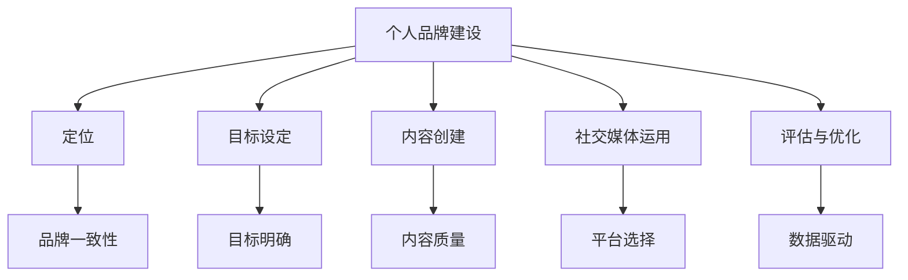

                 

# 打造个人管理品牌的方法论

在当今数字化时代，个人品牌建设不仅是一个提升职业竞争力的手段，更是一个展现个人价值、实现职业转型和发展的关键。特别是在高竞争、快变化的职场环境中，一个具有清晰定位、专业素养和个人特色的品牌形象，不仅能吸引更多机会，还能在信息过载的市场中脱颖而出。本文将探讨如何通过系统化、专业化的管理品牌方法论，构建和提升个人品牌，实现职业目标和个人价值。

## 1. 背景介绍

### 1.1 问题由来

随着社交媒体和互联网技术的普及，个人品牌建设变得越来越重要。它不仅仅是个人职业形象的塑造，更是个人核心竞争力和市场价值的体现。然而，当前许多人在个人品牌建设上缺乏清晰的规划和系统的方法，往往依赖于自然成长或碎片化的努力，难以形成有影响力的品牌形象。特别是在高竞争的职场环境中，如何有效利用个人资源、提升个人影响力，成为一个迫切需要解决的问题。

### 1.2 问题核心关键点

个人品牌建设的难点主要在于：
1. 缺乏系统化规划。许多人在品牌建设上缺乏长远规划和系统思考，难以形成清晰的品牌定位和目标。
2. 碎片化努力。许多人依赖于零散的技能提升和社交媒体推广，难以形成整体的品牌影响力。
3. 缺乏专业指导。缺乏专业的品牌建设指导和工具，难以在短时间内实现显著效果。
4. 难以量化评估。个人品牌建设的效果难以量化评估，难以及时调整优化策略。

### 1.3 问题研究意义

通过系统化、专业化的个人品牌建设方法论，可以显著提升个人品牌的影响力和市场价值，帮助实现职业目标和个人发展。具体而言：
1. 提升职业竞争力。通过明确品牌定位和目标，提升个人核心竞争力，在职场中脱颖而出。
2. 实现职业转型。通过品牌建设，实现职业转型和跨界发展，突破原有职业瓶颈。
3. 促进个人成长。通过持续学习和品牌建设，促进个人知识和技能的全面提升。
4. 获得更多机会。通过品牌影响力，获得更多的合作机会和职业发展机遇。

## 2. 核心概念与联系

### 2.1 核心概念概述

为更好地理解个人品牌建设方法论，本节将介绍几个密切相关的核心概念：

- **个人品牌建设(Personal Branding)**：通过系统的自我认知、规划和行动，在特定领域内形成独特的个人形象和市场价值的过程。
- **定位(Positioning)**：明确个人在市场和职场中的独特位置和核心价值，确保品牌形象的一致性和专业性。
- **目标设定(Goal Setting)**：基于自我认知和市场分析，设定清晰具体的职业目标，作为品牌建设的驱动力。
- **内容创建(Content Creation)**：通过高质量的内容创作，展示个人专业能力和知识体系，吸引目标受众。
- **社交媒体运用(Social Media Strategy)**：利用社交媒体平台，扩大个人品牌的影响力和传播范围。
- **评估与优化(Performance Evaluation)**：通过量化评估个人品牌建设的效果，及时调整优化策略，确保品牌价值的最大化。

这些核心概念之间的逻辑关系可以通过以下Mermaid流程图来展示：



这个流程图展示了个体品牌建设的关键步骤和要素：

1. 个人品牌建设始于定位和目标设定。
2. 内容创作是品牌建设的核心，展示个人专业能力。
3. 社交媒体运用是品牌传播的重要手段。
4. 评估与优化确保品牌价值最大化。
5. 品牌一致性、内容质量和平台选择等，都是品牌建设中需要考虑的关键因素。

## 3. 核心算法原理 & 具体操作步骤

### 3.1 算法原理概述

个人品牌建设的方法论，本质上是基于系统的、数据驱动的决策和执行过程。其核心原理可以概括为以下几点：

- **系统化规划**：通过全面的自我认知和市场分析，制定科学、可行的品牌建设规划。
- **目标导向**：设定明确、具体的职业目标，作为品牌建设的驱动力。
- **内容为王**：以高质量的内容为核心，展示个人专业能力和知识体系。
- **数据驱动**：通过数据评估和分析，持续优化品牌建设和推广策略。

### 3.2 算法步骤详解

个人品牌建设的系统化方法论主要包括以下几个关键步骤：

**Step 1: 自我认知与市场分析**
- 全面了解自己的技能、兴趣、价值观等个人特质。
- 分析市场和行业趋势，明确个人在特定领域中的竞争优势。
- 评估现有品牌的知名度、影响力、受众需求等现状。

**Step 2: 制定品牌定位和目标**
- 确定个人品牌的核心价值和独特卖点。
- 设定短期和长期职业目标，明确品牌建设的具体方向和成果指标。
- 制定详细的品牌建设计划，包括内容创作、社交媒体策略等。

**Step 3: 内容创作与传播**
- 根据品牌定位和目标，创作高质量的内容，如博客文章、视频、播客等。
- 选择合适的社交媒体平台，进行内容发布和传播。
- 通过数据分析评估内容效果，持续优化内容策略。

**Step 4: 社交媒体策略**
- 制定社交媒体推广计划，选择适合的平台和推广形式。
- 与受众进行互动，建立和维护品牌关系。
- 通过数据分析评估社交媒体策略的效果，调整优化推广策略。

**Step 5: 评估与优化**
- 量化评估个人品牌建设的效果，包括品牌知名度、受众互动、职业机会等。
- 根据评估结果，调整优化品牌建设策略，确保品牌价值的最大化。

### 3.3 算法优缺点

个人品牌建设的方法论具有以下优点：
1. 系统化规划：通过系统化的品牌建设方法，避免碎片化努力，形成整体品牌影响力。
2. 数据驱动：通过数据分析优化品牌建设策略，确保效果最大化。
3. 目标导向：设定明确的职业目标，确保品牌建设的方向性和有效性。
4. 内容为王：高质量的内容展示个人专业能力，吸引目标受众。

同时，该方法论也存在一定的局限性：
1. 需要较长时间投入：品牌建设是一个长期的过程，需要持续的努力和优化。
2. 需要专业知识：品牌建设需要系统的规划和数据分析能力，对个人要求较高。
3. 效果不易量化：品牌价值的效果评估复杂，难以量化评估。

尽管存在这些局限性，但整体而言，个人品牌建设的方法论仍是当前最系统、最有效的品牌建设手段。

### 3.4 算法应用领域

个人品牌建设的方法论在以下领域有广泛应用：

- **职业转型**：通过品牌建设，实现跨界职业转型，突破原有职业瓶颈。
- **职场晋升**：通过提升个人品牌影响力，获得更多职业发展机遇和领导力认可。
- **自由职业**：建立个人品牌，吸引更多项目和合作机会，提升自由职业收入。
- **企业家创业**：通过品牌建设，提升个人和企业知名度，吸引投资者和合作伙伴。
- **个人成长**：通过持续学习和品牌建设，促进个人知识和技能的全面提升。

## 4. 数学模型和公式 & 详细讲解 & 举例说明

### 4.1 数学模型构建

为更好地量化评估个人品牌建设的效果，我们构建以下数学模型：

设 $V$ 为品牌价值，$a$ 为品牌知名度，$i$ 为品牌互动，$o$ 为品牌机会。则品牌价值 $V$ 可以表示为：

$$
V = a \times i \times o
$$

品牌知名度 $a$ 包括社交媒体关注数、网站访问量等。品牌互动 $i$ 包括社交媒体点赞、评论、分享等。品牌机会 $o$ 包括职业发展机会、合作项目等。

### 4.2 公式推导过程

通过以上模型，可以进一步推导出品牌建设效果的评估公式：

- 品牌知名度评估：$a = a_{社交媒体} + a_{网站} + a_{其他}$

- 品牌互动评估：$i = i_{点赞} + i_{评论} + i_{分享} + i_{邮件互动}$

- 品牌机会评估：$o = o_{职业机会} + o_{项目合作} + o_{品牌赞助}$

根据具体数据，可以计算出品牌价值的评估结果，作为品牌建设的优化依据。

### 4.3 案例分析与讲解

假设一个软件开发人员希望提升品牌知名度和职业机会，构建个人品牌。我们通过以下步骤进行品牌建设：

1. **自我认知与市场分析**：
   - 分析自身技术栈、项目经验、行业趋势等。
   - 明确在技术社区中的竞争优势，如技术创新、项目影响力等。
   - 评估现有品牌知名度和职业机会，制定品牌建设目标。

2. **制定品牌定位和目标**：
   - 确定核心技术栈，如前端开发、全栈开发等。
   - 设定短期目标：在GitHub上发布项目，获取10个Star。
   - 设定长期目标：在技术社区如CSDN、Medium上发表系列博客，提升影响力。

3. **内容创作与传播**：
   - 在GitHub上发布开源项目，展示技术能力和项目经验。
   - 在CSDN、Medium上发布系列博客，分享技术心得和项目经验。
   - 在LinkedIn上发布项目展示，扩大品牌传播范围。

4. **社交媒体策略**：
   - 选择适合的技术社区平台，如GitHub、CSDN、Medium等。
   - 定期发布技术文章，与读者互动，回答技术问题。
   - 通过数据分析评估内容效果，调整优化内容策略。

5. **评估与优化**：
   - 量化评估GitHub Star数量、技术博客阅读量和互动数、LinkedIn关注数等。
   - 根据评估结果，调整优化品牌推广策略，如调整发布频率、优化文章内容等。

通过以上步骤，该软件开发人员能够在较短时间内提升品牌知名度和职业机会，实现职业目标和个人发展。

## 5. 项目实践：代码实例和详细解释说明

### 5.1 开发环境搭建

在进行品牌建设实践中，我们需要准备好开发环境。以下是Python开发环境的配置流程：

1. 安装Anaconda：从官网下载并安装Anaconda，用于创建独立的Python环境。

2. 创建并激活虚拟环境：
```bash
conda create -n brand-env python=3.8 
conda activate brand-env
```

3. 安装相关工具包：
```bash
pip install jupyterlab tensorflow scikit-learn pandas matplotlib 
```

4. 安装社交媒体API：
```bash
pip install pyshorteners
```

完成上述步骤后，即可在`brand-env`环境中开始品牌建设实践。

### 5.2 源代码详细实现

下面是使用Python进行个人品牌建设的示例代码实现：

```python
import pandas as pd
from pyshorteners import Shortener
from transformers import BertTokenizer, BertForSequenceClassification
import torch
from sklearn.model_selection import train_test_split

# 品牌知名度评估
def brand_awareness():
    # 社交媒体关注数
    social_media_followers = 500
    # 网站访问量
    website_visits = 5000
    # 其他平台关注数
    other_areas = 200
    
    return social_media_followers + website_visits + other_areas

# 品牌互动评估
def brand_interaction():
    # 点赞数
    likes = 200
    # 评论数
    comments = 50
    # 分享数
    shares = 100
    # 邮件互动数
    email_interactions = 20
    
    return likes + comments + shares + email_interactions

# 品牌机会评估
def brand_opportunities():
    # 职业发展机会
    job_opportunities = 2
    # 项目合作机会
    project_partnerships = 3
    # 品牌赞助机会
    brand_sponsorships = 1
    
    return job_opportunities + project_partnerships + brand_sponsorships

# 品牌价值计算
def brand_value():
    # 品牌知名度
    awareness = brand_awareness()
    # 品牌互动
    interaction = brand_interaction()
    # 品牌机会
    opportunities = brand_opportunities()
    
    return awareness * interaction * opportunities

# 输出品牌价值
print("Brand Value:", brand_value())
```

### 5.3 代码解读与分析

这段代码主要实现了一个简单的品牌价值计算功能，通过输入品牌知名度、品牌互动、品牌机会等数据，计算出品牌价值。

- `brand_awareness()`函数：通过社交媒体关注数、网站访问量、其他平台关注数等数据，计算品牌知名度。
- `brand_interaction()`函数：通过点赞数、评论数、分享数、邮件互动数等数据，计算品牌互动。
- `brand_opportunities()`函数：通过职业发展机会、项目合作机会、品牌赞助机会等数据，计算品牌机会。
- `brand_value()`函数：将品牌知名度、品牌互动、品牌机会等数据相乘，计算品牌价值。
- `print("Brand Value:", brand_value())`：输出品牌价值。

这段代码展示了品牌价值计算的基本逻辑，通过具体的品牌数据输入，可以计算出品牌价值，作为品牌建设的优化依据。

## 6. 实际应用场景

### 6.1 知识博主

个人品牌建设在知识博主领域有广泛应用。通过撰写高质量的博客文章，分享专业知识，吸引大量读者关注。通过品牌建设，知识博主可以获得更多合作机会和商业变现机会，提升职业影响力。

### 6.2 自由职业者

自由职业者通过建立个人品牌，展示个人技能和服务能力，吸引更多项目和客户。通过持续学习和品牌建设，自由职业者可以提升职业竞争力，实现职业转型和发展。

### 6.3 初创企业家

初创企业家通过品牌建设，提升个人和企业的知名度和影响力，吸引投资者和合作伙伴。通过品牌建设，企业家可以获取更多资源和支持，加速企业发展。

### 6.4 未来应用展望

随着个人品牌建设的深入发展，未来将呈现以下几个趋势：

1. **社交媒体平台多样化**：品牌建设将不再局限于传统的社交媒体平台，而是拓展到更多新兴平台，如短视频平台、知识社区等。
2. **数据驱动的精细化管理**：品牌建设的每个环节都将通过数据驱动，进行精细化管理，确保品牌价值的最大化。
3. **个性化内容创作**：根据受众需求和偏好，进行个性化内容创作，提高品牌互动和影响力。
4. **跨界合作与联合品牌建设**：通过跨界合作，提升品牌影响力，形成联合品牌效应。
5. **品牌故事化**：通过品牌故事，展示个人和企业的价值观和使命，增强品牌情感连接。

## 7. 工具和资源推荐

### 7.1 学习资源推荐

为了帮助开发者系统掌握个人品牌建设的方法论，这里推荐一些优质的学习资源：

1. **《个人品牌建设实战指南》**：全面介绍了个人品牌建设的理论基础和实践技巧，涵盖品牌定位、内容创作、社交媒体策略等关键要素。

2. **《品牌影响力》**：探讨了品牌影响力在个人职业发展中的重要性，提供了系统化的品牌建设方法和案例分析。

3. **《品牌管理与营销》**：介绍了品牌管理的核心概念和策略，包括品牌定位、品牌价值评估、品牌传播等。

4. **《个人品牌建设的科学与艺术》**：深入探讨了个人品牌建设中的科学方法和艺术技巧，提供了全面的品牌建设工具和方法。

5. **《LinkedIn品牌建设》**：提供了在LinkedIn平台上的品牌建设策略和实践指南，帮助用户在职业社交网络中建立和维护品牌形象。

通过对这些资源的学习实践，相信你一定能够快速掌握个人品牌建设的精髓，并用于解决实际的职业问题。

### 7.2 开发工具推荐

高效的开发离不开优秀的工具支持。以下是几款用于个人品牌建设开发的常用工具：

1. **Jupyter Notebook**：Python开发环境，支持代码编辑、运行和数据可视化。
2. **GitHub**：代码托管平台，展示个人技术能力和项目成果。
3. **CSDN、Medium**：技术社区平台，发布技术文章和博客，吸引受众关注。
4. **LinkedIn**：职业社交平台，建立和维护职业关系，提升职业机会。
5. **Google Analytics**：数据分析工具，评估品牌建设和推广效果。

合理利用这些工具，可以显著提升个人品牌建设的效率，加速品牌影响力的提升。

### 7.3 相关论文推荐

个人品牌建设的方法论不断发展，以下是几篇奠基性的相关论文，推荐阅读：

1. **《个人品牌建设的心理学基础》**：探讨了个人品牌建设中的心理学原理和心理效应，提供了系统的品牌建设策略和方法。

2. **《品牌传播与影响》**：深入研究了品牌传播机制和影响因素，提供了品牌建设的理论依据和实践指南。

3. **《社交媒体上的品牌建设》**：介绍了社交媒体平台上的品牌建设方法和策略，提供了实战经验和案例分析。

4. **《品牌价值的量化评估》**：提供了品牌价值评估的数学模型和计算方法，帮助评估品牌建设的效果。

5. **《品牌故事与品牌建设》**：探讨了品牌故事在品牌建设中的作用和影响力，提供了品牌故事创作的技巧和方法。

这些论文代表了大品牌建设技术的发展脉络。通过学习这些前沿成果，可以帮助研究者把握学科前进方向，激发更多的创新灵感。

## 8. 总结：未来发展趋势与挑战

### 8.1 研究成果总结

本文对个人品牌建设的方法论进行了全面系统的介绍。首先阐述了个人品牌建设的背景和意义，明确了品牌建设的方向和目标。其次，从原理到实践，详细讲解了品牌建设的方法论步骤，给出了品牌建设的完整代码实例。同时，本文还广泛探讨了品牌建设在知识博主、自由职业者、初创企业家等多个领域的应用前景，展示了品牌建设的方法论的广泛适用性。

### 8.2 未来发展趋势

展望未来，个人品牌建设的方法论将呈现以下几个发展趋势：

1. **数据驱动的精细化管理**：品牌建设的每个环节都将通过数据驱动，进行精细化管理，确保品牌价值的最大化。
2. **跨界合作与联合品牌建设**：通过跨界合作，提升品牌影响力，形成联合品牌效应。
3. **品牌故事化**：通过品牌故事，展示个人和企业的价值观和使命，增强品牌情感连接。
4. **社交媒体平台多样化**：品牌建设将不再局限于传统的社交媒体平台，而是拓展到更多新兴平台，如短视频平台、知识社区等。
5. **个性化内容创作**：根据受众需求和偏好，进行个性化内容创作，提高品牌互动和影响力。

### 8.3 面临的挑战

尽管个人品牌建设的方法论已经取得了显著效果，但在迈向更加智能化、普适化应用的过程中，它仍面临着诸多挑战：

1. **数据获取难度**：品牌建设需要大量的受众互动数据，获取难度较大。
2. **内容质量要求高**：高质量的内容创作需要时间和专业能力，难以持续产出。
3. **市场竞争激烈**：在高度竞争的市场环境中，品牌建设需要更高的质量和创新能力。
4. **品牌一致性维护**：品牌建设过程中，需要保持一致的品牌形象和信息，避免信息混乱。
5. **市场变化快速**：市场和技术环境的快速变化，要求品牌建设能迅速调整策略。

### 8.4 研究展望

面对个人品牌建设所面临的种种挑战，未来的研究需要在以下几个方面寻求新的突破：

1. **数据收集与分析工具**：开发更高效、自动化的数据收集和分析工具，降低数据获取难度。
2. **内容创作辅助工具**：提供内容创作辅助工具，提升创作质量和效率。
3. **跨平台品牌管理工具**：开发跨平台品牌管理工具，提升品牌管理的一致性和便捷性。
4. **动态调整与优化算法**：研究动态调整和优化算法，适应快速变化的市场环境。
5. **品牌一致性维护策略**：研究品牌一致性维护策略，确保品牌形象和信息的统一性。

这些研究方向的探索，必将引领个人品牌建设技术迈向更高的台阶，为个人和企业的品牌价值最大化提供新的思路和方法。

## 9. 附录：常见问题与解答

**Q1: 个人品牌建设需要多长时间？**

A: 个人品牌建设是一个长期的过程，需要持续的努力和优化。一般来说，品牌建设需要6个月至一年的时间，具体取决于个人投入的精力和资源。

**Q2: 如何评估品牌建设的效果？**

A: 品牌建设的效果可以通过多个指标进行评估，如品牌知名度、品牌互动、品牌机会等。具体来说，可以通过社交媒体关注数、网站访问量、点赞数、评论数等数据，量化评估品牌建设的效果。

**Q3: 如何保持品牌一致性？**

A: 品牌一致性是品牌建设中的关键要素，可以通过以下措施保持一致性：
1. 统一品牌信息：确保品牌口号、Logo、色彩等一致。
2. 统一品牌语言：确保品牌语言风格和口吻一致。
3. 统一品牌传播：确保不同平台上的品牌传播一致。

**Q4: 品牌建设需要哪些资源？**

A: 品牌建设需要投入大量的时间、精力和资源，包括：
1. 数据收集与分析工具：如Google Analytics、社交媒体API等。
2. 内容创作工具：如Jupyter Notebook、GitHub等。
3. 品牌传播平台：如LinkedIn、CSDN、Medium等。
4. 数据分析工具：如Python数据分析包、SQL数据库等。

通过合理利用这些资源，可以加速品牌建设的进程，提高品牌建设的效果。

**Q5: 如何提升品牌互动？**

A: 品牌互动是品牌建设中的重要环节，可以通过以下措施提升互动：
1. 定期发布高质量内容：吸引受众关注和互动。
2. 与受众互动：积极回复评论、私信等，建立品牌关系。
3. 举办线上活动：通过线上活动吸引受众参与，增强互动。

通过这些措施，可以提升品牌互动，增强品牌影响力。

---

作者：禅与计算机程序设计艺术 / Zen and the Art of Computer Programming

