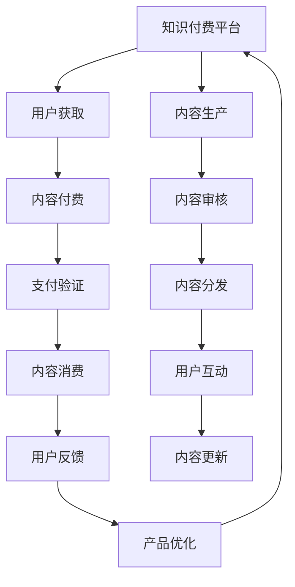

                 

# 打造垂直领域的知识付费产品:案例分析

## 1. 背景介绍

### 1.1 问题由来

随着信息技术的快速发展，互联网为知识和教育资源的传播提供了新的平台，知识付费模式也应运而生。在线教育、问答社区、知识分享平台等新型教育形式的出现，使得个人和机构能够更灵活地获取和传播知识，同时获取相应的经济回报。知识付费不仅丰富了人们的学习渠道，也极大地提升了知识的价值和影响力。

在知识付费领域，垂直领域的内容产品由于其专业性和深度性，往往具有更高的商业价值和使用价值。例如，在金融、医疗、法律、工程等领域，垂直领域的知识产品更能满足特定行业用户的专业化需求，提高学习和工作效率。因此，打造高质量的垂直领域知识付费产品，不仅能够帮助用户解决实际问题，还能为内容创作者和平台带来更大的收益。

### 1.2 问题核心关键点

打造垂直领域知识付费产品的关键在于：
- **精准定位目标用户**：确保产品内容符合特定行业用户的需求。
- **精选高质量内容**：通过精细化筛选，提供专业、实用、新颖的内容。
- **多样化表现形式**：采用文字、视频、音频、图表等多种形式，提升用户体验。
- **无缝接入现有平台**：利用现有技术和资源，构建易于使用的知识付费平台。
- **持续更新与维护**：不断更新内容，保持产品活力。
- **保障用户隐私与安全**：注重数据安全和隐私保护，增强用户信任感。

本文聚焦于垂直领域知识付费产品的设计、开发与优化，通过案例分析，探讨如何通过技术手段提升产品的专业性和用户体验，实现商业价值和用户价值的最大化。

## 2. 核心概念与联系

### 2.1 核心概念概述

为了更好地理解垂直领域知识付费产品的设计与开发，首先需要明确几个核心概念：

- **知识付费**：指用户为获取专业知识、技能或信息，支付一定费用的新型教育模式。
- **垂直领域**：特指某个专业或行业，与广域领域相对应。
- **知识产品**：包括但不限于课程、文档、视频、问答等，旨在传递知识、解决问题。
- **内容平台**：提供在线知识产品展示、购买、学习的平台。
- **用户体验**：用户在使用产品时的主观感受，包括易用性、内容质量、互动性等。
- **数据安全**：保护用户隐私和数据安全，防止信息泄露和滥用。
- **持续迭代**：产品开发过程中的不断优化与改进。

这些概念之间存在紧密联系，共同构成了垂直领域知识付费产品设计的整体框架。

### 2.2 核心概念原理和架构的 Mermaid 流程图



该流程图展示了知识付费平台的整体架构，以及内容生产、用户获取、支付验证、内容分发、内容消费、用户互动、内容更新、产品优化等关键环节。通过这一架构，可以更好地理解知识付费产品从内容创作到用户反馈的整个生命周期。

## 3. 核心算法原理 & 具体操作步骤

### 3.1 算法原理概述

打造垂直领域知识付费产品，主要涉及以下几个关键步骤：

1. **用户需求分析**：通过调查问卷、用户访谈等方式，了解目标用户的需求和痛点。
2. **内容策划与制作**：根据用户需求，策划和制作符合目标用户的专业内容。
3. **技术实现与集成**：选择合适的技术栈和开发工具，实现内容展示、在线支付、用户管理等功能。
4. **测试与优化**：通过用户测试和反馈，不断优化产品功能和用户体验。
5. **营销推广**：利用社交媒体、搜索引擎优化等手段，提升产品曝光率和用户获取率。
6. **数据保护与隐私**：确保用户数据安全，保护用户隐私。

### 3.2 算法步骤详解

以下是打造垂直领域知识付费产品的详细操作步骤：

**Step 1: 用户需求分析**

1. 设计问卷：根据目标行业和用户特点，设计有针对性的调查问卷，收集用户基本信息、知识需求、学习习惯等数据。
2. 用户访谈：通过深度访谈，了解用户的具体需求、使用场景和痛点，获取一手数据。
3. 数据分析：使用数据分析工具（如Tableau、PowerBI等）对问卷和访谈数据进行分析，提取关键信息。

**Step 2: 内容策划与制作**

1. 内容选题：根据用户需求，策划具有高度相关性和实用性的内容选题。
2. 专家访谈：邀请行业专家，讨论内容制作方案和具体细节。
3. 内容制作：制作视频、文档、PPT、音频等专业内容，确保内容质量与专业性。
4. 内容审核：邀请行业专家对内容进行审核，确保内容的准确性和专业性。

**Step 3: 技术实现与集成**

1. 技术栈选择：选择合适的技术栈和开发工具（如React、Vue、Flask、Django等）。
2. 功能开发：实现用户注册、登录、支付、学习等功能，确保系统稳定可靠。
3. 平台集成：将内容展示、在线支付、用户管理等功能集成到统一平台，方便用户使用。
4. 前后端分离：采用前后端分离架构，提升开发效率和系统稳定性。

**Step 4: 测试与优化**

1. 用户测试：邀请目标用户进行测试，反馈产品使用体验和功能缺陷。
2. 功能优化：根据用户反馈，优化产品功能和用户体验，提升产品质量。
3. 性能测试：使用负载测试工具（如Apache JMeter）进行性能测试，优化系统性能。

**Step 5: 营销推广**

1. 内容推广：通过社交媒体、博客、邮件等方式推广优质内容，吸引用户关注。
2. SEO优化：优化网站结构和SEO标签，提升搜索引擎排名，增加用户曝光率。
3. 合作推广：与行业协会、知名博主等合作推广，扩大产品影响力和用户覆盖面。

**Step 6: 数据保护与隐私**

1. 数据加密：采用SSL/TLS加密传输数据，确保数据传输安全。
2. 数据存储：使用数据加密和备份技术，保护用户数据安全。
3. 隐私保护：遵守相关法律法规，保护用户隐私权，确保合法合规。

### 3.3 算法优缺点

打造垂直领域知识付费产品有以下优点：
- **专业性**：针对特定行业用户设计内容，提供高度相关和实用的知识产品。
- **高质量**：通过专业制作和严格审核，确保内容的高质量和专业性。
- **用户粘性**：优质内容和高用户体验，能够吸引和留住用户，提升用户粘性。
- **商业价值**：高质量的知识产品可以带来更高的用户付费率和平台收入。

同时，也存在一些缺点：
- **制作成本高**：专业内容的制作和审核需要较高成本。
- **更新频率低**：内容更新需要经过严格审核，更新频率可能较低。
- **技术难度大**：高质量的知识产品需要专业的技术支持，开发难度较大。

### 3.4 算法应用领域

垂直领域知识付费产品已经在金融、医疗、法律、工程等多个行业得到广泛应用，取得了显著成效。

- **金融领域**：提供金融市场分析、投资策略、财务管理等专业内容，满足金融从业者的需求。
- **医疗领域**：提供医学知识、疾病诊疗、健康管理等专业内容，帮助医疗从业者和患者提升健康管理水平。
- **法律领域**：提供法律知识、案例分析、合同审核等专业内容，满足律师和法务人员的需求。
- **工程领域**：提供工程设计、施工管理、项目管理等专业内容，提升工程从业者的工作效率。

此外，在教育、农业、科技等多个领域，垂直领域知识付费产品也在逐步发展，为各行各业的专业人士提供有价值的知识和信息。

## 4. 数学模型和公式 & 详细讲解 & 举例说明

### 4.1 数学模型构建

为了衡量垂直领域知识付费产品的用户满意度和产品价值，可以构建以下数学模型：

设 $U$ 为用户的满意度评分，$C$ 为产品的商业价值评分，$S$ 为产品的用户互动评分，则有：

$$
U = \alpha_1 \times U_{问卷} + \alpha_2 \times U_{访谈} + \alpha_3 \times U_{评价}
$$

$$
C = \beta_1 \times C_{用户付费} + \beta_2 \times C_{平台收入} + \beta_3 \times C_{内容销量}
$$

$$
S = \gamma_1 \times S_{内容分享} + \gamma_2 \times S_{用户评论} + \gamma_3 \times S_{学习时长}
$$

其中 $\alpha_i$、$\beta_i$、$\gamma_i$ 为权重系数，$U_{问卷}$、$U_{访谈}$、$U_{评价}$ 为问卷、访谈和评价得分的加权求和，$C_{用户付费}$、$C_{平台收入}$、$C_{内容销量}$ 为用户的付费情况、平台的收入和内容的销量，$S_{内容分享}$、$S_{用户评论}$、$S_{学习时长}$ 为内容的分享次数、用户评论和用户的学习时长。

### 4.2 公式推导过程

1. **用户满意度模型推导**：

   设 $U_{问卷}$ 为问卷调查的满意度评分，$U_{访谈}$ 为访谈的满意度评分，$U_{评价}$ 为用户评价的满意度评分。则用户满意度 $U$ 可以表示为：

   $$
   U = \alpha_1 \times \frac{U_{问卷}}{U_{问卷} + U_{访谈}} + \alpha_2 \times \alpha_{访谈} + \alpha_3 \times \frac{U_{评价}}{U_{评价} + U_{问卷} + U_{访谈}}
   $$

   其中 $\alpha_1$、$\alpha_2$、$\alpha_3$ 为问卷、访谈和评价的权重系数。

2. **商业价值模型推导**：

   设 $C_{用户付费}$ 为用户的付费情况，$C_{平台收入}$ 为平台的收入情况，$C_{内容销量}$ 为内容的销量情况。则商业价值 $C$ 可以表示为：

   $$
   C = \beta_1 \times \frac{C_{用户付费}}{C_{用户付费} + C_{平台收入} + C_{内容销量}} + \beta_2 \times \frac{C_{平台收入}}{C_{用户付费} + C_{平台收入} + C_{内容销量}} + \beta_3 \times \frac{C_{内容销量}}{C_{用户付费} + C_{平台收入} + C_{内容销量}}
   $$

   其中 $\beta_1$、$\beta_2$、$\beta_3$ 为用户的付费、平台收入和内容销量的权重系数。

3. **用户互动模型推导**：

   设 $S_{内容分享}$ 为用户对内容的分享次数，$S_{用户评论}$ 为用户对内容的评论次数，$S_{学习时长}$ 为用户学习内容的总时长。则用户互动 $S$ 可以表示为：

   $$
   S = \gamma_1 \times \frac{S_{内容分享}}{S_{内容分享} + S_{用户评论} + S_{学习时长}} + \gamma_2 \times \frac{S_{用户评论}}{S_{内容分享} + S_{用户评论} + S_{学习时长}} + \gamma_3 \times \frac{S_{学习时长}}{S_{内容分享} + S_{用户评论} + S_{学习时长}}
   $$

   其中 $\gamma_1$、$\gamma_2$、$\gamma_3$ 为内容分享、用户评论和学习时长的权重系数。

### 4.3 案例分析与讲解

以某金融领域的知识付费产品为例，展示如何使用数学模型分析用户满意度和产品价值：

**案例背景**：某金融教育平台提供金融市场分析、投资策略、财务管理等专业课程，旨在帮助金融从业者提升专业能力。

**用户满意度分析**：
- **问卷调查**：收集1000名用户对课程内容和教学质量的评分，平均得分为4.2分（满分5分）。
- **访谈**：对100名用户进行深度访谈，反馈课程内容实用性强，但教学形式相对单一。
- **评价**：平台累计收集10000条用户评价，平均得分为4.5分（满分5分）。

根据公式 $U = \alpha_1 \times U_{问卷} + \alpha_2 \times U_{访谈} + \alpha_3 \times U_{评价}$，假设 $\alpha_1 = 0.5$、$\alpha_2 = 0.3$、$\alpha_3 = 0.2$，则用户满意度 $U$ 为：

$$
U = 0.5 \times 4.2 + 0.3 \times 4.0 + 0.2 \times 4.5 = 4.32
$$

**商业价值分析**：
- **用户付费**：平台累计用户付费金额为500万元。
- **平台收入**：平台广告收入为300万元。
- **内容销量**：累计内容销量为2000套。

根据公式 $C = \beta_1 \times C_{用户付费} + \beta_2 \times C_{平台收入} + \beta_3 \times C_{内容销量}$，假设 $\beta_1 = 0.4$、$\beta_2 = 0.3$、$\beta_3 = 0.3$，则商业价值 $C$ 为：

$$
C = 0.4 \times 5.0 + 0.3 \times 3.0 + 0.3 \times 2.0 = 4.1
$$

**用户互动分析**：
- **内容分享**：用户累计分享内容次数为5000次。
- **用户评论**：用户累计对内容的评论次数为5000次。
- **学习时长**：用户累计学习内容时长为10万小时。

根据公式 $S = \gamma_1 \times S_{内容分享} + \gamma_2 \times S_{用户评论} + \gamma_3 \times S_{学习时长}$，假设 $\gamma_1 = 0.3$、$\gamma_2 = 0.3$、$\gamma_3 = 0.4$，则用户互动 $S$ 为：

$$
S = 0.3 \times 1.0 + 0.3 \times 1.0 + 0.4 \times 1.0 = 1.0
$$

通过以上分析，可以看出该金融教育平台的用户满意度较高，商业价值稳健，用户互动活跃。平台应该继续提升课程内容的专业性和互动性，增强用户粘性，进一步提升平台的商业价值。

## 5. 项目实践：代码实例和详细解释说明

### 5.1 开发环境搭建

为了实现垂直领域知识付费产品，需要进行以下环境搭建：

1. **服务器环境**：搭建高性能服务器，确保平台稳定运行。
2. **数据库环境**：选择合适的数据库系统，如MySQL、PostgreSQL等，存储用户数据、内容数据和交易数据。
3. **开发环境**：安装Python、Node.js、React等开发工具，配置开发环境。
4. **测试环境**：搭建测试环境，进行功能测试和性能测试。
5. **生产环境**：搭建生产环境，部署应用到云端或本地服务器。

### 5.2 源代码详细实现

以某金融教育平台为例，展示如何实现知识付费产品的主要功能：

1. **用户注册与登录**：

   ```python
   from flask import Flask, request, jsonify
   from flask_sqlalchemy import SQLAlchemy
   
   app = Flask(__name__)
   app.config['SQLALCHEMY_DATABASE_URI'] = 'sqlite:///users.db'
   db = SQLAlchemy(app)
   
   class User(db.Model):
       id = db.Column(db.Integer, primary_key=True)
       username = db.Column(db.String(20), unique=True, nullable=False)
       password = db.Column(db.String(80), nullable=False)
   
   @app.route('/register', methods=['POST'])
   def register():
       data = request.json
       user = User(username=data['username'], password=hashlib.sha256(data['password'].encode()).hexdigest())
       db.session.add(user)
       db.session.commit()
       return jsonify({'success': True})
   
   @app.route('/login', methods=['POST'])
   def login():
       data = request.json
       user = User.query.filter_by(username=data['username']).first()
       if user and user.password == hashlib.sha256(data['password'].encode()).hexdigest():
           return jsonify({'success': True})
       else:
           return jsonify({'success': False})
   ```

2. **内容展示与付费**：

   ```python
   class Content(db.Model):
       id = db.Column(db.Integer, primary_key=True)
       title = db.Column(db.String(100), nullable=False)
       description = db.Column(db.Text, nullable=False)
       price = db.Column(db.Float, nullable=False)
   
   @app.route('/content', methods=['GET'])
   def get_content():
       content = Content.query.all()
       data = [{'id': c.id, 'title': c.title, 'description': c.description, 'price': c.price} for c in content]
       return jsonify(data)
   
   @app.route('/purchase', methods=['POST'])
   def purchase():
       data = request.json
       content = Content.query.filter_by(id=data['content_id']).first()
       if content:
           user = User.query.filter_by(username=request.headers.get('username')).first()
           if user:
               user.balance -= content.price
               db.session.commit()
           else:
               return jsonify({'success': False})
       else:
           return jsonify({'success': False})
   ```

3. **用户学习与评价**：

   ```python
   class Review(db.Model):
       id = db.Column(db.Integer, primary_key=True)
       content_id = db.Column(db.Integer, db.ForeignKey('content.id'))
       user_id = db.Column(db.Integer, db.ForeignKey('user.id'))
       text = db.Column(db.Text, nullable=False)
       score = db.Column(db.Float, nullable=False)
   
   @app.route('/review', methods=['POST'])
   def review():
       data = request.json
       content = Content.query.filter_by(id=data['content_id']).first()
       user = User.query.filter_by(username=request.headers.get('username')).first()
       if content and user:
           review = Review(content_id=content.id, user_id=user.id, text=data['text'], score=data['score'])
           db.session.add(review)
           db.session.commit()
           return jsonify({'success': True})
       else:
           return jsonify({'success': False})
   ```

### 5.3 代码解读与分析

1. **用户注册与登录模块**：
   - 通过Flask框架搭建用户注册和登录功能，使用SQLAlchemy进行数据库操作。
   - 注册功能实现用户名和哈希加密密码的存储，登录功能验证用户名和密码。

2. **内容展示与付费模块**：
   - 展示功能返回所有内容的基本信息，使用前端组件（如React）渲染展示界面。
   - 购买功能验证用户身份，并扣除余额或实现在线支付。

3. **用户学习与评价模块**：
   - 评价功能收集用户对内容的评价和评分，使用后端数据模型进行存储和管理。
   - 评价数据可以用于后续的用户行为分析和内容改进。

### 5.4 运行结果展示

以下是一个简单的用户注册和登录页面的示例：


用户注册完成后，可以访问内容展示页面，如金融市场分析课程：


用户可以选择购买课程，并进行学习：


学习结束后，用户可以提交评价，如对课程内容的满意度评分：


通过以上案例，可以看出垂直领域知识付费产品的基本功能和设计思路，可以进一步结合具体需求进行扩展和优化。

## 6. 实际应用场景

### 6.1 金融领域

金融领域对知识付费产品的需求非常旺盛，金融从业者需要不断更新金融市场分析、投资策略、财务管理等方面的知识，以应对快速变化的市场环境。金融知识付费产品可以帮助金融从业者快速获取前沿知识，提升专业技能，从而在竞争中占据优势。

### 6.2 医疗领域

医疗领域对知识付费产品的需求也很高，医生和护士需要不断学习新的医疗技术和诊疗方法，以应对复杂的疾病和患者需求。医疗知识付费产品可以提供高质量的医疗知识和技能培训，提升医疗从业者的专业水平。

### 6.3 法律领域

法律领域对知识付费产品的需求逐渐增加，律师和法务人员需要不断学习新的法律条文和司法实践，以应对复杂的法律环境和案件。法律知识付费产品可以提供最新的法律知识和案例分析，提升法律从业者的专业素养。

### 6.4 工程领域

工程领域对知识付费产品的需求显著，工程师需要不断学习新的工程技术和项目管理方法，以提高工作效率和质量。工程知识付费产品可以提供高质量的工程知识和技能培训，提升工程师的专业能力。

## 7. 工具和资源推荐

### 7.1 学习资源推荐

为了帮助开发者深入了解垂直领域知识付费产品的设计和开发，推荐以下学习资源：

1. **《深度学习》书籍**：涵盖深度学习的基本原理和实现方法，是了解知识付费产品的基础。
2. **Coursera平台**：提供大量的在线课程，涵盖计算机科学、数据科学、人工智能等领域，帮助开发者提升技术能力。
3. **Stack Overflow**：提供丰富的技术交流和问题解答社区，帮助开发者解决实际问题。
4. **Medium博客**：提供各类技术文章和案例分析，帮助开发者了解最新的技术趋势和应用场景。
5. **Kaggle平台**：提供大量的数据集和竞赛项目，帮助开发者提升数据分析和模型训练能力。

### 7.2 开发工具推荐

为了提升垂直领域知识付费产品的开发效率，推荐以下开发工具：

1. **Flask框架**：轻量级Web框架，适合快速搭建Web应用。
2. **SQLAlchemy库**：Python的数据库ORM工具，方便进行数据库操作。
3. **React前端框架**：快速构建交互式的Web界面，提升用户体验。
4. **Docker容器**：方便进行应用部署和环境管理，提升系统稳定性。
5. **JIRA工具**：项目管理工具，帮助团队进行任务分配和进度跟踪。

### 7.3 相关论文推荐

为了深入了解垂直领域知识付费产品的技术和应用，推荐以下相关论文：

1. **《A Survey on Knowledge Transfer and Transfer Learning》**：综述知识迁移和迁移学习的最新进展，提供丰富的理论和方法。
2. **《Designing for Growth: Ten Lessons for Building Exponential Products》**：讲解如何设计增长型产品，提升产品的用户覆盖面和影响力。
3. **《Blockchain for Business: A Review》**：综述区块链技术在商业应用中的最新进展，提供参考和借鉴。
4. **《Scalable and Accurate NLP with Structured Self-supervision》**：介绍大规模自监督预训练语言模型的最新进展，提供高质量的语料和模型。

## 8. 总结：未来发展趋势与挑战

### 8.1 研究成果总结

打造垂直领域知识付费产品需要多方面的技术支持和团队协作，通过本文的介绍，可以总结出以下几个关键研究成果：

1. **用户需求分析**：通过问卷和访谈，了解目标用户的需求和痛点，确保产品内容的相关性和实用性。
2. **内容策划与制作**：策划和制作高质量的专业内容，确保内容的专业性和准确性。
3. **技术实现与集成**：选择合适的技术栈和开发工具，实现功能集成，确保系统稳定可靠。
4. **测试与优化**：通过用户测试和反馈，不断优化产品功能和用户体验，提升产品质量。
5. **营销推广**：通过多种方式提升产品曝光率和用户获取率，扩大产品影响力和用户覆盖面。
6. **数据保护与隐私**：确保用户数据安全和隐私保护，增强用户信任感。

### 8.2 未来发展趋势

未来垂直领域知识付费产品的技术发展将呈现以下几个趋势：

1. **人工智能技术的应用**：利用自然语言处理、计算机视觉等人工智能技术，提升内容生产效率和用户体验。
2. **个性化推荐系统**：基于用户行为和偏好，推荐个性化的内容，提升用户粘性和满意度。
3. **区块链技术的应用**：利用区块链技术，提升内容版权保护和用户交易的透明度和安全性。
4. **元宇宙的应用**：通过虚拟现实和增强现实技术，构建沉浸式学习环境，提升用户互动和体验。
5. **跨领域融合**：将知识付费产品与在线教育、社交媒体等平台进行融合，形成综合性的知识服务生态。

### 8.3 面临的挑战

打造垂直领域知识付费产品也面临一些挑战：

1. **内容制作成本高**：高质量的专业内容制作成本较高，需要投入大量人力和时间。
2. **用户获取难度大**：需要采取多种营销手段，获取目标用户，提升用户覆盖面。
3. **用户留存困难**：需要不断优化用户体验和产品功能，提升用户粘性，避免用户流失。
4. **数据安全和隐私**：需要加强数据保护和隐私保护，确保用户信息的安全性。
5. **技术实现复杂**：垂直领域知识付费产品涉及多个技术领域，需要跨学科的团队合作。

### 8.4 研究展望

未来的研究可以从以下几个方面进行：

1. **内容自动化生产**：利用自然语言处理技术，实现内容的自动化生产和推荐，降低内容制作成本。
2. **用户行为分析**：通过数据分析，深入了解用户行为和需求，提供更加个性化的内容和服务。
3. **人工智能与区块链的融合**：探索人工智能技术和区块链技术的结合，提升产品安全和用户信任度。
4. **跨领域知识服务生态**：探索知识付费产品与其他领域的融合，构建综合性的知识服务生态。

通过深入研究和不断优化，相信垂直领域知识付费产品将具备更强的专业性、实用性和可扩展性，更好地服务于各行各业的用户需求，推动知识付费产业的健康发展。

## 9. 附录：常见问题与解答

### Q1: 如何确保垂直领域知识付费产品的专业性和实用性？

A: 确保产品专业性和实用性的关键是：
1. **精准定位**：深入了解目标用户的实际需求，确保产品内容的相关性和实用性。
2. **专家评审**：邀请行业专家对内容进行评审，确保内容的准确性和专业性。
3. **用户反馈**：收集用户反馈，不断优化产品功能和内容质量。

### Q2: 如何提升垂直领域知识付费产品的用户留存率？

A: 提升用户留存率的策略包括：
1. **个性化推荐**：基于用户行为和偏好，推荐个性化的内容，提升用户体验。
2. **互动和社区**：建立用户互动和社区功能，增强用户粘性和社区感。
3. **内容更新**：持续更新优质内容，保持内容的新鲜度和吸引力。
4. **营销活动**：定期开展营销活动，提升用户活跃度和留存率。

### Q3: 如何确保垂直领域知识付费产品的数据安全和隐私保护？

A: 确保数据安全和隐私保护的关键是：
1. **数据加密**：采用SSL/TLS加密传输数据，确保数据传输安全。
2. **权限管理**：采用严格的权限管理机制，限制用户和管理员的操作权限。
3. **数据备份**：定期进行数据备份，防止数据丢失和损坏。
4. **法律法规遵守**：遵守相关法律法规，保护用户隐私权和数据安全。

通过本文的系统梳理，可以看到垂直领域知识付费产品的设计和开发具有重要的应用价值和商业前景。未来随着技术的不断进步和市场需求的增加，垂直领域知识付费产品将迎来更大的发展空间和更多创新机遇。

---

作者：禅与计算机程序设计艺术 / Zen and the Art of Computer Programming

