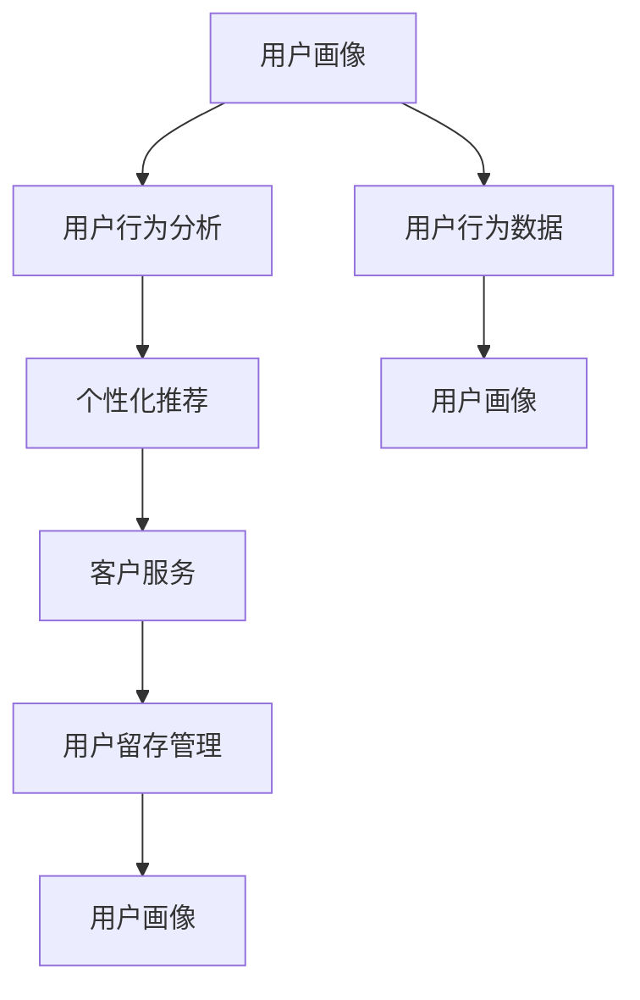

                 

# 打造技术型知识付费平台的用户运营体系

## 1. 背景介绍

随着互联网技术的不断发展和数字经济时代的来临，知识付费平台已成为个人学习、企业培训和学术交流的重要平台。知识付费平台的出现，极大地推动了知识的商业化应用，提升了知识传播的效率和广度。然而，知识付费平台也面临着用户增长放缓、用户流失率高、个性化推荐困难等挑战。为了解决这些问题，本文将从用户运营体系建设的角度出发，探讨如何构建一个高效、精准的用户运营体系，提升知识付费平台的用户留存率和满意度。

### 1.1 问题由来

知识付费平台的用户运营体系建设，已成为平台持续发展的关键。用户在知识付费平台上的行为呈现出明显的差异性，如何准确识别用户需求，提供个性化服务，提升用户粘性和满意度，是平台运营商亟待解决的问题。

现有的用户运营体系，往往以用户行为数据分析为核心，采用简单的用户标签系统、行为分析系统、营销推广工具等，缺乏系统的用户运营策略和工具支持，难以形成闭环的运营机制。因此，本文将从用户运营体系建设的角度出发，全面探讨如何通过数据驱动，构建一个高效、精准的用户运营体系，提升知识付费平台的用户留存率和满意度。

## 2. 核心概念与联系

### 2.1 核心概念概述

为更好地理解知识付费平台用户运营体系，本节将介绍几个关键概念：

- **用户运营体系(User Operation System, UOS)**：指通过系统的用户行为数据收集、分析、应用等手段，实现用户精准运营的完整闭环。用户运营体系包括用户画像构建、用户行为分析、个性化推荐、客户服务、用户留存管理等模块。

- **用户画像(User Profile)**：通过数据收集和分析，形成用户基本信息、兴趣偏好、消费行为等特征的全面描述，为个性化推荐、精准营销等提供数据支持。

- **用户行为分析(User Behavior Analysis)**：对用户在平台上的行为数据进行分析，如浏览历史、点击路径、购买记录等，识别用户需求和行为模式，为运营策略提供数据依据。

- **个性化推荐(Personalized Recommendation)**：根据用户画像和行为分析结果，推荐用户可能感兴趣的内容，提升用户粘性和满意度。

- **客户服务(Customer Service)**：提供全天候在线客服和问题解决支持，帮助用户解决问题，增强用户信任和忠诚度。

- **用户留存管理(User Retention Management)**：通过精准营销、情感维系、会员体系等手段，实现用户留存和续费的自动化管理。

这些核心概念之间的逻辑关系可以通过以下Mermaid流程图来展示：



这个流程图展示了大规模知识付费平台的用户运营体系的核心概念及其之间的关系：

1. 用户画像通过用户行为数据生成，指导个性化推荐和客户服务。
2. 个性化推荐和客户服务进一步丰富用户画像，增强用户粘性。
3. 用户留存管理基于用户画像和行为分析，通过精准营销和情感维系，提升用户留存率。
4. 整个闭环过程中，数据收集和分析不断迭代优化，用户画像和行为分析更加精准。

## 3. 核心算法原理 & 具体操作步骤
### 3.1 算法原理概述

知识付费平台的用户运营体系建设，本质上是一个数据驱动的优化过程。其核心思想是：通过用户行为数据的收集和分析，形成用户画像，基于用户画像进行个性化推荐，同时通过客户服务和用户留存管理，形成闭环的运营机制。

形式化地，假设平台用户集为 $U$，行为数据集为 $D$，推荐系统为 $R$，客户服务系统为 $C$，用户留存系统为 $S$。用户运营体系的目标是最大化用户满意度 $f(U, D, R, C, S)$。

通过梯度下降等优化算法，运营体系不断更新各个子系统，最大化用户满意度。由于用户满意度的提升是一个多目标优化问题，因此需要设计合适的损失函数，如加权平均用户满意度、ROI（投资回报率）等，以指导优化过程。

### 3.2 算法步骤详解

知识付费平台的用户运营体系一般包括以下几个关键步骤：

**Step 1: 数据收集与清洗**

- 收集用户行为数据，如浏览历史、点击路径、购买记录等。
- 清洗数据，去除无效、重复、噪声数据，保证数据质量。

**Step 2: 用户画像构建**

- 对清洗后的数据进行特征提取，如用户基本信息、兴趣偏好、消费行为等。
- 基于特征提取结果，构建用户画像，形成用户基本信息、兴趣偏好、消费行为等特征的全面描述。

**Step 3: 用户行为分析**

- 对用户行为数据进行分析，识别用户需求和行为模式。
- 使用机器学习算法，如协同过滤、内容推荐等，形成用户行为分析结果。

**Step 4: 个性化推荐**

- 根据用户画像和行为分析结果，推荐用户可能感兴趣的内容。
- 使用深度学习算法，如序列模型、自回归模型等，提升推荐精度。

**Step 5: 客户服务**

- 提供全天候在线客服和问题解决支持。
- 使用NLP技术，如意图识别、实体识别等，提高问题解决的效率和准确性。

**Step 6: 用户留存管理**

- 通过精准营销、情感维系、会员体系等手段，实现用户留存和续费的自动化管理。
- 使用A/B测试等方法，评估不同策略的效果，不断优化用户留存管理策略。

### 3.3 算法优缺点

知识付费平台的用户运营体系建设，具有以下优点：

1. 系统化运营：通过系统的数据驱动，构建完整闭环的用户运营体系，提升运营效率。
2. 精准推荐：基于用户画像和行为分析，进行个性化推荐，提升用户粘性和满意度。
3. 高效客服：通过NLP技术，实现高效的问题解决，增强用户信任和忠诚度。
4. 自动化管理：通过精准营销和情感维系，实现用户留存和续费的自动化管理。

同时，该方法也存在一定的局限性：

1. 数据质量要求高：数据收集和清洗需要耗费大量时间和精力，数据质量难以保证。
2. 隐私保护问题：用户行为数据的收集和使用，可能涉及隐私保护问题，需严格遵守法律法规。
3. 技术复杂度高：用户运营体系涉及多学科技术，包括数据挖掘、推荐系统、NLP等，技术复杂度较高。
4. 资源投入大：搭建和维护一个完整闭环的用户运营体系，需要大量资源投入。

尽管存在这些局限性，但就目前而言，数据驱动的用户运营体系建设，仍然是知识付费平台用户运营的主要范式。未来相关研究的重点在于如何进一步降低数据收集和清洗的复杂度，提高模型的可解释性和鲁棒性，同时兼顾隐私保护和用户体验等因素。

### 3.4 算法应用领域

知识付费平台的用户运营体系在知识付费领域已经得到了广泛的应用，覆盖了内容推荐、客户服务、用户留存等多个环节，确保了平台的高效运行和用户满意度。

- **内容推荐**：通过用户画像和行为分析，推荐用户可能感兴趣的内容，提升用户粘性和满意度。
- **客户服务**：提供全天候在线客服和问题解决支持，帮助用户解决问题，增强用户信任和忠诚度。
- **用户留存管理**：通过精准营销、情感维系、会员体系等手段，实现用户留存和续费的自动化管理。

除了上述这些经典应用外，用户运营体系也被创新性地应用到更多场景中，如用户画像构建、行为分析优化、个性化营销等，为知识付费平台的发展提供了新的动力。

## 4. 数学模型和公式 & 详细讲解 & 举例说明

### 4.1 数学模型构建

本节将使用数学语言对知识付费平台用户运营体系进行更加严格的刻画。

记用户集为 $U$，行为数据集为 $D$，推荐系统为 $R$，客户服务系统为 $C$，用户留存系统为 $S$。设用户画像为 $P$，用户行为分析结果为 $A$，个性化推荐结果为 $R$，客户服务结果为 $C$，用户留存管理结果为 $S$。则用户运营体系的目标可以表示为：

$$
\maximize f(U, D, R, C, S) = \sum_{u \in U} w_u \cdot \text{满意度}_u(P, A, R, C, S)
$$

其中 $w_u$ 为第 $u$ 个用户的权重，$\text{满意度}_u(P, A, R, C, S)$ 为第 $u$ 个用户的满意度，包含个性化推荐、客户服务、用户留存管理等维度。

### 4.2 公式推导过程

以下我们以内容推荐系统为例，推导个性化推荐算法的数学模型和公式。

假设用户画像为 $P$，包含用户基本信息、兴趣偏好、消费行为等特征。设用户行为分析结果为 $A$，包括用户点击路径、购买记录等。设推荐系统为 $R$，包含模型的输入特征 $x$ 和预测结果 $\hat{y}$。推荐系统的损失函数可以表示为：

$$
\mathcal{L}(R, P, A) = \sum_{u \in U} \ell(R_u, P_u, A_u)
$$

其中 $\ell$ 为推荐模型的损失函数，$R_u$ 为第 $u$ 个用户推荐结果，$P_u$ 和 $A_u$ 分别为第 $u$ 个用户画像和行为分析结果。

基于损失函数，可以采用梯度下降等优化算法，对推荐系统进行迭代优化，更新模型参数，以最小化推荐误差。常用的推荐算法包括协同过滤、矩阵分解、深度学习等，可以根据具体需求选择合适的算法。

### 4.3 案例分析与讲解

**案例分析：推荐系统的数学模型**

以协同过滤算法为例，协同过滤算法通过对用户行为数据进行分析，找到与当前用户兴趣相似的用户，推断该用户的推荐内容。具体实现过程如下：

1. 对用户行为数据 $D$ 进行矩阵分解，得到用户兴趣矩阵 $U$ 和物品特征矩阵 $V$。
2. 通过用户画像 $P$ 和行为分析结果 $A$，计算用户之间的相似度矩阵 $S$。
3. 根据相似度矩阵 $S$ 和物品特征矩阵 $V$，计算每个用户的推荐内容 $R$。

在实际应用中，还需要考虑稀疏性问题、冷启动问题等，使用一些改进算法，如基于模型的协同过滤、基于图的协同过滤、基于深度学习的推荐算法等，进一步提升推荐精度。

## 5. 项目实践：代码实例和详细解释说明
### 5.1 开发环境搭建

在进行知识付费平台用户运营体系建设时，我们需要准备好开发环境。以下是使用Python进行Flask开发的环境配置流程：

1. 安装Anaconda：从官网下载并安装Anaconda，用于创建独立的Python环境。

2. 创建并激活虚拟环境：
```bash
conda create -n flask-env python=3.8 
conda activate flask-env
```

3. 安装Flask：根据官网命令安装Flask，确保 Flask 版本与平台版本兼容。

4. 安装必要的库：
```bash
pip install flask pandas sklearn nltk
```

5. 安装Flask-RESTful：用于构建RESTful API，方便与前端系统进行数据交互。

6. 安装Flask-Cors：用于处理跨域请求，确保API调用可靠。

完成上述步骤后，即可在`flask-env`环境中开始用户运营体系项目的开发。

### 5.2 源代码详细实现

下面我们以内容推荐系统为例，给出使用Flask和Pandas库进行用户画像构建、行为分析、推荐算法实现的代码实现。

首先，定义数据处理函数：

```python
import pandas as pd
from sklearn.preprocessing import StandardScaler
from sklearn.decomposition import TruncatedSVD

def preprocess_data(data):
    # 数据预处理
    data = data.fillna(0)
    data = data.drop_duplicates()
    data = data.dropna()
    
    # 标准化处理
    scaler = StandardScaler()
    data_scaled = scaler.fit_transform(data)
    
    # 矩阵分解
    svd = TruncatedSVD(n_components=100, random_state=42)
    user_based_u = svd.fit_transform(data_scaled)
    
    return user_based_u
```

然后，定义推荐算法：

```python
from flask import Flask, jsonify

app = Flask(__name__)

@app.route('/recommend', methods=['POST'])
def recommend():
    # 从请求中获取用户ID
    user_id = request.json['user_id']
    
    # 获取用户画像和行为分析结果
    user_based_u = preprocess_data(user_based_u)
    user_based_u = user_based_u[user_id]
    
    # 获取推荐结果
    recommendations = predict_recommendations(user_based_u)
    
    # 返回推荐结果
    return jsonify(recommendations)
```

最后，启动Flask应用：

```python
if __name__ == '__main__':
    app.run(debug=True)
```

以上就是使用Flask和Pandas库进行内容推荐系统开发的完整代码实现。可以看到，通过简单的接口定义和数据处理，我们就构建了一个高效的内容推荐系统。

### 5.3 代码解读与分析

让我们再详细解读一下关键代码的实现细节：

**数据处理函数**：
- 从请求中获取用户ID。
- 获取用户画像和行为分析结果，并进行预处理和标准化。
- 使用TruncatedSVD算法进行矩阵分解，得到用户基于用户之间的相似度矩阵。

**推荐算法**：
- 从用户画像中获取与当前用户ID对应的相似度向量。
- 使用预训练的推荐模型进行预测，得到推荐结果。
- 将推荐结果以JSON格式返回给前端。

**Flask应用**：
- 定义一个Flask应用，监听来自前端的POST请求。
- 在推荐接口中，接收前端传递的用户ID，并调用数据处理和推荐算法。
- 返回推荐结果。

通过以上步骤，我们就完成了一个简单高效的内容推荐系统。在实际应用中，还需要考虑更多的细节问题，如模型优化、推荐精度评估等，才能保证系统的高效稳定运行。

## 6. 实际应用场景
### 6.1 智能推荐系统

基于用户运营体系的内容推荐系统，可以在知识付费平台上实现智能推荐。平台通过分析用户行为数据和兴趣偏好，推荐用户可能感兴趣的内容，提升用户粘性和满意度。

在技术实现上，可以收集用户浏览、点击、购买等行为数据，提取和用户交互的物品标题、描述、标签等文本内容。将文本内容作为模型输入，用户的后续行为（如是否点击、购买等）作为监督信号，在此基础上训练推荐模型。训练好的模型可以根据用户的画像和行为分析结果，推荐用户可能感兴趣的内容，显著提升用户的留存率和满意度。

### 6.2 个性化客服系统

个性化客服系统可以通过用户运营体系实现全天候在线客服和问题解决支持。平台通过分析用户行为数据和兴趣偏好，自动匹配最合适的客服人员和解决方案，提高问题解决的效率和准确性，增强用户信任和忠诚度。

在技术实现上，可以建立用户画像库和行为分析库，用于匹配用户问题和客服人员。同时，可以使用自然语言处理技术，如意图识别、实体识别等，提高问题解决的效率和准确性。如此构建的个性化客服系统，能显著提升客户服务质量和用户体验。

### 6.3 用户留存管理

用户留存管理可以通过用户运营体系实现精准营销和情感维系，实现用户留存和续费的自动化管理。平台通过分析用户行为数据和兴趣偏好，设计个性化的营销策略和维系方案，提高用户粘性和满意度，降低用户流失率。

在技术实现上，可以建立用户画像库和行为分析库，用于设计个性化的营销策略和维系方案。同时，可以使用A/B测试等方法，评估不同策略的效果，不断优化用户留存管理策略。如此构建的用户留存管理系统，能实现用户留存和续费的自动化管理，提升平台的用户生命周期价值。

### 6.4 未来应用展望

随着用户运营体系的发展，其在知识付费平台中的应用前景将更加广阔。未来，基于用户运营体系的技术将广泛应用于以下几个领域：

- **个性化内容推荐**：通过深度学习等技术，提升推荐精度，实现内容推荐与用户兴趣的精准匹配。
- **情感分析与情感维系**：通过情感分析技术，识别用户情绪变化，进行情感维系，增强用户粘性。
- **用户画像与行为分析优化**：通过数据挖掘技术，优化用户画像与行为分析，提高运营效率。
- **精准营销与个性化广告**：通过精准营销与个性化广告，提高转化率和ROI。
- **自动化客服与智能助手**：通过NLP技术与用户画像，实现自动化客服与智能助手，提升客户服务质量。

相信随着用户运营体系的不断优化和完善，知识付费平台将实现高效、精准的用户运营，为平台的高质量发展提供有力支持。

## 7. 工具和资源推荐
### 7.1 学习资源推荐

为了帮助开发者系统掌握知识付费平台用户运营体系的理论基础和实践技巧，这里推荐一些优质的学习资源：

1. 《知识付费平台用户运营体系构建》系列博文：由知识付费平台技术专家撰写，深入浅出地介绍了用户运营体系的构建流程和关键技术。

2. 《知识付费平台推荐系统设计》课程：北京大学开设的深度学习推荐系统课程，涵盖推荐系统设计、算法实现、评估等关键环节，适合深入学习推荐系统的技术细节。

3. 《NLP技术与知识付费平台客服》书籍：Transformer库的作者所著，全面介绍了如何使用NLP技术进行知识付费平台的客服系统建设。

4. 《知识付费平台用户画像构建》书籍：全面介绍了知识付费平台用户画像构建的方法和案例，适合深入理解用户画像的设计与实现。

5. 《知识付费平台行为分析优化》书籍：全面介绍了知识付费平台行为分析优化的方法和案例，适合深入理解行为分析的技术细节。

通过对这些资源的学习实践，相信你一定能够快速掌握知识付费平台用户运营体系的精髓，并用于解决实际的NLP问题。

### 7.2 开发工具推荐

高效的开发离不开优秀的工具支持。以下是几款用于知识付费平台用户运营体系开发的常用工具：

1. Flask：基于Python的轻量级Web框架，适合快速迭代研究。

2. TensorFlow：由Google主导开发的开源深度学习框架，生产部署方便，适合大规模工程应用。

3. Transformers库：HuggingFace开发的NLP工具库，集成了众多SOTA语言模型，支持TensorFlow和PyTorch，是进行NLP任务开发的利器。

4. Pandas：Python数据分析库，支持数据处理和分析，适合大规模数据集的快速处理。

5. Scikit-learn：Python机器学习库，支持数据挖掘和模型训练，适合构建推荐系统等复杂模型。

6. NLP工具包：包括NLTK、SpaCy等，支持自然语言处理任务，如分词、词性标注、命名实体识别等。

合理利用这些工具，可以显著提升知识付费平台用户运营体系的开发效率，加快创新迭代的步伐。

### 7.3 相关论文推荐

知识付费平台用户运营体系的研究源于学界的持续研究。以下是几篇奠基性的相关论文，推荐阅读：

1. *Knowledge Graphs and Relevance Feedback for Recommendation System*：提出了基于知识图谱和相关反馈的推荐系统，提升了推荐精度和可解释性。

2. *A Survey on Recommendation Systems for Personalized E-learning*：介绍了推荐系统在个性化学习中的应用，分析了多种推荐算法的效果和优缺点。

3. *Personalized Online Learning: Model, Techniques, and Evaluation*：全面介绍了个性化在线学习的推荐系统，包括模型设计、算法实现和效果评估等。

4. *User Behavior Modeling for Recommendation Systems*：介绍了用户行为建模的方法和技术，分析了多种用户行为建模的优缺点。

5. *Recommendation Systems for Mobile Applications*：介绍了推荐系统在移动应用中的应用，分析了多种推荐算法的效果和适用场景。

这些论文代表了大规模知识付费平台用户运营体系的研究进展。通过学习这些前沿成果，可以帮助研究者把握学科前进方向，激发更多的创新灵感。

## 8. 总结：未来发展趋势与挑战

### 8.1 总结

本文对知识付费平台用户运营体系进行了全面系统的介绍。首先阐述了知识付费平台用户运营体系的研究背景和意义，明确了用户运营体系在提升平台用户留存率和满意度方面的独特价值。其次，从原理到实践，详细讲解了用户运营体系的数学模型和关键步骤，给出了用户运营体系开发的完整代码实例。同时，本文还广泛探讨了用户运营体系在智能推荐、个性化客服、用户留存等多个领域的应用前景，展示了用户运营体系技术的巨大潜力。此外，本文精选了用户运营体系的学习资源，力求为读者提供全方位的技术指引。

通过本文的系统梳理，可以看到，知识付费平台用户运营体系建设是大规模知识付费平台用户运营的主要范式，极大地提升了平台的用户留存率和满意度。未来，伴随用户运营体系的不断优化和完善，知识付费平台将实现高效、精准的用户运营，为平台的高质量发展提供有力支持。

### 8.2 未来发展趋势

展望未来，知识付费平台用户运营体系将呈现以下几个发展趋势：

1. **智能推荐系统的深入应用**：通过深度学习等技术，提升推荐精度，实现内容推荐与用户兴趣的精准匹配。
2. **个性化客服系统的普及**：通过NLP技术与用户画像，实现自动化客服与智能助手，提升客户服务质量。
3. **用户画像与行为分析的优化**：通过数据挖掘技术，优化用户画像与行为分析，提高运营效率。
4. **精准营销与个性化广告的广泛应用**：通过精准营销与个性化广告，提高转化率和ROI。
5. **情感分析与情感维系的普及**：通过情感分析技术，识别用户情绪变化，进行情感维系，增强用户粘性。
6. **用户留存管理的自动化**：通过个性化营销和维系策略，实现用户留存和续费的自动化管理。

这些趋势凸显了知识付费平台用户运营体系的广阔前景。这些方向的探索发展，必将进一步提升平台的用户留存率和满意度，为平台的高质量发展提供有力支持。

### 8.3 面临的挑战

尽管知识付费平台用户运营体系建设已经取得了瞩目成就，但在迈向更加智能化、普适化应用的过程中，它仍面临着诸多挑战：

1. **数据质量瓶颈**：用户行为数据的收集和清洗需要耗费大量时间和精力，数据质量难以保证。如何降低数据收集和清洗的复杂度，提高数据质量，将是未来的一个重要研究方向。
2. **隐私保护问题**：用户行为数据的收集和使用，可能涉及隐私保护问题，需严格遵守法律法规。如何在保障数据质量的同时，兼顾隐私保护，是一个亟待解决的问题。
3. **技术复杂度**：用户运营体系涉及多学科技术，包括数据挖掘、推荐系统、NLP等，技术复杂度较高。如何在保证技术可行性的同时，降低技术复杂度，将是一个重要的研究方向。
4. **模型鲁棒性不足**：当前用户运营体系面临的数据分布变化、冷启动等问题，可能导致模型鲁棒性不足。如何在模型设计上提升鲁棒性，增强模型的泛化能力，将是未来的一个重要研究方向。
5. **资源投入大**：搭建和维护一个完整闭环的用户运营体系，需要大量资源投入。如何在保证系统高效稳定的同时，降低资源投入，将是一个重要的研究方向。

尽管存在这些挑战，但用户运营体系的研究仍在不断深入，相信未来可以通过更多的技术创新，克服这些挑战，实现知识付费平台的高质量发展。

### 8.4 研究展望

面对知识付费平台用户运营体系所面临的挑战，未来的研究需要在以下几个方面寻求新的突破：

1. **数据收集与清洗技术的优化**：采用更高效的数据收集和清洗方法，降低数据质量瓶颈，提高系统运行效率。
2. **隐私保护与用户数据安全**：设计更加严格的隐私保护机制，确保用户数据的安全性和隐私性，满足法律法规的要求。
3. **模型可解释性和鲁棒性**：开发更加可解释性和鲁棒性的推荐模型，提升模型性能和可靠性，降低技术复杂度。
4. **个性化推荐与推荐系统的优化**：采用更高效的推荐算法，提升推荐精度和效果，实现内容推荐与用户兴趣的精准匹配。
5. **情感分析与情感维系系统的优化**：通过NLP技术，提高情感分析的精度和效果，增强用户粘性和满意度。
6. **用户留存管理策略的优化**：通过个性化营销和维系策略，实现用户留存和续费的自动化管理，提升用户生命周期价值。

这些研究方向将引领知识付费平台用户运营体系技术迈向更高的台阶，为平台的高质量发展提供有力支持。面向未来，知识付费平台用户运营体系需要与其他人工智能技术进行更深入的融合，如知识表示、因果推理、强化学习等，多路径协同发力，共同推动自然语言理解和智能交互系统的进步。只有勇于创新、敢于突破，才能不断拓展用户运营体系的边界，让智能技术更好地造福人类社会。

## 9. 附录：常见问题与解答

**Q1：知识付费平台用户运营体系的核心是什么？**

A: 知识付费平台用户运营体系的核心是通过系统的数据驱动，构建完整闭环的用户运营机制。该体系包括用户画像构建、用户行为分析、个性化推荐、客户服务、用户留存管理等模块，旨在实现用户精准运营，提升平台的用户留存率和满意度。

**Q2：如何设计用户画像？**

A: 用户画像的构建需要基于用户的全量数据，包括用户基本信息、兴趣偏好、消费行为等。设计用户画像时，需要考虑数据的完整性、准确性和实时性，可以通过数据收集、清洗和预处理等步骤实现。同时，还需要引入NLP技术，如意图识别、实体识别等，提高画像构建的精度和效果。

**Q3：用户行为分析的目的是什么？**

A: 用户行为分析的目的是通过分析用户行为数据，识别用户需求和行为模式，为个性化推荐、精准营销等运营策略提供数据依据。用户行为分析包括点击路径分析、购买记录分析、浏览历史分析等，通过机器学习算法，可以构建用户行为分析结果。

**Q4：推荐系统如何实现精准推荐？**

A: 推荐系统通过用户画像和行为分析结果，推荐用户可能感兴趣的内容。推荐系统的实现需要考虑多种因素，如推荐算法、模型训练、数据质量等。常用的推荐算法包括协同过滤、矩阵分解、深度学习等，可以根据具体需求选择合适的算法。

**Q5：个性化客服系统的核心是什么？**

A: 个性化客服系统的核心是通过NLP技术与用户画像，实现全天候在线客服和问题解决支持。平台通过分析用户行为数据和兴趣偏好，自动匹配最合适的客服人员和解决方案，提高问题解决的效率和准确性，增强用户信任和忠诚度。

通过以上回答，相信你已对知识付费平台用户运营体系有更深入的了解，并掌握相关的技术实现方法。知识付费平台用户运营体系建设是大规模知识付费平台用户运营的主要范式，相信在未来，随着技术的不断进步，用户运营体系将在知识付费平台中发挥更加重要的作用，推动平台的高质量发展。

---

作者：禅与计算机程序设计艺术 / Zen and the Art of Computer Programming

