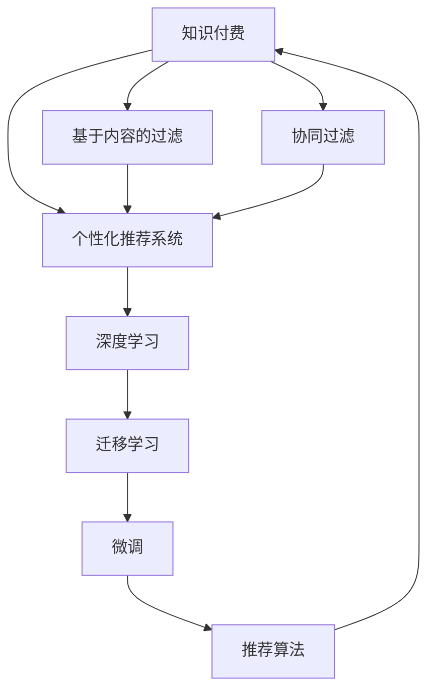

                 

# 打造知识付费垂直领域的独特优势

## 1. 背景介绍

在知识经济的时代，知识付费作为一种新兴的商业模式，正在迅速崛起。无论是传统出版、教育培训，还是新兴的在线内容平台，都试图通过付费模式获得更高的收益和用户粘性。然而，知识付费市场依然竞争激烈，用户需求日益多样化，如何在众多平台中脱颖而出，成为许多企业和从业者需要思考的问题。本文将从技术角度探讨如何通过打造知识付费垂直领域的独特优势，提升市场竞争力。

## 2. 核心概念与联系

### 2.1 核心概念概述

- **知识付费（Knowledge Paywall）**：用户通过支付一定费用获取知识服务，包括在线课程、电子书、专家咨询等。
- **个性化推荐系统（Personalized Recommendation System）**：通过分析用户行为数据，为其推荐可能感兴趣的内容。
- **基于内容的过滤（Content-based Filtering）**：根据用户对已有内容的反馈，推荐类似的新内容。
- **协同过滤（Collaborative Filtering）**：根据用户和物品之间的相似性，推荐未被浏览过的内容。
- **深度学习（Deep Learning）**：一种模拟人脑神经网络结构的机器学习技术，在自然语言处理、图像识别等领域表现出色。
- **迁移学习（Transfer Learning）**：将在大规模数据集上预训练的模型迁移到特定任务上进行微调，提高模型性能。
- **微调（Fine-tuning）**：在预训练模型的基础上，通过少量标注数据进行微调，适应特定任务。
- **推荐算法（Recommendation Algorithms）**：包括基于内容的推荐、协同过滤、混合推荐等算法。

这些核心概念之间的逻辑关系可以通过以下Mermaid流程图来展示：



这个流程图展示的知识付费核心概念及其之间的关系：

1. 知识付费平台通过个性化推荐系统向用户推荐内容。
2. 个性化推荐系统基于深度学习的迁移学习和微调技术进行内容推荐。
3. 迁移学习和微调技术可以帮助平台在不同领域快速适应，提升推荐效果。
4. 推荐算法是实现个性化推荐的关键，可以结合多种技术提高推荐质量。

## 3. 核心算法原理 & 具体操作步骤

### 3.1 算法原理概述

基于深度学习的个性化推荐系统，主要分为两个阶段：

1. **预训练阶段**：在大量无标签数据上进行预训练，学习通用的特征表示。
2. **微调阶段**：在特定领域的数据上微调预训练模型，适配目标任务。

### 3.2 算法步骤详解

1. **数据收集与处理**：收集用户行为数据，如浏览记录、购买记录等，并进行数据清洗和特征工程。
2. **模型选择与训练**：选择合适的深度学习模型（如DNN、RNN、CNN等），使用无标签数据进行预训练。
3. **微调模型**：将预训练模型在特定领域的数据集上进行微调，适应目标任务。
4. **推荐引擎构建**：构建推荐引擎，将微调后的模型作为评分器，结合推荐算法生成推荐列表。
5. **模型评估与优化**：在验证集和测试集上评估模型性能，根据结果进行模型调整和优化。

### 3.3 算法优缺点

**优点**：
- **高精度**：通过深度学习，推荐系统可以捕捉复杂的数据关系，提升推荐精度。
- **自适应**：微调机制使得模型可以适应不同领域的任务，提高泛化能力。
- **高效性**：推荐算法可以并行计算，处理大量数据，提高推荐效率。

**缺点**：
- **计算资源要求高**：深度学习模型和微调需要大量的计算资源。
- **冷启动问题**：新用户或新内容的推荐效果较差。
- **过拟合风险**：过度依赖特定数据集可能导致模型过拟合。

### 3.4 算法应用领域

基于深度学习的个性化推荐系统已经在知识付费领域得到广泛应用，如在线教育平台、阅读平台、在线培训等。通过微调机制，这些平台可以针对不同用户的兴趣和需求，提供更加个性化的内容推荐，提高用户满意度和平台收益。

## 4. 数学模型和公式 & 详细讲解 & 举例说明

### 4.1 数学模型构建

假设用户行为数据为 $\{x_i\}$，物品特征为 $\{y_i\}$，推荐系统目标为最大化预测值 $p(y_i|x_i)$。常用的推荐模型包括：

1. **协同过滤（Matrix Factorization）**：
   $$
   p(y_i|x_i) = \sigma(a_i^T\phi(x_i) + b_i)
   $$
   其中 $\sigma$ 为激活函数，$a_i$ 和 $b_i$ 为模型参数。

2. **基于内容的过滤**：
   $$
   p(y_i|x_i) = \phi(x_i)^T W y_i
   $$
   其中 $W$ 为权重矩阵。

3. **深度学习模型**：
   $$
   p(y_i|x_i) = \sigma(\hat{y_i}^T z_i)
   $$
   其中 $\hat{y_i}$ 为预测向量，$z_i$ 为用户特征向量。

### 4.2 公式推导过程

以协同过滤模型为例，进行推导：

1. **矩阵分解**：
   $$
   R_{ij} = \sigma(a_i^T\phi(x_i) + b_i)
   $$
   其中 $R_{ij}$ 为用户对物品的评分，$\phi(x_i)$ 为用户行为特征映射。

2. **参数学习**：
   $$
   \theta = \mathop{\arg\min}_{\theta} \frac{1}{N}\sum_{i=1}^N\sum_{j=1}^M (R_{ij} - \sigma(a_i^T\phi(x_i) + b_i))^2
   $$
   通过梯度下降等优化算法，更新模型参数 $\theta$。

3. **预测值计算**：
   $$
   \hat{R}_{ij} = \sigma(a_i^T\phi(x_i) + b_i)
   $$
   通过模型预测物品评分，排序生成推荐列表。

### 4.3 案例分析与讲解

以知乎（Zhihu）平台为例，分析其实现细节：

1. **数据收集**：知乎收集用户浏览记录、点赞记录、评论记录等，进行数据清洗和特征工程。
2. **模型选择**：知乎选择协同过滤模型作为基础推荐算法，使用用户行为数据进行预训练。
3. **微调模型**：知乎在不同领域的专家问答数据上微调模型，提高特定领域的推荐效果。
4. **推荐引擎**：知乎构建推荐引擎，结合深度学习模型和协同过滤算法，生成个性化推荐列表。
5. **模型评估**：知乎在验证集和测试集上评估模型性能，根据结果进行模型优化。

## 5. 项目实践：代码实例和详细解释说明

### 5.1 开发环境搭建

在进行推荐系统开发前，我们需要准备好开发环境。以下是使用Python进行TensorFlow开发的环
境配置流程：

1. 安装Anaconda：从官网下载并安装Anaconda，用于创建独立的Python环境。

2. 创建并激活虚拟环境：
```bash
conda create -n tf-env python=3.8 
conda activate tf-env
```

3. 安装TensorFlow：根据CUDA版本，从官网获取对应的安装命令。例如：
```bash
conda install tensorflow==2.7 -c conda-forge -c pypi
```

4. 安装各类工具包：
```bash
pip install numpy pandas scikit-learn matplotlib tqdm jupyter notebook ipython
```

完成上述步骤后，即可在`tf-env`环境中开始推荐系统开发。

### 5.2 源代码详细实现

这里我们以基于协同过滤的推荐系统为例，给出使用TensorFlow进行推荐系统开发的PyTorch代码实现。

```python
import tensorflow as tf
import numpy as np

# 定义协同过滤模型的参数
num_users = 1000
num_items = 10000
num_factors = 100

# 定义模型变量
W = tf.Variable(tf.random.normal([num_items, num_factors]))
b = tf.Variable(tf.random.normal([num_items]))
A = tf.Variable(tf.random.normal([num_users, num_factors]))

# 定义模型结构
def collaborative_filtering(x):
    x = tf.expand_dims(x, axis=1)
    x = tf.matmul(x, W) + b
    x = tf.sigmoid(x)
    return x

# 加载数据
X = np.random.rand(num_users, num_factors)
Y = np.random.rand(num_users, num_items)

# 构建模型
model = tf.keras.Model(inputs=X, outputs=collaborative_filtering(X))

# 编译模型
model.compile(optimizer='adam', loss='mean_squared_error', metrics=['accuracy'])

# 训练模型
model.fit(X, Y, epochs=10, batch_size=32)
```

在上述代码中，我们定义了协同过滤模型的参数和结构，并通过TensorFlow进行模型训练。训练过程中，我们通过优化器Adam和均方误差损失函数，最小化预测值与真实值之间的差距，最终得到优化后的模型参数。

### 5.3 代码解读与分析

让我们再详细解读一下关键代码的实现细节：

**collaborative_filtering函数**：
- `tf.expand_dims`：将输入矩阵的最后一维扩展为1，以符合模型的输入要求。
- `tf.matmul`：进行矩阵乘法运算。
- `tf.sigmoid`：激活函数，将输出值限制在0-1之间。

**模型训练**：
- `model.compile`：编译模型，指定优化器、损失函数和评估指标。
- `model.fit`：训练模型，指定输入数据和输出数据，设置迭代轮数和批大小。

需要注意的是，在实际应用中，推荐系统还需要考虑更多的因素，如模型裁剪、量化加速、服务化封装、弹性伸缩、监控告警和安全防护等，这些细节需要在开发过程中不断打磨优化。

## 6. 实际应用场景

### 6.1 知识付费平台

知识付费平台通过个性化推荐系统，向用户推荐可能感兴趣的内容，提升用户体验和平台收益。以Coursera为例，平台收集用户课程选择、浏览记录、评价反馈等数据，使用协同过滤和深度学习模型进行推荐。

在推荐过程中，Coursera会对用户行为数据进行预训练，学习通用的特征表示，然后在特定课程数据上进行微调，适配课程推荐任务。通过模型优化，Coursera的推荐系统能够生成精准的课程推荐列表，提高用户满意度和平台收益。

### 6.2 在线教育平台

在线教育平台通过推荐系统，帮助用户发现优质课程和学习资源。以Khan Academy为例，平台收集用户学习记录、互动行为等数据，使用协同过滤和深度学习模型进行推荐。

在推荐过程中，Khan Academy会对用户行为数据进行预训练，学习通用的特征表示，然后在特定课程数据上进行微调，适配课程推荐任务。通过模型优化，Khan Academy的推荐系统能够生成精准的课程推荐列表，提高用户学习效果和平台活跃度。

### 6.3 阅读平台

阅读平台通过推荐系统，向用户推荐可能感兴趣的书籍和文章。以Kindle为例，平台收集用户阅读记录、评价反馈等数据，使用协同过滤和深度学习模型进行推荐。

在推荐过程中，Kindle会对用户行为数据进行预训练，学习通用的特征表示，然后在特定书籍数据上进行微调，适配书籍推荐任务。通过模型优化，Kindle的推荐系统能够生成精准的书籍推荐列表，提高用户阅读体验和平台收益。

## 7. 工具和资源推荐

### 7.1 学习资源推荐

为了帮助开发者系统掌握推荐系统理论基础和实践技巧，这里推荐一些优质的学习资源：

1. 《推荐系统》（Adaptive Computation and Machine Learning）：吴恩达教授的在线课程，介绍推荐系统的基本概念和经典算法。

2. 《深度学习基础》（Deep Learning Specialization）：吴恩达教授的在线课程，介绍深度学习的基本原理和应用。

3. 《推荐系统理论与实现》：张皓等著，全面介绍推荐系统的理论基础和实际应用。

4. 《推荐系统实战》（Recommender Systems: Implementations and Algorithms）：Alex Tuzel等著，提供推荐系统的实际案例和代码实现。

5. 《推荐系统经典算法与案例》（Recommender Systems Algorithms and Case Studies）：刘建华等著，全面介绍推荐系统的经典算法和实际应用。

通过对这些资源的学习实践，相信你一定能够快速掌握推荐系统的精髓，并用于解决实际的推荐问题。

### 7.2 开发工具推荐

高效的开发离不开优秀的工具支持。以下是几款用于推荐系统开发的常用工具：

1. TensorFlow：谷歌主导开发的深度学习框架，生产部署方便，适合大规模工程应用。

2. PyTorch：基于Python的开源深度学习框架，灵活动态的计算图，适合快速迭代研究。

3. scikit-learn：Python的机器学习库，提供了多种推荐算法和数据预处理工具。

4. LightFM：Facebook开源的推荐系统库，支持协同过滤和深度学习模型。

5. Matrix Factorization：一种流行的协同过滤算法，适合处理大规模数据集。

6. Surprise：Python的推荐系统库，支持多种推荐算法和评估指标。

7. Scrapy：Python的网络爬虫框架，用于收集用户行为数据。

8. Pandas：Python的数据处理库，用于数据清洗和特征工程。

合理利用这些工具，可以显著提升推荐系统开发的效率，加快创新迭代的步伐。

### 7.3 相关论文推荐

推荐系统的发展源于学界的持续研究。以下是几篇奠基性的相关论文，推荐阅读：

1. "Collaborative Filtering for Implicit Feedback Datasets"（Sarwar等，2001）：提出协同过滤算法，是推荐系统研究的奠基之作。

2. "Item-Based Collaborative Filtering Recommendation Algorithms"（Sarwar等，2001）：介绍协同过滤算法的基本原理和实现方法。

3. "Analyzing Recommender Systems: A Case Study"（Chang等，2012）：系统分析推荐系统的主要算法和应用场景。

4. "Deep Learning for Recommender Systems: A Review & New Perspectives"（Yao等，2016）：全面介绍深度学习在推荐系统中的应用。

5. "A Systematic Analysis of Recommendation Algorithms with Real World Data"（Koren等，2009）：全面分析推荐算法的优缺点和适用场景。

6. "Probabilistic Matrix Factorization Techniques for Collaborative Filtering"（Lafayette等，2010）：介绍概率化协同过滤算法的基本原理和实现方法。

这些论文代表推荐系统的发展脉络。通过学习这些前沿成果，可以帮助研究者把握学科前进方向，激发更多的创新灵感。

## 8. 总结：未来发展趋势与挑战

### 8.1 总结

本文对基于深度学习的个性化推荐系统进行了全面系统的介绍。首先阐述了推荐系统的背景和重要性，明确了推荐系统在知识付费平台中的关键作用。其次，从原理到实践，详细讲解了推荐系统的数学模型和关键步骤，给出了推荐系统开发的完整代码实例。同时，本文还广泛探讨了推荐系统在知识付费、在线教育、阅读平台等多个行业领域的应用前景，展示了推荐范式的巨大潜力。

通过本文的系统梳理，可以看到，基于深度学习的推荐系统正在成为知识付费平台的重要范式，极大地拓展了平台的内容推荐能力，提升用户体验和平台收益。未来，伴随深度学习技术的发展，推荐系统还将进一步智能化、多样化，为知识付费领域带来更多的机遇和挑战。

### 8.2 未来发展趋势

展望未来，推荐系统的发展趋势如下：

1. **深度学习与强化学习的融合**：推荐系统将更加智能化，通过深度学习和强化学习的结合，实现动态调整和优化。

2. **多模态数据的融合**：推荐系统将从单一文本数据，拓展到图像、视频、音频等多模态数据的融合，提升推荐效果。

3. **实时推荐**：推荐系统将更加注重实时性，通过在线学习（Online Learning）和增量学习（Incremental Learning），及时更新模型，提升推荐质量。

4. **个性化推荐算法的多样化**：推荐系统将融合多种算法，如协同过滤、深度学习、内容推荐等，提高推荐效果。

5. **推荐系统的可解释性**：推荐系统将更加注重可解释性，通过模型解释（Model Interpretation）和可视化（Visualization），增强用户的信任和满意度。

6. **推荐系统的跨领域应用**：推荐系统将从知识付费平台，拓展到金融、医疗、零售等多个领域，助力各行各业的数字化转型。

以上趋势凸显了推荐系统的发展前景，这些方向的探索发展，必将进一步提升推荐系统的性能和应用范围，为知识付费领域带来更多的机遇和挑战。

### 8.3 面临的挑战

尽管推荐系统已经取得了显著成就，但在迈向更加智能化、普适化应用的过程中，仍面临诸多挑战：

1. **冷启动问题**：新用户或新内容的推荐效果较差，需要更多冷启动策略。

2. **数据隐私与安全**：用户数据隐私和安全问题，需要更加严格的监管和技术手段。

3. **计算资源瓶颈**：推荐系统需要大量的计算资源，如何优化资源使用，降低计算成本。

4. **公平性问题**：推荐系统可能存在推荐偏差，需要更加公平、透明的设计。

5. **模型可解释性**：推荐系统“黑盒”特征难以解释，需要更好的模型解释技术。

6. **跨领域适应性**：推荐系统在特定领域的应用效果可能不够理想，需要更好的跨领域适应策略。

正视推荐系统面临的这些挑战，积极应对并寻求突破，将推动推荐系统技术的不断进步。相信随着学界和产业界的共同努力，这些挑战终将一一被克服，推荐系统必将在构建人机协同的智能时代中扮演越来越重要的角色。

### 8.4 研究展望

面向未来，推荐系统研究需要在以下几个方面寻求新的突破：

1. **冷启动问题**：开发更好的冷启动策略，如基于上下文推荐、基于社交网络的推荐等。

2. **计算资源优化**：优化推荐系统的计算资源使用，如模型剪枝、量化加速、分布式训练等。

3. **公平性研究**：研究推荐系统的公平性问题，如算法偏见、数据隐私保护等。

4. **可解释性技术**：开发更好的模型解释技术，如模型可视化、模型压缩等。

5. **跨领域适应**：研究推荐系统的跨领域适应性，如多领域推荐、跨模态推荐等。

6. **推荐系统与NLP融合**：探索推荐系统与自然语言处理（NLP）技术的融合，如基于语义的推荐、基于情感的推荐等。

这些研究方向的探索，必将引领推荐系统技术迈向更高的台阶，为构建安全、可靠、可解释、可控的智能系统铺平道路。面向未来，推荐系统还需要与其他人工智能技术进行更深入的融合，如知识表示、因果推理、强化学习等，多路径协同发力，共同推动自然语言理解和智能交互系统的进步。只有勇于创新、敢于突破，才能不断拓展推荐系统的边界，让智能技术更好地造福人类社会。

## 9. 附录：常见问题与解答

**Q1：推荐系统是否适用于所有知识付费平台？**

A: 推荐系统在大多数知识付费平台上都能取得不错的效果，但不同平台的用户需求和数据特点不同，需要针对性地进行优化。

**Q2：推荐系统如何提升用户体验？**

A: 推荐系统通过个性化推荐，帮助用户发现感兴趣的内容，提升用户满意度和平台粘性。

**Q3：推荐系统的核心竞争力是什么？**

A: 推荐系统的核心竞争力在于个性化推荐能力，能够根据用户行为数据，精准匹配内容，提高用户价值。

**Q4：推荐系统如何应对冷启动问题？**

A: 推荐系统可以通过基于上下文推荐、基于社交网络的推荐等策略，提升新用户和新内容的推荐效果。

**Q5：推荐系统的未来发展方向是什么？**

A: 推荐系统的未来发展方向包括深度学习与强化学习的融合、多模态数据的融合、实时推荐、个性化推荐算法的多样化、推荐系统的可解释性、推荐系统的跨领域应用等。

这些问题的回答，可以帮助开发者更好地理解推荐系统的实际应用和优化策略，提升推荐系统的性能和用户满意度。

---

作者：禅与计算机程序设计艺术 / Zen and the Art of Computer Programming

