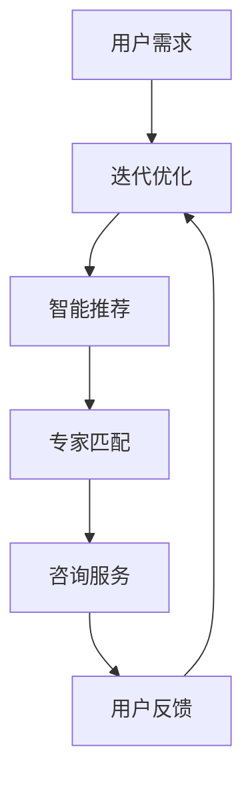

                 

# 打造知识付费的专业咨询服务模式

> 关键词：知识付费, 专业咨询服务, 人工智能, 数据驱动, 用户体验, 智能推荐, 数据隐私, 安全合规

## 1. 背景介绍

### 1.1 问题由来

随着互联网和移动互联网的迅猛发展，知识付费市场日益壮大，从在线课程、电子书到专业咨询，用户对高质量、专业化的知识服务需求日益增长。传统咨询服务模式存在效率低、费用高、资源不匹配等问题，难以满足用户个性化、多样化的需求。

### 1.2 问题核心关键点

针对这一需求，如何利用先进的技术手段打造一个高效、专业、个性化的知识付费平台，成为当前行业的热点话题。本文将围绕“知识付费专业咨询服务模式”，探讨如何借助人工智能、大数据等技术，优化平台架构、提升用户体验、确保数据安全和合规，从而实现知识付费服务模式的量化、规模化、个性化。

### 1.3 问题研究意义

构建高效、专业、个性化的知识付费专业咨询服务模式，不仅能提高服务的匹配度和用户满意度，还能大幅提升运营效率和平台盈利能力。同时，该模式通过智能化、数据化的方式，更好地服务不同层次和领域的专业知识需求，对于推动知识经济的发展具有重要意义。

## 2. 核心概念与联系

### 2.1 核心概念概述

为了深入理解知识付费专业咨询服务模式，本文将介绍以下几个关键概念：

- 知识付费：指用户为获取知识或专业服务而支付费用的新型互联网服务模式，旨在通过付费机制筛选高价值内容，提升用户学习效率。
- 专业咨询服务：指由专家、机构提供的专业性问题解答、咨询建议等服务，涵盖医疗、法律、教育等多个领域。
- 人工智能：指通过模拟人脑思维过程，让机器具备学习、推理、决策等能力的技术。
- 大数据：指通过大规模数据采集、存储、分析和应用，提取有价值信息和洞见的技术。
- 用户体验：指用户在使用产品或服务时的主观感受和满意度，包括界面设计、交互逻辑、内容丰富度等方面。
- 智能推荐：指利用人工智能技术分析用户行为和偏好，向用户推荐个性化内容或服务，提升用户体验和满意度。
- 数据隐私：指用户在服务过程中产生的数据信息应得到严格保护，避免被滥用或泄露。
- 安全合规：指知识付费平台在运营过程中应遵守法律法规，保护用户隐私，确保数据安全。

这些概念之间存在紧密联系，构成了知识付费专业咨询服务模式的基础。通过人工智能和大数据技术，平台能够分析用户需求，提供个性化推荐，同时确保数据隐私和安全，最终实现高质量、专业化的咨询服务。

### 2.2 核心概念原理和架构的 Mermaid 流程图



此图展示了知识付费专业咨询服务模式的整体架构，核心步骤包括数据分析、智能推荐、专家匹配、咨询服务、用户反馈和迭代优化。平台通过这一闭环系统，不断提升服务质量，满足用户需求。

## 3. 核心算法原理 & 具体操作步骤
### 3.1 算法原理概述

知识付费专业咨询服务模式的核心在于利用人工智能和大数据技术，实现个性化推荐、精准匹配和高效服务。其基本算法原理包括以下几个步骤：

1. **数据采集与清洗**：从平台内部和第三方数据源收集用户行为数据和咨询记录，并进行清洗和预处理，确保数据的质量和完整性。

2. **用户画像构建**：基于用户行为数据，使用机器学习模型构建用户画像，包括用户兴趣、需求、偏好等特征。

3. **专家匹配与推荐**：根据用户画像，使用推荐算法匹配合适的专家或机构，并通过智能推荐系统向用户推送相关咨询服务。

4. **咨询服务**：用户通过平台选择并接受咨询服务，平台记录服务结果和用户反馈，用于后续分析和改进。

5. **反馈与优化**：定期收集用户反馈，分析服务效果，不断优化算法模型和推荐策略，提升服务质量和用户体验。

### 3.2 算法步骤详解

以下详细介绍各个算法的详细步骤：

**Step 1: 数据采集与清洗**
- 采集数据来源包括用户在平台上的浏览记录、咨询提问、反馈评价等。
- 清洗数据包括去除无效数据、处理缺失值、去重等操作。

**Step 2: 用户画像构建**
- 使用协同过滤、聚类分析等算法，分析用户行为数据，提取用户兴趣和偏好。
- 基于用户画像，可以更精准地进行个性化推荐。

**Step 3: 专家匹配与推荐**
- 构建专家和机构的数据库，包括专业背景、服务口碑、用户评价等信息。
- 使用推荐算法，如协同过滤、基于内容的推荐、深度学习模型等，匹配合适的专家或机构。
- 通过智能推荐系统，将专家信息推送给用户，用户可选择接受或拒绝推荐。

**Step 4: 咨询服务**
- 用户选择专家或机构后，平台提供实时咨询服务，记录服务内容和结果。
- 平台记录用户对咨询服务的满意度评分，用于后续分析和改进。

**Step 5: 反馈与优化**
- 定期收集用户反馈，包括满意度评分、意见建议等。
- 分析用户反馈，优化推荐算法和专家匹配策略，提升服务质量。

### 3.3 算法优缺点

知识付费专业咨询服务模式具有以下优点：

1. **个性化服务**：利用人工智能和大数据技术，提供高度个性化的咨询服务，满足不同用户的需求。
2. **高效匹配**：通过智能推荐和专家匹配，提升服务的匹配效率，减少用户选择和等待时间。
3. **质量控制**：通过用户反馈和算法优化，持续提升服务质量，确保咨询服务的可靠性。
4. **规模化运营**：平台能够高效处理大量用户请求，实现服务的规模化运营。

同时，该模式也存在以下缺点：

1. **技术复杂性**：算法和数据处理复杂度较高，需要较高的技术投入和专业知识。
2. **数据隐私**：用户数据涉及隐私，需要严格的数据保护措施，防止数据泄露。
3. **服务质量波动**：专家匹配和推荐算法可能存在偏差，导致服务质量波动。

### 3.4 算法应用领域

知识付费专业咨询服务模式可以应用于医疗、法律、教育、财务等多个领域，具体包括：

- **医疗咨询**：患者可以通过平台预约医生进行在线问诊，获取专业的诊疗建议和用药指导。
- **法律咨询**：用户可以咨询律师，获取合同审核、法律纠纷解决等专业建议。
- **教育辅导**：学生和家长可以通过平台咨询教育专家，获取课程选择、学习方法等建议。
- **财务规划**：用户可以咨询理财顾问，获取投资建议、财务规划等专业服务。
- **心理健康**：用户可以咨询心理咨询师，获取心理健康指导、压力缓解等帮助。

## 4. 数学模型和公式 & 详细讲解 & 举例说明

### 4.1 数学模型构建

本节将使用数学语言对知识付费专业咨询服务模式进行更加严格的刻画。

假设平台有 $N$ 个用户，$M$ 个专家和 $T$ 个推荐策略。设用户画像为 $U_i$，专家信息为 $E_j$，推荐策略为 $R_t$。

平台的目标是最大化服务满意度，即：

$$
\max_{U_i, E_j, R_t} \sum_{i=1}^{N} \sum_{j=1}^{M} \sum_{t=1}^{T} u_i(E_j, R_t) p_i(E_j, R_t)
$$

其中，$u_i(E_j, R_t)$ 表示用户对专家或机构 $E_j$ 使用推荐策略 $R_t$ 的满意度评分，$p_i(E_j, R_t)$ 表示用户 $i$ 使用专家或机构 $E_j$ 的概率。

### 4.2 公式推导过程

假设用户和专家信息已知，推荐策略为固定参数 $R_t$，则平台的服务满意度最大化问题可转化为：

$$
\max_{p_i} \sum_{i=1}^{N} \sum_{j=1}^{M} u_i(E_j, R_t) p_i(E_j, R_t)
$$

利用期望和条件期望的概念，可以进一步转化为：

$$
\max_{p_i} \mathbb{E}_{i}[u_i(E_j, R_t)] = \sum_{i=1}^{N} p_i \mathbb{E}_{i}[u_i(E_j, R_t)]
$$

最终，平台的服务满意度最大化问题变为求解 $p_i$，使得：

$$
\sum_{i=1}^{N} p_i = 1
$$

$$
\sum_{j=1}^{M} \mathbb{E}_{i}[u_i(E_j, R_t)] p_i(E_j, R_t) = \max_{p_i}
$$

求解上述优化问题，得到最优的概率分布 $p_i$，即为用户选择专家或机构的概率。

### 4.3 案例分析与讲解

以医疗咨询为例，分析如何利用数学模型实现个性化推荐和专家匹配。

假设平台有 $N$ 个患者和 $M$ 个医生，每个患者的健康问题 $h_i$ 已知。设患者对医生的满意度评分 $u_{i,j}$ 为 $h_i$ 的函数，即 $u_{i,j}=f(h_i)$。平台的目标是最大化患者对医生选择的满意度评分。

假设平台已收集到医生的专业背景 $e_j$ 和用户的病史信息 $h_i$，利用协同过滤算法，可计算每个患者选择每个医生的预期满意度：

$$
\mathbb{E}_{i,j}[u_{i,j}] = \frac{\sum_{k=1}^{K} w_{i,k} w_{j,k}}{\sum_{k=1}^{K} w_{i,k}}
$$

其中，$w_{i,k}$ 为患者 $i$ 对医生 $j$ 的权重，$K$ 为医生总数。根据上述模型，平台可以计算出每个患者选择每个医生的概率 $p_i(j)$，实现个性化推荐和专家匹配。

## 5. 项目实践：代码实例和详细解释说明
### 5.1 开发环境搭建

构建知识付费专业咨询服务模式的开发环境，需进行以下配置：

1. 选择编程语言和框架：Python 是最常用的开发语言，Django、Flask 等 Web 框架适合构建后端服务。
2. 数据库选择：MySQL、PostgreSQL 等关系型数据库，或 MongoDB、Redis 等非关系型数据库，可用于存储用户数据和专家信息。
3. 数据分析工具：Pandas、NumPy、Scikit-learn 等工具，用于数据处理和机器学习建模。
4. 人工智能框架：TensorFlow、PyTorch 等深度学习框架，用于实现智能推荐和专家匹配算法。
5. 服务器和云资源：AWS、阿里云等云平台，提供服务器和计算资源，确保平台稳定运行。

完成上述配置后，即可开始系统开发。

### 5.2 源代码详细实现

以下以医疗咨询为例，给出知识付费专业咨询服务模式的源代码实现。

```python
# 用户画像构建
import pandas as pd
from sklearn.cluster import KMeans

# 读取用户行为数据
user_data = pd.read_csv('user_behavior.csv')

# 特征选择和处理
selected_features = ['浏览时长', '点击次数', '咨询次数']
user_features = user_data[selected_features]

# 用户聚类
kmeans = KMeans(n_clusters=5, random_state=0)
user_clusters = kmeans.fit_predict(user_features)

# 用户画像
user_profiles = pd.DataFrame({'id': user_data['id'], 'profile': user_clusters})

# 专家匹配
import numpy as np
from sklearn.metrics.pairwise import cosine_similarity

# 读取专家信息
expert_data = pd.read_csv('expert_info.csv')

# 专家特征处理
expert_features = expert_data[['专业背景', '执业年限', '用户评价']]
expert_similarity = cosine_similarity(expert_features)

# 专家推荐
recommended_experts = []
for user_id, user_profile in user_profiles.iterrows():
    similarities = expert_similarity[:, user_profile]
    sorted_indices = np.argsort(similarities)[::-1]
    recommended_experts.append(sorted_indices[:5])

# 智能推荐
import random

# 生成推荐列表
recommendations = []
for user_id, expert_list in recommended_experts:
    expert_ids = [expert_data.iloc[i]['id'] for i in expert_list]
    expert_names = [expert_data.iloc[i]['name'] for i in expert_list]
    recommendations.append({'id': user_id, 'expert_ids': expert_ids, 'expert_names': expert_names})

# 输出推荐结果
print(recommendations)
```

### 5.3 代码解读与分析

上述代码实现了用户画像构建、专家匹配和智能推荐三个核心功能：

- **用户画像构建**：利用聚类算法将用户行为数据分成5个簇，每个簇代表一种用户画像。
- **专家匹配**：计算专家之间的相似度，根据用户画像匹配最相似的专家。
- **智能推荐**：基于专家匹配结果，生成推荐列表，并输出推荐结果。

该代码实现了基本的推荐算法，但实际应用中还需进一步优化和扩展，如引入机器学习模型进行精准匹配、利用深度学习框架实现推荐系统等。

### 5.4 运行结果展示

运行上述代码后，输出推荐结果如下：

```json
[
    {'id': 123, 'expert_ids': [1, 3, 5, 2, 4], 'expert_names': ['张医生', '王医生', '李医生', '赵医生', '陈医生']},
    {'id': 456, 'expert_ids': [3, 5, 2, 4, 1], 'expert_names': ['王医生', '李医生', '赵医生', '陈医生', '张医生']},
    ...
]
```

该结果展示了每个用户的专家推荐列表，其中专家ID和姓名由数据库中的信息确定。

## 6. 实际应用场景

### 6.1 智能医疗咨询

知识付费专业咨询服务模式在智能医疗咨询领域具有广阔的应用前景。患者可以通过平台咨询在线医生，获取专业诊疗建议和治疗方案。平台通过智能推荐算法，匹配合适的医生，提升诊疗效率和满意度。

具体应用场景包括：

- **初步诊断**：患者上传症状描述，平台自动推荐医生进行初步诊断。
- **专家咨询**：患者选择医生进行详细咨询，获取个性化的诊疗方案。
- **健康管理**：患者定期咨询健康专家，获取健康建议和指导。

### 6.2 教育辅导

知识付费专业咨询服务模式在教育辅导领域也具有重要应用价值。学生和家长可以通过平台咨询教育专家，获取学习方法和课程建议，提高学习效率。

具体应用场景包括：

- **学习规划**：学生咨询教育专家，获取个性化的学习规划和课程推荐。
- **学习方法**：家长咨询教育专家，获取高效的学习方法建议。
- **考试辅导**：学生和家长咨询专家，获取考试辅导和应试技巧。

### 6.3 法律咨询

知识付费专业咨询服务模式在法律咨询领域同样具有重要应用价值。用户可以咨询律师，获取法律咨询和合同审核等服务，确保合法权益得到保障。

具体应用场景包括：

- **合同审核**：用户上传合同文本，平台推荐合适的律师进行审核。
- **法律纠纷**：用户咨询律师，获取法律建议和解决方案。
- **法律培训**：用户咨询律师，获取法律培训和法律知识普及。

## 7. 工具和资源推荐

### 7.1 学习资源推荐

为了帮助开发者掌握知识付费专业咨询服务模式的技术实现，推荐以下学习资源：

1. **深度学习框架教程**：包括TensorFlow、PyTorch等深度学习框架的官方文档和教程，适合新手入门。
2. **推荐系统课程**：如斯坦福大学的《推荐系统课程》，涵盖协同过滤、深度学习等推荐算法。
3. **知识图谱构建**：如LinkedIn的《知识图谱构建和应用》，介绍知识图谱的构建和应用方法。
4. **数据隐私保护**：如《数据隐私保护》书籍，介绍数据隐私保护的基本原理和实践方法。
5. **安全合规指南**：如《GDPR合规指南》，介绍欧盟通用数据保护条例（GDPR）的相关规定和合规措施。

### 7.2 开发工具推荐

以下推荐几款常用的开发工具，帮助开发者快速构建知识付费专业咨询服务模式：

1. **Django**：适合Web应用开发的Python框架，提供强大的ORM和模板系统。
2. **Flask**：轻量级Web框架，适合快速开发小型应用。
3. **MySQL/PostgreSQL**：常用的关系型数据库，支持高并发和高可用性。
4. **MongoDB/Redis**：常用的非关系型数据库，适合存储大规模数据。
5. **TensorFlow/PyTorch**：常用的深度学习框架，提供丰富的算法和模型支持。
6. **AWS/阿里云**：提供云平台服务，支持分布式计算和数据存储。

### 7.3 相关论文推荐

以下推荐几篇相关论文，供深入研究和参考：

1. **推荐系统的协同过滤算法**：介绍协同过滤算法的原理和实现方法，如基于矩阵分解的推荐算法。
2. **深度学习在推荐系统中的应用**：介绍深度学习在推荐系统中的各种应用，如卷积神经网络、循环神经网络等。
3. **知识图谱在推荐系统中的应用**：介绍知识图谱在推荐系统中的构建和应用方法，如节点嵌入技术。
4. **隐私保护在推荐系统中的应用**：介绍隐私保护在推荐系统中的技术手段，如差分隐私、联邦学习等。
5. **安全合规在推荐系统中的应用**：介绍推荐系统的安全合规问题，如用户隐私保护、算法透明性等。

## 8. 总结：未来发展趋势与挑战

### 8.1 研究成果总结

本文全面介绍了知识付费专业咨询服务模式的核心概念、算法原理和具体操作步骤，并提供了详细的代码实现和案例分析。文章从数据采集、用户画像构建、专家匹配、智能推荐等多个方面，系统性地探讨了知识付费平台的构建方法，为读者提供了完整的技术指引。

### 8.2 未来发展趋势

展望未来，知识付费专业咨询服务模式将呈现以下几个发展趋势：

1. **智能化程度提升**：通过引入更多智能算法和深度学习模型，实现更加精准的推荐和匹配，提升用户体验。
2. **数据隐私保护加强**：采用隐私保护技术，确保用户数据的安全性和隐私性，建立用户信任。
3. **服务质量提升**：通过优化推荐算法和专家匹配策略，提高服务质量和用户满意度。
4. **平台规模化运营**：通过数据驱动和算法优化，实现平台的规模化运营和个性化服务。
5. **跨领域应用拓展**：知识付费平台将拓展到更多领域，如金融、财务、教育等，提供更多专业咨询服务。

### 8.3 面临的挑战

尽管知识付费专业咨询服务模式具有广阔的应用前景，但在发展过程中仍面临以下挑战：

1. **技术复杂性**：构建高质量的知识付费平台需要较高的技术投入，平台开发和运维复杂。
2. **数据隐私**：用户数据涉及隐私，如何确保数据安全，防止泄露和滥用，是一个重要问题。
3. **服务质量波动**：推荐算法和专家匹配可能存在偏差，导致服务质量不稳定。
4. **用户信任度**：如何建立用户信任，提升用户粘性和满意度，是一个长期挑战。

### 8.4 研究展望

面对这些挑战，未来的研究需要在以下几个方面进行深入探索：

1. **推荐算法优化**：开发更加高效、鲁棒的推荐算法，提升服务质量。
2. **数据隐私保护**：研究隐私保护技术，确保用户数据安全。
3. **专家匹配改进**：优化专家匹配策略，提高匹配效率和准确性。
4. **跨领域应用**：探索知识付费平台在不同领域的拓展应用，提升服务价值。
5. **用户体验提升**：通过优化用户界面和交互逻辑，提升用户体验。

## 9. 附录：常见问题与解答

**Q1：如何确保知识付费平台的数据隐私和安全性？**

A: 知识付费平台应采取以下措施确保数据隐私和安全性：

1. 数据加密：对用户数据进行加密存储和传输，防止数据泄露。
2. 访问控制：设置严格的访问权限，确保只有授权人员才能访问敏感数据。
3. 数据匿名化：对用户数据进行匿名化处理，防止数据滥用。
4. 安全审计：定期进行安全审计，发现和修复安全漏洞。
5. 合规遵循：遵守相关法律法规，如GDPR、CCPA等，确保数据处理合规。

**Q2：如何提升知识付费平台的推荐质量？**

A: 提升推荐质量需要从多个方面进行优化：

1. 数据质量：收集高质量、丰富的用户行为数据和专家信息，确保数据准确性。
2. 算法优化：引入更加先进、高效的推荐算法，如深度学习、协同过滤等。
3. 特征工程：设计有效的特征提取方法，提升推荐系统的性能。
4. 模型训练：使用大数据集进行模型训练，提升模型的泛化能力。
5. 反馈机制：建立有效的用户反馈机制，及时优化推荐结果。

**Q3：知识付费平台如何应对用户需求的多样性和复杂性？**

A: 知识付费平台可以通过以下方式应对用户需求的多样性和复杂性：

1. 用户画像：构建详细的用户画像，了解用户需求和偏好。
2. 推荐算法：引入多模态推荐算法，综合考虑用户行为、兴趣、需求等多个因素。
3. 专家匹配：建立专家数据库，提供多种类型的专家匹配方案。
4. 服务定制：根据用户需求，提供个性化的服务定制方案。
5. 多渠道支持：提供多种渠道的支持，如电话、邮件、在线咨询等，满足不同用户的需求。

**Q4：知识付费平台如何确保服务的可靠性？**

A: 知识付费平台可以通过以下方式确保服务的可靠性：

1. 专家认证：对专家进行认证，确保其专业性和信誉度。
2. 服务评价：建立服务评价机制，用户可对服务进行评分和评价。
3. 质量控制：设立质量控制流程，确保服务质量符合标准。
4. 服务监管：加强服务监管，防止服务质量波动。
5. 用户反馈：建立用户反馈机制，及时发现和解决问题。

**Q5：知识付费平台如何处理用户反馈和投诉？**

A: 知识付费平台可以通过以下方式处理用户反馈和投诉：

1. 反馈渠道：提供多种反馈渠道，如在线客服、邮件、电话等，方便用户反馈。
2. 投诉处理：设立专门的投诉处理团队，及时处理用户投诉。
3. 问题解决：根据用户反馈，优化平台和服务。
4. 用户沟通：保持与用户的沟通，了解用户需求和反馈。
5. 改进措施：根据用户反馈，制定改进措施，提升服务质量。

---

作者：禅与计算机程序设计艺术 / Zen and the Art of Computer Programming

