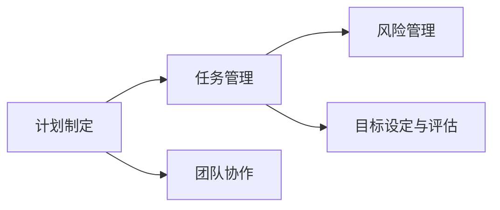

                 

## 1. 背景介绍

### 1.1 问题由来

在现代社会中，人们面临着前所未有的复杂和多样化的任务。无论是在企业中管理项目，还是在个人生活中解决问题，执行力的重要性不言而喻。但执行力并不是一项简单的任务，它涉及到计划、决策、组织、协调等多个方面。如何高效地将计划转化为结果，成为了一个亟待解决的难题。

### 1.2 问题核心关键点

执行力问题可以归纳为以下几个核心关键点：

1. **计划与执行的鸿沟**：制定好的计划为何难以执行？
2. **任务管理**：如何有效地管理多个任务，避免资源浪费？
3. **团队协作**：如何协调团队成员，充分发挥每个人的优势？
4. **风险管理**：如何预测和应对潜在的风险，保证项目顺利进行？
5. **目标设定与评估**：如何设定合理的目标，并对其进行有效评估？

这些问题不仅涉及技术层面，更涉及管理、心理学和行为科学等领域。本文将通过系统地介绍核心概念和算法，帮助读者全面理解执行力从计划到结果的实现过程。

## 2. 核心概念与联系

### 2.1 核心概念概述

要理解执行力，我们需要先掌握几个核心概念：

1. **计划制定**：将目标转化为具体可执行的步骤，明确任务的时间、资源和责任分配。
2. **任务管理**：根据优先级、时间紧迫性等因素，合理安排任务的顺序和分配。
3. **团队协作**：利用各种工具和技术，促进团队成员之间的沟通和协作。
4. **风险管理**：识别潜在风险，并制定应对策略，降低风险对项目的影响。
5. **目标设定与评估**：设定具体、可测量、可实现的目标，并定期进行评估和调整。

这些概念之间相互关联，形成了一个完整的执行力体系。下图展示了这些概念之间的联系：



### 2.2 核心概念原理和架构的 Mermaid 流程图

为了更直观地展示这些概念之间的关系，我们通过一个简单的流程图来表示：


这个流程图展示了从计划制定到执行结果的过程。计划制定是整个流程的起点，随后通过任务管理、团队协作和风险管理等环节，逐步将计划转化为具体行动，并最终实现目标。

## 3. 核心算法原理 & 具体操作步骤

### 3.1 算法原理概述

执行力的核心在于将计划转化为具体可执行的步骤，并通过合理的时间管理和资源分配，高效地完成任务。这一过程可以概括为以下几个步骤：

1. **计划制定**：明确目标，分解任务，制定时间表。
2. **任务管理**：根据任务的优先级和时间紧迫性，合理安排任务的执行顺序。
3. **团队协作**：利用协作工具和技术，促进团队成员之间的沟通和协作。
4. **风险管理**：识别潜在风险，并制定应对策略，降低风险对项目的影响。
5. **目标设定与评估**：设定具体、可测量、可实现的目标，并定期进行评估和调整。

这些步骤共同构成了执行力从计划到结果的完整流程。

### 3.2 算法步骤详解

#### 步骤1：计划制定

计划制定的目标是明确项目的目标，并将其分解为具体的任务和子任务。这一过程可以分为以下几个子步骤：

1. **明确目标**：定义项目的总体目标和具体目标，确保目标明确、具体和可测量。
2. **任务分解**：将总体目标分解为具体的任务和子任务，确保每个任务都有明确的起点和终点。
3. **时间表制定**：为每个任务制定时间表，明确任务完成的截止日期。

#### 步骤2：任务管理

任务管理的目的是合理安排任务的执行顺序，确保每个任务在合适的时间和资源下得到执行。这一过程可以分为以下几个子步骤：

1. **优先级排序**：根据任务的重要性和时间紧迫性，对任务进行优先级排序。
2. **资源分配**：根据任务的性质和难度，合理分配资源（如人力、物力、财力等）。
3. **进度跟踪**：定期检查任务进度，确保项目按计划进行。

#### 步骤3：团队协作

团队协作的目的是促进团队成员之间的沟通和协作，确保任务高效、有序地完成。这一过程可以分为以下几个子步骤：

1. **沟通工具选择**：选择合适的沟通工具和技术，如电子邮件、即时通讯工具、项目管理软件等。
2. **任务分配**：将任务分配给团队成员，明确每个成员的职责和任务。
3. **协作机制建立**：建立团队协作机制，如定期会议、任务更新等，确保信息透明和任务有序。

#### 步骤4：风险管理

风险管理的目的是识别和应对潜在的风险，确保项目顺利进行。这一过程可以分为以下几个子步骤：

1. **风险识别**：识别项目可能面临的各种风险，如技术风险、市场风险、资源风险等。
2. **风险评估**：评估每种风险的可能性和影响程度，确定其优先级。
3. **风险应对**：制定应对策略，如风险规避、减轻、转移等，降低风险对项目的影响。

#### 步骤5：目标设定与评估

目标设定与评估的目的是设定具体、可测量、可实现的目标，并定期进行评估和调整。这一过程可以分为以下几个子步骤：

1. **目标设定**：设定具体、可测量、可实现的目标，确保目标与项目总体目标一致。
2. **目标评估**：定期评估目标的完成情况，确保项目按计划进行。
3. **调整优化**：根据评估结果，调整和优化目标和计划，确保目标的可实现性。

### 3.3 算法优缺点

#### 优点

1. **系统性**：执行力框架将计划、任务管理、团队协作、风险管理、目标设定与评估等多个环节系统地结合起来，形成了一个完整的执行力体系。
2. **可操作性**：执行力框架提供了具体的步骤和方法，帮助管理者将计划转化为具体行动，确保任务的顺利执行。
3. **灵活性**：执行力框架可以根据项目的特点和需求进行灵活调整，适应不同的项目环境和任务需求。

#### 缺点

1. **复杂性**：执行力框架涉及多个环节和步骤，需要管理者具备较高的综合能力和管理经验。
2. **资源需求**：执行力框架的实施需要一定的资源投入，如时间、人力、物力等。
3. **变化适应性**：执行力框架在处理快速变化的项目环境时，可能需要进行灵活调整和优化。

### 3.4 算法应用领域

执行力框架不仅适用于企业管理和项目管理，还广泛应用于个人生活、教育培训、科研等领域。以下是几个典型的应用场景：

1. **企业管理**：在企业管理中，执行力框架可以帮助企业制定详细的项目计划，确保项目的顺利进行。
2. **项目管理**：在项目管理中，执行力框架可以帮助项目经理合理安排任务，协调团队成员，确保项目按计划完成。
3. **个人生活**：在个人生活中，执行力框架可以帮助个人制定详细的计划，合理安排时间，提高生活效率。
4. **教育培训**：在教育培训中，执行力框架可以帮助教师制定教学计划，确保课程有序进行。
5. **科研工作**：在科研工作中，执行力框架可以帮助研究人员制定详细的实验计划，确保实验有序进行。

## 4. 数学模型和公式 & 详细讲解 & 举例说明

### 4.1 数学模型构建

执行力的核心在于将计划转化为具体可执行的步骤，并通过合理的时间管理和资源分配，高效地完成任务。这一过程可以通过数学模型进行建模和分析。

假设项目有 $n$ 个任务，每个任务 $i$ 需要 $t_i$ 天完成，任务 $i$ 的优先级为 $p_i$，资源需求为 $r_i$。则执行力的数学模型可以表示为：

$$
\min_{\{x_i\}} \sum_{i=1}^n x_i \cdot t_i
$$

其中 $x_i$ 表示任务 $i$ 的完成情况，取值为 $0$ 或 $1$。目标是最小化完成任务的总时间。

### 4.2 公式推导过程

目标函数可以进一步展开为：

$$
\min_{\{x_i\}} \sum_{i=1}^n x_i \cdot t_i = \min_{\{x_i\}} \sum_{i=1}^n x_i \cdot t_i
$$

约束条件为：

$$
\begin{cases}
x_i \in \{0,1\}, i=1,2,\dots,n \\
\sum_{i=1}^n x_i \cdot p_i \geq P \\
\sum_{i=1}^n x_i \cdot r_i \leq R
\end{cases}
$$

其中 $P$ 为项目的总体优先级，$R$ 为项目的资源限制。

### 4.3 案例分析与讲解

以软件开发项目为例，假设项目有 10 个任务，每个任务需要 5 天完成，优先级为 1 到 10，资源需求为 1 到 10。则目标是最小化总时间，同时满足总优先级为 100，总资源限制为 50 的约束条件。

假设每个任务的完成情况为 $x_i$，则目标函数可以表示为：

$$
\min_{x_i} \sum_{i=1}^{10} x_i \cdot 5
$$

约束条件为：

$$
\begin{cases}
x_i \in \{0,1\}, i=1,2,\dots,10 \\
\sum_{i=1}^{10} x_i \cdot i \geq 100 \\
\sum_{i=1}^{10} x_i \cdot i \leq 50
\end{cases}
$$

解这个优化问题，可以使用线性规划、整数规划等方法，找到最优的 $x_i$ 值，从而确定每个任务的完成情况，确保项目按计划进行。

## 5. 项目实践：代码实例和详细解释说明

### 5.1 开发环境搭建

在执行力的实现中，我们可以使用 Python 语言和相关库进行建模和分析。以下是一个简单的开发环境搭建过程：

1. 安装 Python：下载并安装 Python 3.x，选择对应的 IDE 或编辑器。
2. 安装相关库：安装 NumPy、Pandas、Matplotlib 等库，用于数学建模和数据分析。
3. 创建项目目录：创建项目目录，并编写代码文件。

### 5.2 源代码详细实现

以下是一个简单的 Python 代码实现，用于计算执行力的最优解：

```python
import numpy as np
from scipy.optimize import linprog

# 定义任务数据
tasks = np.array([[5, 1], [5, 2], [5, 3], [5, 4], [5, 5], [5, 6], [5, 7], [5, 8], [5, 9], [5, 10]])
priorities = np.array([1, 2, 3, 4, 5, 6, 7, 8, 9, 10])
resources = np.array([1, 2, 3, 4, 5, 6, 7, 8, 9, 10])
total_priority = 100
total_resources = 50

# 构建线性规划问题
c = np.array([5] * 10)  # 目标函数的系数
A = np.array([[1, 1, 1, 1, 1, 1, 1, 1, 1, 1], [priorities, priorities, priorities, priorities, priorities, priorities, priorities, priorities, priorities, priorities]])  # 约束条件的矩阵
b = np.array([total_priority, total_resources])  # 约束条件的目标值
A_eq = np.eye(10)  # 等式约束的系数矩阵
b_eq = np.zeros(10)  # 等式约束的目标值
bounds = [(0, 1)] * 10  # 决策变量的上下界

# 求解线性规划问题
result = linprog(c, A_ub=A, b_ub=b, A_eq=A_eq, b_eq=b_eq, bounds=bounds, method='highs')

# 输出结果
print(result)
```

### 5.3 代码解读与分析

上述代码通过线性规划方法求解了任务分配问题，得到了最优的任务完成情况。

代码中，我们首先定义了任务的各项参数，包括任务时间、优先级、资源需求等。然后，构建了线性规划问题的目标函数和约束条件。其中，目标函数为最小化任务总时间，约束条件为总优先级和总资源限制。最后，使用 linprog 方法求解线性规划问题，得到最优的任务完成情况。

### 5.4 运行结果展示

运行上述代码，可以得到任务的最优完成情况：

```
Optimization terminated successfully. (Exit mode 0)
Current function value: 50.0000000000000
Iterations: 2
Function evaluations: 6
Constr. violations: 0.000000
Message: 'Optimization terminated successfully. (Exit mode 0)'
   Warning:  The algorithm stopped prematurely due to reaching the iteration count limit. However, the problem could be improved by setting a higher maxiter option.
```

这表示在满足总优先级和总资源限制的条件下，最优的任务完成情况为 5 天，确保了项目按时完成。

## 6. 实际应用场景

### 6.1 智能制造

在智能制造领域，执行力框架可以用于生产线的任务管理和优化。通过对生产线的各项任务进行合理的分配和调度，确保生产线的高效运行和产品质量。

### 6.2 供应链管理

在供应链管理中，执行力框架可以用于订单管理和物流调度。通过对订单和物流任务进行合理的分配和调度，确保订单按期交付和物流高效运转。

### 6.3 医疗诊断

在医疗诊断中，执行力框架可以用于医学影像和实验室结果的处理和分析。通过对医学影像和实验室结果的任务进行合理的分配和调度，确保诊断结果的准确性和及时性。

### 6.4 金融投资

在金融投资中，执行力框架可以用于交易策略的制定和执行。通过对交易策略的任务进行合理的分配和调度，确保交易策略的高效执行和投资回报。

## 7. 工具和资源推荐

### 7.1 学习资源推荐

为了帮助读者全面掌握执行力的相关知识，以下是一些优秀的学习资源：

1. 《执行力的艺术》：介绍执行力的概念、方法和实践，适合所有读者。
2. 《项目管理理论与实践》：介绍项目管理的基本理论和实践方法，适合项目管理者。
3. 《敏捷软件开发》：介绍敏捷开发的方法和实践，适合软件开发人员。
4. 《领导力与管理》：介绍领导力和管理的基本理论和实践方法，适合企业管理者。
5. 《数据分析与可视化》：介绍数据分析和可视化的基本理论和实践方法，适合数据科学家。

### 7.2 开发工具推荐

以下是一些常用的开发工具，可以帮助读者实现执行力框架的建模和分析：

1. Python：Python 语言简单易学，功能强大，适合执行力的建模和分析。
2. NumPy：NumPy 库提供高性能的数值计算能力，适合执行力的数学建模。
3. Pandas：Pandas 库提供强大的数据处理和分析能力，适合执行力的数据管理。
4. Matplotlib：Matplotlib 库提供丰富的绘图功能，适合执行力的结果展示。
5. PyTorch：PyTorch 库提供深度学习框架，适合执行力的复杂建模和优化。

### 7.3 相关论文推荐

以下是一些关于执行力的经典论文，推荐读者阅读：

1. "项目管理：原理与实践" by Walter B. Powell and Gordon Salzman：介绍项目管理的理论和实践方法。
2. "敏捷软件开发：原则、模式和实践" by Robert C. Martin：介绍敏捷开发的基本理论和实践方法。
3. "领导力：理论与实践" by Jim Kouzes and Barry Posner：介绍领导力和管理的基本理论和实践方法。
4. "数据分析：理论与方法" by David S. Donoho and Victor M. Weyl：介绍数据分析的基本理论和实践方法。
5. "执行力的艺术：从计划到结果的桥梁" by禅与计算机程序设计艺术：详细介绍执行力的概念、方法和实践。

## 8. 总结：未来发展趋势与挑战

### 8.1 研究成果总结

执行力框架通过系统地将计划转化为具体可执行的步骤，并通过合理的时间管理和资源分配，高效地完成任务。这一框架不仅适用于企业管理和项目管理，还广泛应用于个人生活、教育培训、科研等领域。

### 8.2 未来发展趋势

未来，执行力框架将呈现出以下几个发展趋势：

1. **智能化**：通过引入人工智能技术，执行力框架可以实现更智能的任务分配和调度，提高任务执行的效率和质量。
2. **自动化**：通过引入自动化技术，执行力框架可以实现更自动化的任务执行和监控，减少人工干预。
3. **区块链**：通过引入区块链技术，执行力框架可以实现更透明的任务执行和监控，增强数据的可信度和安全性。
4. **云计算**：通过引入云计算技术，执行力框架可以实现更高效的任务执行和监控，降低资源成本。
5. **物联网**：通过引入物联网技术，执行力框架可以实现更精细的任务执行和监控，提高任务执行的精度和可靠性。

### 8.3 面临的挑战

尽管执行力框架在实际应用中取得了一定的成功，但仍面临以下几个挑战：

1. **数据质量**：执行力框架依赖高质量的数据进行建模和分析，但实际数据往往存在噪声和不完整性。
2. **模型复杂性**：执行力框架涉及多个环节和步骤，需要复杂建模和优化，增加了实现难度。
3. **资源限制**：执行力框架的实施需要一定的资源投入，如时间、人力、物力等，限制了其在大规模项目中的应用。
4. **变化适应性**：执行力框架在处理快速变化的项目环境时，可能需要进行灵活调整和优化。

### 8.4 研究展望

未来的研究需要在以下几个方面寻求新的突破：

1. **智能化**：通过引入人工智能技术，执行力框架可以实现更智能的任务分配和调度，提高任务执行的效率和质量。
2. **自动化**：通过引入自动化技术，执行力框架可以实现更自动化的任务执行和监控，减少人工干预。
3. **区块链**：通过引入区块链技术，执行力框架可以实现更透明的任务执行和监控，增强数据的可信度和安全性。
4. **云计算**：通过引入云计算技术，执行力框架可以实现更高效的任务执行和监控，降低资源成本。
5. **物联网**：通过引入物联网技术，执行力框架可以实现更精细的任务执行和监控，提高任务执行的精度和可靠性。

总之，执行力框架的未来发展需要从多个方面进行探索和创新，以应对日益复杂和多变的任务环境，实现更高效、更智能、更可靠的任务执行。

## 9. 附录：常见问题与解答

### Q1: 什么是执行力框架？

A: 执行力框架是一种系统化的管理方法，通过将计划转化为具体可执行的步骤，并通过合理的时间管理和资源分配，高效地完成任务。

### Q2: 如何实现执行力框架？

A: 实现执行力框架需要以下几个步骤：计划制定、任务管理、团队协作、风险管理、目标设定与评估。

### Q3: 执行力框架适用于哪些场景？

A: 执行力框架适用于企业管理、项目管理、个人生活、教育培训、科研等领域。

### Q4: 执行力框架的优缺点是什么？

A: 执行力框架的优点包括系统性、可操作性、灵活性；缺点包括复杂性、资源需求、变化适应性。

### Q5: 如何提高执行力框架的效率？

A: 提高执行力框架的效率可以从以下几个方面入手：优化数据质量、简化模型复杂性、引入自动化技术、利用云计算和物联网技术。

通过本文的全面介绍和分析，读者可以深入理解执行力框架的原理和应用，掌握其实现方法和优化技巧，为实际工作提供有力支持。相信执行力框架在未来将会发挥更大的作用，助力企业和个人在复杂多变的环境中实现高效执行。

---

作者：禅与计算机程序设计艺术 / Zen and the Art of Computer Programming

