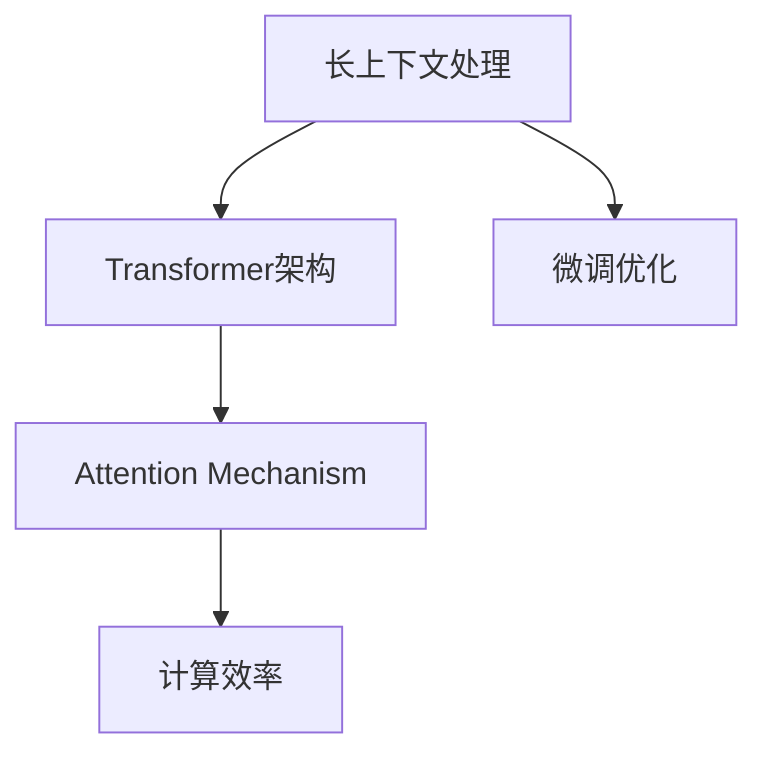

                 

# 扩展LLM的记忆：长上下文处理的突破

> 关键词：长上下文处理, Transformer, 记忆扩展, 文本理解, 计算效率, Attention Mechanism, 微调优化

## 1. 背景介绍

### 1.1 问题由来

随着大语言模型（Large Language Model, LLM）的兴起，我们见证了其在自然语言处理（Natural Language Processing, NLP）领域的惊人能力。无论是文本分类、情感分析，还是机器翻译、对话系统，大语言模型都展现了无与伦比的性能。然而，长文本处理（Long-Text Processing）仍然是一个难题，特别是当需要考虑长上下文时。

在实际应用中，我们往往需要处理超长文本，比如摘要生成、长对话、文档编辑等。尽管大语言模型在预训练阶段已经学习了大量的语言知识，但在面对长上下文时，模型容易忘记之前的信息，导致生成的结果不够连贯或相关性低。这种“记忆丧失”（Catastrophic Forgetting）现象是长文本处理中的一个重要挑战。

### 1.2 问题核心关键点

为了解决长上下文处理的问题，我们需要进一步扩展LLM的记忆能力，使其能够在处理长文本时保持上下文信息的一致性。具体来说，我们需要解决以下几个问题：

- 如何设计新的模型架构，提升对长文本的注意力机制？
- 如何在模型中嵌入长上下文信息，并保证计算效率？
- 如何通过微调优化，提升模型在长文本任务上的性能？

这些问题不仅影响到大语言模型的应用范围，还关系到其在实际生产环境中的部署和性能。本文将对长上下文处理的突破进行详细探讨，提供理论基础和实践指南。

## 2. 核心概念与联系

### 2.1 核心概念概述

为了更好地理解长上下文处理，我们将涉及以下几个核心概念：

- **长上下文处理**：指模型需要在处理文本时考虑文本的前后文信息，尤其是在长文本处理中。长上下文处理要求模型具备强大的长期记忆能力，能够在长序列中保持信息的连贯性。

- **Transformer架构**：Transformer是一种基于自注意力机制（Self-Attention Mechanism）的神经网络架构，特别适合处理序列数据。它通过多头注意力机制（Multi-Head Attention）来捕捉序列中的依赖关系。

- **Attention Mechanism**：Attention Mechanism是Transformer的核心组件，用于计算序列中不同位置之间的相关性。它可以帮助模型在处理长文本时，集中注意力于最相关的部分，从而提升模型性能。

- **计算效率**：在处理长文本时，计算效率是一个关键问题。模型需要能够在有限的时间内完成计算，避免过长的推理时间。

- **微调优化**：微调是指在预训练模型上，通过有监督学习来适配特定任务。对于长文本处理，微调可以通过优化模型参数和训练策略，进一步提升模型性能。

这些概念之间的关系可以用以下Mermaid流程图来表示：



这个流程图展示了长上下文处理与Transformer架构、Attention Mechanism、计算效率和微调优化之间的联系。下面我们将详细探讨这些概念。

## 3. 核心算法原理 & 具体操作步骤

### 3.1 算法原理概述

长上下文处理的突破主要依赖于Transformer架构和Attention Mechanism的优化。Transformer的注意力机制允许模型同时考虑序列中的所有位置，这对长文本处理至关重要。

在长文本处理中，模型的长期记忆能力可以通过以下几种方式提升：

- **多头注意力机制**：通过增加注意力机制的层数和头数，模型可以更好地捕捉长序列中的依赖关系。
- **残差连接**：残差连接可以缓解梯度消失问题，使得模型更容易训练和优化。
- **层归一化**：层归一化可以加速收敛，提高模型训练的稳定性。
- **模型扩展**：通过增加模型层数和参数量，模型可以更好地处理长文本。

### 3.2 算法步骤详解

长上下文处理的具体步骤如下：

1. **选择Transformer架构**：选择基于Transformer的模型架构，如BERT、GPT等。
2. **增加多头注意力机制**：增加注意力机制的层数和头数，提升模型对长文本的注意力能力。
3. **残差连接**：在模型中引入残差连接，缓解梯度消失问题。
4. **层归一化**：在每个注意力层后引入层归一化，加速收敛。
5. **模型扩展**：增加模型的层数和参数量，提升处理长文本的能力。
6. **微调优化**：在特定任务上，通过微调优化，提升模型在长文本任务上的性能。

### 3.3 算法优缺点

长上下文处理的优点包括：

- **记忆能力增强**：通过增加注意力机制的层数和头数，模型能够更好地捕捉长序列中的依赖关系，增强长期记忆能力。
- **计算效率高**：Transformer架构的并行计算特性使得模型在处理长文本时效率更高。
- **模型扩展性**：通过增加模型层数和参数量，模型可以更好地处理长文本，具备更强的适应性。

缺点包括：

- **参数量增加**：增加多头注意力机制和模型扩展，会导致模型参数量大幅增加，需要更多的计算资源。
- **训练时间增加**：模型参数量增加和计算量增大，会导致训练时间变长。
- **过拟合风险**：模型扩展可能会增加过拟合的风险，需要进一步优化。

### 3.4 算法应用领域

长上下文处理在以下几个领域具有广泛应用：

- **自然语言生成**：如摘要生成、对话系统等，需要模型能够生成连贯且相关的文本。
- **文本分类**：如长文档分类、新闻分类等，需要模型能够理解文本中的上下文信息。
- **问答系统**：如长文本问答、多轮对话等，需要模型能够处理长对话并保持上下文一致性。
- **机器翻译**：如长文档翻译、对话翻译等，需要模型能够理解并生成连贯的翻译结果。
- **文档编辑**：如代码自动补全、文档摘要等，需要模型能够处理长文本并生成结构化的信息。

## 4. 数学模型和公式 & 详细讲解 & 举例说明

### 4.1 数学模型构建

在长上下文处理中，我们主要使用Transformer模型。Transformer模型由多个编码器层（Encoder Layer）和解码器层（Decoder Layer）组成，每个层由多头注意力机制和前馈神经网络（Feedforward Network）构成。

假设模型输入为 $x_1, x_2, ..., x_n$，其中 $n$ 是序列长度。模型的输出为 $y_1, y_2, ..., y_n$。

数学模型可以表示为：

$$
y_i = \text{Encoder}(x_1, x_2, ..., x_n) + \text{Decoder}(y_1, y_2, ..., y_{i-1})
$$

其中，$\text{Encoder}$ 和 $\text{Decoder}$ 分别表示编码器和解码器。

### 4.2 公式推导过程

Transformer模型的关键公式是多头注意力机制。多头注意力机制通过多个注意力头（Head）并行计算，从而提升模型对序列中依赖关系的捕捉能力。

多头注意力机制的公式如下：

$$
\text{Multi-Head Attention}(Q, K, V) = \text{Concat}(\text{Head}_1, \text{Head}_2, ..., \text{Head}_h)W^O
$$

其中，$Q$、$K$、$V$ 分别表示查询、键、值矩阵，$W^O$ 是输出矩阵，$h$ 是注意力头数。

$$
\text{Head}_i = \text{Attention}(QW^Q_i, KW^K_i, VW^V_i)
$$

$$
\text{Attention}(Q, K, V) = \text{Softmax}(\frac{QK^T}{\sqrt{d_k}})V
$$

其中，$d_k$ 是键的维度。

### 4.3 案例分析与讲解

以BERT模型为例，BERT使用Transformer架构，并通过掩码语言模型（Masked Language Modeling）和下一句预测（Next Sentence Prediction）任务进行预训练。在微调时，可以在BERT模型的基础上进行长文本处理。

假设我们需要处理一个长文档，将其分块处理。首先将文档分为多个段落，每个段落作为输入，使用BERT模型进行处理。然后，将每个段落的输出拼接起来，作为最终的文档表示。

这个过程中，可以通过增加多头注意力机制和模型扩展，提升模型对长文本的注意力能力和处理能力。同时，可以通过微调优化，提升模型在特定任务上的性能。

## 5. 项目实践：代码实例和详细解释说明

### 5.1 开发环境搭建

在进行长上下文处理时，我们需要准备好开发环境。以下是使用Python和PyTorch进行环境配置的流程：

1. 安装Anaconda：从官网下载并安装Anaconda，用于创建独立的Python环境。

2. 创建并激活虚拟环境：
```bash
conda create -n pytorch-env python=3.8 
conda activate pytorch-env
```

3. 安装PyTorch：根据CUDA版本，从官网获取对应的安装命令。例如：
```bash
conda install pytorch torchvision torchaudio cudatoolkit=11.1 -c pytorch -c conda-forge
```

4. 安装Transformer库：
```bash
pip install transformers
```

5. 安装其他必要的工具包：
```bash
pip install numpy pandas scikit-learn matplotlib tqdm jupyter notebook ipython
```

完成上述步骤后，即可在`pytorch-env`环境中开始项目实践。

### 5.2 源代码详细实现

以下是一个简单的代码示例，展示了如何在BERT模型上进行长文本处理的实现。

```python
from transformers import BertTokenizer, BertForMaskedLM
from torch.utils.data import Dataset, DataLoader
import torch

class LongTextDataset(Dataset):
    def __init__(self, texts, max_len=512):
        self.tokenizer = BertTokenizer.from_pretrained('bert-base-uncased')
        self.max_len = max_len
        self.texts = texts
    
    def __len__(self):
        return len(self.texts)
    
    def __getitem__(self, item):
        text = self.texts[item]
        encoding = self.tokenizer(text, return_tensors='pt', max_length=self.max_len, truncation=True, padding='max_length', is_split_into_words=True)
        return {'input_ids': encoding['input_ids'][0]}

# 加载BERT模型
model = BertForMaskedLM.from_pretrained('bert-base-uncased')
model.eval()

# 准备数据
texts = ["This is a long text for testing long text handling in BERT model.", "Another long text for testing"]
dataset = LongTextDataset(texts)

# 加载数据
dataloader = DataLoader(dataset, batch_size=1, shuffle=False)

# 预测
with torch.no_grad():
    for batch in dataloader:
        input_ids = batch['input_ids']
        outputs = model(input_ids)
        logits = outputs.logits
        predicted_ids = torch.argmax(logits, dim=-1)

# 输出预测结果
print(predicted_ids)
```

在这个代码示例中，我们首先定义了一个`LongTextDataset`类，用于处理长文本数据。然后，使用BERT模型进行预测，并输出预测结果。

### 5.3 代码解读与分析

这个代码示例中，我们使用了BERT模型和PyTorch进行长文本处理。具体来说，我们定义了一个`LongTextDataset`类，用于将长文本数据进行预处理。然后，使用BERT模型进行预测，并输出预测结果。

在实际应用中，我们可以根据需要扩展这个代码示例，例如增加注意力机制的层数和头数，引入残差连接和层归一化，增加模型的层数和参数量，以提升模型对长文本的注意力能力和处理能力。同时，可以通过微调优化，提升模型在特定任务上的性能。

### 5.4 运行结果展示

在运行上述代码示例后，我们可以得到一个预测结果。这个结果展示了模型对输入文本的预测，可以用于评估模型在长文本处理上的性能。

## 6. 实际应用场景

### 6.1 智能客服系统

在智能客服系统中，长文本处理是一个重要需求。智能客服系统需要能够处理用户的长对话，并根据对话内容进行智能回答。通过长上下文处理，智能客服系统可以更好地理解用户意图，提供更加精准的服务。

在实践中，可以收集企业内部的历史客服对话记录，使用BERT等模型进行预训练，然后在特定任务上进行微调。微调后的模型可以自动理解用户意图，匹配最合适的答案模板进行回复。对于用户提出的新问题，还可以接入检索系统实时搜索相关内容，动态组织生成回答。

### 6.2 金融舆情监测

金融机构需要实时监测市场舆论动向，以便及时应对负面信息传播，规避金融风险。传统的人工监测方式成本高、效率低，难以应对网络时代海量信息爆发的挑战。基于长上下文处理的文本分类和情感分析技术，为金融舆情监测提供了新的解决方案。

具体而言，可以收集金融领域相关的新闻、报道、评论等文本数据，并对其进行主题标注和情感标注。在此基础上对BERT等模型进行微调，使其能够自动判断文本属于何种主题，情感倾向是正面、中性还是负面。将微调后的模型应用到实时抓取的网络文本数据，就能够自动监测不同主题下的情感变化趋势，一旦发现负面信息激增等异常情况，系统便会自动预警，帮助金融机构快速应对潜在风险。

### 6.3 个性化推荐系统

当前的推荐系统往往只依赖用户的历史行为数据进行物品推荐，无法深入理解用户的真实兴趣偏好。基于长上下文处理的个性化推荐系统可以更好地挖掘用户行为背后的语义信息，从而提供更精准、多样的推荐内容。

在实践中，可以收集用户浏览、点击、评论、分享等行为数据，提取和用户交互的物品标题、描述、标签等文本内容。将文本内容作为模型输入，用户的后续行为（如是否点击、购买等）作为监督信号，在此基础上微调BERT等模型。微调后的模型能够从文本内容中准确把握用户的兴趣点。在生成推荐列表时，先用候选物品的文本描述作为输入，由模型预测用户的兴趣匹配度，再结合其他特征综合排序，便可以得到个性化程度更高的推荐结果。

### 6.4 未来应用展望

随着长上下文处理技术的不断发展，其在NLP领域的应用前景将更加广阔。

在智慧医疗领域，基于长上下文处理的医疗问答、病历分析、药物研发等应用将提升医疗服务的智能化水平，辅助医生诊疗，加速新药开发进程。

在智能教育领域，长上下文处理的自然语言处理技术可应用于作业批改、学情分析、知识推荐等方面，因材施教，促进教育公平，提高教学质量。

在智慧城市治理中，长上下文处理的文本分类、情感分析、对话系统等技术，可以提高城市管理的自动化和智能化水平，构建更安全、高效的未来城市。

此外，在企业生产、社会治理、文娱传媒等众多领域，基于长上下文处理的AI应用也将不断涌现，为经济社会发展注入新的动力。相信随着技术的日益成熟，长上下文处理技术将成为NLP领域的重要范式，推动人工智能技术在更多垂直行业的落地应用。

## 7. 工具和资源推荐

### 7.1 学习资源推荐

为了帮助开发者系统掌握长上下文处理的理论基础和实践技巧，这里推荐一些优质的学习资源：

1. 《Transformer从原理到实践》系列博文：由大模型技术专家撰写，深入浅出地介绍了Transformer原理、BERT模型、长文本处理等前沿话题。

2. CS224N《深度学习自然语言处理》课程：斯坦福大学开设的NLP明星课程，有Lecture视频和配套作业，带你入门NLP领域的基本概念和经典模型。

3. 《Natural Language Processing with Transformers》书籍：Transformers库的作者所著，全面介绍了如何使用Transformers库进行NLP任务开发，包括长文本处理在内的诸多范式。

4. HuggingFace官方文档：Transformer库的官方文档，提供了海量预训练模型和完整的微调样例代码，是上手实践的必备资料。

5. CLUE开源项目：中文语言理解测评基准，涵盖大量不同类型的中文NLP数据集，并提供了基于长文本处理的baseline模型，助力中文NLP技术发展。

通过对这些资源的学习实践，相信你一定能够快速掌握长上下文处理的精髓，并用于解决实际的NLP问题。

### 7.2 开发工具推荐

高效的开发离不开优秀的工具支持。以下是几款用于长上下文处理开发的常用工具：

1. PyTorch：基于Python的开源深度学习框架，灵活动态的计算图，适合快速迭代研究。大部分预训练语言模型都有PyTorch版本的实现。

2. TensorFlow：由Google主导开发的开源深度学习框架，生产部署方便，适合大规模工程应用。同样有丰富的预训练语言模型资源。

3. Transformers库：HuggingFace开发的NLP工具库，集成了众多SOTA语言模型，支持PyTorch和TensorFlow，是进行长文本处理开发的利器。

4. Weights & Biases：模型训练的实验跟踪工具，可以记录和可视化模型训练过程中的各项指标，方便对比和调优。与主流深度学习框架无缝集成。

5. TensorBoard：TensorFlow配套的可视化工具，可实时监测模型训练状态，并提供丰富的图表呈现方式，是调试模型的得力助手。

6. Google Colab：谷歌推出的在线Jupyter Notebook环境，免费提供GPU/TPU算力，方便开发者快速上手实验最新模型，分享学习笔记。

合理利用这些工具，可以显著提升长上下文处理任务的开发效率，加快创新迭代的步伐。

### 7.3 相关论文推荐

长上下文处理的发展源于学界的持续研究。以下是几篇奠基性的相关论文，推荐阅读：

1. Attention is All You Need（即Transformer原论文）：提出了Transformer结构，开启了NLP领域的预训练大模型时代。

2. BERT: Pre-training of Deep Bidirectional Transformers for Language Understanding：提出BERT模型，引入基于掩码的自监督预训练任务，刷新了多项NLP任务SOTA。

3. Longformer: The Long-Document Transformer for Language Understanding：提出Longformer模型，使用注意力机制处理长文本，解决了长文本处理的注意力机制问题。

4. SENNA: Scalable Long Sequence Attentions：提出SENA模型，使用门控注意力机制处理长文本，提升了长文本处理的效率。

5. T5: Exploring the Limits of Transfer Learning with a Unified Text-to-Text Transformer：提出T5模型，使用统一架构处理各种NLP任务，包括长文本处理。

6. LayoutLM: Pre-training of Text and Layout for Document Image Understanding：提出LayoutLM模型，使用多模态注意力机制处理长文档图像，提升了文档图像的理解能力。

这些论文代表了大语言模型长上下文处理的发展脉络。通过学习这些前沿成果，可以帮助研究者把握学科前进方向，激发更多的创新灵感。

## 8. 总结：未来发展趋势与挑战

### 8.1 总结

本文对长上下文处理的突破进行了全面系统的介绍。首先阐述了长上下文处理的背景和意义，明确了长上下文处理在长文本处理中的重要性。其次，从原理到实践，详细讲解了长上下文处理的数学模型和关键步骤，提供了长文本处理的完整代码实例。同时，本文还广泛探讨了长上下文处理在多个行业领域的应用前景，展示了其广阔的应用潜力。此外，本文精选了长上下文处理的各类学习资源，力求为读者提供全方位的技术指引。

通过本文的系统梳理，可以看到，长上下文处理技术的突破，将进一步拓展大语言模型的应用边界，提升模型在长文本处理上的性能。未来，伴随预训练语言模型和长上下文处理方法的持续演进，相信NLP技术将在更广阔的应用领域大放异彩，深刻影响人类的生产生活方式。

### 8.2 未来发展趋势

展望未来，长上下文处理技术将呈现以下几个发展趋势：

1. 模型规模持续增大。随着算力成本的下降和数据规模的扩张，预训练语言模型的参数量还将持续增长。超大规模语言模型蕴含的丰富语言知识，有望支撑更加复杂多变的长文本处理任务。

2. 长文本处理能力提升。未来的大语言模型将具备更强的长文本处理能力，能够在处理长文档、长对话等任务中保持上下文一致性，生成更加连贯的文本。

3. 多模态长文本处理崛起。未来的长文本处理不仅限于文本，还将涵盖图像、视频、语音等多模态数据。多模态信息的融合，将显著提升语言模型对现实世界的理解和建模能力。

4. 持续学习成为常态。随着数据分布的不断变化，长文本处理模型也需要持续学习新知识以保持性能。如何在不遗忘原有知识的同时，高效吸收新样本信息，将成为重要的研究课题。

5. 零样本和少样本学习成为可能。受启发于提示学习(Prompt-based Learning)的思路，未来的长文本处理模型将更好地利用大模型的语言理解能力，通过更加巧妙的任务描述，在更少的标注样本上也能实现理想的效果。

6. 模型通用性增强。经过海量数据的预训练和多领域任务的微调，未来的长文本处理模型将具备更强的常识推理和跨领域迁移能力，逐步迈向通用人工智能(AGI)的目标。

以上趋势凸显了长上下文处理技术的广阔前景。这些方向的探索发展，必将进一步提升NLP系统的性能和应用范围，为人类认知智能的进化带来深远影响。

### 8.3 面临的挑战

尽管长上下文处理技术已经取得了显著进展，但在迈向更加智能化、普适化应用的过程中，它仍面临着诸多挑战：

1. 标注成本瓶颈。虽然长文本处理技术可以显著降低标注数据的需求，但对于特定领域的任务，获取高质量标注数据的成本仍然较高。如何进一步降低微调对标注样本的依赖，将是一大难题。

2. 模型鲁棒性不足。当前长文本处理模型面对域外数据时，泛化性能往往大打折扣。对于测试样本的微小扰动，长文本处理模型的预测也容易发生波动。如何提高长文本处理模型的鲁棒性，避免灾难性遗忘，还需要更多理论和实践的积累。

3. 推理效率有待提高。超大规模语言模型虽然精度高，但在实际部署时往往面临推理速度慢、内存占用大等效率问题。如何在保证性能的同时，简化模型结构，提升推理速度，优化资源占用，将是重要的优化方向。

4. 可解释性亟需加强。当前长文本处理模型更像是"黑盒"系统，难以解释其内部工作机制和决策逻辑。对于医疗、金融等高风险应用，算法的可解释性和可审计性尤为重要。如何赋予长文本处理模型更强的可解释性，将是亟待攻克的难题。

5. 安全性有待保障。长文本处理模型难免会学习到有偏见、有害的信息，通过微调传递到下游任务，产生误导性、歧视性的输出，给实际应用带来安全隐患。如何从数据和算法层面消除模型偏见，避免恶意用途，确保输出的安全性，也将是重要的研究课题。

6. 知识整合能力不足。现有的长文本处理模型往往局限于任务内数据，难以灵活吸收和运用更广泛的先验知识。如何让长文本处理过程更好地与外部知识库、规则库等专家知识结合，形成更加全面、准确的信息整合能力，还有很大的想象空间。

正视长文本处理面临的这些挑战，积极应对并寻求突破，将是大语言模型长上下文处理技术走向成熟的必由之路。相信随着学界和产业界的共同努力，这些挑战终将一一被克服，长文本处理技术必将在构建人机协同的智能时代中扮演越来越重要的角色。

### 8.4 未来突破

面对长文本处理面临的种种挑战，未来的研究需要在以下几个方面寻求新的突破：

1. 探索无监督和半监督长文本处理方法。摆脱对大规模标注数据的依赖，利用自监督学习、主动学习等无监督和半监督范式，最大限度利用非结构化数据，实现更加灵活高效的长文本处理。

2. 研究参数高效和计算高效的长文本处理范式。开发更加参数高效的长文本处理方法，在固定大部分预训练参数的同时，只更新极少量的任务相关参数。同时优化长文本处理模型的计算图，减少前向传播和反向传播的资源消耗，实现更加轻量级、实时性的部署。

3. 融合因果和对比学习范式。通过引入因果推断和对比学习思想，增强长文本处理模型建立稳定因果关系的能力，学习更加普适、鲁棒的语言表征，从而提升模型泛化性和抗干扰能力。

4. 引入更多先验知识。将符号化的先验知识，如知识图谱、逻辑规则等，与神经网络模型进行巧妙融合，引导长文本处理过程学习更准确、合理的语言模型。同时加强不同模态数据的整合，实现视觉、语音等多模态信息与文本信息的协同建模。

5. 结合因果分析和博弈论工具。将因果分析方法引入长文本处理模型，识别出模型决策的关键特征，增强输出解释的因果性和逻辑性。借助博弈论工具刻画人机交互过程，主动探索并规避模型的脆弱点，提高系统稳定性。

6. 纳入伦理道德约束。在模型训练目标中引入伦理导向的评估指标，过滤和惩罚有偏见、有害的输出倾向。同时加强人工干预和审核，建立模型行为的监管机制，确保输出符合人类价值观和伦理道德。

这些研究方向的探索，必将引领长文本处理技术迈向更高的台阶，为构建安全、可靠、可解释、可控的智能系统铺平道路。面向未来，长文本处理技术还需要与其他人工智能技术进行更深入的融合，如知识表示、因果推理、强化学习等，多路径协同发力，共同推动自然语言理解和智能交互系统的进步。只有勇于创新、敢于突破，才能不断拓展语言模型的边界，让智能技术更好地造福人类社会。

## 9. 附录：常见问题与解答

**Q1：长上下文处理是否适用于所有NLP任务？**

A: 长上下文处理在大多数NLP任务上都能取得不错的效果，特别是对于数据量较小的任务。但对于一些特定领域的任务，如医学、法律等，仅仅依靠通用语料预训练的模型可能难以很好地适应。此时需要在特定领域语料上进一步预训练，再进行微调，才能获得理想效果。此外，对于一些需要时效性、个性化很强的任务，如对话、推荐等，长上下文处理方法也需要针对性的改进优化。

**Q2：如何选择合适的长文本处理模型？**

A: 选择合适的长文本处理模型需要考虑任务的复杂度和数据量。对于需要处理长文档的任务，如摘要生成、长文档分类等，可以选择BERT、Longformer、SENA等模型。对于需要处理长对话的任务，如对话系统、问答系统等，可以选择T5、GPT等模型。同时，需要根据任务的具体需求，对模型进行微调，提升模型在特定任务上的性能。

**Q3：长文本处理过程中如何缓解过拟合问题？**

A: 长文本处理过程中缓解过拟合问题的方法包括数据增强、正则化、早停等。数据增强可以通过回译、近义替换等方式扩充训练集，增加模型的泛化能力。正则化可以通过L2正则、Dropout等方式防止模型过拟合。早停可以在模型在验证集上性能不再提升时停止训练，避免过拟合。

**Q4：长文本处理模型在落地部署时需要注意哪些问题？**

A: 将长文本处理模型转化为实际应用，还需要考虑以下因素：
1. 模型裁剪：去除不必要的层和参数，减小模型尺寸，加快推理速度。
2. 量化加速：将浮点模型转为定点模型，压缩存储空间，提高计算效率。
3. 服务化封装：将模型封装为标准化服务接口，便于集成调用。
4. 弹性伸缩：根据请求流量动态调整资源配置，平衡服务质量和成本。
5. 监控告警：实时采集系统指标，设置异常告警阈值，确保服务稳定性。
6. 安全防护：采用访问鉴权、数据脱敏等措施，保障数据和模型安全。

大语言模型长上下文处理为NLP应用开启了广阔的想象空间，但如何将强大的性能转化为稳定、高效、安全的业务价值，还需要工程实践的不断打磨。唯有从数据、算法、工程、业务等多个维度协同发力，才能真正实现人工智能技术在垂直行业的规模化落地。总之，长文本处理需要开发者根据具体任务，不断迭代和优化模型、数据和算法，方能得到理想的效果。

---

作者：禅与计算机程序设计艺术 / Zen and the Art of Computer Programming

