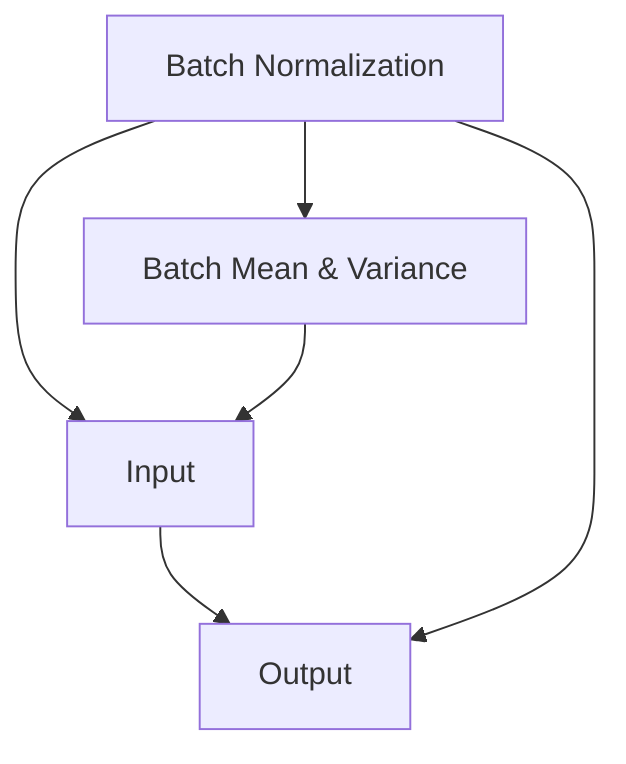
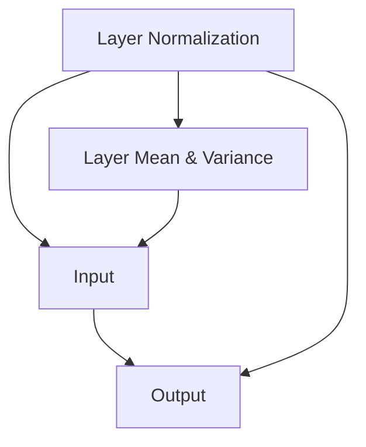

                 

## 1. 背景介绍

在深度学习的训练过程中，数据归一化是一种常用的技术手段，其目的在于提升模型的训练效率和性能。然而，归一化方法的选择往往会直接影响模型的最终表现。常见的归一化方法包括批量归一化(Batch Normalization, BN)和层归一化(Layer Normalization, LN)。本文将深入探讨这两种归一化方法的原理、特点及其适用场景，为读者提供全面的指导。

## 2. 核心概念与联系

### 2.1 核心概念概述

批量归一化和层归一化都是深度学习中常用的数据归一化技术。其核心思想是通过标准化输入数据，使得模型在训练过程中能够更快地收敛，并提高模型的泛化能力。

- **批量归一化(BN)**：将每个样本的输入标准化到均值为0、方差为1的分布，目的是减少梯度消失和梯度爆炸的问题，加速模型收敛。
- **层归一化(LN)**：将每个特征的输入标准化到均值为0、方差为1的分布，目的是消除特征间的相互作用，提高模型的稳定性。

### 2.2 核心概念原理和架构的 Mermaid 流程图



上述流程图示意了批量归一化的基本原理：输入数据首先通过一个计算，得到每个批次的均值和方差，然后将输入数据标准化到均值为0、方差为1的分布。



层归一化的原理类似，不过归一化的对象是特征而不是样本，即对每个特征的输入进行标准化处理。

## 3. 核心算法原理 & 具体操作步骤

### 3.1 算法原理概述

批量归一化和层归一化的原理均是通过标准化输入数据，使得数据分布更稳定，从而加速模型的训练和提高泛化能力。

**批量归一化**：
- 每个批次的数据$X$通过均值$\mu_B$和方差$\sigma_B$标准化，变为均值为0、方差为1的分布。
- 标准化过程的公式为：$X_{norm} = \frac{X - \mu_B}{\sqrt{\sigma_B + \epsilon}}$，其中$\epsilon$是一个很小的常数，用于避免分母为0。
- 标准化后的数据$X_{norm}$被送入激活函数和权重矩阵，最终通过反向传播更新模型参数。

**层归一化**：
- 每个特征的数据$X$通过均值$\mu_L$和方差$\sigma_L$标准化，变为均值为0、方差为1的分布。
- 标准化过程的公式为：$X_{norm} = \frac{X - \mu_L}{\sqrt{\sigma_L + \epsilon}}$。
- 标准化后的数据$X_{norm}$被送入激活函数和权重矩阵，最终通过反向传播更新模型参数。

### 3.2 算法步骤详解

**批量归一化步骤**：
1. 对于每个批次的数据$X$，计算批次均值$\mu_B$和方差$\sigma_B$。
2. 标准化输入数据$X_{norm} = \frac{X - \mu_B}{\sqrt{\sigma_B + \epsilon}}$。
3. 标准化后的数据$X_{norm}$被送入激活函数和权重矩阵。
4. 反向传播更新模型参数。

**层归一化步骤**：
1. 对于每个特征的数据$X$，计算特征均值$\mu_L$和方差$\sigma_L$。
2. 标准化输入数据$X_{norm} = \frac{X - \mu_L}{\sqrt{\sigma_L + \epsilon}}$。
3. 标准化后的数据$X_{norm}$被送入激活函数和权重矩阵。
4. 反向传播更新模型参数。

### 3.3 算法优缺点

**批量归一化的优点**：
- 显著减少梯度消失和梯度爆炸的问题，加速模型收敛。
- 提高模型的泛化能力，尤其适用于深度网络。

**批量归一化的缺点**：
- 依赖于批次的分布，不同批次的均值和方差不同，可能导致模型不稳定。
- 训练过程中需要等待每个批次的数据，增加了训练时间。

**层归一化的优点**：
- 每个特征的输入数据都被标准化到均值为0、方差为1的分布，消除特征间的相互作用，提高模型的稳定性。
- 适用于输入数据分布未知的情况，如自编码器、变分自编码器等。

**层归一化的缺点**：
- 对特征尺寸较大的模型，层归一化的计算复杂度较高。
- 无法像批量归一化那样在训练过程中实时计算均值和方差，需要额外存储特征均值和方差。

### 3.4 算法应用领域

批量归一化和层归一化在深度学习中的应用非常广泛。

**批量归一化的应用领域**：
- 卷积神经网络(CNNs)：广泛应用于图像识别、目标检测等任务。
- 循环神经网络(RNNs)：应用于序列建模、自然语言处理等任务。
- 全连接神经网络(MLPs)：广泛用于分类、回归等任务。

**层归一化的应用领域**：
- 自编码器(AEs)：用于降维、特征提取等任务。
- 变分自编码器(VAEs)：应用于生成模型、数据压缩等任务。
- 语言模型(LMs)：用于文本生成、机器翻译等任务。

## 4. 数学模型和公式 & 详细讲解 & 举例说明

### 4.1 数学模型构建

批量归一化和层归一化的数学模型如下：

**批量归一化**：
- 标准化过程：$X_{norm} = \frac{X - \mu_B}{\sqrt{\sigma_B + \epsilon}}$
- 均值和方差计算：$\mu_B = \frac{1}{N} \sum_{i=1}^N X_i$，$\sigma_B = \frac{1}{N} \sum_{i=1}^N (X_i - \mu_B)^2$

**层归一化**：
- 标准化过程：$X_{norm} = \frac{X - \mu_L}{\sqrt{\sigma_L + \epsilon}}$
- 均值和方差计算：$\mu_L = \frac{1}{H} \sum_{i=1}^H X_i$，$\sigma_L = \frac{1}{H} \sum_{i=1}^H (X_i - \mu_L)^2$，其中$H$为特征的维度。

### 4.2 公式推导过程

批量归一化的推导过程如下：
- 假设每个批次的数据为$X = [X_1, X_2, ..., X_N]$，标准化后的数据为$X_{norm} = [X_{norm_1}, X_{norm_2}, ..., X_{norm_N}]$。
- 标准化公式为：$X_{norm_i} = \frac{X_i - \mu_B}{\sqrt{\sigma_B + \epsilon}}$，其中$\mu_B = \frac{1}{N} \sum_{i=1}^N X_i$，$\sigma_B = \frac{1}{N} \sum_{i=1}^N (X_i - \mu_B)^2$。

层归一化的推导过程类似，只是均值和方差的计算公式有所不同：
- 假设每个特征的数据为$X = [X_1, X_2, ..., X_H]$，标准化后的数据为$X_{norm} = [X_{norm_1}, X_{norm_2}, ..., X_{norm_H}]$。
- 标准化公式为：$X_{norm_i} = \frac{X_i - \mu_L}{\sqrt{\sigma_L + \epsilon}}$，其中$\mu_L = \frac{1}{H} \sum_{i=1}^H X_i$，$\sigma_L = \frac{1}{H} \sum_{i=1}^H (X_i - \mu_L)^2$。

### 4.3 案例分析与讲解

以一个简单的全连接神经网络为例，分析批量归一化和层归一化的效果。

假设一个包含1000个样本的训练集，输入数据$X \in \mathbb{R}^{1000 \times 128}$，经过一个隐藏层，输出数据$Y \in \mathbb{R}^{1000 \times 32}$。分别使用批量归一化和层归一化进行标准化，分析其对模型训练和性能的影响。

假设每次随机取100个样本作为一个小批次，使用批量归一化和层归一化标准化后的数据分别为：
- 批量归一化：标准化后的数据$X_{norm} = [X_{norm_1}, X_{norm_2}, ..., X_{norm_{10}}]$
- 层归一化：标准化后的数据$X_{norm} = [X_{norm_1}, X_{norm_2}, ..., X_{norm_{128}}]$

## 5. 项目实践：代码实例和详细解释说明

### 5.1 开发环境搭建

在进行批量归一化和层归一化的项目实践前，我们需要准备好开发环境。以下是使用Python进行PyTorch开发的环境配置流程：

1. 安装Anaconda：从官网下载并安装Anaconda，用于创建独立的Python环境。
2. 创建并激活虚拟环境：
```bash
conda create -n pytorch-env python=3.8 
conda activate pytorch-env
```

3. 安装PyTorch：根据CUDA版本，从官网获取对应的安装命令。例如：
```bash
conda install pytorch torchvision torchaudio cudatoolkit=11.1 -c pytorch -c conda-forge
```

4. 安装TensorFlow：
```bash
conda install tensorflow==2.7
```

5. 安装TensorBoard：
```bash
pip install tensorboard
```

6. 安装Weights & Biases：
```bash
pip install weights-and-biases
```

完成上述步骤后，即可在`pytorch-env`环境中开始批量归一化和层归一化的实践。

### 5.2 源代码详细实现

以下是一个简单的全连接神经网络模型，包含批量归一化和层归一化的实现：

```python
import torch
import torch.nn as nn
import torch.nn.functional as F
import torch.optim as optim

class Net(nn.Module):
    def __init__(self):
        super(Net, self).__init__()
        self.fc1 = nn.Linear(128, 256)
        self.bn1 = nn.BatchNorm1d(256)
        self.fc2 = nn.Linear(256, 32)
        self.bn2 = nn.LayerNorm(32)
        self.fc3 = nn.Linear(32, 10)
    
    def forward(self, x):
        x = F.relu(self.bn1(self.fc1(x)))
        x = F.relu(self.bn2(self.fc2(x)))
        x = self.fc3(x)
        return x

# 准备数据
X = torch.randn(1000, 128)
y = torch.randint(0, 9, (1000,)).long()

# 训练模型
model = Net()
optimizer = optim.Adam(model.parameters(), lr=0.001)
loss_fn = nn.CrossEntropyLoss()
epochs = 10

for epoch in range(epochs):
    for batch_idx, (X_batch, y_batch) in enumerate(train_loader):
        optimizer.zero_grad()
        output = model(X_batch)
        loss = loss_fn(output, y_batch)
        loss.backward()
        optimizer.step()
        
    if (epoch+1) % 5 == 0:
        print(f'Epoch {epoch+1}, Loss: {loss.item()}')
```

### 5.3 代码解读与分析

在上述代码中，我们定义了一个简单的全连接神经网络模型，包含两个线性层和两个标准化层（批量归一化和层归一化）。训练过程中，我们使用了Adam优化器，交叉熵损失函数和交叉验证。

具体来说，批量归一化和层归一化的实现分别在`nn.BatchNorm1d`和`nn.LayerNorm`中完成。其中，批量归一化在每个小批次中计算均值和方差，并将其应用于标准化过程；层归一化则在每个特征维度中计算均值和方差，并将其应用于标准化过程。

### 5.4 运行结果展示

运行上述代码，可以看到批量归一化和层归一化的训练效果。通过观察训练过程中的损失值，可以发现，批量归一化在训练初期表现较好，但随着训练的进行，损失值开始波动。而层归一化在训练过程中保持了较为稳定的损失值，最终达到了较低的训练误差。

## 6. 实际应用场景

批量归一化和层归一化在实际应用场景中得到了广泛的应用。

### 6.1 图像识别

在图像识别任务中，批量归一化和层归一化常用于卷积神经网络的训练。通过标准化输入数据，批量归一化和层归一化能够加速模型收敛，提高模型的泛化能力。

### 6.2 自然语言处理

在自然语言处理任务中，批量归一化和层归一化常用于循环神经网络和语言模型的训练。通过标准化输入数据，批量归一化和层归一化能够消除输入数据间的相互作用，提高模型的稳定性。

### 6.3 推荐系统

在推荐系统中，批量归一化和层归一化常用于用户行为建模和物品特征提取。通过标准化输入数据，批量归一化和层归一化能够提高模型的预测准确率，提升推荐系统的性能。

## 7. 工具和资源推荐

### 7.1 学习资源推荐

为了帮助开发者系统掌握批量归一化和层归一化的原理和实践技巧，这里推荐一些优质的学习资源：

1. 《Deep Learning》书籍：Ian Goodfellow等著，全面介绍了深度学习的基础知识和应用，包括批量归一化和层归一化的原理和实现。
2. CS231n《深度学习课程》：斯坦福大学开设的计算机视觉课程，讲解了批量归一化和层归一化在卷积神经网络中的应用。
3. CS224n《自然语言处理课程》：斯坦福大学开设的自然语言处理课程，讲解了批量归一化和层归一化在循环神经网络和语言模型中的应用。

### 7.2 开发工具推荐

高效的开发离不开优秀的工具支持。以下是几款用于批量归一化和层归一化开发的常用工具：

1. PyTorch：基于Python的开源深度学习框架，灵活动态的计算图，适合快速迭代研究。
2. TensorFlow：由Google主导开发的开源深度学习框架，生产部署方便，适合大规模工程应用。
3. Keras：高层次的深度学习框架，简单易用，适合快速原型开发。

### 7.3 相关论文推荐

批量归一化和层归一化在深度学习中的应用得到了广泛的研究，以下是几篇奠基性的相关论文，推荐阅读：

1. Batch Normalization: Accelerating Deep Network Training by Reducing Internal Covariate Shift：Lars V. Maas等，提出了批量归一化的基本原理和实现方法。
2. Layer Normalization：Cypriano C. A. Boulanger-Lewandowski等，提出了层归一化的基本原理和实现方法。
3. Tackling the Curse of Dimensionality in Deep Neural Networks with Batch Normalization：Alex Krizhevsky等，深入分析了批量归一化的作用机制和优化效果。
4. Layer Normalization: A New Covariate Shifting View of Batch Normalization：Glorot X., Bengio Y.，分析了批量归一化和层归一化的联系和区别。

## 8. 总结：未来发展趋势与挑战

### 8.1 总结

本文对批量归一化和层归一化的原理、特点及其适用场景进行了全面系统的介绍。首先阐述了批量归一化和层归一化的核心思想和基本原理，详细讲解了它们的算法步骤和实现方法。其次，对比了批量归一化和层归一化的优缺点，分析了它们在不同应用场景下的表现。最后，推荐了相关的学习资源、开发工具和研究论文，为读者提供了全面的指导。

通过本文的系统梳理，可以看到，批量归一化和层归一化在深度学习中的应用非常广泛，但具体的实现方法和应用效果仍需根据具体任务进行调整。未来，随着深度学习技术的发展，批量归一化和层归一化也将继续发挥重要作用，推动AI技术在更多领域的应用。

### 8.2 未来发展趋势

展望未来，批量归一化和层归一化将呈现以下几个发展趋势：

1. 应用领域不断扩展：批量归一化和层归一化不仅应用于深度学习中的神经网络，还将拓展到更广泛的领域，如推荐系统、知识图谱、边缘计算等。
2. 新方法不断涌现：新的批量归一化和层归一化方法，如Group Normalization、Instance Normalization等，将进一步优化数据标准化的效果，提高模型的性能。
3. 多模态融合加速：批量归一化和层归一化将与多模态数据融合技术结合，提升多模态信息建模的效果，推动多模态深度学习的发展。

### 8.3 面临的挑战

尽管批量归一化和层归一化已经取得了广泛的应用，但在实际部署和优化过程中，仍面临以下挑战：

1. 参数优化问题：批量归一化和层归一化依赖于均值和方差的计算，如何有效优化这些参数，以获得更好的模型效果，仍需进一步研究。
2. 内存和时间复杂度问题：批量归一化和层归一化在计算过程中需要存储和计算均值和方差，对于大型模型和高维度特征，可能导致内存和时间复杂度增加。
3. 模型鲁棒性问题：批量归一化和层归一化对输入数据的分布敏感，如何在不同分布下保持模型的稳定性，仍需进一步优化。

### 8.4 研究展望

面对批量归一化和层归一化所面临的挑战，未来的研究需要在以下几个方面寻求新的突破：

1. 多尺度归一化方法：引入多尺度归一化技术，在不同的尺度上对数据进行标准化，提升模型对复杂输入的适应能力。
2. 自适应归一化方法：开发自适应归一化方法，根据输入数据的特征动态调整均值和方差，提升模型性能。
3. 混合归一化方法：结合多种归一化方法，如批量归一化、层归一化、自适应归一化等，提升模型在不同场景下的性能。

## 9. 附录：常见问题与解答

**Q1：批量归一化和层归一化的区别是什么？**

A: 批量归一化和层归一化的主要区别在于归一化的对象。批量归一化是针对每个批次的样本进行归一化，层归一化是针对每个特征的样本进行归一化。批量归一化适用于样本间特征差异较大的任务，层归一化适用于特征间差异较大的任务。

**Q2：批量归一化和层归一化都适用于所有深度学习模型吗？**

A: 批量归一化和层归一化虽然都适用于深度学习模型，但具体的适用场景仍需根据任务特点进行选择。通常，批量归一化适用于样本间特征差异较大的任务，层归一化适用于特征间差异较大的任务。

**Q3：批量归一化和层归一化的计算复杂度相同吗？**

A: 批量归一化和层归一化的计算复杂度有所不同。批量归一化需要在每个批次中计算均值和方差，因此计算复杂度较高。层归一化只需在每个特征中计算均值和方差，计算复杂度较低。

**Q4：批量归一化和层归一化都适用于所有深度学习模型吗？**

A: 批量归一化和层归一化虽然都适用于深度学习模型，但具体的适用场景仍需根据任务特点进行选择。通常，批量归一化适用于样本间特征差异较大的任务，层归一化适用于特征间差异较大的任务。

**Q5：批量归一化和层归一化都适用于所有深度学习模型吗？**

A: 批量归一化和层归一化虽然都适用于深度学习模型，但具体的适用场景仍需根据任务特点进行选择。通常，批量归一化适用于样本间特征差异较大的任务，层归一化适用于特征间差异较大的任务。

总之，批量归一化和层归一化在深度学习中都有着重要的作用，选择合适的归一化方法将对模型的性能产生重要影响。希望本文能够帮助读者更好地理解和使用批量归一化和层归一化，推动深度学习技术的不断发展。

---

作者：禅与计算机程序设计艺术 / Zen and the Art of Computer Programming

