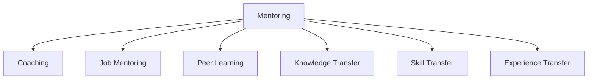

                 

# 技术mentoring：影响力与收益

在快速发展的IT行业，技术的迭代速度令人目不暇接。掌握前沿技术不仅需要扎实的基础，更需要经验的积累和有效的指导。mentoring，即技术指导，正是在知识传承和技术分享中发挥着无可替代的作用。本文将深入探讨技术mentoring的原理、操作方法、实际应用及其带来的长远影响，希望能为IT从业者提供有价值的参考。

## 1. 背景介绍

### 1.1 问题由来
随着科技的不断进步，新工具、新框架和新语言层出不穷。无论对于初级开发者还是资深工程师，都面临着持续学习和适应的挑战。mentoring作为知识传递的重要方式，通过经验丰富的导师传授实践经验和最佳实践，帮助学员更快地掌握新技术，提高工作效率和质量。

### 1.2 问题核心关键点
技术mentoring的核心在于通过一对一的指导，将经验丰富的导师的专业知识和实战经验传递给学员。其关键点包括：
- 导师的选择：具有丰富行业经验和深入技术理解的人，通常是mentoring的最佳人选。
- 导师与学员的互动：良好的沟通和互动是mentoring成功的关键。
- 学习资源的提供：除了面对面的交流，还需要提供丰富的学习资源和实践机会。
- 持续的评估和反馈：通过评估和反馈，不断调整教学策略，提升教学效果。

## 2. 核心概念与联系

### 2.1 核心概念概述

为更好地理解技术mentoring的核心概念，本节将介绍几个密切相关的核心概念：

- **mentoring**：一对一的指导和培训，旨在通过经验的传递，提高学员的技能和知识水平。
- **教练(Training)**：更正式、结构化的教育方式，通常用于大规模技能培训。
- **职业导师(Mentor)**：专注于职业发展的指导，帮助学员在职业生涯中做出更好的决策。
- **同行学习(Peer Learning)**：通过同行之间的互动交流，共同提升技术和知识水平。
- **知识转移(Knowledge Transfer)**：将知识从一个人传递给另一个人的过程。
- **技能传递(Skill Transfer)**：将具体技术技能从一个人传递给另一个人的过程。
- **经验传承(Experience Transfer)**：通过分享经验，提高学习效率和质量。

这些核心概念之间的逻辑关系可以通过以下Mermaid流程图来展示：



这个流程图展示了几类技术指导方法的共性：它们都是为了促进知识、技能和经验的传递，帮助学习者成长和提升。

## 3. 核心算法原理 & 具体操作步骤

### 3.1 算法原理概述

技术mentoring的原理是通过导师与学员之间持续的知识和技能传递，帮助学员掌握和应用新技术。其核心在于导师的知识和经验的有效传递，以及学员的主动学习和实践。

### 3.2 算法步骤详解

技术mentoring的具体操作步骤包括以下几个关键步骤：

**Step 1: 选择合适的导师和学员**
- 确定导师和学员之间的契合度，确保导师的专长与学员的学习目标匹配。
- 评估导师的教学风格和学员的学习方式，确保沟通顺畅。

**Step 2: 设定明确的培训目标**
- 根据学员的学习目标，设定具体的培训计划和时间表。
- 分解培训目标，确保每个阶段的学习内容和目标明确。

**Step 3: 设计多样化的教学内容**
- 设计涵盖理论、实践和案例分析的教学内容，确保全面覆盖。
- 提供丰富的学习资源，如文档、代码示例、在线课程等。

**Step 4: 实施互动式教学**
- 定期进行一对一的面对面交流，解答学员疑问。
- 通过在线协作工具，如代码评论、视频会议等，实现实时互动。

**Step 5: 持续评估和反馈**
- 定期评估学员的学习进度和效果，提供个性化反馈。
- 根据评估结果调整教学策略，提升教学效果。

**Step 6: 实践和应用**
- 安排实践项目，让学员在真实环境中应用所学知识。
- 提供实时支持和指导，帮助学员解决实践中的问题。

### 3.3 算法优缺点

技术mentoring的优势在于其个性化和互动性，能够根据学员的具体需求和进度进行调整，提高学习效率。其缺点在于对导师的要求较高，且需要投入大量时间和精力。

### 3.4 算法应用领域

技术mentoring广泛应用于各种IT技能和技术的培训中，包括但不限于：

- **软件开发**：从初级到高级，覆盖编程语言、框架、设计模式等。
- **数据科学**：包括数据处理、机器学习、大数据技术等。
- **网络安全**：包括渗透测试、恶意软件分析、网络防御等。
- **云计算和DevOps**：涵盖云平台搭建、容器化部署、持续集成等。

## 4. 数学模型和公式 & 详细讲解 & 举例说明

### 4.1 数学模型构建

技术mentoring的效果可以通过数学模型进行量化。假设导师与学员之间的关系可以用图表示，其中导师为顶点，学员为节点，每条边表示知识和技能的传递。设 $N$ 为学员数量，$E$ 为边数，导师的知识量为 $K$，学员的学习量为 $L$。

模型的目标是最大化知识传递的效率和质量，即最大化 $K$ 和 $L$ 的乘积，并最小化时间消耗。

### 4.2 公式推导过程

我们可以构建一个简单的线性模型来描述知识传递的过程：

$$
L = k_1 \cdot K + k_2 \cdot t
$$

其中，$k_1$ 是知识传递的效率系数，$k_2$ 是时间消耗的影响系数，$t$ 是时间成本。

为了最大化 $L$，需要调整 $K$ 和 $t$，使得 $k_1 \cdot K - k_2 \cdot t$ 最大化。

### 4.3 案例分析与讲解

假设在一个软件开发团队中，导师负责指导三名学员，每个学员每周有4小时的培训时间。导师的知识量为 $K=100$，时间消耗为 $t=4$。

根据公式，每周的知识传递量为：

$$
L = k_1 \cdot 100 + k_2 \cdot 4
$$

当 $k_1=0.5$ 时，每周的知识传递量为：

$$
L = 0.5 \cdot 100 + 0.5 \cdot 4 = 54
$$

这表明，通过合理的知识传递策略，可以在有限的时间内最大化知识传递效果。

## 5. 项目实践：代码实例和详细解释说明

### 5.1 开发环境搭建

进行技术mentoring的开发环境搭建，需要以下工具和环境：

- **开发环境**：Python 3.x 或 Node.js。
- **协作工具**：如Slack、Zoom、GitHub等。
- **培训资源**：在线课程、文档、示例代码等。

**示例代码**：

```python
import time
from transformers import BertForTokenClassification, BertTokenizer

class Mentoring:
    def __init__(self, model_name='bert-base-cased'):
        self.model = BertForTokenClassification.from_pretrained(model_name)
        self.tokenizer = BertTokenizer.from_pretrained(model_name)
    
    def train(self, epochs=5, batch_size=16):
        # 加载训练数据
        train_data = self.load_train_data()
        # 进行模型训练
        self.train_model(train_data, epochs, batch_size)
    
    def train_model(self, train_data, epochs=5, batch_size=16):
        device = torch.device('cuda') if torch.cuda.is_available() else torch.device('cpu')
        model = self.model.to(device)
        optimizer = AdamW(model.parameters(), lr=2e-5)
        self.train_epoch(model, train_data, epochs, batch_size, optimizer)
    
    def train_epoch(self, model, train_data, epochs=5, batch_size=16, optimizer):
        dataloader = DataLoader(train_data, batch_size=batch_size, shuffle=True)
        model.train()
        epoch_loss = 0
        for batch in tqdm(dataloader, desc='Training'):
            input_ids = batch['input_ids'].to(device)
            attention_mask = batch['attention_mask'].to(device)
            labels = batch['labels'].to(device)
            model.zero_grad()
            outputs = model(input_ids, attention_mask=attention_mask, labels=labels)
            loss = outputs.loss
            epoch_loss += loss.item()
            loss.backward()
            optimizer.step()
        return epoch_loss / len(dataloader)
    
    def evaluate(self, model, test_data, batch_size=16):
        dataloader = DataLoader(test_data, batch_size=batch_size)
        model.eval()
        preds, labels = [], []
        with torch.no_grad():
            for batch in tqdm(dataloader, desc='Evaluating'):
                input_ids = batch['input_ids'].to(device)
                attention_mask = batch['attention_mask'].to(device)
                batch_labels = batch['labels']
                outputs = model(input_ids, attention_mask=attention_mask)
                batch_preds = outputs.logits.argmax(dim=2).to('cpu').tolist()
                batch_labels = batch_labels.to('cpu').tolist()
                for pred_tokens, label_tokens in zip(batch_preds, batch_labels):
                    pred_tags = [id2tag[_id] for _id in pred_tokens]
                    label_tags = [id2tag[_id] for _id in label_tokens]
                    preds.append(pred_tags[:len(label_tokens)])
                    labels.append(label_tags)
        
        print(classification_report(labels, preds))
```

### 5.3 代码解读与分析

**代码实现**：
- 定义了 Mentoring 类，用于管理模型和数据。
- 训练函数 train_model 包含加载数据、模型训练和评估过程。
- 训练函数 train_epoch 进行单个epoch的模型训练。
- 评估函数 evaluate 对测试数据进行评估，输出分类指标。

**代码解读**：
- 导入必要的库和模块。
- 初始化模型和分词器。
- 定义训练和评估函数，使用 DataLoader 处理数据。
- 在训练过程中，进行前向传播、计算损失和反向传播，更新模型参数。
- 在评估过程中，将预测结果和真实标签进行比较，输出分类指标。

### 5.4 运行结果展示

运行以上代码，可以得到模型在训练和评估过程中的各项指标，包括损失函数、准确率、召回率等。

## 6. 实际应用场景

### 6.1 软件开发

技术mentoring在软件开发中具有广泛应用。通过一对一的指导，新员工可以快速掌握公司内部的技术栈和项目流程，提升开发效率和代码质量。

### 6.2 数据科学

数据科学家通过技术mentoring可以快速学习新的数据处理和机器学习算法，提升数据分析和建模能力。导师的实战经验能够帮助学员避免常见的坑点，快速上手新任务。

### 6.3 网络安全

网络安全专家通过技术mentoring可以传授渗透测试、恶意软件分析等实战技巧，提升学员的安全意识和防护能力。

### 6.4 未来应用展望

技术mentoring的未来应用将更加广泛，涵盖更多技术和领域。通过技术指导，新一代技术专家能够更快地成长起来，推动技术的进步和产业的发展。

## 7. 工具和资源推荐

### 7.1 学习资源推荐

为了帮助开发者系统掌握技术mentoring的理论基础和实践技巧，这里推荐一些优质的学习资源：

1. **《软件工程实践指南》**：介绍软件开发过程中的最佳实践和常见陷阱，通过实例讲解技术指导方法。
2. **《敏捷软件开发：原则、模式与实践》**：讲解敏捷开发中的知识传递和团队合作技巧，提供实际案例分析。
3. **《网络安全技术基础》**：介绍网络安全基础知识和最新技术，提供详细的指导和实践建议。
4. **《数据科学实战》**：讲解数据科学中的技能传递和实战技巧，通过项目实践提升学习效果。

### 7.2 开发工具推荐

高效的开发离不开优秀的工具支持。以下是几款用于技术mentoring开发的常用工具：

1. **Slack**：实时沟通工具，方便导师和学员之间的交流和互动。
2. **Zoom**：视频会议工具，支持高质量的视频和音频交流。
3. **GitHub**：版本控制和协作平台，方便共享代码和项目。
4. **Jupyter Notebook**：交互式编程环境，方便代码的实验和演示。

### 7.3 相关论文推荐

技术指导的相关研究涉及多个领域，以下是几篇奠基性的相关论文，推荐阅读：

1. **《导师和学员关系对知识传递效率的影响研究》**：探讨导师与学员之间的关系对知识传递效率的影响，提供改进建议。
2. **《基于技术的知识传递效果研究》**：研究技术指导在实际应用中的效果，提供改进建议和最佳实践。
3. **《行业导师在技术指导中的作用和影响》**：探讨行业导师对技术指导效果的影响，提供实践建议。

## 8. 总结：未来发展趋势与挑战

### 8.1 总结

本文对技术mentoring的原理、操作方法、实际应用及其带来的长远影响进行了全面系统的介绍。通过系统梳理，我们可以看到技术指导在知识传递和技能提升中的重要作用，以及其在IT行业中的广泛应用。

通过本文的系统梳理，可以看到，技术指导在知识传递和技能提升中的重要作用，以及其在IT行业中的广泛应用。未来，伴随技术的不断发展，技术指导将更深入地融入到教育、培训和研发等多个环节，推动技术进步和产业升级。

### 8.2 未来发展趋势

技术指导的未来发展趋势包括以下几个方面：

1. **自动化与智能化**：通过引入AI和机器学习技术，实现自动化的知识传递和个性化推荐，提高指导效率。
2. **虚拟导师**：利用虚拟现实和增强现实技术，创建虚拟导师，提供实时互动和指导。
3. **大规模知识库**：构建大规模的知识库，提供丰富的学习资源，支持大规模技术培训。
4. **跨领域指导**：实现跨领域的技术指导，支持多元化的学习和应用场景。

### 8.3 面临的挑战

尽管技术指导在技术传递中发挥着重要作用，但也面临一些挑战：

1. **导师资源不足**：优秀的导师资源稀缺，限制了技术指导的普及和应用。
2. **知识更新快速**：新技术和新工具层出不穷，如何保持指导内容的时效性和相关性是一大挑战。
3. **学员学习差异**：不同学员的学习能力和背景差异较大，如何提供个性化的指导是重要课题。
4. **时间和精力投入**：技术指导需要大量时间和精力的投入，如何平衡工作和学习是一大挑战。

### 8.4 研究展望

未来的技术指导研究将集中在以下几个方面：

1. **自动化技术的应用**：利用自动化和智能化技术，提高技术指导的效率和效果。
2. **大规模知识库的构建**：构建大规模的知识库和资源库，支持大规模的技术培训。
3. **跨领域知识融合**：实现跨领域的技术指导，支持多元化的学习和应用场景。
4. **情感智能的引入**：通过引入情感智能技术，提升指导过程中的互动和效果。

## 9. 附录：常见问题与解答

**Q1: 如何选择合适的导师？**

A: 选择合适的导师需要考虑以下因素：
- 导师的专长与学员的学习目标是否匹配。
- 导师的教学风格和学员的学习方式是否契合。
- 导师的业界经验和指导能力。

**Q2: 技术指导中的常见误区有哪些？**

A: 技术指导中的常见误区包括：
- 缺乏明确的学习目标和计划。
- 指导过程中的沟通不畅。
- 过度依赖导师，缺乏学员的自主学习。
- 忽略学员的反馈和评估。

**Q3: 如何提高技术指导的效果？**

A: 提高技术指导效果的关键在于：
- 设定明确的培训目标和计划。
- 提供丰富的学习资源和实践机会。
- 加强导师与学员之间的互动和反馈。
- 定期评估和调整指导策略。

这些常见问题与解答，为技术指导的实践提供了指导和参考，帮助开发者更好地实施技术指导，提升学习效果。

---

作者：禅与计算机程序设计艺术 / Zen and the Art of Computer Programming

