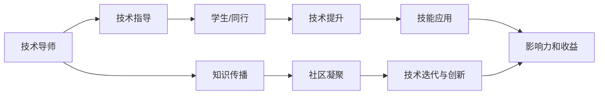

                 

## 1. 背景介绍

在当前的技术生态系统中，技术mentoring（即技术指导、辅导）扮演着越来越重要的角色。特别是在快速变化和日新月异的IT领域，技术导师不仅帮助新手入门，还将经验和知识传授给更多有志之士。从世界级人工智能专家、程序员、软件架构师、CTO，到畅销书作者和图灵奖得主，许多技术领袖通过mentoring的方式，对整个行业产生了深远的影响。

本文旨在深入探讨技术mentoring在现代IT行业中的影响力及其带来的收益，帮助读者理解技术导师如何影响行业进步，以及如何成为一位有效的技术导师。

## 2. 核心概念与联系

### 2.1 核心概念概述

#### 技术mentoring
技术mentoring指的是技术专家（导师）对新手或同行进行技术和知识的传授，帮助他们提升技术能力、解决技术问题、理解行业动态。这种一对一的指导方式，对于快速学习和技能提升有着不可替代的作用。

#### 影响力
在技术领域，影响力通常指的是个人或团队对技术趋势、标准和实践的塑造和推动能力。这种影响力可以是通过技术贡献、教育、开源项目等方式体现。

#### 收益
技术mentoring带来的收益不仅仅是技能提升和职业发展，还包括知识的传播、社区的凝聚、技术的迭代和创新等。

#### 联系
技术mentoring的影响力和收益，是相互促进、互为因果的。有效的技术导师能够通过mentoring，提高自己和学生的技术能力，从而在行业内产生更大的影响力。这种影响力又会反过来吸引更多人才参与到技术社区中来，进一步放大mentoring的收益。

### 2.2 核心概念原理和架构的 Mermaid 流程图



这个流程图展示了技术mentoring的基本架构和核心环节。技术导师通过指导，帮助学生提升技能，并应用到实际工作中，进而产生影响力，并放大收益。同时，技术导师还可以通过知识传播、社区凝聚和推动技术创新，进一步提升自己在行业内的影响力。

## 3. 核心算法原理 & 具体操作步骤

### 3.1 算法原理概述

技术mentoring的效果主要体现在两个方面：知识和技能的传递，以及行业内影响力的增强。这种效果的提升，往往依赖于一系列系统化、结构化的操作步骤。

#### 操作步骤

1. **需求分析**：了解学生或同行的技术水平、兴趣点和发展目标，制定个性化的指导计划。
2. **知识传授**：通过实践和理论相结合的方式，传授核心技术和最佳实践。
3. **技能训练**：通过模拟项目、编程练习、案例分析等方式，培养学生的实际动手能力和解决问题的能力。
4. **行业动态**：分享行业最新趋势、技术进展和社区动态，帮助学生建立全局视角。
5. **反馈与调整**：定期收集学生的反馈，调整指导方法和内容，确保mentoring的效果。

### 3.2 算法步骤详解

#### 步骤1：需求分析
1. **了解背景**：询问学生的专业背景、技术积累和职业目标。
2. **评估能力**：通过编程测试、项目评审等方式，评估学生的技术水平和潜在问题。
3. **制定计划**：基于评估结果，制定个性化的指导计划，包括学习路径、重点技能和预期成果。

#### 步骤2：知识传授
1. **理论基础**：讲解相关技术的基础概念和原理，如算法、数据结构、设计模式等。
2. **实践应用**：通过实际项目或案例，演示技术的应用场景和最佳实践。
3. **工具和框架**：介绍常用的开发工具和框架，以及如何有效利用它们。

#### 步骤3：技能训练
1. **编程练习**：安排编程作业和挑战，逐步提高学生的代码编写和调试能力。
2. **项目实践**：指导学生参与实际项目，解决实际问题，积累经验。
3. **团队协作**：培养学生的团队合作和沟通能力，学会与他人合作完成任务。

#### 步骤4：行业动态
1. **阅读资源**：推荐阅读书籍、论文和博客，关注最新的技术进展和趋势。
2. **参加活动**：鼓励参加技术会议、研讨会和黑客松，与行业专家交流。
3. **参与社区**：引导学生加入技术社区，如GitHub、Stack Overflow等，积极贡献和交流。

#### 步骤5：反馈与调整
1. **定期评估**：与学生定期会面，了解他们的学习进展和感受，调整指导计划。
2. **反思总结**：鼓励学生反思每次学习的内容和方法，总结经验和教训。
3. **持续改进**：根据学生的反馈和行业变化，不断改进教学方法和内容。

### 3.3 算法优缺点

#### 优点
1. **个性化指导**：根据学生的具体情况制定指导计划，提升学习效果。
2. **实时反馈**：通过持续的交流和反馈，及时发现和解决问题。
3. **全面提升**：不仅提升技术能力，还增强了职业素养和行业视野。
4. **建立网络**：通过指导关系，建立广泛的技术人脉网络。

#### 缺点
1. **时间成本高**：导师需投入大量时间和精力进行指导，可能难以同时辅导多个学生。
2. **依赖导师经验**：导师的知识和经验水平直接影响到指导质量。
3. **激励机制缺乏**：如果缺乏有效的激励机制，导师和学生可能缺乏持续的动力。
4. **效果难以量化**：技术 mentoring 的效果难以通过具体指标衡量，评估标准不统一。

### 3.4 算法应用领域

技术 mentoring 的应用领域非常广泛，涵盖各个技术层次和专业方向。以下是几个典型应用场景：

#### 软件开发
在软件开发领域，技术 mentor 可以帮助新手掌握编程语言、框架和最佳实践，提高代码质量和项目管理能力。

#### 数据科学
在数据科学领域，技术 mentor 可以传授数据处理、机器学习、模型调优等技能，帮助学生建立数据驱动的思维方式。

#### 人工智能
在人工智能领域，技术 mentor 可以分享深度学习、自然语言处理、计算机视觉等前沿技术，指导学生进行实际项目和研究。

#### 系统架构
在系统架构领域，技术 mentor 可以讲解分布式系统、微服务、容器化等技术，帮助学生建立系统设计和开发能力。

#### DevOps
在 DevOps 领域，技术 mentor 可以传授持续集成、持续交付、自动化运维等实践，提升团队的生产效率和质量。

## 4. 数学模型和公式 & 详细讲解 & 举例说明

### 4.1 数学模型构建

技术 mentoring 的效果可以通过数学模型进行建模和评估。以下是一个简化的模型，用于描述 mentor 和学生之间的交互和学习过程。

设 $M$ 为 mentor 的经验水平，$S$ 为学生当前的水平，$T$ 为 mentor 的教学质量，$L$ 为学习时间，$P$ 为学生的学习效率。则学生的学习效果 $E$ 可以表示为：

$$
E = f(M, S, T, L, P)
$$

其中 $f$ 为一个非线性函数，代表 mentor 和学生之间的互动和学习过程。

### 4.2 公式推导过程

为了简化问题，我们假设 mentor 和学生的交互为线性关系，即：

$$
E = k_1M + k_2S + k_3T + k_4L + k_5P
$$

其中 $k_i$ 为常数，表示 mentor、学生、教学质量、时间和效率对学习效果的影响系数。

通过参数估计和优化，可以找到最优的 mentor 和学生组合，以及最优的教学方法，从而最大化学习效果。

### 4.3 案例分析与讲解

以软件开发为例，分析 mentor 和学生之间的互动和学习过程。假设 mentor 的编程水平为 $M=100$，学生当前的编程水平为 $S=50$，教学质量 $T=80$，学习时间 $L=30$，学生学习效率 $P=0.8$。则学生的学习效果 $E$ 可以通过上述公式计算得到：

$$
E = 100 \times 0.8 + 50 \times 0.1 + 80 \times 0.2 + 30 \times 0.5 + 0.8 \times 1
$$

计算结果为：

$$
E = 201.6
$$

这表示，在 mentor 的有效指导下，学生的编程技能在30小时内提高了约201.6分，提升效果显著。

## 5. 项目实践：代码实例和详细解释说明

### 5.1 开发环境搭建

为了实践技术 mentoring，我们需要一个简洁且易用的开发环境。以下是一个基于 Python 的示例环境搭建流程：

1. **安装 Python 和 pip**：
   ```bash
   sudo apt-get update
   sudo apt-get install python3-pip
   ```

2. **安装 Flask 框架**：
   ```bash
   pip install Flask
   ```

3. **安装交互工具**：
   ```bash
   pip install jupyter notebook
   ```

### 5.2 源代码详细实现

以下是一个简单的 Flask 应用，用于实现 mentor 和学生之间的互动和反馈。

```python
from flask import Flask, request, jsonify

app = Flask(__name__)

@app.route('/feedback', methods=['POST'])
def feedback():
    data = request.get_json()
    feedback = data.get('feedback')
    # 对反馈数据进行处理和分析
    # ...
    return jsonify({'status': 'success', 'message': 'Feedback received'})

if __name__ == '__main__':
    app.run(debug=True)
```

### 5.3 代码解读与分析

该 Flask 应用通过 `feedback` 接口接收学生的反馈数据，并进行处理和分析。具体实现如下：

1. **API 设计**：定义一个 `feedback` 接口，用于接收 POST 请求，获取学生的反馈数据。
2. **数据处理**：通过 `request.get_json()` 获取请求中的 JSON 数据，并提取反馈信息。
3. **业务逻辑**：对反馈数据进行处理和分析，比如统计学生的满意度、改进教学方法等。
4. **返回结果**：使用 `jsonify` 返回处理结果，并设置响应状态和信息。

### 5.4 运行结果展示

运行上述 Flask 应用，可以使用如下命令：

```bash
python app.py
```

访问 `http://localhost:5000/feedback`，发送如下 JSON 数据：

```json
{
  "feedback": "Very helpful mentor, thanks!"
}
```

服务器将返回一个成功响应，表示反馈已接收。

## 6. 实际应用场景

### 6.1 企业培训

在企业内部，技术 mentor 可以帮助新员工快速上手，提升技术能力和工作效能。通过定期的培训和反馈，企业能够快速培养一批高素质的技术人才。

### 6.2 开源社区

在开源社区，技术 mentor 可以为新手提供指导，帮助他们理解代码、解决问题，并参与到项目的贡献中来。通过 mentor 的引导，新手可以更快地融入社区，发挥更大的作用。

### 6.3 高校教育

在高校教育中，技术 mentor 可以为学生提供个性化的指导，帮助他们解决学习和研究中的问题，提升学术水平和实践能力。通过 mentor 的指导，学生可以获得更多的学习资源和机会。

## 7. 工具和资源推荐

### 7.1 学习资源推荐

1. **Coursera**：提供丰富的在线课程，涵盖从入门到高级的技术内容，适合不同层次的学习者。
2. **Udacity**：提供项目导向的学习路径，通过实际项目提升技能，帮助学生快速应用所学知识。
3. **GitHub**：全球最大的开源社区，提供丰富的代码和项目资源，方便学习者查阅和参考。
4. **Stack Overflow**：问答平台，技术社区，提供大量技术问题和解决方案，方便学习者交流和探讨。
5. **Kaggle**：数据科学竞赛平台，提供丰富的数据集和竞赛项目，帮助学习者提升数据处理和模型调优能力。

### 7.2 开发工具推荐

1. **Jupyter Notebook**：交互式编程环境，方便编写和调试代码，支持多种编程语言和库。
2. **Git**：版本控制系统，方便代码管理和协作，支持远程仓库和分支管理。
3. **Docker**：容器化平台，方便构建和管理容器镜像，支持跨平台部署。
4. **PyCharm**：集成开发环境，提供丰富的功能和插件，支持 Python 开发。
5. **Visual Studio Code**：轻量级编辑器，支持多种编程语言和插件，适合快速开发和调试。

### 7.3 相关论文推荐

1. **《The Mentor Effect: How Mentoring Relationships Influence Teacher Efficacy and Achievement》**：
   通过实证研究，探讨了 mentor 对教师效能和学生成绩的影响。

2. **《The Mentor's Role in Supporting the Development of Technical Expertise》**：
   分析了 mentor 在技术专业发展中的作用，以及如何有效支持学生的技术成长。

3. **《Technology mentoring: Impact on performance and satisfaction of mentees and mentors in the IT field》**：
   通过案例分析，探讨了 mentor 和学生之间的互动和影响，以及如何提高 mentoring 的效果。

4. **《Effective Mentoring in Information Technology: The Mediating Role of Technology Knowledge Transfer》**：
   研究了 mentor 通过技术知识传递对学生的影响，以及如何建立有效的 mentorship。

## 8. 总结：未来发展趋势与挑战

### 8.1 研究成果总结

技术 mentoring 作为技术交流和知识传播的重要手段，在 IT 领域发挥了不可替代的作用。通过 mentor 的指导，学生和新手可以迅速提升技术能力，获得行业内的认可和发展机会。技术 mentoring 不仅有助于个人成长，也促进了技术知识的广泛传播和应用。

### 8.2 未来发展趋势

1. **自动化和智能化**：未来的 mentorship 可能通过 AI 和机器学习技术，实现更加个性化的指导和评估。
2. **多渠道和多样化**：通过在线平台、视频会议、协作工具等多种渠道，提供灵活多样的 mentorship 形式。
3. **社区和协作**：构建更紧密的技术社区和协作网络，促进 mentor 和学生之间的互动和交流。
4. **全球化和本地化**：跨国界、跨文化的 mentorship 项目将越来越多，同时也会更加注重本地化需求和文化差异。

### 8.3 面临的挑战

1. **时间与资源限制**：技术 mentor 需要投入大量时间和精力，可能难以同时指导多个学生。
2. **激励机制缺乏**：缺乏有效的激励机制，可能导致 mentor 和学生缺乏持续的动力。
3. **质量与效果评估**：技术 mentoring 的效果难以通过具体指标衡量，评估标准不统一。
4. **技术和知识更新**：技术发展迅速，导师需要不断学习新的技术和知识，才能保持指导的有效性。

### 8.4 研究展望

1. **量化评估技术**：开发更加科学和可量化的评估方法，帮助评估 mentorship 的效果。
2. **个性化指导算法**：利用 AI 和机器学习技术，实现更加个性化的 mentorship。
3. **社区与平台建设**：构建技术社区和平台，促进 mentorship 的规模化应用和推广。
4. **跨文化和多语言支持**：研究跨文化和多语言 mentorship 的最佳实践，促进全球化发展。

## 9. 附录：常见问题与解答

**Q1: 如何成为一名优秀的技术 mentor？**

A: 成为一名优秀的技术 mentor，需要具备以下几点：
1. **深厚技术功底**：对相关技术有深入的理解和应用经验。
2. **良好沟通能力**：能够清晰地表达技术概念和解决方案。
3. **耐心和同理心**：对学生的问题和困惑保持耐心，并设身处地为学生着想。
4. **持续学习**：不断学习新技术和知识，保持指导内容的前沿性。
5. **建立信任**：通过诚实和透明的交流，建立与学生之间的信任关系。

**Q2: 如何选择适合自己的 mentor？**

A: 选择适合自己的 mentor，可以参考以下几点：
1. **技术背景**：选择与自己技术方向相近的 mentor，有助于提升学习效率。
2. **导师声誉**：通过社区评价、推荐信等方式，了解导师的教学水平和影响力。
3. **导师风格**：选择与自己性格和偏好相符的 mentor，便于沟通和合作。
4. **导师资源**：了解导师的人脉网络、学习资源等，有助于获取更多学习机会。
5. **导师经验**：选择有丰富指导经验，能够提供有效指导的 mentor。

**Q3: 如何评估 mentorship 的效果？**

A: 评估 mentorship 的效果，可以参考以下几点：
1. **学习成果**：评估学生在技术能力、项目经验等方面的提升情况。
2. **反馈与满意度**：通过学生和 mentor 的反馈，了解 mentorship 的效果和改进空间。
3. **持续发展**：评估学生在 mentorship 结束后，是否能够持续学习和应用所学知识。
4. **行业认可**：通过学生获得的行业认可和奖励，评估 mentorship 的效果。
5. **长期影响**：评估 mentorship 对学生职业发展和行业影响力带来的长期影响。

---

作者：禅与计算机程序设计艺术 / Zen and the Art of Computer Programming

